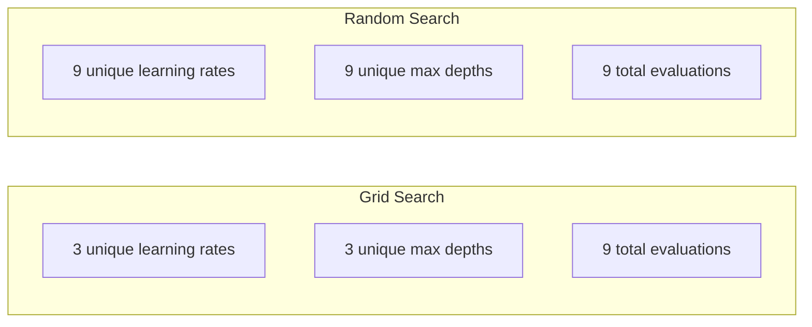
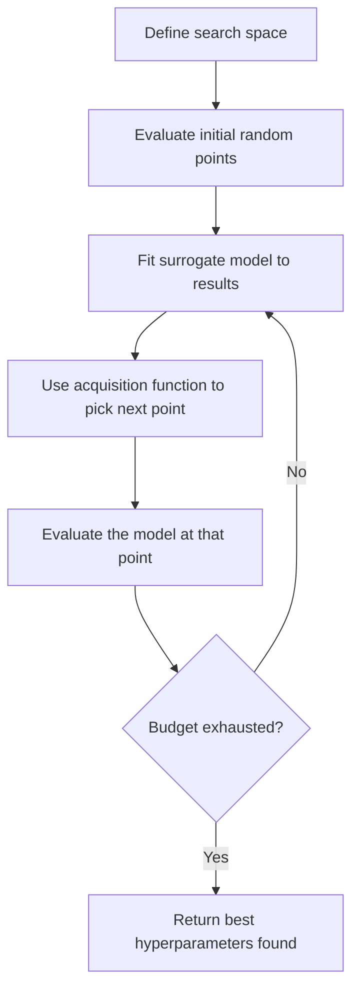
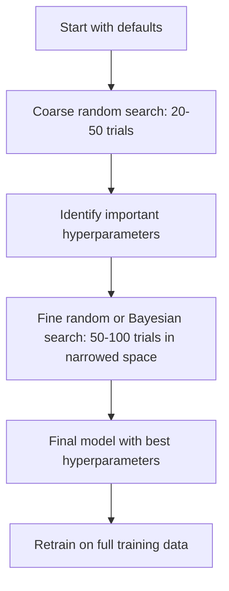
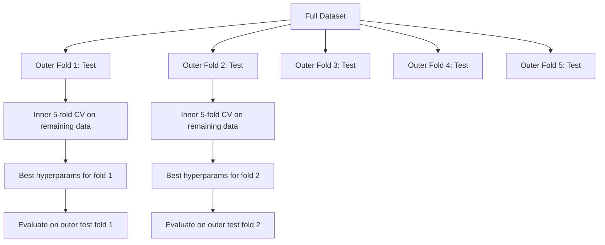

# हाइपरपरपरमीटर ट्यूनिंग

> हाइपरपरपैरामीटर वो बटन हैं जिन्हें आप ट्रेनिंग शुरू करने से पहले घुमाते हैं। उन्हें अच्छी तरह घुमाकर एक मध्यम मॉडल और एक महान मॉडल के बीच अंतर है।

**Type:** Build
**Language:**पायथन
**Prerequisites:** Phase 2, Lesson 11 (Ensemble Methods)
**Time:** ~90 minutes

## सीखने के लक्ष्य

- ग्रिड खोज, यादृच्छिक खोज और बेयसियन अनुकूलन को खरोंच से लागू करें और उनके नमूना दक्षता की तुलना करें
- समझाएं कि क्यों यादृच्छिक खोज ग्रिड खोज से बेहतर प्रदर्शन करती है जब अधिकांश हाइपरपैरामीटर में कम प्रभावी आयामता होती है
- खोज का मार्गदर्शन करने के लिए एक सरोगेट मॉडल और अधिग्रहण समारोह का उपयोग करके बेयसियन अनुकूलन लूप बनाएं
- एक हाइपरपरपरमीटर ट्यूनिंग रणनीति डिजाइन करें जो उचित क्रॉस-वैलिडेशन के माध्यम से सत्यापन सेट को ओवरफिट करने से बचें

## समस्या

आपके ग्रेडिएंट बूस्टिंग मॉडल में सीखने की दर, पेड़ों की संख्या, अधिकतम गहराई, प्रति पत्ती न्यूनतम नमूने, उप-समुदा अनुपात और कॉलम नमूना अनुपात है। यह छह हाइपरपैरामीटर है। यदि प्रत्येक में 5 उचित मान हैं, तो ग्रिड में 5^6 = 15,625 संयोजन हैं। प्रत्येक को प्रशिक्षित करने में 10 सेकंड लगते हैं। यह सभी को आजमाने के लिए 43 घंटे का गणना है।

ग्रिड खोज स्पष्ट दृष्टिकोण है और पैमाने पर सबसे खराब है। यादृच्छिक खोज कम गणना के साथ बेहतर करती है। बीएशियन अनुकूलन पिछले मूल्यांकन से सीखने से और भी बेहतर करता है। कौन सी रणनीति का उपयोग करना है, और कौन से हाइपरपैरामीटर वास्तव में मायने रखते हैं, यह जानना जीपीयू समय के दिनों को बर्बाद करता है।

## अवधारणा

### पैरामीटर बनाम हाइपरपरपरमीटर

प्रशिक्षण के दौरान पैरामीटर (वेट, पूर्वाग्रह, विभाजित सीमाएं) सीखते हैं। प्रशिक्षण शुरू होने से पहले हाइपरपरपरमीटर सेट किए जाते हैं और सीखने के तरीके को नियंत्रित करते हैं।

| Hyperparameter | What it controls | Typical range |
|---------------|-----------------|---------------|
| Learning rate | Step size per update | 0.001 to 1.0 |
| Number of trees/epochs | How long to train | 10 to 10,000 |
| Max depth | Model complexity | 1 to 30 |
| Regularization (lambda) | Overfitting prevention | 0.0001 to 100 |
| Batch size | Gradient estimation noise | 16 to 512 |
| Dropout rate | Fraction of neurons dropped | 0.0 to 0.5 |

### ग्रिड खोज

ग्रिड खोज निर्दिष्ट मानों के प्रत्येक संयोजन का मूल्यांकन करती है। यह पूरी तरह से और समझने में आसान है, लेकिन हाइपरपैरामीटर की संख्या के साथ तेजी से पैमाने पर होता है।

```
Grid for 2 hyperparameters:

  learning_rate: [0.01, 0.1, 1.0]
  max_depth:     [3, 5, 7]

  Evaluations: 3 x 3 = 9 combinations

  (0.01, 3)  (0.01, 5)  (0.01, 7)
  (0.1,  3)  (0.1,  5)  (0.1,  7)
  (1.0,  3)  (1.0,  5)  (1.0,  7)
```

ग्रिड खोज में एक मौलिक दोष हैः यदि एक हाइपरपैरामीटर महत्वपूर्ण है और दूसरा नहीं, तो अधिकांश मूल्यांकन व्यर्थ हैं। आपको 9 मूल्यांकन से महत्वपूर्ण पैरामीटर के केवल 3 अद्वितीय मान प्राप्त होते हैं।

### यादृच्छिक खोज

यादृच्छिक खोज नमूनाओं एक ग्रिड के बजाय वितरण से हाइपरपैरामीटर। 9 मूल्यांकन के एक ही बजट के साथ, आप प्रत्येक हाइपरपैरामीटर के 9 अद्वितीय मान प्राप्त करते हैं।



क्यों यादृच्छिक ग्रिड से हराता है (Bergstra & Bengio, 2012):

- अधिकांश हाइपरपरपैरामीटर में कम प्रभावी आयाम होता है। किसी दिए गए समस्या के लिए आमतौर पर 6 हाइपरपैरामीटर में से केवल 1-2 ही मायने रखते हैं।
- ग्रिड खोज अपशिष्ट मूल्यांकन पर महत्वहीन आयामों पर।
- यादृच्छिक खोज एक ही बजट के लिए महत्वपूर्ण आयामों को अधिक घने रूप से कवर करती है।
- 60 यादृच्छिक परीक्षणों में, आपके पास खोज स्थान में एक बिंदु (यदि कोई मौजूद है) के 5% के भीतर एक बिंदु खोजने की 95% संभावना है।

### बेयसियन अनुकूलन

यादृच्छिक खोज परिणामों को अनदेखा करती है। यह नहीं सीखती है कि उच्च सीखने की दर विचलन का कारण बनती है या कि गहराई 3 लगातार गहराई 10 से बेहतर प्रदर्शन करती है। बेयिसियन अनुकूलन पिछले मूल्यांकन का उपयोग यह तय करने के लिए करता है कि आगे कहां खोजें।



दो प्रमुख घटक:

**Surrogate model:**एक सस्ता-की-मूल्यांकन मॉडल (आमतौर पर एक गाउसियन प्रक्रिया) जो महंगी उद्देश्य समारोह के करीब है। यह खोज स्थान में किसी भी बिंदु पर एक भविष्यवाणी और अनिश्चितता अनुमान दोनों देता है।

**Acquisition function:**यह निर्णय लेता है कि आगे किस क्षेत्र का मूल्यांकन किया जाए, शोषण (ज्ञात अच्छे बिंदुओं के पास खोज) और अन्वेषण (अस्थिरता उच्च स्थानों पर खोज) को संतुलित करके।

- **Expected Improvement (EI):**वर्तमान में बेहतर होने के मुकाबले हम इस बिंदु पर कितना सुधार की उम्मीद करते हैं?
- **Upper Confidence Bound (UCB):**भविष्यवाणी और अनिश्चितता का गुणक। उच्चतम UCB का अर्थ है या तो आशाजनक या अन्वेषण नहीं किया गया।
- **Probability of Improvement (PI):**वर्तमान में सबसे अच्छा से इस बिंदु की संभावना क्या है?

बेयसियन अनुकूलन आमतौर पर 2-5 गुना कम मूल्यांकन के साथ यादृच्छिक खोज की तुलना में बेहतर हाइपरपैरामीटर पाता है। वास्तविक मॉडल को प्रशिक्षित करने की तुलना में सरोगेट मॉडल को फिट करने की ओवरहेड नगण्य है।

### जल्दी रुकना

यदि 10 युगों के बाद कोई संरचना स्पष्ट रूप से खराब है, तो इसे रोकें और आगे बढ़ें। यह हाइपरपरमैटर खोज के संदर्भ में प्रारंभिक रोक है।

रणनीतियाँ:
- **Patience-based:**यदि N लगातार काल में सत्यापन हानि में सुधार नहीं हुआ है तो रोकें
- **Median pruning:**यदि परीक्षण का मध्यवर्ती परिणाम उसी चरण में पूरा किए गए परीक्षणों के औसत से भी बदतर है तो रोकें
- **Hyperband:**कई संरचनाओं में छोटे बजट आवंटित करें, फिर सबसे अच्छे के लिए बजट में प्रगतिशील वृद्धि करें

हाइपरबैंड विशेष रूप से प्रभावी है। यह 81 कॉन्फ़िगरेशनों को 1 युग के साथ शुरू करता है, शीर्ष तिहाई रखता है, उन्हें 3 युग देता है, शीर्ष तिहाई रखता है, आदि। यह पूरे बजट के लिए सभी कॉन्फ़िगरेशनों का मूल्यांकन करने से 10-50 गुना तेज़ है।

### सीखने की दरों के अनुसूचक

सीखने की दर लगभग हमेशा सबसे महत्वपूर्ण हाइपरपैरामीटर होती है। इसे तय रखने के बजाय, कार्यक्रमकर्ता प्रशिक्षण के दौरान इसे समायोजित करते हैं।

| Scheduler | Formula | When to use |
|-----------|---------|-------------|
| Step decay | Multiply by 0.1 every N epochs | Classic CNN training |
| Cosine annealing | lr * 0.5 * (1 + cos(pi * t / T)) | Modern default |
| Warmup + decay | Linear increase then cosine decay | Transformers |
| One-cycle | Increase then decrease over one cycle | Fast convergence |
| Reduce on plateau | Reduce by factor when metric stalls | Safe default |

### हाइपरपरपरमीटर महत्व

सभी हाइपरपरपैरामीटर समान रूप से महत्वपूर्ण नहीं हैं। यादृच्छिक वनों (Probst et al., 2019) और ग्रेडिएंट बूस्टिंग पर शोध एक समान पैटर्न दिखाता हैः

**High importance:**
- सीखने की दर (हमेशा पहले ट्यून करें)
- अनुमानक/युगों की संख्या (ट्यूनिंग के बजाय जल्दी रुकने का उपयोग करें)
- नियमन शक्ति

**Medium importance:**
- अधिकतम गहराई / परतों की संख्या
- प्रति पत्ती/वजन क्षय प्रति न्यूनतम नमूने
- उप-समुदा अनुपात

**Low importance:**
- अधिकतम विशेषताएं (संदिग्ध वनों के लिए)
- विशिष्ट सक्रियण फ़ंक्शन विकल्प
- बैच का आकार (अनुचित सीमा के भीतर)

सबसे पहले महत्वपूर्ण लोगों को ट्यून करें, बाकी डिफ़ॉल्ट पर छोड़ दें।

### व्यावहारिक रणनीति



कंक्रीट कार्यप्रवाहः

1. **Start with library defaults.**उन्हें अनुभवी चिकित्सकों द्वारा चुना जाता है और अक्सर 80% तक पहुंच जाते हैं।
2. **Coarse random search.**बड़ी रेंज, 20-50 परीक्षण. जल्दी रुकने का उपयोग खराब रन को मारने के लिए तेजी से.
3. **Analyze results.**कौन से हाइपरपरपैरामीटर प्रदर्शन से संबंधित हैं? खोज स्थान को संकुचित करें।
4. **Fine search.**बेयसियन अनुकूलन या संकीर्ण अंतरिक्ष में केंद्रित यादृच्छिक खोज. 50-100 परीक्षण.
5. **Retrain on all training data**सबसे अच्छा हाइपरपरपैरामीटर पाया गया है।

### क्रॉस-वैलिडेशन एकीकरण

एक ही सत्यापन विभाजन पर हाइपरपैरामीटर को ट्यूनिंग करना जोखिम भरा है। सबसे अच्छे हाइपरपैरामीटर विशिष्ट सत्यापन तह के लिए ओवरफाइट हो सकते हैं। घोंसले गए क्रॉस-वैलिडेशन दो लूप का उपयोग करके इसे हल करता हैः

- **Outer loop**(मूल्यांकन): डेटा को ट्रेन+वैल और टेस्ट में विभाजित करता है। निष्पक्ष प्रदर्शन की रिपोर्ट करता है।
- **Inner loop**(ट्यूनिंग): ट्रेन+वॉल को ट्रेन और वॉल में विभाजित करता है। सबसे अच्छा हाइपरपरपैरामीटर ढूंढता है।



प्रत्येक बाहरी तह स्वतंत्र रूप से अपने सर्वश्रेष्ठ हाइपरपैरामीटर ढूंढता है। बाहरी स्कोर सामान्यीकरण प्रदर्शन का एक निष्पक्ष अनुमान है।

स्क्लेयरन के साथः

```python
from sklearn.model_selection import cross_val_score, GridSearchCV
from sklearn.ensemble import GradientBoostingRegressor

inner_cv = GridSearchCV(
    GradientBoostingRegressor(),
    param_grid={
        "learning_rate": [0.01, 0.05, 0.1],
        "max_depth": [2, 3, 5],
        "n_estimators": [50, 100, 200],
    },
    cv=5,
    scoring="neg_mean_squared_error",
)

outer_scores = cross_val_score(
    inner_cv, X, y, cv=5, scoring="neg_mean_squared_error"
)

print(f"Nested CV MSE: {-outer_scores.mean():.4f} +/- {outer_scores.std():.4f}")
```

यह महंगा है (5 बाहरी फोल्ड x 5 आंतरिक फोल्ड x 27 ग्रिड अंक = 675 मॉडल फिट) लेकिन यह आपको एक विश्वसनीय प्रदर्शन अनुमान देता है। कागजात में अंतिम परिणामों की रिपोर्ट करते समय या जब निर्णय का दांव उच्च होता है तो इसका उपयोग करें।

### व्यावहारिक सुझाव

**Start with the learning rate.**यह हमेशा ग्रेडिएंट आधारित तरीकों के लिए सबसे महत्वपूर्ण हाइपरपैरामीटर होता है। खराब सीखने की दर बाकी सब कुछ अप्रासंगिक बना देती है। अन्य हाइपरपैरामीटर डिफ़ॉल्ट पर ठीक करें और पहले सीखने की दर को साफ करें।

**Use log-uniform distributions for learning rate and regularization.**0.001 और 0.01 के बीच अंतर उतना ही मायने रखता है जितना 0.1 और 1.0 के बीच अंतर।

**Use early stopping instead of tuning n_estimators.**बूस्टिंग और न्यूरल नेटवर्क के लिए, n_estimators या epochs उच्च सेट करें और जल्दी रुकने से यह तय हो जाता है कि कब रुकना है। यह खोज से एक हाइपरपैरामीटर को हटा देता है।

**Budget allocation.**अपने ट्यूनिंग बजट का 60% शीर्ष 2 सबसे महत्वपूर्ण हाइपरपैरामीटर पर खर्च करें। शेष 40% बाकी सब कुछ पर खर्च करें। शीर्ष 2 प्रदर्शन भिन्नता के अधिकांश का खाता है।

**Scale matters.**लॉग स्केल (16, 32, 64 ठीक हैं) पर कभी भी बैच आकार की खोज न करें। हमेशा लॉग स्केल पर सीखने की दर की खोज करें। खोज वितरण को उस तरह से मिलाएं कि हाइपरपरमैटर मॉडल को कैसे प्रभावित करता है।

| Model Type | Top Hyperparameters | Recommended Search | Budget |
|-----------|--------------------|--------------------|--------|
| Random Forest | n_estimators, max_depth, min_samples_leaf | Random search, 50 trials | Low (fast training) |
| Gradient Boosting | learning_rate, n_estimators, max_depth | Bayesian, 100 trials + early stopping | Medium |
| Neural Network | learning_rate, weight_decay, batch_size | Bayesian or random, 100+ trials | High (slow training) |
| SVM | C, gamma (RBF kernel) | Grid on log scale, 25-50 trials | Low (2 params) |
| Lasso/Ridge | alpha | 1D search on log scale, 20 trials | Very low |
| XGBoost | learning_rate, max_depth, subsample, colsample | Bayesian, 100-200 trials + early stopping | Medium |

**When in doubt:**परीक्षणों के रूप में हाइपरपरपैरामीटर की संख्या के 2x के साथ यादृच्छिक खोज (उदाहरण के लिए, 6 हाइपरपैरामीटर = 12+ परीक्षण न्यूनतम) आप आश्चर्यचकित होंगे कि 50 परीक्षणों के साथ यादृच्छिक खोज सावधानीपूर्वक डिज़ाइन किए गए ग्रिड खोज से कितनी बार होती है।

```figure
k-fold-cv
```

## इसे बनाओ

### चरण 1: खरोंच से ग्रिड खोजें

कोड में `code/tuning.py`ग्रिड खोज, यादृच्छिक खोज, और एक सरल बेयसियन अनुकूलक को खरोंच से लागू करता है।

```python
def grid_search(model_fn, param_grid, X_train, y_train, X_val, y_val):
    keys = list(param_grid.keys())
    values = list(param_grid.values())
    best_score = -float("inf")
    best_params = None
    n_evals = 0

    for combo in itertools.product(*values):
        params = dict(zip(keys, combo))
        model = model_fn(**params)
        model.fit(X_train, y_train)
        score = evaluate(model, X_val, y_val)
        n_evals += 1

        if score > best_score:
            best_score = score
            best_params = params

    return best_params, best_score, n_evals
```

### चरण 2: स्क्रैच से यादृच्छिक खोज

```python
def random_search(model_fn, param_distributions, X_train, y_train,
                  X_val, y_val, n_iter=50, seed=42):
    rng = np.random.RandomState(seed)
    best_score = -float("inf")
    best_params = None

    for _ in range(n_iter):
        params = {k: sample(v, rng) for k, v in param_distributions.items()}
        model = model_fn(**params)
        model.fit(X_train, y_train)
        score = evaluate(model, X_val, y_val)

        if score > best_score:
            best_score = score
            best_params = params

    return best_params, best_score, n_iter
```

### चरण 3: बेयिसियन अनुकूलन (सरलीकृत)

मूल विचारः अवलोकन किए गए (हाइपरमैटर, स्कोर) जोड़े के लिए एक गौशियन प्रक्रिया को फिट करें, फिर एक अधिग्रहण फ़ंक्शन का उपयोग यह तय करने के लिए करें कि आगे कहां देखना है।

```python
class SimpleBayesianOptimizer:
    def __init__(self, search_space, n_initial=5):
        self.search_space = search_space
        self.n_initial = n_initial
        self.X_observed = []
        self.y_observed = []

    def _kernel(self, x1, x2, length_scale=1.0):
        dists = np.sum((x1[:, None, :] - x2[None, :, :]) ** 2, axis=2)
        return np.exp(-0.5 * dists / length_scale ** 2)

    def _fit_gp(self, X_new):
        X_obs = np.array(self.X_observed)
        y_obs = np.array(self.y_observed)
        y_mean = y_obs.mean()
        y_centered = y_obs - y_mean

        K = self._kernel(X_obs, X_obs) + 1e-4 * np.eye(len(X_obs))
        K_star = self._kernel(X_new, X_obs)

        L = np.linalg.cholesky(K)
        alpha = np.linalg.solve(L.T, np.linalg.solve(L, y_centered))
        mu = K_star @ alpha + y_mean

        v = np.linalg.solve(L, K_star.T)
        var = 1.0 - np.sum(v ** 2, axis=0)
        var = np.maximum(var, 1e-6)

        return mu, var

    def _expected_improvement(self, mu, var, best_y):
        sigma = np.sqrt(var)
        z = (mu - best_y) / (sigma + 1e-10)
        ei = sigma * (z * norm_cdf(z) + norm_pdf(z))
        return ei

    def suggest(self):
        if len(self.X_observed) < self.n_initial:
            return sample_random(self.search_space)

        candidates = [sample_random(self.search_space) for _ in range(500)]
        X_cand = np.array([to_vector(c) for c in candidates])
        mu, var = self._fit_gp(X_cand)
        ei = self._expected_improvement(mu, var, max(self.y_observed))
        return candidates[np.argmax(ei)]

    def observe(self, params, score):
        self.X_observed.append(to_vector(params))
        self.y_observed.append(score)
```

GP सरोगेट प्रत्येक उम्मीदवार बिंदु पर दो चीजें देता हैः एक पूर्वानुमानित स्कोर (mu) और एक अनिश्चितता (var) । अपेक्षित सुधार इन संतुलनः यह उन बिंदुओं को पसंद करता है जहां मॉडल उच्च स्कोर या जहां अनिश्चितता उच्च है। शुरुआत में, अधिकांश बिंदुओं में उच्च अनिश्चितता होती है इसलिए अनुकूलक खोजता है। बाद में, यह सबसे आशाजनक क्षेत्र पर केंद्रित होता है।

### चरण 4: सभी तरीकों की तुलना करें

एक ही सिंथेटिक उद्देश्य पर सभी तीन तरीकों को चलाएं और तुलना करें। यह तुलना एक सरलीकृत रैपर का उपयोग करती है जो प्रत्येक अनुकूलक को प्रत्यक्ष उद्देश्य समारोह (कोई मॉडल प्रशिक्षण) के साथ बुलाती है, इसलिए एपीआई ऊपर मॉडल-आधारित कार्यान्वयन से भिन्न हैः

```python
def synthetic_objective(params):
    lr = params["learning_rate"]
    depth = params["max_depth"]
    return -(np.log10(lr) + 2) ** 2 - (depth - 4) ** 2 + 10

param_grid = {
    "learning_rate": [0.001, 0.01, 0.1, 1.0],
    "max_depth": [2, 3, 4, 5, 6, 7, 8],
}

grid_best = None
grid_score = -float("inf")
grid_history = []
for combo in itertools.product(*param_grid.values()):
    params = dict(zip(param_grid.keys(), combo))
    score = synthetic_objective(params)
    grid_history.append((params, score))
    if score > grid_score:
        grid_score = score
        grid_best = params

param_dist = {
    "learning_rate": ("log_float", 0.001, 1.0),
    "max_depth": ("int", 2, 8),
}

rand_best = None
rand_score = -float("inf")
rand_history = []
rng = np.random.RandomState(42)
for _ in range(28):
    params = {k: sample(v, rng) for k, v in param_dist.items()}
    score = synthetic_objective(params)
    rand_history.append((params, score))
    if score > rand_score:
        rand_score = score
        rand_best = params

optimizer = SimpleBayesianOptimizer(param_dist, n_initial=5)
bayes_history = []
for _ in range(28):
    params = optimizer.suggest()
    score = synthetic_objective(params)
    optimizer.observe(params, score)
    bayes_history.append((params, score))
bayes_score = max(s for _, s in bayes_history)

print(f"{'Method':<20} {'Best Score':>12} {'Evaluations':>12}")
print("-" * 50)
print(f"{'Grid Search':<20} {grid_score:>12.4f} {len(grid_history):>12}")
print(f"{'Random Search':<20} {rand_score:>12.4f} {len(rand_history):>12}")
print(f"{'Bayesian Opt':<20} {bayes_score:>12.4f} {len(bayes_history):>12}")
```

एक ही बजट के साथ, बेयसियन अनुकूलन आमतौर पर सबसे अच्छा स्कोर सबसे तेजी से पाता है क्योंकि यह स्पष्ट रूप से खराब क्षेत्रों में मूल्यांकन को बर्बाद नहीं करता है। यादृच्छिक खोज ग्रिड खोज की तुलना में अधिक जमीन को कवर करती है। ग्रिड खोज केवल तब जीतती है जब आपके पास बहुत कम हाइपरपैरामीटर होते हैं और पूरी तरह से हो सकते हैं।

## इसका प्रयोग करें

### अभ्यास में ओप्टुना

ओप्टुना गंभीर हाइपरपरपरमीटर ट्यूनिंग के लिए अनुशंसित पुस्तकालय है। यह कटिंग, वितरित खोज और बॉक्स से बाहर दृश्य बनाने का समर्थन करता है।

```python
import optuna

def objective(trial):
    lr = trial.suggest_float("learning_rate", 1e-4, 1e-1, log=True)
    n_est = trial.suggest_int("n_estimators", 50, 500)
    max_depth = trial.suggest_int("max_depth", 2, 10)

    model = GradientBoostingRegressor(
        learning_rate=lr,
        n_estimators=n_est,
        max_depth=max_depth,
    )
    model.fit(X_train, y_train)
    return mean_squared_error(y_val, model.predict(X_val))

study = optuna.create_study(direction="minimize")
study.optimize(objective, n_trials=100)

print(f"Best params: {study.best_params}")
print(f"Best MSE: {study.best_value:.4f}")
```

Optuna की प्रमुख विशेषताएं:
- `suggest_float(..., log=True)`लॉग स्केल पर सबसे अच्छा खोज किए गए पैरामीटर (लर्निंग रेट, नियमितता) के लिए
- `suggest_int`पूर्णांक मापदंडों के लिए
- `suggest_categorical`विवश विकल्पों के लिए
- खराब परीक्षणों को जल्दी रोकने के लिए अंतर्निहित मीडियनप्रूनर
- `study.trials_dataframe()`विश्लेषण के लिए

### कटाई के साथ ओप्टुना

काटने से अप्रत्याशित परीक्षण जल्दी से बंद हो जाते हैं, जिससे बड़े पैमाने पर गणना बच जाती है।

```python
import optuna
from sklearn.model_selection import cross_val_score

def objective(trial):
    params = {
        "learning_rate": trial.suggest_float("lr", 1e-4, 0.5, log=True),
        "max_depth": trial.suggest_int("max_depth", 2, 10),
        "n_estimators": trial.suggest_int("n_estimators", 50, 500),
        "subsample": trial.suggest_float("subsample", 0.5, 1.0),
    }

    model = GradientBoostingRegressor(**params)
    scores = cross_val_score(model, X_train, y_train, cv=3,
                             scoring="neg_mean_squared_error")
    mean_score = -scores.mean()

    trial.report(mean_score, step=0)
    if trial.should_prune():
        raise optuna.TrialPruned()

    return mean_score

pruner = optuna.pruners.MedianPruner(n_startup_trials=10, n_warmup_steps=5)
study = optuna.create_study(direction="minimize", pruner=pruner)
study.optimize(objective, n_trials=200)
```

`MedianPruner`यदि एक ही चरण में सभी पूर्ण परीक्षणों के मध्यवर्ती मूल्य से भी बदतर है तो परीक्षण को रोकता है।`trial.report()`मध्यवर्ती मापकों की रिपोर्ट करने के लिए और `trial.should_prune()`जांच करने के लिए कि क्या परीक्षण को रोकना चाहिए।`n_startup_trials=10`यह सुनिश्चित करता है कि कम से कम 10 परीक्षण पूरी तरह से कटिंग शुरू होने से पहले पूरा हो जाएं। यह आमतौर पर कुल गणना का 40-60% बचाता है।

### sklearn के अंतर्निहित ट्यूनेर

त्वरित प्रयोगों के लिए, sklearn प्रदान करता है `GridSearchCV`,`RandomizedSearchCV`और `HalvingRandomSearchCV`:

```python
from sklearn.model_selection import RandomizedSearchCV
from scipy.stats import loguniform, randint

param_dist = {
    "learning_rate": loguniform(1e-4, 0.5),
    "max_depth": randint(2, 10),
    "n_estimators": randint(50, 500),
}

search = RandomizedSearchCV(
    GradientBoostingRegressor(),
    param_dist,
    n_iter=100,
    cv=5,
    scoring="neg_mean_squared_error",
    random_state=42,
    n_jobs=-1,
)
search.fit(X_train, y_train)
print(f"Best params: {search.best_params_}")
print(f"Best CV MSE: {-search.best_score_:.4f}")
```

उपयोग करें`loguniform`शिक्षा दर और नियमितता के लिए स्किप से।`randint`पूर्णांक हाइपरपरपरमीटर्स के लिए।`n_jobs=-1`सभी सीपीयू कोर पर ध्वज समानांतर है।

### हाइपरपरपरमीटर ट्यूनिंग में आम गलतियां

**Data leakage through preprocessing.**यदि आप क्रॉस-वैलिडेशन से पहले पूरे डेटासेट पर स्केलर को फिट करते हैं, तो वैलिडेशन फोल्ड से जानकारी प्रशिक्षण में लीक हो जाती है। हमेशा पूर्व प्रसंस्करण को एक `Pipeline`इसलिए यह केवल प्रशिक्षण तह पर फिट है।

**Overfitting to the validation set.**हजारों परीक्षणों को चलाने से सत्यापन सेट पर प्रभावी ढंग से प्रशिक्षण मिलता है। अंतिम प्रदर्शन अनुमानों के लिए घोंसले गए क्रॉस-वैलिडेशन का उपयोग करें, या एक अलग परीक्षण सेट रखें जिसे आप ट्यूनिंग के दौरान कभी भी छू नहीं सकते हैं।

**Searching too narrow a range.**यदि आपका सबसे अच्छा मान आपके खोज स्थान की सीमा पर है, तो आपने पर्याप्त रूप से खोज नहीं की है। इष्टतम मूल्य आपकी सीमा से बाहर हो सकता है। हमेशा जांचें कि क्या सबसे अच्छे पैरामीटर किनारों पर हैं।

**Ignoring interaction effects.**सीखने की दर और अनुमानकों की संख्या को बढ़ावा देने में मजबूत रूप से बातचीत होती है। कम सीखने की दर को अधिक अनुमानकों की आवश्यकता होती है। उन्हें स्वतंत्र रूप से समायोजित करने से उन्हें एक साथ समायोजित करने की तुलना में बदतर परिणाम होते हैं।

**Not using early stopping for iterative models.**ग्रेडिएंट बूस्टिंग और न्यूरल नेटवर्क के लिए, n_estimators या epochs को उच्च मान पर सेट करें और जल्दी रुकना का उपयोग करें। यह हाइपरपरमैटर के रूप में पुनरावृत्ति की संख्या को समायोजित करने से सख्ती से बेहतर है।

## व्यायाम

1. ग्रिड खोज और समान कुल बजट (जैसे, 50 मूल्यांकन) के साथ यादृच्छिक खोज चलाएं। सबसे अच्छा स्कोर की तुलना करें। विभिन्न बीज के साथ प्रयोग 10 बार चलाएं। यादृच्छिक खोज कितनी बार जीतती है?

2. हाइपरबैंड को खरोंच से लागू करें। 81 कॉन्फ़िगरेशन से शुरू करें, प्रत्येक 1 युग के लिए प्रशिक्षित। प्रत्येक दौर में शीर्ष 1/3 रखें और अपने बजट को तीन गुना करें। कुल गणना (सभी युगों के योग) की तुलना करें। सभी कॉन्फ़िग के लिए 81 कॉन्फ़िग को पूरा बजट के लिए चलाएं।

3. पाठ 11 से क्रियान्वयन को बढ़ावा देने वाले ग्रेडिएंट में सीखने की दर शेड्यूलर (कोसिन एनेलिंग) जोड़ें। क्या यह एक निश्चित सीखने की दर की तुलना में मददगार है?

4. वास्तविक डेटासेट (जैसे, sklearn के स्तन कैंसर डेटासेट) पर एक RandomForestClassifier को ट्यून करने के लिए Optuna का उपयोग करें।`optuna.visualization.plot_param_importances(study)`क्या यह इस पाठ से महत्व रैंकिंग के अनुरूप है?

5. एक सरल अधिग्रहण फ़ंक्शन (अपेक्षित सुधार) को लागू करें और अन्वेषण बनाम शोषण का प्रदर्शन करें। सरोगेट मॉडल के औसत और अनिश्चितता का पता लगाएं, और दिखाएं कि ईआई अगला मूल्यांकन कहां करना चाहता है।

## प्रमुख शर्तें

| Term | What people say | What it actually means |
|------|----------------|----------------------|
| Hyperparameter | "A setting you choose" | A value set before training that controls the learning process, not learned from data |
| Grid search | "Try every combination" | Exhaustive search over a specified parameter grid. Exponential cost. |
| Random search | "Just sample randomly" | Sample hyperparameters from distributions. Covers important dimensions better than grid search. |
| Bayesian optimization | "Smart search" | Uses a surrogate model of the objective to decide where to evaluate next, balancing exploration and exploitation |
| Surrogate model | "A cheap approximation" | A model (usually Gaussian process) that approximates the expensive objective function from observed evaluations |
| Acquisition function | "Where to look next" | Scores candidate points by balancing expected improvement with uncertainty. EI and UCB are common choices. |
| Early stopping | "Stop wasting time" | Terminate training early when validation performance stops improving |
| Hyperband | "Tournament bracket for configs" | Adaptive resource allocation: start many configs with small budgets, keep the best and increase their budgets |
| Learning rate scheduler | "Change lr during training" | A function that adjusts the learning rate over the course of training for better convergence |

## आगे पढ़ना

- [Bergstra & Bengio: Random Search for Hyper-Parameter Optimization (2012)](https://jmlr.org/papers/v13/bergstra12a.html)-- कागज जो यादृच्छिक धड़कन ग्रिड दिखाया
- [Snoek et al., Practical Bayesian Optimization of Machine Learning Algorithms (2012)](https://arxiv.org/abs/1206.2944)-- एमएल के लिए बेयसियन अनुकूलन
- [Li et al., Hyperband: A Novel Bandit-Based Approach (2018)](https://jmlr.org/papers/v18/16-558.html)-- हाइपरबैंड पेपर
- [Optuna: A Next-generation Hyperparameter Optimization Framework](https://arxiv.org/abs/1907.10902)-- ओप्टुना पेपर
- [Probst et al., Tunability: Importance of Hyperparameters (2019)](https://jmlr.org/papers/v20/18-444.html)-- कौन से हाइपरपरपैरामीटर मायने रखते हैं
