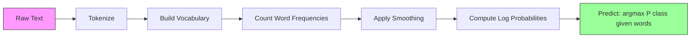

# साफ़ बेय

> "नाविच" धारणा गलत है, और यह वैसे भी काम करता है. यही इसकी सुंदरता है.

**Type:** Build
**Language:**पायथन
**Prerequisites:** Phase 2, Lessons 01-07 (classification, Bayes' theorem)
**Time:** ~75 minutes

## सीखने के लक्ष्य

- पाठ वर्गीकरण के लिए लैपलेस चिकनाई के साथ मल्टीनोमीअल नाईव बेय को खरोंच से लागू करें
- समझाएं कि क्यों साफ़-साफ़ स्वतंत्रता धारणा गणितीय रूप से गलत है लेकिन व्यवहार में सही वर्ग रैंकिंग का उत्पादन करती है
- मल्टीनोमीअल, बर्नौली और गौशियन नाइव बेय के संस्करणों की तुलना करें और किसी दिए गए विशेषता प्रकार के लिए सही एक का चयन करें
- उच्च-आयामी दुर्लभ डेटा पर लॉजिस्टिक प्रतिगमन के खिलाफ नाइव बेय का मूल्यांकन करें और काम पर पूर्वाग्रह-वियरिएंस ट्रेडऑफ की व्याख्या करें

## समस्या

आपको पाठ को वर्गीकृत करने की आवश्यकता है। ईमेल को स्पैम या गैर-स्पैम में। ग्राहक समीक्षा को सकारात्मक या नकारात्मक में। समर्थन टिकट को श्रेणियों में। आपके पास हजारों सुविधाएं (एक शब्द) और सीमित प्रशिक्षण डेटा हैं।

अधिकांश वर्गीकरणकर्ता यहां चक्कर लगाते हैं। लॉजिस्टिक रिग्रेशन को हजारों वजनों का विश्वसनीय रूप से अनुमान लगाने के लिए पर्याप्त नमूने की आवश्यकता होती है। निर्णय के पेड़ एक शब्द में एक बार में विभाजित होते हैं और जंगली रूप से ओवरफिट होते हैं। 10,000 आयामों में KNN का कोई मतलब नहीं है क्योंकि प्रत्येक बिंदु अन्य सभी बिंदुओं से समान रूप से दूर है।

साफ़ बेयज इस पर काम करता है. यह एक गणितीय रूप से गलत धारणा बनाता है (कि प्रत्येक विशेषता वर्ग के अनुसार प्रत्येक अन्य विशेषता से स्वतंत्र है), और यह अभी भी पाठ वर्गीकरण पर "स्मार्ट" मॉडल से बेहतर प्रदर्शन करता है, खासकर छोटे प्रशिक्षण सेट के साथ। यह एक ही पास में डेटा के माध्यम से ट्रेन करता है। यह लाखों सुविधाओं तक स्केल करता है। यह संभावना अनुमानों का उत्पादन करता है (हालांकि स्वतंत्रता परिकल्पना के कारण अक्सर खराब रूप से मापा जाता है) ।

यह समझना कि गलत धारणा अच्छी भविष्यवाणियों के कारण क्यों होती है आपको मशीन लर्निंग के बारे में कुछ मौलिक सिखाता हैः सबसे अच्छा मॉडल सबसे सही नहीं है, यह आपके डेटा के लिए सबसे अच्छा पूर्वाग्रह-विभिन्नता व्यापार है।

## अवधारणा

### बेयज़ का प्रमेय (क्विक रिव्यू)

बेयज़ का प्रमेय सशर्त संभावनाओं को उलट देता हैः

```
P(class | features) = P(features | class) * P(class) / P(features)
```

हम चाहते हैं`P(class | features)`-- एक दस्तावेज़ के वर्ग से संबंधित होने की संभावना उसके शब्दों को देखते हुए। हम इसे गणना कर सकते हैंः
- `P(features | class)`-- इस वर्ग के दस्तावेजों में इन शब्दों को देखने की संभावना
- `P(class)`-- वर्ग की पूर्व संभावना (सामान्य रूप से स्पैम कितना आम है?
- `P(features)`-- सबूत, सभी वर्गों के लिए एक ही, तो हम तुलना करते समय इसे अनदेखा कर सकते हैं

उच्चतम वर्ग के साथ `P(class | features)`जीतता है।

### साफ़-साफ़ आजादी की धारणा

कम्प्यूटिंग `P(features | class)`एक शब्दभंडार के साथ, आप एक अनुमान की जरूरत होगी वितरण पर 2 ^ 10,000 संभावित संयोजन. असंभव.

साफ़ धारणा: प्रत्येक विशेषता वर्ग को देखते हुए सशर्त रूप से स्वतंत्र है।

```
P(w1, w2, ..., wn | class) = P(w1 | class) * P(w2 | class) * ... * P(wn | class)
```

एक असंभव संयुक्त वितरण के बजाय, आप अनुमान है n सरल प्रति विशेषता वितरण. प्रत्येक केवल एक गिनती की जरूरत है.

यह धारणा स्पष्ट रूप से गलत है. "मशीन" और "लर्निंग" शब्द किसी भी दस्तावेज़ में स्वतंत्र नहीं हैं. लेकिन वर्गीकरणकर्ता को सटीक संभावना अनुमानों की आवश्यकता नहीं है। इसे सही रैंकिंग की आवश्यकता है - किस वर्ग में सबसे अधिक संभावना है। स्वतंत्रता परिकल्पना व्यवस्थित त्रुटियों को पेश करती है, लेकिन ये त्रुटियां सभी वर्गों को समान रूप से प्रभावित करती हैं, इसलिए रैंकिंग सही रहती है।

### यह आज भी क्यों काम करता है

तीन कारण:

1. **Ranking over calibration.**वर्गीकरण केवल शीर्ष रैंक वर्ग सही होने की आवश्यकता है। भले ही P(स्पैम) = 0.99999 जब वास्तविक संभावना 0.7 है, तो भी वर्गीकरणकर्ता अभी भी स्पैम सही चुनता है। हमें सही संभावनाओं की आवश्यकता नहीं है। हमें सही विजेता की आवश्यकता है।

2. **High bias, low variance.**स्वतंत्रता परिकल्पना एक मजबूत पूर्व है। यह मॉडल को बहुत सीमित करता है, जो ओवरफिटिंग को रोकता है। सीमित प्रशिक्षण डेटा के साथ, एक मॉडल जो थोड़ा गलत है लेकिन स्थिर है, सैद्धांतिक रूप से सही है लेकिन बहुत अस्थिर है। यह कार्रवाई में पूर्वाग्रह-भिन्नता व्यापार है।

3. **Feature redundancy cancels out.**संबद्ध विशेषताएं अधिमानतः सबूत प्रदान करती हैं। वर्गीकरणकर्ता इस सबूत को दोगुना गिनता है, लेकिन यह इसे सही वर्ग के लिए भी दोगुना गिनता है। यदि "मशीन" और "लर्निंग" हमेशा एक साथ दिखाई देते हैं, तो दोनों "तकनीकी" वर्ग के लिए सबूत प्रदान करते हैं। एनबी उन्हें दो बार गिनता है, लेकिन यह उन्हें सही वर्ग के लिए दो बार गिनता है।

चौथा, व्यावहारिक कारणः साफ़ बेयज़ बेहद तेज़ है। प्रशिक्षण डेटा गिनती आवृत्तियों के माध्यम से एक एकल पास है। भविष्यवाणी एक मैट्रिक्स गुणा है। आप सेकंड में एक मिलियन दस्तावेजों पर प्रशिक्षण दे सकते हैं। इस गति का मतलब है कि आप तेजी से पुनरावृत्ति कर सकते हैं, अधिक सुविधा सेट का प्रयास कर सकते हैं, और धीमी मॉडल की तुलना में अधिक प्रयोग चला सकते हैं।

### गणित कदम से कदम

आइए एक ठोस उदाहरण के माध्यम से पता लगाएं. मान लीजिए कि हमारे पास दो वर्ग हैंः स्पैम और गैर-स्पैम. हमारी शब्दावली में तीन शब्द हैंः "फ्री", "मनी", "मीटिंग"।

प्रशिक्षण के आंकड़ेः
- स्पैम ईमेल में "फ्री" 80 बार, "मनी" 60 बार, "मीटिंग" 10 बार (150 कुल शब्द)
- गैर-स्पैम ईमेल में 5 बार "फ्री" का उल्लेख है, 10 बार "पैसा" का उल्लेख है, 100 बार "मीटिंग" (115 कुल शब्द)
- 40% ईमेल स्पैम हैं, 60% गैर-स्पैम हैं

लैपलेस चिकनाई (अल्फा=1) के साथः

```
P(free | spam)    = (80 + 1) / (150 + 3) = 81/153 = 0.529
P(money | spam)   = (60 + 1) / (150 + 3) = 61/153 = 0.399
P(meeting | spam) = (10 + 1) / (150 + 3) = 11/153 = 0.072

P(free | not-spam)    = (5 + 1) / (115 + 3) = 6/118 = 0.051
P(money | not-spam)   = (10 + 1) / (115 + 3) = 11/118 = 0.093
P(meeting | not-spam) = (100 + 1) / (115 + 3) = 101/118 = 0.856
```

नए ईमेल में शामिल हैंः "मुफ्त" (2 बार), "पैसा" (1 बार), "मीटिंग" (0 बार) ।

```
log P(spam | email) = log(0.4) + 2*log(0.529) + 1*log(0.399) + 0*log(0.072)
                    = -0.916 + 2*(-0.637) + (-0.919) + 0
                    = -3.109

log P(not-spam | email) = log(0.6) + 2*log(0.051) + 1*log(0.093) + 0*log(0.856)
                        = -0.511 + 2*(-2.976) + (-2.375) + 0
                        = -8.838
```

स्पैम एक बड़े मार्जिन से जीतता है। दो बार दिखाई देने वाला शब्द "मुक्त" स्पैम के लिए मजबूत सबूत है। ध्यान दें कि "मीटिंग" नहीं दिखने से दोनों लॉग योग (0 * लॉग(पी)) में शून्य योगदान होता है - बहुपद NB में, अनुपस्थित शब्दों का कोई प्रभाव नहीं होता है। यह बर्नौली NB है जो स्पष्ट रूप से शब्द अनुपस्थिति का मॉडल है।

### तीन प्रकार

बेयज़ के तीन स्वाद हैं।`P(feature | class)`अलग तरह से।

#### बहुपद साफ़ बेय

प्रत्येक विशेषता को एक गणना के रूप में मॉडल करें। पाठ डेटा के लिए सबसे अच्छा है जहां विशेषताएं शब्द आवृत्तियां या TF-IDF मान हैं।

```
P(word_i | class) = (count of word_i in class + alpha) / (total words in class + alpha * vocab_size)
```

`alpha`यह संस्करण पाठ वर्गीकरण के लिए कार्यघड़ी है।

#### गौसीयन साफ़ बेय

मॉडल्स प्रत्येक विशेषता के रूप में एक सामान्य वितरण. निरंतर विशेषता के लिए सबसे अच्छा।

```
P(x_i | class) = (1 / sqrt(2 * pi * var)) * exp(-(x_i - mean)^2 / (2 * var))
```

प्रत्येक वर्ग को प्रत्येक विशेषता के लिए अपना औसत और भिन्नता मिलती है। यह तब अच्छा काम करता है जब विशेषताएं वास्तव में प्रत्येक वर्ग के भीतर एक बेल वक्र का पालन करती हैं।

#### बर्नौली साफ़ बेयज़

प्रत्येक विशेषता को द्विआधारी (वर्तमान या अनुपस्थित) के रूप में मॉडल। लघु पाठ या द्विआधारी विशेषता वेक्टर के लिए सबसे अच्छा।

```
P(word_i | class) = (docs in class containing word_i + alpha) / (total docs in class + 2 * alpha)
```

मल्टीनोमीअल के विपरीत, बर्नौली स्पष्ट रूप से एक शब्द की अनुपस्थिति को दंडित करता है। यदि "मुक्त" आमतौर पर स्पैम में दिखाई देता है लेकिन इस ईमेल में अनुपस्थित है, तो बर्नौली इसे स्पैम के खिलाफ सबूत के रूप में गिनता है।

### प्रत्येक संस्करण का उपयोग कब करें

| Variant | Feature Type | Best For | Example |
|---------|-------------|----------|---------|
| Multinomial | Counts or frequencies | Text classification, bag-of-words | Email spam, topic classification |
| Gaussian | Continuous values | Tabular data with normal-ish features | Iris classification, sensor data |
| Bernoulli | Binary (0/1) | Short text, binary feature vectors | SMS spam, presence/absence features |

### लैप्लेस स्लीडिंग

क्या होता है जब एक शब्द परीक्षण डेटा में दिखाई देता है लेकिन किसी विशेष वर्ग के लिए प्रशिक्षण डेटा में कभी दिखाई नहीं देता है?

बिना चिकनाई के: `P(word | class) = 0/N = 0`. एक शून्य पूरे उत्पाद में गुणा करता है `P(class | features) = 0`एक भी अदृश्य शब्द पूरे भविष्यवाणी को नष्ट कर देता है, चाहे कितने भी अन्य साक्ष्य इसे समर्थन करते हों।

लैप्लेस चिकनाई एक छोटी संख्या जोड़ती है `alpha`(आमतौर पर 1) प्रत्येक विशेषता संख्या के लिएः

```
P(word_i | class) = (count(word_i, class) + alpha) / (total_words_in_class + alpha * vocab_size)
```

अल्फा = 1 के साथ, प्रत्येक शब्द को कम से कम एक छोटी संभावना मिलती है। एक परीक्षण ईमेल में दिखाई देने वाला शब्द "डिस्कोम्बोबुलेट" स्पैम संभावना को अब नहीं मारता है। चिकनाई की एक बेयसियन व्याख्या हैः यह शब्द वितरण पर एक समान डायरिचलेट को पहले रखने के बराबर है।

उच्च अल्फा का अर्थ है मजबूत चिकनाई (अधिक समान वितरण) । निम्न अल्फा का अर्थ है कि मॉडल डेटा पर अधिक भरोसा करता है। अल्फा एक हाइपरपैरामीटर है जिसे आप ट्यून करते हैं।

अल्फा का प्रभावः

| Alpha | Effect | When to use |
|-------|--------|-------------|
| 0.001 | Almost no smoothing, trust the data | Very large training set, no unseen features expected |
| 0.1 | Light smoothing | Large training set |
| 1.0 | Standard Laplace smoothing | Default starting point |
| 10.0 | Heavy smoothing, flattens distributions | Very small training set, many unseen features expected |

### लॉग-स्पेस गणना

सैकड़ों संभावनाओं (प्रत्येक 1 से कम) को गुणा करने से फ्लोटिंग पॉइंट अंडरफ्लो होता है। वास्तविक मूल्य एक बहुत ही छोटा सकारात्मक संख्या होने के बावजूद उत्पाद फ्लोटिंग पॉइंट में शून्य हो जाता है।

समाधानः लॉग स्पेस में काम करें। संभावनाओं को गुणा करने के बजाय, उनके लॉगरिदम जोड़ेंः

```
log P(class | x1, x2, ..., xn) = log P(class) + sum_i log P(xi | class)
```

यह भविष्यवाणी को एक डॉट उत्पाद में बदल देता हैः

```
log_scores = X @ log_feature_probs.T + log_class_priors
prediction = argmax(log_scores)
```

मैट्रिक्स गुणा. यही कारण है कि साफ़ बेयज़ की भविष्यवाणी इतनी तेजी से है -- यह एक एकल-परत रैखिक मॉडल के समान ऑपरेशन है।

### साफ़ बेयज़ बनाम लॉजिस्टिक रिग्रेशन

दोनों ही पाठ के लिए रैखिक वर्गीकरण हैं। अंतर उनके मॉडल में है।

| Aspect | Naive Bayes | Logistic Regression |
|--------|------------|-------------------|
| Type | Generative (models P(X\|Y)) | Discriminative (models P(Y\|X)) |
| Training | Count frequencies | Optimize loss function |
| Small data | Better (strong prior helps) | Worse (not enough to estimate weights) |
| Large data | Worse (wrong assumption hurts) | Better (flexible boundary) |
| Features | Assumes independence | Handles correlations |
| Speed | Single pass, very fast | Iterative optimization |
| Calibration | Poor probabilities | Better probabilities |

अंगूठे का नियमः Naive Bayes से शुरू करें. यदि आपके पास पर्याप्त डेटा और NB पठार हैं, तो लॉजिस्टिक प्रतिगमन पर स्विच करें.

### वर्गीकरण पाइपलाइन



व्यावहारिक रूप से, हम लॉग स्थान में काम करते हैं फ्लोटिंग पॉइंट अंडरफ्लो से बचने के लिए। कई छोटी संभावनाओं को गुणा करने के बजाय, हम उनके लॉगरिदम जोड़ते हैंः

```
log P(class | features) = log P(class) + sum_i log P(feature_i | class)
```

```figure
naive-bayes
```

## इसे बनाओ

कोड में `code/naive_bayes.py`मल्टीनोमीअलएनबी और गौशियनएनबी दोनों को खरोंच से लागू करता है।

### बहुपदNB

स्क्रू से लागू करनाः

1. **fit(X, y)**: प्रत्येक वर्ग के लिए, प्रत्येक विशेषता की आवृत्ति गिनें। लैपलेस चिकनाई जोड़ें। लॉग संभावनाओं की गणना करें। वर्ग पूर्ववर्ती (वर्ग आवृत्तियों का लॉग) स्टोर करें।

2. **predict_log_proba(X)**: प्रत्येक नमूना के लिए, गणना लॉग P(वर्ग) + लॉग P(विशेषता_i वर्ग) के योग के लिए सभी वर्गों के लिए. यह एक मैट्रिक्स गुणांक हैः X @ log_probs.T + log_priors.

3. **predict(X)**: उच्चतम लॉग संभावना के साथ वर्ग लौटाएं।

```python
class MultinomialNB:
    def __init__(self, alpha=1.0):
        self.alpha = alpha

    def fit(self, X, y):
        classes = np.unique(y)
        n_classes = len(classes)
        n_features = X.shape[1]

        self.classes_ = classes
        self.class_log_prior_ = np.zeros(n_classes)
        self.feature_log_prob_ = np.zeros((n_classes, n_features))

        for i, c in enumerate(classes):
            X_c = X[y == c]
            self.class_log_prior_[i] = np.log(X_c.shape[0] / X.shape[0])
            counts = X_c.sum(axis=0) + self.alpha
            self.feature_log_prob_[i] = np.log(counts / counts.sum())

        return self
```

मुख्य अंतर्दृष्टिः फिट होने के बाद, भविष्यवाणी सिर्फ मैट्रिक्स गुणा और एक पूर्वाग्रह है। यही कारण है कि साफ़ बेयज़ इतनी तेजी से है।

### गौशियनNB

निरंतर विशेषताओं के लिए, हम प्रत्येक वर्ग के लिए औसत और भिन्नता का अनुमान लगाते हैंः

```python
class GaussianNB:
    def __init__(self):
        pass

    def fit(self, X, y):
        classes = np.unique(y)
        self.classes_ = classes
        self.means_ = np.zeros((len(classes), X.shape[1]))
        self.vars_ = np.zeros((len(classes), X.shape[1]))
        self.priors_ = np.zeros(len(classes))

        for i, c in enumerate(classes):
            X_c = X[y == c]
            self.means_[i] = X_c.mean(axis=0)
            self.vars_[i] = X_c.var(axis=0) + 1e-9
            self.priors_[i] = X_c.shape[0] / X.shape[0]

        return self
```

भविष्यवाणी में प्रत्येक विशेषता के लिए गौशियन पीडीएफ का उपयोग किया जाता है, जो सुविधाओं में गुणा किया जाता है (लॉग स्थान में जोड़ा जाता है) ।

### डेमोः पाठ वर्गीकरण

कोड दो वर्गों (तकनीकी लेख बनाम खेल लेख) का अनुकरण करने वाले सिंथेटिक बैग-ऑफ-वर्ड डेटा उत्पन्न करता है। प्रत्येक वर्ग में एक अलग शब्द आवृत्ति वितरण होता है। मल्टीनोमीअलएनबी उन्हें शब्द गिनती के उपयोग से वर्गीकृत करता है।

सिंथेटिक डेटा इस तरह काम करता हैः हम 200 "शब्द" (विशेषता स्तंभ) बनाते हैं। 0-39 शब्दों में तकनीकी लेखों में उच्च आवृत्ति होती है और खेल में कम होती है। 80-119 शब्दों में खेल में उच्च आवृत्ति होती है और तकनीकी में कम होती है। 40-79 शब्दों में दोनों में मध्यम आवृत्ति होती है। यह एक यथार्थवादी परिदृश्य बनाता है जहां कुछ शब्द मजबूत वर्ग संकेतक होते हैं और अन्य शोर होते हैं।

### डेमोः निरंतर विशेषताएं

कोड आईरिस-जैसे डेटा (3 वर्ग, 4 विशेषताएं, गौशियन क्लस्टर) उत्पन्न करता है। गौशियन एनबी प्रत्येक वर्ग के औसत और भिन्नता का उपयोग करके वर्गीकृत करता है। प्रत्येक वर्ग में एक अलग केंद्र (मध्यम वेक्टर) और अलग प्रसार (वियरेंस) होता है, वास्तविक दुनिया के डेटा की नकल करता है जहां माप श्रेणियों के बीच व्यवस्थित रूप से भिन्न होते हैं।

कोड यह भी प्रदर्शित करता हैः
- **Smoothing comparison:**सटीकता पर चिकनाई शक्ति के प्रभाव को दिखाने के लिए विभिन्न अल्फा मानों के साथ मल्टीनोमीअलएनबी प्रशिक्षण।
- **Training size experiment:**कैसे एनबी सटीकता में सुधार प्रशिक्षण डेटा 20 से 1600 नमूनों तक बढ़ता है। एनबी बहुत कम नमूनों के साथ भी सभ्य सटीकता तक पहुंचता है - यह इसका मुख्य लाभ है।
- **Confusion matrix:**प्रति वर्ग सटीकता, याद, और एफ 1 स्कोर को इंगित करने के लिए जहां एनबी गलतियाँ करता है।

### भविष्यवाणी गति

बेयज़ की साफ़ भविष्यवाणी एक मैट्रिक्स गुणा है। d गुणों और k वर्गों वाले n नमूनों के लिएः
- बहुपदNB: एक मैट्रिक्स गुणा (n x d) @ (d x k) = O(n * d * k)
- GaussianNB: n * k Gaussian PDF मूल्यांकन, प्रत्येक d सुविधाओं = O(n * d * k)

दोनों प्रत्येक आयाम में रैखिक हैं। इसे KNN (जिसके लिए सभी प्रशिक्षण बिंदुओं तक दूरी गणना की आवश्यकता होती है) या RBF कर्नेल (जिसके लिए सभी समर्थन वेक्टरों के खिलाफ कर्नेल मूल्यांकन की आवश्यकता होती है) के साथ SVM की तुलना करें। भविष्यवाणी समय में NB परिमाण के आदेशों द्वारा तेज़ है।

## इसका प्रयोग करें

sklearn के साथ, दोनों संस्करण एक पंक्ति के होते हैंः

```python
from sklearn.naive_bayes import GaussianNB, MultinomialNB

gnb = GaussianNB()
gnb.fit(X_train, y_train)
print(f"GaussianNB accuracy: {gnb.score(X_test, y_test):.3f}")

mnb = MultinomialNB(alpha=1.0)
mnb.fit(X_train_counts, y_train)
print(f"MultinomialNB accuracy: {mnb.score(X_test_counts, y_test):.3f}")
```

स्क्लेयरन के साथ पाठ वर्गीकरण के लिएः

```python
from sklearn.feature_extraction.text import CountVectorizer
from sklearn.naive_bayes import MultinomialNB
from sklearn.pipeline import Pipeline

text_clf = Pipeline([
    ("vectorizer", CountVectorizer()),
    ("classifier", MultinomialNB(alpha=1.0)),
])

text_clf.fit(train_texts, train_labels)
accuracy = text_clf.score(test_texts, test_labels)
```

कोड में `naive_bayes.py`सटीकता की पुष्टि करने के लिए समान डेटा पर स्क्लेयर के साथ खरोंच से कार्यान्वयन की तुलना करता है।

### टीएफ-आईडीएफ के साथ नाइव बेयज़

कच्चे शब्द गिनती प्रत्येक शब्द को प्रति घटना समान वजन देती है. लेकिन सामान्य शब्द जैसे "the" और "is" प्रत्येक वर्ग में अक्सर दिखाई देते हैं - वे कोई जानकारी नहीं रखते हैं. TF-IDF (Term Frequency - Inverse Document Frequency) सामान्य शब्दों का वजन कम करता है और दुर्लभ, भेदभावपूर्ण शब्दों का वजन बढ़ता है।

```python
from sklearn.feature_extraction.text import TfidfVectorizer
from sklearn.naive_bayes import MultinomialNB
from sklearn.pipeline import Pipeline

text_clf = Pipeline([
    ("tfidf", TfidfVectorizer()),
    ("classifier", MultinomialNB(alpha=0.1)),
])
```

TF-IDF मान गैर-नकारात्मक हैं, इसलिए वे MultinomialNB के साथ काम करते हैं। TF-IDF + MultinomialNB का संयोजन पाठ वर्गीकरण के लिए सबसे मजबूत बेसलाइनों में से एक है। यह अक्सर 10,000 से कम प्रशिक्षण नमूनों के साथ डेटासेट पर अधिक जटिल मॉडल को हराता है।

### लघु पाठ के लिए BernoulliNB

लघु पाठ (ट्वीट, एसएमएस, चैट संदेश) के लिए, बर्नौलीएनबी मल्टीनोमीअलएनबी से बेहतर प्रदर्शन कर सकता है। लघु पाठों में कम शब्द गिनती होती है, इसलिए आवृत्ति जानकारी जिस पर मल्टीनोमीअलएनबी निर्भर करता है वह शोर है। बर्नौलीएनबी केवल उपस्थिति या अनुपस्थिति की परवाह करता है, जो छोटे पाठ के साथ अधिक विश्वसनीय है।

```python
from sklearn.naive_bayes import BernoulliNB
from sklearn.feature_extraction.text import CountVectorizer

text_clf = Pipeline([
    ("vectorizer", CountVectorizer(binary=True)),
    ("classifier", BernoulliNB(alpha=1.0)),
])
```

`binary=True`CountVectorizer में ध्वज सभी गणनाओं को 0/1 में परिवर्तित करता है। इसके बिना, BernoulliNB अभी भी काम करता है लेकिन गणनाओं को देख रहा है जिसके लिए यह डिज़ाइन नहीं किया गया था।

### कालीब्रेशन NB संभावनाएं

NB संभावनाएं खराब रूप से मापने योग्य हैं। जब NB कहता है कि P(स्पैम) = 0.95, वास्तविक संभावना 0.7 हो सकती है। यदि आपको विश्वसनीय संभावना अनुमानों की आवश्यकता है (उदाहरण के लिए, एक सीमा निर्धारित करने या अन्य मॉडल के साथ संयोजन करने के लिए), sklearn के मापने योग्य वर्गीकरणCV का उपयोग करेंः

```python
from sklearn.calibration import CalibratedClassifierCV

calibrated_nb = CalibratedClassifierCV(MultinomialNB(), cv=5, method="sigmoid")
calibrated_nb.fit(X_train, y_train)
proba = calibrated_nb.predict_proba(X_test)
```

यह क्रॉस-वैलिडेशन का उपयोग करके एनबी के कच्चे स्कोर के ऊपर एक लॉजिस्टिक प्रतिगमन फिट बैठता है। परिणामस्वरूप संभावनाएं वास्तविक वर्ग आवृत्तियों के बहुत करीब हैं।

### सामान्य गॉच

1. **Negative feature values.**मल्टीनोमीअलएनबी के लिए गैर-नकारात्मक विशेषताएं आवश्यक हैं। यदि आपके पास नकारात्मक मान हैं (जैसे कि कुछ सेटिंग्स या मानकीकृत सुविधाओं के साथ टीएफ-आईडीएफ), तो इसके बजाय गौशियनएनबी का उपयोग करें, या सकारात्मक होने के लिए सुविधाओं को स्थानांतरित करें।

2. **Zero variance features.**GaussianNB भिन्नता के अनुसार विभाजित होता है। यदि किसी विशेषता में एक वर्ग के लिए शून्य भिन्नता होती है (सभी मान समान होते हैं), तो संभावना गणना टूट जाती है। कोड इस स्थिति को रोकने के लिए सभी भिन्नताओं में एक छोटा चिकनाई शब्द (1e-9) जोड़ता है।

3. **Class imbalance.**यदि 99% ईमेल गैर-स्पैम हैं, तो पूर्व P(न-स्पैम) = 0.99 इतना मजबूत है कि यह संभावना साक्ष्य को जबरदस्त करता है। आप वर्ग पूर्वानुमान मैन्युअल रूप से सेट कर सकते हैं या sklearn में वर्ग_पूर्व पैरामीटर का उपयोग कर सकते हैं।

4. **Feature scaling.**मल्टीनोमीअल एनबी को स्केलिंग की आवश्यकता नहीं है (यह गिनती पर काम करता है) । गौशियन एनबी को भी स्केलिंग की आवश्यकता नहीं है (यह प्रति विशेषता सांख्यिकी का अनुमान लगाता है) । यह लॉजिस्टिक रेग्रेशन और एसवीएम के मुकाबले एक लाभ है, जो सुविधाओं के पैमाने के प्रति संवेदनशील हैं।

## इसे भेजें

इस पाठ से उत्पन्न होता हैः
- `outputs/skill-naive-bayes-chooser.md`-- सही एनबी संस्करण चुनने के लिए निर्णय कौशल
- `code/naive_bayes.py`-- मल्टीनोमीअलएनबी और गौसीएनबी खरोंच से, स्क्लेयरन तुलना के साथ

### जब बेयज़ नाईव असफल हो जाता है

NB विफलता तब होती है जब स्वतंत्रता परिकल्पना गलत रैंकिंग (न केवल गलत संभावनाएं) का कारण बनती है। यह तब होता है जबः

1. **Strong feature interactions.**यदि वर्ग दो विशेषताओं के संयोजन पर निर्भर करता है लेकिन अकेले (एक्सओआर जैसे पैटर्न) पर नहीं, तो एनबी इसे पूरी तरह से याद करेगा। प्रत्येक विशेषण अकेले कोई सबूत नहीं देता है, और एनबी उन्हें गैर-रैखिक रूप से संयोजित नहीं कर सकता है।

2. **Highly correlated features with opposing evidence.**यदि विशेषता A "स्पैम" और विशेषता B "न-स्पैम" कहती है, लेकिन A और B पूरी तरह से सहसंबंधित हैं (वे हमेशा वास्तविकता में सहमत हैं), NB विरोधाभासी सबूत देखेंगे जहां कोई नहीं है।

3. **Very large training sets.**पर्याप्त डेटा के साथ, लॉजिस्टिक विघटन जैसे भेदभाव मॉडल वास्तविक निर्णय सीमा सीखते हैं और एनबी से बेहतर प्रदर्शन करते हैं। छोटे डेटा के साथ मदद करने वाली स्वतंत्रता धारणा अब मॉडल को वापस रखती है।

अभ्यास में, पाठ वर्गीकरण के लिए ये विफलता मोड दुर्लभ हैं। पाठ विशेषताएं कई हैं, व्यक्तिगत रूप से कमजोर हैं, और स्वतंत्रता परिकल्पना की त्रुटियां रद्द होने की प्रवृत्ति है। कुछ मजबूत रूप से संबद्ध सुविधाओं वाले तालिकागत डेटा के लिए, लॉजिस्टिक प्रतिगमन या पेड़-आधारित मॉडल पर विचार करें।

## व्यायाम

1. **Smoothing experiment.**0.01, 0.1, 1.0, 10.0, और 100.0 के अल्फा मानों के साथ पाठ डेटा पर मल्टीनोमीअलएनबी को प्रशिक्षित करें। प्लॉट सटीकता बनाम अल्फा। प्रदर्शन का शिखर कहां है? बहुत उच्च अल्फा क्यों चोट करता है?

2. **Feature independence test.**एक वास्तविक पाठ डेटासेट लें. दो शब्दों को चुनें जो स्पष्ट रूप से सहसंबंधित हैं ("मशीन" और "शिक्षा") गणना P  word1  वर्ग * P  word2  वर्ग) और तुलना P  word1 और word2  वर्ग के साथ. कितना गलत है स्वतंत्रता परिकल्पना? यह वर्गीकरण की सटीकता को प्रभावित करता है?

3. **Bernoulli implementation.**एक BernoulliNB वर्ग के साथ कोड का विस्तार करें. शब्द के बैग को बाइनरी (वर्तमान / अनुपस्थित) में परिवर्तित करें और पाठ डेटा पर मल्टीनोमीअलएनबी के साथ सटीकता की तुलना करें। Bernoulli कब जीतता है?

4. **NB vs Logistic Regression.**पाठ डेटा पर दोनों को प्रशिक्षित करें. 100 प्रशिक्षण नमूनों से शुरू करें और 10,000 तक बढ़ें। दोनों के लिए प्लॉट सटीकता बनाम प्रशिक्षण सेट आकार। लॉजिस्टिक रिग्रेशन ने नैव बेयज़ को किस बिंदु पर आगे बढ़ाया है?

5. **Spam filter.**एक पूर्ण स्पैम वर्गीकरण बनाएंः कच्चे ईमेल पाठ को टोकन बनाएं, शब्दावली बनाएं, शब्द के बैग सुविधाएँ बनाएं, मल्टीनोमीलएनबी को प्रशिक्षित करें, सटीकता के साथ मूल्यांकन करें और याद रखें (न केवल सटीकता - क्यों?

## प्रमुख शर्तें

| Term | What people say | What it actually means |
|------|----------------|----------------------|
| Naive Bayes | "Simple probabilistic classifier" | A classifier that applies Bayes' theorem with the assumption that features are conditionally independent given the class |
| Conditional independence | "Features don't affect each other" | P(A, B \| C) = P(A \| C) * P(B \| C) -- knowing B tells you nothing new about A once you know C |
| Laplace smoothing | "Add-one smoothing" | Adding a small count to every feature to prevent zero probabilities from dominating the prediction |
| Prior | "What you believed before seeing data" | P(class) -- the probability of each class before observing any features |
| Likelihood | "How well the data fits" | P(features \| class) -- the probability of observing these features if the class is known |
| Posterior | "What you believe after seeing data" | P(class \| features) -- the updated probability of the class after observing the features |
| Generative model | "Models how data is generated" | A model that learns P(X \| Y) and P(Y), then uses Bayes' theorem to get P(Y \| X) |
| Discriminative model | "Models the decision boundary" | A model that directly learns P(Y \| X) without modeling how X is generated |
| Log probability | "Avoid underflow" | Working with log P instead of P to prevent the product of many small numbers from becoming zero in floating point |

## आगे पढ़ना

- [scikit-learn Naive Bayes docs](https://scikit-learn.org/stable/modules/naive_bayes.html)-- गणित विवरण के साथ सभी तीनों संस्करणों
- [McCallum and Nigam, A Comparison of Event Models for Naive Bayes Text Classification (1998)](https://www.cs.cmu.edu/~knigam/papers/multinomial-aaaiws98.pdf)-- पाठ के लिए बहुपद बनाम बर्नौली की क्लासिक तुलना
- [Rennie et al., Tackling the Poor Assumptions of Naive Bayes Text Classifiers (2003)](https://people.csail.mit.edu/jrennie/papers/icml03-nb.pdf)-- पाठ के लिए एनबी में सुधार
- [Ng and Jordan, On Discriminative vs. Generative Classifiers (2001)](https://ai.stanford.edu/~ang/papers/nips01-discriminativegenerative.pdf)-- कम डेटा के साथ एनबी एलआर की तुलना में तेजी से अभिसरण साबित करता है
