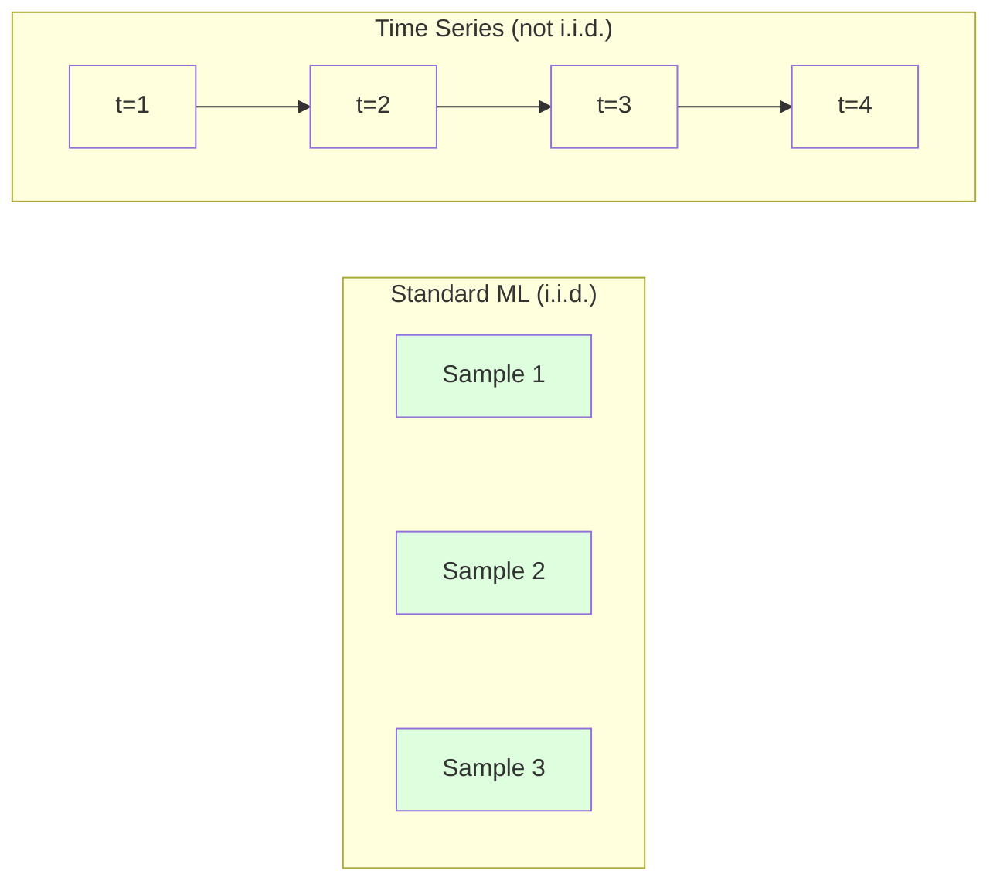
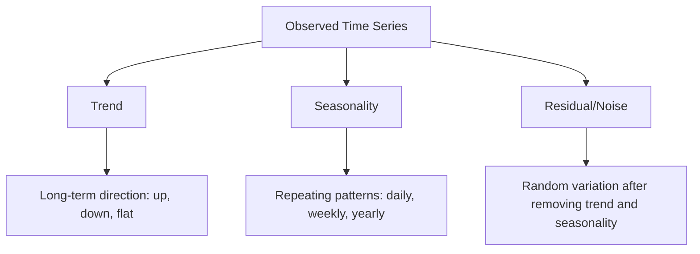
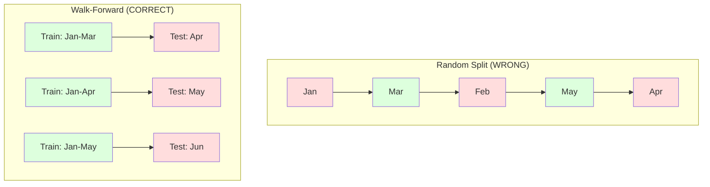

# समय श्रृंखला के मूल बातें

> पिछले प्रदर्शन भविष्य के परिणामों की भविष्यवाणी करता है -- अगर आप पहले स्थिरता की जांच करें।

**Type:** Build
**Language:**पायथन
**Prerequisites:** Phase 2, Lessons 01-09
**Time:** ~90 minutes

## सीखने के लक्ष्य

- समय श्रृंखला को प्रवृत्ति, मौसमीता और अवशिष्ट घटकों में तोड़ें और स्थिरता का परीक्षण करें
- समय श्रृंखला को एक पर्यवेक्षित सीखने की समस्या में बदलने के लिए देरी सुविधाओं और रूलिंग सांख्यिकी को लागू करें
- एक आगे की वैधता ढांचे का निर्माण करें जो भविष्य के डेटा को प्रशिक्षण में लीक होने से रोकता है
- समय श्रृंखला के लिए यादृच्छिक ट्रेन/परीक्षण विभाजन अमान्य क्यों हैं, इसकी व्याख्या करें और प्रदर्शन अंतर को उचित समय विभाजन के मुकाबले प्रदर्शित करें

## समस्या

आपके पास समय के अनुसार आदेश दिया गया डेटा है दैनिक बिक्री, घंटे का तापमान, प्रति मिनट सीपीयू उपयोग, साप्ताहिक शेयर मूल्य. आप अगले मूल्य का अनुमान लगाना चाहते हैं, अगले सप्ताह, अगले तिमाही.

आप अपने मानक एमएल टूलकिट के लिए पहुंचते हैंः यादृच्छिक ट्रेन / परीक्षण विभाजन, क्रॉस-वैधता, सुविधा मैट्रिक्स में, भविष्यवाणी बाहर. हर कदम गलत है.

समय श्रृंखला उन मान्यताओं को तोड़ती है जिन पर मानक एमएल निर्भर करता है। नमूने स्वतंत्र नहीं हैं - आज का तापमान कल के पर निर्भर करता है। यादृच्छिक विभाजन भविष्य की जानकारी अतीत में लीक करता है। बैकटेस्ट में अच्छी लग रही विशेषताएं उत्पादन में विफल होती हैं क्योंकि वे समय के साथ बदलते पैटर्न पर निर्भर करती हैं।

एक मॉडल जो यादृच्छिक क्रॉस-वैलिडेशन के साथ 95% सटीकता प्राप्त करता है, उचित समय आधारित मूल्यांकन के साथ 55% प्राप्त कर सकता है। अंतर तकनीकी नहीं है। यह एक मॉडल के बीच अंतर है जो कागज पर काम करता है और एक जो उत्पादन में काम करता है।

यह सबक मूल बातें शामिल करता हैः समय डेटा को अलग क्या बनाता है, मॉडल का ईमानदारी से मूल्यांकन कैसे किया जाए, और समय श्रृंखला को उन सुविधाओं में कैसे बदल दिया जाए जो मानक एमएल मॉडल खपत कर सकते हैं।

## अवधारणा

### समय श्रृंखला को क्या अलग बनाता है

मानक एमएल मानता है कि आईआईडी - स्वतंत्र और समान रूप से वितरित है। प्रत्येक नमूना अन्य नमूनों से स्वतंत्र रूप से एक ही वितरण से लिया जाता है। समय श्रृंखला दोनों का उल्लंघन करती हैः

- **Not independent.**आज के शेयर की कीमत कल की कीमत पर निर्भर करती है। इस सप्ताह की बिक्री पिछले सप्ताह की बिक्री से मेल खाती है।
- **Not identically distributed.**डिसेम्बर में बिक्री मार्च में बिक्री से अलग दिखती है।

ये उल्लंघन मामूली नहीं हैं. वे बदलते हैं कि आप सुविधाओं का निर्माण कैसे करते हैं, आप मॉडल का मूल्यांकन कैसे करते हैं, और कौन से एल्गोरिदम काम करते हैं।



मानक एमएल में, नमूने आदान-प्रदान योग्य हैं। उन्हें मिलाकर कुछ भी नहीं बदलता। समय श्रृंखला में, क्रम सब कुछ है। मिलाकर सिग्नल को नष्ट कर देता है।

### समय श्रृंखला के घटक

प्रत्येक समय श्रृंखला का संयोजन हैः



- **Trend**दीर्घकालिक दिशा राजस्व में वृद्धि 10% प्रति वर्ष वैश्विक तापमान में वृद्धि
- **Seasonality**: निश्चित अंतराल पर दोहराए जाने वाले पैटर्न। दिसंबर में खुदरा बिक्री में तेजी आई। जुलाई में एयर कंडीशनिंग का उपयोग चरम पर है।
- **Residual**यदि शेष सफेद शोर जैसा दिखता है, तो विघटन ने संकेत को कैप्चर किया।

### स्थिरीकरण

समय श्रृंखला स्थिर है यदि इसकी सांख्यिकीय गुण (औसत, भिन्नता, स्व-संबंध) समय के साथ नहीं बदलते हैं। अधिकांश भविष्यवाणी विधियों में स्थिरता का अनुमान है।

**Why it matters:**एक गैर-स्थिर श्रृंखला में एक औसत है जो बहता है। जनवरी से डेटा पर प्रशिक्षित एक मॉडल ने फरवरी में दिखाए जाने वाले औसत से अलग एक औसत सीखा है। यह व्यवस्थित रूप से गलत होगा।

**How to check:**खिड़कियों पर रोलिंग औसत और रोलिंग मानक विचलन की गणना करें। यदि वे बहते हैं, तो श्रृंखला गैर-स्थिर है।

**How to fix:**कच्चे मूल्यों को मॉडल करने के बजाय, लगातार मानों के बीच परिवर्तन को मॉडल करेंः

```
diff[t] = value[t] - value[t-1]
```

यदि एक राउंड डिफरेंसिंग से श्रृंखला स्थिर नहीं होती है, तो इसे फिर से लागू करें (दूसरी क्रम की डिफरेंसिंग) अधिकांश वास्तविक दुनिया की श्रृंखलाओं को अधिकतम दो राउंड की आवश्यकता होती है।

**Example:**

मूल श्रृंखला: [100, 102, 106, 112, 120]
पहला अंतरः [2, 4, 6, 8] (अभी भी ऊपर की ओर बढ़ रहा है)
दूसरा अंतरः [2, 2, 2] (स्थिर -- स्थैतिक)

मूल श्रृंखला में एक चतुर्भुज प्रवृत्ति थी। पहले अंतर ने इसे एक रैखिक प्रवृत्ति में बदल दिया। दूसरे अंतर ने इसे सपाट बना दिया। व्यवहार में, आपको शायद ही कभी दो से अधिक राउंड की आवश्यकता होती है।

**Formal test:**एग्मेंटेड डिक-फुलर (एडीएफ) परीक्षण स्थिरता के लिए मानक सांख्यिकीय परीक्षण है। शून्य परिकल्पना "सीरीज गैर-स्थिर है।" 0.05 से नीचे का p-मूल्य इसका मतलब है कि आप शून्य को अस्वीकार कर सकते हैं और स्थिरता का निष्कर्ष निकाल सकते हैं। हम एडीएफ को खरोंच से लागू नहीं करते हैं (इसके लिए असंबद्ध वितरण तालिकाओं की आवश्यकता होती है), लेकिन हमारे कोड में रोलिंग सांख्यिकीय दृष्टिकोण एक व्यावहारिक दृश्य जांच देता है।

### स्व-संयोजन

ऑटोकोरेलेशन मापता है कि समय t में एक मान समय t-k में मान के साथ कितना सहसंबंधित है (अतीत में k कदम) । ऑटोकोरेलेशन फ़ंक्शन (ACF) प्रत्येक lag k के लिए इस सहसंबंध का ग्राफ करता है।

**ACF tells you:**
- यदि ACF 5 लेग के बाद शून्य हो जाता है, तो 5 कदम से अधिक पहले के मानों से कोई लेना-देना नहीं है।
- यदि ACF 12 (मासिक डेटा) पर बढ़ता है, तो वार्षिक मौसमीता होती है।
- कितना लेग सुविधाओं बनाने के लिए. जहां ACF उपेक्षित हो जाता है लेग का उपयोग करें.

**PACF (Partial Autocorrelation Function)**यदि आज केवल इसलिए 3 दिन पहले के साथ सहसंबंधित है क्योंकि दोनों कल के साथ सहसंबंधित हैं, तो पीएसीएफ 3 पर लेग शून्य होगा जबकि एसीएफ 3 पर नहीं होगा।

### लॅग फीचर्सः समय श्रृंखला को पर्यवेक्षित सीखने में बदलना

मानक एमएल मॉडल को एक विशेषता मैट्रिक्स एक्स और एक लक्ष्य वाई की आवश्यकता होती है। समय श्रृंखला आपको मानों का एक एकल स्तंभ देती है। पुल लेग विशेषताएं हैं।

[10, 12, 14, 13, 15] श्रृंखला लें और lag-1 और lag-2 सुविधाएँ बनाएंः

| lag_2 | lag_1 | target |
|-------|-------|--------|
| 10    | 12    | 14     |
| 12    | 14    | 13     |
| 14    | 13    | 15     |

अब आप एक मानक विघटन समस्या है. किसी भी एमएल मॉडल (रेखीय विघटन, यादृच्छिक वन, ग्रेडिएंट बढ़त) लेग से लक्ष्य की भविष्यवाणी कर सकते हैं.

अतिरिक्त विशेषताएं आप इंजीनियर कर सकते हैंः
- **Rolling statistics:**औसत, std, min, अंतिम k मानों पर अधिकतम
- **Calendar features:**सप्ताह का दिन, महीना, छुट्टी, सप्ताहांत
- **Differenced values:**पिछले चरण से बदलाव
- **Expanding statistics:**संचयी औसत, संचयी राशि
- **Ratio features:**वर्तमान मूल्य / रॉलिंग औसत (हाल के औसत से कितनी दूर)
- **Interaction features:**lag_1 * दिन_of_week (सप्ताह के दिन गति पर प्रभाव)

**How many lags?**ऑटो-संदर्भ फ़ंक्शन का उपयोग करें। यदि ACF 10 तक की देरी से महत्वपूर्ण है, तो कम से कम 10 देरी का उपयोग करें। यदि साप्ताहिक मौसमीता है, तो 7 (और संभवतः 14) देरी शामिल करें। अधिक देरी मॉडल को अधिक इतिहास देती है लेकिन फिट करने के लिए अधिक सुविधाएं भी देती है, जिससे ओवरफिटिंग का खतरा बढ़ जाता है।

**The target alignment trap.**जब लेग फीचर्स बनाते हैं तो लक्ष्य समय t पर मान होना चाहिए, और सभी फीचर्स को समय t-1 या उससे पहले के मानों का उपयोग करना चाहिए. यदि आप गलती से समय t पर मान को एक फीचर के रूप में शामिल करते हैं, तो आपके पास एक सही भविष्यवाणी है - और एक पूरी तरह से बेकार मॉडल। यह टाइम सीरीज़ फीचर इंजीनियरिंग में सबसे आम बग है।

### आगे की पुष्टि

यह इस पाठ में सबसे महत्वपूर्ण अवधारणा है। मानक k-fold क्रॉस-वैलिडेशन यादृच्छिक रूप से प्रशिक्षण और परीक्षण के लिए नमूने आवंटित करता है। समय श्रृंखला के लिए, यह भविष्य की जानकारी लीक करता है।



आगे की वैधताः
1. समय t तक के आंकड़ों पर ट्रेन
2. समय t+1 (या t+1 से t+k तक बहु-चरण के लिए) पर भविष्यवाणी करें
3. खिड़की को आगे स्लाइड करें
4. दोहराएँ

प्रत्येक परीक्षण तह में केवल प्रशिक्षण डेटा के बाद आने वाले डेटा होते हैं। भविष्य में कोई लीक नहीं होता है। यह आपको मॉडल के प्रदर्शन का एक ईमानदार अनुमान देता है जब तैनात किया जाता है।

**Expanding window**प्रशिक्षण के लिए सभी ऐतिहासिक डेटा का उपयोग करता है (विंडो बढ़ता है) । **Sliding window**एक निश्चित आकार की ट्रेनिंग विंडो (विंडो स्लाइड) का उपयोग करें। विस्तार का उपयोग करें जब आप मानते हैं कि पुराने डेटा अभी भी प्रासंगिक हैं। स्लाइड का उपयोग करें जब दुनिया बदलती है और पुराने डेटा दर्द होता है।

### एआरआईएमए इंट्यूशन

एरिमा क्लासिक टाइम सीरीज मॉडल है। इसमें तीन घटक हैंः

- **AR (Autoregressive):**पिछले मानों से भविष्यवाणी करें। AR ((p) अंतिम p मानों का उपयोग करता है।
- **I (Integrated):**स्थिरीकरण प्राप्त करने के लिए अंतर करना।
- **MA (Moving Average):**पूर्वानुमान त्रुटियों से भविष्यवाणी करें। MA(q) अंतिम q त्रुटियों का उपयोग करता है।

ARIMA ((p, d, q) तीनों को जोड़ता है। आप ACF/PACF विश्लेषण या स्वचालित खोज (ऑटो-ARIMA) के आधार पर p, d, q चुनते हैं।

हम आरआईएमए को स्क्रैच से लागू नहीं करेंगे - इसके लिए संख्यात्मक अनुकूलन की आवश्यकता है जो इस पाठ के दायरे से परे है। कुंजी अंतर्दृष्टि यह समझना है कि प्रत्येक घटक क्या करता है ताकि आप आरआईएमए परिणामों की व्याख्या कर सकें और पता लगा सकें कि इसका उपयोग कब करना है।

### कब क्या इस्तेमाल करें

| Approach | Best For | Handles Seasonality | Handles External Features |
|----------|---------|-------------------|------------------------|
| Lag features + ML | Tabular with many external features | With calendar features | Yes |
| ARIMA | Single univariate series, short-term | SARIMA variant | No (ARIMAX for limited) |
| Exponential smoothing | Simple trend + seasonality | Yes (Holt-Winters) | No |
| Prophet | Business forecasting, holidays | Yes (Fourier terms) | Limited |
| Neural networks (LSTM, Transformer) | Long sequences, many series | Learned | Yes |

अधिकांश व्यावहारिक समस्याओं के लिए, लेग फीचर्स + ग्रेडिएंट बूस्टिंग सबसे मजबूत प्रारंभिक बिंदु है। यह बाहरी सुविधाओं को स्वाभाविक रूप से संभालता है, स्थिरता की आवश्यकता नहीं है, और डिबग करना आसान है।

### क्षितिज और रणनीतियों की भविष्यवाणी

एक चरण पूर्वानुमान एक समय एक कदम आगे का अनुमान लगाता है। बहु-चरण पूर्वानुमान कई चरणों का अनुमान लगाता है। तीन रणनीतियाँ हैंः

**Recursive (iterated):**एक कदम आगे का अनुमान लगाएं, अगले कदम के लिए भविष्यवाणी को इनपुट के रूप में उपयोग करें. सरल लेकिन त्रुटियां जमा होती हैं - प्रत्येक भविष्यवाणी पिछले भविष्यवाणी का उपयोग करती है, इसलिए गलतियां मिश्रित होती हैं।

**Direct:**प्रत्येक क्षितिज के लिए एक अलग मॉडल का अभ्यास करें। मॉडल-1 t+1 का अनुमान लगाता है, मॉडल-5 t+5 का अनुमान लगाता है। कोई त्रुटि संचय नहीं है, लेकिन प्रत्येक मॉडल में कम प्रशिक्षण नमूने हैं और वे जानकारी साझा नहीं करते हैं।

**Multi-output:**एक मॉडल को प्रशिक्षित करें जो सभी क्षितिज को एक साथ आउटपुट करता है। क्षितिज के पार जानकारी साझा करता है लेकिन एक मॉडल की आवश्यकता होती है जो कई आउटपुट (या कस्टम हानि फ़ंक्शन) का समर्थन करता है।

अधिकांश व्यावहारिक समस्याओं के लिए, छोटी क्षितिज (1-5 चरणों) के लिए पुनरावर्ती और लंबी क्षितिज के लिए सीधा से शुरू करें।

### समय श्रृंखला में आम गलतियाँ

| Mistake | Why it happens | How to fix |
|---------|---------------|-----------|
| Random train/test split | Habit from standard ML | Use walk-forward or temporal split |
| Using future features | Feature at time t included by mistake | Audit every feature for temporal alignment |
| Overfitting to seasonality | Model memorizes calendar patterns | Hold out a full seasonal cycle in the test set |
| Ignoring scale changes | Revenue doubles but patterns stay | Model percentage change instead of absolute |
| Too many lag features | "More history is better" | Use ACF to determine relevant lags |
| Not differencing | "The model will figure it out" | Tree models handle trends; linear models need stationarity |

```figure
f3-series-decompose
```

## इसे बनाओ

कोड में `code/time_series.py`मूल निर्माण ब्लॉकों को खरोंच से लागू करता है।

### लॅग फीचर निर्माता

```python
def make_lag_features(series, n_lags):
    n = len(series)
    X = np.full((n, n_lags), np.nan)
    for lag in range(1, n_lags + 1):
        X[lag:, lag - 1] = series[:-lag]
    valid = ~np.isnan(X).any(axis=1)
    return X[valid], series[valid]
```

यह एक 1D श्रृंखला को एक विशेषता मैट्रिक्स में परिवर्तित करता है जहां प्रत्येक पंक्ति में अंतिम है `n_lags`विशेषताओं के रूप में मान और लक्ष्य के रूप में वर्तमान मूल्य।

### आगे की क्रॉस-वैलिडेशन

```python
def walk_forward_split(n_samples, n_splits=5, min_train=50):
    assert min_train < n_samples, "min_train must be less than n_samples"
    step = max(1, (n_samples - min_train) // n_splits)
    for i in range(n_splits):
        train_end = min_train + i * step
        test_end = min(train_end + step, n_samples)
        if train_end >= n_samples:
            break
        yield slice(0, train_end), slice(train_end, test_end)
```

प्रत्येक विभाजन प्रशिक्षण डेटा परीक्षण डेटा से पहले सख्ती से आता है सुनिश्चित करता है। प्रशिक्षण विंडो प्रत्येक तह के साथ विस्तारित होता है।

### सरल ऑटोरेग्रेसिव मॉडल

एक शुद्ध एआर मॉडल केवल लीक सुविधाओं पर रैखिक प्रतिगमन हैः

```python
class SimpleAR:
    def __init__(self, n_lags=5):
        self.n_lags = n_lags
        self.weights = None
        self.bias = None

    def fit(self, series):
        X, y = make_lag_features(series, self.n_lags)
        # Solve via normal equations
        X_b = np.column_stack([np.ones(len(X)), X])
        theta = np.linalg.lstsq(X_b, y, rcond=None)[0]
        self.bias = theta[0]
        self.weights = theta[1:]
        return self
```

यह अवधारणात्मक रूप से पाठ 02 से रैखिक प्रतिगमन के समान है, लेकिन उसी चर के समय-अवरोधित संस्करणों पर लागू होता है।

### स्थिरीकरण जांच

कोड स्थिरांक का आकलन करने के लिए दृश्य और संख्यात्मक रूप से रॉलिंग आँकड़े की गणना करता हैः

```python
def check_stationarity(series, window=50):
    rolling_mean = np.array([
        series[max(0, i - window):i].mean()
        for i in range(1, len(series) + 1)
    ])
    rolling_std = np.array([
        series[max(0, i - window):i].std()
        for i in range(1, len(series) + 1)
    ])
    return rolling_mean, rolling_std
```

यदि रोलिंग औसत बहाव या रोलिंग स्टडी बदलता है, तो श्रृंखला गैर-स्थिर है। अंतर करना लागू करें और फिर से जांचें।

कोड श्रृंखला के पहले आधे और दूसरे आधे की तुलना करके स्थिरता की जांच भी करता है। यदि साधनों में आधे से अधिक मानक विचलन या भिन्नता अनुपात 2x से अधिक है, तो श्रृंखला को गैर-स्थिर के रूप में चिह्नित किया जाता है।

### स्व-संयोजन

```python
def autocorrelation(series, max_lag=20):
    n = len(series)
    mean = series.mean()
    var = series.var()
    acf = np.zeros(max_lag + 1)
    for k in range(max_lag + 1):
        cov = np.mean((series[:n-k] - mean) * (series[k:] - mean))
        acf[k] = cov / var if var > 0 else 0
    return acf
```

## इसका प्रयोग करें

sklearn के साथ, आप किसी भी regresor के साथ सीधे lag सुविधाओं का उपयोग करते हैंः

```python
from sklearn.linear_model import Ridge
from sklearn.ensemble import GradientBoostingRegressor

X, y = make_lag_features(series, n_lags=10)

for train_idx, test_idx in walk_forward_split(len(X)):
    model = Ridge(alpha=1.0)
    model.fit(X[train_idx], y[train_idx])
    predictions = model.predict(X[test_idx])
```

एआरआईएमए के लिए, सांख्यिकीय मॉडल का उपयोग करेंः

```python
from statsmodels.tsa.arima.model import ARIMA

model = ARIMA(train_series, order=(5, 1, 2))
fitted = model.fit()
forecast = fitted.forecast(steps=30)
```

कोड में `time_series.py`दोनों दृष्टिकोणों को प्रदर्शित करता है और आगे चलकर सत्यापन का उपयोग करके उनकी तुलना करता है।

### sklearn समय श्रृंखलाएँविभाजित

sklearn प्रदान करता है `TimeSeriesSplit`जो आगे की वैधता को लागू करता हैः

```python
from sklearn.model_selection import TimeSeriesSplit

tscv = TimeSeriesSplit(n_splits=5)
for train_index, test_index in tscv.split(X):
    X_train, X_test = X[train_index], X[test_index]
    y_train, y_test = y[train_index], y[test_index]
    model.fit(X_train, y_train)
    score = model.score(X_test, y_test)
```

यह हमारे खरोंच से बराबर है`walk_forward_split`लेकिन sklearn के क्रॉस-वैलिडेशन फ्रेमवर्क में एकीकृत है। आप इसे उपयोग कर सकते हैं`cross_val_score`:

```python
from sklearn.model_selection import cross_val_score

scores = cross_val_score(model, X, y, cv=TimeSeriesSplit(n_splits=5))
print(f"Mean score: {scores.mean():.4f} +/- {scores.std():.4f}")
```

### मूल्यांकन मेट्रिक्स

समय श्रृंखला भविष्यवाणी में regression metrics का उपयोग किया जाता है, लेकिन समय-सचेत संदर्भ के साथः

- **MAE (Mean Absolute Error):**औसत y_true - y_pred डिश. मूल इकाइयों में व्याख्या करने के लिए आसान. "औसत में, भविष्यवाणियों 3.2 डिग्री से अधिक हैं. "
- **RMSE (Root Mean Squared Error):**औसत वर्ग त्रुटि की वर्गमूल। बड़े त्रुटियों को MAE से अधिक दंडित करता है। जब बड़े त्रुटियों को कई छोटी त्रुटियों से भी बदतर है।
- **MAPE (Mean Absolute Percentage Error):**औसत त्रुटि / true_value = 100 स्केल-स्वतंत्र, विभिन्न श्रृंखलाओं के बीच तुलना के लिए उपयोगी है. लेकिन undefined जब सही मान शून्य हैं.
- **Naive baseline comparison:**हमेशा सरल बेसलाइन के साथ तुलना करें। मौसमी साफ़ आधार रेखा एक अवधि से पहले (कल, पिछले सप्ताह) के मूल्य की भविष्यवाणी करती है। यदि आपका मॉडल साफ़ नहीं हरा सकता है, तो कुछ गलत है।

### घूर्णन विशेषताएं

कोड में दिखाया गया है कि लॅग फीचर्स के लिए रॉलिंग आँकड़े (मीडियम, एसटीडी, मिन, अधिकतम 7 और 14 दिनों की खिड़कियों पर) जोड़े गए हैं। ये मॉडल को हालिया रुझानों और अस्थिरता के बारे में जानकारी देते हैं जो अकेले लॅग फीचर्स नहीं पकड़ते हैं।

उदाहरण के लिए, यदि रोलिंग औसत बढ़ रहा है, तो यह एक वृद्धिशील प्रवृत्ति का संकेत देता है। यदि रोलिंग एसटीडी बढ़ रहा है, तो यह बढ़ती अस्थिरता का संकेत देता है। ये ऐसे पैटर्न हैं जो पेड़ आधारित मॉडल सीख सकते हैं लेकिन रैखिक मॉडल नहीं कर सकते हैं।

## इसे भेजें

इस पाठ से उत्पन्न होता हैः
- `outputs/prompt-time-series-advisor.md`-- समय श्रृंखला समस्याओं को फ्रेम करने के लिए एक संकेत
- `code/time_series.py`-- लेग सुविधाएँ, आगे चलकर सत्यापन, एआर मॉडल, स्थिरता जांच

### आपको जो मूल बातें हासिल करनी चाहिए

किसी भी मॉडल का निर्माण करने से पहले, आधार रेखाएं निर्धारित करेंः

1. **Last value (persistence).**भविष्यवाणी करें कि कल आज जैसा ही होगा कई श्रृंखलाओं के लिए, यह जीतना आश्चर्यजनक रूप से मुश्किल है।
2. **Seasonal naive.**भविष्यवाणी करें कि आज पिछले सप्ताह (या पिछले साल) के समान दिन होगा। यदि आपका मॉडल इसे हरा नहीं सकता है, तो उसने मौसमीता के अलावा कोई उपयोगी पैटर्न नहीं सीखा है।
3. **Moving average.**पिछले k मानों के औसत का अनुमान लगाएं। शोर को चिकना करता है लेकिन अचानक परिवर्तनों को कैप्चर नहीं कर सकता है।

यदि आपका फैंसी एमएल मॉडल मौसमी साफ़ आधार रेखा से हार जाता है, तो आपके पास एक बग है। सबसे आम तौर परः सुविधाओं में भविष्य का रिसाव, गलत मूल्यांकन विधि, या श्रृंखला वास्तव में यादृच्छिक और अप्रत्याशित है।

### व्यावहारिक सुझाव

1. **Start with plotting.**किसी भी मॉडलिंग से पहले, कच्ची श्रृंखला का नक्शा बनाएं। रुझानों, मौसमीता, असाधारणताओं, संरचनात्मक ब्रेक (व्यवहार में अचानक बदलाव) की तलाश करें। 30 सेकंड की दृश्य निरीक्षण अक्सर आपको स्वचालित विश्लेषण के एक घंटे से अधिक बताता है।

2. **Difference first, model second.**यदि श्रृंखला में एक स्पष्ट प्रवृत्ति है, तो लेग फीचर्स बनाने से पहले इसे अलग करें। पेड़ आधारित मॉडल प्रवृत्तियों को संभाल सकते हैं, लेकिन रैखिक मॉडल नहीं कर सकते हैं, और अंतर करना कभी भी चोट नहीं पहुंचाता है।

3. **Hold out at least one full seasonal cycle.**यदि आपके पास साप्ताहिक मौसमीता है, तो आपके परीक्षण सेट को कम से कम एक पूर्ण सप्ताह की आवश्यकता है। यदि मासिक है, तो कम से कम एक पूर्ण महीने। अन्यथा आप यह आकलन नहीं कर सकते कि मॉडल ने मौसमी पैटर्न को कैप्चर किया है या नहीं।

4. **Monitor in production.**समय श्रृंखला मॉडल समय के साथ-साथ दुनिया के परिवर्तन के साथ गिरावट आते हैं। रोलिंग आधार पर भविष्यवाणी त्रुटियों का ट्रैक करें। जब त्रुटियां बढ़ना शुरू होती हैं, तो हाल के डेटा पर मॉडल को फिर से प्रशिक्षित करें।

5. **Beware of regime changes.**महामारी से पहले के आंकड़ों पर प्रशिक्षित मॉडल महामारी के बाद के व्यवहार की भविष्यवाणी नहीं करेगा। ज्ञात शासन परिवर्तन के संकेतकों को सुविधाओं के रूप में शामिल करें, या पुरानी डेटा को भूलने वाली स्लाइडिंग विंडो का उपयोग करें।

6. **Log-transform skewed series.**राजस्व, कीमतें और गणनाएं अक्सर दाईं ओर झुकी हुई होती हैं। लॉग लेना भिन्नता को स्थिर करता है और गुणात्मक पैटर्न को जोड़ता है, जिसे रैखिक मॉडल संभाल सकते हैं। लॉग स्थान में पूर्वानुमान, फिर मूल इकाइयों पर वापस आने के लिए एक्सपोनेंशियल।

## व्यायाम

1. **Stationarity experiment.**रैखिक प्रवृत्ति के साथ एक श्रृंखला उत्पन्न करें। रॉलिंग सांख्यिकी के साथ स्थिरता की जांच करें। पहले भिन्नता लागू करें। फिर से जांचें। एक चतुर्भुज प्रवृत्ति के लिए भिन्नता के कितने दौर लगते हैं?

2. **Lag selection.**सीजनल सीरीज (पीरियड=7) पर ACF की गणना करें। कौन से लेग में सबसे अधिक ऑटोकोरेलेशन होता है? केवल उन लेग का उपयोग करके लेग फीचर्स बनाएं (लगंतर लेग नहीं) । क्या 1 से 7 लेग का उपयोग करने की तुलना में सटीकता में सुधार होता है?

3. **Walk-forward vs random split.**लेग फीचर्स पर एक रिज रेग्रेसशन को प्रशिक्षित करें। यादृच्छिक 80/20 विभाजन और आगे की वैधता के साथ मूल्यांकन करें। यादृच्छिक विभाजन प्रदर्शन को कितना अधिक बताता है?

4. **Feature engineering.**लॅग फीचर्स में रोलिंग मीडियम (window=7), रोलिंग std (window=7) और दिन-से-सप्ताह की सुविधाएँ जोड़ें। आगे चलने वाले सत्यापन का उपयोग करके इन एक्स्ट्रा के साथ और बिना सटीकता की तुलना करें।

5. **Multi-step forecasting.**1. दो रणनीतियों की तुलना करें: (क) एक कदम का अनुमान लगाएं, अगले कदम के लिए भविष्यवाणी को इनपुट के रूप में उपयोग करें (रिकर्सिव), और (ख) प्रत्येक क्षितिज के लिए अलग-अलग मॉडल प्रशिक्षित करें (प्रत्यक्ष) । कौन सा अधिक सटीक है?

## प्रमुख शर्तें

| Term | What people say | What it actually means |
|------|----------------|----------------------|
| Stationarity | "The stats don't change over time" | A series whose mean, variance, and autocorrelation structure are constant over time |
| Differencing | "Subtract consecutive values" | Computing y[t] - y[t-1] to remove trends and achieve stationarity |
| Autocorrelation (ACF) | "How a series correlates with itself" | The correlation between a time series and a lagged copy of itself, as a function of the lag |
| Partial autocorrelation (PACF) | "Direct correlation only" | Autocorrelation at lag k after removing the effect of all shorter lags |
| Lag features | "Past values as inputs" | Using y[t-1], y[t-2], ..., y[t-k] as features to predict y[t] |
| Walk-forward validation | "Time-respecting cross-validation" | Evaluation where training data always precedes test data chronologically |
| ARIMA | "The classic time series model" | AutoRegressive Integrated Moving Average: combines past values (AR), differencing (I), and past errors (MA) |
| Seasonality | "Repeating calendar patterns" | Regular, predictable cycles in a time series tied to calendar periods (daily, weekly, yearly) |
| Trend | "The long-term direction" | A persistent increase or decrease in the series level over time |
| Expanding window | "Use all history" | Walk-forward validation where the training set grows with each fold |
| Sliding window | "Fixed-size history" | Walk-forward validation where the training set is a fixed-length window that slides forward |

## आगे पढ़ना

- [Hyndman and Athanasopoulos, Forecasting: Principles and Practice (3rd ed.)](https://otexts.com/fpp3/)-- समय श्रृंखला भविष्यवाणी पर सबसे अच्छा मुफ्त पाठ्यपुस्तक
- [scikit-learn Time Series Split](https://scikit-learn.org/stable/modules/generated/sklearn.model_selection.TimeSeriesSplit.html)-- स्क्लेर्न का आगे चलने वाला स्प्लिटर
- [statsmodels ARIMA docs](https://www.statsmodels.org/stable/generated/statsmodels.tsa.arima.model.ARIMA.html)-- डायग्नोस्टिक्स के साथ एआरआईएमए कार्यान्वयन
- [Makridakis et al., The M5 Competition (2022)](https://www.sciencedirect.com/science/article/pii/S0169207021001874)-- बड़े पैमाने पर भविष्यवाणी प्रतियोगिता जिसमें एमएल विधियों बनाम सांख्यिकीय विधियों को दिखाया गया है
