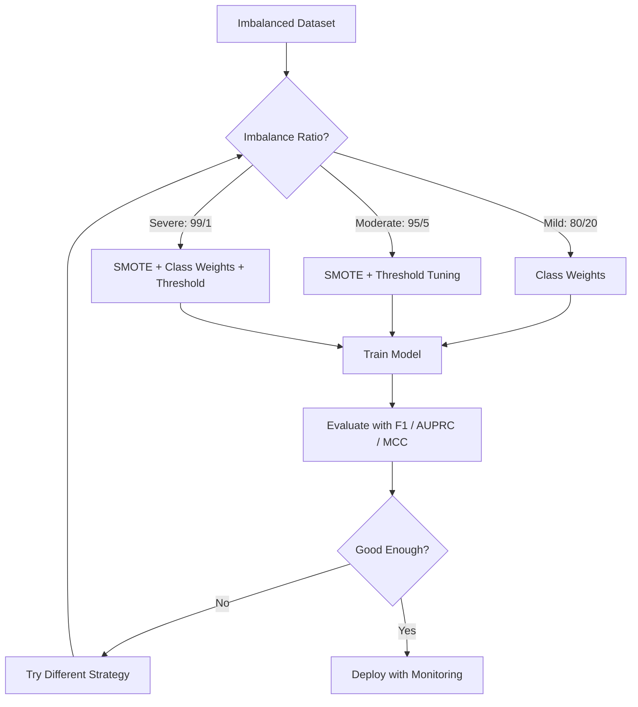
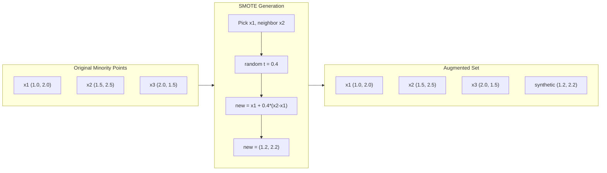
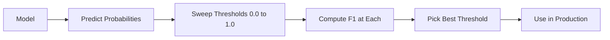
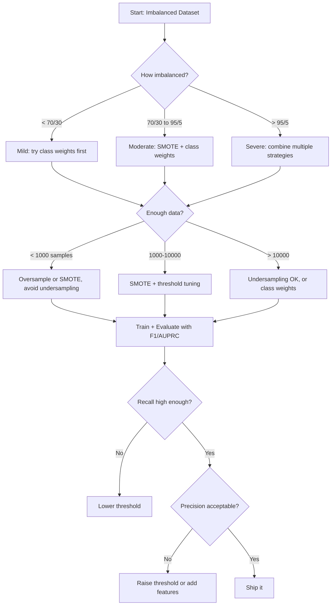

# असंतुलित डेटा का प्रबंधन

> जब आपके डेटा का 99% "सामान्य" है, तो सटीकता झूठ है।

**Type:** Build
**Language:**पायथन
**Prerequisites:** Phase 2, Lessons 01-09 (especially evaluation metrics)
**Time:** ~90 minutes

## सीखने के लक्ष्य

- SMOTE को खरोंच से लागू करें और समझाएं कि सिंथेटिक ओवरसैम्पलिंग कैसे यादृच्छिक दोहराव से भिन्न है
- सटीकता के बजाय F1, AUPRC और मैथ्यूज सहसंबंध गुणांक का उपयोग करके असंतुलित वर्गीकरण का मूल्यांकन करें
- वर्ग भार, सीमा समायोजन और पुनः नमूनाकरण रणनीतियों की तुलना करें और किसी दिए गए असंतुलन अनुपात के लिए सही दृष्टिकोण चुनें
- एक पूर्ण असंतुलित डेटा पाइपलाइन बनाएं जो SMOTE, वर्ग वजन और सीमा अनुकूलन को जोड़ता है

## समस्या

आप धोखाधड़ी का पता लगाने के लिए एक मॉडल बनाते हैं, यह 99.9% सटीकता प्राप्त करता है, आप मनाते हैं, और फिर आप महसूस करते हैं कि यह प्रत्येक लेनदेन के लिए "नहीं धोखाधड़ी" की भविष्यवाणी करता है।

यह कोई बग नहीं है. यह तर्कसंगत बात है जब केवल 0.1% लेनदेन धोखाधड़ी हैं। मॉडल सीखता है कि हमेशा बहुमत वर्ग का अनुमान लगाना समग्र त्रुटि को कम करता है। यह तकनीकी रूप से सही और पूरी तरह से बेकार है।

यह हर जगह होता है वास्तविक वर्गीकरण के मामले। रोग निदानः 1% सकारात्मक दर। नेटवर्क घुसपैठः 0.01% हमले। विनिर्माण दोषः 0.5% दोषपूर्ण। स्पैम फ़िल्टरिंगः 20% स्पैम। चर्न भविष्यवाणीः 5% चर्नर। अल्पसंख्यक वर्ग जितना अधिक परिणामकारी होगा, उतना ही दुर्लभ होता है।

सटीकता विफल होती है क्योंकि यह सभी सही भविष्यवाणियों का समान रूप से इलाज करती है। एक वैध लेनदेन को सही ढंग से लेबल करना और धोखाधड़ी को सही ढंग से पकड़ना दोनों सटीकता के एक बिंदु के रूप में मायने रखते हैं। लेकिन धोखाधड़ी को पकड़ना मॉडल का अस्तित्व का पूरा कारण है। हमें मीट्रिक, तकनीकों और प्रशिक्षण रणनीतियों की आवश्यकता है जो मॉडल को दुर्लभ लेकिन महत्वपूर्ण वर्ग पर ध्यान देने के लिए मजबूर करती है।

## अवधारणा

### सटीकता क्यों विफल रहती है

एक डेटा सेट 1000 नमूनों के साथ विचार करेंः 990 नकारात्मक, 10 सकारात्मक। एक मॉडल जो हमेशा नकारात्मक भविष्यवाणी करता हैः

|  | Predicted Positive | Predicted Negative |
|--|---|---|
| Actually Positive | 0 (TP) | 10 (FN) |
| Actually Negative | 0 (FP) | 990 (TN) |

सटीकता = (0 + 990) / 1000 = 99.0%

मॉडल शून्य धोखाधड़ी, शून्य बीमारी, शून्य दोषों को पकड़ता है, लेकिन सटीकता 99% कहती है। यही कारण है कि असंतुलन समस्याओं के लिए सटीकता खतरनाक है।

### बेहतर मेट्रिक्स

**Precision**TP / (TP + FP) सभी सकारात्मक चिह्नित वस्तुओं में से, वास्तव में कितने हैं? उच्च परिशुद्धता का अर्थ है कि कम झूठी अलार्म।

**Recall**= टीपी / (टीपी + एफएन) वास्तव में सकारात्मक सब कुछ में से, हम कितने पकड़े? उच्च याद का मतलब है कि कुछ याद किए गए सकारात्मक.

**F1 Score**= 2 * सटीकता * याद / (सटीकता + याद) । सामंजस्य औसत। सटीकता और याद के बीच चरम असंतुलन को अंकगणितीय औसत से अधिक दंडित करता है।

**F-beta Score**= (1 + बीटा^2) * सटीकता * याद / (बीटा^2 * सटीकता + याद) जब बीटा > 1 होता है, याद करना अधिक महत्वपूर्ण होता है। जब बीटा < 1 होता है, सटीकता अधिक महत्वपूर्ण होती है। धोखाधड़ी का पता लगाने में F2 आम है (गैर-धंदा धोखाधड़ी झूठी अलार्म से भी बदतर है) ।

**AUPRC**(अंतर्गत सटीकता-पुनर्विचार वक्र क्षेत्र) AUC-ROC की तरह लेकिन असंतुलित डेटा के लिए अधिक जानकारीपूर्ण। एक यादृच्छिक वर्गीकरण में AUPRC सकारात्मक वर्ग दर के बराबर है (ROC की तरह 0.5 नहीं) । यह सुधारों को देखना आसान बनाता है।

**Matthews Correlation Coefficient**= (TP * TN - FP * FN) / sqrt((TP+FP)(TP+FN)(TN+FP)(TN+FN)). -1 से +1 तक होता है। केवल तभी उच्च स्कोर दिया जाता है जब मॉडल दोनों वर्गों पर अच्छा प्रदर्शन करता है। जब वर्ग बहुत अलग आकार होते हैं तब भी संतुलित।

उपरोक्त "सदा नकारात्मक भविष्यवाणी" मॉडल के लिएः सटीकता = 0/0 (अपरिभाषित, अक्सर 0 पर सेट किया जाता है), याद = 0/10 = 0, F1 = 0, MCC = 0. ये माप सही ढंग से मॉडल को मूल्यहीन के रूप में पहचानते हैं।

### असंतुलित डेटा पाइपलाइन



### SMOTE: सिंथेटिक अल्पसंख्यक ओवरसैम्पलिंग तकनीक

यादृच्छिक ओवरसैम्पलिंग मौजूदा अल्पसंख्यक नमूनों को दोहराता है। यह काम करता है लेकिन यह ओवरफिटिंग का जोखिम है क्योंकि मॉडल बार-बार समान बिंदुओं को देखता है।

SMOTE नए सिंथेटिक अल्पसंख्यक नमूने बनाता है जो विश्वसनीय हैं लेकिन नकल नहीं करते हैं। एल्गोरिथ्मः

1. प्रत्येक अल्पसंख्यक नमूना x के लिए, अन्य अल्पसंख्यक नमूनों के बीच उसके निकटतम पड़ोसी k खोजें
2. एक पड़ोसी को यादृच्छिक रूप से चुनें
3. x और उस पड़ोसी के बीच लाइन खंड पर एक नया नमूना बनाएं

सूत्र: `new_sample = x + random(0, 1) * (neighbor - x)`

यह वास्तविक अल्पसंख्यक बिंदुओं के बीच अंतर करता है, बिना केवल मौजूदा डेटा की प्रतिलिपि बनाने के सुविधा स्थान के एक ही क्षेत्र में नमूने बनाता है।



### नमूना लेने की रणनीति की तुलना

**Random Oversampling**: बहुमत की संख्या के अनुरूप अल्पसंख्यक नमूने दोहरे करें।
- लाभः सरल, कोई सूचना हानि नहीं
- विपक्षः सटीक दोहराव से ओवरफिटिंग होती है, प्रशिक्षण समय बढ़ जाता है

**Random Undersampling**: अल्पसंख्यक संख्या के अनुरूप बहुमत के नमूने निकालें।
- पेशेवरोंः त्वरित प्रशिक्षण, सरल
- विपक्षः संभावित रूप से उपयोगी बहुमत डेटा फेंक देता है, उच्च भिन्नता

**SMOTE**: इंटरपोलेशन के जरिए सिंथेटिक अल्पसंख्यक नमूने बनाएँ।
- लाभः नए डेटा बिंदु उत्पन्न करता है, आकस्मिक ओवरसैंपलिंग की तुलना में ओवरफिटिंग को कम करता है
- विपक्षः निर्णय सीमा के पास शोरदार नमूने बना सकता है, बहुमत वर्ग वितरण को ध्यान में नहीं रखता

| Strategy | Data Changed | Risk | When to Use |
|----------|-------------|------|-------------|
| Oversample | Minority duplicated | Overfitting | Small datasets, moderate imbalance |
| Undersample | Majority removed | Information loss | Large datasets, want fast training |
| SMOTE | Synthetic minority added | Boundary noise | Moderate imbalance, enough minority samples for k-NN |

### कक्षाओं के वजन

डेटा बदलने के बजाय, मॉडल त्रुटियों के साथ व्यवहार करने के तरीके को बदलें। अल्पसंख्यक वर्ग को गलत वर्गीकरण करने के लिए अधिक वजन असाइन करें।

950 नकारात्मक और 50 सकारात्मक नमूनों के साथ द्विआधारी समस्या के लिएः
- नकारात्मक वर्ग के लिए वजन = n_samples / (2 * n_negative) = 1000 / (2 * 950) = 0.526
- सकारात्मक वर्ग के लिए वजन = n_samples / (2 * n_positive) = 1000 / (2 * 50) = 10.0

सकारात्मक वर्ग का वजन 19 गुना होता है। एक सकारात्मक नमूना को गलत वर्गीकृत करने की लागत 19 नकारात्मक नमूनों को गलत वर्गीकृत करने की तुलना में अधिक होती है। मॉडल अल्पसंख्यक वर्ग पर ध्यान देने के लिए मजबूर है।

लॉजिस्टिक रेग्रिशन में, यह हानि फ़ंक्शन को संशोधित करता हैः

```
weighted_loss = -sum(w_i * [y_i * log(p_i) + (1-y_i) * log(1-p_i)])
```

जहां w_i नमूना वर्ग i पर निर्भर करता है।

कक्षाओं के वजन अपेक्षाकृत अधिक नमूनाकरण के बराबर होते हैं, लेकिन नए डेटा बिंदुओं के निर्माण के बिना। यह उन्हें तेज़ बनाता है और दोहराए गए नमूनों के अति-फिटिंग जोखिम से बचाता है।

### सीमा समायोजन

अधिकांश वर्गीकरणकर्ता एक संभावना का उत्पादन करते हैं। डिफ़ॉल्ट सीमा 0.5 है: यदि P ((सकारात्मक) >= 0.5 है, तो सकारात्मक भविष्यवाणी करें। लेकिन 0.5 मनमाने ढंग से है। जब वर्ग असंतुलित होते हैं, तो इष्टतम सीमा आमतौर पर बहुत कम होती है।

प्रक्रियाः
1. एक मॉडल को प्रशिक्षित करें
2. सत्यापन सेट पर अनुमानित संभावनाएं प्राप्त करें
3. 0.0 से 1.0 तक के स्पाइक थ्रेशल्स
4. प्रत्येक सीमा पर F1 (या आपके चुने हुए मीट्रिक) की गणना करें
5. अपनी मीट्रिक को अधिकतम करने वाली सीमा चुनें



एक मॉडल धोखाधड़ी के लिए P ((खिलाफ़) = 0.15 निष्पादित कर सकता है. 0.5 की सीमा पर, यह धोखाधड़ी नहीं के रूप में वर्गीकृत किया जाता है. 0.10 की सीमा पर, यह सही ढंग से पकड़ा जाता है. रैंकिंग से कम संभावना का माप है - जब तक धोखाधड़ी गैर-खिलाफ़ की तुलना में अधिक संभावनाएं प्राप्त करती है, तब तक एक सीमा मौजूद है जो उन्हें अलग करती है।

### लागत-संवेदनशील शिक्षा

वर्ग भारों का सामान्यीकरण। समान लागत के बजाय, विशिष्ट गलत वर्गीकरण लागतों को असाइन करेंः

| | Predict Positive | Predict Negative |
|--|---|---|
| Actually Positive | 0 (correct) | C_FN = 100 |
| Actually Negative | C_FP = 1 | 0 (correct) |

एक धोखाधड़ी लेनदेन (एफएन) को याद करने की लागत एक झूठी अलार्म (एफपी) की तुलना में 100 गुना अधिक है। मॉडल कुल लागत के लिए अनुकूलित करता है, कुल त्रुटि गणना नहीं।

यह सबसे सिद्धांतवादी दृष्टिकोण है जब आप वास्तविक दुनिया में लागत का अनुमान लगा सकते हैं। एक चूक कैंसर निदान एक झूठी अलार्म की तुलना में बहुत अलग लागत है जो अतिरिक्त बायोप्सी का कारण बनता है। इन लागतों को स्पष्ट करना सही बाजी लगाने के लिए मजबूर करता है।

### निर्णय प्रवाह चार्ट



```figure
class-imbalance
```

## इसे बनाओ

### चरण 1: एक असंतुलित डेटासेट उत्पन्न करें

```python
import numpy as np


def make_imbalanced_data(n_majority=950, n_minority=50, seed=42):
    rng = np.random.RandomState(seed)

    X_maj = rng.randn(n_majority, 2) * 1.0 + np.array([0.0, 0.0])
    X_min = rng.randn(n_minority, 2) * 0.8 + np.array([2.5, 2.5])

    X = np.vstack([X_maj, X_min])
    y = np.concatenate([np.zeros(n_majority), np.ones(n_minority)])

    shuffle_idx = rng.permutation(len(y))
    return X[shuffle_idx], y[shuffle_idx]
```

### चरण 2: स्मूट से शुरू करें

```python
def euclidean_distance(a, b):
    return np.sqrt(np.sum((a - b) ** 2))


def find_k_neighbors(X, idx, k):
    distances = []
    for i in range(len(X)):
        if i == idx:
            continue
        d = euclidean_distance(X[idx], X[i])
        distances.append((i, d))
    distances.sort(key=lambda x: x[1])
    return [d[0] for d in distances[:k]]


def smote(X_minority, k=5, n_synthetic=100, seed=42):
    rng = np.random.RandomState(seed)
    n_samples = len(X_minority)
    k = min(k, n_samples - 1)
    synthetic = []

    for _ in range(n_synthetic):
        idx = rng.randint(0, n_samples)
        neighbors = find_k_neighbors(X_minority, idx, k)
        neighbor_idx = neighbors[rng.randint(0, len(neighbors))]
        t = rng.random()
        new_point = X_minority[idx] + t * (X_minority[neighbor_idx] - X_minority[idx])
        synthetic.append(new_point)

    return np.array(synthetic)
```

### चरण 3: यादृच्छिक ओवर-सैम्पलिंग और अंडर-सैम्पलिंग

```python
def random_oversample(X, y, seed=42):
    rng = np.random.RandomState(seed)
    classes, counts = np.unique(y, return_counts=True)
    max_count = counts.max()

    X_resampled = list(X)
    y_resampled = list(y)

    for cls, count in zip(classes, counts):
        if count < max_count:
            cls_indices = np.where(y == cls)[0]
            n_needed = max_count - count
            chosen = rng.choice(cls_indices, size=n_needed, replace=True)
            X_resampled.extend(X[chosen])
            y_resampled.extend(y[chosen])

    X_out = np.array(X_resampled)
    y_out = np.array(y_resampled)
    shuffle = rng.permutation(len(y_out))
    return X_out[shuffle], y_out[shuffle]


def random_undersample(X, y, seed=42):
    rng = np.random.RandomState(seed)
    classes, counts = np.unique(y, return_counts=True)
    min_count = counts.min()

    X_resampled = []
    y_resampled = []

    for cls in classes:
        cls_indices = np.where(y == cls)[0]
        chosen = rng.choice(cls_indices, size=min_count, replace=False)
        X_resampled.extend(X[chosen])
        y_resampled.extend(y[chosen])

    X_out = np.array(X_resampled)
    y_out = np.array(y_resampled)
    shuffle = rng.permutation(len(y_out))
    return X_out[shuffle], y_out[shuffle]
```

### चरण 4: वर्ग भार के साथ लॉजिस्टिक प्रतिगमन

```python
def sigmoid(z):
    return 1.0 / (1.0 + np.exp(-np.clip(z, -500, 500)))


def logistic_regression_weighted(X, y, weights, lr=0.01, epochs=200):
    n_samples, n_features = X.shape
    w = np.zeros(n_features)
    b = 0.0

    for _ in range(epochs):
        z = X @ w + b
        pred = sigmoid(z)
        error = pred - y
        weighted_error = error * weights

        gradient_w = (X.T @ weighted_error) / n_samples
        gradient_b = np.mean(weighted_error)

        w -= lr * gradient_w
        b -= lr * gradient_b

    return w, b


def compute_class_weights(y):
    classes, counts = np.unique(y, return_counts=True)
    n_samples = len(y)
    n_classes = len(classes)
    weight_map = {}
    for cls, count in zip(classes, counts):
        weight_map[cls] = n_samples / (n_classes * count)
    return np.array([weight_map[yi] for yi in y])
```

### चरण 5: सीमा समायोजन

```python
def find_optimal_threshold(y_true, y_probs, metric="f1"):
    best_threshold = 0.5
    best_score = -1.0

    for threshold in np.arange(0.05, 0.96, 0.01):
        y_pred = (y_probs >= threshold).astype(int)
        tp = np.sum((y_pred == 1) & (y_true == 1))
        fp = np.sum((y_pred == 1) & (y_true == 0))
        fn = np.sum((y_pred == 0) & (y_true == 1))

        if metric == "f1":
            precision = tp / (tp + fp) if (tp + fp) > 0 else 0.0
            recall = tp / (tp + fn) if (tp + fn) > 0 else 0.0
            score = 2 * precision * recall / (precision + recall) if (precision + recall) > 0 else 0.0
        elif metric == "recall":
            score = tp / (tp + fn) if (tp + fn) > 0 else 0.0
        elif metric == "precision":
            score = tp / (tp + fp) if (tp + fp) > 0 else 0.0

        if score > best_score:
            best_score = score
            best_threshold = threshold

    return best_threshold, best_score
```

### चरण 6: मूल्यांकन कार्य

```python
def confusion_matrix_values(y_true, y_pred):
    tp = np.sum((y_pred == 1) & (y_true == 1))
    tn = np.sum((y_pred == 0) & (y_true == 0))
    fp = np.sum((y_pred == 1) & (y_true == 0))
    fn = np.sum((y_pred == 0) & (y_true == 1))
    return tp, tn, fp, fn


def compute_metrics(y_true, y_pred):
    tp, tn, fp, fn = confusion_matrix_values(y_true, y_pred)
    accuracy = (tp + tn) / (tp + tn + fp + fn)
    precision = tp / (tp + fp) if (tp + fp) > 0 else 0.0
    recall = tp / (tp + fn) if (tp + fn) > 0 else 0.0
    f1 = 2 * precision * recall / (precision + recall) if (precision + recall) > 0 else 0.0

    denom = np.sqrt(float((tp + fp) * (tp + fn) * (tn + fp) * (tn + fn)))
    mcc = (tp * tn - fp * fn) / denom if denom > 0 else 0.0

    return {
        "accuracy": accuracy,
        "precision": precision,
        "recall": recall,
        "f1": f1,
        "mcc": mcc,
    }
```

### चरण 7: सभी दृष्टिकोणों की तुलना करें

```python
X, y = make_imbalanced_data(950, 50, seed=42)
split = int(0.8 * len(y))
X_train, X_test = X[:split], X[split:]
y_train, y_test = y[:split], y[split:]

# Baseline: no treatment
w_base, b_base = logistic_regression_weighted(
    X_train, y_train, np.ones(len(y_train)), lr=0.1, epochs=300
)
probs_base = sigmoid(X_test @ w_base + b_base)
preds_base = (probs_base >= 0.5).astype(int)

# Oversampled
X_over, y_over = random_oversample(X_train, y_train)
w_over, b_over = logistic_regression_weighted(
    X_over, y_over, np.ones(len(y_over)), lr=0.1, epochs=300
)
preds_over = (sigmoid(X_test @ w_over + b_over) >= 0.5).astype(int)

# SMOTE
minority_mask = y_train == 1
X_minority = X_train[minority_mask]
synthetic = smote(X_minority, k=5, n_synthetic=len(y_train) - 2 * int(minority_mask.sum()))
X_smote = np.vstack([X_train, synthetic])
y_smote = np.concatenate([y_train, np.ones(len(synthetic))])
w_sm, b_sm = logistic_regression_weighted(
    X_smote, y_smote, np.ones(len(y_smote)), lr=0.1, epochs=300
)
preds_smote = (sigmoid(X_test @ w_sm + b_sm) >= 0.5).astype(int)

# Class weights
sample_weights = compute_class_weights(y_train)
w_cw, b_cw = logistic_regression_weighted(
    X_train, y_train, sample_weights, lr=0.1, epochs=300
)
probs_cw = sigmoid(X_test @ w_cw + b_cw)
preds_cw = (probs_cw >= 0.5).astype(int)

# Threshold tuning (tune on held-out validation set, not test set)
probs_val = sigmoid(X_val @ w_cw + b_cw)
best_thresh, best_f1 = find_optimal_threshold(y_val, probs_val, metric="f1")
preds_thresh = (probs_cw >= best_thresh).astype(int)
```

कोड फ़ाइल एक ही स्क्रिप्ट में यह सब चलाता है और परिणाम प्रिंट करता है।

## इसका प्रयोग करें

स्किकट-लर्निंग और असंतुलित-लर्निंग के साथ, ये तकनीकें एक पंक्ति हैंः

```python
from sklearn.linear_model import LogisticRegression
from sklearn.metrics import classification_report, f1_score
from sklearn.model_selection import train_test_split
from imblearn.over_sampling import SMOTE
from imblearn.under_sampling import RandomUnderSampler
from imblearn.pipeline import Pipeline

X_train, X_test, y_train, y_test = train_test_split(X, y, stratify=y)

model_weighted = LogisticRegression(class_weight="balanced")
model_weighted.fit(X_train, y_train)
print(classification_report(y_test, model_weighted.predict(X_test)))

smote = SMOTE(random_state=42)
X_resampled, y_resampled = smote.fit_resample(X_train, y_train)
model_smote = LogisticRegression()
model_smote.fit(X_resampled, y_resampled)
print(classification_report(y_test, model_smote.predict(X_test)))

pipeline = Pipeline([
    ("smote", SMOTE()),
    ("model", LogisticRegression(class_weight="balanced")),
])
pipeline.fit(X_train, y_train)
print(classification_report(y_test, pipeline.predict(X_test)))
```

स्क्रैच से कार्यान्वयन वास्तव में प्रत्येक तकनीक क्या करता है दिखाता है। SMOTE अल्पसंख्यक वर्ग पर केवल k-NN इंटरपोलेशन है। वर्ग वजन नुकसान को गुणा करता है। सीमा समायोजन कटऑफ पर एक फॉर-लूप है। कोई जादू नहीं।

## इसे भेजें

इस पाठ से उत्पन्न होता हैः
- `outputs/skill-imbalanced-data.md`-- असंतुलित वर्गीकरण समस्याओं के निपटान के लिए निर्णय की जाँच सूची

## व्यायाम

1. **Borderline-SMOTE**: SMOTE कार्यान्वयन को संशोधित करें ताकि केवल निर्णय सीमा के निकट अल्पसंख्यक बिंदुओं के लिए सिंथेटिक नमूने उत्पन्न किए जाएं (जिनके k- निकटतम पड़ोसी बहुमत वर्ग नमूने शामिल हैं) । ऐसे डेटासेट पर मानक SMOTE के साथ परिणामों की तुलना करें जहां वर्ग ओवरलैप होते हैं।

2. **Cost matrix optimization**: लागत-संवेदनशील सीखने को लागू करें जहां लागत मैट्रिक्स एक पैरामीटर है। एक फ़ंक्शन बनाएं जो लागत मैट्रिक्स लेता है और अपेक्षित लागत को कम करने वाली इष्टतम भविष्यवाणियां देता है। विभिन्न लागत अनुपात (1:10, 1:100, 1:1000) के साथ परीक्षण करें और पता लगाएं कि सटीक-रिट्रीफ कॉम्पैक्ट कैसे बदलता है।

3. **Threshold calibration**: प्लेट स्केलिंग लागू करें (कैलिब्रेटेड संभावनाओं को उत्पन्न करने के लिए मॉडल के कच्चे आउटपुट पर एक लॉजिस्टिक प्रतिगमन फिट करें) । कैलिब्रेशन से पहले और बाद में सटीक-पुनर्प्राप्त वक्र की तुलना करें। दिखाएं कि कैलिब्रेशन रैंकिंग को नहीं बदलता है (एयूसी समान रहता है) लेकिन संभावनाओं को अधिक सार्थक बनाता है।

4. **Ensemble with balanced bagging**: कई मॉडल को प्रशिक्षित करें, प्रत्येक संतुलित बूटस्ट्रैप नमूने (सभी अल्पसंख्यक + बहुमत का यादृच्छिक उपसमूह) पर। उनकी भविष्यवाणियों का औसत करें। इस दृष्टिकोण की तुलना SMOTE के साथ एक मॉडल के साथ करें। रन के बीच प्रदर्शन और भिन्नता दोनों को मापें।

5. **Imbalance ratio experiment**एक संतुलित डेटा सेट लें और धीरे-धीरे असंतुलन अनुपात (50/50, 70/30, 90/10, 95/5, 99/1) बढ़ाएं। प्रत्येक अनुपात के लिए, SMOTE के साथ और उसके बिना प्रशिक्षित करें। दोनों दृष्टिकोणों के लिए प्लॉट F1 बनाम असंतुलन अनुपात। SMOTE किस अनुपात में एक सार्थक अंतर बनाना शुरू करता है?

## प्रमुख शर्तें

| Term | What people say | What it actually means |
|------|----------------|----------------------|
| Class imbalance | "One class has way more samples" | The distribution of classes in the dataset is significantly skewed, causing models to favor the majority class |
| SMOTE | "Synthetic oversampling" | Creates new minority samples by interpolating between existing minority samples and their k-nearest minority neighbors |
| Class weights | "Making errors on rare classes more expensive" | Multiplying the loss function by class-specific weights so the model penalizes minority misclassification more heavily |
| Threshold tuning | "Moving the decision boundary" | Changing the probability cutoff for classification from the default 0.5 to a value that optimizes the desired metric |
| Precision-recall tradeoff | "You cannot have both" | Lowering the threshold catches more positives (higher recall) but also flags more false positives (lower precision), and vice versa |
| AUPRC | "Area under the PR curve" | Summarizes the precision-recall curve into a single number; more informative than AUC-ROC when classes are heavily imbalanced |
| Matthews Correlation Coefficient | "The balanced metric" | A correlation between predicted and actual labels that produces a high score only when the model performs well on both classes |
| Cost-sensitive learning | "Different mistakes cost different amounts" | Incorporating real-world misclassification costs into the training objective so the model optimizes for total cost, not error count |
| Random oversampling | "Duplicate the minority" | Repeating minority class samples to balance class counts; simple but risks overfitting to duplicated points |

## आगे पढ़ना

- [SMOTE: Synthetic Minority Over-sampling Technique (Chawla et al., 2002)](https://arxiv.org/abs/1106.1813)-- मूल SMOTE पेपर, अभी भी असंतुलित सीखने पर सबसे अधिक उद्धृत काम
- [Learning from Imbalanced Data (He & Garcia, 2009)](https://ieeexplore.ieee.org/document/5128907)-- नमूना लेने, लागत-संवेदनशील और एल्गोरिथम दृष्टिकोणों को कवर करने वाला व्यापक सर्वेक्षण
- [imbalanced-learn documentation](https://imbalanced-learn.org/stable/)-- SMOTE संस्करणों, उप-सैंपलिंग रणनीतियों और पाइपलाइन एकीकरण के साथ पायथन पुस्तकालय
- [The Precision-Recall Plot Is More Informative than the ROC Plot (Saito & Rehmsmeier, 2015)](https://journals.plos.org/plosone/article?id=10.1371/journal.pone.0118432)-- जब और क्यों असंतुलित समस्याओं के लिए आरओसी वक्रों के बजाय पीआर वक्रों को प्राथमिकता दी जाए
