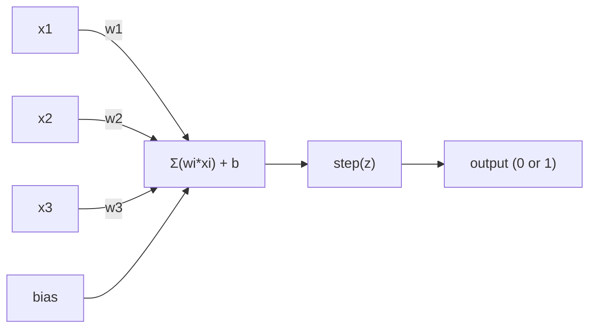
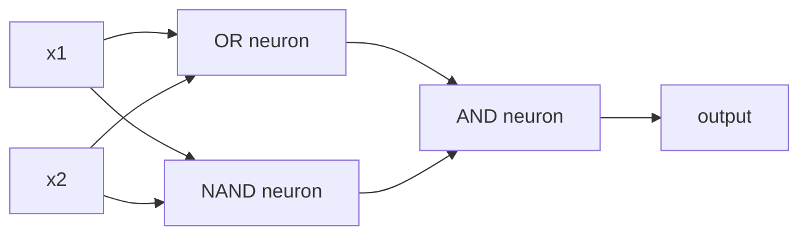

# पर्सेप्ट्रोन

> पर्सेप्ट्रॉन तंत्रिका नेटवर्क का परमाणु है इसे खोलकर आपको वजन, पूर्वाग्रह और निर्णय मिलता है।

**Type:** Build
**Languages:** Python
**Prerequisites:** Phase 1 (Linear Algebra Intuition)
**Time:** ~60 minutes

## सीखने के लक्ष्य

- पायथन में एक पर्सेप्ट्रॉन को खरोंच से लागू करें, जिसमें वजन अद्यतन नियम और चरण सक्रियण फ़ंक्शन शामिल हैं
- समझाएं कि एक एकल परिक्ट्रॉन केवल रैखिक रूप से अलग होने वाली समस्याओं को हल क्यों कर सकता है और एक्सओआर विफलता मामले का प्रदर्शन कर सकता है
- XOR को हल करने के लिए OR, NAND और AND गेट को जोड़कर एक बहु-परत perceptron का निर्माण करें
- XOR को स्वचालित रूप से सीखने के लिए सिग्मोइड सक्रियण और बैकप्रॉपेग के साथ दो-परत नेटवर्क को प्रशिक्षित करें

## समस्या

आप वेक्टर और डॉट उत्पाद जानते हैं. आप जानते हैं कि एक मैट्रिक्स इनपुट को आउटपुट में बदल देता है. लेकिन एक मशीन कैसे सीखती है कि कौन सा परिवर्तन उपयोग करना है?

यह सबसे सरल संभव सीखने की मशीन हैः कुछ इनपुट लें, वजन से गुणा करें, एक पूर्वाग्रह जोड़ें, और एक द्विआधारी निर्णय लें। फिर समायोजित करें। यह है। हर तंत्रिका नेटवर्क कभी बनाया गया है इस विचार की परतों को एक साथ ढेर किया गया है।

पर्सेप्ट्रन को समझने का अर्थ है कि कोड में "लर्निंग" का क्या मतलब हैः आउटपुट वास्तविकता से मेल खाने तक संख्याओं को समायोजित करना।

## अवधारणा

### एक न्यूरॉन, एक निर्णय

एक परिकल्पना n इनपुट लेता है, प्रत्येक को एक वजन से गुणा करता है, उन्हें योगित करता है, एक पूर्वाग्रह जोड़ता है, और एक सक्रियण फ़ंक्शन के माध्यम से परिणाम पारित करता है।



चरण फ़ंक्शन क्रूर हैः यदि वजन योग प्लस पूर्वाग्रह >= 0 है, तो आउटपुट 1। अन्यथा, आउटपुट 0 है।

```
step(z) = 1  if z >= 0
           0  if z < 0
```

यह एक रैखिक वर्गीकरण है। वजन और पूर्वाग्रह एक रेखा (या उच्च आयामों में हाइपरप्लेन) को परिभाषित करते हैं जो इनपुट स्थान को दो क्षेत्रों में विभाजित करता है।

### निर्णय सीमा

दो इनपुट के लिए, पर्सेप्ट्रॉन 2D अंतरिक्ष के माध्यम से एक रेखा खींचता हैः

```
  x2
  ┤
  │  Class 1        /
  │    (0)          /
  │                /
  │               / w1·x1 + w2·x2 + b = 0
  │              /
  │             /     Class 2
  │            /        (1)
  ┼───────────/──────────── x1
```

रेखा के एक तरफ की हर चीज 0 आउटपुट देती है। दूसरी तरफ की हर चीज 1 आउटपुट देती है। प्रशिक्षण इस रेखा को तब तक ले जाता है जब तक कि यह कक्षाओं को सही ढंग से अलग नहीं करता।

### सीखने का नियम

परिक्ट्रॉन सीखने का नियम सरल हैः

```
For each training example (x, y_true):
    y_pred = predict(x)
    error = y_true - y_pred

    For each weight:
        w_i = w_i + learning_rate * error * x_i
    bias = bias + learning_rate * error
```

यदि भविष्यवाणी सही है, तो त्रुटि = 0, कुछ भी नहीं बदलता है। यदि यह भविष्यवाणी करता है 0 लेकिन 1 होना चाहिए, तो वजन बढ़ता है। यदि यह भविष्यवाणी करता है 1 लेकिन 0 होना चाहिए, तो वजन कम होता है। सीखने की दर नियंत्रित करती है कि प्रत्येक समायोजन कितना बड़ा है।

### एक्सओआर समस्या

यहाँ यह टूट जाता है. इन तर्क द्वारों को देखोः

```
AND gate:           OR gate:            XOR gate:
x1  x2  out         x1  x2  out         x1  x2  out
0   0   0           0   0   0           0   0   0
0   1   0           0   1   1           0   1   1
1   0   0           1   0   1           1   0   1
1   1   1           1   1   1           1   1   0
```

AND और OR रैखिक रूप से अलग हो सकते हैंः आप 0s को 1s से अलग करने के लिए एक एकल रेखा खींच सकते हैं। XOR नहीं है। कोई एकल रेखा [0,1] और [1,0] को [0,0] और [1,1] से अलग नहीं कर सकती है।

```
AND (separable):        XOR (not separable):

  x2                      x2
  1 ┤  0     1            1 ┤  1     0
    │     /                 │
  0 ┤  0 / 0              0 ┤  0     1
    ┼──/──────── x1         ┼──────────── x1
       line works!          no single line works!
```

यह एक मौलिक सीमा है. एक एकल धारणा केवल रैखिक रूप से अलग समस्याओं को हल कर सकती है। मिन्स्की और पेपर्ट ने 1969 में यह साबित किया और यह लगभग एक दशक के लिए तंत्रिका नेटवर्क अनुसंधान को मार डाला।

समाधानः पर्सेप्ट्रॉन को परतों में ढेर करें। एक बहु-परत पर्सेप्ट्रॉन दो रैखिक निर्णयों को एक गैर-रेखीय निर्णय में जोड़कर XOR को हल कर सकता है।

```figure
perceptron-boundary
```

## इसे बनाओ

### चरण 1: पर्सेप्ट्रॉन वर्ग

```python
class Perceptron:
    def __init__(self, n_inputs, learning_rate=0.1):
        self.weights = [0.0] * n_inputs
        self.bias = 0.0
        self.lr = learning_rate

    def predict(self, inputs):
        total = sum(w * x for w, x in zip(self.weights, inputs))
        total += self.bias
        return 1 if total >= 0 else 0

    def train(self, training_data, epochs=100):
        for epoch in range(epochs):
            errors = 0
            for inputs, target in training_data:
                prediction = self.predict(inputs)
                error = target - prediction
                if error != 0:
                    errors += 1
                    for i in range(len(self.weights)):
                        self.weights[i] += self.lr * error * inputs[i]
                    self.bias += self.lr * error
            if errors == 0:
                print(f"Converged at epoch {epoch + 1}")
                return
        print(f"Did not converge after {epochs} epochs")
```

### चरण 2: तर्क गेट पर प्रशिक्षण

```python
and_data = [
    ([0, 0], 0),
    ([0, 1], 0),
    ([1, 0], 0),
    ([1, 1], 1),
]

or_data = [
    ([0, 0], 0),
    ([0, 1], 1),
    ([1, 0], 1),
    ([1, 1], 1),
]

not_data = [
    ([0], 1),
    ([1], 0),
]

print("=== AND Gate ===")
p_and = Perceptron(2)
p_and.train(and_data)
for inputs, _ in and_data:
    print(f"  {inputs} -> {p_and.predict(inputs)}")

print("\n=== OR Gate ===")
p_or = Perceptron(2)
p_or.train(or_data)
for inputs, _ in or_data:
    print(f"  {inputs} -> {p_or.predict(inputs)}")

print("\n=== NOT Gate ===")
p_not = Perceptron(1)
p_not.train(not_data)
for inputs, _ in not_data:
    print(f"  {inputs} -> {p_not.predict(inputs)}")
```

### चरण 3: XOR विफलता को देखें

```python
xor_data = [
    ([0, 0], 0),
    ([0, 1], 1),
    ([1, 0], 1),
    ([1, 1], 0),
]

print("\n=== XOR Gate (single perceptron) ===")
p_xor = Perceptron(2)
p_xor.train(xor_data, epochs=1000)
for inputs, expected in xor_data:
    result = p_xor.predict(inputs)
    status = "OK" if result == expected else "WRONG"
    print(f"  {inputs} -> {result} (expected {expected}) {status}")
```

यह एक ठोस सबूत है कि एक एकल perceptron XOR सीखने नहीं कर सकते है।

### चरण 4: दो परतों के साथ XOR हल करें

चालः XOR = (x1 OR x2) और NOT (x1 AND x2) । तीन धारणाओं को मिलाएं:



```python
def xor_network(x1, x2):
    or_neuron = Perceptron(2)
    or_neuron.weights = [1.0, 1.0]
    or_neuron.bias = -0.5

    nand_neuron = Perceptron(2)
    nand_neuron.weights = [-1.0, -1.0]
    nand_neuron.bias = 1.5

    and_neuron = Perceptron(2)
    and_neuron.weights = [1.0, 1.0]
    and_neuron.bias = -1.5

    hidden1 = or_neuron.predict([x1, x2])
    hidden2 = nand_neuron.predict([x1, x2])
    output = and_neuron.predict([hidden1, hidden2])
    return output


print("\n=== XOR Gate (multi-layer network) ===")
for inputs, expected in xor_data:
    result = xor_network(inputs[0], inputs[1])
    print(f"  {inputs} -> {result} (expected {expected})")
```

चारों मामलों में सही है. पर्सेप्ट्रॉन को परतों में ढेर करने से निर्णय सीमाएं बनती हैं जो कोई भी पर्सेप्ट्रॉन नहीं बना सकता है।

### चरण 5: दो परतों वाला नेटवर्क बनाएं

चरण 4 वजन हाथ से तार. यह XOR के लिए काम करता है, लेकिन वास्तविक समस्याओं के लिए नहीं जहां आप सही वजन पहले से नहीं जानते हैं. फिक्सः सिग्मोइड के साथ कदम समारोह की जगह और वजन स्वचालित रूप से बैकप्रॉपेग के माध्यम से सीखना.

```python
class TwoLayerNetwork:
    def __init__(self, learning_rate=0.5):
        import random
        random.seed(0)
        self.w_hidden = [[random.uniform(-1, 1), random.uniform(-1, 1)] for _ in range(2)]
        self.b_hidden = [random.uniform(-1, 1), random.uniform(-1, 1)]
        self.w_output = [random.uniform(-1, 1), random.uniform(-1, 1)]
        self.b_output = random.uniform(-1, 1)
        self.lr = learning_rate

    def sigmoid(self, x):
        import math
        x = max(-500, min(500, x))
        return 1.0 / (1.0 + math.exp(-x))

    def forward(self, inputs):
        self.inputs = inputs
        self.hidden_outputs = []
        for i in range(2):
            z = sum(w * x for w, x in zip(self.w_hidden[i], inputs)) + self.b_hidden[i]
            self.hidden_outputs.append(self.sigmoid(z))
        z_out = sum(w * h for w, h in zip(self.w_output, self.hidden_outputs)) + self.b_output
        self.output = self.sigmoid(z_out)
        return self.output

    def train(self, training_data, epochs=10000):
        for epoch in range(epochs):
            total_error = 0
            for inputs, target in training_data:
                output = self.forward(inputs)
                error = target - output
                total_error += error ** 2

                d_output = error * output * (1 - output)

                saved_w_output = self.w_output[:]
                hidden_deltas = []
                for i in range(2):
                    h = self.hidden_outputs[i]
                    hd = d_output * saved_w_output[i] * h * (1 - h)
                    hidden_deltas.append(hd)

                for i in range(2):
                    self.w_output[i] += self.lr * d_output * self.hidden_outputs[i]
                self.b_output += self.lr * d_output

                for i in range(2):
                    for j in range(len(inputs)):
                        self.w_hidden[i][j] += self.lr * hidden_deltas[i] * inputs[j]
                    self.b_hidden[i] += self.lr * hidden_deltas[i]
```

```python
net = TwoLayerNetwork(learning_rate=2.0)
net.train(xor_data, epochs=10000)
for inputs, expected in xor_data:
    result = net.forward(inputs)
    predicted = 1 if result >= 0.5 else 0
    print(f"  {inputs} -> {result:.4f} (rounded: {predicted}, expected {expected})")
```

चरण 4 से दो प्रमुख अंतर. पहला, सिग्मोइड चरण समारोह की जगह ले जाता है - यह चिकनी है, इसलिए gradients मौजूद है. दूसरा, `train`विधि आउटपुट से छिपे हुए परत पर त्रुटि को पीछे की ओर फैलाती है, प्रत्येक वजन को त्रुटि में योगदान के अनुपात में समायोजित करती है। यह 20 पंक्तियों में पीछे की फैलाव है।

यह पाठ 03 की पुल है। इसके पीछे गणित है।`d_output`और `hidden_deltas`नेटवर्क ग्राफ पर लागू श्रृंखला नियम है. हम इसे सही ढंग से वहाँ प्राप्त करेंगे.

## इसका प्रयोग करें

सब कुछ आप अभी शुरू से बनाया है एक आयात में मौजूद हैः

```python
from sklearn.linear_model import Perceptron as SkPerceptron
import numpy as np

X = np.array([[0,0],[0,1],[1,0],[1,1]])
y = np.array([0, 0, 0, 1])

clf = SkPerceptron(max_iter=100, tol=1e-3)
clf.fit(X, y)
print([clf.predict([x])[0] for x in X])
```

पांच पंक्तियाँ.`Perceptron`वर्ग एक ही बात करता है. sklearn संस्करण अभिसरण जांच, कई हानि कार्यों, और दुर्लभ इनपुट समर्थन जोड़ता है - लेकिन कोर लूप समान हैः वजन योग, कदम समारोह, त्रुटि पर वजन अद्यतन.

उत्पादन नेटवर्क में क्या बदलावः

- चरण समारोह सिग्मोइड, ReLU, या अन्य चिकनी सक्रियण हो जाता है
- वजन को बैकप्रॉपेग के माध्यम से स्वचालित रूप से सीखा जाता है (पाठ 03)
- परतें गहराई से बढ़ जाती हैंः 3, 10, 100+ परतें
- वही सिद्धांत है: प्रत्येक परत पिछले परत के आउटपुट से नई विशेषताएं बनाता है

एक एकल perceptron केवल सीधी रेखाएं खींच सकते हैं उन्हें ढेर, और आप किसी भी आकार को आकर्षित कर सकते हैं.

## इसे भेजें

इस पाठ से उत्पन्न होता हैः
- `outputs/skill-perceptron.md`- एक स्तर की वास्तुकला के साथ बहु-स्तर वास्तुकला की आवश्यकता होने पर एक कौशल

## व्यायाम

1. NAND गेट पर एक perceptron को प्रशिक्षित करें (सार्वभौमिक गेट - NAND से कोई भी तर्क सर्किट बनाया जा सकता है) इसके वजन और पूर्वाग्रह को मान्य निर्णय सीमा के रूप में सत्यापित करें।
2. प्रत्येक युग में निर्णय सीमा (w1*x1 + w2*x2 + b = 0) को ट्रैक करने के लिए पर्सेप्ट्रॉन वर्ग को संशोधित करें। AND गेट पर प्रशिक्षण के दौरान रेखा कैसे बदलती है, प्रिंट करें।
3. एक 3-इनपुट परिक्ट्रॉन बनाएं जो केवल 1 आउटपुट करता है जब 3 इनपुट में से कम से कम 2 1 (बहुमत वोट फ़ंक्शन) हैं। क्या यह रैखिक रूप से अलग किया जा सकता है? क्यों?

## प्रमुख शर्तें

| Term | What people say | What it actually means |
|------|----------------|----------------------|
| Perceptron | "A fake neuron" | A linear classifier: dot product of inputs and weights, plus bias, through a step function |
| Weight | "How important an input is" | A multiplier that scales each input's contribution to the decision |
| Bias | "The threshold" | A constant that shifts the decision boundary, letting the perceptron fire even with zero inputs |
| Activation function | "The thing that squishes values" | A function applied after the weighted sum - step function for perceptrons, sigmoid/ReLU for modern networks |
| Linearly separable | "You can draw a line between them" | A dataset where a single hyperplane can perfectly separate the classes |
| XOR problem | "The thing perceptrons can't do" | Proof that single-layer networks cannot learn non-linearly-separable functions |
| Decision boundary | "Where the classifier switches" | The hyperplane w*x + b = 0 that divides input space into two classes |
| Multi-layer perceptron | "A real neural network" | Perceptrons stacked in layers, where each layer's output feeds the next layer's input |

## आगे पढ़ना

- फ्रैंक रोसेनब्लेट, "द पर्सेप्ट्रोनः द ब्रेन में सूचना भंडारण और संगठन के लिए एक संभावनावादी मॉडल" (1958) -- मूल पेपर जिसने यह सब शुरू किया
- मिन्स्की और पेपर्ट, "परसेप्ट्रॉन" (1969) -- पुस्तक जिसने साबित किया कि एक्सओआर एकल-परत नेटवर्क द्वारा हल नहीं किया जा सकता था और एक दशक तक परसेप्ट्रॉन अनुसंधान को मार दिया
- माइकल नीलसन, "न्यूरल नेटवर्क और डीप लर्निंग", अध्याय 1 (http://neuralnetworksanddeeplearning.com/) -- मुक्त ऑनलाइन, सबसे अच्छा दृश्य स्पष्टीकरण कैसे नेटवर्क में perceptrons रचना
