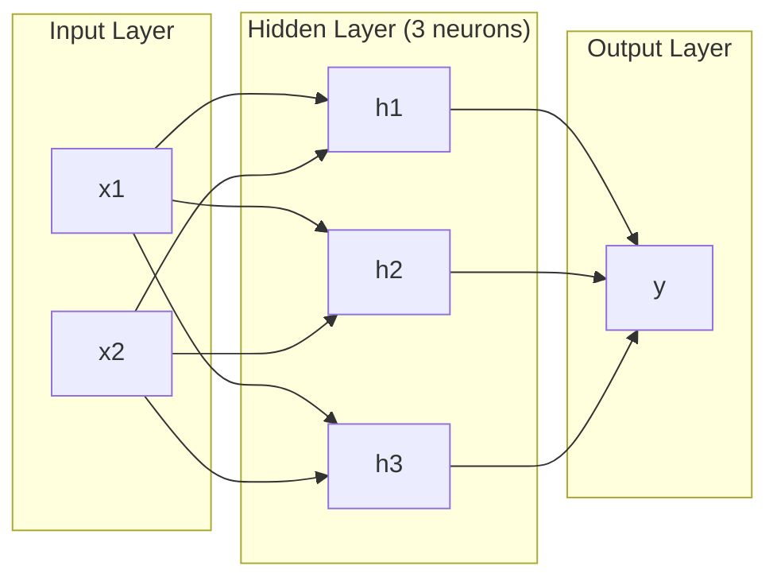
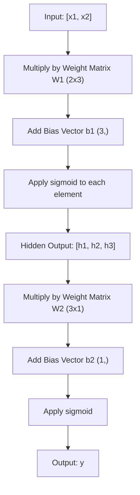
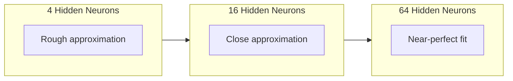

# बहुस्तरीय नेटवर्क और फॉरवर्ड पास

> एक न्यूरॉन एक रेखा खींचता है, उन्हें ढेर कर, और आप कुछ भी खींच सकते हैं।

**Type:** Build
**Languages:** Python
**Prerequisites:** Phase 01 (Math Foundations), Lesson 03.01 (The Perceptron)
**Time:** ~90 minutes

## सीखने के लक्ष्य

- लेयर और नेटवर्क वर्गों के साथ खरोंच से एक बहु-परत नेटवर्क का निर्माण करें जो एक पूर्ण आगे पास करते हैं
- नेटवर्क की प्रत्येक परत के माध्यम से ट्रैस मैट्रिक्स आयामों को ट्रैक करें और आकार असंगतताओं की पहचान करें
- स्पष्ट करें कि कैसे गैर-रेखीय सक्रियणों को ढेर करने से नेटवर्क को घुमावदार निर्णय सीमाओं को सीखने में सक्षम बनाता है
- हाथ से ट्यून सिग्मोइड वजन के साथ 2-2-1 वास्तुकला का उपयोग करके XOR समस्या को हल करें

## समस्या

एक न्यूरॉन एक रेखा ड्रॉवर है. यह है. आपके डेटा के माध्यम से एक सीधी रेखा. एआई में हर वास्तविक समस्या - छवि पहचान, भाषा समझ, गो खेलना - वक्रों की आवश्यकता होती है. न्यूरॉन को परतों में ढेर करना वक्रों को प्राप्त करने का तरीका है.

1969 में, मिन्स्की और पेपर्ट ने यह सीमा घातक साबित कीः एक एकल-परत नेटवर्क XOR नहीं सीख सकता है। "लड़ता नहीं सीखता" - गणितीय रूप से नहीं। XOR सत्य तालिका एक तरफ [0,1] और [1,0] को एक तरफ, [0,0] और [1,1] को दूसरी तरफ रखती है। कोई एकल रेखा उन्हें अलग नहीं करती है।

इससे एक दशक से अधिक समय तक तंत्रिका नेटवर्क के वित्तपोषण को समाप्त कर दिया गया। पीछे की ओर देखते हुए, समाधान स्पष्ट थाः एक परत का उपयोग करना बंद करें। न्यूरॉन्स को परतों में ढेर करें। पहले परत को इनपुट स्थान को नई सुविधाओं में काटने दें, और दूसरे परत को उन सुविधाओं को उन निर्णयों में जोड़ने दें जो कोई एक लाइन नहीं ले सकती।

यह स्टैक बहु-परत नेटवर्क है. यह आज उत्पादन में हर गहरे सीखने के मॉडल का आधार है. आगे की पार -- इनपुट से छिपे हुए परतों से आउटपुट तक डेटा प्रवाह -- पहली चीज है जिसे आपको कुछ भी काम करने से पहले बनाने की आवश्यकता है।

## अवधारणा

### परतेंः इनपुट, छिपा हुआ, आउटपुट

बहु-परत नेटवर्क में तीन प्रकार की परतें होती हैंः

**Input layer**यह आपके कच्चे डेटा को रखता है. दो विशेषताएं दो इनपुट नोड्स का मतलब है. कोई गणना यहां नहीं होती है.

**Hidden layers**-- जहां काम होता है. प्रत्येक न्यूरॉन पिछले परत से प्रत्येक आउटपुट लेता है, वजन और एक पूर्वाग्रह लागू करता है, फिर एक सक्रियण समारोह के माध्यम से परिणाम पारित करता है. "छिपा" क्योंकि आप कभी भी इन मानों को सीधे प्रशिक्षण डेटा में नहीं देखते हैं.

**Output layer**-- अंतिम उत्तर. द्विआधारी वर्गीकरण के लिए, सिग्मोइड के साथ एक न्यूरॉन. बहु-वर्ग के लिए, प्रति वर्ग एक न्यूरॉन.



यह एक 2-3-1 नेटवर्क है. दो इनपुट, तीन छिपे हुए न्यूरॉन्स, एक आउटपुट. प्रत्येक कनेक्शन का वजन होता है. प्रत्येक न्यूरॉन्स (इनपुट को छोड़कर) एक पूर्वाग्रह है.

प्रत्येक परत में संख्याओं का वेक्टर होता है जिसे छिपा हुआ राज्य कहा जाता है. पाठ के लिए, छिपी हुई अवस्थाएं आयाम बढ़ाती हैं - एक शब्द को 768 संख्याओं के रूप में एन्कोडिंग करना अर्थपूर्ण अर्थ को पकड़ने के लिए। चित्रों के लिए, वे आयाम को कम करते हैं - लाखों पिक्सेल को एक प्रबंधनीय प्रतिनिधित्व में संपीड़ित करते हैं। छिपी हुई अवस्था वह जगह है जहां सीखने का जीवन रहता है।

### न्यूरॉन्स और सक्रियण

प्रत्येक न्यूरॉन तीन काम करता हैः

1. प्रत्येक इनपुट को उसके संबंधित वजन से गुणा करें
2. सभी उत्पादों को योग और एक पूर्वाग्रह जोड़ें
3. एक सक्रियण फ़ंक्शन के माध्यम से राशि पारित करें

अभी के लिए, सक्रियण सिग्मोइड हैः

```
sigmoid(z) = 1 / (1 + e^(-z))
```

सिग्मोइड किसी भी संख्या को दायरे में स्क्वाश करता है (0, 1). बड़े सकारात्मक इनपुट 1 की ओर धकेलते हैं। बड़े नकारात्मक इनपुट 0 की ओर धकेलते हैं। शून्य मानचित्र 0.5 तक। यह चिकनी वक्र सीखने को संभव बनाता है - पर्सेप्ट्रॉन के कठिन कदम के विपरीत, सिग्मोइड में हर जगह एक ग्रेडिएंट है।

### आगे की यात्राः डेटा कैसे प्रवाह करता है

आगे की पास नेटवर्क के माध्यम से इनपुट डेटा को परत-पर-परत धकेलती है, जब तक कि यह आउटपुट तक नहीं पहुंच जाता है। आगे की पास के दौरान कोई सीख नहीं होती है। यह शुद्ध गणना हैः गुणा, जोड़ें, सक्रिय करें, दोहराएं।



प्रत्येक परत पर, तीन ऑपरेशन क्रमशः होते हैंः

```
z = W * input + b       (linear transformation)
a = sigmoid(z)           (activation)
```

एक परत का आउटपुट अगले परत का इनपुट बन जाता है। यह संपूर्ण आगे का पास है।

### मैट्रिक्स आयाम

डीप लर्निंग में ट्रैकिंग आयाम सबसे महत्वपूर्ण डिबगिंग कौशल है। यहां 2-3-1 नेटवर्क हैः

| Step | Operation | Dimensions | Result Shape |
|------|-----------|------------|-------------|
| Input | x | -- | (2,) |
| Hidden linear | W1 * x + b1 | W1: (3, 2), b1: (3,) | (3,) |
| Hidden activation | sigmoid(z1) | -- | (3,) |
| Output linear | W2 * h + b2 | W2: (1, 3), b2: (1,) | (1,) |
| Output activation | sigmoid(z2) | -- | (1,) |

नियमः परत k पर वजन मैट्रिक्स W का आकार है (न्यूयॉरन्स_इन_लेयर_के, न्यूरॉन_इन_लेयर_के_मिनस_1) । पंक्तियां वर्तमान परत से मेल खाती हैं। स्तंभ पिछले परत से मेल खाती हैं। यदि आकार पंक्तिबद्ध नहीं होते हैं, तो आपके पास एक बग है।

### सार्वभौमिक समीकरण प्रमेय

1989 में, जॉर्ज साइबेन्को ने कुछ उल्लेखनीय साबित कियाः एक ही छिपी हुई परत और पर्याप्त न्यूरॉन्स वाले तंत्रिका नेटवर्क किसी भी निरंतर कार्य को किसी भी वांछित सटीकता के करीब ले सकते हैं।

इसका मतलब यह नहीं है कि एक छिपी परत हमेशा सबसे अच्छी होती है। इसका मतलब है कि वास्तुकला सैद्धांतिक रूप से सक्षम है। व्यवहार में, गहरे नेटवर्क (अधिक परतें, प्रति परत कम न्यूरॉन्स) समान कार्यों को बहुत कम कुल मापदंडों के साथ सीखते हैं। यही कारण है कि गहरे शिक्षण काम करता है।

अंतर्ज्ञानः छिपे हुए परत में प्रत्येक न्यूरॉन एक "बंप" या विशेषता सीखता है। सही स्थानों पर रखे गए पर्याप्त बंप किसी भी चिकनी वक्र के करीब हो सकते हैं। अधिक न्यूरॉन, अधिक बंप, बेहतर अनुमान।



### सम्मिश्रण

न्यूरल नेटवर्क कम्पोजिबल हैं. आप उन्हें ढेर कर सकते हैं, उन्हें चेन कर सकते हैं, उन्हें समानांतर में चला सकते हैं। एक व्हिस्पर मॉडल ऑडियो को संसाधित करने के लिए एक एन्कोडर नेटवर्क और पाठ उत्पन्न करने के लिए एक अलग डेकोडर नेटवर्क का उपयोग करता है। आधुनिक एलएलएम केवल डेकोडर हैं। BERT केवल एन्कोडर है। T5 एन्कोडर-डेकोडर है। वास्तुकला विकल्प परिभाषित करता है कि मॉडल क्या कर सकता है।

```figure
mlp-forward
```

## इसे बनाओ

शुद्ध पायथन, कोई नंपी नहीं, हर मैट्रिक्स ऑपरेशन खरोंच से लिखा गया है।

### चरण 1: सिग्मोइड सक्रियण

```python
import math

def sigmoid(x):
    x = max(-500.0, min(500.0, x))
    return 1.0 / (1.0 + math.exp(-x))
```

[500, 500] तक की क्लैंप से अतिप्रवाह को रोक दिया जाता है। `math.exp(500)`बड़ा है, लेकिन परिमित है।`math.exp(1000)`अनंत है।

### चरण 2: परत वर्ग

गहन सीखने में सबसे महत्वपूर्ण ऑपरेशन मैट्रिक्स गुणा है. हर परत, हर ध्यान सिर, हर आगे पास - यह नीचे तक मैटमूल है. एक रैखिक परत एक इनपुट वेक्टर लेती है, इसे एक वजन मैट्रिक्स से गुणा करती है, और एक पूर्वाग्रह वेक्टर जोड़ती हैः y = Wx + b. यह एकल समीकरण एक तंत्रिका नेटवर्क में गणना का 90% है.

एक परत में एक वजन मैट्रिक्स और एक पूर्वाग्रह वेक्टर होता है। इसका आगे का तरीका एक इनपुट वेक्टर लेता है और सक्रिय आउटपुट लौटाता है।

```python
class Layer:
    def __init__(self, n_inputs, n_neurons, weights=None, biases=None):
        if weights is not None:
            self.weights = weights
        else:
            import random
            self.weights = [
                [random.uniform(-1, 1) for _ in range(n_inputs)]
                for _ in range(n_neurons)
            ]
        if biases is not None:
            self.biases = biases
        else:
            self.biases = [0.0] * n_neurons

    def forward(self, inputs):
        self.last_input = inputs
        self.last_output = []
        for neuron_idx in range(len(self.weights)):
            z = sum(
                w * x for w, x in zip(self.weights[neuron_idx], inputs)
            )
            z += self.biases[neuron_idx]
            self.last_output.append(sigmoid(z))
        return self.last_output
```

वजन मैट्रिक्स का आकार (n_neurons, n_inputs) है। प्रत्येक पंक्ति सभी इनपुट पर एक न्यूरॉन का वजन है। आगे की विधि न्यूरॉन के माध्यम से लूप्स करती है, वजन किए गए योग प्लस पूर्वाग्रह की गणना करती है, सिग्मोइड लागू करती है, और परिणाम एकत्र करती है।

### चरण 3: नेटवर्क वर्ग

एक नेटवर्क परतों की एक सूची है। आगे की पास उन्हें चेन करती हैः परत k का आउटपुट परत k+1 में फ़ीड करता है।

```python
class Network:
    def __init__(self, layers):
        self.layers = layers

    def forward(self, inputs):
        current = inputs
        for layer in self.layers:
            current = layer.forward(current)
        return current
```

यह पूरी आगे की पार है. तर्क के चार पंक्तियों. डेटा अंदर जाता है, प्रत्येक परत के माध्यम से बहता है, दूसरे पक्ष से बाहर आता है.

### चरण 4: हाथ से ट्यून किए गए वजन के साथ XOR

पाठ 01, हम OR, NAND, और AND धारणाओं को जोड़कर XOR हल किया। अब हमारे परत और नेटवर्क वर्गों के साथ एक ही बात करें। 2-2-1 वास्तुकलाः दो इनपुट, दो छिपे हुए न्यूरॉन्स, एक आउटपुट।

```python
hidden = Layer(
    n_inputs=2,
    n_neurons=2,
    weights=[[20.0, 20.0], [-20.0, -20.0]],
    biases=[-10.0, 30.0],
)

output = Layer(
    n_inputs=2,
    n_neurons=1,
    weights=[[20.0, 20.0]],
    biases=[-30.0],
)

xor_net = Network([hidden, output])

xor_data = [
    ([0, 0], 0),
    ([0, 1], 1),
    ([1, 0], 1),
    ([1, 1], 0),
]

for inputs, expected in xor_data:
    result = xor_net.forward(inputs)
    predicted = 1 if result[0] >= 0.5 else 0
    print(f"  {inputs} -> {result[0]:.6f} (rounded: {predicted}, expected: {expected})")
```

बड़े वजन (20, -20) से सिग्मोइड एक चरण समारोह की तरह कार्य करता है। पहला छिपा हुआ न्यूरॉन OR के करीब है। दूसरा NAND के करीब है। आउटपुट न्यूरॉन उन्हें AND में जोड़ता है, जो XOR है।

### चरण 5: सर्कल वर्गीकरण

एक कठिन समस्याः 2D बिंदुओं को मूल पर केंद्रित त्रिज्या 0.5 के एक वृत्त के अंदर या बाहर वर्गीकृत करें। इसके लिए एक घुमावदार निर्णय सीमा की आवश्यकता होती है - एक एकल परिक्ट्रॉन के लिए असंभव।

```python
import random
import math

random.seed(42)

data = []
for _ in range(200):
    x = random.uniform(-1, 1)
    y = random.uniform(-1, 1)
    label = 1 if (x * x + y * y) < 0.25 else 0
    data.append(([x, y], label))

circle_net = Network([
    Layer(n_inputs=2, n_neurons=8),
    Layer(n_inputs=8, n_neurons=1),
])
```

यादृच्छिक वजन के साथ, नेटवर्क अच्छी तरह से वर्गीकृत नहीं होगा. लेकिन आगे पास अभी भी चल रहा है. यह बिंदु है - आगे पास सिर्फ गणना है. सही वजन सीखना बैकप्रॉगरेशन है, पाठ 03.

```python
correct = 0
for inputs, expected in data:
    result = circle_net.forward(inputs)
    predicted = 1 if result[0] >= 0.5 else 0
    if predicted == expected:
        correct += 1

print(f"Accuracy with random weights: {correct}/{len(data)} ({100*correct/len(data):.1f}%)")
```

यादृच्छिक वजन खराब सटीकता देता है - अक्सर बहुमत वर्ग की अनुमान से भी बदतर। प्रशिक्षण (पाठ 03), 8 छिपे हुए न्यूरॉन्स के साथ यह ही वास्तुकला एक घुमावदार सीमा खींचती है जो अंदर से बाहर को अलग करती है।

## इसका प्रयोग करें

PyTorch चार पंक्तियों में ऊपर सब कुछ करता हैः

```python
import torch
import torch.nn as nn

model = nn.Sequential(
    nn.Linear(2, 8),
    nn.Sigmoid(),
    nn.Linear(8, 1),
    nn.Sigmoid(),
)

x = torch.tensor([[0.0, 0.0], [0.0, 1.0], [1.0, 0.0], [1.0, 1.0]])
output = model(x)
print(output)
```

`nn.Linear(2, 8)`है अपने परत वर्गः आकार के वजन मैट्रिक्स (8, 2), आकार के bias वेक्टर (8,) । `nn.Sigmoid()`है अपने सिग्मोइड फ़ंक्शन तत्वों के अनुसार लागू किया गया है। `nn.Sequential`आपके नेटवर्क वर्गः श्रृंखला परतों क्रम में है।

अंतर गति और पैमाने में है. PyTorch GPU पर चलता है, लाखों नमूनों के बैचों को संभालता है, और स्वचालित रूप से बैकप्रॉपेगेशन के लिए ग्रेडिएंट गणना करता है. लेकिन आगे पास तर्क आप अभी से बनाया है के समान है खरोंच से.

## इसे भेजें

इस पाठ में नेटवर्क आर्किटेक्चर डिजाइन करने के लिए एक पुनः प्रयोज्य प्रॉम्प्ट उत्पन्न होता हैः

- `outputs/prompt-network-architect.md`

इसका इस्तेमाल जब आपको यह तय करने की ज़रूरत हो कि कितने परतें, कितने न्यूरॉन्स प्रति परत, और किसी दिए गए समस्या के लिए कौन से सक्रियण कार्य का उपयोग करना है।

## व्यायाम

1. एक 2-4-2-1 नेटवर्क (दो छिपे हुए परतों) का निर्माण करें और यादृच्छिक वजन के साथ XOR डेटा पर आगे की पास चलाएं। प्रत्येक परत पर प्रतिनिधित्व कैसे बदलता है, यह देखने के लिए मध्य छिपे हुए परत आउटपुट प्रिंट करें।

2. सर्कल वर्गीकरण में छिपे हुए परत का आकार 8 से 2 तक बदलें, फिर 32 तक। यादृच्छिक वजन के साथ आगे की पास को हर बार चलाएं। क्या छिपे हुए न्यूरॉन्स की संख्या आउटपुट रेंज या वितरण को बदलती है? क्यों?

3. एक `count_parameters`नेटवर्क वर्ग पर विधि जो प्रशिक्षित वजन और पूर्वाग्रहों की कुल संख्या लौटाता है। इसे 784-256-128-10 नेटवर्क (क्लासिक MNIST वास्तुकला) पर परीक्षण करें। इसमें कितने पैरामीटर हैं?

4. 3-4-4-2 नेटवर्क के लिए एक फॉरवर्ड पास बनाएं। इसे RGB रंग मान (0-1 के लिए सामान्य) खिलाएं और दो आउटपुट का निरीक्षण करें। यह दो वर्गों के साथ एक सरल रंग वर्गीकरण के लिए वास्तुकला है।

5. सिग्मोइड को "लीकी स्टेप" फ़ंक्शन से बदलेंः 0.01 * z लौटाएं यदि z < 0, तो 1.0. XOR पर आगे की पास को चरण 4 से समान हाथ से ट्यून किए गए वजन के साथ चलाएं। क्या यह अभी भी काम करता है?

## प्रमुख शर्तें

| Term | What people say | What it actually means |
|------|----------------|----------------------|
| Forward pass | "Running the model" | Pushing input through every layer -- multiply by weights, add bias, activate -- to produce an output |
| Hidden layer | "The middle part" | Any layer between input and output whose values are not directly observed in the data |
| Multi-layer network | "A deep neural network" | Layers of neurons stacked sequentially, where each layer's output feeds the next layer's input |
| Activation function | "The nonlinearity" | A function applied after the linear transformation that introduces curves into the decision boundary |
| Sigmoid | "The S-curve" | sigma(z) = 1/(1+e^(-z)), squashes any real number to (0,1), smooth and differentiable everywhere |
| Weight matrix | "The parameters" | A matrix W of shape (current_layer_neurons, previous_layer_neurons) containing learnable connection strengths |
| Bias vector | "The offset" | A vector added after the matrix multiply that lets neurons activate even when all inputs are zero |
| Universal approximation | "Neural nets can learn anything" | A single hidden layer with enough neurons can approximate any continuous function -- but "enough" can mean billions |
| Linear transformation | "The matrix multiply step" | z = W * x + b, the computation before activation, which maps inputs to a new space |
| Decision boundary | "Where the classifier switches" | The surface in input space where the network output crosses the classification threshold |

## आगे पढ़ना

- माइकल नीलसन, "न्यूरल नेटवर्क और डीप लर्निंग", अध्याय 1-2 (http://neuralnetworksanddeeplearning.com/) -- इंटरैक्टिव विज़ुअलाइज़ेशन के साथ आगे के पास और नेटवर्क संरचना का सबसे स्पष्ट मुक्त स्पष्टीकरण
- साइबेन्को, "सिग्मोइडल फ़ंक्शन के सुपरपोझिशन द्वारा अनुमान" (1989) - मूल सार्वभौमिक अनुमान प्रमेय पेपर, आश्चर्यजनक रूप से पठनीय
- 3Blue1Brown, "लेकिन एक तंत्रिका नेटवर्क क्या है?https://www.youtube.com/watch?v=aircAruvnKk) -- 20 मिनट के दृश्य पैदल माध्यम से परतों, वजन, और आगे पास जो सही मानसिक मॉडल बनाता है
- गुडफ़ेल, बेन्गियो, Courville, "डीप लर्निंग", अध्याय 6 (https://www.deeplearningbook.org/) -- बहुस्तरीय नेटवर्क के लिए मानक संदर्भ, मुफ्त ऑनलाइन
