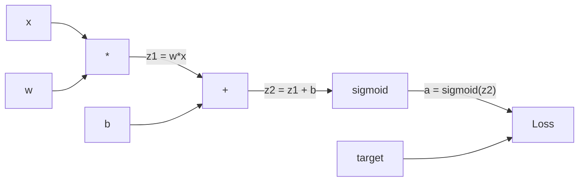
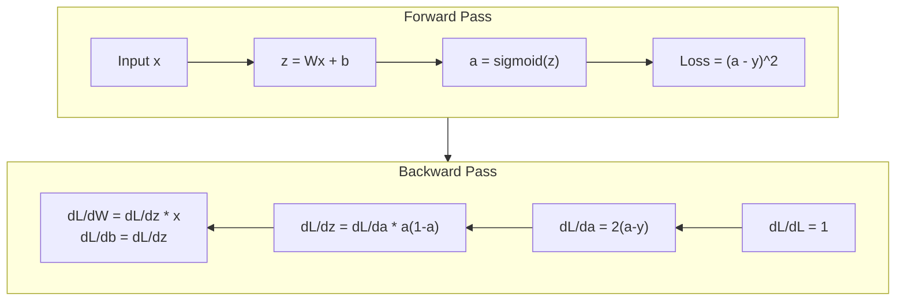
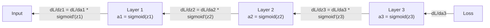

# स्क्रैच से बैकप्रॉपेग

> बैकप्रॉपेगेशन वह एल्गोरिथ्म है जो सीखने को संभव बनाता है। इसके बिना, तंत्रिका नेटवर्क केवल महंगे यादृच्छिक संख्या जनरेटर हैं।

**Type:** Build
**Languages:** Python
**Prerequisites:** Lesson 03.02 (Multi-Layer Networks)
**Time:** ~120 minutes

## सीखने के लक्ष्य

- एक मूल्य आधारित ऑटोग्रेड इंजन को लागू करें जो एक कंप्यूटेशनल ग्राफ बनाता है और टॉपलॉजिकल सॉर्ट के माध्यम से ग्रेडिएंट्स की गणना करता है
- श्रृंखला नियम का उपयोग करके जोड़, गुणा और सिग्मोइड के लिए पीछे की ओर पास प्राप्त करें
- केवल अपने खरोंच से बैकप्रॉपेगेशन इंजन का उपयोग करके XOR और सर्कल वर्गीकरण पर एक बहु-परत नेटवर्क को प्रशिक्षित करें
- गहरे सिग्मोइड नेटवर्क में गायब होने वाली ग्रेडिएंट समस्या की पहचान करें और समझाएं कि ग्रेडिएंट्स का तेजी से घटना क्यों है

## समस्या

आपके नेटवर्क में 768 इनपुट और 3072 आउटपुट के साथ एक छिपी हुई परत है। यह 2,359,296 वजन है। यह एक गलत भविष्यवाणी की। किस वजन ने त्रुटि का कारण बना? प्रत्येक वजन का व्यक्तिगत रूप से परीक्षण करने का मतलब 2.3 मिलियन आगे के पास है। बैकप्रॉपेगेशन एक एकल पीछे के पास में सभी 2.3 मिलियन ग्रेडिएंट की गणना करता है। यह अनुकूलन नहीं है। यह प्रशिक्षित और असंभव के बीच का अंतर है।

एक वजन लेने के लिए, इसे एक छोटी मात्रा में धक्का दें, आगे की पार फिर से चलाएं, मापें कि क्या नुकसान ऊपर या नीचे चला गया। यह आपको उस वजन के लिए ग्रेडिएंट देता है। अब नेटवर्क में प्रत्येक वजन के लिए ऐसा करें। हजारों प्रशिक्षण चरणों और लाखों डेटा बिंदुओं से गुणा करें। आपको कुछ भी उपयोगी प्रशिक्षण के लिए भूवैज्ञानिक समय की आवश्यकता होगी।

बैकप्रॉपेगेशन इसको हल करता है. एक आगे पास, एक पीछे पास, सभी ग्रेडिएंट्स का गणना. ट्रिक है कैल्क्यूलेक्स से श्रृंखला नियम, एक संगणकीय ग्राफ पर व्यवस्थित रूप से लागू किया गया. यह एल्गोरिथ्म है जो गहन सीखने को व्यावहारिक बना दिया. इसके बिना, हम अभी भी खिलौना समस्याओं पर फंस गए होंगे.

## अवधारणा

### नेटवर्क पर लागू श्रृंखला नियम

आप चरण 01, पाठ 05 में श्रृंखला नियम देखा है। त्वरित पुनरावृत्तिः यदि y = f(g(x)), तो dy/dx = f'(g(x)) * g'(x। आप श्रृंखला के साथ व्युत्पन्न गुणा करते हैं।

न्यूरल नेटवर्क में, "चेन" इनपुट से नुकसान तक संचालन का क्रम है। प्रत्येक परत भार लागू करती है, पूर्वाग्रह जोड़ती है, सक्रियण से गुजरती है। हानि फ़ंक्शन अंतिम आउटपुट की तुलना लक्ष्य से करती है। बैकप्रॉपेगेशन इस श्रृंखला को पीछे की ओर ट्रैक करता है, यह गणना करता है कि प्रत्येक ऑपरेशन ने त्रुटि में कैसे योगदान दिया।

### कम्प्यूटेशनल ग्राफ

प्रत्येक आगे के पास एक ग्राफ बनाता है। प्रत्येक नोड एक ऑपरेशन (बहुगुणित, जोड़, सिग्मोइड) है। प्रत्येक किनारे में एक मान आगे और एक ग्रेडिएंट पीछे ले जाता है।



आगे की ओर पासः मान बाएं से दाएं बहते हैं। x और w z1 = w*x उत्पन्न करते हैं। z2 प्राप्त करने के लिए b जोड़ें। सिग्मोइड सक्रियण a देता है। हानि फ़ंक्शन का उपयोग करके a को लक्ष्य y के साथ तुलना करें।

पीछे की ओर पासः ग्रेडिएंट दाएं से बाएं तक बहते हैं। dL/da (सक्रियता के साथ नुकसान कैसे बदलता है) से शुरू करें। da/dz2 (सिग्मोइड व्युत्पन्न) से गुणा करें। यह dL/dz2 देता है। dL/dz2 में विभाजित करें (जो dL/dz2 के बराबर है, क्योंकि z2 = z1 + b) और dL/dz1 के बराबर है। फिर dL/dw = dL/dz1 * x और dL/dx = dL/dz1 * w।

ग्राफ में प्रत्येक नोड का एक काम है पीछे की ओर जाने के दौरानः ऊपर से आने वाले ग्रेडिएंट को ले लो, स्थानीय व्युत्पन्न से गुणा करो, और इसे नीचे ले जाओ।

### आगे और पीछे



आगे के पास में प्रत्येक मध्यवर्ती मान संग्रहीत होता हैः z, a, प्रत्येक परत के इनपुट। पिछड़े पास में ग्रेडिएंट्स का गणना करने के लिए इन संग्रहीत मानों की आवश्यकता होती है। यह बैकप्रॉप के केंद्र में मेमोरी-गणना व्यापार है। आप गति (मिलियंस के बजाय एक पास) के लिए मेमोरी (स्टोरेज सक्रियण) का आदान-प्रदान करते हैं।

### नेटवर्क के माध्यम से क्रमिक प्रवाह

तीन परतों के नेटवर्क के लिए, प्रत्येक परत के माध्यम से ग्रेडिएंट श्रृंखलाः



प्रत्येक परत पर, ग्रेडिएंट सिग्मोइड व्युत्पन्न द्वारा गुणा किया जाता है। सिग्मोइड व्युत्पन्न * (1 - ए) है, जो 0.25 पर अधिकतम निकलता है (जब ए = 0.5) । तीन परतों की गहराई पर, ग्रेडिएंट को अधिकतम 0.25^3 = 0.0156 से गुणा किया गया है। दस परतों की गहराईः 0.25^10 = 0.000001।

### गिरते हुए ग्रेडिएंट

यह गायब हो रही ग्रेडिएंट समस्या है। सिग्मोइड अपना आउटपुट 0 से 1 के बीच कुचल देता है। इसका व्युत्पन्न हमेशा 0.25 से कम होता है। पर्याप्त सिग्मोइड परतें ढेर करें और ग्रेडिएंट्स शून्य तक सिकुड़ जाते हैं। शुरुआती परतें मुश्किल से सीखती हैं क्योंकि उन्हें लगभग शून्य ग्रेडिएंट प्राप्त होते हैं।

```
sigmoid(z):     Output range [0, 1]
sigmoid'(z):    Max value 0.25 (at z = 0)

After 5 layers:   gradient * 0.25^5 = 0.001x original
After 10 layers:  gradient * 0.25^10 = 0.000001x original
```

यही कारण है कि गहरे सिग्मोइड नेटवर्क को प्रशिक्षित करना लगभग असंभव है. फिक्स - ReLU और इसके संस्करण - पाठ 04 का विषय है. अभी के लिए, समझें कि बैकप्रॉप सही ढंग से काम करता है. समस्या यह है कि यह क्या काम कर रहा है के माध्यम से काम कर रहा है.

### 2-परत नेटवर्क के लिए ग्रेडिएंट्स व्युत्पन्न करना

इनपुट एक्स, सिग्मोइड के साथ छिपे हुए परत, सिग्मोइड के साथ आउटपुट परत और एमएसई हानि के साथ नेटवर्क के लिए ठोस गणित।

आगे की पासः
```
z1 = W1 * x + b1
a1 = sigmoid(z1)
z2 = W2 * a1 + b2
a2 = sigmoid(z2)
L = (a2 - y)^2
```

पीछे की ओर जाने का रास्ता (चिन्तन नियम को कदम से कदम लागू करना):
```
dL/da2 = 2(a2 - y)
da2/dz2 = a2 * (1 - a2)
dL/dz2 = dL/da2 * da2/dz2 = 2(a2 - y) * a2 * (1 - a2)

dL/dW2 = dL/dz2 * a1
dL/db2 = dL/dz2

dL/da1 = dL/dz2 * W2
da1/dz1 = a1 * (1 - a1)
dL/dz1 = dL/da1 * da1/dz1

dL/dW1 = dL/dz1 * x
dL/db1 = dL/dz1
```

हर gradient स्थानीय व्युत्पन्न के उत्पाद है नुकसान से वापस पता चला है.

```figure
backprop-vanishing
```

## इसे बनाओ

### चरण 1: मूल्य नोड

हमारे गणना में प्रत्येक संख्या एक मान बन जाती है. यह अपने डेटा, उसके ग्रेडिएंट को संग्रहीत करती है, और यह कैसे बनाया गया था (तो यह जानता है कि ग्रेडिएंट को पीछे की ओर कैसे गणना की जाए) ।

```python
class Value:
    def __init__(self, data, children=(), op=''):
        self.data = data
        self.grad = 0.0
        self._backward = lambda: None
        self._children = set(children)
        self._op = op

    def __repr__(self):
        return f"Value(data={self.data:.4f}, grad={self.grad:.4f})"
```

अभी तक कोई ग्रेडिएंट नहीं (0.0)। अभी तक कोई बैकवर्ड फ़ंक्शन नहीं (नो-ऑप) ।`_children`ट्रैक जो मान इस एक उत्पन्न किया है, तो हम बाद में टॉपॉलॉजिकल रूप से ग्राफ क्रमबद्ध कर सकते हैं.

### चरण 2: पीछे की ओर काम करने वाले ऑपरेशन

प्रत्येक ऑपरेशन एक नया मान बनाता है और यह परिभाषित करता है कि ग्रेडिएंट उसके माध्यम से कैसे पीछे की ओर बहते हैं।

```python
def __add__(self, other):
    other = other if isinstance(other, Value) else Value(other)
    out = Value(self.data + other.data, (self, other), '+')

    def _backward():
        self.grad += out.grad
        other.grad += out.grad

    out._backward = _backward
    return out

def __mul__(self, other):
    other = other if isinstance(other, Value) else Value(other)
    out = Value(self.data * other.data, (self, other), '*')

    def _backward():
        self.grad += other.data * out.grad
        other.grad += self.data * out.grad

    out._backward = _backward
    return out
```

जोड़ने के लिएः d(a+b) /da = 1, d(a+b) /db = 1. तो दोनों इनपुट सीधे आउटपुट की ग्रेडिएंट प्राप्त करते हैं।

गुणा के लिएः d(a*b)/da = b, d(a*b)/db = a. प्रत्येक इनपुट को दूसरे का मान गुणा आउटपुट ग्रेडिएंट मिलता है।

`+=`एक मान कई संचालन में इस्तेमाल किया जा सकता है. इसके ग्रेडिएंट सभी पथों से ग्रेडिएंट के योग है.

### चरण 3: सिग्मोइड और हानि

```python
import math

def sigmoid(self):
    x = self.data
    x = max(-500, min(500, x))
    s = 1.0 / (1.0 + math.exp(-x))
    out = Value(s, (self,), 'sigmoid')

    def _backward():
        self.grad += (s * (1 - s)) * out.grad

    out._backward = _backward
    return out
```

सिग्मोइड व्युत्पन्नः सिग्मोइड(x) * (1 - सिग्मोइड(x)). हमने आगे के पास के दौरान सिग्मोइड(x) = s का गणना की। इसे पुनः उपयोग करें। कोई अतिरिक्त काम नहीं।

```python
def mse_loss(predicted, target):
    diff = predicted + Value(-target)
    return diff * diff
```

एकल आउटपुट के लिए एमएसईः (पूर्वानुमानित - लक्ष्य) ^ 2। हम शून्य मान के साथ योग के रूप में घटावट व्यक्त करते हैं।

### चरण 4: पीछे की ओर जाने

टोपोलॉजिकल सॉर्ट सुनिश्चित करता है कि हम नोड्स को सही क्रम में संसाधित करें - नोड का ग्रेडिएंट पूरी तरह से जमा हो जाता है इससे पहले कि हम इसके माध्यम से प्रसारित हों।

```python
def backward(self):
    topo = []
    visited = set()

    def build_topo(v):
        if v not in visited:
            visited.add(v)
            for child in v._children:
                build_topo(child)
            topo.append(v)

    build_topo(self)
    self.grad = 1.0
    for v in reversed(topo):
        v._backward()
```

खोने से शुरू करें (ग्रिडिएंट = 1.0, क्योंकि dL/dL = 1). क्रमबद्ध ग्राफ के माध्यम से पीछे की ओर चलें। प्रत्येक नोड का `_backward`अपने बच्चों को gradients धक्का देता है।

### चरण 5: परत और नेटवर्क

```python
import random

class Neuron:
    def __init__(self, n_inputs):
        scale = (2.0 / n_inputs) ** 0.5
        self.weights = [Value(random.uniform(-scale, scale)) for _ in range(n_inputs)]
        self.bias = Value(0.0)

    def __call__(self, x):
        act = sum((wi * xi for wi, xi in zip(self.weights, x)), self.bias)
        return act.sigmoid()

    def parameters(self):
        return self.weights + [self.bias]


class Layer:
    def __init__(self, n_inputs, n_outputs):
        self.neurons = [Neuron(n_inputs) for _ in range(n_outputs)]

    def __call__(self, x):
        out = [n(x) for n in self.neurons]
        return out[0] if len(out) == 1 else out

    def parameters(self):
        params = []
        for n in self.neurons:
            params.extend(n.parameters())
        return params


class Network:
    def __init__(self, sizes):
        self.layers = []
        for i in range(len(sizes) - 1):
            self.layers.append(Layer(sizes[i], sizes[i + 1]))

    def __call__(self, x):
        for layer in self.layers:
            x = layer(x)
            if not isinstance(x, list):
                x = [x]
        return x[0] if len(x) == 1 else x

    def parameters(self):
        params = []
        for layer in self.layers:
            params.extend(layer.parameters())
        return params

    def zero_grad(self):
        for p in self.parameters():
            p.grad = 0.0
```

एक न्यूरॉन इनपुट लेता है, वजन योग + पूर्वाग्रह की गणना करता है, और सिग्मोइड लागू करता है। गहरे नेटवर्क में सिग्मोइड संतृप्ति को रोकने के लिए वर्ग ((2/n_input) द्वारा वजन आरंभिकरण पैमाने। एक परत न्यूरॉन की एक सूची है। एक नेटवर्क परतों की एक सूची है।`parameters()`विधि सभी सीखने योग्य मूल्यों को इकट्ठा करता है ताकि हम उन्हें अद्यतन कर सकें।

### चरण 6: एक्सओआर पर ट्रेन

```python
random.seed(42)
net = Network([2, 4, 1])

xor_data = [
    ([0.0, 0.0], 0.0),
    ([0.0, 1.0], 1.0),
    ([1.0, 0.0], 1.0),
    ([1.0, 1.0], 0.0),
]

learning_rate = 1.0

for epoch in range(1000):
    total_loss = Value(0.0)
    for inputs, target in xor_data:
        x = [Value(i) for i in inputs]
        pred = net(x)
        loss = mse_loss(pred, target)
        total_loss = total_loss + loss

    net.zero_grad()
    total_loss.backward()

    for p in net.parameters():
        p.data -= learning_rate * p.grad

    if epoch % 100 == 0:
        print(f"Epoch {epoch:4d} | Loss: {total_loss.data:.6f}")

print("\nXOR Results:")
for inputs, target in xor_data:
    x = [Value(i) for i in inputs]
    pred = net(x)
    print(f"  {inputs} -> {pred.data:.4f} (expected {target})")
```

यादृच्छिक भविष्यवाणियों से XOR आउटपुट को सही करने के लिए, पूरी तरह से बैकप्रॉपेगेशन कंप्यूटिंग ग्रेडिएंट और सही दिशा में वजन को धक्का देने से प्रेरित।

### चरण 7: वृत्त वर्गीकरण

पाठ 02 में, आप चक्र वर्गीकरण के लिए वजन हाथ से समायोजित. अब नेटवर्क उन्हें सीखने दें.

```python
random.seed(7)

def generate_circle_data(n=100):
    data = []
    for _ in range(n):
        x1 = random.uniform(-1.5, 1.5)
        x2 = random.uniform(-1.5, 1.5)
        label = 1.0 if x1 * x1 + x2 * x2 < 1.0 else 0.0
        data.append(([x1, x2], label))
    return data

circle_data = generate_circle_data(80)

circle_net = Network([2, 8, 1])
learning_rate = 0.5

for epoch in range(2000):
    random.shuffle(circle_data)
    total_loss_val = 0.0
    for inputs, target in circle_data:
        x = [Value(i) for i in inputs]
        pred = circle_net(x)
        loss = mse_loss(pred, target)
        circle_net.zero_grad()
        loss.backward()
        for p in circle_net.parameters():
            p.data -= learning_rate * p.grad
        total_loss_val += loss.data

    if epoch % 200 == 0:
        correct = 0
        for inputs, target in circle_data:
            x = [Value(i) for i in inputs]
            pred = circle_net(x)
            predicted_class = 1.0 if pred.data > 0.5 else 0.0
            if predicted_class == target:
                correct += 1
        accuracy = correct / len(circle_data) * 100
        print(f"Epoch {epoch:4d} | Loss: {total_loss_val:.4f} | Accuracy: {accuracy:.1f}%")
```

हम ऑनलाइन SGD का उपयोग करते हैं यहाँ - प्रत्येक नमूना के बाद वजन अपडेट करने के बजाय पूरे बैच को जमा करने के लिए। यह सममितता को तेजी से तोड़ता है और पूर्ण हानि परिदृश्य पर सिग्मोइड संतृप्ति से बचाता है। प्रत्येक युग में डेटा को मिलाकर नेटवर्क को क्रम को याद रखने से रोकता है।

कोई हाथ से ट्यूनिंग नहीं। नेटवर्क अपने आप परिपत्र निर्णय सीमा का पता लगाता है। यह बैकप्रॉगरेशन की शक्ति हैः आप वास्तुकला, हानि समारोह, और डेटा को परिभाषित करते हैं। एल्गोरिथम वजन का आंकलन करता है।

## इसका प्रयोग करें

PyTorch कुछ पंक्तियों में ऊपर सब कुछ करता है. मूल विचार समान है - ऑटोग्रेड आगे के पास के दौरान एक गणना ग्राफ बनाता है और इसे पीछे की ओर गणना gradients के लिए ट्रैक करता है.

```python
import torch
import torch.nn as nn

model = nn.Sequential(
    nn.Linear(2, 4),
    nn.Sigmoid(),
    nn.Linear(4, 1),
    nn.Sigmoid(),
)
optimizer = torch.optim.SGD(model.parameters(), lr=1.0)
criterion = nn.MSELoss()

X = torch.tensor([[0,0],[0,1],[1,0],[1,1]], dtype=torch.float32)
y = torch.tensor([[0],[1],[1],[0]], dtype=torch.float32)

for epoch in range(1000):
    pred = model(X)
    loss = criterion(pred, y)
    optimizer.zero_grad()
    loss.backward()
    optimizer.step()

print("PyTorch XOR Results:")
with torch.no_grad():
    for i in range(4):
        pred = model(X[i])
        print(f"  {X[i].tolist()} -> {pred.item():.4f} (expected {y[i].item()})")
```

`loss.backward()`है तुम्हारा `total_loss.backward()`. .`optimizer.step()`यह आपका मैनुअल है `p.data -= lr * p.grad`. .`optimizer.zero_grad()`है तुम्हारा `net.zero_grad()`. एक ही एल्गोरिथ्म, औद्योगिक शक्ति कार्यान्वयन. PyTorch GPU त्वरण, मिश्रित परिशुद्धता, ग्रेडिएंट चेकपोइंटिंग, और सैकड़ों परत प्रकारों को संभालता है. लेकिन पीछे की पार एक ही गणना ग्राफ पर लागू श्रृंखला नियम है।

प्रशिक्षण आगे के पास चलाता है, फिर पीछे के पास, फिर वजन अद्यतन करता है। इन्फेरेंस केवल आगे की पास चलाता है। कोई gradients, कोई अद्यतन नहीं. यह अंतर महत्वपूर्ण है क्योंकि उत्पादन में क्या होता है, वह निष्कर्ष है। जब आप क्लाउड या जीपीटी जैसे एपीआई को कॉल करते हैं, तो आप निष्कर्ष चला रहे हैं -- आपका प्रॉम्प्ट नेटवर्क के माध्यम से आगे बढ़ता है, और टोकन दूसरे छोर से बाहर आते हैं। कोई वजन परिवर्तन नहीं। बैकपॉइंट को समझना महत्वपूर्ण है क्योंकि इसने उस नेटवर्क में हर वजन को आकार दिया।

## इसे भेजें

इस पाठ से उत्पन्न होता हैः
- `outputs/prompt-gradient-debugger.md`-- किसी भी तंत्रिका नेटवर्क में ग्रेडिएंट समस्याओं (विनाश, विस्फोट, एनएएन) का निदान करने के लिए एक पुनः प्रयोज्य संकेत

## व्यायाम

1. एक जोड़ें `__sub__`मान वर्ग (a - b = a + (-1 * b) के लिए विधि) । फिर एक `__neg__`विधि. (a - b) ^2 जैसे सरल अभिव्यक्ति के लिए मैनुअल गणना की तुलना करके यह सत्यापित करें कि ग्रेडिएंट सही हैं।

2. एक जोड़ें `relu`मान (आउटपुट अधिकतम ((0, x), व्युत्पन्न 1 है अगर x > 0, तो 0 है. छिपे हुए परतों में रेलू के साथ सिग्मोइड को बदलें और फिर से XOR पर ट्रेन करें. अभिसरण गति की तुलना करें. आपको तेज प्रशिक्षण देखना चाहिए - यह सबक 04 का पूर्वावलोकन करता है।

3. एक `__pow__`पूर्णांक शक्तियों के लिए मूल्य पर विधि का उपयोग करें।`mse_loss`एक उचित के साथ `(predicted - target) ** 2`अभिव्यक्ति. सत्यापित करें कि ग्रेडिएंट मूल कार्यान्वयन से मेल खाते हैं।

4. प्रशिक्षण लूप में ग्रेडिएंट क्लिपिंग जोड़ेंः कॉल करने के बाद `backward()`एक गहरी नेटवर्क (4+ परतों के साथ सिग्मोइड) को प्रशिक्षित करें और कटौती के साथ और बिना हानि वक्रों की तुलना करें। यह विस्फोट gradients के खिलाफ आपका पहला बचाव है।

5. एक दृश्य निर्माण करेंः XOR पर प्रशिक्षण के बाद, नेटवर्क में प्रत्येक पैरामीटर का ग्रेडिएंट प्रिंट करें। पहचानें कि किस परत में सबसे छोटे ग्रेडिएंट हैं। यह अवधारणा अनुभाग में आपके द्वारा पढ़े गए गायब होने वाले ग्रेडिएंट समस्या का प्रदर्शन करता है।

## प्रमुख शर्तें

| Term | What people say | What it actually means |
|------|----------------|----------------------|
| Backpropagation | "The network learns" | An algorithm that computes dL/dw for every weight by applying the chain rule backward through the computational graph |
| Computational graph | "The network structure" | A directed acyclic graph where nodes are operations and edges carry values (forward) and gradients (backward) |
| Chain rule | "Multiply the derivatives" | If y = f(g(x)), then dy/dx = f'(g(x)) * g'(x) -- the mathematical foundation of backpropagation |
| Gradient | "The direction of steepest ascent" | The partial derivative of the loss with respect to a parameter -- tells you how to change that parameter to reduce the loss |
| Vanishing gradient | "Deep networks don't learn" | Gradients shrink exponentially as they propagate through layers with saturating activations like sigmoid |
| Forward pass | "Running the network" | Computing the output from inputs by sequentially applying each layer's operations and storing intermediate values |
| Backward pass | "Computing gradients" | Traversing the computational graph in reverse, accumulating gradients at each node using the chain rule |
| Learning rate | "How fast it learns" | A scalar that controls the step size when updating weights: w_new = w_old - lr * gradient |
| Topological sort | "The right order" | An ordering of graph nodes where each node appears after all nodes it depends on -- ensures gradients are fully accumulated before propagation |
| Autograd | "Automatic differentiation" | A system that builds computational graphs during forward computation and automatically computes gradients -- what PyTorch's engine does |

## आगे पढ़ना

- Rumelhart, Hinton & Williams, "बैक-प्रसारण त्रुटियों द्वारा प्रतिनिधित्व सीखना" (1986) - पेपर जिसने बैक-प्रसारण को मुख्यधारा और अनलॉक बहु-परत नेटवर्क प्रशिक्षण बनाया
- 3Blue1Brown, "न्यूरल नेटवर्क" श्रृंखला (https://www.youtube.com/playlist?list=PLZHQObOWTQDNU6R1_67000Dx_ZCJB-3pi) -- नेटवर्क के माध्यम से बैकप्रॉपेगेशन और ग्रेडिएंट प्रवाह का सबसे अच्छा दृश्य स्पष्टीकरण
