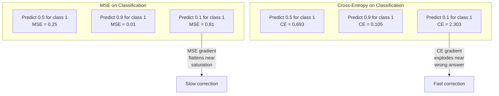
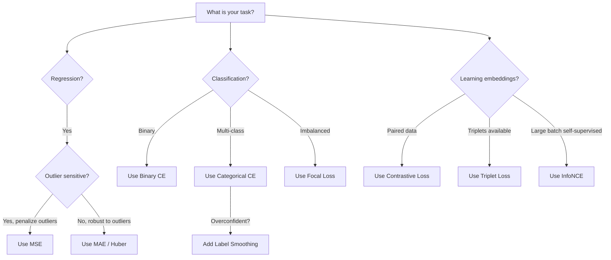
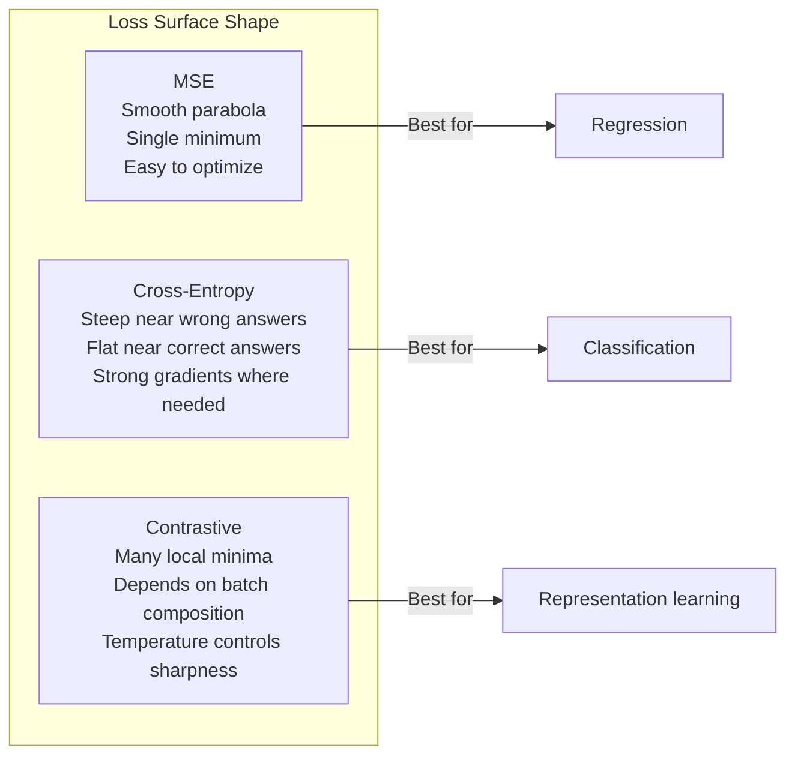

# हानि कार्य

> आपके नेटवर्क एक भविष्यवाणी करता है. मूल सत्य इसके विपरीत कहता है. यह कितना गलत है? यह संख्या हानि है. गलत हानि फ़ंक्शन चुनें और आपका मॉडल पूरी तरह से गलत चीज के लिए अनुकूलित करता है.

**Type:** Build
**Languages:** Python
**Prerequisites:** Lesson 03.04 (Activation Functions)
**Time:** ~75 minutes

## सीखने के लक्ष्य

- एमएसई, बाइनरी क्रॉस-एंट्रोपी, कैटेगरी क्रॉस-एंट्रोपी और कंट्रास्टिव लॉस (InfoNCE) को उनके ग्रेडिएंट के साथ खरोंच से लागू करें
- "सब कुछ के लिए भविष्यवाणी 0.5" विफलता मोड प्रदर्शित करके MSE वर्गीकरण में विफलता का कारण बताएं
- क्रॉस-एंट्रोपी पर लेबल चिकनाई लागू करें और वर्णन करें कि यह अत्यधिक आत्मविश्वास वाली भविष्यवाणियों को कैसे रोकता है
- रेग्रिशन, बाइनरी वर्गीकरण, मल्टी-क्लास वर्गीकरण और एम्बेडिंग सीखने के कार्यों के लिए सही हानि फ़ंक्शन चुनें

## समस्या

एक मॉडल वर्गीकरण समस्या पर एमएसई को कम करने के लिए आत्मविश्वास से सब कुछ के लिए 0.5 भविष्यवाणी करेगा. यह नुकसान को कम कर रहा है. यह भी बेकार है.

हानि समारोह केवल एक चीज है कि आपके मॉडल वास्तव में अनुकूलित करता है। सटीकता नहीं। F1 स्कोर नहीं. अपने प्रबंधक को रिपोर्ट करने के लिए जो भी मीट्रिक नहीं है। अनुकूलक हानि फ़ंक्शन के ग्रेडिएंट को लेता है और उस संख्या को छोटा करने के लिए भारों को समायोजित करता है। यदि हानि फ़ंक्शन आपको क्या परवाह नहीं करता है, तो मॉडल इसे संतुष्ट करने का गणितीय रूप से सबसे सस्ता तरीका ढूंढ देगा, और यह तरीका लगभग कभी भी वह नहीं है जो आप चाहते थे।

यहाँ एक ठोस उदाहरण है। आपके पास एक द्विआधारी वर्गीकरण कार्य है। दो कक्षाएं, 50/50 विभाजित। आप अपने नुकसान के रूप में एमएसई का उपयोग करें। मॉडल प्रत्येक इनपुट के लिए 0.5 की भविष्यवाणी करता है। औसत एमएसई 0.25 है, जो वास्तव में कुछ भी सीखने के बिना न्यूनतम संभव है। मॉडल में शून्य भेदभाव क्षमता है लेकिन तकनीकी रूप से यह आपके नुकसान समारोह को कम कर दिया है। क्रॉस-एंट्रोपी पर स्विच करें और एक ही मॉडल को 0 या 1 की ओर भविष्यवाणियों को धक्का देने के लिए मजबूर किया जाता है, क्योंकि -log(0.5) = 0.693 एक भयानक नुकसान है, जबकि -log(0.99) = 0.01 आश्वस्त सही भविष्यवाणियों को पुरस्कृत करता है। हानि फ़ंक्शन का चयन एक मॉडल के बीच अंतर है जो सीखता है और एक मॉडल जो मीट्रिक खेलता है।

यह बदतर होता है. आत्म-निरीक्षण सीखने में, आपके पास लेबल भी नहीं हैं. विपरीत हानि सीखने के संकेत को पूरी तरह से परिभाषित करती हैः क्या समान है, क्या अलग है, और मॉडल को उन्हें अलग करने के लिए कितना कठिन होना चाहिए। विपरीत हानि गलत हो जाती है और आपके एम्बेडेड एक ही बिंदु तक गिर जाते हैं - प्रत्येक इनपुट मैप एक ही वेक्टर के लिए। तकनीकी रूप से शून्य हानि। पूरी तरह से बेकार।

## अवधारणा

### औसत वर्ग त्रुटि (MSE)

पूर्वानुमान और लक्ष्य के बीच वर्ग अंतर की गणना करें, सभी नमूनों पर औसत।

```
MSE = (1/n) * sum((y_pred - y_true)^2)
```

क्यों वर्ग करना मायने रखता हैः यह बड़े त्रुटियों को चतुर्भुज रूप से दंडित करता है। 2 की त्रुटि की कीमत 4 गुना है 1. 10 की त्रुटि 100 गुना है। यह MSE को असाधारण के प्रति संवेदनशील बनाता है - एक एकल बहुत गलत भविष्यवाणी हानि पर हावी होती है।

वास्तविक संख्याः यदि आपका मॉडल आवास की कीमतों की भविष्यवाणी करता है और यह $10,000 on most houses but off by $एक हवेली पर 200,000, एमएसई आक्रामक रूप से उस एक हवेली को ठीक करने की कोशिश करेगा, संभावित रूप से अन्य 99 घरों पर प्रदर्शन को नुकसान पहुंचाएगा।

भविष्यवाणी के संबंध में एमएसई का ग्रेडिएंट हैः

```
dMSE/dy_pred = (2/n) * (y_pred - y_true)
```

त्रुटि में रैखिक। बड़ी त्रुटियों को बड़े ग्रेडिएंट प्राप्त होते हैं। यह एक प्रतिगमन (बड़ी त्रुटियों को बड़े सुधारों की आवश्यकता होती है) और वर्गीकरण के लिए एक बग है (आप निश्चित गलत उत्तरों को रैखिक रूप से नहीं, बल्कि तेजी से दंडित करना चाहते हैं) ।

### क्रॉस-एंट्रोपी हानि

वर्गीकरण के लिए हानि समारोह. सूचना सिद्धांत में जड़ -- यह अनुमानित संभावना वितरण और वास्तविक वितरण के बीच विचलन को मापता है.

**Binary Cross-Entropy (BCE):**

```
BCE = -(y * log(p) + (1 - y) * log(1 - p))
```

जहां y सही लेबल (0 या 1) है और p अनुमानित संभावना है।

क्यों -log(p) काम करता हैः जब सही लेबल 1 है और आप अनुमान p = 0.99, नुकसान -log(0.99) = 0.01 है। जब आप अनुमान p = 0.01, नुकसान -log(0.01) = 4.6 है। यह 460x अंतर है कि क्रॉस-एंट्रोपी काम करता है। यह क्रूरता से गलत भविष्यवाणियों को दंडित करता है जबकि मुश्किल से सही भविष्यवाणियों को दंडित करता है।

ग्रेडिएंट एक ही कहानी बताता हैः

```
dBCE/dp = -(y/p) + (1-y)/(1-p)
```

जब y = 1 और p शून्य के करीब होता है, तो ग्रेडिएंट -1/p होता है जो नकारात्मक अनंत के करीब होता है। मॉडल को अपनी गलती को ठीक करने के लिए एक विशाल संकेत मिलता है। जब p 1 के करीब होता है, तो ग्रेडिएंट छोटा होता है। पहले से ही सही है, ठीक करने के लिए कुछ भी नहीं है।

**Categorical Cross-Entropy:**

एक ही गर्म एन्कोडेड लक्ष्य के साथ बहु-वर्ग वर्गीकरण के लिए।

```
CCE = -sum(y_i * log(p_i))
```

केवल सही वर्ग ही हानि में योगदान देता है (क्योंकि अन्य सभी y_i शून्य हैं) । यदि 10 वर्ग हैं और सही वर्ग को 0.1 की संभावना मिलती है (क्योंकि अनुमान लगाने के लिए), तो हानि -log(0.1) = 2.3 है। यदि सही वर्ग को 0.9 की संभावना मिलती है, तो हानि -log(0.9) = 0.105 है। मॉडल सही उत्तर पर संभावना द्रव्यमान केंद्रित करना सीखता है।

### एमएसई वर्गीकरण में विफल क्यों है



एमएसई ग्रेडिएंट तब सपाट हो जाते हैं जब भविष्यवाणी 0 या 1 के करीब होती है (सिग्मोइड संतृप्ति के कारण) । क्रॉस-एंट्रोपी ग्रेडिएंट इसके लिए मुआवजा देते हैं - लॉग सिग्मोइड के सपाट क्षेत्रों को रद्द करता है, जहां उन्हें सबसे अधिक आवश्यकता होती है, मजबूत ग्रेडिएंट देता है।

### लेबल स्मूथिंग

मानक एक गर्म लेबल कहते हैं "यह 100% वर्ग 3 और 0% सब कुछ है।" यह एक मजबूत दावा है। लेबल चिकनाई इसे नरम करता हैः

```
smooth_label = (1 - alpha) * one_hot + alpha / num_classes
```

अल्फा = 0.1 और 10 वर्गों के साथः [0, 0, 1, 0, ...] के बजाय लक्ष्य [0.01, 0.01, 0.91, 0.01, ...] बन जाता है। मॉडल लक्ष्य 0.91 के बजाय 1.0.

यह काम क्यों करता हैः एक मॉडल को सॉफ्टमैक्स के माध्यम से ठीक 1.0 आउटपुट करने की कोशिश करने के लिए लॉजिट को अनंत तक धक्का देना चाहिए। यह अत्यधिक आत्मविश्वास का कारण बनता है, सामान्यीकरण को नुकसान पहुंचाते हैं, और मॉडल को वितरण शिफ्ट के लिए नाजुक बनाता है। लेबल चिकनाई लक्ष्य को 0.9 (अल्फा = 0.1) पर कैप करता है, लॉजिट को उचित सीमा में रखता है। जीपीटी और अधिकांश आधुनिक मॉडल लेबल चिकनाई या इसके समकक्ष का उपयोग करते हैं।

### विपरीत हानि

कोई लेबल नहीं, कोई वर्ग नहीं, बस इनपुट के जोड़े और सवालः क्या ये समान हैं या अलग हैं?

**SimCLR-style contrastive loss (NT-Xent / InfoNCE):**

एक छवि लें. इसके दो बढ़े हुए दृश्य बनाएँ (कट, घुमा, रंग झिझक) ये "सकारात्मक जोड़ी" हैं - वे समान एम्बेडमेंट्स होना चाहिए. बैच में प्रत्येक अन्य छवि एक "नकारात्मक जोड़ी" बनाता है - वे अलग एम्बेडमेंट्स होना चाहिए.

```
L = -log(exp(sim(z_i, z_j) / tau) / sum(exp(sim(z_i, z_k) / tau)))
```

जहां sim() कॉसिन समानता है, z_i और z_j सकारात्मक जोड़ी हैं, योग सभी नकारात्मकों पर है, और tau (तापमान) नियंत्रित करता है कि वितरण कितना तेज है। कम तापमान = कठिन नकारात्मक = अधिक आक्रामक अलगाव।

वास्तविक संख्याः बैच आकार 256 का अर्थ है 255 नकारात्मक प्रति सकारात्मक जोड़ी. तापमान ताऊ = 0.07 (SimCLR डिफ़ॉल्ट) । हानि समानताओं पर एक नरम अधिकतम की तरह दिखता है - यह चाहता है कि सकारात्मक जोड़ी की समानता सभी 256 विकल्पों में सबसे अधिक हो।

**Triplet Loss:**

तीन इनपुट लेता हैः एंकर, सकारात्मक (एक ही वर्ग), नकारात्मक (अलग वर्ग) ।

```
L = max(0, d(anchor, positive) - d(anchor, negative) + margin)
```

मार्जिन (आमतौर पर 0.2-1.0) सकारात्मक और नकारात्मक दूरी के बीच न्यूनतम अंतर को लागू करता है। यदि नकारात्मक पहले से ही पर्याप्त दूर है, तो नुकसान शून्य है - कोई ग्रेडिएंट नहीं, कोई अपडेट नहीं। यह प्रशिक्षण को कुशल बनाता है लेकिन सावधानीपूर्वक त्रिभुज खनन की आवश्यकता होती है (कठिन नकारात्मकों का चयन करना जो एंकर के करीब हैं) ।

### फोकल हानि

असंतुलित डेटा सेट के लिए। मानक क्रॉस-एंट्रोपी सभी सही ढंग से वर्गीकृत उदाहरणों को समान रूप से व्यवहार करती है। फोकल हानि डाउन-वेट सरल उदाहरणः

```
FL = -alpha * (1 - p_t)^gamma * log(p_t)
```

जहां p_t वास्तविक वर्ग की भविष्यवाणी की गई संभावना है और गामा फोकसिंग को नियंत्रित करता है। गामा = 0, यह मानक क्रॉस-एंट्रोपी है। गामा = 2 (डिफ़ॉल्ट) के साथः

- सरल उदाहरण (p_t = 0.9): वजन = (0.1) ^2 = 0.01. प्रभावी रूप से अनदेखा किया गया।
- कठिन उदाहरण (p_t = 0.1): वजन = (0.9) ^2 = 0.81. पूर्ण ग्रेडिएंट संकेत।

फोकल हानि को वस्तु पहचान के लिए लिन एट एल्स द्वारा पेश किया गया था, जहां 99% उम्मीदवार क्षेत्रों में पृष्ठभूमि (आसान नकारात्मक) हैं। फोकल हानि के बिना, मॉडल आसान पृष्ठभूमि उदाहरणों में डूब जाता है और कभी भी वस्तुओं का पता लगाने का सीखता नहीं है। इसके साथ, मॉडल अपनी क्षमता को कठिन, अस्पष्ट मामलों पर केंद्रित करता है जो मायने रखते हैं।

### हानि फ़ंक्शन निर्णय वृक्ष



### भू-भाग का नुकसान



```figure
cross-entropy-loss
```

## इसे बनाओ

### चरण 1: एमएसई और इसकी ग्रेडिएंट

```python
def mse(predictions, targets):
    n = len(predictions)
    total = 0.0
    for p, t in zip(predictions, targets):
        total += (p - t) ** 2
    return total / n

def mse_gradient(predictions, targets):
    n = len(predictions)
    grads = []
    for p, t in zip(predictions, targets):
        grads.append(2.0 * (p - t) / n)
    return grads
```

### चरण 2: द्विआधारी क्रॉस-एंट्रोपी

log(0) समस्या वास्तविक है. यदि मॉडल सकारात्मक उदाहरण के लिए 0 की भविष्यवाणी करता है, तो log(0) = नकारात्मक अनंत। क्लिपिंग इससे बचाता है।

```python
import math

def binary_cross_entropy(predictions, targets, eps=1e-15):
    n = len(predictions)
    total = 0.0
    for p, t in zip(predictions, targets):
        p_clipped = max(eps, min(1 - eps, p))
        total += -(t * math.log(p_clipped) + (1 - t) * math.log(1 - p_clipped))
    return total / n

def bce_gradient(predictions, targets, eps=1e-15):
    grads = []
    for p, t in zip(predictions, targets):
        p_clipped = max(eps, min(1 - eps, p))
        grads.append(-(t / p_clipped) + (1 - t) / (1 - p_clipped))
    return grads
```

### चरण 3: सॉफ्टमैक्स के साथ श्रेणीगत क्रॉस-एंट्रोपी

Softmax संभावनाओं के लिए कच्चे लॉजिट परिवर्तित करता है और हम एक गर्म लक्ष्य के खिलाफ क्रॉस-एंट्रोपी गणना.

```python
def softmax(logits):
    max_val = max(logits)
    exps = [math.exp(x - max_val) for x in logits]
    total = sum(exps)
    return [e / total for e in exps]

def categorical_cross_entropy(logits, target_index, eps=1e-15):
    probs = softmax(logits)
    p = max(eps, probs[target_index])
    return -math.log(p)

def cce_gradient(logits, target_index):
    probs = softmax(logits)
    grads = list(probs)
    grads[target_index] -= 1.0
    return grads
```

सॉफ्टमैक्स + क्रॉस-एंट्रोपी का ग्रेडिएंट सुंदर रूप से सरल करता हैः यह सिर्फ (पूर्वानुमानित संभावना - 1) के लिए है सही वर्ग, और (पूर्वानुमानित संभावना) के लिए सभी अन्य वर्गों. यह सुरुचिपूर्ण सरलता एक संयोग नहीं है - यह है कि क्यों सॉफ्टमैक्स और क्रॉस-एंट्रोपी जोड़े जाते हैं.

### चरण 4: लेबल चिकनाई

```python
def label_smoothed_cce(logits, target_index, num_classes, alpha=0.1, eps=1e-15):
    probs = softmax(logits)
    loss = 0.0
    for i in range(num_classes):
        if i == target_index:
            smooth_target = 1.0 - alpha + alpha / num_classes
        else:
            smooth_target = alpha / num_classes
        p = max(eps, probs[i])
        loss += -smooth_target * math.log(p)
    return loss
```

### चरण 5: विपरीत हानि (सरल सूचना एनसीई)

```python
def cosine_similarity(a, b):
    dot = sum(x * y for x, y in zip(a, b))
    norm_a = math.sqrt(sum(x * x for x in a))
    norm_b = math.sqrt(sum(x * x for x in b))
    if norm_a < 1e-10 or norm_b < 1e-10:
        return 0.0
    return dot / (norm_a * norm_b)

def contrastive_loss(anchor, positive, negatives, temperature=0.07):
    sim_pos = cosine_similarity(anchor, positive) / temperature
    sim_negs = [cosine_similarity(anchor, neg) / temperature for neg in negatives]

    max_sim = max(sim_pos, max(sim_negs)) if sim_negs else sim_pos
    exp_pos = math.exp(sim_pos - max_sim)
    exp_negs = [math.exp(s - max_sim) for s in sim_negs]
    total_exp = exp_pos + sum(exp_negs)

    return -math.log(max(1e-15, exp_pos / total_exp))
```

### चरण 6: वर्गीकरण पर एमएसई बनाम क्रॉस-एंट्रोपी

दोनों हानि कार्यों के साथ पाठ 04 (चक्र डेटासेट) से एक ही नेटवर्क को प्रशिक्षित करें। क्रॉस-एंट्रोपी को तेजी से अभिसरण देखें।

```python
import random

def sigmoid(x):
    x = max(-500, min(500, x))
    return 1.0 / (1.0 + math.exp(-x))

def make_circle_data(n=200, seed=42):
    random.seed(seed)
    data = []
    for _ in range(n):
        x = random.uniform(-2, 2)
        y = random.uniform(-2, 2)
        label = 1.0 if x * x + y * y < 1.5 else 0.0
        data.append(([x, y], label))
    return data


class LossComparisonNetwork:
    def __init__(self, loss_type="bce", hidden_size=8, lr=0.1):
        random.seed(0)
        self.loss_type = loss_type
        self.lr = lr
        self.hidden_size = hidden_size

        self.w1 = [[random.gauss(0, 0.5) for _ in range(2)] for _ in range(hidden_size)]
        self.b1 = [0.0] * hidden_size
        self.w2 = [random.gauss(0, 0.5) for _ in range(hidden_size)]
        self.b2 = 0.0

    def forward(self, x):
        self.x = x
        self.z1 = []
        self.h = []
        for i in range(self.hidden_size):
            z = self.w1[i][0] * x[0] + self.w1[i][1] * x[1] + self.b1[i]
            self.z1.append(z)
            self.h.append(max(0.0, z))

        self.z2 = sum(self.w2[i] * self.h[i] for i in range(self.hidden_size)) + self.b2
        self.out = sigmoid(self.z2)
        return self.out

    def backward(self, target):
        if self.loss_type == "mse":
            d_loss = 2.0 * (self.out - target)
        else:
            eps = 1e-15
            p = max(eps, min(1 - eps, self.out))
            d_loss = -(target / p) + (1 - target) / (1 - p)

        d_sigmoid = self.out * (1 - self.out)
        d_out = d_loss * d_sigmoid

        for i in range(self.hidden_size):
            d_relu = 1.0 if self.z1[i] > 0 else 0.0
            d_h = d_out * self.w2[i] * d_relu
            self.w2[i] -= self.lr * d_out * self.h[i]
            for j in range(2):
                self.w1[i][j] -= self.lr * d_h * self.x[j]
            self.b1[i] -= self.lr * d_h
        self.b2 -= self.lr * d_out

    def compute_loss(self, pred, target):
        if self.loss_type == "mse":
            return (pred - target) ** 2
        else:
            eps = 1e-15
            p = max(eps, min(1 - eps, pred))
            return -(target * math.log(p) + (1 - target) * math.log(1 - p))

    def train(self, data, epochs=200):
        losses = []
        for epoch in range(epochs):
            total_loss = 0.0
            correct = 0
            for x, y in data:
                pred = self.forward(x)
                self.backward(y)
                total_loss += self.compute_loss(pred, y)
                if (pred >= 0.5) == (y >= 0.5):
                    correct += 1
            avg_loss = total_loss / len(data)
            accuracy = correct / len(data) * 100
            losses.append((avg_loss, accuracy))
            if epoch % 50 == 0 or epoch == epochs - 1:
                print(f"    Epoch {epoch:3d}: loss={avg_loss:.4f}, accuracy={accuracy:.1f}%")
        return losses
```

## इसका प्रयोग करें

PyTorch सभी मानक हानि कार्यों को संख्यात्मक स्थिरता के साथ प्रदान करता हैः

```python
import torch
import torch.nn as nn
import torch.nn.functional as F

predictions = torch.tensor([0.9, 0.1, 0.7], requires_grad=True)
targets = torch.tensor([1.0, 0.0, 1.0])

mse_loss = F.mse_loss(predictions, targets)
bce_loss = F.binary_cross_entropy(predictions, targets)

logits = torch.randn(4, 10)
labels = torch.tensor([3, 7, 1, 9])
ce_loss = F.cross_entropy(logits, labels)
ce_smooth = F.cross_entropy(logits, labels, label_smoothing=0.1)
```

उपयोग करें`F.cross_entropy`(नहीं `F.nll_loss`यह एक संख्यात्मक रूप से स्थिर ऑपरेशन में लॉग-सॉफ्टमैक्स और नकारात्मक लॉग-संभाव्यता को जोड़ता है। सॉफ्टमैक्स को अलग से लागू करना और लॉग लेना कम स्थिर है - आप बड़े एक्सपोनेंटियल को घटाते समय सटीकता खो देते हैं।

विपरीत सीखने के लिए, अधिकांश टीम कस्टम कार्यान्वयन या पुस्तकालयों का उपयोग करते हैं जैसे `lightly`या `pytorch-metric-learning`. कोर लूप हमेशा एक ही हैः जोड़ी-तरह की समानताएं गणना करें, सकारात्मक और नकारात्मक पर सॉफ्टमैक्स बनाएं, पीछे-पीछे फैलें।

## इसे भेजें

इस पाठ से उत्पन्न होता हैः
- `outputs/prompt-loss-function-selector.md`-- सही हानि फ़ंक्शन चुनने के लिए एक पुनः प्रयोज्य संकेत
- `outputs/prompt-loss-debugger.md`-- जब आपकी हानि वक्र गलत लग रहा है के लिए एक नैदानिक संकेत

## व्यायाम

1. हबेर हानि (सम्य एल 1 हानि) को लागू करें, जो छोटी त्रुटियों के लिए एमएसई और बड़ी त्रुटियों के लिए एमएई है। एमएसई बनाम हबेर के साथ एक प्रतिगमन नेटवर्क का अभ्यास करें जब प्रशिक्षण लक्ष्यों में से 5% में यादृच्छिक शोर जोड़ा गया है (आउटलिवर) । अंतिम परीक्षण त्रुटि की तुलना करें।

2. द्विआधारी वर्गीकरण प्रशिक्षण लूप में फोकल हानि जोड़ें। 200 युगों के बाद अल्पसंख्यक वर्ग को याद करने पर एक असंतुलित डेटासेट (90% वर्ग 0, 10% वर्ग 1) बनाएं।

3. अर्ध-कठिन नकारात्मक खनन के साथ त्रिभुज हानि लागू करें। 5 वर्गों के लिए 2 डी एम्बेडिंग डेटा उत्पन्न करें। प्रत्येक एंकर के लिए, सबसे कठिन नकारात्मक खोजें जो अभी भी सकारात्मक (अर्ध-कठिन) से अधिक है। आकस्मिक त्रिभुज चयन के लिए अभिसरण की तुलना करें।

4. MSE बनाम क्रॉस-एंट्रोपी तुलना चलाएं लेकिन प्रशिक्षण के दौरान प्रत्येक परत पर ग्रेडिएंट परिमाणों को ट्रैक करें। प्रति युग औसत ग्रेडिएंट मानदंड का ग्राफ करें। सत्यापित करें कि क्रॉस-एंट्रोपी शुरुआती युगों में बड़े ग्रेडिएंट का उत्पादन करती है जब मॉडल सबसे अनिश्चित है।

5. KL विचलन हानि को लागू करें और सत्यापित करें कि KL ((सच्चे ज्ञान का अनुमान) को न्यूनतम करने से क्रॉस-एंट्रोपी के समान ग्रेडिएंट मिलता है जब वास्तविक वितरण एक-गर्म होता है। फिर नरम लक्ष्य (जैसे ज्ञान डिस्टिलिशन) का प्रयास करें जहां "सच्चे" वितरण एक शिक्षक मॉडल के नरम अधिकतम आउटपुट से आता है।

## प्रमुख शर्तें

| Term | What people say | What it actually means |
|------|----------------|----------------------|
| Loss function | "How wrong the model is" | A differentiable function mapping predictions and targets to a scalar that the optimizer minimizes |
| MSE | "Average squared error" | Mean of squared differences between predictions and targets; penalizes large errors quadratically |
| Cross-entropy | "The classification loss" | Measures divergence between predicted probability distribution and true distribution using -log(p) |
| Binary cross-entropy | "BCE" | Cross-entropy for two classes: -(y*log(p) + (1-y)*log(1-p)) |
| Label smoothing | "Softening the targets" | Replacing hard 0/1 targets with soft values (e.g., 0.1/0.9) to prevent overconfidence and improve generalization |
| Contrastive loss | "Pull together, push apart" | A loss that learns representations by making similar pairs close and dissimilar pairs far in embedding space |
| InfoNCE | "The CLIP/SimCLR loss" | Normalized temperature-scaled cross-entropy over similarity scores; treats contrastive learning as classification |
| Focal loss | "The imbalanced data fix" | Cross-entropy weighted by (1-p_t)^gamma to down-weight easy examples and focus on hard ones |
| Triplet loss | "Anchor-positive-negative" | Pushes anchor closer to positive than negative by at least a margin in embedding space |
| Temperature | "Sharpness knob" | A scalar divisor on logits/similarities that controls how peaked the resulting distribution is; lower = sharper |

## आगे पढ़ना

- Lin et al., "घन वस्तु पहचान के लिए फोकल हानि" (2017) -- वस्तु पहचान में चरम वर्ग असंतुलन को संभालने के लिए फोकल हानि पेश की (RetinaNet)
- चेन और अन्य, "विजुअल रिप्रेजेंटेशन के विपरीत सीखने के लिए एक सरल ढांचा" (SimCLR, 2020) -- ने NT-Xent हानि के साथ आधुनिक विपरीत सीखने की पाइपलाइन को परिभाषित किया
- Szegedy et al., "Rethinking the Inception Architecture" (2016) -- लेबल चिकनाई को एक नियमितता तकनीक के रूप में पेश किया, अब अधिकांश बड़े मॉडल में मानक है
- हिंटन एट अल., "निरोगिक नेटवर्क में ज्ञान को डिस्टिल करना" (2015) -- सॉफ्ट लक्ष्य और KL विचलन का उपयोग करके ज्ञान का डिस्टिलिशन, मॉडल संपीड़न के लिए मौलिक
