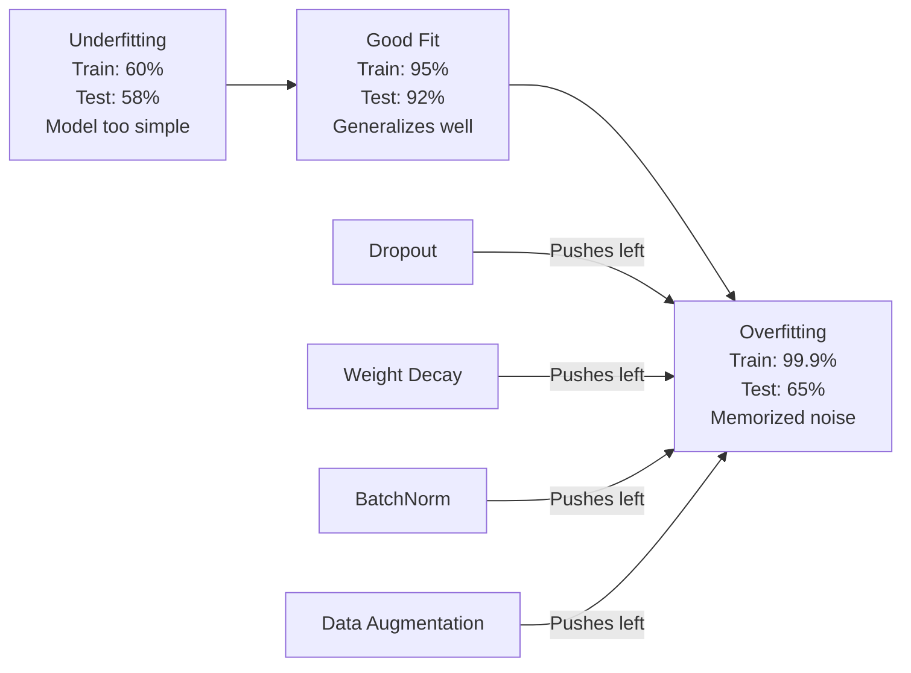
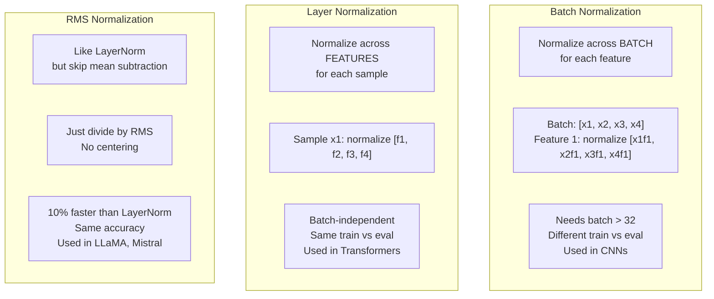
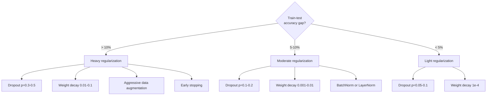

# नियमन

> आपके मॉडल को 99% प्रशिक्षण डेटा और 60% परीक्षण डेटा पर मिलता है। यह सीखने के बजाय याद किया गया। नियमितता जटिलता पर कर है जिसे आप सामान्यीकरण को मजबूर करने के लिए लगाए हैं।

**Type:** Build
**Languages:** Python
**Prerequisites:** Lesson 03.06 (Optimizers)
**Time:** ~75 minutes

## सीखने के लक्ष्य

- उल्टे स्केलिंग, L2 वजन घटाने, बैच सामान्यीकरण, परत सामान्यीकरण और आरएमएसनॉर्म के साथ ड्रॉपआउट लागू करें
- नियमितता प्रयोगों का उपयोग करके ट्रेन-परीक्षण सटीकता अंतर को मापें और अति-फिटिंग का निदान करें
- व्याख्या करें कि ट्रांसफार्मर बैचनोर्म के बजाय लेयरनोर्म का उपयोग क्यों करते हैं और आधुनिक एलएलएम आरएमएसनोर्म को क्यों पसंद करते हैं
- ओवरफिटिंग की गंभीरता के आधार पर नियमितकरण तकनीकों का सही संयोजन लागू करें

## समस्या

पर्याप्त मापदंडों के साथ एक तंत्रिका नेटवर्क किसी भी डेटासेट को याद कर सकता है। यह एक परिकल्पना नहीं है - Zhang et al. (2017) ने इसे इमेजनेट पर यादृच्छिक लेबल के साथ मानक नेटवर्क को प्रशिक्षित करके साबित किया। नेटवर्क पूरी तरह से यादृच्छिक लेबल असाइनमेंट पर लगभग शून्य प्रशिक्षण हानि तक पहुंच गए। उन्होंने सीखने के लिए कोई पैटर्न के बिना एक मिलियन यादृच्छिक इनपुट-आउटपुट जोड़े याद किए। प्रशिक्षण हानि एकदम सही थी। परीक्षण सटीकता शून्य थी।

यह समस्या है कि यह अधिक फिट है, और मॉडल बड़े होने के साथ यह और भी बदतर हो जाता है। जीपीटी-3 में 175 बिलियन पैरामीटर हैं। प्रशिक्षण सेट में लगभग 500 बिलियन टोकन हैं। इतने सारे पैरामीटर के साथ, मॉडल में प्रशिक्षण डेटा के महत्वपूर्ण टुकड़ों को शाब्दिक रूप से याद रखने की पर्याप्त क्षमता है। नियमितता के बिना, यह सामान्यीकृत पैटर्न सीखने के बजाय प्रशिक्षण उदाहरणों को फिर से उबाल देगा।

प्रशिक्षण प्रदर्शन और परीक्षण प्रदर्शन के बीच अंतर अति-अनुकूलन अंतर है। इस पाठ में प्रत्येक तकनीक उस अंतर को एक अलग कोण से हमला करती है। ड्रॉपअप नेटवर्क को किसी एक न्यूरॉन पर निर्भर नहीं करने के लिए मजबूर करता है। वजन घटाने से किसी भी वजन को बहुत बड़ा होने से रोकता है। बैच सामान्यीकरण हानि परिदृश्य को चिकनी बनाता है ताकि अनुकूलक अधिक सपाट, अधिक सामान्यीकरण योग्य न्यूनतम पाता है। परत सामान्यीकरण एक ही काम करता है लेकिन जहां बैच सामान्यीकरण विफल रहता है (छोटे बैच, चर-लंबाई अनुक्रम) काम करता है। आरएमएसनॉर्म औसत गणना को गिराकर इसे 10% तेज़ करता है। प्रत्येक तकनीक सरल है। एक साथ, वे एक मॉडल के बीच अंतर है जो याद करता है और एक है जो सामान्यीकरण करता है।

## अवधारणा

### अति-फिटिंग स्पेक्ट्रम

प्रत्येक मॉडल एक स्पेक्ट्रम पर कहीं बैठता है, जो कि अंडरफिटिंग (पैटर्न को कैप्चर करने के लिए बहुत सरल) से ओवरफिटिंग (शोर को कैप्चर करने के लिए इतना जटिल) तक है। बीच में एक मीठा बिंदु है, और नियमितता मॉडल को ओवरफिट पक्ष से उस की ओर धकेलती है।



### छोड़ना

प्रशिक्षण के दौरान, प्रत्येक न्यूरॉन के आउटपुट को पसंती के साथ शून्य पर यादृच्छिक रूप से सेट करें।

```
output = activation(z) * mask    where mask[i] ~ Bernoulli(1 - p)
```

p = 0.5 के साथ, प्रत्येक आगे के पास आधे न्यूरॉन्स शून्य पर होते हैं. नेटवर्क को अधिशेष प्रतिनिधित्व सीखना चाहिए क्योंकि यह भविष्यवाणी नहीं कर सकता है कि कौन से न्यूरॉन्स उपलब्ध होंगे. यह सह-अनुकूलन को रोकता है - न्यूरॉन्स को विशिष्ट अन्य न्यूरॉन्स पर निर्भर करना सीखना मौजूद है।

संचयी व्याख्याः N न्यूरॉन्स और ड्रॉपआउट के साथ एक नेटवर्क 2^N संभावित उप-नेटवर्क बनाता है (उनमे से प्रत्येक संयोजन जिसमें न्यूरॉन्स चालू या बंद हैं) । ड्रॉप-अप के साथ प्रशिक्षण लगभग एक साथ सभी 2^N उप-नेटवर्क को अलग-अलग मिनी-बैच पर ट्रेन करता है। परीक्षण के समय, आप सभी न्यूरॉन्स का उपयोग करते हैं (कोई ड्रॉप-ऑफ नहीं) और प्रशिक्षण के दौरान अपेक्षित मूल्य के अनुरूप होने के लिए आउटपुट को 1 - पी तक स्केल करते हैं। यह 2^N उप-नेटवर्क के अनुमानों का औसत देने के बराबर है -- एक एकल मॉडल से एक विशाल समूह।

अभ्यास में, परीक्षण के बजाय प्रशिक्षण के दौरान स्केलिंग लागू की जाती है (उपवर्जित ड्रॉपआउट):

```
During training:  output = activation(z) * mask / (1 - p)
During testing:   output = activation(z)   (no change needed)
```

यह साफ है क्योंकि परीक्षण कोड को छोड़ने के बारे में जानने की जरूरत नहीं है।

डिफ़ॉल्ट दरेंः ट्रांसफार्मर के लिए p = 0.1, एमएलपी के लिए p = 0.5 और सीएनएन के लिए p = 0.2-0.3। उच्च ड्रॉपआउट = मजबूत नियमितता = अधिक अपर्याप्तता जोखिम।

### वजन घटाने (एल 2 नियमन)

हानि के लिए सभी भारों की वर्ग परिमाण जोड़ेंः

```
total_loss = task_loss + (lambda / 2) * sum(w_i^2)
```

नियमितकरण शब्द का ग्रेडिएंट लैम्ब्डा * w है। इसका मतलब है कि प्रत्येक चरण में, प्रत्येक वजन इसकी परिमाण के समानुपातिक अंश से शून्य की ओर छोटा हो जाता है। बड़े वजन अधिक दंडित होते हैं। मॉडल को समाधान की ओर धकेल दिया जाता है जहां कोई भी वजन हावी नहीं होता है।

यह सामान्यीकरण में मदद करता हैः ओवरफिट मॉडल में बड़े वजन होते हैं जो प्रशिक्षण डेटा में शोर को बढ़ाते हैं। वजन घटाने से वजन कम रहता है, जो मॉडल की प्रभावी क्षमता को सीमित करता है और इसे याद रखने वाली विचित्रताओं के बजाय मजबूत, सामान्यीकृत विशेषताओं पर भरोसा करने के लिए मजबूर करता है।

लैम्ब्डा हाइपरपरमैटर ताकत को नियंत्रित करता है।

- ट्रांसफार्मर पर AdamW के लिए 0.01
- सीएनएन पर एसजीडी के लिए 1ई-4
- भारी रूप से ओवरफिट मॉडल के लिए 0.1

पाठ 06: वजन घटाने और एल 2 नियमितकरण में एसजीडी में समान हैं लेकिन एडम में नहीं। एडम के साथ प्रशिक्षण करते समय हमेशा एडमडब्ल्यू (डिकोपल्ड वजन घटाने) का उपयोग करें।

### बैच सामान्यीकरण

अगले स्तर पर जाने से पहले मिनी बैच में प्रत्येक परत के आउटपुट को सामान्य करें।

किसी परत पर सक्रियण के एक मिनी-बैच के लिएः

```
mu = (1/B) * sum(x_i)           (batch mean)
sigma^2 = (1/B) * sum((x_i - mu)^2)   (batch variance)
x_hat = (x_i - mu) / sqrt(sigma^2 + eps)   (normalize)
y = gamma * x_hat + beta        (scale and shift)
```

गामा और बीटा सीखने योग्य मापदंड हैं जो नेटवर्क को सामान्यीकरण को रद्द करने की अनुमति देते हैं यदि यह इष्टतम है। उनके बिना, आप प्रत्येक परत के आउटपुट को शून्य-औसत इकाई-विभेद के लिए मजबूर कर रहे होंगे, जो नेटवर्क की इच्छा नहीं हो सकती है।

**Training vs inference split:**प्रशिक्षण के दौरान, mu और sigma वर्तमान मिनी-बैच से आते हैं। निष्कर्ष के दौरान, आप प्रशिक्षण के दौरान संचित चल रहे औसत (गति = 0.1 के साथ गतिशील चलती औसत, जिसका अर्थ है 90% पुराना + 10% नया) का उपयोग करते हैं।

बैचनोर्म का काम क्यों होता है, इस पर अभी भी बहस चल रही है। मूल पेपर में दावा किया गया था कि यह "आंतरिक कोवरिएट शिफ्ट" (पहले परतों के अपडेट के रूप में परत इनपुट का वितरण बदलता है) को कम करता है। संतुरकर आदि। (2018) ने यह स्पष्टीकरण गलत दिखाया। वास्तविक कारणः बैचनॉर्म नुकसान के परिदृश्य को अधिक चिकनी बनाता है। ग्रेडिएंट अधिक भविष्यवाणी कर रहे हैं, लिप्सकिट्ज़ स्थिरांक छोटे हैं, और अनुकूलक बड़े कदम सुरक्षित रूप से ले सकता है। यही कारण है कि बैचनोर्म आपको उच्च सीखने की दरों का उपयोग करने और तेजी से अभिसरण करने की अनुमति देता है।

BatchNorm की एक मौलिक सीमा हैः यह बैच के आंकड़ों पर निर्भर करता है। बैच आकार 1 के साथ, औसत और भिन्नता का कोई मतलब नहीं है। छोटे बैच (< 32), आंकड़े शोर और चोट प्रदर्शन हैं। यह ऑब्जेक्ट डिटेक्शन (जहां मेमोरी बैच आकार को सीमित करती है) और भाषा मॉडलिंग (जहां अनुक्रम लंबाई भिन्न होती है) जैसे कार्यों के लिए मायने रखता है।

### परत सामान्यीकरण

बैच के बजाय सभी सुविधाओं को सामान्य करें। एक ही नमूने के लिएः

```
mu = (1/D) * sum(x_j)           (feature mean)
sigma^2 = (1/D) * sum((x_j - mu)^2)   (feature variance)
x_hat = (x_j - mu) / sqrt(sigma^2 + eps)
y = gamma * x_hat + beta
```

D विशेषता आयाम है। प्रत्येक नमूना स्वतंत्र रूप से सामान्यीकृत होता है - बैच आकार पर कोई निर्भरता नहीं। यही कारण है कि ट्रांसफार्मर बैच नॉर्म के बजाय लेयरनोर्म का उपयोग करते हैं। अनुक्रमों की लंबाई परिवर्तनीय होती है, बैच आकार अक्सर छोटे होते हैं (या 1 उत्पादन के दौरान), और प्रशिक्षण और निष्कर्ष के बीच गणना समान होती है।

ट्रांसफार्मर में LayerNorm प्रत्येक स्व-विचार ब्लॉक और प्रत्येक फ़ीड-फॉरवर्ड ब्लॉक (पोस्ट-एलएन) के बाद या उनके पहले (प्रि-एलएन, जो प्रशिक्षण के लिए अधिक स्थिर है) लागू किया जाता है।

### आरएमएसएनआरएम

औसत घटाव के बिना LayerNorm। Zhang & Sennrich (2019) द्वारा प्रस्तावित।

```
rms = sqrt((1/D) * sum(x_j^2))
y = gamma * x / rms
```

यह है. कोई औसत गणना, कोई बीटा पैरामीटर नहीं। अवलोकनः LayerNorm में पुनर्व्यवस्थित (औसत घटाने) मॉडल के प्रदर्शन में बहुत कम योगदान देता है, लेकिन गणना लागत. इसे हटाने के साथ लगभग 10% कम ओवरहेड के साथ एक ही सटीकता देता है।

LLaMA, LLaMA 2, LLaMA 3, Mistral, और अधिकांश आधुनिक LLM LayerNorm के बजाय RMSNorm का उपयोग करते हैं। अरबों मापदंडों और खरबों टोकन के पैमाने पर, 10% की बचत महत्वपूर्ण है।

### सामान्यीकरण तुलना



### नियमन के रूप में डेटा वृद्धि

मॉडल संशोधन नहीं बल्कि डेटा संशोधन। लेबल को संरक्षित करते हुए प्रशिक्षण इनपुट को परिवर्तित करेंः

- चित्रः यादृच्छिक फसल, फ्लिप, रोटेशन, रंग झिझक, कटआउट
- पाठः पर्यायवाची प्रतिस्थापन, बैक-ट्रांसलेशन, यादृच्छिक हटाने
- ऑडियोः समय का विस्तार, पिच शिफ्ट, शोर जोड़ना

यह प्रभाव नियमितता के समान हैः यह प्रशिक्षण सेट के प्रभावी आकार को बढ़ाता है, जिससे मॉडल के लिए विशिष्ट उदाहरणों को याद रखना कठिन हो जाता है। एक मॉडल जो केवल अपने मूल रूप में एक बार प्रत्येक छवि को देखता है, उसे याद कर सकता है। एक मॉडल जो प्रत्येक छवि के 50 वर्धित संस्करणों को देखता है, उसे अपरिवर्तित संरचना सीखने के लिए मजबूर किया जाता है।

### जल्दी रुकना

सबसे सरल नियमित करने वालाः जब सत्यापन हानि बढ़ना शुरू होती है तो प्रशिक्षण बंद करें। मॉडल अभी तक उस बिंदु पर ओवरफिट नहीं हुआ है। व्यवहार में, आप प्रत्येक युग में सत्यापन हानि का ट्रैक करते हैं, सबसे अच्छा मॉडल सहेजते हैं, और "सहिष्णुता" विंडो के लिए प्रशिक्षण जारी रखते हैं (आमतौर पर 5-20 युग) । यदि सत्यापन हानि में सुधार नहीं होता है धैर्य विंडो के भीतर, आप रोकते हैं और सबसे अच्छा सहेजे गए मॉडल को लोड करते हैं।

### कब क्या लागू करें



```figure
l2-regularization
```

## इसे बनाओ

### चरण 1: ड्रॉपआउट (ट्रेन और ईवल मोड)

```python
import random
import math


class Dropout:
    def __init__(self, p=0.5):
        self.p = p
        self.training = True
        self.mask = None

    def forward(self, x):
        if not self.training:
            return list(x)
        self.mask = []
        output = []
        for val in x:
            if random.random() < self.p:
                self.mask.append(0)
                output.append(0.0)
            else:
                self.mask.append(1)
                output.append(val / (1 - self.p))
        return output

    def backward(self, grad_output):
        grads = []
        for g, m in zip(grad_output, self.mask):
            if m == 0:
                grads.append(0.0)
            else:
                grads.append(g / (1 - self.p))
        return grads
```

### चरण 2: एल2 वजन घटाने

```python
def l2_regularization(weights, lambda_reg):
    penalty = 0.0
    for w in weights:
        penalty += w * w
    return lambda_reg * 0.5 * penalty

def l2_gradient(weights, lambda_reg):
    return [lambda_reg * w for w in weights]
```

### चरण 3: बैच सामान्यीकरण

```python
class BatchNorm:
    def __init__(self, num_features, momentum=0.1, eps=1e-5):
        self.gamma = [1.0] * num_features
        self.beta = [0.0] * num_features
        self.eps = eps
        self.momentum = momentum
        self.running_mean = [0.0] * num_features
        self.running_var = [1.0] * num_features
        self.training = True
        self.num_features = num_features

    def forward(self, batch):
        batch_size = len(batch)
        if self.training:
            mean = [0.0] * self.num_features
            for sample in batch:
                for j in range(self.num_features):
                    mean[j] += sample[j]
            mean = [m / batch_size for m in mean]

            var = [0.0] * self.num_features
            for sample in batch:
                for j in range(self.num_features):
                    var[j] += (sample[j] - mean[j]) ** 2
            var = [v / batch_size for v in var]

            for j in range(self.num_features):
                self.running_mean[j] = (1 - self.momentum) * self.running_mean[j] + self.momentum * mean[j]
                self.running_var[j] = (1 - self.momentum) * self.running_var[j] + self.momentum * var[j]
        else:
            mean = list(self.running_mean)
            var = list(self.running_var)

        self.x_hat = []
        output = []
        for sample in batch:
            normalized = []
            out_sample = []
            for j in range(self.num_features):
                x_h = (sample[j] - mean[j]) / math.sqrt(var[j] + self.eps)
                normalized.append(x_h)
                out_sample.append(self.gamma[j] * x_h + self.beta[j])
            self.x_hat.append(normalized)
            output.append(out_sample)
        return output
```

### चरण 4: परत सामान्यीकरण

```python
class LayerNorm:
    def __init__(self, num_features, eps=1e-5):
        self.gamma = [1.0] * num_features
        self.beta = [0.0] * num_features
        self.eps = eps
        self.num_features = num_features

    def forward(self, x):
        mean = sum(x) / len(x)
        var = sum((xi - mean) ** 2 for xi in x) / len(x)

        self.x_hat = []
        output = []
        for j in range(self.num_features):
            x_h = (x[j] - mean) / math.sqrt(var + self.eps)
            self.x_hat.append(x_h)
            output.append(self.gamma[j] * x_h + self.beta[j])
        return output
```

### चरण 5: आरएमएसएनआरएम

```python
class RMSNorm:
    def __init__(self, num_features, eps=1e-6):
        self.gamma = [1.0] * num_features
        self.eps = eps
        self.num_features = num_features

    def forward(self, x):
        rms = math.sqrt(sum(xi * xi for xi in x) / len(x) + self.eps)
        output = []
        for j in range(self.num_features):
            output.append(self.gamma[j] * x[j] / rms)
        return output
```

### चरण 6: नियमितता के साथ और बिना प्रशिक्षण

```python
def sigmoid(x):
    x = max(-500, min(500, x))
    return 1.0 / (1.0 + math.exp(-x))


def make_circle_data(n=200, seed=42):
    random.seed(seed)
    data = []
    for _ in range(n):
        x = random.uniform(-2, 2)
        y = random.uniform(-2, 2)
        label = 1.0 if x * x + y * y < 1.5 else 0.0
        data.append(([x, y], label))
    return data


class RegularizedNetwork:
    def __init__(self, hidden_size=16, lr=0.05, dropout_p=0.0, weight_decay=0.0):
        random.seed(0)
        self.hidden_size = hidden_size
        self.lr = lr
        self.dropout_p = dropout_p
        self.weight_decay = weight_decay
        self.dropout = Dropout(p=dropout_p) if dropout_p > 0 else None

        self.w1 = [[random.gauss(0, 0.5) for _ in range(2)] for _ in range(hidden_size)]
        self.b1 = [0.0] * hidden_size
        self.w2 = [random.gauss(0, 0.5) for _ in range(hidden_size)]
        self.b2 = 0.0

    def forward(self, x, training=True):
        self.x = x
        self.z1 = []
        self.h = []
        for i in range(self.hidden_size):
            z = self.w1[i][0] * x[0] + self.w1[i][1] * x[1] + self.b1[i]
            self.z1.append(z)
            self.h.append(max(0.0, z))

        if self.dropout and training:
            self.dropout.training = True
            self.h = self.dropout.forward(self.h)
        elif self.dropout:
            self.dropout.training = False
            self.h = self.dropout.forward(self.h)

        self.z2 = sum(self.w2[i] * self.h[i] for i in range(self.hidden_size)) + self.b2
        self.out = sigmoid(self.z2)
        return self.out

    def backward(self, target):
        eps = 1e-15
        p = max(eps, min(1 - eps, self.out))
        d_loss = -(target / p) + (1 - target) / (1 - p)
        d_sigmoid = self.out * (1 - self.out)
        d_out = d_loss * d_sigmoid

        for i in range(self.hidden_size):
            d_relu = 1.0 if self.z1[i] > 0 else 0.0
            d_h = d_out * self.w2[i] * d_relu
            self.w2[i] -= self.lr * (d_out * self.h[i] + self.weight_decay * self.w2[i])
            for j in range(2):
                self.w1[i][j] -= self.lr * (d_h * self.x[j] + self.weight_decay * self.w1[i][j])
            self.b1[i] -= self.lr * d_h
        self.b2 -= self.lr * d_out

    def evaluate(self, data):
        correct = 0
        total_loss = 0.0
        for x, y in data:
            pred = self.forward(x, training=False)
            eps = 1e-15
            p = max(eps, min(1 - eps, pred))
            total_loss += -(y * math.log(p) + (1 - y) * math.log(1 - p))
            if (pred >= 0.5) == (y >= 0.5):
                correct += 1
        return total_loss / len(data), correct / len(data) * 100

    def train_model(self, train_data, test_data, epochs=300):
        history = []
        for epoch in range(epochs):
            total_loss = 0.0
            correct = 0
            for x, y in train_data:
                pred = self.forward(x, training=True)
                self.backward(y)
                eps = 1e-15
                p = max(eps, min(1 - eps, pred))
                total_loss += -(y * math.log(p) + (1 - y) * math.log(1 - p))
                if (pred >= 0.5) == (y >= 0.5):
                    correct += 1
            train_loss = total_loss / len(train_data)
            train_acc = correct / len(train_data) * 100
            test_loss, test_acc = self.evaluate(test_data)
            history.append((train_loss, train_acc, test_loss, test_acc))
            if epoch % 75 == 0 or epoch == epochs - 1:
                gap = train_acc - test_acc
                print(f"    Epoch {epoch:3d}: train_acc={train_acc:.1f}%, test_acc={test_acc:.1f}%, gap={gap:.1f}%")
        return history
```

## इसका प्रयोग करें

PyTorch सभी सामान्यीकरण और नियमितता मॉड्यूल के रूप में प्रदान करता हैः

```python
import torch
import torch.nn as nn

model = nn.Sequential(
    nn.Linear(784, 256),
    nn.BatchNorm1d(256),
    nn.ReLU(),
    nn.Dropout(0.3),
    nn.Linear(256, 128),
    nn.BatchNorm1d(128),
    nn.ReLU(),
    nn.Dropout(0.3),
    nn.Linear(128, 10),
)

model.train()
out_train = model(torch.randn(32, 784))

model.eval()
out_test = model(torch.randn(1, 784))
```

`model.train()`/`model.eval()`स्विच करना महत्वपूर्ण है. यह ड्रॉप-ऑफ चालू/बंद करता है और बैचनॉर्म को बैच के आंकड़ों का उपयोग करने के लिए कहता है। भूलना `model.eval()`आपके परीक्षण की सटीकता यादृच्छिक रूप से उतार-चढ़ाव करेगी क्योंकि ड्रॉपआउट अभी भी सक्रिय है और बैचनोर्म मिनी बैच आंकड़ों का उपयोग कर रहा है।

ट्रांसफार्मर के लिए, पैटर्न अलग हैः

```python
class TransformerBlock(nn.Module):
    def __init__(self, d_model=512, nhead=8, dropout=0.1):
        super().__init__()
        self.attention = nn.MultiheadAttention(d_model, nhead, dropout=dropout)
        self.norm1 = nn.LayerNorm(d_model)
        self.ff = nn.Sequential(
            nn.Linear(d_model, d_model * 4),
            nn.GELU(),
            nn.Linear(d_model * 4, d_model),
            nn.Dropout(dropout),
        )
        self.norm2 = nn.LayerNorm(d_model)
        self.dropout = nn.Dropout(dropout)

    def forward(self, x):
        attended, _ = self.attention(x, x, x)
        x = self.norm1(x + self.dropout(attended))
        x = self.norm2(x + self.ff(x))
        return x
```

LayerNorm, बैचनॉर्म नहीं. ड्रॉप आउट p=0.1, नहीं p=0.5. ये ट्रांसफार्मर डिफ़ॉल्ट हैं।

## इसे भेजें

इस पाठ से उत्पन्न होता हैः
- `outputs/prompt-regularization-advisor.md`-- एक संकेत जो अति उपयुक्तता का निदान करता है और उचित नियमितकरण रणनीति की सिफारिश करता है

## व्यायाम

1. 2D डेटा के लिए स्थानिक ड्रॉपआउट लागू करेंः व्यक्तिगत न्यूरॉन्स को छोड़ने के बजाय, पूरे फीचर चैनल छोड़ दें। इसे एक साथ चलने वाली सुविधाओं के समूहों को चैनल के रूप में इलाज करके और पूरे समूहों को छोड़कर सिमुलेशन करें। छिपे हुए_आकार = 32 के साथ सर्कल डेटासेट पर मानक ड्रॉपआउट के लिए ट्रेन-टेस्ट अंतर की तुलना करें।

2. पाठ 05 से लेबल स्लाइडिंग को इस पाठ से ड्रॉपआउट के साथ संयुक्त रूप से लागू करें। चार कॉन्फ़िगरेशन के साथ ट्रेन करेंः कोई भी, केवल ड्रॉपआउट, केवल लेबल स्लाइडिंग, दोनों। प्रत्येक के लिए अंतिम ट्रेन-परीक्षण सटीकता अंतर को मापें। किस संयोजन से सबसे छोटा अंतर मिलता है?

3. अपने सर्कल-डेटासेट नेटवर्क में छिपे हुए परत और सक्रियण के बीच एक बैचनोर्म परत जोड़ें। बैचनोर्म के साथ और बिना बैचनोर्म के साथ सीखने की दर 0.01, 0.05 और 0.1 पर अभ्यास करें। बैचनोर्म को उच्च सीखने की दरों पर स्थिर प्रशिक्षण की अनुमति देनी चाहिए जहां वैनिला नेटवर्क विचलित होता है।

4. प्रारंभिक रोकना लागू करेंः प्रत्येक युग में परीक्षण हानि का ट्रैक करें, सर्वश्रेष्ठ वजन बचाएं, और यदि 20 युगों के लिए परीक्षण हानि में सुधार नहीं हुआ है तो रोकें। 1000 युगों के लिए नियमित नेटवर्क चलाएं। रिपोर्ट करें कि किस युग में सबसे अच्छी परीक्षण सटीकता थी और आपने कितने युगों की गणना की बचत की।

5. 4-परत नेटवर्क पर LayerNorm बनाम RMSNorm की तुलना करें (केवल 2 नहीं) । दोनों को एक ही वजन के साथ प्रारंभ करें। 200 युगों के लिए प्रशिक्षित करें और पहली परत पर अंतिम सटीकता, प्रशिक्षण गति (समय प्रति युग) और ग्रेडिएंट परिमाण की तुलना करें। सत्यापित करें कि RMSNorm समान सटीकता के साथ तेज़ है।

## प्रमुख शर्तें

| Term | What people say | What it actually means |
|------|----------------|----------------------|
| Overfitting | "Model memorized the data" | When a model's training performance significantly exceeds its test performance, indicating it learned noise rather than signal |
| Regularization | "Preventing overfitting" | Any technique that constrains model complexity to improve generalization: dropout, weight decay, normalization, augmentation |
| Dropout | "Random neuron deletion" | Zeroing random neurons during training with probability p, forcing redundant representations; equivalent to training an ensemble |
| Weight decay | "L2 penalty" | Shrinking all weights toward zero by subtracting lambda * w at each step; penalizes complexity through weight magnitude |
| Batch normalization | "Normalize per batch" | Normalizing layer outputs across the batch dimension using batch statistics during training and running averages during inference |
| Layer normalization | "Normalize per sample" | Normalizing across features within each sample; batch-independent, used in transformers where batch size varies |
| RMSNorm | "LayerNorm without the mean" | Root mean square normalization; drops the mean subtraction from LayerNorm for 10% speedup with equal accuracy |
| Early stopping | "Stop before overfit" | Halting training when validation loss stops improving; the simplest regularizer, often used alongside others |
| Data augmentation | "More data from less" | Transforming training inputs (flip, crop, noise) to increase effective dataset size and force invariance learning |
| Generalization gap | "Train-test split" | The difference between training and test performance; regularization aims to minimize this gap |

## आगे पढ़ना

- श्रीवास्तव और अन्य, "ड्रोपआउटः ओवरफिटिंग से न्यूरल नेटवर्क को रोकने का एक सरल तरीका" (2014) -- एंसेंबल व्याख्या और व्यापक प्रयोगों के साथ मूल ड्रॉपआउट पेपर
- Ioffe & Szegedy, "बैच नॉर्मलाइजेशनः डीप नेटवर्क ट्रेनिंग को कम करके आंतरिक कोवरीएट शिफ्ट को तेज करना" (2015) -- बैचनोर्म और इसकी प्रशिक्षण प्रक्रिया, सबसे अधिक उल्लिखित गहन सीखने के पेपरों में से एक पेश किया
- Zhang & Sennrich, "रूट मीन स्क्वायर लेयर नॉर्मलाइजेशन" (2019) -- दिखाया RMSNorm कम गणना के साथ LayerNorm सटीकता से मेल खाता है; LLaMA और Mistral द्वारा अपनाया गया
- Zhang et al., "Deep Learning Understanding Requires Rethinking Generalization" (2017) -- न्यूरल नेटवर्क यादृच्छिक लेबल यादगार कर सकते हैं दिखा रही ऐतिहासिक कागज, सामान्यीकरण के पारंपरिक विचारों को चुनौती देता है
