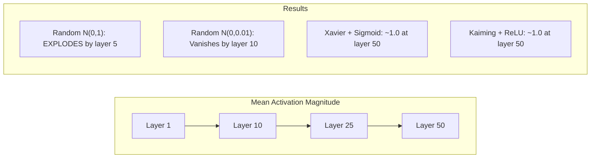
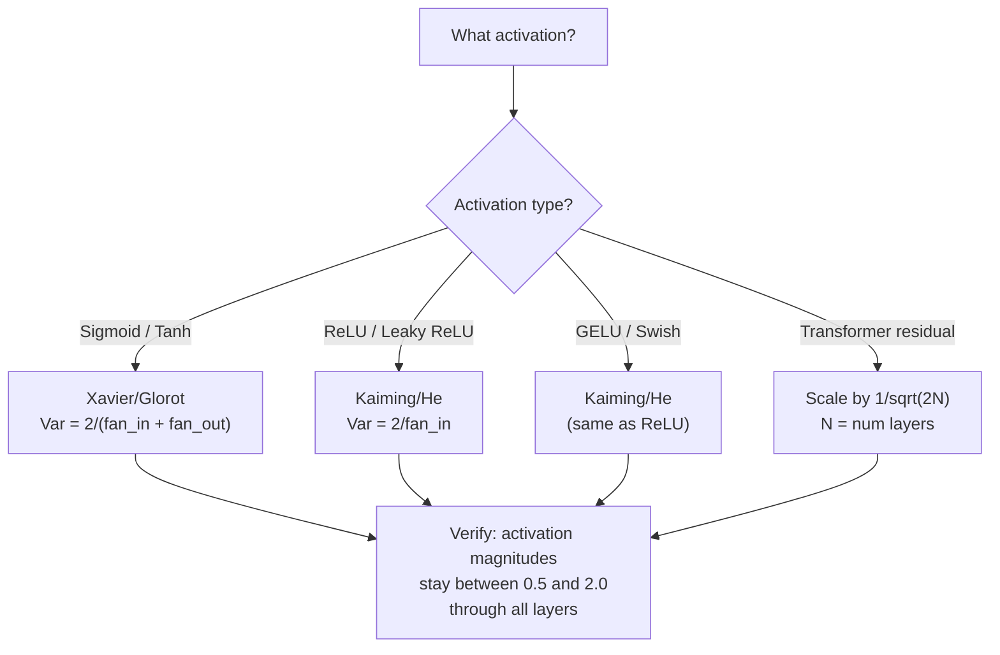

# वजन आरंभिकरण और प्रशिक्षण स्थिरता

> गलत शुरू करें और प्रशिक्षण कभी शुरू नहीं होता है सही शुरू करें और 50 परतों के रूप में सुचारू रूप से प्रशिक्षण 3.

**Type:** Build
**Languages:** Python
**Prerequisites:** Lesson 03.04 (Activation Functions), Lesson 03.07 (Regularization)
**Time:** ~90 minutes

## सीखने के लक्ष्य

- शून्य, यादृच्छिक, ज़ैवियर/ग्लोरोट, और कैमिंग/हे आरंभिकरण रणनीतियों को लागू करें और 50 परतों के माध्यम से सक्रियण परिमाणों पर उनके प्रभाव को मापें
- पता करें कि Xavier init Var(w) = 2/(fan_in + fan_out) का उपयोग क्यों करता है और Kaiming Var(w) = 2/fan_in का उपयोग क्यों करता है
- शून्य आरंभिकरण के साथ सममितता समस्या का प्रदर्शन करें और समझाएं कि अकेले यादृच्छिक पैमाने क्यों अपर्याप्त है
- सक्रियण फ़ंक्शन के लिए सही आरंभिकरण रणनीति से मेल खाएंः सिग्मोइड/टैन के लिए ज़ावेयर, ReLU/GELU के लिए कैमिंग

## समस्या

सभी वजन को शून्य पर शुरू करें। कुछ भी नहीं सीखता है। प्रत्येक न्यूरॉन एक ही फ़ंक्शन की गणना करता है, एक ही ग्रेडिएंट प्राप्त करता है, और एक ही रूप से अद्यतन करता है। 10,000 युगों के बाद, आपके 512 न्यूरॉन छिपे परत अभी भी 512 प्रतियां है एक ही न्यूरॉन. आपने 512 मापदंडों के लिए भुगतान किया और 1 प्राप्त किया।

इनको बहुत बड़ा शुरू करें. सक्रियण नेटवर्क के माध्यम से विस्फोट करते हैं. परत 10 तक, मान 1e15 तक पहुंच जाते हैं। परत 20 तक, वे अनंत तक बहते हैं। ग्रेडिएंट एक ही पटरियों को उलटते हैं।

उन्हें एक मानक सामान्य वितरण से यादृच्छिक रूप से आरंभ करें। 3 परतों के लिए काम करता है। 50 परतों पर, संकेत शून्य तक गिर जाता है या अनंत तक विस्फोट होता है, यह इस बात पर निर्भर करता है कि यादृच्छिक पैमाने थोड़ा बहुत छोटा या थोड़ा बहुत बड़ा था। "काम" और "तोड़ा" के बीच की सीमा रेजर-पातकी है।

वजन शुरू करना गहन सीखने में सबसे कम महत्व वाला निर्णय है। वास्तुकला कागजात प्राप्त करती है। अनुकूलक ब्लॉग पोस्ट प्राप्त करते हैं। प्रारंभ करने के लिए एक फुटनोट प्राप्त होता है। लेकिन इसे गलत समझें और इससे कोई फर्क नहीं पड़ता - प्रशिक्षण शुरू होने से पहले आपका नेटवर्क मर गया है।

## अवधारणा

### समरूपता समस्या

एक परत में प्रत्येक न्यूरॉन की संरचना समान हैः इनपुट को वजन से गुणा करें, पूर्वाग्रह जोड़ें, सक्रियण लागू करें। यदि सभी वजन एक ही मूल्य से शुरू होते हैं (शून्य चरम मामला है), तो प्रत्येक न्यूरॉन एक ही आउटपुट की गणना करता है। बैकप्रॉपेग के दौरान, प्रत्येक न्यूरॉन को एक ही ग्रेडिएंट प्राप्त होता है। अद्यतन चरण के दौरान, प्रत्येक न्यूरॉन एक ही मात्रा में बदलता है।

आप फंसे हुए हैं. नेटवर्क में सैकड़ों पैरामीटर हैं, लेकिन वे सभी लॉकस्टेप में चलते हैं. इसे सममितता कहा जाता है, और यादृच्छिक आरंभिकरण इसे तोड़ने का तरीका है. प्रत्येक न्यूरॉन वजन स्थान में एक अलग बिंदु पर शुरू होता है, इसलिए प्रत्येक एक अलग विशेषता सीखता है.

लेकिन "संदिग्ध" पर्याप्त नहीं है। *स्केल* की यादृच्छिकता निर्धारित करती है कि नेटवर्क ट्रेनों या नहीं।

### परतों के माध्यम से भिन्नता फैलाना

फैन_इन इनपुट के साथ एक एकल परत पर विचार करेंः

```
z = w1*x1 + w2*x2 + ... + w_n*x_n
```

यदि प्रत्येक भार wi को Var(w) के साथ एक वितरण से लिया गया है और प्रत्येक इनपुट xi में Var(x) का अंतर है, तो आउटपुट भिन्नता हैः

```
Var(z) = fan_in * Var(w) * Var(x)
```

यदि Var(w) = 1 और fan_in = 512, आउटपुट भिन्नता 512x इनपुट भिन्नता है। 10 परतों के बादः 512 ^ 10 = 1.2e27. आपका संकेत विस्फोट हो गया है।

यदि Var ((w) = 0.001 है, तो आउटपुट वैरिएंस प्रति परत 0.001 * 512 = 0.512 से घट जाती है। 10 परतों के बादः 0.512^10 = 0.00013। आपका संकेत गायब हो गया है।

लक्ष्य: Var(w) चुनें ताकि Var(z) = Var(x) । सिग्नल आयाम परतों के पार स्थिर रहता है।

### ज़ावियर/ग्लोरोट आरंभिकरण

ग्लोरोट और बेंगियो (2010) ने सिग्मोइड और टैन सक्रियण के लिए समाधान प्राप्त किया। आगे और पीछे दोनों पास में भिन्नता को निरंतर रखने के लिएः

```
Var(w) = 2 / (fan_in + fan_out)
```

व्यवहार में, वजन निम्नानुसार से प्राप्त किया जाता हैः

```
w ~ Uniform(-limit, limit)  where limit = sqrt(6 / (fan_in + fan_out))
```

या

```
w ~ Normal(0, sqrt(2 / (fan_in + fan_out)))
```

यह काम करता है क्योंकि सिग्मोइड और टैन लगभग शून्य के करीब रैखिक हैं, जहां ठीक से आरंभिक सक्रियण रहते हैं। विविधता दर्जनों परतों के माध्यम से स्थिर रहती है।

### कैमिंग/वह आरंभिकरण

ReLU आउटपुट का आधा मार देता है (सभी नकारात्मक शून्य हो जाता है) प्रभावी फैन_इन आधा हो जाता है क्योंकि औसत में आधे इनपुट शून्य हैं। Xavier init इस के लिए खाता नहीं है - यह आवश्यक भिन्नता को कम बताता है।

He et al. (2015) ने सूत्र को समायोजित कियाः

```
Var(w) = 2 / fan_in
```

वजन निम्न से प्राप्त किए जाते हैंः

```
w ~ Normal(0, sqrt(2 / fan_in))
```

2 का कारक ReLU को सक्रियण के आधे शून्य करने के लिए क्षतिपूर्ति करता है। इसके बिना, संकेत प्रति परत ~ 0.5x कम हो जाता है। 50 परतों के साथः 0.5^50 = 8.8e-16. काइमिंग init इससे बचाता है।

### ट्रांसफार्मर आरंभिकरण

जीपीटी-2 ने एक अलग पैटर्न पेश किया। शेष कनेक्शन प्रत्येक उप-परत के आउटपुट को इसके इनपुट में जोड़ते हैंः

```
x = x + sublayer(x)
```

प्रत्येक जोड़ भिन्नता बढ़ाता है। N अवशिष्ट परतों के साथ, भिन्नता N के अनुपात में बढ़ जाती है। GPT-2 अवशिष्ट परतों के वजन को 1/sqrt(2N) द्वारा स्केल करता है, जहां N परतों की संख्या है। यह संचित संकेत परिमाण को स्थिर रखता है।

एलएएमए 3 (405 बी पैरामीटर, 126 परतें) एक समान योजना का उपयोग करता है। इस स्केलिंग के बिना, शेष प्रवाह 126 परतों के ध्यान और फ़ीडफॉरवर्ड ब्लॉक के माध्यम से असीमित रूप से बढ़ेगा।

```mermaid
flowchart TD
    subgraph "Zero Init"
        Z1["Layer 1<br/>All weights = 0"] --> Z2["Layer 2<br/>All neurons identical"]
        Z2 --> Z3["Layer 3<br/>Still identical"]
        Z3 --> ZR["Result: 1 effective neuron<br/>regardless of width"]
    end

    subgraph "Xavier Init"
        X1["Layer 1<br/>Var = 2/(fan_in+fan_out)"] --> X2["Layer 2<br/>Signal stable"]
        X2 --> X3["Layer 50<br/>Signal stable"]
        X3 --> XR["Result: Trains with<br/>sigmoid/tanh"]
    end

    subgraph "Kaiming Init"
        K1["Layer 1<br/>Var = 2/fan_in"] --> K2["Layer 2<br/>Signal stable"]
        K2 --> K3["Layer 50<br/>Signal stable"]
        K3 --> KR["Result: Trains with<br/>ReLU/GELU"]
    end
```



### 50 परतों के माध्यम से सक्रियण परिमाण



### सही मन की चुनना



```figure
weight-init-variance
```

## इसे बनाओ

### चरण 1: आरंभिकरण रणनीतियाँ

एक वजन मैट्रिक्स को आरंभ करने के चार तरीके। प्रत्येक पंक्तियों की एक सूची (एक 2D मैट्रिक्स) लौटाता है।

```python
import math
import random


def zero_init(fan_in, fan_out):
    return [[0.0 for _ in range(fan_in)] for _ in range(fan_out)]


def random_init(fan_in, fan_out, scale=1.0):
    return [[random.gauss(0, scale) for _ in range(fan_in)] for _ in range(fan_out)]


def xavier_init(fan_in, fan_out):
    std = math.sqrt(2.0 / (fan_in + fan_out))
    return [[random.gauss(0, std) for _ in range(fan_in)] for _ in range(fan_out)]


def kaiming_init(fan_in, fan_out):
    std = math.sqrt(2.0 / fan_in)
    return [[random.gauss(0, std) for _ in range(fan_in)] for _ in range(fan_out)]
```

### चरण 2: सक्रियण कार्य

हमें सिग्मोइड, टैन और रिलू की जरूरत है प्रत्येक init रणनीति का परीक्षण करने के लिए उसके इच्छित सक्रियण के साथ।

```python
def sigmoid(x):
    x = max(-500, min(500, x))
    return 1.0 / (1.0 + math.exp(-x))


def tanh_act(x):
    return math.tanh(x)


def relu(x):
    return max(0.0, x)
```

### चरण 3: 50 परतों के माध्यम से आगे बढ़ें

एक गहरे नेटवर्क के माध्यम से यादृच्छिक डेटा पारित करें और प्रत्येक परत पर औसत सक्रियण परिमाण मापें।

```python
def forward_deep(init_fn, activation_fn, n_layers=50, width=64, n_samples=100):
    random.seed(42)
    layer_magnitudes = []

    inputs = [[random.gauss(0, 1) for _ in range(width)] for _ in range(n_samples)]

    for layer_idx in range(n_layers):
        weights = init_fn(width, width)
        biases = [0.0] * width

        new_inputs = []
        for sample in inputs:
            output = []
            for neuron_idx in range(width):
                z = sum(weights[neuron_idx][j] * sample[j] for j in range(width)) + biases[neuron_idx]
                output.append(activation_fn(z))
            new_inputs.append(output)
        inputs = new_inputs

        magnitudes = []
        for sample in inputs:
            magnitudes.append(sum(abs(v) for v in sample) / width)
        mean_mag = sum(magnitudes) / len(magnitudes)
        layer_magnitudes.append(mean_mag)

    return layer_magnitudes
```

### चरण 4: प्रयोग

सभी संयोजनों को चलाएंः शून्य init, यादृच्छिक N(0,1), यादृच्छिक N(0,0.01), सिग्मोइड के साथ Xavier, टैन के साथ Xavier, ReLU के साथ Kaiming। कुंजी परतों पर परिमाण प्रिंट करें।

```python
def run_experiment():
    configs = [
        ("Zero init + Sigmoid", lambda fi, fo: zero_init(fi, fo), sigmoid),
        ("Random N(0,1) + ReLU", lambda fi, fo: random_init(fi, fo, 1.0), relu),
        ("Random N(0,0.01) + ReLU", lambda fi, fo: random_init(fi, fo, 0.01), relu),
        ("Xavier + Sigmoid", xavier_init, sigmoid),
        ("Xavier + Tanh", xavier_init, tanh_act),
        ("Kaiming + ReLU", kaiming_init, relu),
    ]

    print(f"{'Strategy':<30} {'L1':>10} {'L5':>10} {'L10':>10} {'L25':>10} {'L50':>10}")
    print("-" * 80)

    for name, init_fn, act_fn in configs:
        mags = forward_deep(init_fn, act_fn)
        row = f"{name:<30}"
        for idx in [0, 4, 9, 24, 49]:
            val = mags[idx]
            if val > 1e6:
                row += f" {'EXPLODED':>10}"
            elif val < 1e-6:
                row += f" {'VANISHED':>10}"
            else:
                row += f" {val:>10.4f}"
        print(row)
```

### चरण 5: समरूपता का प्रदर्शन

दिखाएं कि शून्य init एक ही न्यूरॉन्स का उत्पादन करता है।

```python
def symmetry_demo():
    random.seed(42)
    weights = zero_init(2, 4)
    biases = [0.0] * 4

    inputs = [0.5, -0.3]
    outputs = []
    for neuron_idx in range(4):
        z = sum(weights[neuron_idx][j] * inputs[j] for j in range(2)) + biases[neuron_idx]
        outputs.append(sigmoid(z))

    print("\nSymmetry Demo (4 neurons, zero init):")
    for i, out in enumerate(outputs):
        print(f"  Neuron {i}: output = {out:.6f}")
    all_same = all(abs(outputs[i] - outputs[0]) < 1e-10 for i in range(len(outputs)))
    print(f"  All identical: {all_same}")
    print(f"  Effective parameters: 1 (not {len(weights) * len(weights[0])})")
```

### चरण 6: परत-पर-परत परिमाण रिपोर्ट

50 परतों के माध्यम से सक्रियण परिमाणों का दृश्य बार चार्ट प्रिंट करें।

```python
def magnitude_report(name, magnitudes):
    print(f"\n{name}:")
    for i, mag in enumerate(magnitudes):
        if i % 5 == 0 or i == len(magnitudes) - 1:
            if mag > 1e6:
                bar = "X" * 50 + " EXPLODED"
            elif mag < 1e-6:
                bar = "." + " VANISHED"
            else:
                bar_len = min(50, max(1, int(mag * 10)))
                bar = "#" * bar_len
            print(f"  Layer {i+1:3d}: {bar} ({mag:.6f})")
```

## इसका प्रयोग करें

PyTorch इन में निर्मित कार्यों के रूप में प्रदान करता हैः

```python
import torch
import torch.nn as nn

layer = nn.Linear(512, 256)

nn.init.xavier_uniform_(layer.weight)
nn.init.xavier_normal_(layer.weight)

nn.init.kaiming_uniform_(layer.weight, nonlinearity='relu')
nn.init.kaiming_normal_(layer.weight, nonlinearity='relu')

nn.init.zeros_(layer.bias)
```

जब आप कॉल करते हैं`nn.Linear(512, 256)`, PyTorch डिफ़ॉल्ट रूप से केमिंग वर्दी आरंभिकरण के लिए है. यही कारण है कि सबसे सरल नेटवर्क "बस काम" - PyTorch पहले से ही सही विकल्प बनाया है. लेकिन जब आप कस्टम वास्तुकला का निर्माण या 20 परतों से अधिक गहरा जाना, आप क्या हो रहा है समझना चाहिए और संभावित रूप से डिफ़ॉल्ट ओवरराइड.

ट्रांसफार्मर के लिए, HuggingFace मॉडल आमतौर पर अपने `_init_weights`GPT-2 के कार्यान्वयन 1 / sqrt द्वारा शेष अनुमानों को स्केल करता है। यदि आप खरोंच से एक ट्रांसफार्मर का निर्माण कर रहे हैं, तो आप इसे स्वयं जोड़ने की जरूरत है।

## इसे भेजें

इस पाठ से उत्पन्न होता हैः
- `outputs/prompt-init-strategy.md`-- एक संकेत है कि वजन आरंभ समस्या का निदान और सही रणनीति की सिफारिश

## व्यायाम

1. लेकुन आरंभिकरण जोड़ें (Var = 1/fan_in, SELU सक्रियण के लिए डिज़ाइन किया गया) । लेकुन init + tanh के साथ 50-परत प्रयोग चलाएं और Xavier + tanh की तुलना करें।

2. जीपीटी-2 अवशिष्ट स्केलिंग लागू करेंः अवशिष्ट धारा में जोड़ने से पहले प्रत्येक परत के आउटपुट को 1/sqrt ((2*N) से गुणा करें। 50 परतों को स्केलिंग के साथ और बिना चलाएं, मापें कि अवशिष्ट परिमाण कितनी तेजी से बढ़ता है।

3. एक "init स्वास्थ्य जांच" फ़ंक्शन बनाएं जो नेटवर्क के परत आयामों और सक्रियण प्रकार को लेता है, फिर सही आरंभिकरण की सिफारिश करता है और चेतावनी देता है यदि वर्तमान init समस्याएं पैदा करेगा।

4. fan_in = 16 vs fan_in = 1024. Xavier और Kaiming fan_in के लिए अनुकूलित, लेकिन यादृच्छिक init नहीं करता है. दिखाएं कि कैसे "काम" और "ब्रीक" के बीच अंतर बड़ा परतों के साथ बड़ा होता है.

5. ऑर्थोगनल आरंभिकरण (एक यादृच्छिक मैट्रिक्स उत्पन्न करें, इसके एसवीडी की गणना करें, ऑर्थोगनल मैट्रिक्स यू का उपयोग करें) लागू करें। 50 परतों पर ReLU नेटवर्क के लिए कैमिंग की तुलना करें।

## प्रमुख शर्तें

| Term | What people say | What it actually means |
|------|----------------|----------------------|
| Weight initialization | "Set starting weights randomly" | The strategy for choosing initial weight values that determines whether a network can train at all |
| Symmetry breaking | "Make neurons different" | Using random initialization to ensure neurons learn distinct features instead of computing identical functions |
| Fan-in | "Number of inputs to a neuron" | The number of incoming connections, which determines how input variance accumulates in the weighted sum |
| Fan-out | "Number of outputs from a neuron" | The number of outgoing connections, relevant for maintaining gradient variance during backpropagation |
| Xavier/Glorot init | "The sigmoid initialization" | Var(w) = 2/(fan_in + fan_out), designed to preserve variance through sigmoid and tanh activations |
| Kaiming/He init | "The ReLU initialization" | Var(w) = 2/fan_in, accounts for ReLU zeroing half the activations |
| Variance propagation | "How signals grow or shrink through layers" | The mathematical analysis of how activation variance changes layer by layer based on weight scale |
| Residual scaling | "GPT-2's init trick" | Scaling residual connection weights by 1/sqrt(2N) to prevent variance growth through N transformer layers |
| Dead network | "Nothing trains" | A network where poor initialization causes all gradients to be zero or all activations to saturate |
| Exploding activations | "Values go to infinity" | When weight variance is too high, causing activation magnitudes to grow exponentially through layers |

## आगे पढ़ना

- ग्लोरोट और बेन्गियो, "गहरे फीडफॉरवर्ड तंत्रिका नेटवर्क को प्रशिक्षित करने की कठिनाई को समझना" (2010) -- वैरिएंस विश्लेषण के साथ मूल ज़ावियर आरंभिकरण पेपर
- He et al., "डिफिंग डीप इन रिफिक्सर" (2015) -- ReLU नेटवर्क के लिए Kaiming आरंभिकरण पेश किया
- Radford et al., "भाषा मॉडल असुरक्षित मल्टीटास्क लर्निंगर्स हैं" (2019) -- जीपीटी-2 पेपर जिसमें अवशिष्ट स्केलिंग आरंभिकरण है
- मिश्किन और मतास, "All You Need is a Good Init" (2016) - परत-अनुक्रमिक इकाई-वियरेंस आरंभिकरण, विश्लेषणात्मक सूत्रों के लिए एक अनुभवजन्य विकल्प
