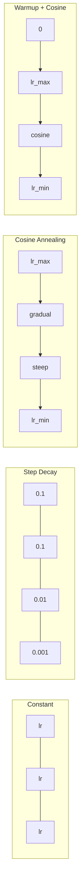
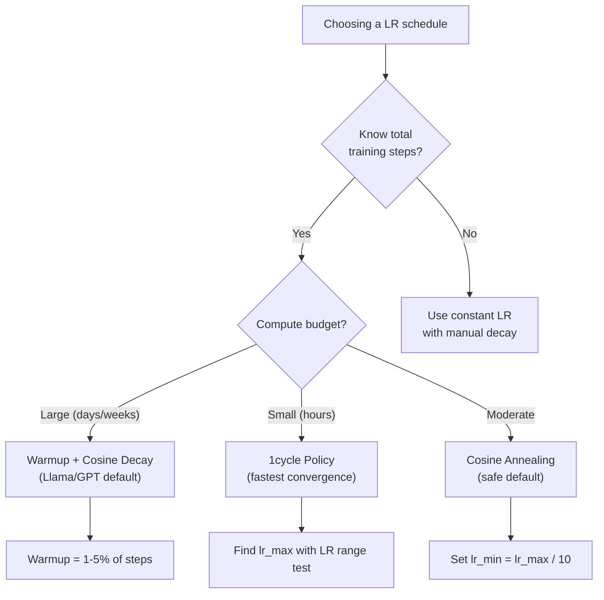
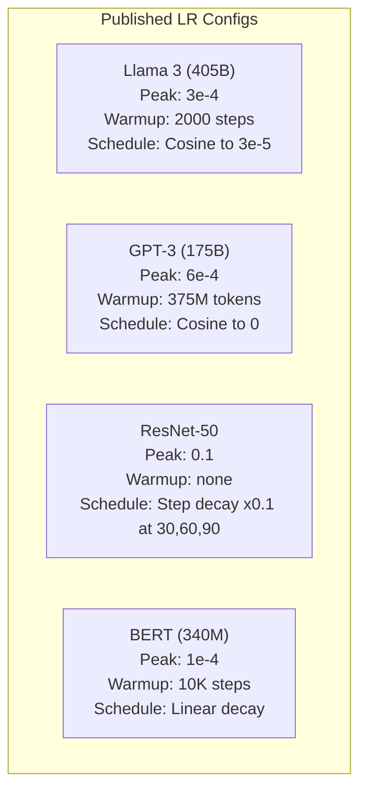

# सीखने की दरें और वार्मअप

> सीखने की दर सबसे महत्वपूर्ण हाइपरपैरामीटर है. वास्तुकला नहीं. डेटा सेट का आकार नहीं. सक्रियण फ़ंक्शन नहीं. सीखने की दर. यदि आप कुछ और नहीं ट्यून करते हैं, तो इसे ट्यून करें.

**Type:** Build
**Languages:** Python
**Prerequisites:** Lesson 03.06 (Optimizers), Lesson 03.08 (Weight Initialization)
**Time:** ~90 minutes

## सीखने के लक्ष्य

- निरंतर, चरण क्षय, कोसिन एनेलिंग, वार्मिंग + कोसिन, और 1 चक्र सीखने की दर के कार्यक्रमों को खरोंच से लागू करें
- सीखने की दर के चयन के तीन विफलता मोड प्रदर्शित करेंः विचलन (बहुत अधिक), स्थगित (बहुत कम) और घर्षण (कोई गिरावट नहीं)
- बताएँ कि आदम आधारित अनुकूलनकर्ताओं के लिए वार्मिंग क्यों आवश्यक है और यह प्रारंभिक प्रशिक्षण को कैसे स्थिर करता है
- एक ही कार्य पर सभी पांच कार्यक्रमों में अभिसरण गति की तुलना करें और एक दिए गए प्रशिक्षण बजट के लिए उपयुक्त एक चुनें

## समस्या

प्रशिक्षण की दर को 0.1 पर सेट करें। प्रशिक्षण विचलित होता है - नुकसान 3 चरणों में अनंत तक कूदता है। इसे 0.0001 पर सेट करें। प्रशिक्षण क्रॉल करता है - 100 युगों के बाद, मॉडल को यादृच्छिक से लगभग नहीं हटाया गया है। इसे 0.01 पर सेट करें। प्रशिक्षण 50 युगों के लिए काम करता है, फिर नुकसान न्यूनतम के आसपास टहलता है जो कभी नहीं पहुंच सकता क्योंकि चरण बहुत बड़े हैं।

प्रशिक्षण के दौरान सीखने की इष्टतम दर स्थिर नहीं होती है। यह प्रशिक्षण के दौरान बदलती है। शुरुआत में, आप जल्दी से जमीन को कवर करने के लिए बड़े कदम चाहते हैं। प्रशिक्षण के अंत में, आप छोटे कदम चाहते हैं कि एक तेज न्यूनतम में समायोजित हो जाएं। 90% सटीक मॉडल और 95% सटीक मॉडल के बीच अंतर अक्सर केवल कार्यक्रम होता है।

पिछले तीन वर्षों में प्रकाशित प्रत्येक प्रमुख मॉडल में सीखने की दर का एक कार्यक्रम होता है। Llama 3 ने 2000 वार्मिंग चरणों के साथ पीक lr = 3e-4 और 3e-5 तक कॉसिन गिरावट का उपयोग किया। GPT-3 ने 375 मिलियन टोकन से अधिक वार्मिंग के साथ lr = 6e-4 का उपयोग किया। ये मनमानी विकल्प नहीं हैं। वे व्यापक हाइपरपरमैटर स्वीप का परिणाम हैं जो लाखों डॉलर खर्च करते हैं।

आपको शेड्यूल को समझना होगा क्योंकि डिफ़ॉल्ट तरीके से आपके समस्या के लिए काम नहीं करेंगे। जब आप एक पूर्व-प्रशिक्षित मॉडल को ठीक से ट्यून करते हैं, तो सही शेड्यूल खरोंच से प्रशिक्षण से अलग है। जब आप बैच आकार बढ़ाते हैं, तो वार्मिंग अवधि को बदलने की आवश्यकता होती है। जब प्रशिक्षण 10,000 चरण पर टूट जाता है, तो आपको यह जानना होगा कि क्या यह एक शेड्यूल समस्या है या कुछ और।

## अवधारणा

### निरंतर सीखने की दर

सबसे सरल तरीका है, एक संख्या चुनें, हर कदम के लिए इसका इस्तेमाल करें।

```
lr(t) = lr_0
```

यह शायद ही कभी इष्टतम है। यह या तो प्रशिक्षण के अंत के लिए बहुत अधिक है (कम से कम के आसपास गतिशीलता) या शुरुआत के लिए बहुत कम है (छोटे चरणों पर बर्बाद गणना) । यह छोटे मॉडल और डिबगिंग के लिए ठीक काम करता है। एक घंटे से अधिक समय तक प्रशिक्षण देने वाले किसी भी चीज़ के लिए एक भयानक विकल्प है।

### चरण क्षय

ResNet युग से पुराने स्कूल के दृष्टिकोण। निश्चित कालखंडों पर सीखने की दर को एक कारक (आमतौर पर 10 गुना) कम करें।

```
lr(t) = lr_0 * gamma^(floor(epoch / step_size))
```

जहां गामा = 0.1 और स्टेप_साइज = 30 का मतलब हैः lr हर 30 युगों में 10 गुना गिरता है. ResNet-50 ने इस का उपयोग किया -- lr = 0.1, 30, 60 और 90 युगों में 10 गुना गिरता है।

समस्याः अनुकूलन गिरावट बिंदु डेटा सेट और वास्तुकला पर निर्भर करता है. एक अलग समस्या पर जाएं और आपको गिरने के समय को फिर से समायोजित करने की आवश्यकता है. संक्रमण अचानक हैं - नुकसान बढ़ सकता है जब दर अचानक बदल जाती है.

### कॉसिन एनेलिंग

एक कॉसिन वक्र के बाद अधिकतम सीखने की दर से न्यूनतम तक चिकनी गिरावटः

```
lr(t) = lr_min + 0.5 * (lr_max - lr_min) * (1 + cos(pi * t / T))
```

जहां t वर्तमान चरण है और T चरणों की कुल संख्या है।

t=0 पर, कॉसिन शब्द 1 है, इसलिए lr = lr_max। t=T पर, कॉसिन शब्द -1 है, इसलिए lr = lr_min। क्षय शुरू में हल्का होता है, मध्य में तेज होता है, और अंत के करीब फिर से हल्का हो जाता है।

यह अधिकांश आधुनिक प्रशिक्षण रन के लिए डिफ़ॉल्ट है. lr_max और lr_min से परे कोई हाइपरपैरामीटर नहीं है. कॉसिन आकार अनुभवजन्य अवलोकन से मेल खाता है कि अधिकांश सीखने प्रशिक्षण के बीच में होता है - आप उस महत्वपूर्ण अवधि के दौरान उचित चरण आकार चाहते हैं।

### गर्मजोशीः छोटी सी शुरुआत क्यों करें

एडम और अन्य अनुकूलन अनुकूलक ग्रेडिएंट औसत और भिन्नता के चल रहे अनुमान बनाए रखते हैं। चरण 0 पर, ये अनुमान शून्य पर आरंभिक रूप से किए जाते हैं। पहले कुछ ग्रेडिएंट अपडेट कचरे के आंकड़ों पर आधारित होते हैं। यदि इस अवधि के दौरान आपकी सीखने की दर बड़ी है, तो मॉडल बड़े पैमाने पर, खराब दिशा में कदम उठाता है।

Warmup इस समस्या को ठीक करता है. एक छोटी सी सीखने की दर (अक्सर lr_max / warmup_steps या यहां तक कि शून्य) से शुरू करें और पहले N चरणों के दौरान रैखिक रूप से lr_max तक ramp up करें। जब आप पूर्ण सीखने की दर तक पहुंच जाते हैं, तो एडम के आंकड़े स्थिर हो जाते हैं।

```
lr(t) = lr_max * (t / warmup_steps)     for t < warmup_steps
```

सामान्य वार्मिंगः कुल प्रशिक्षण चरणों का 1-5%। Llama 3 ने लगभग 1.8 ट्रिलियन टोकन के लिए प्रशिक्षण दिया और 2000 चरणों के लिए गर्म किया। GPT-3 ने 375 मिलियन टोकन से अधिक गर्म किया।

### रैखिक वार्मिंग + कोसिन क्षय

आधुनिक डिफ़ॉल्ट. रैप ऊपर रैखिक, फिर कॉसिन के साथ गिरावटः

```
if t < warmup_steps:
    lr(t) = lr_max * (t / warmup_steps)
else:
    progress = (t - warmup_steps) / (total_steps - warmup_steps)
    lr(t) = lr_min + 0.5 * (lr_max - lr_min) * (1 + cos(pi * progress))
```

यह है कि Llama, GPT, PaLM, और अधिकांश आधुनिक ट्रांसफार्मर का उपयोग करते हैं। वार्मिंग प्रारंभिक अस्थिरता को रोकता है। कॉसिनस क्षय मॉडल को एक अच्छा न्यूनतम में समायोजित करता है।

### 1 चक्र नीति

लेस्ली स्मिथ की खोज (2018): प्रशिक्षण के पहले छमाही में कम से उच्च मूल्य तक सीखने की दर को बढ़ाएं, फिर दूसरे छमाही में इसे वापस कम करें। विपरीत अंतर्ज्ञान - आप मध्यवर्ती के माध्यम से सीखने की दर को * क्यों बढ़ाएंगे?

सिद्धांतः उच्च सीखने की दर अनुकूलन की प्रक्षेपवक्र में शोर जोड़कर नियमितता के रूप में कार्य करती है। मॉडल रैंप-अप चरण के दौरान नुकसान परिदृश्य का अधिक पता लगाता है, बेहतर बेसिन ढूंढता है। रैंप-डाउन चरण फिर सबसे अच्छा बेसिन पाया के भीतर परिष्कृत करता है।

```
Phase 1 (0 to T/2):    lr ramps from lr_max/25 to lr_max
Phase 2 (T/2 to T):    lr ramps from lr_max to lr_max/10000
```

1cycle अक्सर एक निश्चित गणना बजट के लिए cosine annealing से तेज ट्रेनें।

### अनुसूची के आकार



### निर्णय प्रवाह चार्ट



### प्रकाशित मॉडल से वास्तविक संख्याएँ



```figure
lr-schedule
```

## इसे बनाओ

### चरण 1: कार्य अनुसूची

प्रत्येक फ़ंक्शन वर्तमान चरण को लेता है और उस चरण में सीखने की दर को लौटाता है।

```python
import math


def constant_schedule(step, lr=0.01, **kwargs):
    return lr


def step_decay_schedule(step, lr=0.1, step_size=100, gamma=0.1, **kwargs):
    return lr * (gamma ** (step // step_size))


def cosine_schedule(step, lr=0.01, total_steps=1000, lr_min=1e-5, **kwargs):
    if step >= total_steps:
        return lr_min
    return lr_min + 0.5 * (lr - lr_min) * (1 + math.cos(math.pi * step / total_steps))


def warmup_cosine_schedule(step, lr=0.01, total_steps=1000, warmup_steps=100, lr_min=1e-5, **kwargs):
    if total_steps <= warmup_steps:
        return lr * (step / max(warmup_steps, 1))
    if step < warmup_steps:
        return lr * step / warmup_steps
    progress = (step - warmup_steps) / (total_steps - warmup_steps)
    return lr_min + 0.5 * (lr - lr_min) * (1 + math.cos(math.pi * progress))


def one_cycle_schedule(step, lr=0.01, total_steps=1000, **kwargs):
    mid = max(total_steps // 2, 1)
    if step < mid:
        return (lr / 25) + (lr - lr / 25) * step / mid
    else:
        progress = (step - mid) / max(total_steps - mid, 1)
        return lr * (1 - progress) + (lr / 10000) * progress
```

### चरण 2: सभी कार्यक्रमों को कल्पना करें

प्रत्येक अनुसूची को प्रशिक्षण के दौरान कैसे विकसित होता है, यह दिखाने के लिए पाठ आधारित एक ग्राफ प्रिंट करें।

```python
def visualize_schedule(name, schedule_fn, total_steps=500, **kwargs):
    steps = list(range(0, total_steps, total_steps // 20))
    if total_steps - 1 not in steps:
        steps.append(total_steps - 1)

    lrs = [schedule_fn(s, total_steps=total_steps, **kwargs) for s in steps]
    max_lr = max(lrs) if max(lrs) > 0 else 1.0

    print(f"\n{name}:")
    for s, lr_val in zip(steps, lrs):
        bar_len = int(lr_val / max_lr * 40)
        bar = "#" * bar_len
        print(f"  Step {s:4d}: lr={lr_val:.6f} {bar}")
```

### चरण 3: प्रशिक्षण नेटवर्क

सर्कल डेटासेट पर एक सरल दो-परत नेटवर्क, पिछले पाठों के समान, लेकिन अब हम कार्यक्रम को बदलते हैं।

```python
import random


def sigmoid(x):
    x = max(-500, min(500, x))
    return 1.0 / (1.0 + math.exp(-x))


def relu(x):
    return max(0.0, x)


def relu_deriv(x):
    return 1.0 if x > 0 else 0.0


def make_circle_data(n=200, seed=42):
    random.seed(seed)
    data = []
    for _ in range(n):
        x = random.uniform(-2, 2)
        y = random.uniform(-2, 2)
        label = 1.0 if x * x + y * y < 1.5 else 0.0
        data.append(([x, y], label))
    return data


def train_with_schedule(schedule_fn, schedule_name, data, epochs=300, base_lr=0.05, **kwargs):
    random.seed(0)
    hidden_size = 8
    total_steps = epochs * len(data)

    std = math.sqrt(2.0 / 2)
    w1 = [[random.gauss(0, std) for _ in range(2)] for _ in range(hidden_size)]
    b1 = [0.0] * hidden_size
    w2 = [random.gauss(0, std) for _ in range(hidden_size)]
    b2 = 0.0

    step = 0
    epoch_losses = []

    for epoch in range(epochs):
        total_loss = 0
        correct = 0

        for x, target in data:
            lr = schedule_fn(step, lr=base_lr, total_steps=total_steps, **kwargs)

            z1 = []
            h = []
            for i in range(hidden_size):
                z = w1[i][0] * x[0] + w1[i][1] * x[1] + b1[i]
                z1.append(z)
                h.append(relu(z))

            z2 = sum(w2[i] * h[i] for i in range(hidden_size)) + b2
            out = sigmoid(z2)

            error = out - target
            d_out = error * out * (1 - out)

            for i in range(hidden_size):
                d_h = d_out * w2[i] * relu_deriv(z1[i])
                w2[i] -= lr * d_out * h[i]
                for j in range(2):
                    w1[i][j] -= lr * d_h * x[j]
                b1[i] -= lr * d_h
            b2 -= lr * d_out

            total_loss += (out - target) ** 2
            if (out >= 0.5) == (target >= 0.5):
                correct += 1
            step += 1

        avg_loss = total_loss / len(data)
        accuracy = correct / len(data) * 100
        epoch_losses.append(avg_loss)

    return epoch_losses
```

### चरण 4: सभी कार्यक्रमों की तुलना करें

प्रत्येक कार्यक्रम के साथ एक ही नेटवर्क को प्रशिक्षित करें और अंतिम हानि और अभिसरण व्यवहार की तुलना करें।

```python
def compare_schedules(data):
    configs = [
        ("Constant", constant_schedule, {}),
        ("Step Decay", step_decay_schedule, {"step_size": 15000, "gamma": 0.1}),
        ("Cosine", cosine_schedule, {"lr_min": 1e-5}),
        ("Warmup+Cosine", warmup_cosine_schedule, {"warmup_steps": 3000, "lr_min": 1e-5}),
        ("1cycle", one_cycle_schedule, {}),
    ]

    print(f"\n{'Schedule':<20} {'Start Loss':>12} {'Mid Loss':>12} {'End Loss':>12} {'Best Loss':>12}")
    print("-" * 70)

    for name, schedule_fn, extra_kwargs in configs:
        losses = train_with_schedule(schedule_fn, name, data, epochs=300, base_lr=0.05, **extra_kwargs)
        mid_idx = len(losses) // 2
        best = min(losses)
        print(f"{name:<20} {losses[0]:>12.6f} {losses[mid_idx]:>12.6f} {losses[-1]:>12.6f} {best:>12.6f}")
```

### चरण 5: एलआर बहुत उच्च बनाम बहुत कम

तीन विफलता मोड दिखाएंः बहुत अधिक (विवर्जन), बहुत कम (क्रॉल) और सही।

```python
def lr_sensitivity(data):
    learning_rates = [1.0, 0.1, 0.01, 0.001, 0.0001]

    print("\nLR Sensitivity (constant schedule, 100 epochs):")
    print(f"  {'LR':>10} {'Start Loss':>12} {'End Loss':>12} {'Status':>15}")
    print("  " + "-" * 52)

    for lr in learning_rates:
        losses = train_with_schedule(constant_schedule, f"lr={lr}", data, epochs=100, base_lr=lr)
        start = losses[0]
        end = losses[-1]

        if end > start or math.isnan(end) or end > 1.0:
            status = "DIVERGED"
        elif end > start * 0.9:
            status = "BARELY MOVED"
        elif end < 0.15:
            status = "CONVERGED"
        else:
            status = "LEARNING"

        end_str = f"{end:.6f}" if not math.isnan(end) else "NaN"
        print(f"  {lr:>10.4f} {start:>12.6f} {end_str:>12} {status:>15}")
```

## इसका प्रयोग करें

PyTorch  में समय निर्धारित करने वालों को प्रदान करता है`torch.optim.lr_scheduler`:

```python
import torch
import torch.optim as optim
from torch.optim.lr_scheduler import CosineAnnealingLR, OneCycleLR, StepLR

model = nn.Sequential(nn.Linear(10, 64), nn.ReLU(), nn.Linear(64, 1))
optimizer = optim.Adam(model.parameters(), lr=3e-4)

scheduler = CosineAnnealingLR(optimizer, T_max=1000, eta_min=1e-5)

for step in range(1000):
    loss = train_step(model, optimizer)
    scheduler.step()
```

वार्मअप + कॉसिन्स के लिए लैम्ब्डा शेड्यूलर या `get_cosine_schedule_with_warmup`HuggingFace सेः

```python
from transformers import get_cosine_schedule_with_warmup

scheduler = get_cosine_schedule_with_warmup(
    optimizer,
    num_warmup_steps=2000,
    num_training_steps=100000,
)
```

HuggingFace फ़ंक्शन सबसे Llama और GPT ठीक-ठीक करने स्क्रिप्ट का उपयोग करता है। जब संदेह हो, तो वार्मअप + कॉसिनस के साथ वार्मअप = कुल चरणों के 3-5% का उपयोग करें। यह लगभग हर चीज के लिए काम करता है।

## इसे भेजें

इस पाठ से उत्पन्न होता हैः
- `outputs/prompt-lr-schedule-advisor.md`-- एक संकेत जो आपके प्रशिक्षण सेटअप के लिए सही सीखने की दर कार्यक्रम और हाइपरपैरामीटर की सिफारिश करता है

## व्यायाम

1. एक्सपोनेंशियल गिरावट लागू करेंः lr(t) = lr_0 * गामा^t जहां गामा = 0.999. सर्कल डेटासेट पर कोसिन annealing की तुलना करें।

2. सीखने की दर रेंज टेस्ट (लेस्ली स्मिथ) को लागू करेंः कुछ सौ चरणों के लिए प्रशिक्षित करें जबकि 1e-7 से 1 तक एलआर को तेजी से बढ़ाएं। प्लॉट हानि बनाम एलआर। अधिकतम एलआर नुकसान बढ़ने से ठीक पहले है।

3. वार्मअप + कोसिन के साथ प्रशिक्षण करें लेकिन वार्मअप की लंबाई को भिन्न करेंः 0%, 1%, 5%, 10%, कुल चरणों का 20%। सबसे अधिक स्थिर प्रशिक्षण के लिए एक मीठा स्थान खोजें।

4. गर्म रिस्टार्ट (SGDR) के साथ कॉसीन एनीलिंग लागू करेंः प्रत्येक टी चरणों में सीखने की दर को lr_max पर रीसेट करें और फिर से गिरावट। लंबी प्रशिक्षण रन पर मानक कॉसीन की तुलना करें।

5. एक "अनुसूची सर्जन" का निर्माण करें जो प्रशिक्षण हानि की निगरानी करता है और नुकसान स्थिर होने पर स्वचालित रूप से वार्मिंग से कोसिन पर स्विच करता है, और यदि नुकसान बहुत लंबे समय तक पठारों में है तो आईआर को कम करता है।

## प्रमुख शर्तें

| Term | What people say | What it actually means |
|------|----------------|----------------------|
| Learning rate | "How fast the model learns" | The scalar that multiplies the gradient to determine the parameter update size |
| Schedule | "Change the LR over time" | A function that maps training step to learning rate, designed to optimize convergence |
| Warmup | "Start with a small LR" | Linearly ramping the LR from near-zero to the target value over the first N steps to stabilize optimizer statistics |
| Cosine annealing | "Smooth LR decay" | Decreasing the LR following a cosine curve from lr_max to lr_min over training |
| Step decay | "Drop LR at milestones" | Multiplying the LR by a factor (usually 0.1) at fixed epoch intervals |
| 1cycle policy | "Up then down" | Leslie Smith's method of ramping LR up then down in a single cycle for faster convergence |
| LR range test | "Find the best learning rate" | Training briefly while increasing LR to find the value where loss starts diverging |
| Cosine with warm restarts | "Reset and repeat" | Periodically resetting the LR to lr_max and decaying again (SGDR) |
| Eta min | "The floor for the LR" | The minimum learning rate that the schedule decays to |
| Peak learning rate | "The maximum LR" | The highest LR reached during training, typically after warmup |

## आगे पढ़ना

- लोश्चिलोव और हटर, "एसजीडीआरः वार्म रिस्टार्ट्स के साथ स्टोकास्टिक ग्रेडिएंट डाउनसेंट" (2017) -- कोसिन एनीलिंग और वार्म रिस्टार्ट्स पेश किया
- स्मिथ, "सुपर-कन्वर्जेंसः हाई लर्निंग रेट्स का उपयोग करके न्यूरल नेटवर्क का बहुत तेज़ प्रशिक्षण" (2018) -- 1 चक्र नीति पत्र
- Touvron et al., "Llama 2: ओपन फाउंडेशन और फाइन-ट्यून चैट मॉडल" (2023) -- वार्मअप + कॉसिन शेड्यूल को दस्तावेज करता है जो पैमाने पर उपयोग किया जाता है
- गोयल एट अल., "सटीक, बड़े मिनी बैच एसजीडीः 1 घंटे में प्रशिक्षण छविनेट" (2017) -- रैखिक स्केलिंग नियम और बड़े बैच प्रशिक्षण के लिए वार्मअप
