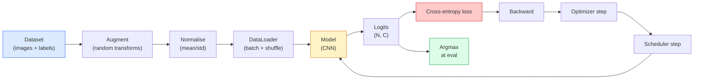

# छवि वर्गीकरण

> एक वर्गीकरण पिक्सेल से वर्गों पर संभावना वितरण के लिए एक समारोह है. बाकी सब पाइपलाइन है.

**Type:** Build
**Languages:** Python
**Prerequisites:** Phase 2 Lesson 09 (Model Evaluation), Phase 3 Lesson 10 (Mini Framework), Phase 4 Lesson 03 (CNNs)
**Time:** ~75 minutes

## सीखने के लक्ष्य

- सीआईएफएआर-10 पर एक अंत-से-अंत छवि वर्गीकरण पाइपलाइन बनाएंः डेटासेट, संवर्धन, मॉडल, प्रशिक्षण लूप, मूल्यांकन
- प्रत्येक घटक (डेटा लोडर, हानि, अनुकूलक, अनुसूचक, वृद्धि) की भूमिका को समझाएं और भविष्यवाणी करें कि उनमें से किसी एक को तोड़ने का परिणाम हानि वक्र में कैसे प्रकट होता है
- मिश्रण, कटआउट और लेबल चिकनाई को खरोंच से लागू करें और यह औचित्य दें कि प्रत्येक को जोड़ने के लायक कब है
- संचयी सटीकता से परे डेटासेट और मॉडल विफलताओं का निदान करने के लिए एक भ्रम मैट्रिक्स और प्रति वर्ग सटीकता/पुनर्विचार तालिका पढ़ें

## समस्या

प्रत्येक दृष्टि कार्य जो जहाजों को किसी स्तर पर छवि वर्गीकरण में कम करता है। पता लगाने क्षेत्र को वर्गीकृत करता है। विभाजन पिक्सल को वर्गीकृत करता है। कक्षा केंद्रों के समानता के आधार पर प्राप्त करना। वर्गीकरण सही प्राप्त करना  डेटासेट लूप, वृद्धि नीति, हानि, मूल्यांकन  वह कौशल है जो चरण में प्रत्येक अन्य कार्य में स्थानांतरित होता है।

अधिकांश वर्गीकरण बग मॉडल में नहीं हैं। वे पाइपलाइन में रहते हैंः एक टूटने वाले मानकीकरण, एक असहज प्रशिक्षण सेट, बढ़ाव जो लेबल को विकृत करता है, प्रशिक्षण डेटा से दूषित सत्यापन विभाजन, सीखने की दर जो चुपचाप युग 30 के बाद भिन्न होती है। एक सीएनएन जो सही सेटअप के साथ सीआईएफएआर -10 पर 93% तक पहुंचता है, आमतौर पर एक टूटे हुए के साथ 70-75% स्कोर करता है, और नुकसान वक्र हमेशा यथार्थवादी लगता है।

इस सबक में पाइपलाइन को हाथ से तारों से जोड़ दिया गया है ताकि हर भाग का निरीक्षण किया जा सके।`torchvision.datasets`यह एक कीट छिपा सकता है.

## अवधारणा

### वर्गीकरण पाइपलाइन



इस लूप में हर पंक्ति में एक बग रह सकता है। क्रॉस-एंट्रोपी कच्चे लॉजिट लेता है, न कि softmax आउटपुट, तो किसी भी `model(x).softmax()` के अलावा, जो मिश्रण, दोनों मिश्रण के लिए नहीं, केवल इनपुट के लिए लागू होता है। `optimizer.zero_grad()`यह एक बार होता है, इसे छोड़ने से ग्रेडिएंट जमा हो जाते हैं और यह एक बहुत ही अस्थिर सीखने की दर की तरह दिखता है। इन बगों में से प्रत्येक त्रुटि के बिना सीखने की वक्र को सपाट करता है।

### क्रॉस-एंट्रोपी, लॉजिट और सॉफ्टमैक्स

एक वर्गीकरण उत्पादित करता है `C`प्रति छवि logits कहा जाता संख्याओं। softmax लागू करने से उन्हें एक संभावना वितरण में परिवर्तित करता हैः

```
softmax(z)_i = exp(z_i) / sum_j exp(z_j)
```

क्रॉस-एंट्रोपी सही वर्ग की नकारात्मक लॉग संभावना को मापता हैः

```
CE(z, y) = -log( softmax(z)_y )
        = -z_y + log( sum_j exp(z_j) )
```

दाएं हाथ का रूप संख्यात्मक रूप से स्थिर है (लॉग-सॉम-एक्सप) ।`nn.CrossEntropyLoss`एक ऑपरेशन में सॉफ्टमैक्स + एनएलएल को मिलाता है और सीधे कच्चे लॉजिट लेता है। पहले सॉफ्टमैक्स को स्वयं लागू करना लगभग हमेशा एक बग होता है  आप लॉग ((मॉफ्टमैक्स(मॉफ्टमैक्स(ज़)) का गणना करते हैं), एक अर्थहीन मात्रा।

### वृद्धि का काम क्यों होता है

एक सीएनएन में अनुवाद के लिए प्रेरक पूर्वाग्रह है (वेट शेयरिंग से) लेकिन फसल, फ्लिप, रंग जिक्र या ऑक्ल्यूशन के लिए कोई अंतर्निहित अपरिवर्तनीयता नहीं है। इसे इन अपरिवर्तनीयताओं को सिखाने का एकमात्र तरीका यह है कि उसे पिक्सेल दिखाएं जो उन्हें व्यायाम करते हैं। प्रशिक्षण के दौरान प्रत्येक यादृच्छिक परिवर्तन यह कहने का एक तरीका हैः "इन दोनों छवियों का एक ही लेबल है; उन विशेषताओं को जानें जो अंतर को अनदेखा करते हैं। "

```
Original crop:  "dog facing left"
Flip:           "dog facing right"       <- same label, different pixels
Rotate(+15):    "dog, slight tilt"
Colour jitter:  "dog in warmer light"
RandomErasing:  "dog with patch missing"
```

नियमः बढ़ाव लेबल को संरक्षित करना चाहिए। एक अंक पर कटआउट और घूर्णन "6" को "9" में फ्लिप कर सकते हैं; उस डेटासेट के लिए आप छोटे घूर्णन रेंज का उपयोग करते हैं और अंक-विशिष्ट अपरिवर्तितियों का सम्मान करने वाले बढ़ाव चुनते हैं।

### मिश्रण और कटमिश

साधारण बढ़ाव पिक्सेल को बदल देता है लेकिन लेबल को एक ही गर्म रखता है। **Mixup**और **cutmix**दोनों को इंटरपोला करके इसे तोड़ें।

```
Mixup:
  lambda ~ Beta(a, a)
  x = lambda * x_i + (1 - lambda) * x_j
  y = lambda * y_i + (1 - lambda) * y_j

Cutmix:
  paste a random rectangle of x_j into x_i
  y = area-weighted mix of y_i and y_j
```

यह मदद क्यों करता हैः मॉडल को एक-गर्म लक्ष्य को याद करना बंद कर देता है और कक्षाओं के बीच इंटरपोलेट करना सीखता है। प्रशिक्षण हानि बढ़ जाती है, परीक्षण सटीकता बढ़ जाती है। यह किसी भी वर्गीकरण के लिए सबसे सस्ता एकल मजबूती उन्नयन है।

### लेबल चिकनाई

एक भ्रमित चचेरे भाई के बजाय प्रशिक्षण के खिलाफ`[0, 0, 1, 0, 0]`, ट्रेन के खिलाफ`[eps/C, eps/C, 1-eps, eps/C, eps/C]`एक छोटे से के लिए `eps`जैसे 0.1. मॉडल को मनमाने ढंग से तेज लॉजिट का उत्पादन करने से रोकता है और लगभग बिना किसी लागत के माप सुधारता है।`nn.CrossEntropyLoss(label_smoothing=0.1)`PyTorch 1.10 के बाद से।

### सटीकता से परे मूल्यांकन

संकलित सटीकता असंतुलन को छिपाती है। 90-10 द्विआधारी वर्गीकरण जो हमेशा बहुमत वर्ग के स्कोर का पूर्वानुमान करता है 90%। उपकरण जो वास्तव में आपको बताता है कि क्या हो रहा हैः

- **Per-class accuracy** प्रति वर्ग एक संख्या; तुरंत निम्न प्रदर्शन वाली श्रेणियों को प्रकट करता है।
- **Confusion matrix** C x C ग्रिड के साथ पंक्ति i col j = सही वर्ग i की संख्या वर्ग j के रूप में भविष्यवाणी की; विघात सही है, off-विघात जहां आपका मॉडल रहता है.
- **Top-1 / Top-5** चाहे सही वर्ग शीर्ष 1 या शीर्ष 5 भविष्यवाणियों में हो; ImageNet के लिए शीर्ष-5 मायने रखता है क्योंकि "नॉर्विच टेरियर" बनाम "नॉर्फ़ॉक टेरियर" जैसी कक्षाएं वास्तव में अस्पष्ट हैं।
- **Calibration (ECE)** क्या 0.8 विश्वसनीयता पूर्वानुमान 80% समय सही है? आधुनिक नेटवर्क व्यवस्थित रूप से अत्यधिक विश्वसनीय हैं; तापमान स्केलिंग या लेबल चिकनाई के साथ ठीक करें।

```figure
receptive-field
```

## इसे बनाओ

### चरण 1: एक निर्धारक सिंथेटिक डेटासेट

CIFAR-10 डिस्क पर रहता है. इस पाठ को पुनः प्रयोज्य और तेज़ बनाने के लिए हम एक सिंथेटिक डेटासेट बनाते हैं जो CIFAR  32x32 आरजीबी छवियों की तरह दिखता है। मॉडल को कक्षा-विशिष्ट संरचना के साथ सीखना चाहिए। वास्तविक CIFAR-10 पर एक ही पाइपलाइन अपरिवर्तित काम करती है।

```python
import numpy as np
import torch
from torch.utils.data import Dataset


def synthetic_cifar(num_per_class=1000, num_classes=10, seed=0):
    rng = np.random.default_rng(seed)
    X = []
    Y = []
    for c in range(num_classes):
        centre = rng.uniform(0, 1, (3,))
        freq = 2 + c
        for _ in range(num_per_class):
            yy, xx = np.meshgrid(np.linspace(0, 1, 32), np.linspace(0, 1, 32), indexing="ij")
            r = np.sin(xx * freq) * 0.5 + centre[0]
            g = np.cos(yy * freq) * 0.5 + centre[1]
            b = (xx + yy) * 0.5 * centre[2]
            img = np.stack([r, g, b], axis=-1)
            img += rng.normal(0, 0.08, img.shape)
            img = np.clip(img, 0, 1)
            X.append(img.astype(np.float32))
            Y.append(c)
    X = np.stack(X)
    Y = np.array(Y)
    idx = rng.permutation(len(X))
    return X[idx], Y[idx]


class ArrayDataset(Dataset):
    def __init__(self, X, Y, transform=None):
        self.X = X
        self.Y = Y
        self.transform = transform

    def __len__(self):
        return len(self.X)

    def __getitem__(self, i):
        img = self.X[i]
        if self.transform is not None:
            img = self.transform(img)
        img = torch.from_numpy(img).permute(2, 0, 1)
        return img, int(self.Y[i])
```

प्रत्येक वर्ग को अपना रंग पैलेट और आवृत्ति पैटर्न मिलता है, साथ ही गौशियन शोर मॉडल को पिक्सेल को याद करने के बजाय संकेत सीखने के लिए मजबूर करता है। दस वर्ग, प्रत्येक में एक हजार छवियां, प्रतिस्थापित।

### चरण 2: सामान्यीकरण और वृद्धि

दोनों परिवर्तन है कि हर दृष्टि पाइपलाइन है.

```python
def standardize(mean, std):
    mean = np.array(mean, dtype=np.float32)
    std = np.array(std, dtype=np.float32)
    def _fn(img):
        return (img - mean) / std
    return _fn


def random_hflip(p=0.5):
    def _fn(img):
        if np.random.random() < p:
            return img[:, ::-1, :].copy()
        return img
    return _fn


def random_crop(pad=4):
    def _fn(img):
        h, w = img.shape[:2]
        padded = np.pad(img, ((pad, pad), (pad, pad), (0, 0)), mode="reflect")
        y = np.random.randint(0, 2 * pad)
        x = np.random.randint(0, 2 * pad)
        return padded[y:y + h, x:x + w, :]
    return _fn


def compose(*fns):
    def _fn(img):
        for fn in fns:
            img = fn(img)
        return img
    return _fn
```

फसल से पहले प्रतिबिंबित पैड, शून्य पैड नहीं, क्योंकि काले सीमाएं एक संकेत है मॉडल एक बेकार तरीके से अनदेखा करना सीखेंगे।

### चरण 3: मिश्रण

प्रशिक्षण चरण के अंदर दो छवियों और दो लेबल को मिलाता है। एक बैच परिवर्तन के रूप में लागू किया जाता है ताकि यह डेटासेट के अंदर के बजाय आगे के पास रहता है।

```python
def mixup_batch(x, y, num_classes, alpha=0.2):
    if alpha <= 0:
        return x, torch.nn.functional.one_hot(y, num_classes).float()
    lam = float(np.random.beta(alpha, alpha))
    idx = torch.randperm(x.size(0), device=x.device)
    x_mixed = lam * x + (1 - lam) * x[idx]
    y_onehot = torch.nn.functional.one_hot(y, num_classes).float()
    y_mixed = lam * y_onehot + (1 - lam) * y_onehot[idx]
    return x_mixed, y_mixed


def soft_cross_entropy(logits, soft_targets):
    log_probs = torch.log_softmax(logits, dim=-1)
    return -(soft_targets * log_probs).sum(dim=-1).mean()
```

`soft_cross_entropy`यह सामान्य एक गर्म मामले में कम हो जाता है जब लक्ष्य बिल्कुल एक गर्म है।

### चरण 4: प्रशिक्षण लूप

पूरा नुस्खाः एक डेटा पास, ग्रेडिएंट एक बार प्रति बैच, शेड्यूलर एक समय के लिए कदम.

```python
import torch
import torch.nn as nn
from torch.utils.data import DataLoader
from torch.optim import SGD
from torch.optim.lr_scheduler import CosineAnnealingLR

def train_one_epoch(model, loader, optimizer, device, num_classes, use_mixup=True):
    model.train()
    total, correct, loss_sum = 0, 0, 0.0
    for x, y in loader:
        x, y = x.to(device), y.to(device)
        if use_mixup:
            x_m, y_soft = mixup_batch(x, y, num_classes)
            logits = model(x_m)
            loss = soft_cross_entropy(logits, y_soft)
        else:
            logits = model(x)
            loss = nn.functional.cross_entropy(logits, y, label_smoothing=0.1)
        optimizer.zero_grad()
        loss.backward()
        optimizer.step()
        loss_sum += loss.item() * x.size(0)
        total += x.size(0)
        # Training accuracy vs the un-mixed labels `y` is only an approximation
        # when mixup is on (the model saw soft targets, not y). Treat it as a
        # rough progress signal; rely on val accuracy for real performance.
        with torch.no_grad():
            pred = logits.argmax(dim=-1)
            correct += (pred == y).sum().item()
    return loss_sum / total, correct / total


@torch.no_grad()
def evaluate(model, loader, device, num_classes):
    model.eval()
    total, correct = 0, 0
    loss_sum = 0.0
    cm = torch.zeros(num_classes, num_classes, dtype=torch.long)
    for x, y in loader:
        x, y = x.to(device), y.to(device)
        logits = model(x)
        loss = nn.functional.cross_entropy(logits, y)
        pred = logits.argmax(dim=-1)
        for t, p in zip(y.cpu(), pred.cpu()):
            cm[t, p] += 1
        loss_sum += loss.item() * x.size(0)
        total += x.size(0)
        correct += (pred == y).sum().item()
    return loss_sum / total, correct / total, cm
```

पांच अपरिवर्तनीय आप जांच जब आप एक प्रशिक्षण लूप लिखते हैंः

1. `model.train()`प्रशिक्षण से पहले, `model.eval()`मूल्यांकन से पहले  ड्रॉपआउट और बैचनॉर्म व्यवहार को उलट देता है।
2. `.zero_grad()`पहले`.backward()`. .
3. `.item()`जब मैट्रिक्स इकट्ठा करने के लिए तो कुछ भी जीवित गणना ग्राफ रखने के लिए.
4. `@torch.no_grad()`मूल्यांकन के दौरान  स्मृति और समय की बचत करता है, सूक्ष्म दुर्घटनाओं को रोकता है।
5. कच्चे लॉजिट के मुकाबले अर्गमैक्स, सॉफ्टमैक्स नहीं  समान परिणाम, एक ऑपरेशन कम।

### चरण 5: इसे एक साथ रखें

`TinyResNet`पिछले पाठ से, कुछ काल के लिए प्रशिक्षण, मूल्यांकन.

```python
from main import synthetic_cifar, ArrayDataset
from main import standardize, random_hflip, random_crop, compose
from main import mixup_batch, soft_cross_entropy
from main import train_one_epoch, evaluate
# TinyResNet comes from the previous lesson (03-cnns-lenet-to-resnet).
# Adjust the import path to wherever you stored the previous lesson's code.
from cnns_lenet_to_resnet import TinyResNet  # example placeholder

X, Y = synthetic_cifar(num_per_class=500)
split = int(0.9 * len(X))
X_train, Y_train = X[:split], Y[:split]
X_val, Y_val = X[split:], Y[split:]

mean = [0.5, 0.5, 0.5]
std = [0.25, 0.25, 0.25]
train_tf = compose(random_hflip(), random_crop(pad=4), standardize(mean, std))
eval_tf = standardize(mean, std)

train_ds = ArrayDataset(X_train, Y_train, transform=train_tf)
val_ds = ArrayDataset(X_val, Y_val, transform=eval_tf)

train_loader = DataLoader(train_ds, batch_size=128, shuffle=True, num_workers=0)
val_loader = DataLoader(val_ds, batch_size=256, shuffle=False, num_workers=0)

device = "cuda" if torch.cuda.is_available() else "cpu"
model = TinyResNet(num_classes=10).to(device)
optimizer = SGD(model.parameters(), lr=0.1, momentum=0.9, weight_decay=5e-4, nesterov=True)
scheduler = CosineAnnealingLR(optimizer, T_max=10)

for epoch in range(10):
    tr_loss, tr_acc = train_one_epoch(model, train_loader, optimizer, device, 10, use_mixup=True)
    va_loss, va_acc, _ = evaluate(model, val_loader, device, 10)
    scheduler.step()
    print(f"epoch {epoch:2d}  lr {scheduler.get_last_lr()[0]:.4f}  "
          f"train {tr_loss:.3f}/{tr_acc:.3f}  val {va_loss:.3f}/{va_acc:.3f}")
```

सिंथेटिक डेटासेट पर, यह पांच युगों के भीतर लगभग सही सत्यापन सटीकता तक पहुंचता है, जो कि बिंदु हैः पाइपलाइन सही है, मॉडल सीख सकता है कि क्या सीखना है। वास्तविक CIFAR-10 के लिए डेटासेट को स्विच करें और एक ही लूप ट्रेनों को बिना परिवर्तन के ~ 90% तक।

### चरण 6: भ्रम मैट्रिक्स पढ़ें

सटीकता अकेले आपको कभी नहीं बताती कि मॉडल कहां विफल है। भ्रम मैट्रिक्स ऐसा करता है।

```python
def print_confusion(cm, labels=None):
    c = cm.shape[0]
    labels = labels or [str(i) for i in range(c)]
    print(f"{'':>6}" + "".join(f"{l:>5}" for l in labels))
    for i in range(c):
        row = cm[i].tolist()
        print(f"{labels[i]:>6}" + "".join(f"{v:>5}" for v in row))
    print()
    tp = cm.diag().float()
    fp = cm.sum(dim=0).float() - tp
    fn = cm.sum(dim=1).float() - tp
    prec = tp / (tp + fp).clamp_min(1)
    rec = tp / (tp + fn).clamp_min(1)
    f1 = 2 * prec * rec / (prec + rec).clamp_min(1e-9)
    for i in range(c):
        print(f"{labels[i]:>6}  prec {prec[i]:.3f}  rec {rec[i]:.3f}  f1 {f1[i]:.3f}")

_, _, cm = evaluate(model, val_loader, device, 10)
print_confusion(cm)
```

पंक्तियाँ सच्चे वर्ग हैं, स्तंभ भविष्यवाणियां हैं। कक्षा 3 और 5 के बीच ऑफ-डायगोनल गिनती का एक समूह का मतलब है कि मॉडल उन दोनों को भ्रमित करता है और आपको लक्षित डेटा संग्रह या वर्ग-विशिष्ट वृद्धि के लिए एक प्रारंभिक बिंदु देता है।

## इसका प्रयोग करें

`torchvision`वास्तविक CIFAR-10 के लिए पूरी पाइपलाइन चार पंक्तियों के साथ एक प्रशिक्षण लूप है।

```python
from torchvision.datasets import CIFAR10
from torchvision.transforms import Compose, RandomCrop, RandomHorizontalFlip, ToTensor, Normalize

mean = (0.4914, 0.4822, 0.4465)
std = (0.2470, 0.2435, 0.2616)
train_tf = Compose([
    RandomCrop(32, padding=4, padding_mode="reflect"),
    RandomHorizontalFlip(),
    ToTensor(),
    Normalize(mean, std),
])
eval_tf = Compose([ToTensor(), Normalize(mean, std)])

train_ds = CIFAR10(root="./data", train=True,  download=True, transform=train_tf)
val_ds   = CIFAR10(root="./data", train=False, download=True, transform=eval_tf)
```

दो बातें ध्यान देने योग्य हैंः औसत/एसटीडी **dataset-specific** CIFAR-10 प्रशिक्षण सेट पर गणना की गई है, ImageNet पर नहीं  और प्रतिबिंब पैड समुदाय-पूर्वनिर्धारित फसल नीति है। यहां ImageNet के आंकड़ों को कॉपी-पेस्ट करना एक ~ 1% सटीकता लीक है जो किसी को भी नहीं पकड़ता है जब तक कि कोई मॉडल को प्रोफाइल नहीं करता है।

## इसे भेजें

इस पाठ से उत्पन्न होता हैः

- `outputs/prompt-classifier-pipeline-auditor.md` एक संकेत जो उपरोक्त पांच अपरिवर्तित के लिए प्रशिक्षण स्क्रिप्ट का ऑडिट करता है और पहला उल्लंघन प्रकट करता है।
- `outputs/skill-classification-diagnostics.md` एक कौशल जो, भ्रम मैट्रिक्स और वर्ग नामों की सूची को देखते हुए, प्रति वर्ग विफलताओं का सारांश देता है और सबसे प्रभावशाली एकल समाधान का प्रस्ताव करता है।

## व्यायाम

1. **(Easy)**संश्लेषण डेटासेट पर पांच युगों तक एक ही मॉडल को मिश्रण के साथ और बिना प्रशिक्षित करें। दोनों के लिए प्लॉट ट्रेन और वैल हानि। बताएं कि मिश्रण के साथ ट्रेन हानि क्यों अधिक है जबकि वैल सटीकता समान या बेहतर है।
2. **(Medium)**प्रत्येक प्रशिक्षण छवि में कटाई  शून्य से एक यादृच्छिक 8x8 वर्ग  को लागू करें और एक अपघटन बनाम कोई वृद्धि, hflip+crop, hflip+crop+cutout, hflip+crop+mixup चलाएं। प्रत्येक के लिए वैल सटीकता रिपोर्ट करें।
3. **(Hard)**एक CIFAR-100 पाइपलाइन (100 वर्ग, समान इनपुट आकार) का निर्माण करें और प्रकाशित सटीकता के 1% के भीतर एक ResNet-34 प्रशिक्षण रन को पुनः प्रस्तुत करें। अतिरिक्तः तीन सीखने की दरों और दो वजन घटाने को झाड़ो, स्थानीय CSV में लॉग करें, अंतिम भ्रम-मैट्रिक्स-शीर्ष-भ्रष्टाचार तालिका उत्पन्न करें।

## प्रमुख शर्तें

| Term | What people say | What it actually means |
|------|----------------|----------------------|
| Logits | "Raw outputs" | The pre-softmax vector of C numbers per image; cross-entropy expects these, not softmaxed values |
| Cross-entropy | "The loss" | Negative log-probability of the correct class; combines log-softmax and NLL in one stable op |
| DataLoader | "The batcher" | Wraps a dataset with shuffling, batching, and (optional) multi-worker loading; gets blamed for half of training bugs |
| Augmentation | "Random transforms" | Any pixel-level transform at training time that preserves the label; teaches invariances the CNN does not have natively |
| Mixup / Cutmix | "Mix two images" | Blend both inputs and labels so the classifier learns smooth interpolations instead of hard boundaries |
| Label smoothing | "Softer targets" | Replace one-hot with (1-eps, eps/(C-1), ...); improves calibration and slightly boosts accuracy |
| Top-k accuracy | "Top-5" | The correct class is in the k highest-probability predictions; used on datasets with genuinely ambiguous classes |
| Confusion matrix | "Where errors live" | C x C table where entry (i, j) counts images of true class i predicted as j; diagonal is right, off-diagonal tells you what to fix |

## आगे पढ़ना

- [CS231n: Training Neural Networks](https://cs231n.github.io/neural-networks-3/) अभी भी एक ही पृष्ठ पर प्रशिक्षण पाइपलाइन का सबसे स्पष्ट दौरा
- [Bag of Tricks for Image Classification (He et al., 2019)](https://arxiv.org/abs/1812.01187) प्रत्येक छोटे ट्रिक जो एक साथ इमेजनेट पर रेसनेट की सटीकता में 3-4% जोड़ता है
- [mixup: Beyond Empirical Risk Minimization (Zhang et al., 2017)](https://arxiv.org/abs/1710.09412) मूल मिश्रित पेपर; तीन पृष्ठ सिद्धांत और आश्वस्त प्रयोग
- [Why temperature scaling matters (Guo et al., 2017)](https://arxiv.org/abs/1706.04599) कागज जो साबित आधुनिक नेटवर्क गलत कैलिब्रेट कर रहे हैं और एक स्केलर पैरामीटर के साथ तय किया
