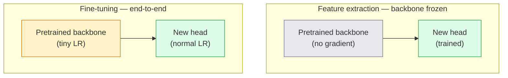

# स्थानांतरण सीखना और ठीक से समायोजित करना

> किसी और ने एक लाख GPU घंटे नेटवर्क को सिखाया कि किनारे, बनावट और वस्तु भागों की तरह दिखते हैं।

**Type:** Build
**Languages:** Python
**Prerequisites:** Phase 4 Lesson 03 (CNNs), Phase 4 Lesson 04 (Image Classification)
**Time:** ~75 minutes

## सीखने के लक्ष्य

- सूक्ष्म-ट्यूनिंग से सुविधा निकासी को अलग करें और डेटासेट आकार, डोमेन दूरी और गणना बजट के आधार पर सही चुनें
- पूर्व प्रशिक्षित रीढ़ की हड्डी को लोड करें, इसके वर्गीकरण सिर को प्रतिस्थापित करें, और केवल सिर को 20 से कम लाइनों में एक काम करने वाली बेसलाइन पर प्रशिक्षित करें
- विभेदकारी सीखने की दर वाले परतों को धीरे-धीरे मुक्त करें ताकि प्रारंभिक सामान्य सुविधाओं को देर से कार्य-विशिष्ट अद्यतनों की तुलना में छोटे अपडेट प्राप्त हों
- तीन आम विफलताओं का निदान करेंः अनफ्रीज किए गए ब्लॉक पर बहुत उच्च एलआर से विशेषता विचलन, छोटे डेटा सेट पर बीएन सांख्यिकीय ढहने, और विनाशकारी भूल

## समस्या

ImageNet पर ResNet-50 को प्रशिक्षित करने के लिए लगभग 2,000 GPU घंटे खर्च होते हैं. बहुत कम टीमों के पास प्रत्येक कार्य के लिए वह बजट होता है जो वे भेजते हैं। लगभग हर टीम वास्तव में एक पूर्व-प्रशिक्षित रीढ़ की हड्डी है जिसमें कुछ सौ या कुछ हज़ार कार्य-विशिष्ट छवियों पर प्रशिक्षित एक नया सिर होता है।

यह एक शॉर्टकट नहीं है। ImageNet द्वारा प्रशिक्षित किसी भी CNN का पहला कन्वर्ट ब्लॉक किनारों और Gabor जैसे फ़िल्टर सीखता है। अगले कुछ ब्लॉक में बनावट और सरल मकसद सीखते हैं। मध्य ब्लॉक वस्तु भागों को सीखते हैं। अंतिम ब्लॉक संयोजन सीखते हैं जो 1,000 ImageNet श्रेणियों की तरह दिखने लगते हैं। उस पदानुक्रम का पहला 90% लगभग अपरिवर्तित रूप से चिकित्सा इमेजिंग, औद्योगिक निरीक्षण, उपग्रह डेटा और अन्य सभी दृष्टि कार्यों में स्थानांतरित होता है  क्योंकि प्रकृति के पास किनारों और बनावटों का सीमित शब्दावली है। अंतिम 10% आप वास्तव में क्या प्रशिक्षण है।

स्थानांतरण सही होने के लिए तीन बग आपके लिए इंतजार कर रहे हैंः बहुत उच्च सीखने की दर के साथ पूर्व-प्रशिक्षित सुविधाओं को नष्ट करना, बहुत अधिक ठंड से जानकारी के मॉडल को भूख लगाना, और बैचनोर्म के चल रहे आंकड़ों को एक छोटे से डेटा सेट की ओर बहने देना जो नेटवर्क के बाकी हिस्सों ने कभी नहीं सीखा। यह सबक उनमें से प्रत्येक को उद्देश्य से चलता है।

## अवधारणा

### विशेषता निकासी बनाम बारीक समायोजन

दो व्यवस्थाएं, जो कि आप पूर्व प्रशिक्षित सुविधाओं पर कितना भरोसा करते हैं और आपके पास कितना डेटा है।



अंगूठे के नियमः

| Dataset size | Domain distance | Recipe |
|--------------|-----------------|--------|
| < 1k images | close to ImageNet | Freeze backbone, train head only |
| 1k-10k | close | Freeze first 2-3 stages, fine-tune the rest |
| 10k-100k | any | Fine-tune end-to-end with discriminative LR |
| 100k+ | far | Fine-tune everything; consider training from scratch if domain is far enough |

"ImageNet के करीब" का मतलब वस्तु-जैसी सामग्री के साथ प्राकृतिक आरजीबी तस्वीरों का है। मेडिकल सीटी स्कैन, ओवरहेड उपग्रह छवियां और सूक्ष्मदर्शी दूर के डोमेन हैं।

### ठंढने का काम क्यों होता है

ImageNet में सीएनएन का कहना है कि ये 1,000 श्रेणियों में से कोई भी नहीं है। वे प्राकृतिक छवियों के आंकड़ों में विशेषज्ञता प्राप्त हैंः विशिष्ट अभिविन्यासों पर किनारे, बनावट, विपरीत पैटर्न, आकार आदिम। ये आँकड़े लगभग हर दृश्य क्षेत्र में स्थिर हैं जिसे मनुष्य नाम दे सकता है। यही कारण है कि ImageNet पर प्रशिक्षित और केवल एक नए रैखिक सिर (हृदय की हड्डी का कोई बारीक समायोजन नहीं) के साथ CIFAR-10 पर शून्य शॉट का मूल्यांकन किया गया एक मॉडल 80% से अधिक सटीकता तक पहुंचता है। सिर यह सीख रहा है कि इस कार्य के लिए पहले से सीखे गए लक्षणों में से कौन सा वजन करना है।

### भेदभावपूर्ण सीखने की दरें

जब आप डिफ्रॉज करते हैं, तो शुरुआती परतों को देर से परतों की तुलना में धीमी गति से प्रशिक्षित करना चाहिए। शुरुआती परतों में सामान्य विशेषताएं एन्कोड होती हैं जिन्हें आप संरक्षित करना चाहते हैं; देर से परतों में कार्य-विशिष्ट संरचना को एन्कोड किया जाता है जिसे आपको बहुत आगे बढ़ने की आवश्यकता होती है।

```
Typical recipe:

  stage 0 (stem + first group): lr = base_lr / 100    (mostly fixed)
  stage 1:                       lr = base_lr / 10
  stage 2:                       lr = base_lr / 3
  stage 3 (last backbone group): lr = base_lr
  head:                          lr = base_lr  (or slightly higher)
```

PyTorch में यह सिर्फ पैरामीटर समूहों की एक सूची है जो अनुकूलक को पारित किया गया है. एक मॉडल, पांच सीखने की दरें, शून्य अतिरिक्त कोड।

### बैचनॉर्म समस्या

बीएन परतें पकड़ `running_mean`और `running_var`बफर जो इमेजनेट पर गणना की गई थी। यदि आपके कार्य में पिक्सल वितरण अलग है  अलग प्रकाश व्यवस्था, अलग सेंसर, अलग रंग स्थान  वे बफर गलत हैं। प्राथमिकता के क्रम में तीन विकल्पः

1. **Fine-tune with BN in train mode.**बीएन को अपने चल रहे आंकड़ों को बाकी सब कुछ के साथ अद्यतन करने दें। कार्य डेटासेट मध्यम आकार (>= 5k उदाहरण) होने पर डिफ़ॉल्ट विकल्प।
2. **Freeze BN in eval mode.**ImageNet के आंकड़ों को रखें और केवल वजन को प्रशिक्षित करें। सही जब आपका डेटा सेट इतना छोटा है कि बीएन का चलती औसत शोरदार होगा।
3. **Replace BN with GroupNorm.**यह गतिशील औसत की समस्या को पूरी तरह से दूर करता है। इसका उपयोग पता लगाने और विभाजन रीढ़ की हड्डी में किया जाता है जहां प्रति GPU बैच आकार छोटा होता है।

यह गलत हो गया है चुपचाप 5-15% की सटीकता को टैंक करता है।

### सिर का डिज़ाइन

वर्गीकरण सिर 1-3 रैखिक परतों के साथ एक वैकल्पिक ड्रॉपआउट है. प्रत्येक टॉर्चविजन रीढ़ की हड्डी एक डिफ़ॉल्ट सिर भेजता है जिसे आप बदलते हैंः

```
backbone.fc = nn.Linear(backbone.fc.in_features, num_classes)          # ResNet
backbone.classifier[1] = nn.Linear(..., num_classes)                    # EfficientNet, MobileNet
backbone.heads.head = nn.Linear(..., num_classes)                       # torchvision ViT
```

छोटे डेटासेट के लिए, एक ही रैखिक परत आमतौर पर पर्याप्त होती है। एक छिपी हुई परत (रेखात्मक -> रिलू -> ड्रॉपआउट -> रैखिक) जोड़ना मदद करता है जब कार्य वितरण रीढ़ की हड्डी के प्रशिक्षण वितरण से अधिक दूर होता है।

### परत-बुद्धिमान एलआर क्षय

आधुनिक बारीक-बारी से ट्यूनिंग (BEiT, DINOv2, ViT-B बारीक-बारी से ट्यूनिंग) में इस्तेमाल होने वाले भेदभावपूर्ण LR का एक चिकनी संस्करण। चरणों में परतों को समूहित करने के बजाय, प्रत्येक परत को ऊपर की तुलना में थोड़ा छोटा LR देंः

```
lr_layer_k = base_lr * decay^(L - k)
```

क्षय = 0.75 और L = 12 ट्रांसफार्मर ब्लॉक के साथ, पहले ब्लॉक ट्रेनों में `0.75^11 ≈ 0.04x`सीएनएन के लिए अधिक महत्वपूर्ण है, जहां स्टेज-ग्रुप एलआर आमतौर पर पर्याप्त हैं।

### क्या मूल्यांकन किया जाना चाहिए

स्थानांतरण-शिक्षा रन दो संख्याओं की आवश्यकता है आप एक खरोंच रन पर ट्रैक नहीं करेंगेः

- **Pretrained-only accuracy** सिर की सटीकता के साथ रीढ़ की हड्डी को जमे हुए. यह आपका मंजिल है.
- **Fine-tuned accuracy** एक ही मॉडल अंत से अंत तक प्रशिक्षण के बाद। यह आपकी छत है।

यदि ठीक-ट्यून केवल पूर्व-प्रशिक्षित से कम है, तो आपके पास सीखने की दर या बीएन बग है। हमेशा दोनों को प्रिंट करें।

```figure
transfer-learning
```

## इसे बनाओ

### चरण 1: पूर्व प्रशिक्षित रीढ़ की हड्डी को लोड करें और उसकी जांच करें

```python
import torch
import torch.nn as nn
from torchvision.models import resnet18, ResNet18_Weights

backbone = resnet18(weights=ResNet18_Weights.IMAGENET1K_V1)
print(backbone)
print()
print("classifier head:", backbone.fc)
print("feature dim:", backbone.fc.in_features)
```

`ResNet18`इसमें चार चरण हैं (`layer1..layer4`) प्लस एक स्टेम और एक `fc`प्रत्येक टॉर्च विजन वर्गीकरण रीढ़ की हड्डी एक समान संरचना है।

### चरण 2: सुविधा निकासी  सब कुछ जमे, सिर की जगह

```python
def make_feature_extractor(num_classes=10):
    model = resnet18(weights=ResNet18_Weights.IMAGENET1K_V1)
    for p in model.parameters():
        p.requires_grad = False
    model.fc = nn.Linear(model.fc.in_features, num_classes)
    return model

model = make_feature_extractor(num_classes=10)
trainable = sum(p.numel() for p in model.parameters() if p.requires_grad)
frozen = sum(p.numel() for p in model.parameters() if not p.requires_grad)
print(f"trainable: {trainable:>10,}")
print(f"frozen:    {frozen:>10,}")
```

केवल `model.fc`रीढ़ की हड्डी एक जमे हुए सुविधाओं निकालने है।

### चरण 3: भेदभावपूर्ण सूक्ष्म समायोजन

एक उपयोगिता जो चरण-विशिष्ट सीखने की दरों के साथ पैरामीटर समूहों का निर्माण करती है।

```python
def discriminative_param_groups(model, base_lr=1e-3, decay=0.3):
    stages = [
        ["conv1", "bn1"],
        ["layer1"],
        ["layer2"],
        ["layer3"],
        ["layer4"],
        ["fc"],
    ]
    groups = []
    for i, names in enumerate(stages):
        lr = base_lr * (decay ** (len(stages) - 1 - i))
        params = [p for n, p in model.named_parameters()
                  if any(n.startswith(k) for k in names)]
        if params:
            groups.append({"params": params, "lr": lr, "name": "_".join(names)})
    return groups

model = resnet18(weights=ResNet18_Weights.IMAGENET1K_V1)
model.fc = nn.Linear(model.fc.in_features, 10)
for p in model.parameters():
    p.requires_grad = True

groups = discriminative_param_groups(model)
for g in groups:
    print(f"{g['name']:>10s}  lr={g['lr']:.2e}  params={sum(p.numel() for p in g['params']):>8,}")
```

`decay=0.3`प्रत्येक चरण की गति अगले चरण की गति के 30% है। `fc`मिलता है`base_lr`,`layer4`मिलता है`0.3 * base_lr`,`conv1`मिलता है`0.3^5 * base_lr ≈ 0.00243 * base_lr`. अत्यधिक ध्वनि; अनुभवजन्य रूप से यह काम करता है.

### चरण 4: बैचनॉर्म हैंडलिंग

बीएन के वजन को फ्रीज किए बिना चल रहे आंकड़ों को फ्रीज करने में मदद करता है।

```python
def freeze_bn_stats(model):
    for m in model.modules():
        if isinstance(m, (nn.BatchNorm1d, nn.BatchNorm2d, nn.BatchNorm3d)):
            m.eval()
            for p in m.parameters():
                p.requires_grad = False
    return model
```

सेट होने के बाद इसे कॉल करें`model.train()`हर युग की शुरुआत में।`model.train()`सब कुछ प्रशिक्षण मोड में बदल देता है; यह केवल बीएन परतों के लिए इसे उलट देता है।

### चरण 5: एक न्यूनतम अंत-से-अंत बारीक-ट्यूनिंग लूप

```python
from torch.optim import SGD
from torch.utils.data import DataLoader
from torch.optim.lr_scheduler import CosineAnnealingLR
import torch.nn.functional as F

def fine_tune(model, train_loader, val_loader, device, epochs=5, base_lr=1e-3, freeze_bn=False):
    model = model.to(device)
    groups = discriminative_param_groups(model, base_lr=base_lr)
    optimizer = SGD(groups, momentum=0.9, weight_decay=1e-4, nesterov=True)
    scheduler = CosineAnnealingLR(optimizer, T_max=epochs)

    for epoch in range(epochs):
        model.train()
        if freeze_bn:
            freeze_bn_stats(model)
        tr_loss, tr_correct, tr_total = 0.0, 0, 0
        for x, y in train_loader:
            x, y = x.to(device), y.to(device)
            logits = model(x)
            loss = F.cross_entropy(logits, y, label_smoothing=0.1)
            optimizer.zero_grad()
            loss.backward()
            optimizer.step()
            tr_loss += loss.item() * x.size(0)
            tr_total += x.size(0)
            tr_correct += (logits.argmax(-1) == y).sum().item()
        scheduler.step()

        model.eval()
        va_total, va_correct = 0, 0
        with torch.no_grad():
            for x, y in val_loader:
                x, y = x.to(device), y.to(device)
                pred = model(x).argmax(-1)
                va_total += x.size(0)
                va_correct += (pred == y).sum().item()
        print(f"epoch {epoch}  train {tr_loss/tr_total:.3f}/{tr_correct/tr_total:.3f}  "
              f"val {va_correct/va_total:.3f}")
    return model
```

CIFAR-10 पर उपरोक्त नुस्खा के साथ पांच युग लगते हैं `ResNet18-IMAGENET1K_V1`~ 70% शून्य-शॉट रैखिक जांच सटीकता से ~ 93% ठीक से समायोजित सटीकता तक। सिर अकेले रीढ़ की हड्डी को कभी छूने के बिना 86% के आसपास प्लेटो होगा।

### चरण 6: क्रमिक रूप से फ्रीजिंग

एक समय सारिणी जो अंत से शुरू तक प्रत्येक युग के एक चरण को मुक्त करती है। कुछ अतिरिक्त युगों की कीमत पर विचलन को कम करती है।

```python
def progressive_unfreeze_schedule(model):
    stages = ["layer4", "layer3", "layer2", "layer1"]
    yielded = set()

    def start():
        for p in model.parameters():
            p.requires_grad = False
        for p in model.fc.parameters():
            p.requires_grad = True

    def unfreeze(epoch):
        if epoch < len(stages):
            name = stages[epoch]
            yielded.add(name)
            for n, p in model.named_parameters():
                if n.startswith(name):
                    p.requires_grad = True
            return name
        return None

    return start, unfreeze
```

कॉल`start()`पहले युग से पहले एक बार।`unfreeze(epoch)`प्रत्येक युग की शुरुआत में अनुकूलक को फिर से बनाएं जब भी प्रशिक्षित पैरामीटर का सेट बदलता है, अन्यथा जमे हुए पैरामीटर अभी भी कैश किए गए क्षणों को पकड़ते हैं जो इसे भ्रमित करते हैं।

## इसका प्रयोग करें

अधिकांश वास्तविक कार्यों के लिए, `torchvision.models`जब आप उन समस्याओं का सामना करते हैं जिन्हें पुस्तकालय डिफ़ॉल्ट नहीं ठीक कर सकते हैं तो ऊपर की भारी मशीनरी मायने रखती है।

```python
from torchvision.models import resnet50, ResNet50_Weights

model = resnet50(weights=ResNet50_Weights.IMAGENET1K_V2)
model.fc = nn.Linear(model.fc.in_features, num_classes)
optimizer = torch.optim.AdamW(model.parameters(), lr=1e-4, weight_decay=1e-4)
```

उत्पादन स्तर के दो अन्य चूकः

- `timm`जहाजों के लिए एक सुसंगत एपीआई के साथ ~800 पूर्व प्रशिक्षित दृष्टि रीढ़ की हड्डी (`timm.create_model("resnet50", pretrained=True, num_classes=10)`) टॉर्चविजन चिड़ियाघर के बाहर किसी भी बारीक- बारीक धुन के लिए, यह मानक है।
- ट्रांसफार्मर के लिए, `transformers.AutoModelForImageClassification.from_pretrained(name, num_labels=N)`आपको पाठ मॉडल के समान लोडिंग अर्थशास्त्र के साथ ViT / BEiT / DeiT देता है।

## इसे भेजें

इस पाठ से उत्पन्न होता हैः

- `outputs/prompt-fine-tune-planner.md` एक प्रॉम्प्ट जो डेटासेट आकार, डोमेन दूरी और कंप्यूटिंग बजट के आधार पर फीचर-एक्सट्रैक्शन बनाम प्रगतिशील बनाम एंड-टू-एंड फाइन-ट्यूनिंग चुनता है।
- `outputs/skill-freeze-inspector.md` एक कौशल जो, एक PyTorch मॉडल को देखते हुए, रिपोर्ट करता है कि कौन से पैरामीटर प्रशिक्षित हैं, बैचनोर्म परतें मूल्यांकन मोड में हैं, और क्या ऑप्टिमाइज़र वास्तव में प्रशिक्षित पैरामीटर खिलाया जा रहा है।

## व्यायाम

1. **(Easy)**ट्रेन ए `ResNet18`एक ही सिंथेटिक-सीआईएफएआर डेटासेट पर एक रैखिक जांच (मस्तिष्क को जमे हुए) और एक पूर्ण बारीक-ट्यून के रूप में। दोनों सटीकताओं को एक साथ रिपोर्ट करें। बताएं कि कौन सा अंतर आपको सुविधाओं को स्थानांतरित करने के लिए अच्छा बताता है और कौन सा आपको बताता है कि वे नहीं करते हैं।
2. **(Medium)**एक बग को जानबूझकर पेश करेंः सेट `base_lr = 1e-1`प्रशिक्षण हानि विस्फोट दिखाएं, फिर आवेदन करके ठीक हो `discriminative_param_groups`सहायक. LR रिकॉर्ड करें जिसमें प्रत्येक चरण विचलन शुरू होता है।
3. **(Hard)**एक चिकित्सा इमेजिंग डेटासेट (जैसे चेएक्सपर्ट-स्माल, पैचकैमिलियन, या एचएएम 10000) लें और तीन शासनों की तुलना करेंः (क) इमेजनेट-प्रारंभिक प्रशिक्षण वाले जमे हुए रीढ़ + रैखिक सिर; (ख) इमेजनेट-प्रारंभिक प्रशिक्षण वाले बारीक-ट्यूनिंग अंत-से-अंत; (ग) खरोंच प्रशिक्षण। प्रत्येक के लिए सटीकता और गणना लागत की रिपोर्ट करें। किस डेटासेट आकार पर खरोंच प्रशिक्षण प्रतिस्पर्धी हो जाता है?

## प्रमुख शर्तें

| Term | What people say | What it actually means |
|------|----------------|----------------------|
| Feature extraction | "Freeze and train head" | Backbone parameters frozen, only the new classifier head receives gradient |
| Fine-tuning | "Retrain end-to-end" | All parameters trainable, usually with much smaller LR than scratch training |
| Discriminative LR | "Smaller LR for early layers" | Optimizer parameter groups where early-stage LR is a fraction of late-stage LR |
| Layer-wise LR decay | "Smooth LR gradient" | Per-layer LR multiplied by decay^(L - k); common in transformer fine-tunes |
| Catastrophic forgetting | "The model lost ImageNet" | A too-high LR overwrites pretrained features before the new task signal is learnt |
| BN statistics drift | "Running mean is wrong" | BatchNorm running_mean/var computed on a different distribution than the current task, silently hurting accuracy |
| Linear probe | "Frozen backbone + linear head" | Evaluation of pretrained features — accuracy of the best linear classifier on top of the frozen representation |
| Catastrophic collapse | "Everything predicts one class" | Happens when fine-tuning with an LR high enough to destroy features before gradients from the head can stabilise |

## आगे पढ़ना

- [How transferable are features in deep neural networks? (Yosinski et al., 2014)](https://arxiv.org/abs/1411.1792) कागज जो कि गुणों के पार लेयर ट्रांसफरबिलिटी को मात्राबद्ध करता है
- [Universal Language Model Fine-tuning (ULMFiT, Howard & Ruder, 2018)](https://arxiv.org/abs/1801.06146) मूल भेदभावकारी एलआर / प्रगतिशील विसर्जन नुस्खा; विचार सीधे दृष्टि में स्थानांतरित होते हैं
- [timm documentation](https://huggingface.co/docs/timm) आधुनिक दृष्टि रीढ़ की हड्डी के लिए संदर्भ और सटीक ठीक-ठीक डिफ़ॉल्ट वे प्रशिक्षित किया गया था
- [A Simple Framework for Linear-Probe Evaluation (Kornblith et al., 2019)](https://arxiv.org/abs/1805.08974) रैखिक जांच की सटीकता क्यों मायने रखती है और इसे सही ढंग से कैसे रिपोर्ट किया जाए
