# वस्तु का पता लगाना  YOLO खरोंच से

> पता लगाने वर्गीकरण प्लस प्रतिगमन है, सुविधा मानचित्र में प्रत्येक स्थिति पर चलाया, फिर गैर-अधिकतम दमन के साथ साफ किया।

**Type:** Build
**Languages:** Python
**Prerequisites:** Phase 4 Lesson 03 (CNNs), Phase 4 Lesson 04 (Image Classification), Phase 4 Lesson 05 (Transfer Learning)
**Time:** ~75 minutes

## सीखने के लक्ष्य

- ग्रिड-और-एंकर डिजाइन की व्याख्या करें जो पता लगाने को घने भविष्यवाणी की समस्या में बदल देता है और आउटपुट टेंसर में प्रत्येक संख्या का क्या अर्थ है
- बॉक्स के बीच इंटरसेक्शन-ऑन-यूनीयन की गणना करें और शून्य से गैर-अधिकतम दमन लागू करें
- पूर्व प्रशिक्षित रीढ़ की हड्डी के ऊपर एक न्यूनतम YOLO शैली का सिर बनाएं, जिसमें वर्गीकरण, वस्तुत्व और बॉक्स-रिग्रेशन हानि शामिल है
- एक डिटेक्शन मीट्रिक पंक्ति (सटीकता@0.5, याद रखें, mAP@0.5, mAP@0.5:0.95) पढ़ें और चुनें कि किस बटन को आगे मोड़ना है

## समस्या

वर्गीकरण कहता है "यह छवि एक कुत्ता है।" पता लगाने का कहना है "पिक्सल (112, 40, 280, 210), एक बिल्ली (400, 180, 560, 310) पर एक कुत्ता है, और फ्रेम में कुछ और नहीं है।" यह एक संरचनात्मक परिवर्तन  प्रति छवि एक लेबल के बजाय लेबल वाले बॉक्स की एक चर संख्या की भविष्यवाणी करना  यह है कि प्रत्येक स्वायत्त प्रणाली, हर निगरानी उत्पाद, हर दस्तावेज़ लेआउट पार्सर, और हर फैक्टरी दृष्टि रेखा निर्भर करती है।

पहचान भी वह जगह है जहाँ दृष्टि में हर इंजीनियरिंग ट्रांजेक्शन एक ही बार दिखाई देता है। आप सही बॉक्स चाहते हैं (प्रतिगमन सिर), आप प्रत्येक बॉक्स के लिए सही वर्ग चाहते हैं (वर्गीकरण सिर), आप मॉडल को पता है जब वहाँ पता लगाने के लिए कुछ भी नहीं है (वस्तुत्व स्कोर), और आप वास्तव में प्रति वस्तु एक भविष्यवाणी चाहते हैं (गैर-अधिकतम दमन). इनमें से किसी को भी याद न करें और पाइपलाइन या तो वस्तुओं को याद करती है, भ्रमपूर्ण बॉक्स रिपोर्ट करती है, या एक ही वस्तु को थोड़ा अलग स्थानों पर पंद्रह बार भविष्यवाणी करती है।

YOLO (You Only Look Once, Redmon et al. 2016) डिजाइन था जिसने एक कन्वर्ट नेट के एक ही आगे के पास के साथ इसे वास्तविक समय में पूरा किया, और वही संरचनात्मक निर्णय अभी भी आधुनिक डिटेक्टरों (YOLOv8, YOLOv9, YOLO-NAS, RT-DETR) की रीढ़ हैं। मूल को जानें और प्रत्येक संस्करण एक ही भागों की पुनर्व्यवस्था बन जाता है।

## अवधारणा

### घने भविष्यवाणी के रूप में पता लगाना

एक वर्गीकरण प्रति छवि C संख्याओं आउटपुट करता है। एक YOLO शैली डिटेक्टर आउटपुट करता है।`(S x S x (5 + C))`प्रति छवि संख्या, जहां S अंतरिक्ष ग्रिड आकार है।

```mermaid
flowchart LR
    IMG["Input 416x416 RGB"] --> BB["Backbone<br/>(ResNet, DarkNet, ...)"]
    BB --> FM["Feature map<br/>(C_feat, 13, 13)"]
    FM --> HEAD["Detection head<br/>(1x1 convs)"]
    HEAD --> OUT["Output tensor<br/>(13, 13, B * (5 + C))"]
    OUT --> DEC["Decode<br/>(grid + sigmoid + exp)"]
    DEC --> NMS["Non-max suppression"]
    NMS --> RESULT["Final boxes"]

    style IMG fill:#dbeafe,stroke:#2563eb
    style HEAD fill:#fef3c7,stroke:#d97706
    style NMS fill:#fecaca,stroke:#dc2626
    style RESULT fill:#dcfce7,stroke:#16a34a
```



प्रत्येक `S * S`ग्रिड कोशिकाओं भविष्यवाणी `B`प्रत्येक बॉक्स के लिएः

- 4 संख्याओं ज्यामिति का वर्णन करते हैंः `tx, ty, tw, th`. .
- 1 संख्या वस्तुत्व स्कोर हैः "क्या इस सेल में केंद्रित कोई वस्तु है?
- C संख्या वर्ग संभावनाएं हैं।

प्रति सेल कुलः `B * (5 + C)`. VOC के लिए `S=13, B=2, C=20`, जो प्रति सेल 50 संख्याओं है।

### ग्रिड और एंकर क्यों

सादा प्रतिगमन भविष्यवाणी करेगा `(x, y, w, h)`प्रत्येक वस्तु के लिए एक पूर्ण निर्देशांक के रूप में। यह एक conv नेटवर्क के लिए कठिन है क्योंकि छवि का अनुवाद करने से सभी भविष्यवाणियों को एक ही राशि से अनुवाद नहीं करना चाहिए  प्रत्येक वस्तु स्थानिक रूप से लंगरबद्ध है। ग्रिड प्रत्येक ग्राउंड-सत्य बॉक्स को ग्रिड सेल को सौंपकर इसका उत्तर देता है जिसका केंद्र पड़ता है; केवल उस सेल के लिए जिम्मेदार है।

एंकर एक दूसरी समस्या को संबोधित करते हैं। एक 3x3 conv आसानी से एक 500 पिक्सेल चौड़ाई बॉक्स को 16 पिक्सेल रिसेप्टिव फील्ड फीचर सेल से वापस नहीं कर सकता है। इसके बजाय, हम पूर्व-परिभाषित करते हैं `B`प्रत्येक सेल में पहले बॉक्स के आकार (अंकर्स) होते हैं और प्रत्येक एंकर से छोटे डेल्टा की भविष्यवाणी करते हैं। मॉडल कुछ भी नहीं से पीछे हटने के बजाय सही एंकर चुनना और इसे आगे बढ़ाना सीखता है।

```
Anchor box priors (example for 416x416 input):

  small:   (30,  60)
  medium:  (75,  170)
  large:   (200, 380)

At each grid cell, every anchor emits (tx, ty, tw, th, obj, c_1, ..., c_C).
```

आधुनिक डिटेक्टर अक्सर फ़्पएन का उपयोग प्रति रिज़ॉल्यूशन विभिन्न एंकर सेट के साथ करते हैं  उच्च रिज़ॉल्यूशन वाले नक्शे पर छोटी एंकर, गहरे निम्न रिज़ॉल्यूशन वाले नक्शे पर बड़े एंकर। एक ही विचार, अधिक पैमाने।

### डिकोडिंग भविष्यवाणियां

कच्चे`tx, ty, tw, th`बॉक्स निर्देशांक नहीं हैं; वे प्रतिगमन लक्ष्य हैं जिन्हें ग्राफिंग से पहले परिवर्तित किया जाना हैः

```
centre x  = (sigmoid(tx) + cell_x) * stride
centre y  = (sigmoid(ty) + cell_y) * stride
width     = anchor_w * exp(tw)
height    = anchor_h * exp(th)
```

`sigmoid`सेल के अंदर केंद्र के ऑफसेट रखता है। `exp`एक संकेत फ्लिप के बिना लंगर से मुक्त रूप से चौड़ाई पैमाने अनुमति देता है। `stride`यह डिकोडिंग चरण v2 के बाद से हर YOLO संस्करण में एक ही है।

### यूआई

दो बॉक्स के बीच डिटेक्शन की सार्वभौमिक समानता मीट्रिकः

```
IoU(A, B) = area(A intersect B) / area(A union B)
```

IoU = 1 का अर्थ है समान; IoU = 0 का अर्थ है कोई ओवरलैप नहीं। भविष्यवाणी और ग्राउंड-सत्य बॉक्स के बीच IoU वह है जो यह तय करता है कि क्या एक भविष्यवाणी सही सकारात्मक (आमतौर पर IoU >= 0.5) के रूप में गिना जाता है। दो भविष्यवाणियों के बीच IoU वह है जो NMS डिडप्लिकेट करने के लिए उपयोग करता है।

### अधिकतम से बाहर दबाए जाने

आसन्न एंकर पर प्रशिक्षित एक कन्व नेटवर्क अक्सर एक ही वस्तु के लिए ओवरलैप बॉक्स की भविष्यवाणी करेगा। एनएमएस उच्चतम विश्वसनीयता भविष्यवाणी रखता है और एक सीमा से ऊपर आईओयू के साथ किसी भी अन्य भविष्यवाणी को हटा देता है।

```
NMS(boxes, scores, iou_threshold):
    sort boxes by score descending
    keep = []
    while boxes not empty:
        pick the top-scoring box, add to keep
        remove every box with IoU > iou_threshold to the picked box
    return keep
```

वस्तु पहचान के लिए सामान्य सीमाः 0.45। हाल के डिटेक्टर मानक एनएमएस को `soft-NMS`,`DIoU-NMS`, या सीधे दमन सीखें (RT-DETR) लेकिन संरचनात्मक उद्देश्य एक ही है।

### नुकसान

YOLO हानि वजन के साथ तीन हानि जोड़ दिया जाता हैः

```
L = lambda_coord * L_box(pred, target, where obj=1)
  + lambda_obj   * L_obj(pred, 1,     where obj=1)
  + lambda_noobj * L_obj(pred, 0,     where obj=0)
  + lambda_cls   * L_cls(pred, target, where obj=1)
```

केवल उन कोशिकाओं में जो किसी वस्तु को शामिल करते हैं, वे बॉक्स-रिक्श और वर्गीकरण हानि में योगदान देते हैं। वस्तुओं के बिना कोशिकाएं केवल वस्तुत्व हानि में योगदान देती हैं (मॉडल को चुप रहने के लिए सिखा रही हैं) ।`lambda_noobj`आमतौर पर छोटा होता है (~0.5) क्योंकि कोशिकाओं का विशाल बहुमत खाली होता है और अन्यथा कुल हानि पर हावी होता है।

आधुनिक संस्करणों में एमएसई बॉक्स हानि को सीआईओयू / डीआईओयू (जो सीधे आईओयू को अनुकूलित करता है) के लिए आदान-प्रदान किया जाता है, वर्ग असंतुलन के लिए फोकल हानि का उपयोग किया जाता है, और गुणवत्ता फोकल हानि के साथ वस्तुत्व को संतुलित किया जाता है। तीन घटक संरचना अपरिवर्तित है।

### पता लगाने की माप

सटीकता का पता लगाने के लिए स्थानांतरित नहीं करता है. चार संख्याओं है कि करते हैंः

- **Precision@IoU=0.5** भविष्यवाणियों में से कितने वास्तव में सही हैं, सकारात्मक के रूप में गिने जाते हैं।
- **Recall@IoU=0.5** वास्तविक वस्तुओं में से, हम कितने पाया.
- **AP@0.5** सटीकता-पुनर्प्राप्त वक्र क्षेत्र IoU सीमा 0.5 पर; प्रत्येक वर्ग में एक संख्या।
- **mAP@0.5:0.95** एपी के औसत 0.5, 0.55, ..., 0.95 के पार आईओयू की सीमाओं।

सभी चार रिपोर्ट करें। mAP@0.5 पर मजबूत लेकिन mAP@0.5:0.95 पर कमजोर एक डिटेक्टर लगभग लेकिन कसकर नहीं स्थानिककरण कर रहा है; बेहतर बॉक्स-रिग्रेशन हानि के साथ ठीक करें। उच्च परिशुद्धता और कम याद करने वाला एक डिटेक्टर बहुत संरक्षक है; विश्वसनीयता सीमा को कम करें या वस्तुत्व वजन बढ़ाएं।

```figure
object-detection-nms
```

## इसे बनाओ

### चरण 1: आईओयू

पूरे पाठ का कार्यघोड़ा।`(x1, y1, x2, y2)`प्रारूप।

```python
import numpy as np

def box_iou(boxes_a, boxes_b):
    ax1, ay1, ax2, ay2 = boxes_a[:, 0], boxes_a[:, 1], boxes_a[:, 2], boxes_a[:, 3]
    bx1, by1, bx2, by2 = boxes_b[:, 0], boxes_b[:, 1], boxes_b[:, 2], boxes_b[:, 3]

    inter_x1 = np.maximum(ax1[:, None], bx1[None, :])
    inter_y1 = np.maximum(ay1[:, None], by1[None, :])
    inter_x2 = np.minimum(ax2[:, None], bx2[None, :])
    inter_y2 = np.minimum(ay2[:, None], by2[None, :])

    inter_w = np.clip(inter_x2 - inter_x1, 0, None)
    inter_h = np.clip(inter_y2 - inter_y1, 0, None)
    inter = inter_w * inter_h

    area_a = (ax2 - ax1) * (ay2 - ay1)
    area_b = (bx2 - bx1) * (by2 - by1)
    union = area_a[:, None] + area_b[None, :] - inter
    return inter / np.clip(union, 1e-8, None)
```

एक  लौटाता है`(N_a, N_b)`जोड़ी के साथ आईओयू की मैट्रिक्स का उपयोग करें। एक एकल ग्राउंड-सत्य बॉक्स के खिलाफ उपयोग करके सरणी में से एक आकार बनाकर`(1, 4)`. .

### चरण 2: गैर-मैकस दमन

```python
def nms(boxes, scores, iou_threshold=0.45):
    order = np.argsort(-scores)
    keep = []
    while len(order) > 0:
        i = order[0]
        keep.append(i)
        if len(order) == 1:
            break
        rest = order[1:]
        ious = box_iou(boxes[[i]], boxes[rest])[0]
        order = rest[ious <= iou_threshold]
    return np.array(keep, dtype=np.int64)
```

निर्धारक,`O(N log N)`और `torchvision.ops.nms`समान इनपुट पर।

### चरण 3: बॉक्स एन्कोडिंग और डिकोडिंग

पिक्सेल निर्देशांक और `(tx, ty, tw, th)`लक्ष्य कि नेटवर्क वास्तव में पीछे हटता है.

```python
def encode(box_xyxy, cell_x, cell_y, stride, anchor_wh):
    x1, y1, x2, y2 = box_xyxy
    cx = 0.5 * (x1 + x2)
    cy = 0.5 * (y1 + y2)
    w = x2 - x1
    h = y2 - y1
    tx = cx / stride - cell_x
    ty = cy / stride - cell_y
    tw = np.log(w / anchor_wh[0] + 1e-8)
    th = np.log(h / anchor_wh[1] + 1e-8)
    return np.array([tx, ty, tw, th])


def decode(tx_ty_tw_th, cell_x, cell_y, stride, anchor_wh):
    tx, ty, tw, th = tx_ty_tw_th
    cx = (sigmoid(tx) + cell_x) * stride
    cy = (sigmoid(ty) + cell_y) * stride
    w = anchor_wh[0] * np.exp(tw)
    h = anchor_wh[1] * np.exp(th)
    return np.array([cx - w / 2, cy - h / 2, cx + w / 2, cy + h / 2])


def sigmoid(x):
    return 1.0 / (1.0 + np.exp(-x))
```

परीक्षणः एक बॉक्स को एन्कोड करें और फिर डिकोड करें  आपको मूल के बहुत करीब कुछ वापस मिलना चाहिए (जब तक सिग्मोइड उल्टा पूरी तरह से पलट नहीं जाता जब `tx`पोस्ट सिग्मोइड रेंज में नहीं है) ।

### चरण 4: न्यूनतम YOLO सिर

एक 1x1 कन्वर्ट पर सुविधा मानचित्र, पुनर्गठन करने के लिए `(B, S, S, num_anchors, 5 + C)`. .

```python
import torch
import torch.nn as nn

class YOLOHead(nn.Module):
    def __init__(self, in_c, num_anchors, num_classes):
        super().__init__()
        self.num_anchors = num_anchors
        self.num_classes = num_classes
        self.conv = nn.Conv2d(in_c, num_anchors * (5 + num_classes), kernel_size=1)

    def forward(self, x):
        n, _, h, w = x.shape
        y = self.conv(x)
        y = y.view(n, self.num_anchors, 5 + self.num_classes, h, w)
        y = y.permute(0, 3, 4, 1, 2).contiguous()
        return y
```

आउटपुट आकार: `(N, H, W, num_anchors, 5 + C)`. अंतिम आयाम बरकरार है `[tx, ty, tw, th, obj, cls_0, ..., cls_{C-1}]`. .

### चरण 5: मूल सत्य का कार्य

प्रत्येक मूल सत्य बॉक्स के लिए, तय करें कि कौन `(cell, anchor)`जिम्मेदार है।

```python
def assign_targets(boxes_xyxy, classes, anchors, stride, grid_size, num_classes):
    num_anchors = len(anchors)
    target = np.zeros((grid_size, grid_size, num_anchors, 5 + num_classes), dtype=np.float32)
    has_obj = np.zeros((grid_size, grid_size, num_anchors), dtype=bool)

    for box, cls in zip(boxes_xyxy, classes):
        x1, y1, x2, y2 = box
        cx, cy = 0.5 * (x1 + x2), 0.5 * (y1 + y2)
        gx, gy = int(cx / stride), int(cy / stride)
        bw, bh = x2 - x1, y2 - y1

        ious = np.array([
            (min(bw, aw) * min(bh, ah)) / (bw * bh + aw * ah - min(bw, aw) * min(bh, ah))
            for aw, ah in anchors
        ])
        best = int(np.argmax(ious))
        aw, ah = anchors[best]

        target[gy, gx, best, 0] = cx / stride - gx
        target[gy, gx, best, 1] = cy / stride - gy
        target[gy, gx, best, 2] = np.log(bw / aw + 1e-8)
        target[gy, gx, best, 3] = np.log(bh / ah + 1e-8)
        target[gy, gx, best, 4] = 1.0
        target[gy, gx, best, 5 + cls] = 1.0
        has_obj[gy, gx, best] = True
    return target, has_obj
```

एंकर चयन "भूमि सत्य के साथ सबसे अच्छा आकार IoU" है। यह एक सस्ता प्रॉक्सी है जो YOLOv2/v3 असाइनमेंट से मेल खाता है। v5 और बाद में अधिक परिष्कृत रणनीतियों (कार्य-अनुकूलन मिलान, गतिशील k) का उपयोग करते हैं जो एक ही विचार को परिष्कृत करते हैं।

### चरण 6: तीन हानि

```python
def yolo_loss(pred, target, has_obj, lambda_coord=5.0, lambda_obj=1.0, lambda_noobj=0.5, lambda_cls=1.0):
    has_obj_t = torch.from_numpy(has_obj).bool()
    target_t = torch.from_numpy(target).float()

    # box-regression loss: only on cells with objects
    box_pred = pred[..., :4][has_obj_t]
    box_true = target_t[..., :4][has_obj_t]
    loss_box = torch.nn.functional.mse_loss(box_pred, box_true, reduction="sum")

    # objectness loss
    obj_pred = pred[..., 4]
    obj_true = target_t[..., 4]
    loss_obj_pos = torch.nn.functional.binary_cross_entropy_with_logits(
        obj_pred[has_obj_t], obj_true[has_obj_t], reduction="sum")
    loss_obj_neg = torch.nn.functional.binary_cross_entropy_with_logits(
        obj_pred[~has_obj_t], obj_true[~has_obj_t], reduction="sum")

    # classification loss on cells with objects
    cls_pred = pred[..., 5:][has_obj_t]
    cls_true = target_t[..., 5:][has_obj_t]
    loss_cls = torch.nn.functional.binary_cross_entropy_with_logits(
        cls_pred, cls_true, reduction="sum")

    total = (lambda_coord * loss_box
             + lambda_obj * loss_obj_pos
             + lambda_noobj * loss_obj_neg
             + lambda_cls * loss_cls)
    return total, {"box": loss_box.item(), "obj_pos": loss_obj_pos.item(),
                   "obj_neg": loss_obj_neg.item(), "cls": loss_cls.item()}
```

पांच हाइपर-पैरामीटर जो हर YOLO ट्यूटोरियल या तो हार्ड कोड या स्वीप करता है। अनुपात मायने रखते हैंः`lambda_coord=5, lambda_noobj=0.5`मूल YOLOv1 कागज को दर्शाता है और अभी भी एक उचित डिफ़ॉल्ट के रूप में काम करता है।

### चरण 7: इन्फेरेंस पाइपलाइन

कच्चे सिर आउटपुट को डिकोड करें, सिग्मोइड/एक्सपी, वस्तुत्व पर सीमा और एनएमएस लागू करें।

```python
def postprocess(pred_tensor, anchors, stride, img_size, conf_threshold=0.25, iou_threshold=0.45):
    pred = pred_tensor.detach().cpu().numpy()
    grid_h, grid_w = pred.shape[1], pred.shape[2]
    num_anchors = len(anchors)

    boxes, scores, classes = [], [], []
    for gy in range(grid_h):
        for gx in range(grid_w):
            for a in range(num_anchors):
                tx, ty, tw, th, obj, *cls = pred[0, gy, gx, a]
                score = sigmoid(obj) * sigmoid(np.array(cls)).max()
                if score < conf_threshold:
                    continue
                cls_idx = int(np.argmax(cls))
                cx = (sigmoid(tx) + gx) * stride
                cy = (sigmoid(ty) + gy) * stride
                w = anchors[a][0] * np.exp(tw)
                h = anchors[a][1] * np.exp(th)
                boxes.append([cx - w / 2, cy - h / 2, cx + w / 2, cy + h / 2])
                scores.append(float(score))
                classes.append(cls_idx)

    if not boxes:
        return np.zeros((0, 4)), np.zeros((0,)), np.zeros((0,), dtype=int)
    boxes = np.array(boxes)
    scores = np.array(scores)
    classes = np.array(classes)
    keep = nms(boxes, scores, iou_threshold)
    return boxes[keep], scores[keep], classes[keep]
```

यह पूर्ण मूल्यांकन पथ हैः सिर -> डिकोड -> सीमा -> एनएमएस।

## इसका प्रयोग करें

`torchvision.models.detection`एक पूर्व-प्रशिक्षित मॉडल को लोड करने में तीन पंक्तियां होती हैं।

```python
import torch
from torchvision.models.detection import fasterrcnn_resnet50_fpn_v2

model = fasterrcnn_resnet50_fpn_v2(weights="DEFAULT")
model.eval()
with torch.no_grad():
    predictions = model([torch.randn(3, 400, 600)])
print(predictions[0].keys())
print(f"boxes:  {predictions[0]['boxes'].shape}")
print(f"scores: {predictions[0]['scores'].shape}")
print(f"labels: {predictions[0]['labels'].shape}")
```

वास्तविक समय में निष्कर्ष पाइपलाइन के लिए, `ultralytics`(YOLOv8/v9) मानक हैः `from ultralytics import YOLO; model = YOLO('yolov8n.pt'); model(img)`. मॉडल आंतरिक रूप से डिकोडिंग और एनएमएस संभालता है और वही लौटाता है `boxes / scores / labels`तीन बार आप ऊपर बनाया है।

## इसे भेजें

इस पाठ से उत्पन्न होता हैः

- `outputs/prompt-detection-metric-reader.md` एक संकेत जो एक बदल जाता है `precision, recall, AP, mAP@0.5:0.95`एक पंक्ति निदान और सबसे उपयोगी अगले प्रयोग में एक पंक्ति में पंक्ति।
- `outputs/skill-anchor-designer.md` एक कौशल जो मूल सत्य बक्से के डेटासेट को देखते हुए k-means पर चलता है `(w, h)`और एफपीएन स्तर के अनुसार एंकर सेट वापस करता है प्लस कवरेज आंकड़े आप एंकर की सही संख्या चुनने की जरूरत है।

## व्यायाम

1. **(Easy)**कार्यान्वयन`box_iou`और इसके खिलाफ दौड़ `torchvision.ops.box_iou`1000 यादृच्छिक बॉक्स जोड़े पर. अधिकतम पूर्ण अंतर नीचे है की जांच करें.`1e-6`. .
2. **(Medium)**बंदरगाह `yolo_loss`एक संस्करण जो `CIoU`MSE के बजाय बॉक्स हानि। 100 छवि सिंथेटिक डेटासेट पर दिखाएं कि CIoU समान समय में MSE की तुलना में एक बेहतर अंतिम mAP@0.5:0.95 के लिए अभिसरण करता है।
3. **(Hard)**मल्टी-स्केल इन्फेरेंस लागू करेंः मॉडल के माध्यम से तीन रिज़ॉल्यूशंस पर एक ही छवि को फ़ीड करें, बॉक्स भविष्यवाणियों को एकजुट करें, और अंत में एक एकल एनएमएस चलाएं। एक लंबे सेट पर एमएपी लिफ्ट बनाम एकल-स्केल इन्फेरेंस को मापें।

## प्रमुख शर्तें

| Term | What people say | What it actually means |
|------|----------------|----------------------|
| Anchor | "Box prior" | A pre-defined box shape at each grid cell from which the network predicts deltas instead of absolute coordinates |
| IoU | "Overlap" | Intersection-over-union of two boxes; the universal similarity measure in detection |
| NMS | "Deduplicate" | Greedy algorithm that keeps highest-score predictions and removes overlapping ones above a threshold |
| Objectness | "Is there something here" | Per-anchor, per-cell scalar predicting whether an object is centred in that cell |
| Grid stride | "Downsample factor" | Pixels per grid cell; a 416-px input with a 13-grid head has stride 32 |
| mAP | "Mean average precision" | Average of the area under the precision-recall curve, averaged over classes and (for COCO) IoU thresholds |
| AP@0.5 | "PASCAL VOC AP" | Average precision with IoU threshold 0.5; the lenient version of the metric |
| mAP@0.5:0.95 | "COCO AP" | Average over IoU thresholds 0.5..0.95 step 0.05; the strict version and current community standard |

## आगे पढ़ना

- [YOLOv1: You Only Look Once (Redmon et al., 2016)](https://arxiv.org/abs/1506.02640) आधारभूत कागज; हर YOLO तब से इस संरचना का एक परिष्करण है
- [YOLOv3 (Redmon & Farhadi, 2018)](https://arxiv.org/abs/1804.02767) पेपर जो बहु-पैमाना FPN शैली के सिर पेश किया; अभी भी सबसे स्पष्ट आरेख
- [Ultralytics YOLOv8 docs](https://docs.ultralytics.com) वर्तमान उत्पादन संदर्भ; डेटासेट प्रारूपों, विस्तार, प्रशिक्षण व्यंजनों को कवर करता है
- [The Illustrated Guide to Object Detection (Jonathan Hui)](https://jonathan-hui.medium.com/object-detection-series-24d03a12f904) पूर्ण डिटेक्टर चिड़ियाघर का सर्वश्रेष्ठ सादा अंग्रेजी दौरा; यह समझने के लिए अमूल्य है कि डीईटीआर, रेटिनानेट, एफसीओएस और योलो कैसे संबंधित हैं
