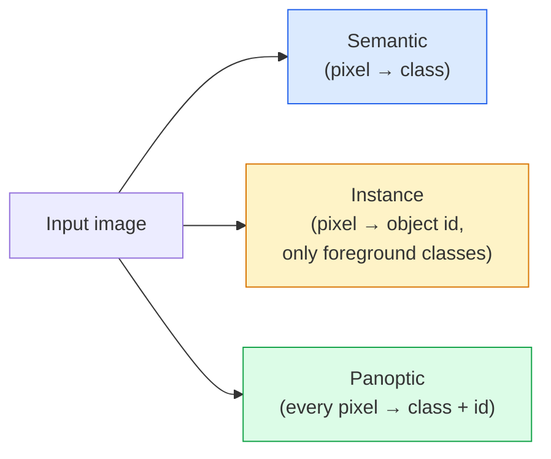
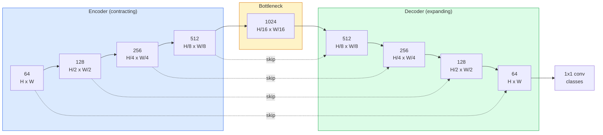

# अर्थशास्त्र खंडन  यू-नेट

> U-Net इसे एक डाउनसैम्पलिंग एन्कोडर को अपसैम्पलिंग डिकोडर के साथ जोड़े और उनके बीच के कनेक्शन को सिंक करने से काम करता है।

**Type:** Build
**Languages:** Python
**Prerequisites:** Phase 4 Lesson 03 (CNNs), Phase 4 Lesson 04 (Image Classification)
**Time:** ~75 minutes

## सीखने के लक्ष्य

- अर्थशास्त्र, उदाहरण और पैनप्टिक विभाजन में अंतर करें और किसी दिए गए समस्या के लिए सही कार्य चुनें
- PyTorch में एन्कोडर ब्लॉकों, एक बोतल गला, एक ट्रांसपोस्टेड घुमावदार के साथ एक यू-नेट को खरोंच से बनाएं, और कनेक्शन छोड़ें
- पिक्सेल-वार क्रॉस-एंट्रोपी, डैस हानि, और संयुक्त हानि को लागू करें जो चिकित्सा और औद्योगिक विभाजन के लिए वर्तमान डिफ़ॉल्ट है
- प्रत्येक वर्ग के लिए आईओयू और डायस मीट्रिक पढ़ें और निदान करें कि क्या एक खराब स्कोर छोटी वस्तुओं को याद करने, सीमा सटीकता या वर्ग असंतुलन से आता है

## समस्या

वर्गीकरण प्रति छवि एक लेबल आउटपुट करता है। पता लगाने प्रति छवि कुछ बॉक्स आउटपुट करता है। विभाजन प्रति पिक्सेल एक लेबल आउटपुट करता है। आकार के इनपुट के लिए `H x W`, आउटपुट आकार का एक tensor है `H x W`(सार्थक) या `H x W x N_instances`(उदाहरण) यह प्रति छवि लाखों भविष्यवाणियां हैं, एक नहीं।

विभाजन की संरचना इस कारण से लगभग हर घने भविष्यवाणी दृष्टि उत्पाद को संचालित करती हैः चिकित्सा इमेजिंग (ट्यूमर मास्क), स्वायत्त ड्राइविंग (सड़क, लेन, बाधा), उपग्रह (निर्माण पदचिह्न, फसल सीमाएं), दस्तावेज़ विश्लेषण (लेआउट जोन), रोबोटिक्स (पकड़ने योग्य क्षेत्र) । उन कार्यों में से कोई भी वस्तु के चारों ओर एक बॉक्स डालकर हल नहीं किया जा सकता है; उन्हें सटीक प्रतिरूप की आवश्यकता है।

वास्तुकला की समस्या को कहना आसान है और हल करना आसान नहीं हैः आपको नेटवर्क की आवश्यकता है एक छवि के वैश्विक संदर्भ को देखने के लिए (यह किस तरह का दृश्य है) और स्थानीय पिक्सेल विवरण (सही तरह से कौन सा पिक्सेल सड़क बनाम गलियारा है) एक साथ। एक मानक सीएनएन संदर्भ प्राप्त करने के लिए स्थानिक रूप से संपीड़ित करता है, जो विवरण को फेंक देता है। यू-नेट डिजाइन था जिसने दोनों को प्राप्त किया।

## अवधारणा

### अर्थिक बनाम उदाहरण बनाम पैनप्टिक



- **Semantic**यह कहता है "यह पिक्सेल सड़क है, वह पिक्सेल कार है". दो कारें एक दूसरे के बगल में एक ब्लाब में गिर जाते हैं।
- **Instance**यह कहता है "यह पिक्सेल कार # 3 है, यह पिक्सेल कार # 5 है। " पृष्ठभूमि सामग्री ("सामग्री" = आकाश, सड़क, घास) को अनदेखा करता है।
- **Panoptic**दोनों को एक करता हैः प्रत्येक पिक्सेल एक वर्ग लेबल मिलता है, प्रत्येक उदाहरण एक अद्वितीय आईडी मिलता है, सामान और सामान दोनों खंडित.

यह पाठ अर्थशास्त्र को कवर करता है। अगला पाठ (मास्क आर-सीएनएन) उदाहरण को कवर करता है।

### यू-नेट का आकार



एन्कोडर चार बार स्थानिक रिज़ॉल्यूशन को आधा करता है और चैनल को दोगुना करता है। डिकोडर उल्टा करता हैः चार बार स्थानिक रिज़ॉल्यूशन को दोगुना करता है और चैनल को आधा करता है। स्kip कनेक्शन प्रत्येक रिज़ॉल्यूशन पर डिकोडर सुविधाओं के साथ मेल खाने वाले एन्कोडर सुविधाओं को एक साथ जोड़ते हैं। अंतिम 1x1 conv मानचित्र`64 -> num_classes`पूर्ण संकल्प पर।

स्किप कनेक्शन आवश्यक क्यों हैंः डिकोडर ने पिक्सेल-स्तर की भविष्यवाणियों को आउटपुट करने का प्रयास करने तक केवल छोटे फीचर मैप्स देखे हैं। स्किप के बिना यह किनारों को सटीक रूप से स्थान नहीं दे सकता है क्योंकि उस जानकारी को एन्कोडर में संपीड़ित किया गया था। स्किप कनेक्शन उसे उच्च रिज़ॉल्यूशन फीचर मैप्स प्रदान करता है। नीचे जाने के रास्ते में गणना किए गए एन्कोडर को मैप्स।

### ट्रांसपोस्टेड बनाम द्विआधारी उप-सैंपल

डेकोडर को अंतरिक्ष आयामों का विस्तार करना है। दो विकल्पः

- **Transposed convolution**(`nn.ConvTranspose2d`)  अपरेसन योग्य नमूना. ऐतिहासिक यू-नेट डिफ़ॉल्ट। यदि चरण और नाभिक आकार समान रूप से विभाजित नहीं होते हैं तो चेकरबोर्ड कलाकृतियां उत्पन्न कर सकते हैं।
- **Bilinear upsample + 3x3 conv** एक संकुल के बाद एक चिकनी अपसैम्पल। कम कलाकृतियों, कम मापदंडों, अब आधुनिक डिफ़ॉल्ट।

दोनों ही प्राकृतिक रूप से दिखाई देते हैं. पहली यू-नेट के लिए, द्विआधारी अधिक सुरक्षित है.

### पिक्सेल ग्रिड पर क्रॉस-एंट्रोपी

सी वर्गों के साथ अर्थिक खंडन के लिए, मॉडल आउटपुट `(N, C, H, W)`. लक्ष्य है`(N, H, W)`क्रॉस-एंट्रोपी वर्गीकरण मामले के समान है, बस प्रत्येक स्थानिक स्थिति पर लागू किया जाता हैः

```
Loss = mean over (n, h, w) of -log( softmax(logits[n, :, h, w])[target[n, h, w]] )
```

`F.cross_entropy`PyTorch में इस आकार को मूल रूप से संभालता है. कोई पुनर्विकृति की आवश्यकता नहीं है.

### ड्यूस हार और आपको इसकी आवश्यकता क्यों है

क्रॉस-एंट्रोपी हर पिक्सेल को समान रूप से व्यवहार करती है। यह गलत है जब एक वर्ग फ्रेम पर हावी होता है (चिकित्सा इमेजिंगः 99% पृष्ठभूमि, 1% ट्यूमर) । नेटवर्क हर जगह पृष्ठभूमि की भविष्यवाणी करके 99% सटीकता प्राप्त कर सकता है और फिर भी बेकार हो सकता है।

डस हानि प्रत्यक्ष रूप से भविष्यवाणी और वास्तविक मुखौटा के बीच ओवरलैप को अनुकूलित करके इस हल करता हैः

```
Dice(p, y) = 2 * sum(p * y) / (sum(p) + sum(y) + epsilon)
Dice_loss = 1 - Dice
```

कहाँ`p`एक वर्ग के लिए सिग्मोइड/सॉफ्टमैक्स संभावना मानचित्र है और `y`यह द्विआधारी आधार सत्य मुखौटा है। हानि शून्य है केवल जब ओवरलैप सही है। क्योंकि यह अनुपात आधारित है, वर्ग असंतुलन irrelevant है।

अभ्यास में, **combined loss**:

```
L = L_cross_entropy + lambda * L_dice       (lambda ~ 1)
```

क्रॉस-एंट्रोपी प्रशिक्षण के शुरुआती चरण में स्थिर ग्रेडिएंट देती है; डैस प्रशिक्षण के पूंछ को वास्तव में मुखौटा के आकार से मेल खाने पर केंद्रित करता है। यह संयोजन चिकित्सा-छविकरण डिफ़ॉल्ट है और किसी भी वर्ग-असम संतुलित डेटासेट पर हराया जाना मुश्किल है।

### मूल्यांकन मेट्रिक्स

- **Pixel accuracy** प्रतिशत पिक्सल सही ढंग से भविष्यवाणी की। सस्ता. वर्गीकरण में सटीकता के समान कारण के लिए असंतुलित डेटा पर टूट गया।
- **IoU per class** प्रत्येक वर्ग के मुखौटे के लिए संघ पर चौराहे; वर्गों के बीच औसत = mIoU।
- **Dice (F1 on pixels)** आईओयू के समान; `Dice = 2 * IoU / (1 + IoU)`चिकित्सा इमेजिंग डैस को पसंद करती है, ड्राइविंग समुदाय आईओयू को पसंद करता है; वे एकतरफा रूप से संबंधित हैं।
- **Boundary F1** यह मापता है कि अनुमानित सीमाएं जमीन-सत्य सीमाओं के कितने करीब हैं, यहां तक कि छोटे बदलावों को दंडित करना।

औसत आईओयू एक वर्ग को 15% पर छिपाता है जबकि नौ अन्य 85% पर हैं।

### इनपुट रिज़ॉल्यूशन ट्रेडऑफ

यू-नेट का एन्कोडर रेज़ॉल्यूशन को चार गुना आधा करता है, इसलिए इनपुट को 16 से विभाजित किया जाना चाहिए। चिकित्सा छवियां अक्सर 512x512 या 1024x1024 होती हैं। स्वायत्त ड्राइविंग फसलें 2048x1024 होती हैं। यू-नेट के मेमोरी लागत के साथ मापें `H * W * C_max`, और 1024x1024 के साथ 1024 बोतल गला चैनल आगे पास पहले से ही VRAM के गीगाबाइट का उपयोग करता है।

दो मानक उपायः
1. टाइल इनपुट  प्रक्रिया 256x256 टाइलों के साथ ओवरलैप और सिलाई।
2. डिप्लैब परिवार (DeepLab परिवार) के साथ डिप्लोक्सन को विस्तारित घुमावों से बदलें जो स्थानिक संकल्प को अधिक बनाए रखते हैं लेकिन रिसेप्टिव फील्ड को व्यापक बनाते हैं।

पहले मॉडल के लिए, एक 256x256 इनपुट 64-चैनल-बेस यू-नेट 8 जीबी वीआरएएम पर आराम से ट्रेन करता है।

```figure
segmentation-flood
```

## इसे बनाओ

### चरण 1: एन्कोडर ब्लॉक

बैच मानदंड और ReLU के साथ दो 3x3 कन्व। पहला कन्व चैनल की संख्या बदलता है; दूसरा इसे रखता है।

```python
import torch
import torch.nn as nn
import torch.nn.functional as F

class DoubleConv(nn.Module):
    def __init__(self, in_c, out_c):
        super().__init__()
        self.net = nn.Sequential(
            nn.Conv2d(in_c, out_c, kernel_size=3, padding=1, bias=False),
            nn.BatchNorm2d(out_c),
            nn.ReLU(inplace=True),
            nn.Conv2d(out_c, out_c, kernel_size=3, padding=1, bias=False),
            nn.BatchNorm2d(out_c),
            nn.ReLU(inplace=True),
        )

    def forward(self, x):
        return self.net(x)
```

इस ब्लॉक का उपयोग पूरे समय किया जाता है।`bias=False`क्योंकि बीएन के बीटा पूर्वाग्रह को संभालता है।

### चरण 2: नीचे और ऊपर ब्लॉक

```python
class Down(nn.Module):
    def __init__(self, in_c, out_c):
        super().__init__()
        self.net = nn.Sequential(
            nn.MaxPool2d(2),
            DoubleConv(in_c, out_c),
        )

    def forward(self, x):
        return self.net(x)


class Up(nn.Module):
    def __init__(self, in_c, out_c):
        super().__init__()
        self.up = nn.Upsample(scale_factor=2, mode="bilinear", align_corners=False)
        self.conv = DoubleConv(in_c, out_c)

    def forward(self, x, skip):
        x = self.up(x)
        if x.shape[-2:] != skip.shape[-2:]:
            x = F.interpolate(x, size=skip.shape[-2:], mode="bilinear", align_corners=False)
        x = torch.cat([skip, x], dim=1)
        return self.conv(x)
```

केवल स्थानिक रूप की जांच (`shape[-2:]`) इनपुटों को संभालता है जिनकी आयामों को 16 से विभाजित नहीं किया जा सकता है; एक सुरक्षित `F.interpolate`पूर्ण आकार की तुलना करने से चैनल-कंटेंट में अंतर भी होगा, जो एक जोरदार त्रुटि होनी चाहिए, एक मौन इंटरपोलेट नहीं।

### चरण 3: यू-नेट

```python
class UNet(nn.Module):
    def __init__(self, in_channels=3, num_classes=2, base=64):
        super().__init__()
        self.inc = DoubleConv(in_channels, base)
        self.d1 = Down(base, base * 2)
        self.d2 = Down(base * 2, base * 4)
        self.d3 = Down(base * 4, base * 8)
        self.d4 = Down(base * 8, base * 16)
        self.u1 = Up(base * 16 + base * 8, base * 8)
        self.u2 = Up(base * 8 + base * 4, base * 4)
        self.u3 = Up(base * 4 + base * 2, base * 2)
        self.u4 = Up(base * 2 + base, base)
        self.outc = nn.Conv2d(base, num_classes, kernel_size=1)

    def forward(self, x):
        x1 = self.inc(x)
        x2 = self.d1(x1)
        x3 = self.d2(x2)
        x4 = self.d3(x3)
        x5 = self.d4(x4)
        x = self.u1(x5, x4)
        x = self.u2(x, x3)
        x = self.u3(x, x2)
        x = self.u4(x, x1)
        return self.outc(x)

net = UNet(in_channels=3, num_classes=2, base=32)
x = torch.randn(1, 3, 256, 256)
print(f"output: {net(x).shape}")
print(f"params: {sum(p.numel() for p in net.parameters()):,}")
```

आउटपुट आकार `(1, 2, 256, 256)` इनपुट के समान स्थानिक आकार, `num_classes`7.7M के बारे में मापदंडों पर`base=32`. .

### चरण 4: नुकसान

```python
def dice_loss(logits, targets, num_classes, eps=1e-6):
    probs = F.softmax(logits, dim=1)
    targets_one_hot = F.one_hot(targets, num_classes).permute(0, 3, 1, 2).float()
    dims = (0, 2, 3)
    intersection = (probs * targets_one_hot).sum(dim=dims)
    denom = probs.sum(dim=dims) + targets_one_hot.sum(dim=dims)
    dice = (2 * intersection + eps) / (denom + eps)
    return 1 - dice.mean()


def combined_loss(logits, targets, num_classes, lam=1.0):
    ce = F.cross_entropy(logits, targets)
    dc = dice_loss(logits, targets, num_classes)
    return ce + lam * dc, {"ce": ce.item(), "dice": dc.item()}
```

Dice प्रति वर्ग की गणना की जाती है और फिर औसत (मैक्रो Dice) ।`eps`बैच से अनुपस्थित वर्गों पर शून्य से विभाजन को रोकता है।

### चरण 5: आईओयू मीट्रिक

```python
@torch.no_grad()
def iou_per_class(logits, targets, num_classes):
    preds = logits.argmax(dim=1)
    ious = torch.zeros(num_classes)
    for c in range(num_classes):
        pred_c = (preds == c)
        true_c = (targets == c)
        inter = (pred_c & true_c).sum().float()
        union = (pred_c | true_c).sum().float()
        ious[c] = (inter / union) if union > 0 else torch.tensor(float("nan"))
    return ious
```

लंबाई C के एक वेक्टर लौटाता है। `nan`बैच में अनुपस्थित वर्गों के अंक mIoU की गणना करते समय उन वर्गों के मुकाबले औसत नहीं होते हैं।

### चरण 6: अंत-से-अंत सत्यापन के लिए सिंथेटिक डेटासेट

रंगीन पृष्ठभूमि पर आकार उत्पन्न करें ताकि नेटवर्क को आकार सीखना पड़े, पिक्सेल रंग नहीं।

```python
import numpy as np
from torch.utils.data import Dataset, DataLoader

def synthetic_segmentation(num_samples=200, size=64, seed=0):
    rng = np.random.default_rng(seed)
    images = np.zeros((num_samples, size, size, 3), dtype=np.float32)
    masks = np.zeros((num_samples, size, size), dtype=np.int64)
    for i in range(num_samples):
        bg = rng.uniform(0, 1, (3,))
        images[i] = bg
        masks[i] = 0
        num_shapes = rng.integers(1, 4)
        for _ in range(num_shapes):
            cls = int(rng.integers(1, 3))
            color = rng.uniform(0, 1, (3,))
            cx, cy = rng.integers(10, size - 10, size=2)
            r = int(rng.integers(4, 12))
            yy, xx = np.meshgrid(np.arange(size), np.arange(size), indexing="ij")
            if cls == 1:
                mask = (xx - cx) ** 2 + (yy - cy) ** 2 < r ** 2
            else:
                mask = (np.abs(xx - cx) < r) & (np.abs(yy - cy) < r)
            images[i][mask] = color
            masks[i][mask] = cls
        images[i] += rng.normal(0, 0.02, images[i].shape)
        images[i] = np.clip(images[i], 0, 1)
    return images, masks


class SegDataset(Dataset):
    def __init__(self, images, masks):
        self.images = images
        self.masks = masks

    def __len__(self):
        return len(self.images)

    def __getitem__(self, i):
        img = torch.from_numpy(self.images[i]).permute(2, 0, 1).float()
        mask = torch.from_numpy(self.masks[i]).long()
        return img, mask
```

तीन वर्गः पृष्ठभूमि (0), वृत्त (1), वर्ग (2)। नेटवर्क को आकार को अलग करना सीखना चाहिए।

### चरण 7: प्रशिक्षण लूप

```python
def train_one_epoch(model, loader, optimizer, device, num_classes):
    model.train()
    loss_sum, total = 0.0, 0
    iou_sum = torch.zeros(num_classes)
    for x, y in loader:
        x, y = x.to(device), y.to(device)
        logits = model(x)
        loss, _ = combined_loss(logits, y, num_classes)
        optimizer.zero_grad()
        loss.backward()
        optimizer.step()
        loss_sum += loss.item() * x.size(0)
        total += x.size(0)
        iou_sum += iou_per_class(logits, y, num_classes).nan_to_num(0)
    return loss_sum / total, iou_sum / len(loader)
```

इस संश्लेषणात्मक डेटासेट पर 10-30 काल के लिए चलाएं और आकार वर्गों के लिए एमआईयू 0.9 से ऊपर चढ़ते देखें।`nan_to_num(0)`बैच से अनुपस्थित वर्गों को शून्य के रूप में व्यवहार करता है; प्रत्येक वर्ग के लिए सटीक आईओयू के लिए, उपस्थिति और उपयोग द्वारा मुखौटा `torch.nanmean`मूल्यांकन समय पर बैचों के बीच औसत के बजाय यहाँ।

## इसका प्रयोग करें

उत्पादन के लिए, `segmentation_models_pytorch`("smp") किसी भी टॉर्चविजन या टिमम रीढ़ की हड्डी के साथ प्रत्येक मानक विभाजन वास्तुकला को लपेटता है। तीन पंक्तियाँः

```python
import segmentation_models_pytorch as smp

model = smp.Unet(
    encoder_name="resnet34",
    encoder_weights="imagenet",
    in_channels=3,
    classes=3,
)
```

असली काम के लिए भी जानने लायकः
- **DeepLabV3+**अधिकतम पूल आधारित डाउनसैम्पलिंग को विस्तारित कन्वर्स से बदल देता है ताकि बोतल गला को संकल्प बनाए रखा जा सके; उपग्रह और ड्राइविंग डेटा पर तेज सीमाएं।
- **SegFormer**एक पदानुक्रमिक ट्रांसफार्मर के लिए कन्वि कोडर को स्विच करता है; कई बेंचमार्क पर वर्तमान SOTA।
- **Mask2Former**/**OneFormer**एक ही वास्तुकला में अर्थिक, उदाहरण और पैनप्टिक विभाजन को एकीकृत करें।

तीनों में से सभी में बदलते हैं।`smp`या `transformers`एक ही डेटा लोडर के साथ।

## इसे भेजें

इस पाठ से उत्पन्न होता हैः

- `outputs/prompt-segmentation-task-picker.md` एक प्रॉम्प्ट जो अर्थिक, इंस्टेंस और पैनप्टिक सेगमेंट के बीच चुनता है और किसी दिए गए कार्य के लिए वास्तुकला का नाम देता है।
- `outputs/skill-segmentation-mask-inspector.md` एक कौशल जो कक्षा वितरण, भविष्यवाणी-मास्क आंकड़ों और उन कक्षाओं की रिपोर्ट करता है जो कम भविष्यवाणी या सीमा-अवशिष्ट हैं।

## व्यायाम

1. **(Easy)**कार्यान्वयन`bce_dice_loss`द्विआधारी विभाजन कार्य के लिए (फ्राग्राउंड बनाम पृष्ठभूमि) सिंथेटिक दो-वर्ग डेटासेट पर सत्यापित करें कि संयुक्त हानि केवल BCE की तुलना में तेजी से अभिसरण करती है जब अग्रभूमि पिक्सल का 5% है।
2. **(Medium)** को प्रतिस्थापित करें`nn.Upsample + conv`एक के साथ अप-ब्लॉक`nn.ConvTranspose2d`अप-ब्लाक. सिंथेटिक डेटासेट पर दोनों को प्रशिक्षित करें और mIoU की तुलना करें. ध्यान दें कि ट्रांसपोस्ड-कन्व संस्करण में शतरंज बोर्ड कलाकृतियों का स्थान कहां दिखाई देता है।
3. **(Hard)**एक वास्तविक खंडन डेटासेट (ऑक्सफोर्ड-IIIT पालतू जानवरों, सिटीस्केप्स मिनी स्प्लिट, या एक चिकित्सा उपसमूह) ले लो और यू-नेट को प्रशिक्षण के भीतर 2 IoU बिंदुओं के लिए प्रशिक्षित करें `smp.Unet`प्रति वर्ग आईओयू रिपोर्ट करें और यह निर्धारित करें कि किस वर्ग को नुकसान में डैस जोड़ने से सबसे अधिक लाभ होता है।

## प्रमुख शर्तें

| Term | What people say | What it actually means |
|------|----------------|----------------------|
| Semantic segmentation | "Label every pixel" | Per-pixel classification into C classes; instances of the same class merge |
| Instance segmentation | "Label every object" | Separates distinct instances of the same class; foreground-only |
| Panoptic segmentation | "Semantic + instance" | Every pixel gets a class; every thing instance also gets a unique id |
| Skip connection | "U-Net bridge" | Concatenation of encoder features into matching-resolution decoder features; preserves high-frequency detail |
| Transposed conv | "Deconvolution" | Learnable upsampling; can produce checkerboard artifacts |
| Dice loss | "Overlap loss" | 1 - 2|A ∩ B| / (|A| + |B|); optimises mask overlap directly and is robust to class imbalance |
| mIoU | "Mean intersection over union" | Average IoU across classes; the community-standard metric for segmentation |
| Boundary F1 | "Boundary accuracy" | F1 score computed on boundary pixels only; matters for precision-critical tasks |

## आगे पढ़ना

- [U-Net: Convolutional Networks for Biomedical Image Segmentation (Ronneberger et al., 2015)](https://arxiv.org/abs/1505.04597) मूल कागज; प्रत्येक व्यक्ति का प्रतिलिपि बनाने का आंकड़ा पृष्ठ 2 पर है
- [Fully Convolutional Networks (Long et al., 2015)](https://arxiv.org/abs/1411.4038) पेपर जो पहली बार विभाजन को एक अंत-से-अंत कन्वि समस्या बना दिया
- [segmentation_models_pytorch](https://github.com/qubvel/segmentation_models.pytorch) उत्पादन खंडन के लिए संदर्भ; प्रत्येक मानक वास्तुकला प्लस प्रत्येक मानक हानि
- [Lessons learned from training SOTA segmentation (kaggle.com competitions)](https://www.kaggle.com/code/iafoss/carvana-unet-pytorch) एक walkthrough क्यों TTA, छद्म लेबलिंग, और वर्ग वजन वास्तविक डेटा पर मायने रखते हैं
