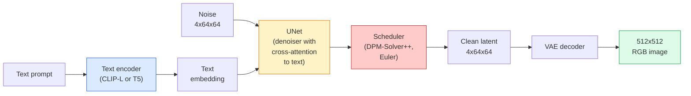

# स्थिर विसारण  वास्तुकला और ठीक-ठीक समायोजन

> स्थिर विसारण एक डीडीपीएम है जो पूर्व-प्रशिक्षित वीएई के लटेंट स्थान में चलता है, क्रॉस-अटेंशन के माध्यम से पाठ पर कंडीशनिंग, एक तेज़ निर्धारात्मक ओडीई सॉल्वर के साथ नमूने, और वर्गीकरणकर्ता मुक्त मार्गदर्शन द्वारा निर्देशित है।

**Type:** Learn + Use
**Languages:** Python
**Prerequisites:** Phase 4 Lesson 10 (Diffusion), Phase 7 Lesson 02 (Self-Attention)
**Time:** ~75 minutes

## सीखने के लक्ष्य

- एक स्थिर विसार पाइपलाइन के पांच टुकड़ों का पता लगाएंः VAE, पाठ एन्कोडर, यू-नेट, शेड्यूलर, सुरक्षा जांचकर्ता  और उनमें से प्रत्येक वास्तव में क्या करता है
- लटेंट विसारण और 4x64x64 लटेंट स्थान (3x512x512 छवि के बजाय) में प्रशिक्षण से गुणवत्ता हानि के बिना गणना 48 गुना कम क्यों होती है, इसकी व्याख्या करें
- उपयोग करें`diffusers`चित्र उत्पन्न करने, छवि-टू-छवि चलाने, इनपेंटिंग और कंट्रोलनेट-गियॉड जनरेशन के लिए
- एक छोटे से कस्टम डेटासेट पर LoRA के साथ स्थिर विसारण को ठीक-ठीक करें और निष्कर्ष पर LoRA एडाप्टर लोड करें

## समस्या

512x512 आरजीबी छवियों पर सीधे डीडीपीएम को प्रशिक्षित करना महंगा है। प्रत्येक प्रशिक्षण चरण एक यू-नेट के माध्यम से वापस जाता है जो 3x512x512 = 786,432 इनपुट मान देखता है, और नमूनाकरण उसी यू-नेट के माध्यम से 50+ आगे गुजरता है। स्थिर विसार 1.5 (रिलीज़ 2022) के गुणवत्ता स्तर पर, पिक्सेल-स्थान विसार को लगभग 256 GPU-महीने के प्रशिक्षण और उपभोक्ता GPU पर प्रति छवि 10-30 सेकंड की आवश्यकता होगी।

एक ट्रिक जो ओपन वेट टेक्स्ट-टू-इमेज को व्यावहारिक बना दिया था**latent diffusion**(Rombach et al., CVPR 2022). एक VAE को प्रशिक्षित करें जो 3x512x512 छवि को 4x64x64 लटेंट टेंसर और पीछे के लिए मैप करता है, फिर उस लटेंट स्थान में विसारण करें। गणना घटती है `(3*512*512)/(4*64*64) = 48x`. एक ही GPU पर नमूनाकरण दशकों से सेकंड से दो सेकंड से कम हो जाता है.

लगभग हर आधुनिक छवि-उत्पादन मॉडल  SDXL, SD3, FLUX, HunyuanDiT, Wan-Video  एक लटके हुए विसारण मॉडल है जिसमें ऑटोकोडर, डेनोइज़र (U-Net या DiT) और पाठ कंडीशनिंग में बदलाव हैं। स्थिर विसारण सीखें और आपने टेम्पलेट सीखा है।

## अवधारणा

### पाइपलाइन



- **VAE** ठंढ ऑटोकोडर. एन्कोडर छवि को लटेंट्स में बदल देता है (img2img और प्रशिक्षण के लिए उपयोग किया जाता है) । डिकोडर लटेंट्स को छवि में वापस बदल देता है।
- **Text encoder** CLIP पाठ एन्कोडर (SD 1.x/2.x), CLIP-L + CLIP-G (SDXL), या T5-XXL (SD3/FLUX) । टोकन एम्बेडमेंट का एक अनुक्रम उत्पन्न करता है।
- **U-Net** डेनोइज़र. इसमें क्रॉस-एटेंशन लेयर हैं जो हर रिज़ॉल्यूशन लेवल पर एम्बेडेड टेक्स्ट के लिए लटेंट से आते हैं।
- **Scheduler** नमूना लेने एल्गोरिथ्म (DDIM, Euler, DPM-Solver++) । सिग्मा चुनता है, लटेंट में पूर्वानुमानित शोर को वापस मिलाता है।
- **Safety checker** आउटपुट छवि पर वैकल्पिक NSFW / अवैध सामग्री फ़िल्टर।

### वर्गीकरण मुक्त मार्गदर्शन (CFG)

सादा पाठ कंडीशनिंग सीखता है `epsilon_theta(x_t, t, c)`हर संकेत के लिए `c`. CFG उसी नेटवर्क को ट्रेन करता है `c`10% समय में गिरावट (एक खाली एम्बेडिंग द्वारा प्रतिस्थापित) दी गई, एक एकल मॉडल जो सशर्त और अवशर्त शोर दोनों की भविष्यवाणी करता है। निष्कर्ष परः

```
eps = eps_uncond + w * (eps_cond - eps_uncond)
```

`w`यह मार्गदर्शन पैमाने है। `w=0`बिना शर्त है,`w=1`स्पष्ट रूप से सशर्त है,`w>1`विविधता की कीमत पर आउटपुट को "प्रॉम्प्ट पर अधिक संचालित" की ओर धकेलता है।`w=7.5`. .

CFG का कारण है कि पाठ-से-छवि उत्पादन की गुणवत्ता पर काम करता है। इसके बिना, आउटपुट को कमजोर रूप से पूर्वाग्रह देता है; इसके साथ, प्रॉम्प्ट हावी होते हैं।

### लटेंट स्पेस ज्यामिति

वीएई का 4-चैनल लटेंट सिर्फ एक संपीड़ित छवि नहीं है। यह एक बहुविध है जहां अंकगणित लगभग अर्थिक संपादन से मेल खाता है (प्रोम्प्ट इंजीनियरिंग + इंटरपोलेशन दोनों यहां रहते हैं), और जहां प्रसार यू-नेट को अपने पूरे मॉडलिंग बजट को खर्च करने के लिए प्रशिक्षित किया गया है। एक यादृच्छिक 4x64x64 लटेंट को डिकोड करने से एक यादृच्छिक दिखने वाली छवि नहीं होती है  यह कचरा पैदा करती है, क्योंकि केवल लटेंट्स का एक विशिष्ट उप-विविधता वैध छवियों को डिकोड करती है।

दो परिणाम:

1. **Img2img**= छवि को लटेंट में एन्कोड करें, आंशिक शोर जोड़ें, डेनोइज़र चलाएं, डिकोड करें। छवि संरचना जीवित रहती है क्योंकि एन्कोडिंग लगभग उलटनीय है; प्रॉम्प्ट के आधार पर सामग्री बदलती है।
2. **Inpainting**= img2img के समान लेकिन denoiser केवल छिपे हुए क्षेत्रों को अपडेट करता है; अनमास्केड क्षेत्रों को एन्कोडेड लटेंट पर रखा जाता है।

### यू-नेट वास्तुकला

एसडी यू-नेट टिनीयूनेट का एक बड़ा संस्करण है जो तीन जोड़ों के साथ पाठ 10 से आता हैः

- **Transformer blocks**प्रत्येक स्थानिक संकल्प पर, स्वयं-विचार + पाठ एम्बेडिंग पर पार-विचार शामिल है।
- **Time embedding**सिनोसाइडल एन्कोडिंग पर एमएलपी के माध्यम से।
- **Skip connections**एक संगत संकल्प पर एन्कोडर और डिकोडर के बीच।

एसडी 1.5 में कुल मापदंडः ~ 860M। एसडीएक्सएलः ~ 2.6B। फ्लोक्सः ~ 12B। पैरामेड्स में कूद ज्यादातर ध्यान परतों में होता है।

### लोरा सूक्ष्म समायोजन

स्थिर विसारण के पूर्ण ठीक-ठाक के लिए 20+ जीबी वीआरएएम की आवश्यकता होती है और 860 एम पैरामीटर अपडेट होते हैं। लोरा (लो-रैंक एडाप्टेशन) बेस मॉडल को जमे रखता है और ध्यान परतों में छोटे रैंक-विघटन मैट्रिक्स का इंजेक्शन देता है। एसडी के लिए एक लोरा एडाप्टर आमतौर पर 10-50 एमबी होता है, एक एकल उपभोक्ता जीपीयू पर 10-60 मिनट में ट्रेन करता है, और एक ड्रॉप-इन संशोधन के रूप में निष्कर्ष समय पर लोड होता है।

```
Original: W_q : (d_in, d_out)   frozen
LoRA:     W_q + alpha * (A @ B)   where A : (d_in, r), B : (r, d_out)

r is typically 4-32.
```

लोरा लगभग हर समुदाय के ठीक-ठीक ट्यून वितरित किया जाता है CivitAI और गले लगाने के चेहरे में लाखों लोगों की मेजबानी है।

### कार्यक्रम आप देखेंगे

- **DDIM** निर्धारक, ~50 कदम, सरल।
- **Euler ancestral** स्टोकास्टिक, 30-50 कदम, थोड़ा अधिक रचनात्मक नमूने।
- **DPM-Solver++ 2M Karras** निर्धारक, 20-30 कदम, उत्पादन डिफ़ॉल्ट।
- **LCM / TCD / Turbo** स्थिरता मॉडल और डिस्टिल किए गए वेरिएंट; कुछ गुणवत्ता की कीमत पर 1-4 कदम।

शेड्यूलर्स के आदान-प्रदान में एक पंक्ति का बदलाव होता है `diffusers`और कभी कभी किसी भी पुनर्व्यवस्था के बिना नमूना समस्याओं को ठीक करता है।

```figure
cv3-latent-compression
```

## इसे बनाओ

इस पाठ में उपयोग किया जाता है`diffusers`अंत से अंत तक स्थिर विसारण को खरोंच से पुनर्निर्माण करने के बजाय। आपको पुनर्निर्माण करने की आवश्यकता होगी (VAE, पाठ एन्कोडर, यू-नेट, शेड्यूलर) अपने स्वयं के पाठ के विषय हैं; यहां लक्ष्य उत्पादन एपीआई के साथ धाराप्रवाहता है।

### चरण 1: पाठ से छवि

```python
import torch
from diffusers import StableDiffusionPipeline

pipe = StableDiffusionPipeline.from_pretrained(
    "runwayml/stable-diffusion-v1-5",
    torch_dtype=torch.float16,
).to("cuda")

image = pipe(
    prompt="a dog riding a skateboard in tokyo, studio ghibli style",
    guidance_scale=7.5,
    num_inference_steps=25,
    generator=torch.Generator("cuda").manual_seed(42),
).images[0]
image.save("dog.png")
```

`float16`बिना गुणवत्ता के नुकसान के VRAM को आधा कर देता है। `num_inference_steps=25`डीपीएम-सोलवर++ डिफ़ॉल्ट मैच के साथ `num_inference_steps=50`डीडीआईएम के साथ।

### चरण 2: शेड्यूलर को बदलें

```python
from diffusers import DPMSolverMultistepScheduler, EulerAncestralDiscreteScheduler

pipe.scheduler = DPMSolverMultistepScheduler.from_config(pipe.scheduler.config)
pipe.scheduler = EulerAncestralDiscreteScheduler.from_config(pipe.scheduler.config)
```

अनुसूचक राज्य U-नेट वजन से अलग है. आप DDPM पर प्रशिक्षण और किसी भी अनुसूचक के साथ नमूना कर सकते हैं.

### चरण 3: छवि-प्रति छवि

```python
from diffusers import StableDiffusionImg2ImgPipeline
from PIL import Image

img2img = StableDiffusionImg2ImgPipeline.from_pretrained(
    "runwayml/stable-diffusion-v1-5",
    torch_dtype=torch.float16,
).to("cuda")

init_image = Image.open("dog.png").convert("RGB").resize((512, 512))
out = img2img(
    prompt="a dog riding a skateboard, oil painting",
    image=init_image,
    strength=0.6,
    guidance_scale=7.5,
).images[0]
```

`strength`यह है कि डीनोइज़िंग से पहले कितना शोर जोड़ना है (0.0 = अपरिवर्तित, 1.0 = पूर्ण पुनर्जनन) ।

### चरण 4: पेंटिंग

```python
from diffusers import StableDiffusionInpaintPipeline

inpaint = StableDiffusionInpaintPipeline.from_pretrained(
    "runwayml/stable-diffusion-inpainting",
    torch_dtype=torch.float16,
).to("cuda")

image = Image.open("dog.png").convert("RGB").resize((512, 512))
mask = Image.open("dog_mask.png").convert("L").resize((512, 512))

out = inpaint(
    prompt="a cat",
    image=image,
    mask_image=mask,
    guidance_scale=7.5,
).images[0]
```

मास्क में सफेद पिक्सल पुनर्जनन के लिए क्षेत्र हैं. काले पिक्सल संरक्षित हैं.

### चरण 5: लोरा लोडिंग

```python
pipe.load_lora_weights("sayakpaul/sd-lora-ghibli")
pipe.fuse_lora(lora_scale=0.8)

image = pipe(prompt="a village square in ghibli style").images[0]
```

`lora_scale`नियंत्रण बल; 0.0 = कोई प्रभाव नहीं, 1.0 = पूर्ण प्रभाव। `fuse_lora`गति के लिए समायोजित वजन में एडाप्टर को बेक करता है, लेकिन स्विचिंग को रोकता है।`pipe.unfuse_lora()`एक अलग एडाप्टर लोड करने से पहले।

### चरण 6: लोरा प्रशिक्षण (स्केच)

वास्तविक लोरा प्रशिक्षण जीवन में `peft`या `diffusers.training`. . . . . . . . . . . . . . . . . . . . . . . . . . . . . . . . . . . . . . . . . . . . . . . . . . . . . . . . . . . . . . . . . . . . . . . . . . . . . . . . . . . . . . . . . . . . . . . . . . . . . . . . . . . . . . . . . . . . . . . . . . . . . . . . . . . . . . . . . . . . . . . . . . . . . . . . . . . . . . . . . . . . . . . . . . . . . . . . . . . . . . . . . . . . . . . . . . . . . . . . . . . . . . . . . . . . . . . . . . . . . . . . . . . . . . . . . . . . . . . . . . . . . . . . . . . . . . . . . . . . . . . . . . . . . . . . . . . . . . . . . . . . . . . . . . . . . . . . . . . . . . . . . . . . . . . . . . . . . . . . . . . . . . . . . . . . . . . . . . . . . . . . . . . . . . . . . . . . . . . . . . . . . . . . . . . . . . . . . . . . . . . . . . . . . . . . . . . . . . . . . . . . . . . . . . . . . . . . . . . . . . . . . . . . . . . . . . . . . . . . . . . . . . . . . . . . . . . . . . . . . . . . . . . . . . . . . . . . . . . . . . . . . . . . . . . . . . . . . . . . . . . . . . . . . .

```python
# Pseudocode
for step, batch in enumerate(dataloader):
    images, prompts = batch
    latents = vae.encode(images).latent_dist.sample() * 0.18215

    t = torch.randint(0, num_train_timesteps, (batch_size,))
    noise = torch.randn_like(latents)
    noisy_latents = scheduler.add_noise(latents, noise, t)

    text_emb = text_encoder(tokenizer(prompts))

    pred_noise = unet(noisy_latents, t, text_emb)  # LoRA weights injected here

    loss = F.mse_loss(pred_noise, noise)
    loss.backward()
    optimizer.step()
```

केवल लोरा मैट्रिक्स ग्रेडिएंट प्राप्त करते हैं; आधार यू-नेट, वीएई और टेक्स्ट एन्कोडर जमे हुए हैं। बैच आकार 1 और ग्रेडिएंट चेकपॉइंटिंग के साथ यह 8 जीबी वीआरएएम में फिट बैठता है।

## इसका प्रयोग करें

उत्पादन में, आप वास्तव में जो निर्णय लेते हैंः

- **Model family**: ओपन सोर्स कम्युनिटी फाइन-ट्यून्स के लिए SD 1.5, उच्च निष्ठा के लिए SDXL, अत्याधुनिक और सख्त लाइसेंसिंग आवश्यकताओं के लिए SD3 / FLUX।
- **Scheduler**: डीपीएम-सोलवर++ 2 एम कार्रास 20-30 चरणों के लिए, एलसीएम-लोरा जब विलंबता 1 से कम है।
- **Precision**`float16`4080/4090 पर, `bfloat16`A100 और बाद में पर, `int8`(मार्फत `bitsandbytes`या `compel`) जब वीआरएएम तंग हो।
- **Conditioning**: सादा पाठ कार्य करता है; मजबूत नियंत्रण के लिए, आधार पाइपलाइन के ऊपर नियंत्रणनेट (कैन, गहराई, मुद्रा) जोड़ें।

बैच पीढ़ी के लिए, `AUTO1111`/`ComfyUI`सामुदायिक उपकरण हैं; उत्पादन एपीआई के लिए, `diffusers`+ `accelerate`या `optimum-nvidia`TensorRT संकलन के साथ।

## इसे भेजें

इस पाठ से उत्पन्न होता हैः

- `outputs/prompt-sd-pipeline-planner.md` एक प्रॉम्प्ट जो एक लटेंसी बजट, निष्ठा लक्ष्य और लाइसेंसिंग प्रतिबंध के कारण SD 1.5 / SDXL / SD3 / FLUX प्लस शेड्यूलर और सटीकता का चयन करता है।
- `outputs/skill-lora-training-setup.md` एक कौशल जो एक कस्टम डेटासेट के लिए एक पूर्ण लोरा प्रशिक्षण कॉन्फ़िग लिखता है जिसमें कैप्शन, रैंक, बैच आकार और सीखने की दर शामिल है।

## व्यायाम

1. **(Easy)** के साथ एक ही संकेत उत्पन्न करें`guidance_scale`में `[1, 3, 5, 7.5, 10, 15]`. चित्र कैसे बदलता है, इसका वर्णन करें. कलाकृतियों का मार्गदर्शन मूल्य क्या है?
2. **(Medium)**किसी भी असली तस्वीर ले लो, इसे पार करो `StableDiffusionImg2ImgPipeline`पर`strength`में `[0.2, 0.4, 0.6, 0.8, 1.0]`. . किस ताकत शैली बदलते हुए रचना को संरक्षित करता है? 1.0 पूरी तरह से इनपुट को अनदेखा क्यों करता है?
3. **(Hard)**एक ही विषय (एक पालतू जानवर, एक लोगो, एक चरित्र) की 10-20 छवियों पर एक लोरा को प्रशिक्षित करें और उन विषयों के साथ नए दृश्य उत्पन्न करें। इनपुट छवियों के साथ ओवरफिट किए बिना सर्वोत्तम पहचान संरक्षण का उत्पादन करने वाले लोरा रैंक और प्रशिक्षण चरणों की रिपोर्ट करें।

## प्रमुख शर्तें

| Term | What people say | What it actually means |
|------|----------------|----------------------|
| Latent diffusion | "Diffuse in latents" | Run the entire DDPM in the VAE latent space (4x64x64) instead of pixel space (3x512x512); 48x compute saving |
| VAE scale factor | "0.18215" | Constant that rescales the VAE's raw latent to roughly unit variance; hardcoded in every SD pipeline |
| Classifier-free guidance | "CFG" | Mix conditional and unconditional noise predictions; the single most impactful inference knob |
| Scheduler | "Sampler" | The algorithm that turns noise + model predictions into a denoised latent trajectory |
| LoRA | "Low-rank adapter" | Small rank-decomposition matrices that fine-tune attention layers without touching base weights |
| Cross-attention | "Text-image attention" | Attention from latent tokens to text tokens; injects prompt information at every U-Net level |
| ControlNet | "Structure conditioning" | A separately-trained adapter that steers SD with an extra input (canny, depth, pose, segmentation) |
| DPM-Solver++ | "The default scheduler" | Second-order deterministic ODE solver; best quality at low step counts (20-30) in 2026 |

## आगे पढ़ना

- [High-Resolution Image Synthesis with Latent Diffusion (Rombach et al., 2022)](https://arxiv.org/abs/2112.10752) स्थिर विसारक कागज; जिसमें प्रत्येक अपघटन शामिल है जो डिजाइन को उचित ठहराती है
- [Classifier-Free Diffusion Guidance (Ho & Salimans, 2022)](https://arxiv.org/abs/2207.12598) CFG पेपर
- [LoRA: Low-Rank Adaptation of Large Language Models (Hu et al., 2021)](https://arxiv.org/abs/2106.09685) लोरा एनएलपी-पहला था; यह लगभग कोई परिवर्तन के बिना एसडी में स्थानांतरित हो गया
- [diffusers documentation](https://huggingface.co/docs/diffusers) प्रत्येक एसडी/एसडीएक्सएल/एसडी3/एफएलयूएक्स पाइपलाइन के लिए संदर्भ
