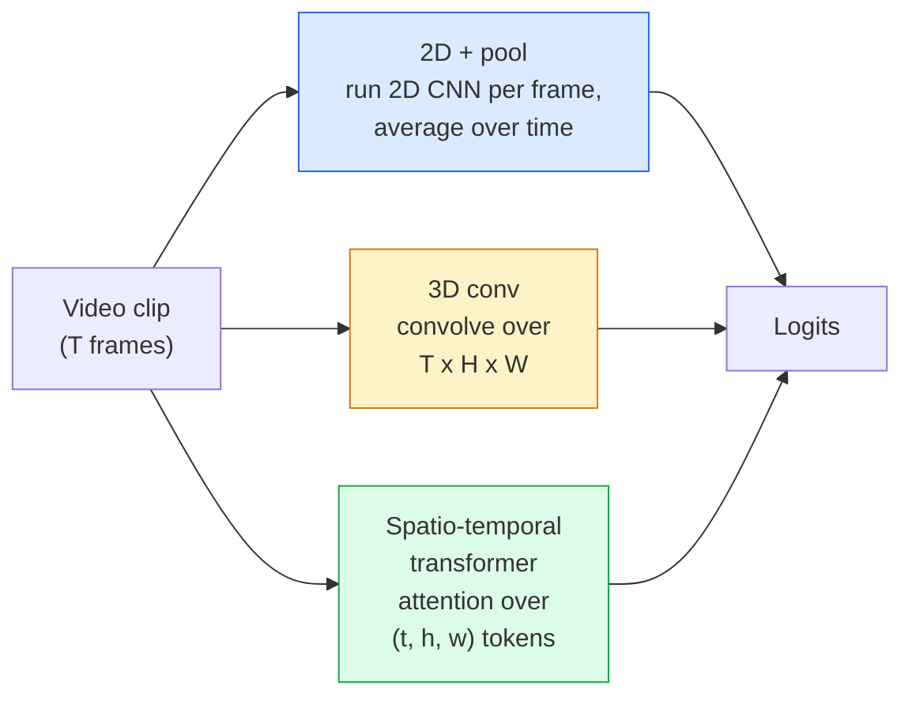

# वीडियो समझ  अस्थायी मॉडलिंग

> एक वीडियो छवियों का एक अनुक्रम है और उन्हें जोड़ने वाले भौतिकी। प्रत्येक वीडियो मॉडल या तो एक अतिरिक्त अक्ष (3D conv), एक अनुक्रम (ट्रांसफॉर्मर) के रूप में समय का इलाज करता है, या एक बार निकालने और पूल (2D + पूल) की सुविधा।

**Type:** Learn + Build
**Languages:** Python
**Prerequisites:** Phase 4 Lesson 03 (CNNs), Phase 4 Lesson 04 (Image Classification)
**Time:** ~45 minutes

## सीखने के लक्ष्य

- तीन मुख्य वीडियो मॉडलिंग दृष्टिकोणों (2D+pool, 3D conv, spatio-temporal transformer) को अलग करना और उनकी लागत और सटीकता के व्यापार-बदलों की भविष्यवाणी करना
- PyTorch में फ्रेम नमूनाकरण, समय पूलिंग और 2D+पूल बेसलाइन वर्गीकरण को लागू करें
- समझाएं कि I3D के "उल्झाए गए" 3D कर्नेल ImageNet वजन से अच्छी तरह से स्थानांतरित क्यों होते हैं और एक कारक (2+1)D conv अलग-अलग क्या करता है
- मानक क्रिया-पहचान डेटासेट और माप पढ़ेंः Kinetics-400/600, UCF101, Something-Something V2; क्लिप और वीडियो स्तर पर शीर्ष-1 सटीकता

## समस्या

30 सेकंड का वीडियो 30 fps पर 900 छवियों का होता है। भोले तौर पर, वीडियो वर्गीकरण 900 बार चलाए गए छवि वर्गीकरण है जिसके बाद किसी तरह का एकत्रीकरण होता है। यह तब काम करता है जब कार्रवाई लगभग हर फ्रेम में दिखाई देती है (खेल, खाना पकाने, व्यायाम वीडियो) और बुरी तरह विफल रहता है जब कार्रवाई को गति द्वारा परिभाषित किया जाता हैः "बाएं से दाएं कुछ धक्का देना" प्रत्येक फ्रेम में दो स्थिर वस्तुओं की तरह दिखता है।

प्रत्येक वीडियो आर्किटेक्चर के लिए मुख्य प्रश्न यह हैः समय संरचना का मॉडल कब और कैसे किया जाता है? उत्तर बाकी सब कुछ चलाता है  गणना लागत, पूर्व प्रशिक्षण रणनीति, क्या आप ImageNet वजन का पुनः उपयोग कर सकते हैं, मॉडल किस डेटासेट पर प्रशिक्षण देता है।

यह पाठ स्थैतिक छवि पाठों की तुलना में जानबूझकर छोटा है। मूल छवि मशीनरी पहले से ही जगह पर है, और वीडियो समझ ज्यादातर समय की कहानी के बारे में हैः नमूनाकरण, मॉडलिंग और संश्लेषण।

## अवधारणा

### तीन वास्तु परिवार



### 2 डी + पूल

2D सीएनएन (रेसनेट, इफ़ेसिफ़ेंटनेट, वीआईटी) ले लो। इसे प्रत्येक नमूने वाले फ्रेम पर स्वतंत्र रूप से चलाएं। प्रति फ्रेम एम्बेडिंग का औसत (या अधिकतम पूल, या ध्यान पूल) करें। pooled वेक्टर को एक वर्गीकरणकर्ता में फ़ीड करें।

लाभ:
- ImageNet पूर्व प्रशिक्षण स्थानांतरण सीधे.
- लागू करने के लिए सबसे सरल।
- सस्ताः टी फ्रेम * एकल छवि निष्कर्ष लागत।

विपक्ष:
- गति का मॉडल नहीं बना सकता। क्रिया = उपस्थिति का योग।
- समय-समय पर पूलिंग क्रम-विवर्तनशील है; "खुले दरवाजे" और "बंद दरवाजे" एक ही दिखते हैं।

उपयोग करने का समयः उपस्थिति-भारी कार्य, छोटे वीडियो डेटासेट पर स्थानांतरण सीखने, प्रारंभिक आधार रेखाएं।

### 3D घुमाव

2D (H, W) केर्नेल को 3D (T, H, W) केर्नेल से बदल दें। नेटवर्क अंतरिक्ष और समय दोनों में घुलमिलता है। प्रारंभिक परिवारः C3D, I3D, SlowFast।

I3D ट्रिकः एक पूर्व-प्रशिक्षित 2D इमेजनेट मॉडल लें, इसे एक नई समय अक्ष के साथ कॉपी करके प्रत्येक 2D कर्नेल को "फूंक दें। एक 3x3 2D conv एक 3x3x3 3D conv बन जाता है। यह 3D मॉडल को खरोंच से प्रशिक्षण के बजाय मजबूत पूर्व-प्रशिक्षित वजन देता है।

लाभ:
- सीधे गति मॉडल।
- I3D मुद्रास्फीति मुफ्त हस्तांतरण सीखने देता है।

विपक्ष:
- T/8 2D समकक्ष की तुलना में अधिक FLOPs (3 बार ढेर किए गए 3 के लिए समय के कर्नेल) ।
- समय के कर्नेल छोटे होते हैं; लंबी दूरी की गति के लिए पिरामिड या दोहरी धारा के दृष्टिकोण की आवश्यकता होती है।

उपयोग करने का समयः क्रिया पहचान जहां गति संकेत है (कुछ-कुछ V2, गति-भारी वर्गों के साथ गति विज्ञान) ।

### स्थान-समय ट्रांसफार्मर

वीडियो को समय-अंतरिक्ष पैचों के ग्रिड में चिह्नित करें और उन सभी पर ध्यान दें।

ध्यान देने के पैटर्न जो मायने रखते हैंः
- **Joint** एक बड़ा ध्यान (t, h, w) पर।`T*H*W`महंगी।
- **Divided** प्रति ब्लॉक दो ध्यानः एक समय पर, एक अंतरिक्ष पर। रैखिक-शैलिंग।
- **Factorised** समय ध्यान ब्लॉक के पार अंतरिक्ष ध्यान के साथ बदलता है।

लाभ:
- प्रत्येक प्रमुख बेंचमार्क पर SOTA सटीकता।
- पैच मुद्रास्फीति के माध्यम से छवि ट्रांसफार्मर (ViT) से स्थानांतरण।
- दुर्लभ ध्यान के माध्यम से लंबे संदर्भ वीडियो का समर्थन करता है।

विपक्ष:
- कंप्यूटर से भूखे।
- सावधानीपूर्वक ध्यान पैटर्न या रनटाइम बेलन चुनने की आवश्यकता होती है।

उपयोग करने का समयः बड़े डेटासेट, उच्च निष्ठा वीडियो समझ, बहु-मोडल वीडियो + पाठ कार्य।

### फ्रेम नमूनाकरण

30 फ़ीप/पीएस पर 10 सेकंड की क्लिप 300 फ़्रेम है; किसी भी मॉडल को सभी 300 फ़ीड करना व्यर्थ है। मानक रणनीतियाँः

- **Uniform sampling** क्लिप के पार T फ्रेम समान रूप से चुनें। 2D + पूल के लिए डिफ़ॉल्ट।
- **Dense sampling** यादृच्छिक संबद्ध टी-फ्रेम खिड़की। 3 डी कन्वर्स के लिए आम है क्योंकि आंदोलन को पड़ोसी फ्रेम की आवश्यकता होती है।
- **Multi-clip** एक ही वीडियो से कई टी-फ्रेम खिड़कियों का नमूना लें, प्रत्येक को वर्गीकृत करें, परीक्षण समय पर औसत भविष्यवाणियां।

T आमतौर पर 8, 16, 32 या 64 होता है। उच्च T = अधिक समय संकेत अधिक गणना पर।

### मूल्यांकन

दो स्तर:
- **Clip-level accuracy** मॉडल एक टी-फ्रेम क्लिप देखता है, रिपोर्ट शीर्ष-के.
- **Video-level accuracy** प्रति वीडियो कई क्लिप पर औसत क्लिप स्तर की भविष्यवाणी; उच्च और अधिक स्थिर।

हमेशा दोनों रिपोर्ट करें। एक मॉडल जो 78% क्लिप / 82% वीडियो स्कोर करता है, वह परीक्षण समय औसत पर बहुत अधिक निर्भर करता है; एक मॉडल जो 80% / 81% स्कोर करता है, वह प्रति क्लिप अधिक मजबूत है।

### डेटासेट आप मिल जाएगा

- **Kinetics-400 / 600 / 700** सामान्य प्रयोजन के एक्शन डेटासेट. 400k क्लिप; यूट्यूब URL (अब कई मृत) ।
- **Something-Something V2** गति से परिभाषित क्रियाएं ("X को बाएं से दाएं ले जाना") 2D+pool द्वारा हल नहीं किया जा सकता है।
- **UCF-101**,**HMDB-51** वृद्ध, छोटे, अभी भी रिपोर्ट किए गए।
- **AVA** अंतरिक्ष और समय में स्थानिकरण; वर्गीकरण से कठिन।

```figure
v4-video-temporal
```

## इसे बनाओ

### चरण 1: फ्रेम नमूना

एक समान और घने नमूना जो फ्रेम (या वीडियो टेंसर) की सूची पर काम करते हैं।

```python
import numpy as np

def sample_uniform(num_frames_total, T):
    if num_frames_total <= T:
        return list(range(num_frames_total)) + [num_frames_total - 1] * (T - num_frames_total)
    step = num_frames_total / T
    return [int(i * step) for i in range(T)]


def sample_dense(num_frames_total, T, rng=None):
    rng = rng or np.random.default_rng()
    if num_frames_total <= T:
        return list(range(num_frames_total)) + [num_frames_total - 1] * (T - num_frames_total)
    start = int(rng.integers(0, num_frames_total - T + 1))
    return list(range(start, start + T))
```

दोनों वापस आ जाते हैं`T`सूचकांक जो आप वीडियो टेन्सर का स्लाइस करने के लिए उपयोग करते हैं।

### चरण 2: 2D + पूल बेसलाइन

प्रत्येक फ्रेम पर 2D ResNet-18 चलाएं, औसत पूल सुविधाओं, वर्गीकृत करें।

```python
import torch
import torch.nn as nn
from torchvision.models import resnet18, ResNet18_Weights

class FramePool(nn.Module):
    def __init__(self, num_classes=400, pretrained=True):
        super().__init__()
        weights = ResNet18_Weights.IMAGENET1K_V1 if pretrained else None
        backbone = resnet18(weights=weights)
        self.features = nn.Sequential(*(list(backbone.children())[:-1]))  # global avg pool kept
        self.head = nn.Linear(512, num_classes)

    def forward(self, x):
        # x: (N, T, 3, H, W)
        N, T = x.shape[:2]
        x = x.view(N * T, *x.shape[2:])
        feats = self.features(x).view(N, T, -1)
        pooled = feats.mean(dim=1)
        return self.head(pooled)

model = FramePool(num_classes=10)
x = torch.randn(2, 8, 3, 224, 224)
print(f"output: {model(x).shape}")
print(f"params: {sum(p.numel() for p in model.parameters()):,}")
```

इमेजनेट ने 11 मिलियन पैरामीटर, प्री-ट्रेन किए, प्रति फ्रेम चलाए, औसत, वर्गीकृत किए। यह बेसलाइन अक्सर उपस्थिति-भारी कार्यों पर उचित 3 डी मॉडल के 5-10 बिंदुओं के भीतर होती है  कभी-कभी बेहतर, क्योंकि यह एक मजबूत इमेजनेट रीढ़ का उपयोग करता है।

### चरण 3: एक I3D शैली में फुला 3D कन्वर्ट

एक एकल 2D conv को एक 3D conv में बदल दें एक नई समय अक्ष के साथ वजन दोहराकर।

```python
def inflate_2d_to_3d(conv2d, time_kernel=3):
    out_c, in_c, kh, kw = conv2d.weight.shape
    weight_3d = conv2d.weight.data.unsqueeze(2)  # (out, in, 1, kh, kw)
    weight_3d = weight_3d.repeat(1, 1, time_kernel, 1, 1) / time_kernel
    conv3d = nn.Conv3d(in_c, out_c, kernel_size=(time_kernel, kh, kw),
                        padding=(time_kernel // 2, conv2d.padding[0], conv2d.padding[1]),
                        stride=(1, conv2d.stride[0], conv2d.stride[1]),
                        bias=False)
    conv3d.weight.data = weight_3d
    return conv3d

conv2d = nn.Conv2d(3, 64, kernel_size=3, padding=1, bias=False)
conv3d = inflate_2d_to_3d(conv2d, time_kernel=3)
print(f"2D weight shape:  {tuple(conv2d.weight.shape)}")
print(f"3D weight shape:  {tuple(conv3d.weight.shape)}")
x = torch.randn(1, 3, 8, 56, 56)
print(f"3D output shape:  {tuple(conv3d(x).shape)}")
```

 द्वारा विभाजन`time_kernel`सक्रियण आयामों को लगभग स्थिर रखता है  जो पहले पास पर बैच-नॉर्म आंकड़ों को तोड़ने के लिए महत्वपूर्ण नहीं है।

### चरण 4: फैक्टरिज़्ड (2+1) डी कन्

3D कन्वर्ट को 2D (क्षेत्रीय) और 1D (समय) कन्वर्ट में विभाजित करें। एक ही रिसेप्टिव फ़ील्ड, कम पैरामीटर, कुछ बेंचमार्क पर बेहतर सटीकता।

```python
class Conv2Plus1D(nn.Module):
    def __init__(self, in_c, out_c, kernel_size=3):
        super().__init__()
        mid_c = (in_c * out_c * kernel_size * kernel_size * kernel_size) \
                // (in_c * kernel_size * kernel_size + out_c * kernel_size)
        self.spatial = nn.Conv3d(in_c, mid_c, kernel_size=(1, kernel_size, kernel_size),
                                 padding=(0, kernel_size // 2, kernel_size // 2), bias=False)
        self.bn = nn.BatchNorm3d(mid_c)
        self.act = nn.ReLU(inplace=True)
        self.temporal = nn.Conv3d(mid_c, out_c, kernel_size=(kernel_size, 1, 1),
                                  padding=(kernel_size // 2, 0, 0), bias=False)

    def forward(self, x):
        return self.temporal(self.act(self.bn(self.spatial(x))))

c = Conv2Plus1D(3, 64)
x = torch.randn(1, 3, 8, 56, 56)
print(f"(2+1)D output: {tuple(c(x).shape)}")
```

एक पूर्ण R(2+1)D नेटवर्क एक ResNet-18 के समान है प्रत्येक 3x3 conv के साथ प्रतिस्थापित `Conv2Plus1D`. .

## इसका प्रयोग करें

दो पुस्तकालयों में उत्पादन वीडियो कार्य शामिल हैंः

- `torchvision.models.video` आर 2 + 1) डी, एमवीआईटी, स्विन 3 डी पूर्व प्रशिक्षित गतिशीलता वजन के साथ। छवि मॉडल के समान एपीआई।
- `pytorchvideo`(मेटा)  मॉडल चिड़ियाघर, गति विज्ञान / SSv2 / एवीए के लिए डेटा लोडर, मानक परिवर्तन।

विजन-भाषा वीडियो मॉडल (वीडियो कैप्शन, वीडियो QA) के लिए, उपयोग करें `transformers`(`VideoMAE`,`VideoLLaMA`,`InternVideo`) ।

## इसे भेजें

इस पाठ से उत्पन्न होता हैः

- `outputs/prompt-video-architecture-picker.md` एक प्रॉम्प्ट जो उपस्थिति-विरोधी गति, डेटासेट आकार और गणना बजट के आधार पर 2D+पूल / I3D / (2+1)D / ट्रांसफार्मर का चयन करता है।
- `outputs/skill-frame-sampler-auditor.md` एक कौशल जो वीडियो पाइपलाइन के नमूना लेने वाले की जांच करता है और सामान्य बगों को चिह्नित करता हैः एक-एक सूचकांक, असमान नमूना जब `num_frames < T`, पहलू-संरक्षण वाली फसल की कमी आदि।

## व्यायाम

1. **(Easy)**T=8 के साथ फ्रेमपूल के लिए FLOPs (अंदाजे) की गणना करें बनाम T=8 के साथ I3D शैली 3D ResNet। 2D + पूल 3-5 गुना सस्ता क्यों है, इसका कारण बताएं।
2. **(Medium)**एक सिंथेटिक वीडियो डेटासेट उत्पन्न करेंः यादृच्छिक दिशाओं में चलने वाली यादृच्छिक गेंदों को, गति की दिशा ("बाएं से दाएं", "दाएं से बाएं", "आखिरकार ऊपर") द्वारा लेबल किया गया। इस पर फ्रेमपूल को प्रशिक्षित करें। दिखाएं कि यह लगभग-संयोग सटीकता प्राप्त करता है, केवल उपस्थिति को साबित करना गति कार्यों के लिए अपर्याप्त है।
3. **(Hard)**एक R(2+1) D-18 का निर्माण एक ResNet-18 में प्रत्येक Conv2d के साथ प्रतिस्थापित करके `Conv2Plus1D`. इमेजनेट द्वारा प्रशिक्षित रेसनेट-18 से पहले कन्व के वजन को उबलें. व्यायाम 2 से गति डेटासेट पर अभ्यास करें और फ्रेमपूल को हराएं।

## प्रमुख शर्तें

| Term | What people say | What it actually means |
|------|----------------|----------------------|
| 2D + pool | "Per-frame classifier" | Run a 2D CNN on every sampled frame, average-pool features across time, classify |
| 3D convolution | "Spatio-temporal kernel" | Kernel that convolves over (T, H, W); can model motion natively |
| Inflation | "Lift 2D weights to 3D" | Initialise 3D conv weights by repeating a 2D conv's weights along the new time axis, then divide by kernel_T to preserve activation scale |
| (2+1)D | "Factorised conv" | Split 3D into 2D spatial + 1D temporal; fewer parameters, extra non-linearity between |
| Divided attention | "Time then space" | Transformer block with two attentions per layer: one over tokens at the same frame, one over tokens at the same position |
| Clip | "T-frame window" | A sampled subsequence of T frames; the unit a video model consumes |
| Clip vs video accuracy | "Two eval settings" | Clip = one sample per video, video = average across multiple sampled clips |
| Kinetics | "The ImageNet of video" | 400-700 action classes, 300k+ YouTube clips, the standard video pretraining corpus |

## आगे पढ़ना

- [I3D: Quo Vadis, Action Recognition (Carreira & Zisserman, 2017)](https://arxiv.org/abs/1705.07750) मुद्रास्फीति और गति विज्ञान डेटासेट को पेश करता है
- [R(2+1)D: A Closer Look at Spatiotemporal Convolutions (Tran et al., 2018)](https://arxiv.org/abs/1711.11248) कारकों में संरेखित, अभी भी मजबूत आधार रेखा
- [TimeSformer: Is Space-Time Attention All You Need? (Bertasius et al., 2021)](https://arxiv.org/abs/2102.05095) पहला मजबूत वीडियो ट्रांसफार्मर
- [VideoMAE (Tong et al., 2022)](https://arxiv.org/abs/2203.12602) वीडियो के लिए मास्क ऑटोकोडर प्रीट्रेनिंग; वर्तमान प्रमुख प्रीट्रेनिंग नुस्खा
