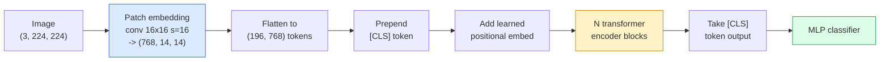

# दृष्टि परिवर्तनक (ViT)

> छवि को पैच में काटें, प्रत्येक पैच को एक शब्द के रूप में देखें, एक मानक ट्रांसफार्मर चलाएं. पीछे मत देखो.

**Type:** Build
**Languages:** Python
**Prerequisites:** Phase 7 Lesson 02 (Self-Attention), Phase 4 Lesson 04 (Image Classification)
**Time:** ~45 minutes

## सीखने के लक्ष्य

- न्यूनतम ViT बनाने के लिए पैच एम्बेडिंग, सीखे गए स्थिति एम्बेडिंग, वर्ग टोकन और ट्रांसफार्मर एन्कोडर ब्लॉक को खरोंच से लागू करें
- समझाएं कि क्यों माना जाता था कि वीआईटी को बड़े पैमाने पर पूर्व-प्रशिक्षण डेटा की आवश्यकता होगी जब तक डीआईटी और एमएई इसके विपरीत साबित नहीं करते
- अपने वास्तुकला पूर्व में ViT, Swin, और ConvNeXt की तुलना करें (कोई नहीं, स्थानीय खिड़की ध्यान, conv रीढ़ की हड्डी)
-  के प्रयोग से एक छोटे से डेटासेट पर पूर्व प्रशिक्षित ViT को ठीक से समायोजित करें`timm`और मानक रैखिक-संड / बारीक-ट्यूनिंग नुस्खा

## समस्या

एक दशक तक, संकुचन कंप्यूटर दृष्टि के पर्याय था। सीएनएन के पास मजबूत प्रेरक पूर्वाग्रह थे  स्थानीयता, अनुवाद समतुल्यता  जो किसी ने नहीं सोचा था कि आप इसे बदल सकते हैं। फिर डोसोविट्स्की और अन्य (2020) ने दिखाया कि सपाट छवि पैचों पर लागू एक साधारण ट्रांसफार्मर, बिना किसी संकुचन मशीनरी के, पैमाने पर सबसे अच्छे सीएनएन से मेल खा सकता है या हरा सकता है।

ImageNet-1k पर ViT ResNet से हार गया। वीआईटी ने इमेजनेट-21k या जेएफटी-300एम पर पूर्व-प्रशिक्षित किया और फिर इमेजनेट-1k पर ठीक से समायोजित किया। निष्कर्ष यह था कि ट्रांसफार्मर में उपयोगी पूर्ववर्ती नहीं थे लेकिन पर्याप्त डेटा से उन्हें सीख सकते थे। बाद के काम (DeiT, MAE, DINO) ने दिखाया कि सही प्रशिक्षण व्यंजनों के साथ  मजबूत वृद्धि, आत्म-निरीक्षण पूर्व प्रशिक्षण, डिस्टिलिशन  छोटे डेटा पर भी वीटी ठीक प्रशिक्षण।

2026 तक, शुद्ध सीएनएन अभी भी किनारे उपकरणों पर प्रतिस्पर्धी हैं (ConvNeXt सबसे मजबूत है), लेकिन ट्रांसफार्मर बाकी सब कुछ पर हावी हैंः खंडन (मास्क 2 फॉर्मर, सेग फॉर्मर), पता लगाने (DETR, RT-DETR), मल्टीमोडल (CLIP, SigLIP), वीडियो (VideoMAE, VJEPA) ।

## अवधारणा

### पाइपलाइन



सात चरण। पैच -> टोकन -> ध्यान -> वर्गीकरणकर्ता। प्रत्येक संस्करण (DeiT, Swin, ConvNeXt, MAE पूर्व प्रशिक्षण) सात में से एक या दो को बदलता है और बाकी को अकेला छोड़ देता है।

### पैच एम्बेडिंग

पहला कन्भ रहस्य है. कर्नेल आकार 16, चरण 16, तो एक 224x224 छवि 16x16 पैचों की 14x14 ग्रिड बन जाती है, प्रत्येक 768-dim एम्बेडिंग के लिए प्रक्षेपित। यह एकल कन्भ दोनों पैच करता है और रैखिक रूप से प्रोजेक्ट करता है।

```
Input:  (3, 224, 224)
Conv (3 -> 768, k=16, s=16, no padding):
Output: (768, 14, 14)
Flatten spatial: (196, 768)
```

196 पैच = 196 टोकन। प्रत्येक टोकन का फीचर आयाम 768 (ViT-B), 1024 (ViT-L), या 1280 (ViT-H) है।

### वर्ग टोकन

एक एकल सीखा वेक्टर अनुक्रम के लिए तैयार किया गयाः

```
tokens = [CLS; patch_1; patch_2; ...; patch_196]   shape (197, 768)
```

N ट्रांसफार्मर ब्लॉक के बाद, `[CLS]`आउटपुट वैश्विक छवि प्रतिनिधित्व है। वर्गीकरण सिर केवल इस एक वेक्टर पढ़ता है।

### स्थितिगत सम्मिलन

ट्रांसफार्मर में स्थानिक स्थिति का कोई अंतर्निहित विचार नहीं है। प्रत्येक टोकन में एक सीखा वेक्टर जोड़ेंः

```
tokens = tokens + learned_pos_embedding   (also shape (197, 768))
```

एम्बेडिंग मॉडल का एक पैरामीटर है; ग्रेडिएंट आधारित प्रशिक्षण इसे 2D छवि संरचना के अनुकूल बनाता है। सिनोसाइडल 2D विकल्प मौजूद हैं लेकिन अभ्यास में शायद ही कभी उपयोग किए जाते हैं।

### ट्रांसफार्मर एन्कोडर ब्लॉक

मानक, बहु-मुख्य आत्म-ध्यान, एमएलपी, अवशिष्ट कनेक्शन, पूर्व-परत मानक।

```
x = x + MSA(LN(x))
x = x + MLP(LN(x))

MLP is two-layer with GELU: Linear(d -> 4d) -> GELU -> Linear(4d -> d)
```

ViT-B/16 इन ब्लॉक में से 12 को ढेर करता है, प्रत्येक में 12 ध्यान सिर होते हैं, कुल 86M पैरामीटर होते हैं।

### पूर्व-एलएन क्यों

एलएन के बाद इस्तेमाल किए जाने वाले शुरुआती ट्रांसफार्मर (`x = LN(x + sublayer(x))`(क) और बिना वार्मिंग के 6-8 परतों के बाद प्रशिक्षण के लिए संघर्ष किया।`x = x + sublayer(LN(x))`) गहरे नेटवर्क को स्थिर रूप से गर्म किए बिना ट्रेन करता है। हर वीटी और हर आधुनिक एलएलएम प्री-एलएन का उपयोग करता है।

### पैच आकार का व्यापार-बदला

- 16x16 पैच -> 196 टोकन, मानक।
- 32x32 पैच -> 49 टोकन, तेज लेकिन कम संकल्प.
- 8x8 पैच -> 784 टोकन, ठीक लेकिन O(n^2) ध्यान लागत पैमाने बुरी तरह से.

बड़े पैच = कम टोकन = तेज़ लेकिन कम स्थानिक विवरण। स्विनवी 2 पदानुक्रमिक खिड़कियों में 4x4 पैच का उपयोग करता है।

### ImageNet-1k पर ViT को प्रशिक्षित करने के लिए DeiT का नुस्खा

मूल वीआईटी को सीएनएन को हराने के लिए जेएफटी -300एम की आवश्यकता थी। डेआईटी (टौव्रोन एट अल, 2020) ने चार परिवर्तनों के साथ केवल इमेजनेट -१के पर वीआईटी-बी को 81.8% शीर्ष-1 तक प्रशिक्षित कियाः

1. भारी वृद्धिः रैंडम ऑगमेंट, मिक्सअप, कट मिक्स, रैंडम मिटाना।
2. स्टोकास्टिक गहराई (प्रशिक्षण के दौरान पूरी ब्लॉक को यादृच्छिक रूप से गिरा दें) ।
3. दोहराया गया बढ़ाव (एक बैच पर 3 बार एक ही छवि का नमूना लिया गया) ।
4. सीएनएन शिक्षक से डिस्टिलिशन (वैकल्पिक, सटीकता को और बढ़ाता है) ।

हर आधुनिक वीआईटी प्रशिक्षण नुस्खा डेआईटी से आता है।

### स्विन बनाम कन्वेनेक्स

- **Swin**(Liu et al., 2021)  खिड़की आधारित ध्यान. प्रत्येक ब्लॉक स्थानीय खिड़की के भीतर भाग लेता है; बारी-बारी से ब्लॉक खिड़की के माध्यम से जानकारी मिश्रण करने के लिए खिड़की को स्थानांतरित करते हैं। ध्यान ऑपरेटर को बनाए रखते हुए एक सीएनएन-जैसी स्थानीयता वापस लाता है।
- **ConvNeXt**(लिउ एट अल, 2022)  ने सीएनएन को फिर से डिज़ाइन किया जो स्विन के वास्तुकला विकल्पों से मेल खाता है (गहनता से कन्वर्स, लेयरनॉर्म, जीईएलयू, उल्टा बोतल गला) । दिखाया कि अंतर "ध्यान बनाम घुमाव" नहीं है बल्कि "आधुनिक प्रशिक्षण नुस्खा + वास्तुकला" है।

2026 में, ConvNeXt-V2 और Swin-V2 दोनों उत्पादन-ग्रेड हैं; सही विकल्प आपके निष्कर्ष स्टैक (ConvNeXt किनारे के लिए बेहतर संकलित करता है) और प्री-ट्रेनिंग कॉर्पस पर निर्भर करता है।

### एमएई पूर्व प्रशिक्षण

मास्क ऑटोकोडर (He et al., 2022): यादृच्छिक रूप से 75% पैचों को मास्क करें, एन्कोडर को केवल दृश्यमान 25% को संसाधित करने के लिए प्रशिक्षित करें, एन्कोडर के आउटपुट से मास्क किए गए पैचों को पुनर्निर्माण करने के लिए एक छोटे से डिकोडर को प्रशिक्षित करें। प्री-ट्रेनिंग के बाद, डिकोडर को त्याग दें और एन्कोडर को ठीक से ट्यून करें।

MAE केवल ImageNet-1k पर ही ViT को प्रशिक्षित करता है, SOTA को हिट करता है, और वर्तमान डिफ़ॉल्ट स्व-निरीक्षण नुस्खा है।

```figure
batchnorm-inference
```

## इसे बनाओ

### चरण 1: पैच एम्बेडिंग

```python
import torch
import torch.nn as nn

class PatchEmbedding(nn.Module):
    def __init__(self, in_channels=3, patch_size=16, dim=192, image_size=64):
        super().__init__()
        assert image_size % patch_size == 0
        self.proj = nn.Conv2d(in_channels, dim, kernel_size=patch_size, stride=patch_size)
        num_patches = (image_size // patch_size) ** 2
        self.num_patches = num_patches

    def forward(self, x):
        x = self.proj(x)
        return x.flatten(2).transpose(1, 2)
```

एक कन्वि, एक फ्लैट, एक ट्रांसपोज. यह पूरी छवि-से-टोकन कदम है.

### चरण 2: ट्रांसफार्मर ब्लॉक

पूर्व-एलएन, बहु-मुख्य आत्म-विचार, जीईएलयू के साथ एमएलपी, अवशिष्ट कनेक्शन।

```python
class Block(nn.Module):
    def __init__(self, dim, num_heads, mlp_ratio=4, dropout=0.0):
        super().__init__()
        self.ln1 = nn.LayerNorm(dim)
        self.attn = nn.MultiheadAttention(dim, num_heads, dropout=dropout, batch_first=True)
        self.ln2 = nn.LayerNorm(dim)
        self.mlp = nn.Sequential(
            nn.Linear(dim, dim * mlp_ratio),
            nn.GELU(),
            nn.Dropout(dropout),
            nn.Linear(dim * mlp_ratio, dim),
            nn.Dropout(dropout),
        )

    def forward(self, x):
        a, _ = self.attn(self.ln1(x), self.ln1(x), self.ln1(x), need_weights=False)
        x = x + a
        x = x + self.mlp(self.ln2(x))
        return x
```

`nn.MultiheadAttention`सिरों में विभाजन, स्केल बिंदु उत्पाद, और आउटपुट प्रक्षेपण को संभालता है। `batch_first=True`तो आकार हैं `(N, seq, dim)`. .

### चरण 3: वीआईटी

```python
class ViT(nn.Module):
    def __init__(self, image_size=64, patch_size=16, in_channels=3,
                 num_classes=10, dim=192, depth=6, num_heads=3, mlp_ratio=4):
        super().__init__()
        self.patch = PatchEmbedding(in_channels, patch_size, dim, image_size)
        num_patches = self.patch.num_patches
        self.cls_token = nn.Parameter(torch.zeros(1, 1, dim))
        self.pos_embed = nn.Parameter(torch.zeros(1, num_patches + 1, dim))
        self.blocks = nn.ModuleList([
            Block(dim, num_heads, mlp_ratio) for _ in range(depth)
        ])
        self.ln = nn.LayerNorm(dim)
        self.head = nn.Linear(dim, num_classes)
        nn.init.trunc_normal_(self.pos_embed, std=0.02)
        nn.init.trunc_normal_(self.cls_token, std=0.02)

    def forward(self, x):
        x = self.patch(x)
        cls = self.cls_token.expand(x.size(0), -1, -1)
        x = torch.cat([cls, x], dim=1)
        x = x + self.pos_embed
        for blk in self.blocks:
            x = blk(x)
        x = self.ln(x[:, 0])
        return self.head(x)

vit = ViT(image_size=64, patch_size=16, num_classes=10, dim=192, depth=6, num_heads=3)
x = torch.randn(2, 3, 64, 64)
print(f"output: {vit(x).shape}")
print(f"params: {sum(p.numel() for p in vit.parameters()):,}")
```

लगभग 2.8M पैरामीटर  एक छोटा ViT CPU पर टरेबल। वास्तविक ViT-B 86M है; के साथ एक ही वर्ग परिभाषा `dim=768, depth=12, num_heads=12`. .

### चरण 4: मानसिकता जांच  एकल छवि निष्कर्ष

```python
logits = vit(torch.randn(1, 3, 64, 64))
print(f"logits: {logits}")
print(f"probs:  {logits.softmax(-1)}")
```

त्रुटि के बिना चलना चाहिए. संभावनाओं का योग 1 है.

## इसका प्रयोग करें

`timm`ImageNet पूर्व प्रशिक्षित वजन के साथ सभी ViT संस्करण जहाज. एक पंक्तिः

```python
import timm

model = timm.create_model("vit_base_patch16_224", pretrained=True, num_classes=10)
```

`timm`यह 2026 में दृष्टि ट्रांसफार्मर के लिए उत्पादन डिफ़ॉल्ट है। यह उसी एपीआई के तहत वीआईटी, डेआईटी, स्विन, स्विन-वी2, कॉन्वनेएक्सटी, कॉन्वनेएक्सटी-वी2, मैक्सवीआईटी, एमवीआईटी, इफ़ेक्टिवफॉर्मर और दर्जनों अन्य लोगों का समर्थन करता है।

बहु-मॉडल कार्य के लिए (छवि + पाठ), `transformers`इन सभी में छवि एन्कोडर एक ViT संस्करण है।

## इसे भेजें

इस पाठ से उत्पन्न होता हैः

- `outputs/prompt-vit-vs-cnn-picker.md` एक संकेत जो डेटासेट आकार, गणना और निष्कर्ष स्टैक के आधार पर एक ViT, एक ConvNeXt, या एक Swin के बीच चुनता है।
- `outputs/skill-vit-patch-and-pos-embed-inspector.md` एक कौशल जो एक ViT के पैच एम्बेडिंग और स्थितित्मक एम्बेडिंग आकारों को मॉडल की अपेक्षित अनुक्रम लंबाई से मेल खाती है, सबसे आम पोर्टिंग बग को पकड़ता है।

## व्यायाम

1. **(Easy)**ऊपर की छोटी ViT के माध्यम से आगे जाने के लिए प्रत्येक मध्यवर्ती Tensor के आकार प्रिंट करें। पुष्टि करेंः इनपुट `(N, 3, 64, 64)`-> पैच `(N, 16, 192)`-> CLS के साथ `(N, 17, 192)`-> वर्गीकरणकर्ता इनपुट `(N, 192)`-> आउटपुट `(N, num_classes)`. .
2. **(Medium)**एक पूर्व प्रशिक्षित को ठीक से समायोजित करें `timm`पाठ 4 से सिंथेटिक-सीआईएफएआर डेटासेट पर ViT-S/16 की तुलना करें। उसी डेटा पर ResNet-18 के ठीक-ठीक समायोजन के साथ तुलना करें। प्रशिक्षण समय और अंतिम सटीकता की रिपोर्ट करें।
3. **(Hard)**छोटे ViT के लिए MAE प्री-ट्रेनिंग लागू करेंः पैचों का 75% मास्क करें, मास्क किए गए पैचों को पुनर्निर्माण करने के लिए एन्कोडर + एक छोटा डिकोडर प्रशिक्षित करें। प्री-ट्रेनिंग से पहले और बाद में सिंथेटिक डेटा पर रैखिक-सॉन्ड सटीकता का मूल्यांकन करें।

## प्रमुख शर्तें

| Term | What people say | What it actually means |
|------|----------------|----------------------|
| Patch embedding | "The first conv" | A conv with kernel size = stride = patch size; turns the image into a grid of token embeddings |
| Class token | "[CLS]" | A learned vector prepended to the token sequence; its final output is the global image representation |
| Positional embedding | "Learned pos" | A learned vector added to every token so the transformer knows where each patch came from |
| Pre-LN | "LayerNorm before sublayer" | The stable transformer variant: `x + sublayer(LN(x))` instead of `LN(x + sublayer(x))` |
| Multi-head attention | "Parallel attention" | Standard transformer attention split into num_heads independent subspaces, concatenated afterwards |
| ViT-B/16 | "Base, patch 16" | The canonical size: dim=768, depth=12, heads=12, patch_size=16, image=224; ~86M params |
| DeiT | "Data-efficient ViT" | ViT trained on ImageNet-1k alone with strong augmentation; proved large pretraining datasets are not strictly required |
| MAE | "Masked autoencoder" | Self-supervised pretraining: mask 75% of patches, reconstruct; the dominant ViT pretraining recipe |

## आगे पढ़ना

- [An Image is Worth 16x16 Words (Dosovitskiy et al., 2020)](https://arxiv.org/abs/2010.11929) वीआईटी पेपर
- [DeiT: Data-efficient Image Transformers (Touvron et al., 2020)](https://arxiv.org/abs/2012.12877) अकेले ImageNet-1k पर ViT को कैसे प्रशिक्षित किया जाए
- [Masked Autoencoders are Scalable Vision Learners (He et al., 2022)](https://arxiv.org/abs/2111.06377) एमएई पूर्व प्रशिक्षण
- [timm documentation](https://huggingface.co/docs/timm) प्रत्येक दृष्टि परिवर्तनक के लिए संदर्भ जिसे आप उत्पादन में उपयोग करेंगे
