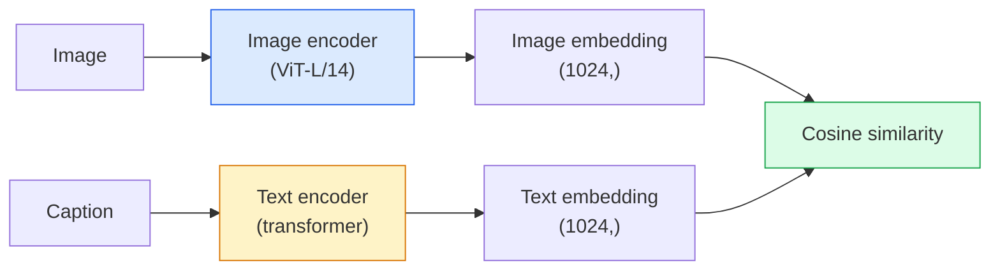

# खुली वक्सावली दृष्टि  CLIP

> एक छवि एन्कोडर और एक पाठ एन्कोडर को एक साथ प्रशिक्षित करें ताकि मिलान (छवि, कैप्शन) जोड़े साझा स्थान में एक ही बिंदु पर लैंड करें। यही पूरी चाल है।

**Type:** Build + Use
**Languages:** Python
**Prerequisites:** Phase 4 Lesson 14 (ViT), Phase 4 Lesson 17 (Self-Supervised)
**Time:** ~45 minutes

## सीखने के लक्ष्य

- CLIP के दो टावरों के वास्तुकला और विपरीत प्रशिक्षण के उद्देश्य को समझाएं
- बिना किसी कार्य-विशिष्ट प्रशिक्षण के शून्य शॉट वर्गीकरण के लिए पूर्व-प्रशिक्षित CLIP (या SigLIP) का उपयोग करें
- शून्य शॉट वर्गीकरण को खरोंच से लागू करेंः कोड वर्ग प्रम्प्ट, कॉसिन समानता की गणना करें, argmax लें
- CLIP, SigLIP, OpenCLIP और LLaVA/LLaMA-vision मॉडल में अंतर करें  2026 में प्रत्येक के लिए क्या है

## समस्या

पारंपरिक वर्गीकरण बंद-वाक्य संग्रह हैंः 1000 वर्गों के इमेजनेट मॉडल केवल 1000 लेबल की भविष्यवाणी कर सकते हैं। प्रत्येक नई श्रेणी के लिए लेबल वाले डेटा और एक पुनः प्रशिक्षित सिर की आवश्यकता होती है।

CLIP (Radford et al., OpenAI 2021) ने दिखाया कि वेब से स्क्रैप किए गए 400M (छवि, कैप्शन) जोड़े पर प्रशिक्षण एक मॉडल का उत्पादन करता है जो निष्कर्ष पर किसी भी सेट की श्रेणियों में वर्गीकृत कर सकता है, जिसे शुद्ध रूप से प्राकृतिक भाषा में वर्णित किया गया है। आप इसे एक वाक्य लिखकर एक नया वर्ग देते हैं।

यह क्षमता  शून्य-शॉट स्थानांतरण  यह है कि हर आधुनिक दृष्टि प्रणाली एक CLIP-परिवार चेकपॉइंट के साथ क्यों शुरू होती है। पता लगाने (ग्राउंडिंग DINO, OWL-ViT), खंडन (CLIPSeg, SAM), पुनर्प्राप्ति, सामग्री मॉडरेशन, VLMs, और पाठ-से-छवि पीढ़ी सभी CLIP-शैली के संयुक्त एम्बेडमेंट पर आधारित हैं।

## अवधारणा

### दो टावर



दोनों एन्कोडर एक ही एम्बेडिंग आयाम (512 के लिए CLIP-B/32, 1024 के लिए CLIP-L/14) के लिए एक रैखिक प्रोजेक्शन के साथ समाप्त होते हैं। L2-सामान्य और गणना कॉसिन समानता।

### उद्देश्य

N (छवि, कैप्शन) जोड़े के एक बैच को देखते हुए, एक NxN समानता मैट्रिक्स बनाएं। दोनों एन्कोडर को प्रशिक्षित करें ताकि विकर्ण (मिलते हुए जोड़े) में उच्च समानता हो और विकर्ण (गैर-मिलते) में कम समानता हो।

```
sim_matrix = image_embeddings @ text_embeddings.T / tau

loss_i2t = cross_entropy(sim_matrix,       targets=arange(N))
loss_t2i = cross_entropy(sim_matrix.T,     targets=arange(N))
loss = (loss_i2t + loss_t2i) / 2
```

सममित क्योंकि छवि-से-पाठ और पाठ-से-चित्र दोनों को काम करना चाहिए। `tau`(तापमान) आमतौर पर एक स्केलर पैरामीटर के रूप में सीखा जाता है, 0.07 पर शुरू किया जाता है।

### सिगलिप: बेहतर हानि

सिगलिप (झाय एट अल., 2023) ने सॉफ्टमैक्स को प्रति जोड़ी सिग्मोइड से बदल दियाः

```
loss = mean over pairs of log(1 + exp(-y_ij * sim_ij))
y_ij = +1 if matching, -1 otherwise
```

प्रति जोड़ी हानि CLIP द्वारा आवश्यक बैच स्तर के सामान्यीकरण को समाप्त करती है। SigLIP छोटे बैच आकार पर बेहतर ट्रेन करता है और समान डेटा पर CLIP से मेल खाता है या उससे अधिक होता है।

### शून्य शॉट वर्गीकरण

एक प्रशिक्षित CLIP के कारणः

1. प्रत्येक वर्ग के लिए, एक प्रॉम्प्ट लिखेंः "एक {class} की तस्वीर"।
2. पाठ एन्कोडर के साथ सभी वर्ग प्रमाणीकरण एन्कोड -> `T`आकार (सी, डी)
3. परीक्षण छवि को एन्कोड करें -> `I`आकार (1, डी)
4. समानता = `I @ T.T`आकार (1, C)
5. Argmax -> पूर्वानुमानित वर्ग।

त्वरित इंजीनियरिंग के मामले। ओपनएआई ने इमेजनेट के लिए 80 शीघ्र टेम्पलेट प्रकाशित किए ("एक {} की तस्वीर", "एक {} की एक धुंधली तस्वीर", "एक {} का एक स्केच", ...) । एक अतिरिक्त 1-3% शीर्ष-1 सटीकता के लिए प्रति वर्ग के सभी टेम्पलेट्स के एम्बेडमेंट का औसत करें।

### जहां 2026 में CLIP शैली के मॉडल का उपयोग किया जाता है

- **Zero-shot classification** प्रत्यक्ष उपयोग।
- **Image retrieval** सभी छवियों को एक बार एन्कोड करें, निष्कर्ष पर क्वेरी एम्बेड करें।
- **Text-conditioned detection** DINO को जमीन पर लटकाकर, OWL-ViT ने एक डिटेक्टर के चारों ओर एक CLIP पाठ टॉवर को लपेटा।
- **Text-conditioned segmentation** CLIPSeg; SAM CLIP के माध्यम से पाठ-प्रोम्प्ट इनपुट का उपयोग करता है।
- **VLMs** LLaVA, Qwen-VL, InternVL एक CLIP-परिवार दृष्टि एन्कोडर LLM में तार।
- **Text-to-image gen** CLIP पाठ एम्बेडमेंट पर स्थिर विसारण, DALL-E 3 स्थिति।

एक बार जब आपके पास एक साझा एम्बेडिंग स्पेस हो जाता है, तो प्रत्येक दृष्टि + भाषा कार्य दूरी गणना बन जाता है।

```figure
clip-contrastive
```

## इसे बनाओ

### चरण 1: दो टावरों का छोटा मॉडल

वास्तविक CLIP ViT + ट्रांसफार्मर है। इस पाठ के लिए टावर पूर्व-उत्कर्षण सुविधाओं पर छोटे MLP हैं ताकि प्रशिक्षण संकेत सीपीयू पर दिखाई दे।

```python
import torch
import torch.nn as nn
import torch.nn.functional as F


class TwoTower(nn.Module):
    def __init__(self, img_in=128, txt_in=64, emb=64):
        super().__init__()
        self.image_proj = nn.Sequential(nn.Linear(img_in, 128), nn.ReLU(), nn.Linear(128, emb))
        self.text_proj = nn.Sequential(nn.Linear(txt_in, 128), nn.ReLU(), nn.Linear(128, emb))
        self.logit_scale = nn.Parameter(torch.ones([]) * 2.6592)  # ln(1/0.07)

    def forward(self, img_feats, txt_feats):
        i = F.normalize(self.image_proj(img_feats), dim=-1)
        t = F.normalize(self.text_proj(txt_feats), dim=-1)
        return i, t, self.logit_scale.exp()
```

दो अनुमान, साझा-डिम आउटपुट, सीखा तापमान. असली CLIP एपीआई के रूप में एक ही आकार.

### चरण 2: विपरीत हानि

```python
def clip_loss(image_emb, text_emb, logit_scale):
    N = image_emb.size(0)
    sim = logit_scale * image_emb @ text_emb.T
    targets = torch.arange(N, device=sim.device)
    l_i = F.cross_entropy(sim, targets)
    l_t = F.cross_entropy(sim.T, targets)
    return (l_i + l_t) / 2
```

सममित। उच्च लॉजिट_स्केल = तेज सॉफ्टमैक्स = अधिक आत्मविश्वास लेकिन अस्थिरता का खतरा।

### चरण 3: शून्य-शॉट वर्गीकरण

```python
@torch.no_grad()
def zero_shot_classify(model, image_feats, class_text_feats, class_names):
    """
    image_feats:      (N, img_in)
    class_text_feats: (C, txt_in)   one averaged embedding per class
    """
    i = F.normalize(model.image_proj(image_feats), dim=-1)
    t = F.normalize(model.text_proj(class_text_feats), dim=-1)
    sim = i @ t.T
    pred = sim.argmax(dim=-1)
    return [class_names[p] for p in pred.tolist()]
```

यह एक उत्पादन CLIP चेकपॉइंट के साथ उपयोग की जाने वाली सटीक शून्य शॉट प्रक्रिया है।

### चरण 4: मानसिक स्वास्थ्य जांच

```python
torch.manual_seed(0)
model = TwoTower()

img = torch.randn(8, 128)
txt = torch.randn(8, 64)
i, t, scale = model(img, txt)
loss = clip_loss(i, t, scale)
print(f"batch size: {i.size(0)}   loss: {loss.item():.3f}")
```

हानि करीब होनी चाहिए`log(N) = log(8) = 2.08`एक यादृच्छिक रूप से शुरू मॉडल के लिए  सममित क्रॉस-एंट्रोपी लक्ष्य जब कोई संरचना अभी तक नहीं सीखा गया है।

## इसका प्रयोग करें

2026 में OpenCLIP समुदाय डिफ़ॉल्ट हैः

```python
import open_clip
import torch
from PIL import Image

model, _, preprocess = open_clip.create_model_and_transforms("ViT-B-32", pretrained="laion2b_s34b_b79k")
tokenizer = open_clip.get_tokenizer("ViT-B-32")

image = preprocess(Image.open("dog.jpg")).unsqueeze(0)
text = tokenizer(["a photo of a dog", "a photo of a cat", "a photo of a car"])

with torch.no_grad():
    image_features = model.encode_image(image)
    text_features = model.encode_text(text)
    image_features = image_features / image_features.norm(dim=-1, keepdim=True)
    text_features = text_features / text_features.norm(dim=-1, keepdim=True)
    probs = (100.0 * image_features @ text_features.T).softmax(dim=-1)

print(probs)
```

सिगलिप नया है, छोटे पैमाने पर बेहतर प्रशिक्षण देता है, और नए काम के लिए पसंद किया जाता हैः `google/siglip-base-patch16-224`. दोनों जहाजों को गले लगा रहा है.

## इसे भेजें

इस पाठ से उत्पन्न होता हैः

- `outputs/prompt-zero-shot-class-picker.md` एक प्रोंपट जो वर्गों की सूची और एक डोमेन दिए गए शून्य-शॉट CLIP के लिए वर्ग टेम्पलेट्स डिजाइन करता है।
- `outputs/skill-image-text-retriever.md` एक कौशल जो किसी भी CLIP चेकपॉइंट के साथ एक छवि एम्बेडिंग सूचकांक बनाता है, पाठ-दर-पाठ और छवि-दर-छवि क्वेरी का समर्थन करता है।

## व्यायाम

1. **(Easy)**पूर्व प्रशिक्षित ओपनक्लिप ViT-B/32 का उपयोग करें और 80 टेम्पलेट प्रॉम्प्ट सेट के साथ CIFAR-10 पर शून्य शॉट वर्गीकरण करें। शीर्ष-1 सटीकता रिपोर्ट करें; यह लगभग 85-90% होना चाहिए।
2. **(Medium)**एक ही CIFAR-10 कार्य पर एकल टेम्पलेट ("एक {} की तस्वीर") बनाम 80-टेम्पलेट औसत एम्बेडमेंट की तुलना करें। अंतर को मात्रा दें और समझाएं कि टेम्पलेट्स क्यों मदद करते हैं।
3. **(Hard)**शून्य-शॉट छवि पुनर्प्राप्ति सूचकांक बनाएंः CLIP के साथ 1,000 छवियों को एम्बेड करें, FAISS सूचकांक बनाएं, प्राकृतिक भाषा विवरण के साथ क्वेरी करें। हाथ से लिखे गए 20 रखे गए क्वेरी के लिए रिकवरी रिकॉल@5 रिपोर्ट करें।

## प्रमुख शर्तें

| Term | What people say | What it actually means |
|------|----------------|----------------------|
| Two-tower | "Dual encoder" | Separate image and text encoders ending in a shared-dim projection head |
| Zero-shot | "No task-specific training" | Classify into classes described only by text at inference; no labels touched |
| Temperature / logit_scale | "tau" | Learned scalar that scales the similarity matrix before softmax |
| Prompt template | "A photo of a {}" | Natural-language wrapper around class names; averaging many templates boosts zero-shot accuracy |
| CLIP | "Image+text model" | The 2021 OpenAI model; vocabulary of the field in 2026 |
| SigLIP | "Sigmoid CLIP" | Swaps softmax for per-pair sigmoid; trains better at small batches |
| OpenCLIP | "Open reproduction" | Community-trained CLIP variants on LAION; production default for open-source pipelines |
| VLM | "Vision-language model" | A CLIP-family encoder plus an LLM, trained to answer questions about images |

## आगे पढ़ना

- [CLIP: Learning Transferable Visual Models from Natural Language Supervision (Radford et al., 2021)](https://arxiv.org/abs/2103.00020)
- [SigLIP: Sigmoid Loss for Language-Image Pre-Training (Zhai et al., 2023)](https://arxiv.org/abs/2303.15343)
- [OpenCLIP](https://github.com/mlfoundations/open_clip) सामुदायिक कोडबेस
- [DINOv2 vs CLIP vs MAE: a features comparison](https://huggingface.co/blog/dinov2) HF गाइड साथ-साथ उपयोग के मामले
