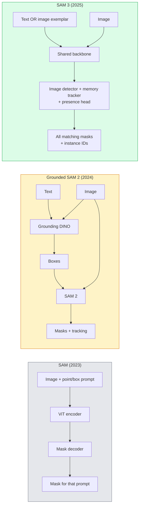

# SAM 3 और ओपन-वोकैब्यूलरी सेगमेंट

> एक मॉडल एक पाठ संकेत और एक छवि दें और प्रत्येक मिलान वस्तु के लिए मास्क प्राप्त करें। SAM 3 ने इसे एक एकल आगे पास बनाया।

**Type:** Use + Build
**Languages:** Python
**Prerequisites:** Phase 4 Lesson 07 (U-Net), Phase 4 Lesson 08 (Mask R-CNN), Phase 4 Lesson 18 (CLIP)
**Time:** ~60 minutes

## सीखने के लक्ष्य

- SAM (केवल दृश्य संकेत), ग्राउंड SAM / SAM 2 (डिटेक्टर + SAM), और SAM 3 (प्रोम्प्टेबल कॉन्सेप्ट सेगमेंट के माध्यम से मूल पाठ संकेत) को अलग करें
- SAM 3 वास्तुकला की व्याख्या करेंः साझा रीढ़ + छवि डिटेक्टर + मेमोरी आधारित वीडियो ट्रैकर + उपस्थिति सिर + डिस्कॉपल डिटेक्टर-ट्रैकर डिजाइन
- चेहरे को गले लगाओ`transformers`पाठ-उत्प्रेरित पता लगाने, खंडन और वीडियो ट्रैकिंग के लिए SAM 3 एकीकरण
- लटेंसी, अवधारणा जटिलता और तैनाती लक्ष्य के आधार पर SAM 3, ग्राउंड SAM 2, YOLO-World और SAM-MI के बीच चयन करें

## समस्या

2023 SAM एक दृश्य-मात्र-प्रोम्प्ट मॉडल थाः आप एक बिंदु पर क्लिक करते हैं या एक बॉक्स खींचते हैं और यह एक मास्क देता है। "मुझे इस तस्वीर में सभी संतरे दें" के लिए आपको बक्से बनाने के लिए एक डिटेक्टर (ग्राउंडिंग DINO) की आवश्यकता थी, फिर SAM प्रत्येक को खंडित करने के लिए। ग्राउंड SAM ने इसे एक पाइपलाइन में बदल दिया, लेकिन यह दो जमे हुए मॉडल का एक झटका था जिसमें त्रुटि का एक अपरिहार्य संचय था।

SAM 3 (मेटा, नवंबर 2025, ICLR 2026) ने कैस्केड को ढह दिया। यह एक छोटे संज्ञा वाक्यांश या छवि उदाहरण को शीघ्र के रूप में स्वीकार करता है और एक एकल आगे के पास में सभी मिलान मास्क और इंस्टेंस आईडी वापस करता है।**Promptable Concept Segmentation (PCS)**. मार्च 2026 ऑब्जेक्ट मल्टीप्लेक्स अपडेट (SAM 3.1) के साथ संयुक्त रूप से, यह वीडियो के माध्यम से एक ही अवधारणा के कई उदाहरणों को कुशलता से ट्रैक करता है।

यह सबक संरचनात्मक बदलाव के बारे में है। 2D Seg, डिटेक्शन और टेक्स्ट-इमेज ग्राउंडिंग एक मॉडल में विलय हो गए हैं। उत्पादन प्रश्न अब "मैं किस पाइपलाइन को एक साथ चेन करता हूं" नहीं है, बल्कि "कौन से प्रम्प्टेबल मॉडल मेरे उपयोग के मामले को अंत से अंत तक संभालता है। "

## अवधारणा

### तीनों पीढ़ियों



### शीघ्र अवधारणा विभाजन

"कन्सेप्ट प्रॉम्प्ट" एक छोटा संज्ञा है (`"yellow school bus"`,`"striped red umbrella"`,`"hand holding a mug"`) या एक छवि नमूना। मॉडल प्रति छवि में प्रत्येक उदाहरण के लिए विभाजन मुखौटे देता है जो अवधारणा से मेल खाता है, साथ ही प्रति मैच एक अद्वितीय उदाहरण आईडी।

यह तीन तरीकों से क्लासिक विज़ुअल-इंप्रेप्ट एसएएम से भिन्न हैः

1. कोई प्रति-उदाहरण प्रलोभन आवश्यक नहीं  एक पाठ प्रलोभन सभी मैचों को वापस करता है.
2. खुली शब्दावली  अवधारणा प्राकृतिक भाषा में वर्णनीय कुछ भी हो सकती है।
3. प्रति संकेत एक मास्क के बजाय एक ही समय में कई उदाहरणों को लौटाता है।

### मुख्य वास्तुकला के टुकड़े

- **Shared backbone** एक ही ViT छवि को संसाधित करता है। डिटेक्टर हेड और मेमोरी आधारित ट्रैकर दोनों इसे पढ़ते हैं।
- **Presence head** यह अनुमान लगाता है कि क्या अवधारणा छवि में मौजूद है। "क्या यह यहाँ है? " से "यह कहां है? " को अलग करता है। यह अनुपस्थित अवधारणाओं पर झूठे सकारात्मक को कम करता है।
- **Decoupled detector-tracker** छवि स्तर पर पता लगाने और वीडियो स्तर पर ट्रैकिंग के अलग-अलग सिर हैं ताकि वे हस्तक्षेप न करें।
- **Memory bank** वीडियो ट्रैकिंग के लिए फ्रेमों पर प्रति-उदाहरण सुविधाओं को स्टोर करता है (समान तंत्र SAM 2 का उपयोग किया जाता है) ।

### बड़े पैमाने पर प्रशिक्षण

SAM 3 पर प्रशिक्षित किया गया था **4 million unique concepts**एक डेटा इंजन द्वारा उत्पन्न किया गया है जो आईए + मानव समीक्षा का उपयोग करके पुनरावृत्ति के साथ टिप्पणी और सुधार करता है।**SA-CO benchmark**इसमें 270K अद्वितीय अवधारणाएं हैं, जो पिछले बेंचमार्क से 50 गुना बड़ी हैं। SAM 3 SA-CO पर मानव प्रदर्शन का 75-80% तक पहुंचता है और छवि + वीडियो पीसीएस पर मौजूदा प्रणालियों को दोगुना करता है।

### SAM 3.1 वस्तु बहुपद

मार्च 2026 अद्यतन: **Object Multiplex**एक ही अवधारणा के कई उदाहरणों को एक साथ ट्रैक करने के लिए एक साझा-स्मृति तंत्र की शुरूआत करता है। पहले, N उदाहरणों को ट्रैक करने का मतलब था N अलग-अलग मेमोरी बैंकों। मल्टीप्लेक्स प्रति-उदाहरण क्वेरी के साथ एक साझा मेमोरी में गिर जाता है। परिणामः सटीकता का त्याग किए बिना काफी तेजी से बहु-वस्तु ट्रैकिंग।

### जहां 2026 में जमीनी SAM अभी भी मायने रखता है

- जब आपको एक विशिष्ट खुले शब्दावली डिटेक्टर (DINO-X, Florence-2) की आवश्यकता होती है।
- जब SAM 3 लाइसेंस (HF पर बंद) एक ब्लॉकर है।
- जब आपको SAM 3 के संपर्क से अधिक डिटेक्टर की सीमा पर नियंत्रण की आवश्यकता होती है।
- डिटेक्टर घटक पर अनुसंधान/अब्लेशन कार्य के लिए।

अधिकांश उत्पादन कार्यों के लिए, SAM 3 सबसे सरल उत्तर है।

### यलो-वर्ल्ड बनाम सैम 3

- **YOLO-World** केवल खुले शब्दावली डिटेक्टर (कोई मास्क नहीं) । वास्तविक समय। जब आपको उच्च फ़ीपीएस पर बॉक्स की आवश्यकता होती है तो सबसे अच्छा।
- **SAM 3** पूर्ण खंडन + ट्रैकिंग। धीमी लेकिन अधिक समृद्ध आउटपुट।

उत्पादन विभाजनः YOLO-World केवल तेज पता लगाने के लिए पाइपलाइन (रोबोटिक नेविगेशन, तेज डैशबोर्ड), SAM 3 मास्क या ट्रैकिंग की आवश्यकता के लिए।

### SAM-MI दक्षता

SAM-MI (2025-2026) SAM के डिकोडर की बोतल की गर्दन को संबोधित करता है।

- **Sparse point prompting** घने संकेतों के बजाय कुछ अच्छी तरह से चुने गए बिंदुओं का उपयोग करता है; डिकोडर कॉल को 96% कम करता है।
- **Shallow mask aggregation** कच्चे मास्क भविष्यवाणियों को एक तेज मास्क में मिलाता है।
- **Decoupled mask injection** डिकोडर को पुनः चलाने के बजाय पूर्व-कंप्यूटेड मास्क सुविधाएँ प्राप्त होती हैं।

परिणामः खुले शब्दावली बेंचमार्क पर ग्राउंडेड-एसएएम से ~1.6× गति।

### तीनों मॉडल के लिए आउटपुट प्रारूप

सभी समान सामान्य संरचना (बॉक्स + लेबल + स्कोर + मास्क + आईडी) को वापस करते हैं, जो उपयोगी है  आपकी पाइपलाइन को नीचे की ओर शाखाओं पर नहीं होना चाहिए जिस मॉडल पर चला गया।

```figure
cv3-open-vocab
```

## इसे बनाओ

### चरण 1: शीघ्र निर्माण

एक सहायक बनाएं जो उपयोगकर्ता वाक्य को SAM 3 अवधारणा संकेतों की एक सूची में बदल देता है। यह सीमा है जहां "उपयोगकर्ता ने टाइप किया" "मॉडल का उपभोग करता है" से मिलता है।

```python
def split_concepts(sentence):
    """
    Heuristic splitter for multi-concept prompts.
    Returns list of short noun phrases.
    """
    for sep in [",", ";", "and", "or", "&"]:
        if sep in sentence:
            parts = [p.strip() for p in sentence.replace("and ", ",").split(",")]
            return [p for p in parts if p]
    return [sentence.strip()]

print(split_concepts("cats, dogs and balloons"))
```

SAM 3 प्रति फॉरवर्ड पास एक अवधारणा स्वीकार करता है; बहु-धारणा प्रश्नों के लिए, उन्हें लूप या बैच करें।

### चरण 2: पोस्ट प्रोसेसिंग सहायक

SAM 3 के कच्चे आउटपुट को पता लगाने की एक साफ सूची में बदल दें जो हमारे चरण 4 पाठ 16 पाइपलाइन अनुबंध से मेल खाती है।

```python
from dataclasses import dataclass
from typing import List

@dataclass
class ConceptDetection:
    concept: str
    instance_id: int
    box: tuple          # (x1, y1, x2, y2)
    score: float
    mask_rle: str       # run-length encoded


def rle_encode(binary_mask):
    flat = binary_mask.flatten().astype("uint8")
    runs = []
    prev, count = flat[0], 0
    for v in flat:
        if v == prev:
            count += 1
        else:
            runs.append((int(prev), count))
            prev, count = v, 1
    runs.append((int(prev), count))
    return ";".join(f"{v}x{c}" for v, c in runs)
```

RLE कई उच्च-रिज़ॉल्यूशन मास्क के लिए भी प्रतिक्रिया के उपयोगिता भार को छोटा रखता है। SAM 2, SAM 3, ग्राउंड SAM 2 पर भी यह प्रारूप काम करता है।

### चरण 3: एक एकीकृत खुले-वाक्यांश विभाजन इंटरफ़ेस

आपके पास जो भी बैकेंड है (SAM 3, ग्राउंड SAM 2, YOLO-World + SAM 2) को एक ही विधि के पीछे लपेटें। आपके डाउनस्ट्रीम कोड में बैकेंड के साथ कोई बदलाव नहीं होता है।

```python
from abc import ABC, abstractmethod
import numpy as np

class OpenVocabSeg(ABC):
    @abstractmethod
    def detect(self, image: np.ndarray, concept: str) -> List[ConceptDetection]:
        ...


class StubOpenVocabSeg(OpenVocabSeg):
    """
    Deterministic stub used for pipeline testing when real models are not loaded.
    """
    def detect(self, image, concept):
        h, w = image.shape[:2]
        return [
            ConceptDetection(
                concept=concept,
                instance_id=0,
                box=(w * 0.2, h * 0.3, w * 0.5, h * 0.8),
                score=0.89,
                mask_rle="0x100;1x50;0x200",
            ),
            ConceptDetection(
                concept=concept,
                instance_id=1,
                box=(w * 0.55, h * 0.25, w * 0.85, h * 0.75),
                score=0.74,
                mask_rle="0x80;1x40;0x220",
            ),
        ]
```

असली `SAM3OpenVocabSeg`उपवर्ग को लपेटा जाएगा `transformers.Sam3Model`और `Sam3Processor`. .

### चरण 4: गले लगाना चेहरा SAM 3 उपयोग (संदर्भ)

वास्तविक मॉडल के लिए, `transformers`समावेशीकरणः

```python
from transformers import Sam3Processor, Sam3Model
import torch

processor = Sam3Processor.from_pretrained("facebook/sam3")
model = Sam3Model.from_pretrained("facebook/sam3").eval()

inputs = processor(images=pil_image, return_tensors="pt")
inputs = processor.set_text_prompt(inputs, "yellow school bus")

with torch.no_grad():
    outputs = model(**inputs)

masks = processor.post_process_masks(
    outputs.masks, inputs.original_sizes, inputs.reshaped_input_sizes
)
boxes = outputs.boxes
scores = outputs.scores
```

एक संकेत, सभी मैच एक ही कॉल में वापस आ गया।

### चरण 5: ग्राउंड SAM 2 ने आपको मुफ्त में क्या दिया है, उसे मापें

एक ईमानदार बेंचमार्कः क्या होता है जब आप एक वास्तविक पाइपलाइन में SAM 3 के साथ ग्राउंड SAM 2 की जगह लेते हैं?

- लटेंसीः SAM 3 एक आगे पास (कोई अलग डिटेक्टर नहीं) बचाता है, लेकिन मॉडल स्वयं अधिक भारी है; आमतौर पर नेट-न्यूट्रल या थोड़ा स्पीडअप।
- सटीकताः दुर्लभ या संरचनात्मक अवधारणाओं पर SAM 3 काफी बेहतर ("स्ट्रिप रेड छाता") । सामान्य एकल-शब्द अवधारणाओं पर समान।
- लचीलापनः ग्राउंड SAM 2 आपको डिटेक्टर (DINO-X, Florence-2, ग्राउंडिंग DINO 1.5) को स्वैप करने देता है; SAM 3 मोनोलिथिक है।

निष्कर्षः SAM 3 2026 के लिए डिफ़ॉल्ट ओपन-वोकैबल सेग है। जब आपको डिटेक्टर लचीलापन या अलग लाइसेंस शर्तों की आवश्यकता होती है तो ग्राउंडेड SAM 2 अभी भी सही उत्तर है।

## इसका प्रयोग करें

उत्पादन के तैनाती के पैटर्नः

- **Real-time annotation** SAM 3 + CVAT का लेबल-जैसे-पाठ-प्रोम्प्ट फ़ंक्शन। एनोटेटर लेबल नाम चुनते हैं; SAM 3 प्रत्येक मिलान वाले उदाहरण को पूर्व-लेबल करता है। समीक्षा और सुधार।
- **Video analytics** SAM 3.1 बहु-वस्तु ट्रैकिंग के लिए ऑब्जेक्ट मल्टीप्लेक्स; मेमोरी आधारित ट्रैकर को फ़ीड फ्रेम।
- **Robotics** खुले स्वर में हेरफेर के लिए SAM 3 ("लाल कप उठाएं"); एक योजना आदिम के रूप में चलाया जाता है।
- **Medical imaging** SAM 3 चिकित्सा अवधारणाओं पर ठीक से समायोजित; एचएफ पर पहुंच अनुरोध की आवश्यकता है।

अल्ट्रालिटिक्स अपने पायथन पैकेज में SAM 3 को लपेटता हैः

```python
from ultralytics import SAM

model = SAM("sam3.pt")
results = model(image_path, prompts="yellow school bus")
```

YOLO और SAM 2 के समान इंटरफ़ेस।

## इसे भेजें

इस पाठ से उत्पन्न होता हैः

- `outputs/prompt-open-vocab-stack-picker.md` एक प्रॉम्प्ट जो लैटेंस, कॉन्सेप्ट की जटिलता और लाइसेंसिंग के आधार पर SAM 3 / ग्राउंड SAM 2 / YOLO-World / SAM-MI का चयन करता है।
- `outputs/skill-concept-prompt-designer.md` एक कौशल जो उपयोगकर्ता के बयानों को अच्छी तरह से गठित SAM 3 अवधारणा संकेतों (विभाजन, असंगति, बैकअप) में बदल देता है।

## व्यायाम

1. **(Easy)**SAM 3 को 10 छवियों पर अपने द्वारा चुने गए अवधारणा संकेतों के साथ चलाएं। SAM 2 + ग्राउंडिंग DINO 1.5 की तुलना उसी छवियों पर करें। रिपोर्ट करें कि प्रत्येक मॉडल में कौन से अवधारणाएं चूक गई हैं।
2. **(Medium)**SAM 3 के शीर्ष पर एक "क्लिक-टू-एंड / क्लिक-टू-एक्सक्लूड" UI बनाएंः एक पाठ प्रॉम्प्ट उम्मीदवार उदाहरणों को लौटाता है; उपयोगकर्ता क्लिक करता है जो सकारात्मक के रूप में गिनती करते हैं। अंतिम अवधारणा सेट को JSON के रूप में आउटपुट करें।
3. **(Hard)**एक कस्टम अवधारणा सेट पर 20 लेबल वाली छवियों के साथ एसएएम 3 को ठीक से समायोजित करें (जैसे 5 प्रकार के इलेक्ट्रॉनिक घटक) प्रत्येक। उसी परीक्षण सेट पर शून्य शॉट एसएएम 3 की तुलना करें; मास्क आईओयू में सुधार को मापें।

## प्रमुख शर्तें

| Term | What people say | What it actually means |
|------|----------------|----------------------|
| Open-vocabulary segmentation | "Segment by text" | Produce masks for objects described in natural language, not a fixed label set |
| PCS | "Promptable Concept Segmentation" | SAM 3's core task — given a noun-phrase or image exemplar, segment all matching instances |
| Concept prompt | "The text input" | Short noun phrase or image exemplar; not a full sentence |
| Presence head | "Is it here?" | SAM 3 module that decides whether the concept exists in the image before localisation |
| SA-CO | "SAM 3 benchmark" | 270K-concept open-vocabulary segmentation benchmark; 50x larger than prior open-vocab benchmarks |
| Object Multiplex | "SAM 3.1 update" | Shared-memory multi-object tracking; fast joint tracking of many instances |
| Grounded SAM 2 | "Modular pipeline" | Detector + SAM 2 cascade; still relevant when detector swap matters |
| SAM-MI | "Efficient SAM variant" | Mask Injection for 1.6x speedup over Grounded-SAM |

## आगे पढ़ना

- [SAM 3: Segment Anything with Concepts (arXiv 2511.16719)](https://arxiv.org/abs/2511.16719)
- [SAM 3.1 Object Multiplex (Meta AI, March 2026)](https://ai.meta.com/blog/segment-anything-model-3/)
- [SAM 3 model page on Hugging Face](https://huggingface.co/facebook/sam3)
- [Grounded SAM 2 tutorial (PyImageSearch)](https://pyimagesearch.com/2026/01/19/grounded-sam-2-from-open-set-detection-to-segmentation-and-tracking/)
- [Ultralytics SAM 3 docs](https://docs.ultralytics.com/models/sam-3/)
- [SAM3-I: Instruction-aware SAM (arXiv 2512.04585)](https://arxiv.org/abs/2512.04585)
