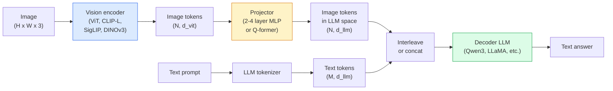

# दृष्टि-भाषा मॉडल  वीटी-एमएलपी-एलएलएम पैटर्न

> एक दृष्टि एन्कोडर एक छवि को टोकन में परिवर्तित करता है। एक एमएलपी प्रोजेक्टर उन टोकन को एलएलएम के एम्बेडिंग स्थान में मैप करता है। एक भाषा मॉडल बाकी करता है। यह पैटर्न  ViT-MLP-LLM  2026 में हर उत्पादन VLM है।

**Type:** Learn + Use
**Languages:** Python
**Prerequisites:** Phase 4 Lesson 14 (ViT), Phase 4 Lesson 18 (CLIP), Phase 7 Lesson 02 (Self-Attention)
**Time:** ~75 minutes

## सीखने के लक्ष्य

- ViT-MLP-LLM वास्तुकला का वर्णन करें और बताएं कि तीनों घटकों में से प्रत्येक क्या योगदान देता है
- पैरामीटर गणना, संदर्भ लंबाई और बेंचमार्क प्रदर्शन पर Qwen3-VL, InternVL3.5, LLaVA-Next और GLM-4.6V की तुलना करें
- डीपस्टैक की व्याख्या करेंः बहु-स्तरीय वीआईटी सुविधाएँ एक एकल अंतिम-स्तरीय सुविधा की तुलना में दृष्टि-भाषा संरेखण को बेहतर क्यों करती हैं
- उत्पादन में VLM भ्रम को क्रॉस-मोडल त्रुटि दर (CMER) के साथ मापें और संकेत पर कार्य करें

## समस्या

CLIP (चरण 4 पाठ 18) आपको छवियों और पाठ के लिए एक साझा एम्बेडिंग स्थान देता है, जो शून्य-शॉट वर्गीकरण और पुनर्प्राप्ति के लिए पर्याप्त है। यह "इस छवि में कितने लाल कारें हैं? " का जवाब नहीं दे सकता है क्योंकि CLIP पाठ उत्पन्न नहीं करता है  यह केवल समानता का स्कोर करता है।

विजन-भाषा मॉडल (VLMs)  Qwen3-VL, InternVL3.5, LLaVA-Next, GLM-4.6V  एक CLIP-परिवार छवि एन्कोडर को एक पूर्ण भाषा मॉडल में बोल्ट करें। मॉडल एक छवि और एक प्रश्न को देखता है और एक उत्तर उत्पन्न करता है। 2026 में ओपन-सोर्स VLMs बहुआयामी बेंचमार्क (MMMU, MMBench, DocVQA, ChartQA, MathVista, OSWorld) पर GPT-5 और Gemini-2.5-Pro का मुकाबला या हराता है।

तीन टुकड़ों (ViT, प्रोजेक्टर, LLM) मानक है। मॉडल के बीच मतभेद वे हैं जिनमें ViT, कौन सा प्रोजेक्टर, कौन सा LLM, प्रशिक्षण डेटा और संरेखण नुस्खा है। एक बार जब आप पैटर्न को समझ लेते हैं, तो किसी भी घटक को स्वैप करना यांत्रिक है।

## अवधारणा

### वीआईटी-एमएलपी-एलएलएम वास्तुकला



1. **Vision encoder** एक पूर्व प्रशिक्षित ViT (CLIP-L/14, SigLIP, DINOv3 या एक ठीक से ट्यून संस्करण) ।
2. **Projector** एक छोटा मॉड्यूल (2-4 परत MLP, या एक Q-former) जो LLM के एम्बेडिंग आयाम में दृष्टि टोकन का नक्शा बनाता है। यह वह जगह है जहां अधिकांश बारीक-बारी से ट्यूनिंग होती है।
3. **LLM** एक केवल डेकोडर भाषा मॉडल (Qwen3, Llama, Mistral, GLM, InternLM) । यह दृश्य + पाठ टोकन को क्रमशः पढ़ता है, पाठ उत्पन्न करता है।

सिद्धांत रूप में तीनों टुकड़े प्रशिक्षित किए जा सकते हैं। व्यवहार में, दृष्टि एन्कोडर और एलएलएम ज्यादातर जमे रहते हैं जबकि प्रोजेक्टर सस्ते में संकेत के कुछ बिलियन पैरामीटर को प्रशिक्षित करता है।

### डीपस्टैक

वैनिला प्रोजेक्शन केवल अंतिम ViT परत का उपयोग करता है। डीपस्टैक (क्यूवेन 3-वीएल) नमूने कई ViT गहराई से विशेषताएं हैं और उन्हें ढेर करते हैं। गहरे परतों में उच्च-स्तरीय अर्थशास्त्र होता है; पतली परतों में बारीक-अमल वाली स्थानिक और बनावट संबंधी जानकारी होती है। एलएलएम में दोनों को खिलाते हुए "छवि में क्या होता है" (शब्दार्थशास्त्र) और "जहां ठीक है" (स्थानिक ग्राउंडिंग) के बीच का अंतर बंद हो जाता है।

### तीन प्रशिक्षण चरण

आधुनिक वीएलएम चरणों में ट्रेन करते हैंः

1. **Alignment** विटी और एलएलएम को फ्रीज करें. केवल प्रोजेक्टर को छवि-कैप्शन जोड़े पर प्रशिक्षित करें। प्रोजेक्टर को भाषा स्थान में दृष्टि स्थान का नक्शा बनाने के लिए सिखाता है।
2. **Pre-training** सब कुछ मुक्त करें। बड़े पैमाने पर इंटरलेटेड छवि-पाठ डेटा (500M+ जोड़े) पर प्रशिक्षित करें। मॉडल के दृश्य ज्ञान का निर्माण करता है।
3. **Instruction tuning** क्यूरेट किए गए (छवि, प्रश्न, उत्तर) ट्रिपल पर ठीक-ठीक ट्यून करना। बातचीत व्यवहार और कार्य प्रारूप सिखाता है। यह एक "दृष्टि-जागरूक एलएम" को एक उपयोगी सहायक में बदल देता है।

अधिकांश लोरा फाइन ट्यूनिंग्स स्टेज 3 के लिए छोटे लेबल वाले डेटासेट के साथ लक्षित हैं।

### मॉडल परिवार तुलना (शुरुआती 2026)

| Model | Params | Vision encoder | LLM | Context | Strengths |
|-------|--------|----------------|-----|---------|-----------|
| Qwen3-VL-235B-A22B (MoE) | 235B (22B active) | custom ViT + DeepStack | Qwen3 | 256K | General SOTA, GUI agent |
| Qwen3-VL-30B-A3B (MoE) | 30B (3B active) | custom ViT + DeepStack | Qwen3 | 256K | Smaller MoE alternative |
| Qwen3-VL-8B (dense) | 8B | custom ViT | Qwen3 | 128K | Production dense default |
| InternVL3.5-38B | 38B | InternViT-6B | Qwen3 + GPT-OSS | 128K | Strong MMBench / MMVet |
| InternVL3.5-241B-A28B | 241B (28B active) | InternViT-6B | Qwen3 | 128K | Competitive with GPT-4o |
| LLaVA-Next 72B | 72B | SigLIP | Llama-3 | 32K | Open, easy to fine-tune |
| GLM-4.6V | ~70B | custom | GLM | 64K | Open-source, strong OCR |
| MiniCPM-V-2.6 | 8B | SigLIP | MiniCPM | 32K | Edge-friendly |

### दृश्य एजेंट

Qwen3-VL-235B OSWorld पर शीर्ष वैश्विक प्रदर्शन तक पहुंचता है  एक बेंचमार्क के लिए **visual agents**यह एक स्क्रीनशॉट देखता है, यूआई को समझता है, और कार्रवाई (क्लिक, टाइप, स्क्रॉल) जारी करता है। उपकरण के साथ संयुक्त, यह सामान्य डेस्कटॉप कार्यों पर लूप को बंद करता है। यह है कि 2026 "एआई पीसी" डेमो के अधिकांश हुड के नीचे चलाते हैं।

### एजेंटिक क्षमता + RoPE वेरिएंट

वीएलएम को यह जानना चाहिए**when**Qwen3-VL T-RoPE (समय पर घूर्णन स्थिति एम्बेडमेंट) से विकसित हो गया है**text-based time alignment** वीडियो फ्रेम के साथ परस्पर स्पष्ट समय टिकट पाठ टोकन. मॉडल "`<timestamp 00:32>`फ्रेम, शीघ्र" और समय संबंधी संबंधों के बारे में तर्क कर सकते हैं।

### संरेखण समस्या

क्रॉल किए गए डेटासेट में 12% छवि-पाठ जोड़े में चित्र में पूरी तरह से आधारित नहीं विवरण होते हैं। इस पर प्रशिक्षित एक VLM चुपचाप ऑब्जेक्ट्स का निर्माण करना सीखता है, गलत संख्याओं को पढ़ता है, संबंध का आविष्कार करता है। उत्पादन में यह प्रमुख विफलता मोड है।

Skywork.ai ने **Cross-Modal Error Rate (CMER)**इसे ट्रैक करने के लिएः

```
CMER = fraction of outputs where the text confidence is high but the image-text similarity (via a CLIP-family checker) is low
```

उच्च सीएमईआर का मतलब है कि मॉडल छवि में आधारित नहीं होने वाली चीजों को आत्मविश्वास से कह रहा है। सीएमईआर की निगरानी करना और इसे उत्पादन केपीआई के रूप में इलाज करना उनकी तैनाती में ~ 35% तक पगडंडी दर को कम करता है। ट्रिक "मॉडल को ठीक करना" नहीं है, बल्कि "मानव समीक्षा के लिए उच्च सीएमईआर आउटपुट का मार्ग" है।

### लोरा/क्यूलोरा के साथ सूक्ष्म समायोजन

70B VLM का पूर्ण ठीक-ठाक अधिकांश टीमों के लिए उपलब्ध नहीं है। ध्यान + प्रोजेक्टर परतों पर LoRA (रैंक 16-64) या 4-बिट बेस वजन के साथ QLoRA, एक एकल A100 / H100 पर फिट बैठता है। लागतः 5,000-50,000 उदाहरण, $100-$5 हजार गणना, 2-10 घंटे प्रशिक्षण.

### स्थानिक तर्क अभी भी कमजोर है

वर्तमान VLMs स्थानिक तर्क बेंचमार्क (ऊपर-नीचे, बाएं-दाएं, गिनती, दूरी) पर 50-60% स्कोर करते हैं। यदि आपका उपयोग मामला "कौन सी वस्तु किस के ऊपर है" पर निर्भर करता है, तो भारी मात्रा में मान्य करें  सामान्य VLM प्रदर्शन मानव से नीचे है। शुद्ध स्थानिक कार्यों के लिए VLM से बेहतर विकल्पः एक विशेष कुंजी बिंदु / मुद्रा अनुमानक, एक गहराई मॉडल, या बॉक्स ज्यामिति के साथ एक पता लगाने मॉडल पोस्ट-प्रोसेसिंग।

```figure
v4-vlm-projector
```

## इसे बनाओ

### चरण 1: प्रोजेक्टर

जो भाग आप सबसे अधिक बार अभ्यास करेंगे. 2-4 परतों के साथ GELU MLP.

```python
import torch
import torch.nn as nn


class Projector(nn.Module):
    def __init__(self, vit_dim=768, llm_dim=4096, hidden=4096):
        super().__init__()
        self.net = nn.Sequential(
            nn.Linear(vit_dim, hidden),
            nn.GELU(),
            nn.Linear(hidden, llm_dim),
        )

    def forward(self, x):
        return self.net(x)
```

इनपुट एक है `(N_patches, d_vit)`प्रतीकात्मक Tensor. आउटपुट है`(N_patches, d_llm)`LLM प्रत्येक आउटपुट पंक्ति को सिर्फ एक और टोकन के रूप में व्यवहार करता है।

### चरण 2: अंत-से-अंत ViT-MLP-LLM को इकट्ठा करें

एक न्यूनतम VLM के लिए आगे पास की कंकाल। असली कोड का उपयोग करता है `transformers`; यह अवधारणागत रूपरेखा है।

```python
class MinimalVLM(nn.Module):
    def __init__(self, vit, projector, llm, image_token_id):
        super().__init__()
        self.vit = vit
        self.projector = projector
        self.llm = llm
        self.image_token_id = image_token_id  # placeholder token in text prompt

    def forward(self, image, input_ids, attention_mask):
        # 1. vision features
        vision_tokens = self.vit(image)                     # (B, N_patches, d_vit)
        vision_embeds = self.projector(vision_tokens)       # (B, N_patches, d_llm)

        # 2. text embeddings
        text_embeds = self.llm.get_input_embeddings()(input_ids)  # (B, M, d_llm)

        # 3. replace image placeholder tokens with vision embeds
        merged = self._merge(text_embeds, vision_embeds, input_ids)

        # 4. run LLM
        return self.llm(inputs_embeds=merged, attention_mask=attention_mask)

    def _merge(self, text_embeds, vision_embeds, input_ids):
        out = text_embeds.clone()
        expected = vision_embeds.size(1)
        for b in range(input_ids.size(0)):
            positions = (input_ids[b] == self.image_token_id).nonzero(as_tuple=True)[0]
            if len(positions) != expected:
                raise ValueError(
                    f"batch item {b} has {len(positions)} image tokens but vision_embeds has {expected} patches."
                    " Every sample in the batch must be pre-padded to the same number of image placeholder tokens.")
            out[b, positions] = vision_embeds[b]
        return out
```

`<image>`पाठ में स्थान धारक टोकन वास्तविक छवि एम्बेड के साथ प्रतिस्थापित किया जाता है  एक ही पैटर्न LLaVA, Qwen-VL, और InternVL उपयोग।

### चरण 3: सीएमईआर गणना

हल्के रनटाइम चेक.

```python
import torch.nn.functional as F


def cross_modal_error_rate(image_emb, text_emb, text_confidence, sim_threshold=0.25, conf_threshold=0.8):
    """
    image_emb, text_emb: embeddings of image and generated text (normalised internally)
    text_confidence:     mean per-token probability in [0, 1]
    Returns:             fraction of high-confidence outputs with low image-text alignment
    """
    image_emb = F.normalize(image_emb, dim=-1)
    text_emb = F.normalize(text_emb, dim=-1)
    sim = (image_emb * text_emb).sum(dim=-1)        # cosine similarity
    high_conf_low_sim = (text_confidence > conf_threshold) & (sim < sim_threshold)
    return high_conf_low_sim.float().mean().item()
```

सीएमईआर को उत्पादन केपीआई के रूप में देखें। इसे प्रति एंडपॉइंट, प्रति प्रॉम्प्ट प्रकार, प्रति ग्राहक पर निगरानी करें। बढ़ते सीएमईआर से संकेत मिलता है कि मॉडल कुछ इनपुट वितरण पर भ्रम पैदा करना शुरू कर रहा है।

### चरण 4: खिलौना VLM वर्गीकरण (चलन योग्य)

झूठी "ViT सुविधाओं" में प्रवेश करते हैं; एक छोटे से LLM शैली टोकन एक कक्षा की भविष्यवाणी करता है।

```python
class ToyVLM(nn.Module):
    def __init__(self, vit_dim=32, llm_dim=64, num_classes=5):
        super().__init__()
        self.projector = Projector(vit_dim, llm_dim, hidden=64)
        self.head = nn.Linear(llm_dim, num_classes)

    def forward(self, vision_tokens):
        projected = self.projector(vision_tokens)
        pooled = projected.mean(dim=1)
        return self.head(pooled)
```

इसे सिंथेटिक (विशेषता, वर्ग) जोड़े पर 200 से कम चरणों में फिट किया जा सकता है  प्रोजेक्टर पैटर्न काम करता है।

## इसका प्रयोग करें

2026 में उत्पादन टीमों द्वारा VLM का उपयोग करने के तीन तरीकेः

- **Hosted API** ओपनएआई विजन, एंथ्रोपिक क्लाउड विजन, गूगल जेमिनी विजन। शून्य इन्फ्रारेड, विक्रेता जोखिम।
- **Open-source self-host** Qwen3-VL या InternVL3.5 via `transformers`और `vllm`पूर्ण नियंत्रण, उच्च अग्रिम प्रयास.
- **Fine-tune on domain** लोड Qwen2.5-VL-7B या LLaVA-1.6-7B, LoRA 5k-50k कस्टम उदाहरणों पर, सेवा के साथ `vllm`या `TGI`. .

```python
from transformers import AutoProcessor, AutoModelForVision2Seq
import torch
from PIL import Image

model_id = "Qwen/Qwen3-VL-8B-Instruct"
processor = AutoProcessor.from_pretrained(model_id)
model = AutoModelForVision2Seq.from_pretrained(model_id, torch_dtype=torch.bfloat16, device_map="auto")

messages = [{
    "role": "user",
    "content": [
        {"type": "image", "image": Image.open("plot.png")},
        {"type": "text", "text": "What does this chart show?"},
    ],
}]
inputs = processor.apply_chat_template(messages, add_generation_prompt=True, tokenize=True, return_dict=True, return_tensors="pt").to("cuda")
generated = model.generate(**inputs, max_new_tokens=256)
answer = processor.decode(generated[0][inputs["input_ids"].shape[1]:], skip_special_tokens=True)
```

`apply_chat_template`छिपाता है `<image>`प्लेसहोल्डर टोकनकरण; मॉडल विलय को आंतरिक रूप से संभालता है।

## इसे भेजें

इस पाठ से उत्पन्न होता हैः

- `outputs/prompt-vlm-selector.md` सटीकता, विलंबता, संदर्भ लंबाई और बजट के कारण Qwen3-VL / InternVL3.5 / LLaVA-Next / API का चयन करता है।
- `outputs/skill-cmer-monitor.md` क्रॉस-मोडल त्रुटि दर, प्रति-एंडपॉइंट डैशबोर्ड और अलर्टिंग थ्रॉवल के साथ उत्पादन VLM एंडपॉइंट के लिए कोड जारी करता है।

## व्यायाम

1. **(Easy)**पांच छवियों पर किसी भी खुले VLM के माध्यम से तीन संकेत ("यह क्या है?", "वस्तुओं की गणना करें", "दृश्य का वर्णन करें") चलाएं। प्रत्येक उत्तर को सही / आंशिक रूप से सही / हाथ से भ्रामक के रूप में स्कोर करें। एक पहली पास सीएमईआर-जैसी दर की गणना करें।
2. **(Medium)**लक्षित डोमेन की 500 छवियों पर लोरा (रैंक 16) के साथ Qwen2.5-VL-3B या LLaVA-1.6-7B को ठीक से समायोजित करें। शून्य शॉट बनाम ठीक से समायोजित MMBench शैली की सटीकता की तुलना करें।
3. **(Hard)**VLM के छवि एन्कोडर को डिफ़ॉल्ट SigLIP/CLIP के बजाय DINOv3 से बदलें। केवल प्रोजेक्टर (मुस्कृत LLM +मुस्कृत DINOv3) को फिर से प्रशिक्षित करें। मापें कि घने भविष्यवाणी कार्यों (गणना, स्थानिक तर्क) में सुधार हुआ है या नहीं।

## प्रमुख शर्तें

| Term | What people say | What it actually means |
|------|----------------|----------------------|
| ViT-MLP-LLM | "The VLM pattern" | Vision encoder + projector + language model; every 2026 VLM |
| Projector | "The bridge" | 2-4 layer MLP (or Q-former) that maps vision tokens into LLM embedding space |
| DeepStack | "Qwen3-VL feature trick" | Multi-level ViT features stacked rather than last-layer only |
| Image token | "<image> placeholder" | Special token in the text stream replaced by projected vision embeddings |
| CMER | "Hallucination KPI" | Cross-Modal Error Rate; high when text confidence is high but image-text similarity is low |
| Visual agent | "VLM that clicks" | VLM operating GUIs (OSWorld, mobile, web) with tool calls |
| Q-former | "Fixed-count token bridge" | BLIP-2 style projector producing a fixed number of visual query tokens |
| Alignment / pre-training / instruction tuning | "Three stages" | Standard VLM training pipeline |

## आगे पढ़ना

- [Qwen3-VL Technical Report (arXiv 2511.21631)](https://arxiv.org/abs/2511.21631)
- [InternVL3.5 Advancing Open-Source Multimodal Models (arXiv 2508.18265)](https://arxiv.org/html/2508.18265v1)
- [LLaVA-Next series](https://llava-vl.github.io/blog/2024-05-10-llava-next-stronger-llms/)
- [BentoML: Best Open-Source VLMs 2026](https://www.bentoml.com/blog/multimodal-ai-a-guide-to-open-source-vision-language-models)
- [MMMU: Multi-discipline Multimodal Understanding benchmark](https://mmmu-benchmark.github.io/)
- [VLMs in manufacturing (Robotics Tomorrow, March 2026)](https://www.roboticstomorrow.com/story/2026/03/when-machines-learn-to-see-like-experts-the-rise-of-vision-language-models-in-manufacturing/26335/)
