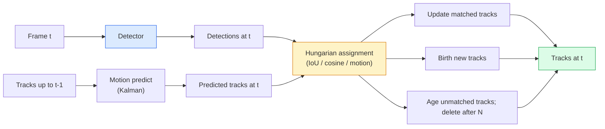

# मल्टी-ऑब्जेक्ट ट्रैकिंग और वीडियो मेमोरी

> ट्रैकिंग पता लगाने के साथ जोड़ है. प्रत्येक फ्रेम का पता लगाएं. पहचान द्वारा इस फ्रेम के पता लगाने के लिए अंतिम फ्रेम के निशान के साथ मेल.

**Type:** Build
**Languages:** Python
**Prerequisites:** Phase 4 Lesson 06 (YOLO Detection), Phase 4 Lesson 08 (Mask R-CNN), Phase 4 Lesson 24 (SAM 3)
**Time:** ~60 minutes

## सीखने के लक्ष्य

- क्वेरी आधारित ट्रैकिंग से ट्रैकिंग-दर-डिटेक्शन को अलग करें और एल्गोरिदम परिवारों का नाम दें (SORT, DeepSORT, ByteTrack, BoT-SORT, SAM 2 मेमोरी ट्रैकर, SAM 3.1 ऑब्जेक्ट मल्टीप्लेक्स)
- क्लासिक ट्रैकिंग-दर-डिटेक्शन के लिए आईओयू + हंगेरियन असाइनमेंट को स्क्रैच से लागू करें
- SAM 2 के मेमोरी बैंक को समझाएं और यह IoU आधारित संघ से बेहतर रूप से ऑक्ल्यूशन को क्यों संभालता है
- तीन ट्रैकिंग मेट्रिक्स (MOTA, IDF1, HOTA) पढ़ें और चुनें कि कौन सा एक दिए गए उपयोग के मामले के लिए मायने रखता है

## समस्या

एक डिटेक्टर आपको बताता है कि एक फ्रेम में वस्तुएं कहां हैं। एक ट्रैकर आपको बताता है कि फ्रेम में कौन सा पता लगाने है।`t`फ्रेम में एक पहचान के रूप में एक ही वस्तु है `t-1`इसके बिना, आप रेखा पार करने वाले वस्तुओं की गिनती नहीं कर सकते, एक बॉल को एक अवरुद्ध के माध्यम से पालन नहीं कर सकते, या यह नहीं जानते कि "कार #4 8 सेकंड से लेन में है। "

वीडियो-उन्मुख प्रत्येक उत्पाद के लिए ट्रैकिंग आवश्यक हैः खेल विश्लेषण, निगरानी, स्वायत्त ड्राइविंग, चिकित्सा वीडियो विश्लेषण, वन्यजीव निगरानी, वर्डमार्क गिनती। मुख्य निर्माण ब्लॉकों को साझा किया जाता हैः प्रति फ्रेम डिटेक्टर, एक गति मॉडल (कलमन फ़िल्टर या कुछ और समृद्ध), एक संघ चरण (यूओयू / कॉसिन / सीखे गए गुणों पर हंगेरियन एल्गोरिथ्म), और एक ट्रैक जीवन चक्र (जन्म, अद्यतन, मृत्यु) ।

2026 में दो नए पैटर्न आएः **SAM 2 memory-based tracking**(मोशन मॉडल के बजाय फीचर-मेमोरी एसोसिएशन) और **SAM 3.1 Object Multiplex**(एक ही अवधारणा के कई उदाहरणों के लिए साझा स्मृति) यह सबक पहले क्लासिकल स्टैक पर चलता है, फिर स्मृति आधारित दृष्टिकोण।

## अवधारणा

### ट्रैकिंग-डेटेक्शन



2026 में आप जो भी ट्रैकर देखेंगे वह इस लूप का एक भिन्नता है।

- **SORT**(2016): Kalman फिल्टर + IoU हंगेरियन. सरल, तेज, कोई उपस्थिति मॉडल नहीं।
- **DeepSORT**(2017): SORT + एक सीएनएन आधारित उपस्थिति सुविधा प्रति ट्रैक (ReID एम्बेडिंग) । क्रॉसिंग को बेहतर तरीके से संभालता है।
- **ByteTrack**(2021): कम आत्मविश्वास की पहचान को दूसरे चरण के रूप में जोड़ता है; कोई उपस्थिति सुविधाओं की आवश्यकता नहीं है लेकिन MOT17 पर शीर्ष प्रदर्शनकर्ता।
- **BoT-SORT**(2022): बाइट + कैमरा गति मुआवजा + रीआईडी।
- **StrongSORT / OC-SORT** बेहतर गति और उपस्थिति के साथ बाइटट्रैक वंशज।

### एक पैराग्राफ में कल्मन फ़िल्टर

एक Kalman फिल्टर प्रति ट्रैक स्थिति बनाए रखता है `(x, y, w, h, dx, dy, dw, dh)`एक सह-विवर्तन के साथ. प्रत्येक फ्रेम पर,**predict**स्थिर गति मॉडल का उपयोग कर राज्य, तो **update**अद्यतन जब भविष्यवाणी अनिश्चितता उच्च है जब पता लगाने के अधिक भरोसा करता है। यह चिकनी पटरियों और एक छोटे से अवरुद्ध के माध्यम से एक ट्रैक जारी रखने की क्षमता देता है (1-5 फ्रेम).

हर क्लासिक ट्रैकर गति-पूर्वानुमान चरण में एक Kalman फ़िल्टर का उपयोग करता है।

### हंगेरियन एल्गोरिथ्म

एक `M x N`लागत मैट्रिक्स (ट्रैक x पता लगाने), एक-से-एक असाइनमेंट ढूंढें जो कुल लागत को न्यूनतम करता है। लागत आमतौर पर `1 - IoU(track_bbox, detection_bbox)`या नकारात्मक कॉसिन समानता उपस्थिति सुविधाओं. रनटाइम O(((M+N) ^3) है; के लिए M, N ~ 1000 तक यह पायथन के माध्यम से काफी तेजी से है`scipy.optimize.linear_sum_assignment`. .

### बाइटट्रैक का प्रमुख विचार

मानक ट्रैकर कम आत्मविश्वास वाले डिटेक्शन (< 0.5) को छोड़ देते हैं।**second-stage candidates**: उच्च-विश्वास के पता लगाने के लिए पटरियों को मिलान करने के बाद, अद्वितीय पटरियों को कम-विश्वास के पता लगाने के साथ थोड़ा ढीला IoU सीमा के साथ मिलान करने की कोशिश करते हैं।

### SAM 2 मेमोरी आधारित ट्रैकिंग

SAM 2 एक **memory bank**प्रति-उदाहरण स्थान-समय सुविधाओं के साथ। एक फ्रेम पर एक प्रॉम्प्ट (क्लिक, बॉक्स, पाठ) दिए जाने पर, यह इंस्टेंस को मेमोरी में एन्कोड करता है। बाद के फ्रेम पर, मेमोरी को नए फ्रेम की सुविधाओं के खिलाफ क्रॉस-एटेंडेड किया जाता है, और डिकोडर नए फ्रेम में उसी इंस्टेंस के लिए एक मास्क का उत्पादन करता है।

कोई कल्मन फ़िल्टर, कोई हंगेरियाई असाइनमेंट नहीं। यह संबद्धता स्मृति-ध्यान ऑपरेशन में शामिल है।

लाभ:
- बड़े-बड़े अछूता तक मजबूत (स्मृति कई फ्रेमों में इंस्टेंस पहचान ले जाती है) ।
- खुले शब्दावली जब SAM 3 के पाठ संकेतों के साथ संयुक्त.
- एक अलग गति मॉडल के बिना काम करता है।

विपक्ष:
- कई वस्तुओं को ट्रैक करने के लिए ByteTrack से धीमी।
- मेमोरी बैंक बढ़ता है; संदर्भ विंडो को सीमित करता है।

### SAM 3.1 वस्तु बहुपद

पूर्व SAM 2 / SAM 3 ट्रैकिंग प्रति उदाहरण एक अलग मेमोरी बैंक रखता है। 50 वस्तुओं के लिए, 50 मेमोरी बैंक। ऑब्जेक्ट मल्टीप्लेक्स (मार्च 2026) उन्हें एक साझा मेमोरी में ढहता है।**per-instance query tokens**. लागत के पैमाने उप-रेखीय रूप से कई मामलों में।

2026 में भीड़ ट्रैकिंग के लिए मल्टीप्लेक्स नया डिफ़ॉल्ट है: कॉन्सर्ट भीड़, गोदाम के श्रमिक, ट्रैफिक चौराहे।

### तीन मेट्रिक्स जानने के लिए

- **MOTA (Multi-Object Tracking Accuracy)** 1 - (FN + FP + ID स्विच) / GT। त्रुटि प्रकार द्वारा वजन; एक एकल मीट्रिक जो पता लगाने और संघ दोषों को मिलाता है।
- **IDF1 (ID F1)** आईडी सटीकता और याद करने का सामंजस्यपूर्ण औसत। यह विशेष रूप से इस बात पर केंद्रित है कि प्रत्येक ग्राउंड-सत्य ट्रैक समय के साथ अपनी आईडी को कैसे रखता है। आईडी-स्विच-संवेदनशील कार्यों के लिए एमओटीए से बेहतर।
- **HOTA (Higher Order Tracking Accuracy)** पता लगाने की सटीकता (DetA) और संघ सटीकता (AssA) में विघटित होता है। 2020 से सामुदायिक मानक; सबसे व्यापक।

निगरानी के लिए (किसे कौन है): IDF1 वह है जो आप रिपोर्ट करते हैं। खेल विश्लेषण के लिए (गणना पास): HOTA। सामान्य शैक्षणिक तुलना के लिएः HOTA।

```figure
cv3-track-assoc
```

## इसे बनाओ

### चरण 1: आईओयू आधारित लागत मैट्रिक्स

```python
import numpy as np


def bbox_iou(a, b):
    """
    a, b: (N, 4) arrays of [x1, y1, x2, y2].
    Returns (N_a, N_b) IoU matrix.
    """
    ax1, ay1, ax2, ay2 = a[:, 0], a[:, 1], a[:, 2], a[:, 3]
    bx1, by1, bx2, by2 = b[:, 0], b[:, 1], b[:, 2], b[:, 3]
    inter_x1 = np.maximum(ax1[:, None], bx1[None, :])
    inter_y1 = np.maximum(ay1[:, None], by1[None, :])
    inter_x2 = np.minimum(ax2[:, None], bx2[None, :])
    inter_y2 = np.minimum(ay2[:, None], by2[None, :])
    inter = np.clip(inter_x2 - inter_x1, 0, None) * np.clip(inter_y2 - inter_y1, 0, None)
    area_a = (ax2 - ax1) * (ay2 - ay1)
    area_b = (bx2 - bx1) * (by2 - by1)
    union = area_a[:, None] + area_b[None, :] - inter
    return inter / np.clip(union, 1e-8, None)
```

### चरण 2: न्यूनतम SORT शैली ट्रैकर

स्थिर स्थिर गति के लिए Kalman संक्षिप्तता के लिए छोड़ दिया  हम यहाँ एक सरल IoU संघ का उपयोग; उत्पादन में Kalman भविष्यवाणी आवश्यक है।`sort`पायथन पैकेज पूर्ण संस्करण प्रदान करता है।

```python
from scipy.optimize import linear_sum_assignment


class Track:
    def __init__(self, tid, bbox, frame):
        self.id = tid
        self.bbox = bbox
        self.last_frame = frame
        self.hits = 1

    def update(self, bbox, frame):
        self.bbox = bbox
        self.last_frame = frame
        self.hits += 1


class SimpleTracker:
    def __init__(self, iou_threshold=0.3, max_age=5):
        self.tracks = []
        self.next_id = 1
        self.iou_threshold = iou_threshold
        self.max_age = max_age

    def step(self, detections, frame):
        if not self.tracks:
            for d in detections:
                self.tracks.append(Track(self.next_id, d, frame))
                self.next_id += 1
            return [(t.id, t.bbox) for t in self.tracks]

        track_boxes = np.array([t.bbox for t in self.tracks])
        det_boxes = np.array(detections) if len(detections) else np.empty((0, 4))

        iou = bbox_iou(track_boxes, det_boxes) if len(det_boxes) else np.zeros((len(track_boxes), 0))
        cost = 1 - iou
        cost[iou < self.iou_threshold] = 1e6

        matched_track = set()
        matched_det = set()
        if cost.size > 0:
            row, col = linear_sum_assignment(cost)
            for r, c in zip(row, col):
                if cost[r, c] < 1.0:
                    self.tracks[r].update(det_boxes[c], frame)
                    matched_track.add(r); matched_det.add(c)

        for i, d in enumerate(det_boxes):
            if i not in matched_det:
                self.tracks.append(Track(self.next_id, d, frame))
                self.next_id += 1

        self.tracks = [t for t in self.tracks if frame - t.last_frame <= self.max_age]
        return [(t.id, t.bbox) for t in self.tracks]
```

60 लाइनें. प्रति फ्रेम पता लगाना, प्रति फ्रेम ट्रैक आईडी वापस करता है. वास्तविक प्रणालियों Kalman भविष्यवाणी जोड़ने, ByteTrack के दूसरे चरण के पुन-मिलान, और उपस्थिति सुविधाओं.

### चरण 3: सिंथेटिक ट्रैक्टोरिया टेस्ट

```python
def synthetic_frames(num_frames=20, num_objects=3, H=240, W=320, seed=0):
    rng = np.random.default_rng(seed)
    starts = rng.uniform(20, 200, size=(num_objects, 2))
    velocities = rng.uniform(-5, 5, size=(num_objects, 2))
    frames = []
    for f in range(num_frames):
        dets = []
        for i in range(num_objects):
            cx, cy = starts[i] + f * velocities[i]
            dets.append([cx - 10, cy - 10, cx + 10, cy + 10])
        frames.append(dets)
    return frames


tracker = SimpleTracker()
for f, dets in enumerate(synthetic_frames()):
    tracks = tracker.step(dets, f)
```

सीधी रेखाओं में चलती तीन वस्तुओं को सभी 20 फ्रेम में अपनी पहचान बनाए रखना चाहिए।

### चरण 4: आईडी स्विच मेट्रिक

```python
def count_id_switches(tracks_per_frame, gt_per_frame):
    """
    tracks_per_frame:  list of list of (track_id, bbox)
    gt_per_frame:      list of list of (gt_id, bbox)
    Returns number of ID switches.
    """
    prev_assignment = {}
    switches = 0
    for tracks, gts in zip(tracks_per_frame, gt_per_frame):
        if not tracks or not gts:
            continue
        t_boxes = np.array([b for _, b in tracks])
        g_boxes = np.array([b for _, b in gts])
        iou = bbox_iou(g_boxes, t_boxes)
        for g_idx, (gt_id, _) in enumerate(gts):
            j = iou[g_idx].argmax()
            if iou[g_idx, j] > 0.5:
                t_id = tracks[j][0]
                if gt_id in prev_assignment and prev_assignment[gt_id] != t_id:
                    switches += 1
                prev_assignment[gt_id] = t_id
    return switches
```

यह एक सरलीकृत IDF1 आसन्न मीट्रिक हैः गणना कितनी बार एक ग्राउंड-सत्य वस्तु अपने आवंटित भविष्यवाणी ट्रैक आईडी बदलता है। वास्तविक MOTA / IDF1 / HOTA उपकरण जीवन में रहता है `py-motmetrics`और `TrackEval`. .

## इसका प्रयोग करें

2026 में उत्पादन ट्रैकरः

- `ultralytics` YOLOv8 + बाइटट्रैक / बोट-सोर्ट में निर्मित। `results = model.track(source, tracker="bytetrack.yaml")`. डिफ़ॉल्ट.
- `supervision`(रोबोफ्लो)  बाइटट्रैक रैपर प्लस टिप्पणी उपयोगिताओं।
- SAM 2 / SAM 3.1  मेमोरी आधारित ट्रैकिंग के माध्यम से `processor.track()`. .
- कस्टम स्टैकः डिटेक्टर (YOLOv8 / RT-DETR) + `sort-tracker`/`OC-SORT`/`StrongSORT`. .

चुननाः

- पैदल यात्री / कार / बॉक्स 30+ fps परः **ByteTrack with ultralytics**. .
- भीड़ में एक वर्ग के कई उदाहरण: **SAM 3.1 Object Multiplex**. .
- पहचान योग्य उपस्थिति वाले भारी घोंसलेः **DeepSORT / StrongSORT**(ReID सुविधाएँ) ।
- खेल / जटिल बातचीत: **BoT-SORT**या सीखे गए ट्रैकर (MOTRv3) ।

## इसे भेजें

इस पाठ से उत्पन्न होता हैः

- `outputs/prompt-tracker-picker.md` SORT / ByteTrack / BoT-SORT / SAM 2 / SAM 3.1 को चुनता है।
- `outputs/skill-mot-evaluator.md` जमीन-सत्य ट्रैक के खिलाफ MOTA/IDF1/HOTA के लिए एक पूर्ण मूल्यांकन हर्नस लिखता है।

## व्यायाम

1. **(Easy)**3, 10 और 30 वस्तुओं के साथ सिंथेटिक ट्रैकर को ऊपर चलाएं। प्रत्येक मामले में आईडी-स्विच गिनती रिपोर्ट करें। पहचानें कि सरल आईओयू-केवल संबंध कहां विफल होने लगता है।
2. **(Medium)**जोड़ें एक स्थिर गति के Kalman अनुमान जोड़ने से पहले कदम. दिखाएं कि छोटे (2-3 फ्रेम) अवरुद्ध अब आईडी स्विच का कारण नहीं है.
3. **(Hard)**SAM 2 के मेमोरी आधारित ट्रैकर को एकीकृत करें (via `transformers`एक भीड़ के 30 सेकंड के क्लिप पर सिंपलट्रैकर और एसएएम 2 दोनों चलाएं और आईडी-स्विच की गिनती की तुलना करें, 5 प्रमुख लोगों के लिए ग्राउंड-वास्तविक आईडी को मैन्युअल रूप से लेबल करना।

## प्रमुख शर्तें

| Term | What people say | What it actually means |
|------|----------------|----------------------|
| Tracking-by-detection | "Detect then associate" | Per-frame detector + Hungarian assignment on IoU / appearance |
| Kalman filter | "Motion predict" | Linear dynamics + covariance for smooth track predictions and occlusion handling |
| Hungarian algorithm | "Optimal assignment" | Solves the minimum-cost bipartite matching problem; `scipy.optimize.linear_sum_assignment` |
| ByteTrack | "Low-confidence second pass" | Re-match unmatched tracks to low-confidence detections to recover short occlusions |
| DeepSORT | "SORT + appearance" | Adds a ReID feature for cross-frame matching; better for ID preservation |
| Memory bank | "SAM 2 trick" | Per-instance spatio-temporal features stored across frames; cross-attention replaces explicit association |
| Object Multiplex | "SAM 3.1 shared memory" | Single shared memory with per-instance queries for fast many-object tracking |
| HOTA | "Modern tracking metric" | Decomposes into detection and association accuracy; community standard |

## आगे पढ़ना

- [SORT (Bewley et al., 2016)](https://arxiv.org/abs/1602.00763) न्यूनतम ट्रैकिंग-डेटेक्शन पेपर
- [DeepSORT (Wojke et al., 2017)](https://arxiv.org/abs/1703.07402) उपस्थिति सुविधा जोड़ता है
- [ByteTrack (Zhang et al., 2022)](https://arxiv.org/abs/2110.06864) कम आत्मविश्वास दूसरा पास
- [BoT-SORT (Aharon et al., 2022)](https://arxiv.org/abs/2206.14651) कैमरा गति मुआवजा
- [HOTA (Luiten et al., 2020)](https://arxiv.org/abs/2009.07736) विघटित ट्रैकिंग मीट्रिक
- [SAM 2 video segmentation (Meta, 2024)](https://ai.meta.com/sam2/) मेमोरी आधारित ट्रैकर
- [SAM 3.1 Object Multiplex (Meta, March 2026)](https://ai.meta.com/blog/segment-anything-model-3/)
