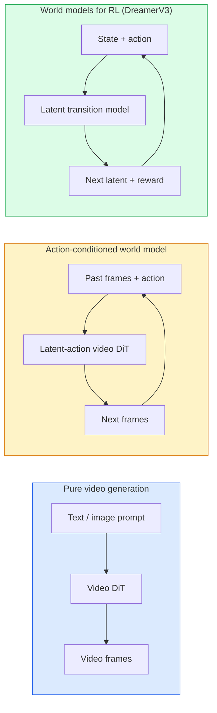

# दुनिया के मॉडल और वीडियो प्रसारण

> एक वीडियो मॉडल जो एक दृश्य के अगले सेकंड की भविष्यवाणी करता है एक दुनिया सिम्युलेटर है। कार्रवाई पर भविष्यवाणी की स्थिति और आप एक सीखे खेल इंजन है।

**Type:** Learn + Build
**Languages:** Python
**Prerequisites:** Phase 4 Lesson 10 (Diffusion), Phase 4 Lesson 12 (Video Understanding), Phase 4 Lesson 23 (DiT + Rectified Flow)
**Time:** ~75 minutes

## सीखने के लक्ष्य

- एक शुद्ध वीडियो जनरेशन मॉडल (सोरा 2) और एक एक्शन-कंडीशनिंग वर्ल्ड मॉडल (जीन 3, ड्रीमरवी 3) के बीच अंतर समझाएं
- एक वीडियो का वर्णन करें डीआईटीः स्पेस-टाइम पैच, 3 डी स्थिति एन्कोडिंग, (टी, एच, डब्ल्यू) टोकन पर संयुक्त ध्यान
- विश्व मॉडल रोबोटिक्स में कैसे प्लग करता हैः वीएलएम योजनाएँ → वीडियो मॉडल अनुकरण करता है → उल्टा गतिशीलता कार्रवाई को उत्सर्जित करती है
- एक दिए गए उपयोग के मामले के लिए सोरा 2, जीन 3, रनवे GWM-1 वर्ल्ड्स, वान-वीडियो और हनुआनवीडियो के बीच चयन करें (क्रिएटिव वीडियो, इंटरैक्टिव सिम, स्वायत्त ड्राइविंग संश्लेषण)

## समस्या

वीडियो पीढ़ी और विश्व मॉडलिंग 2026 में एक साथ आए। एक मॉडल जो एक सुसंगत मिनट का वीडियो उत्पन्न कर सकता है, किसी तरह से, दुनिया कैसे चलती है, यह सीखा हैः वस्तु स्थायित्व, गुरुत्वाकर्षण, कारणता, शैली। यदि आप क्रियाओं पर भविष्यवाणी को शर्त दें (बाएं चलें, दरवाजा खोलें), तो वीडियो मॉडल एक सीखने योग्य सिम्युलेटर बन जाता है जो गेम इंजन, ड्राइविंग सिम्युलेटर या रोबोटिक्स वातावरण की जगह ले सकता है।

दांव ठोस हैं। जीन 3 एक छवि से प्ले करने योग्य वातावरण उत्पन्न करता है। रनवे GWM-1 वर्ल्ड्स अनंत खोज योग्य दृश्यों को संश्लेषित करता है। सोरा 2 सिंक्रनाइज़्ड ऑडियो और मॉडलिंग भौतिकी के साथ मिनटों के वीडियो का उत्पादन करता है। एनवीआईडीए कॉस्मोस-ड्राइव, वेव गेया-2 और टेस्ला ड्राइविंग वर्ल्ड स्वायत्त वाहन प्रशिक्षण डेटा के लिए यथार्थवादी ड्राइविंग वीडियो उत्पन्न करते हैं। विश्व मॉडल प्रतिमान रोबोटिक्स के लिए सिम-टू-रियल को चुपचाप ले रहा है।

यह पाठ चरण 4 के लिए "बड़ी तस्वीर" पाठ है। यह छवि उत्पादन, वीडियो समझ और एजेंटिक तर्क को वास्तुकला पैटर्न में जोड़ता है जिस दिशा में प्रमुख अनुसंधान आगे बढ़ रहा है।

## अवधारणा

### विश्व मॉडल के तीन परिवार



- **Sora 2**यह शुद्ध वीडियो पीढ़ी है जो संकेतों पर आधारित है. कोई कार्रवाई इंटरफ़ेस नहीं है. आप इसे मध्य रोलआउट में "निर्देशित" नहीं कर सकते.
- **Genie 3**,**GWM-1 Worlds**,**Mirage / Magica**क्रिया-संशोधित दुनिया मॉडल हैं। अवलोकन वीडियो से लटेंट क्रियाएं इंफेर करें, फिर क्रियाओं पर भविष्य के फ्रेम भविष्यवाणियों को संशोधित करें। इंटरैक्टिव  आप कुंजी दबाएं या कैमरा स्थानांतरित करें और दृश्य प्रतिक्रिया करता है।
- **DreamerV3**और क्लासिक आरएल विश्व मॉडल परिवार एक लटेंट अंतरिक्ष में भविष्यवाणी करता है स्पष्ट कार्रवाई कंडीशनिंग, एक पुरस्कार संकेत पर प्रशिक्षित। कम दृश्य; नमूना कुशल आरएल के लिए अधिक उपयोगी।

### वीडियो डीआईटी वास्तुकला

```
Video latent:          (C, T, H, W)
Patchify (spatial):    grid of P_h x P_w patches per frame
Patchify (temporal):   group P_t frames into a temporal patch
Resulting tokens:      (T / P_t) * (H / P_h) * (W / P_w) tokens
```

स्थिति कोडिंग 3D हैः प्रति (t, h, w) निर्देशांक पर एक घूर्णन या सीखा एम्बेडिंग। ध्यान दिया जा सकता हैः

- **Full joint** सभी टोकन सभी टोकन पर ध्यान देते हैं। O(N ^ 2) N टोकन के साथ। लंबे वीडियो के लिए प्रतिबंधित।
- **Divided** समय पर ध्यान देने का विकल्प (एक ही स्थानिक स्थिति, समय के साथः `(H*W) * T^2`) और स्थानिक ध्यान (एक ही समय चरण, अंतरिक्ष मेंः `T * (H*W)^2`) टाइमस्फॉर्मर और अधिकांश वीडियो डीटी द्वारा उपयोग किया जाता है।
- **Window** स्थानीय विंडो में (t, h, w) । वीडियो स्विन द्वारा उपयोग किया जाता है।

प्रत्येक 2026 वीडियो विसारण मॉडल इन तीन पैटर्न में से एक के साथ-साथ AdaLN कंडीशनिंग (पाठ 23) और सुधारित प्रवाह का उपयोग करता है।

### कार्य के लिए शर्तेंः लटेंट कार्य मॉडल

जीन एक सीखता है **latent action**प्रति फ्रेम एक जोड़ी के बीच कार्रवाई की भेदभावपूर्ण भविष्यवाणी करके। मॉडल का डिकोडर फिर निष्कर्षित लटेंट कार्रवाई पर शर्तें  स्पष्ट कीबोर्ड कुंजी पर नहीं। निष्कर्षण पर, एक उपयोगकर्ता एक लटेंट कार्रवाई निर्दिष्ट कर सकता है (या एक नए पूर्व से एक नमूना) और मॉडल उस कार्रवाई के अनुरूप अगली फ्रेम उत्पन्न करता है।

सोरा पूरी तरह से एक्शन इंटरफेस को छोड़ देता है। इसका डिकोडर अतीत के स्पेसटाइम टोकन से अगले स्पेसटाइम टोकन की भविष्यवाणी करता है। त्वरित स्थिति शुरुआत; कुछ भी इसे मध्य पीढ़ी को निर्देशित नहीं करता है।

### भौतिक विश्वसनीयता

सोरा 2 की 2026 रिलीज का स्पष्ट रूप से विज्ञापन **physical plausibility**: वजन, संतुलन, वस्तु स्थायित्व, कारण-प्रभाव। टीम द्वारा हस्त-मूल्यांकन विश्वसनीयता स्कोर के माध्यम से मापा गया; मॉडल में गिराए गए वस्तुओं, अक्षरों के टकराव और उद्देश्य पर विफलताओं (एक चूक कूद) के खिलाफ स्पष्ट रूप से सुधार होता है।

तर्कसंगतता प्रमुख विफलता मोड बनी हुई है। 2024-2025 वीडियो में लोगों ने स्पैगेटी खाया या चश्मे से पीने से मॉडल की निरंतर वस्तु प्रतिनिधित्व की कमी का पता चला। 2026 मॉडल (सोरा 2, रनवे जेन-5, हनुआनवीडियो) इन को कम करते हैं लेकिन उन्हें समाप्त नहीं करते हैं।

### स्वायत्त ड्राइविंग के विश्व मॉडल

ड्राइविंग वर्ल्ड मॉडल ट्रैक, बॉर्डरिंग बॉक्स या नेविगेशन मैप पर आधारित यथार्थवादी सड़क दृश्य उत्पन्न करते हैं। उपयोगः

- **Cosmos-Drive-Dreams**(NVIDIA) RL प्रशिक्षण के लिए मिनट ड्राइविंग वीडियो उत्पन्न करता है।
- **Gaia-2**(व्यू)  नीति मूल्यांकन के लिए ट्रैकटोरिया-कंडीशनिंग दृश्य संश्लेषण।
- **DrivingWorld**(टेस्ला)  विविध मौसम, दिन के समय, यातायात की स्थिति का अनुकरण करता है।
- **Vista**(बाइटडांस)  प्रतिक्रियाशील ड्राइविंग दृश्य संश्लेषण.

वे कोने के मामलों के लिए महंगे वास्तविक दुनिया डेटा संग्रह की जगह लेते हैं  रात में पैदल यात्री जेयवॉक, बर्फ के चौराहे, असामान्य वाहन प्रकार  जो अन्यथा लाखों मील की ड्राइविंग की आवश्यकता होगी।

### रोबोटिक्स स्टैकः VLM + वीडियो मॉडल + रिवर्स डायनामिक्स

तीन घटक रोबोटिक्स लूप उभर रहा हैः

1. **VLM**लक्ष्य का विश्लेषण करता है ("लाल कप उठाएं"), उच्च स्तर की कार्रवाई अनुक्रम की योजना बनाता है।
2. **Video generation model**अनुकरण करता है कि प्रत्येक कार्रवाई को निष्पादित करने के रूप में लग रहा होगा  भविष्यवाणी करता है अवलोकन N फ्रेम आगे.
3. **Inverse dynamics model**इन अवलोकनों को उत्पन्न करने वाले ठोस मोटर कमांड को निकालता है।

यह इनाम आकार और नमूना-भारी आरएल की जगह लेता है। विश्व मॉडल कल्पना करता है; विपरीत गतिशीलता एक्ट्यूएशन पर लूप को बंद करती है। जीन इश्युएटर एक उदाहरण है; कई शोध समूह इस संरचना पर अभिसरण कर रहे हैं।

### मूल्यांकन

- **Visual quality** FVD (Fréchet Video Distance), उपयोगकर्ता अध्ययन।
- **Prompt alignment** प्रति फ्रेम क्लिप्स स्कोर, वीक्यूए शैली मूल्यांकन।
- **Physical plausibility** एक बेंचमार्क सूट पर हस्त रेटेड (सोरा 2 का आंतरिक बेंचमार्क, VBench) ।
- **Controllability**(आक्रामक दुनिया मॉडल के लिए)  कार्रवाई → अवलोकन सुसंगतता; क्या आप एक पूर्व स्थिति में वापस जा सकते हैं?

### 2026 में मॉडल परिदृश्य

| Model | Use | Parameters | Output | License |
|-------|-----|------------|--------|---------|
| Sora 2 | text-to-video, audio | — | 1-min 1080p + audio | API only |
| Runway Gen-5 | text/image-to-video | — | 10s clips | API |
| Runway GWM-1 Worlds | interactive world | — | infinite 3D rollout | API |
| Genie 3 | interactive world from image | 11B+ | playable frames | research preview |
| Wan-Video 2.1 | open text-to-video | 14B | high-quality clips | non-commercial |
| HunyuanVideo | open text-to-video | 13B | 10s clips | permissive |
| Cosmos / Cosmos-Drive | autonomous driving sim | 7-14B | driving scenes | NVIDIA open |
| Magica / Mirage 2 | AI-native game engine | — | modifiable worlds | product |

```figure
v4-world-rollout
```

## इसे बनाओ

### चरण 1: वीडियो के लिए 3D patchify

```python
import torch
import torch.nn as nn


class VideoPatch3D(nn.Module):
    def __init__(self, in_channels=4, dim=64, patch_t=2, patch_h=2, patch_w=2):
        super().__init__()
        self.proj = nn.Conv3d(
            in_channels, dim,
            kernel_size=(patch_t, patch_h, patch_w),
            stride=(patch_t, patch_h, patch_w),
        )
        self.patch_t = patch_t
        self.patch_h = patch_h
        self.patch_w = patch_w

    def forward(self, x):
        # x: (N, C, T, H, W)
        x = self.proj(x)
        n, c, t, h, w = x.shape
        tokens = x.reshape(n, c, t * h * w).transpose(1, 2)
        return tokens, (t, h, w)
```

नाभिक के बराबर कदम के साथ एक 3D conv अंतरिक्ष-समय patchifier के रूप में कार्य करता है। `(T, H, W) -> (T/2, H/2, W/2)`टोकन ग्रिड।

### चरण 2: 3D घूर्णन स्थिति एन्कोडिंग

रोटररी पोजीशन एम्बेडिंग (RoPE) अलग से लगाए जाते हैं `t`,`h`,`w`धुरीः

```python
def rope_3d(tokens, t_dim, h_dim, w_dim, grid):
    """
    tokens: (N, T*H*W, D)
    grid: (T, H, W) sizes
    t_dim + h_dim + w_dim == D
    """
    T, H, W = grid
    n, seq, d = tokens.shape
    if t_dim + h_dim + w_dim != d:
        raise ValueError(f"t_dim+h_dim+w_dim ({t_dim}+{h_dim}+{w_dim}) must equal D={d}")
    assert seq == T * H * W
    t_idx = torch.arange(T, device=tokens.device).repeat_interleave(H * W)
    h_idx = torch.arange(H, device=tokens.device).repeat_interleave(W).repeat(T)
    w_idx = torch.arange(W, device=tokens.device).repeat(T * H)
    # Simplified: just scale channels by frequencies. Real RoPE rotates pairs.
    freqs_t = torch.exp(-torch.log(torch.tensor(10000.0)) * torch.arange(t_dim // 2, device=tokens.device) / (t_dim // 2))
    freqs_h = torch.exp(-torch.log(torch.tensor(10000.0)) * torch.arange(h_dim // 2, device=tokens.device) / (h_dim // 2))
    freqs_w = torch.exp(-torch.log(torch.tensor(10000.0)) * torch.arange(w_dim // 2, device=tokens.device) / (w_dim // 2))
    emb_t = torch.cat([torch.sin(t_idx[:, None] * freqs_t), torch.cos(t_idx[:, None] * freqs_t)], dim=-1)
    emb_h = torch.cat([torch.sin(h_idx[:, None] * freqs_h), torch.cos(h_idx[:, None] * freqs_h)], dim=-1)
    emb_w = torch.cat([torch.sin(w_idx[:, None] * freqs_w), torch.cos(w_idx[:, None] * freqs_w)], dim=-1)
    return tokens + torch.cat([emb_t, emb_h, emb_w], dim=-1)
```

सरल योजक रूप। वास्तविक रोपीई आवृत्तियों पर जोड़े गए चैनलों को घूमता है; स्थिति जानकारी समान है।

### चरण 3: ध्यान को विभाजित करना

```python
class DividedAttentionBlock(nn.Module):
    def __init__(self, dim=64, heads=2):
        super().__init__()
        self.time_attn = nn.MultiheadAttention(dim, heads, batch_first=True)
        self.space_attn = nn.MultiheadAttention(dim, heads, batch_first=True)
        self.ln1 = nn.LayerNorm(dim)
        self.ln2 = nn.LayerNorm(dim)
        self.ln3 = nn.LayerNorm(dim)
        self.mlp = nn.Sequential(nn.Linear(dim, 4 * dim), nn.GELU(), nn.Linear(4 * dim, dim))

    def forward(self, x, grid):
        T, H, W = grid
        n, seq, d = x.shape
        # time attention: same (h, w), across t
        xt = x.view(n, T, H * W, d).permute(0, 2, 1, 3).reshape(n * H * W, T, d)
        a, _ = self.time_attn(self.ln1(xt), self.ln1(xt), self.ln1(xt), need_weights=False)
        xt = (xt + a).reshape(n, H * W, T, d).permute(0, 2, 1, 3).reshape(n, seq, d)
        # space attention: same t, across (h, w)
        xs = xt.view(n, T, H * W, d).reshape(n * T, H * W, d)
        a, _ = self.space_attn(self.ln2(xs), self.ln2(xs), self.ln2(xs), need_weights=False)
        xs = (xs + a).reshape(n, T, H * W, d).reshape(n, seq, d)
        xs = xs + self.mlp(self.ln3(xs))
        return xs
```

समय ध्यान समय के साथ प्रत्येक स्थानिक स्थिति के भीतर रहता है; स्थान ध्यान प्रत्येक फ्रेम के भीतर स्थानों के बीच रहता है। एक O((THW) ^2 के बजाय दो O(T^2 + (HW) ^2) संचालन। यह टाइमस्फॉर्म और हर आधुनिक वीडियो डीटी का मूल है।

### चरण 4: एक छोटा वीडियो लिखें

```python
class TinyVideoDiT(nn.Module):
    def __init__(self, in_channels=4, dim=64, depth=2, heads=2):
        super().__init__()
        self.patch = VideoPatch3D(in_channels=in_channels, dim=dim, patch_t=2, patch_h=2, patch_w=2)
        self.blocks = nn.ModuleList([DividedAttentionBlock(dim, heads) for _ in range(depth)])
        self.out = nn.Linear(dim, in_channels * 2 * 2 * 2)

    def forward(self, x):
        tokens, grid = self.patch(x)
        for blk in self.blocks:
            tokens = blk(tokens, grid)
        return self.out(tokens), grid
```

काम करने वाला वीडियो जनरेटर नहीं, बल्कि एक संरचनात्मक डेमो जो प्रत्येक टुकड़े को सही ढंग से आकार देता है।

### चरण 5: आकारों की जांच करें

```python
vid = torch.randn(1, 4, 8, 16, 16)  # (N, C, T, H, W)
model = TinyVideoDiT()
out, grid = model(vid)
print(f"input  {tuple(vid.shape)}")
print(f"tokens grid {grid}")
print(f"output {tuple(out.shape)}")
```

प्रतीक्षा करें`grid = (4, 8, 8)`और `out = (1, 256, 32)`पैचिंग के बाद; सिर फिर प्रति टोकन स्थान-समय पैच पर प्रक्षेपित, एक वीडियो में वापस un-पैचिंग करने के लिए तैयार है।

## इसका प्रयोग करें

2026 के लिए उत्पादन पहुंच पैटर्नः

- **Sora 2 API**(OpenAI)  पाठ से वीडियो, सिंक्रनाइज़्ड ऑडियो. प्रीमियम मूल्य निर्धारण.
- **Runway Gen-5 / GWM-1**(रनवे)  छवि से वीडियो, इंटरैक्टिव दुनिया।
- **Wan-Video 2.1 / HunyuanVideo** ओपन सोर्स सेल्फ होस्ट।
- **Cosmos / Cosmos-Drive**(NVIDIA)  ड्राइविंग सिमुलेशन खुले वजन.
- **Genie 3** अनुसंधान पूर्वावलोकन, प्रवेश का अनुरोध।

इंटरैक्टिव वर्ल्ड मॉडल डेमो बनाने के लिएः गुणवत्ता के लिए वान-वीडियो से शुरू करें, इंटरएक्टिविटी के लिए लोटेंट-एक्शन एडाप्टर पर परतें। स्वायत्त ड्राइविंग सिमुलेशन के लिएः कॉस्मोस-ड्राइव 2026 खुला संदर्भ है।

रोबोटिक्स के लिए, जंगली में ढेरः

1. भाषा लक्ष्य -> VLM (Qwen3-VL) -> उच्च स्तरीय योजना।
2. योजना -> लटेंट-एक्शन वीडियो मॉडल -> कल्पना रोलआउट।
3. रोलआउट -> उल्टा गतिशीलता मॉडल -> निम्न स्तर की कार्रवाई।
4. कार्रवाई निष्पादित -> अवलोकन चरण 1 में वापस डाला गया।

## इसे भेजें

इस पाठ से उत्पन्न होता हैः

- `outputs/prompt-video-model-picker.md` सोरा 2 / रनवे / वान / हनुआनवीडियो / कॉस्मोस के बीच चयन कार्य, लाइसेंस और विलंबता के अनुसार।
- `outputs/skill-physical-plausibility-checks.md` एक कौशल जो शिपिंग से पहले किसी भी उत्पन्न वीडियो पर चलने के लिए स्वचालित जांच (वस्तु स्थायित्व, गुरुत्वाकर्षण, निरंतरता) को परिभाषित करता है।

## व्यायाम

1. **(Easy)**पैच-t=2, पैच-h=8, पैच-w=8 पर 5 सेकंड के 360p वीडियो के लिए टोकन की गणना करें। इस आकार पर ध्यान देने के लिए मेमोरी के बारे में तर्क।
2. **(Medium)**ऊपर दिए गए विभाजित ध्यान ब्लॉक को एक पूर्ण संयुक्त ध्यान ब्लॉक के लिए बदलें और आकार और पैरामीटर की गिनती को मापें। समझाएं कि वास्तविक वीडियो मॉडल के लिए विभाजित ध्यान क्यों आवश्यक है।
3. **(Hard)**एक न्यूनतम लटेंट-एक्शन वीडियो मॉडल बनाएंः (फ्रेम_टी, एक्शन_टी, फ्रेम_{t+1}) ट्रिपल (किसी भी सरल 2 डी गेम) का डेटासेट लें, एक्शन एम्बेडमेंट पर कंडीशनिंग वाले एक छोटे से वीडियो डीटी को प्रशिक्षित करें, और दिखाएं कि विभिन्न क्रियाएं विभिन्न अगली फ्रेम का उत्पादन करती हैं।

## प्रमुख शर्तें

| Term | What people say | What it actually means |
|------|----------------|----------------------|
| World model | "Learned simulator" | A model that predicts future observations given state and action |
| Video DiT | "Spacetime transformer" | Diffusion transformer with 3D patchification and divided attention |
| Latent action | "Inferred control" | Discrete or continuous action latent inferred from frame pairs; used to condition next-frame generation |
| Divided attention | "Time then space" | Two attention operations per block — across time then across space — to keep O(N^2) manageable |
| Object permanence | "Things stay real" | Scene property that video models must learn; classic failure mode on food, glassware |
| FVD | "Fréchet Video Distance" | Video equivalent of FID; primary visual quality metric |
| Inverse dynamics model | "Observations to actions" | Given (state, next state), output the action that connects them; closes robotics loop |
| Cosmos-Drive | "NVIDIA driving sim" | Open-weights autonomous-driving world model for RL and evaluation |

## आगे पढ़ना

- [Sora technical report (OpenAI)](https://openai.com/index/video-generation-models-as-world-simulators/)
- [Genie: Generative Interactive Environments (Bruce et al., 2024)](https://arxiv.org/abs/2402.15391) लटेंट एक्शन वर्ल्ड मॉडल
- [TimeSformer (Bertasius et al., 2021)](https://arxiv.org/abs/2102.05095) वीडियो ट्रांसफार्मर के लिए विभाजित ध्यान
- [DreamerV3 (Hafner et al., 2023)](https://arxiv.org/abs/2301.04104) आरएल के लिए विश्व मॉडल
- [Cosmos-Drive-Dreams (NVIDIA, 2025)](https://research.nvidia.com/labs/toronto-ai/cosmos-drive-dreams/) ड्राइविंग वर्ल्ड मॉडल
- [Top 10 Video Generation Models 2026 (DataCamp)](https://www.datacamp.com/blog/top-video-generation-models)
- [From Video Generation to World Model — survey repo](https://github.com/ziqihuangg/Awesome-From-Video-Generation-to-World-Model/)
