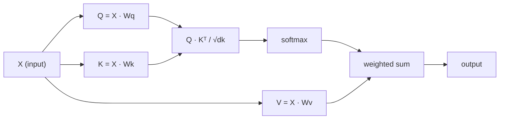

# खुद पर ध्यान देना

> ध्यान एक खोज तालिका है जहाँ हर शब्द पूछता है "मेरे लिए कौन मायने रखता है?" - और जवाब सीखता है।

**Type:** Build
**Languages:** Python
**Prerequisites:** Phase 3 (Deep Learning Core), Phase 5 Lesson 10 (Sequence-to-Sequence)
**Time:** ~90 minutes

## सीखने के लक्ष्य

- केवल NumPy का उपयोग करके स्केल-डॉट-प्रोडक्ट स्व-विचार को स्क्रैच से लागू करें, जिसमें क्वेरी/की/मूल्य अनुमान और सॉफ्टमैक्स-वेटेड योग शामिल है
- एक बहु-हेड ध्यान परत बनाएं जो सिरों को विभाजित करता है, समानांतर ध्यान की गणना करता है, और परिणामों को एक साथ जोड़ता है
- ध्यान मैट्रिक्स टोकन संबंधों को कैसे कैप्चर करता है इसका पता लगाएं और समझाएं कि क्यूआरटी द्वारा स्केलिंग सॉफ्टमैक्स संतृप्ति को रोकती है
- दो दिशाओं के ध्यान को ऑटोरेग्रेसिव (डेकोडर शैली) ध्यान में परिवर्तित करने के लिए कारणात्मक मास्किंग का उपयोग करें

## समस्या

आरएनएन एक समय में एक टोकन को क्रमबद्ध करता है। जब तक आप टोकन 50 तक पहुंच जाते हैं, तब तक टोकन 1 से जानकारी को 50 संपीड़न चरणों के माध्यम से दबा दिया जाता है। लंबी दूरी की निर्भरता एक निश्चित आकार की छिपी हुई स्थिति में कुचल जाती है - एक बोतल की गर्दन जो LSTM गेटिंग की कोई मात्रा पूरी तरह से हल नहीं करती है।

2014 के बहदानु ध्यान पत्र ने फिक्स दिखायाः डिकोडर को प्रत्येक एन्कोडर स्थिति को पीछे देखने दें और यह तय करें कि वर्तमान चरण के लिए कौन से मायने रखते हैं। लेकिन यह अभी भी एक आरएनएन पर बुल्ट किया गया था। 2017 के "अंतर्वार्ता आपको केवल एक चीज की आवश्यकता है" पेपर ने एक तेज सवाल पूछाः क्या होगा यदि ध्यान * केवल * तंत्र है? कोई पुनरावृत्ति नहीं। कोई घुमाव नहीं। बस ध्यान।

आत्म-ध्यान एक अनुक्रम में प्रत्येक स्थिति को एक समानान्तर चरण में प्रत्येक अन्य स्थिति की देखभाल करने की अनुमति देता है। यही ट्रांसफार्मर को तेज, स्केलेबल और प्रमुख बनाता है।

## अवधारणा

### डेटाबेस खोज एनालॉग

ध्यान को एक नरम डेटाबेस खोज के रूप में सोचेंः

```
Traditional database:
  Query: "capital of France"  -->  exact match  -->  "Paris"

Attention:
  Query: "capital of France"  -->  similarity to ALL keys  -->  weighted blend of ALL values
```

प्रत्येक टोकन तीन वेक्टर उत्पन्न करता हैः
- **Query (Q)**"मैं क्या खोज रहा हूँ?
- **Key (K)**"मैं क्या शामिल है?
- **Value (V)**: "यदि चयनित हो तो मैं क्या जानकारी प्रदान करूँ?

एक क्वेरी और सभी कुंजी के बीच बिंदु उत्पाद ध्यान स्कोर का उत्पादन करता है। उच्च स्कोर का मतलब है "यह कुंजी मेरी क्वेरी से मेल खाती है।" उन स्कोर का वजन मानों है। आउटपुट मानों का एक भारित योग है।

### Q, K, V गणना

प्रत्येक टोकन एम्बेडिंग तीन सीखे वजन मैट्रिक्स के माध्यम से प्रक्षेपित किया जाता हैः

```
Input embeddings (sequence of n tokens, each d-dimensional):

  X = [x1, x2, x3, ..., xn]       shape: (n, d)

Three weight matrices:

  Wq  shape: (d, dk)
  Wk  shape: (d, dk)
  Wv  shape: (d, dv)

Projections:

  Q = X @ Wq    shape: (n, dk)      each token's query
  K = X @ Wk    shape: (n, dk)      each token's key
  V = X @ Wv    shape: (n, dv)      each token's value
```

दृश्य रूप से, एक संकेत के लिएः

```
             Wq
  x_i ------[*]------> q_i    "What am I looking for?"
       |
       |     Wk
       +----[*]------> k_i    "What do I contain?"
       |
       |     Wv
       +----[*]------> v_i    "What do I offer?"
```

### ध्यान मैट्रिक्स

एक बार जब आप सभी टोकन के लिए Q, K, V है, ध्यान स्कोर एक मैट्रिक्स बनाते हैंः

```
Scores = Q @ K^T    shape: (n, n)

              k1    k2    k3    k4    k5
        +-----+-----+-----+-----+-----+
   q1   | 2.1 | 0.3 | 0.1 | 0.8 | 0.2 |   <- how much q1 attends to each key
        +-----+-----+-----+-----+-----+
   q2   | 0.4 | 1.9 | 0.7 | 0.1 | 0.3 |
        +-----+-----+-----+-----+-----+
   q3   | 0.2 | 0.6 | 2.3 | 0.5 | 0.1 |
        +-----+-----+-----+-----+-----+
   q4   | 0.9 | 0.1 | 0.4 | 1.7 | 0.6 |
        +-----+-----+-----+-----+-----+
   q5   | 0.1 | 0.3 | 0.2 | 0.5 | 2.0 |
        +-----+-----+-----+-----+-----+

Each row: one token's attention over the entire sequence
```

एक बार में एक क्वेरी को देखें कुंजी को झाड़ते हैंः प्रत्येक पंक्ति प्रत्येक टोकन को स्कोर करती है, सॉफ्टमैक्स स्कोर को वजन में बदल देता है, और संदर्भ वेक्टर मानों का वजन मिश्रण है।

```figure
attention-matrix
```

### पैमाना क्यों?

यदि dk = 64, तो डॉट उत्पाद दसियों की सीमा में हो सकते हैं, जिससे सॉफ्टमैक्स को उन क्षेत्रों में धकेल दिया जा सकता है जहां ग्रेडिएंट गायब हो जाते हैं। फिक्सः वर्ग द्वारा विभाजित करें।

```
Scaled scores = (Q @ K^T) / sqrt(dk)
```

यह मानों को एक सीमा में रखता है जहां सॉफ्टमैक्स उपयोगी ग्रेडिएंट उत्पन्न करता है।

### सॉफ्टमैक्स स्कोर को वजन में बदल देता है

सॉफ्टमैक्स कच्चे स्कोर को प्रत्येक पंक्ति में संभावना वितरण में परिवर्तित करता हैः

```
Raw scores for q1:   [2.1, 0.3, 0.1, 0.8, 0.2]
                            |
                         softmax
                            |
Attention weights:   [0.52, 0.09, 0.07, 0.14, 0.08]   (sums to ~1.0)
```

अब प्रत्येक टोकन में एक सेट वजन है जो बताता है कि प्रत्येक अन्य टोकन पर कितना ध्यान देना है।

### मानों का वजन किया गया योग

प्रत्येक टोकन के लिए अंतिम आउटपुट सभी मूल्य वेक्टरों का एक भारित योग हैः

```
output_i = sum( attention_weight[i][j] * v_j  for all j )

For token 1:
  output_1 = 0.52 * v1 + 0.09 * v2 + 0.07 * v3 + 0.14 * v4 + 0.08 * v5
```

### पूर्ण पाइपलाइन



एक पंक्ति में सूत्रः

```
Attention(Q, K, V) = softmax( Q @ K^T / sqrt(dk) ) @ V
```

```figure
softmax-attention-scaling
```

## इसे बनाओ

### चरण 1: स्क्रैच से सॉफ्टमैक्स

सॉफ्टमैक्स कच्चे लॉग को संभावनाओं में परिवर्तित करता है। संख्यात्मक स्थिरता के लिए अधिकतम घटाएं।

```python
import numpy as np

def softmax(x):
    shifted = x - np.max(x, axis=-1, keepdims=True)
    exp_x = np.exp(shifted)
    return exp_x / np.sum(exp_x, axis=-1, keepdims=True)

logits = np.array([2.0, 1.0, 0.1])
print(f"logits:  {logits}")
print(f"softmax: {softmax(logits)}")
print(f"sum:     {softmax(logits).sum():.4f}")
```

### चरण 2: स्केलेड डॉट-प्रोडक्ट ध्यान

कोर फ़ंक्शन. क्यू, के, वी मैट्रिक्स लेता है और ध्यान आउटपुट प्लस वजन मैट्रिक्स लौटाता है.

```python
def scaled_dot_product_attention(Q, K, V):
    dk = Q.shape[-1]
    scores = Q @ K.T / np.sqrt(dk)
    weights = softmax(scores)
    output = weights @ V
    return output, weights
```

### चरण 3: सीखे गए अनुमानों के साथ आत्म-ध्यान कक्षा

एक पूर्ण स्व-विचार मॉड्यूल के साथ Wq, Wk, Wv वजन मैट्रिक्स के साथ Xavier-जैसे स्केलिंग के साथ शुरू किया गया।

```python
class SelfAttention:
    def __init__(self, d_model, dk, dv, seed=42):
        rng = np.random.default_rng(seed)
        scale = np.sqrt(2.0 / (d_model + dk))
        self.Wq = rng.normal(0, scale, (d_model, dk))
        self.Wk = rng.normal(0, scale, (d_model, dk))
        scale_v = np.sqrt(2.0 / (d_model + dv))
        self.Wv = rng.normal(0, scale_v, (d_model, dv))
        self.dk = dk

    def forward(self, X):
        Q = X @ self.Wq
        K = X @ self.Wk
        V = X @ self.Wv
        output, weights = scaled_dot_product_attention(Q, K, V)
        return output, weights
```

### चरण 4: इसे एक वाक्य पर चलाएं

एक वाक्य के लिए नकली एम्बेड बनाएं और ध्यान वजन देखें।

```python
sentence = ["The", "cat", "sat", "on", "the", "mat"]
n_tokens = len(sentence)
d_model = 8
dk = 4
dv = 4

rng = np.random.default_rng(42)
X = rng.normal(0, 1, (n_tokens, d_model))

attn = SelfAttention(d_model, dk, dv, seed=42)
output, weights = attn.forward(X)

print("Attention weights (each row: where that token looks):\n")
print(f"{'':>6}", end="")
for token in sentence:
    print(f"{token:>6}", end="")
print()

for i, token in enumerate(sentence):
    print(f"{token:>6}", end="")
    for j in range(n_tokens):
        w = weights[i][j]
        print(f"{w:6.3f}", end="")
    print()
```

### चरण 5: ASCII हीटमैप के साथ ध्यान को दृश्यमान करें

त्वरित दृश्य के लिए पात्रों के लिए ध्यान वजन का नक्शा।

```python
def ascii_heatmap(weights, tokens, chars=" ░▒▓█"):
    n = len(tokens)
    print(f"\n{'':>6}", end="")
    for t in tokens:
        print(f"{t:>6}", end="")
    print()

    for i in range(n):
        print(f"{tokens[i]:>6}", end="")
        for j in range(n):
            level = int(weights[i][j] * (len(chars) - 1) / weights.max())
            level = min(level, len(chars) - 1)
            print(f"{'  ' + chars[level] + '   '}", end="")
        print()

ascii_heatmap(weights, sentence)
```

## इसका प्रयोग करें

पायटॉर्च की `nn.MultiheadAttention`क्या हम बनाया है, प्लस बहु-हेड विभाजन और आउटपुट प्रक्षेपण करता हैः

```python
import torch
import torch.nn as nn

d_model = 8
n_heads = 2
seq_len = 6

mha = nn.MultiheadAttention(embed_dim=d_model, num_heads=n_heads, batch_first=True)

X_torch = torch.randn(1, seq_len, d_model)

output, attn_weights = mha(X_torch, X_torch, X_torch)

print(f"Input shape:            {X_torch.shape}")
print(f"Output shape:           {output.shape}")
print(f"Attention weight shape: {attn_weights.shape}")
print(f"\nAttn weights (averaged over heads):")
print(attn_weights[0].detach().numpy().round(3))
```

मुख्य अंतरः मल्टी-हेड ध्यान समानांतर में कई ध्यान कार्यों को चलाता है, प्रत्येक आकार dk = d_model / n_heads के अपने स्वयं के Q, K, V अनुमानों के साथ, फिर परिणामों को संश्लेषित करता है। यह मॉडल को एक साथ विभिन्न संबंध प्रकारों पर ध्यान देने की अनुमति देता है।

## इसे भेजें

इस पाठ से उत्पन्न होता हैः
- `outputs/prompt-attention-explainer.md`- डेटाबेस खोज एनालॉग के माध्यम से ध्यान को समझाने के लिए एक संकेत

## व्यायाम

1. संशोधित करें`scaled_dot_product_attention`एक वैकल्पिक मास्क मैट्रिक्स को स्वीकार करने के लिए जो सॉफ्टमैक्स से पहले कुछ स्थितियों को नकारात्मक अनंत पर सेट करता है (इस तरह कारण / डिकोडर मास्किंग काम करता है)
2. मल्टी हेड ध्यान को स्क्रैच से लागू करेंः Q, K, V में विभाजित करें `n_heads`टुकड़े, प्रत्येक पर ध्यान चलाएं, एक साथ बंधा, और एक अंतिम वजन मैट्रिक्स के माध्यम से परियोजना Wo
3. एक ही लंबाई के दो अलग-अलग वाक्य लें, उन्हें एक ही स्व-ध्यान उदाहरण के माध्यम से खिलाएं, और उनके ध्यान पैटर्न की तुलना करें। क्या परिवर्तन? क्या वही रहता है?

## प्रमुख शर्तें

| Term | What people say | What it actually means |
|------|----------------|----------------------|
| Query (Q) | "The question vector" | A learned projection of the input that represents what information this token is looking for |
| Key (K) | "The label vector" | A learned projection that represents what information this token contains, matched against queries |
| Value (V) | "The content vector" | A learned projection carrying the actual information that gets aggregated based on attention scores |
| Scaled dot-product attention | "The attention formula" | softmax(QK^T / sqrt(dk)) @ V - scaling prevents softmax saturation in high dimensions |
| Self-attention | "The token looks at itself and others" | Attention where Q, K, V all come from the same sequence, letting every position attend to every other position |
| Attention weights | "How much focus" | A probability distribution over positions, produced by softmax over scaled dot products |
| Multi-head attention | "Parallel attention" | Running multiple attention functions with different projections, then concatenating results for richer representations |

## आगे पढ़ना

- [Attention Is All You Need (Vaswani et al., 2017)](https://arxiv.org/abs/1706.03762)- मूल ट्रांसफार्मर पेपर
- [The Illustrated Transformer (Jay Alammar)](https://jalammar.github.io/illustrated-transformer/)- पूर्ण वास्तुकला का सर्वश्रेष्ठ दृश्य पैदल यात्रा
- [The Annotated Transformer (Harvard NLP)](https://nlp.seas.harvard.edu/annotated-transformer/)- स्पष्टीकरण के साथ लाइन-दर-लाइन PyTorch कार्यान्वयन
