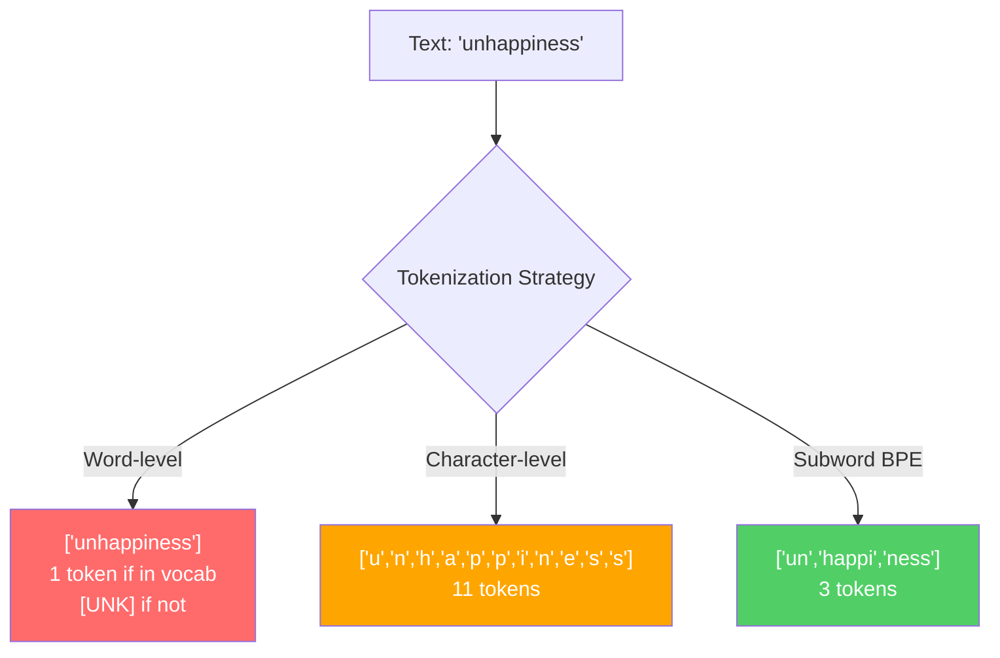
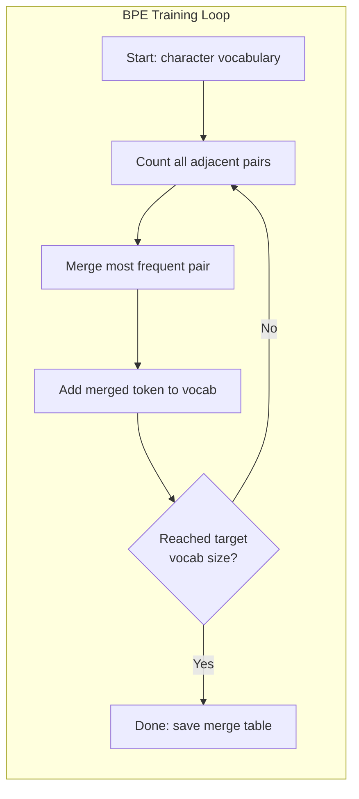
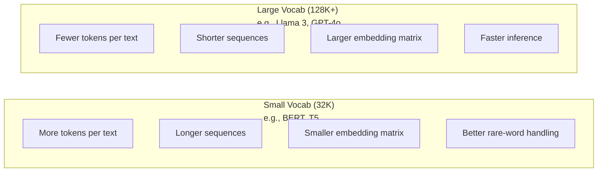

# टोकन बनाने वालेः बीपीई, वर्डपीस, सैंटेंसपीस

> आपका LLM अंग्रेजी नहीं पढ़ता है, यह पूर्णांक पढ़ता है। टोकनराइज़र तय करता है कि क्या ये पूर्णांक अर्थ रखते हैं या इसे बर्बाद करते हैं।

**Type:** Build
**Languages:** Python
**Prerequisites:** Phase 05 (NLP Foundations)
**Time:** ~90 minutes

## सीखने के लक्ष्य

- BPE, WordPiece, और Unigram टोकनकरण एल्गोरिदम को खरोंच से लागू करें और उनकी विलय रणनीतियों की तुलना करें
- व्याख्या करें कि शब्दावली का आकार मॉडल दक्षता को कैसे प्रभावित करता हैः बहुत छोटा लंबा अनुक्रम बनाता है, बहुत बड़ा अपशिष्ट पैरामीटर को एम्बेड करता है
- भाषाओं और कोड के बीच टोकनाइज़ेशन कलाकृतियों का विश्लेषण करें, यह पहचानें कि विशिष्ट टोकनाइज़र कहां टूटते हैं
- टेक्स्ट को टोकन बनाने और परिणाम टोकन आईडी की जांच करने के लिए टिक्टोकन और वाक्यांश टुकड़े पुस्तकालयों का उपयोग करें

## समस्या

आपका एमएलए अंग्रेजी नहीं पढ़ता है, यह किसी भी भाषा को नहीं पढ़ता है। यह संख्याओं को पढ़ता है।

"हैलो, दुनिया! " और [15496, 11, 995, 0] के बीच का अंतर टोकनाइज़र है। मॉडल इसे संसाधित करने से पहले प्रत्येक शब्द, प्रत्येक स्थान, प्रत्येक अंकन चिह्न को एक पूर्णांक में परिवर्तित किया जाना चाहिए। यह रूपांतरण तटस्थ नहीं है। यह मॉडल में धारणाओं को बेक करता है जिसे बाद में रद्द नहीं किया जा सकता है।

यह गलत हो जाओ और अपने मॉडल कई टोकन के साथ आम शब्दों को एन्कोडिंग क्षमता बर्बाद. "दुर्भाग्य से" एक के बजाय चार टोकन बन जाता है। आपके 128K संदर्भ विंडो सिर्फ 75% तक संकुचित बहु-शब्दाओं में भारी पाठ के लिए. इसे सही करें और एक ही संदर्भ विंडो में दो बार अधिक अर्थ होता है। "यह मॉडल कोड को अच्छी तरह से संभालता है" और "यह मॉडल पायथन पर थूकता है" के बीच अंतर अक्सर टोकनराइज़र को प्रशिक्षित करने के तरीके से नीचे आता है।

प्रत्येक एपीआई कॉल आप जीपीटी-4 या क्लाउड के लिए करते हैं प्रति टोकन की कीमत है. प्रत्येक टोकन आपके मॉडल उत्पन्न करता है लागत गणना. एक आउटपुट का प्रतिनिधित्व करने के लिए कम टोकन की आवश्यकता होती है, तेजी से अंत-से-अंत inference. Tokenization पूर्व प्रसंस्करण नहीं है. यह वास्तुकला है.

## अवधारणा

### तीन तरीके जो असफल हुए (और एक जो जीत गया)

पाठ को संख्याओं में बदलने के तीन स्पष्ट तरीके हैं जिनमें से दो पैमाने पर काम नहीं करते हैं।

**Word-level tokenization**"cat sat" ["the", "cat", "sat"] बन जाता है. सरल. लेकिन "tokenization" के बारे में क्या? या "GPT-4o"? या एक जर्मन यौगिक शब्द जैसे "Geschwindigkeitsbegrenzung"? शब्द स्तर प्रत्येक भाषा में प्रत्येक शब्द को कवर करने के लिए एक विशाल शब्दावली की आवश्यकता होती है. एक शब्द को याद करते हुए आप भयभीत हो जाते हैं`[UNK]`टोकन -- मॉडल का यह कहने का तरीका है "मुझे नहीं पता कि यह क्या है". अकेले अंग्रेजी में एक मिलियन से अधिक शब्द रूप हैं. कोड, URL, वैज्ञानिक संकेतन, और 100 अन्य भाषाओं को जोड़ें और आपको एक अंतहीन शब्दावली की आवश्यकता है।

**Character-level tokenization**"hello" ["h", "e", "l", "l", "o"] बन जाता है। शब्दावली छोटी है (कुछ सौ वर्ण) । कोई अज्ञात टोकन कभी नहीं। लेकिन अनुक्रम बेहद लंबा हो जाता है. एक वाक्य जो 10 शब्द स्तर टोकन होगा 50 वर्ण स्तर टोकन बन जाता है. मॉडल को सीखना होगा कि "t", "h", "e" एक साथ "the" का मतलब है -- एक इंसान को तीन साल की उम्र में सीखने की किसी चीज पर ध्यान देने की क्षमता को जलाना।

**Subword tokenization**सामान्य शब्द पूरे रहते हैंः "the" एक टोकन है। दुर्लभ शब्द सार्थक टुकड़ों में विघटित होते हैंः "असंतोष" ["un", "happy", "ness"] हो जाता है। शब्दावली प्रबंधनीय बनी रहती है (30K से 128K टोकन) । अनुक्रम छोटे रहते हैं। अज्ञात टोकन अनिवार्य रूप से गायब हो जाते हैं क्योंकि किसी भी शब्द को उपशब्दों के टुकड़ों से बनाया जा सकता है।

हर आधुनिक LLM उपशब्द टोकनकरण का उपयोग करता है. GPT-2, GPT-4, BERT, Llama 3, Claude - उन सभी. सवाल यह है कि कौन सा एल्गोरिथ्म है.



### बीपीईः बाइट जोड़ी एन्कोडिंग

बीपीई एक लालची संपीड़न एल्गोरिथ्म है जो टोकनकरण के लिए पुनः उपयोग किया गया है। यह विचार सूचकांक कार्ड पर फिट होने के लिए पर्याप्त सरल है।

प्रत्येक अक्षर को अलग से शुरू करें, प्रशिक्षण पाठ्यक्रम में प्रत्येक आसन्न जोड़ी को गिनें, सबसे अधिक बार होने वाले जोड़े को नए टोकन में मिलाएं, जब तक आप अपने लक्षित शब्दावली आकार तक नहीं पहुंच जाते, तब तक दोहराएं।

```figure
tokenizer-bpe
```

यहाँ BPE एक छोटे से corpus पर चल रहा है "निम्न", "सबसे कम", और "नवीनतम" शब्दों के साथः

```
Corpus (with word frequencies):
  "lower"  x5
  "lowest" x2
  "newest" x6

Step 0 -- Start with characters:
  l o w e r       (x5)
  l o w e s t     (x2)
  n e w e s t     (x6)

Step 1 -- Count adjacent pairs:
  (e,s): 8    (s,t): 8    (l,o): 7    (o,w): 7
  (w,e): 13   (e,r): 5    (n,e): 6    ...

Step 2 -- Merge most frequent pair (w,e) -> "we":
  l o we r        (x5)
  l o we s t      (x2)
  n e we s t      (x6)

Step 3 -- Recount and merge (e,s) -> "es":
  l o we r        (x5)
  l o we s t      (x2)    <- 'es' only forms from 'e'+'s', not 'we'+'s'
  n e we s t      (x6)    <- wait, the 'e' before 'we' and 's' after 'we'

Actually tracking this precisely:
  After "we" merge, remaining pairs:
  (l,o): 7   (o,we): 7   (we,r): 5   (we,s): 8
  (s,t): 8   (n,e): 6    (e,we): 6

Step 3 -- Merge (we,s) -> "wes" or (s,t) -> "st" (tied at 8, pick first):
  Merge (we,s) -> "wes":
  l o we r        (x5)
  l o wes t       (x2)
  n e wes t       (x6)

Step 4 -- Merge (wes,t) -> "west":
  l o we r        (x5)
  l o west        (x2)
  n e west        (x6)

...continue until target vocab size reached.
```

विलय तालिका टोकनराइज़र है। नए पाठ को कोड करने के लिए, वे सीखे गए क्रम में विलय लागू करें। प्रशिक्षण कॉर्पस निर्धारित करता है कि कौन से विलय मौजूद हैं, और यह विकल्प स्थायी रूप से आकार देता है कि मॉडल क्या देखता है।



### बाइट-स्तर बीपीई (जीपीटी-2, जीपीटी-3, जीपीटी-4)

मानक बीपीई यूनिकोड वर्णों पर काम करता है। बाइट-स्तर बीपीई कच्चे बाइट्स (0-255) पर काम करता है। यह आपको ठीक 256 की आधार शब्दावली देता है, किसी भी भाषा या एन्कोडिंग को संभालता है, और कभी भी अज्ञात टोकन का उत्पादन नहीं करता है।

जीपीटी-2 ने इस दृष्टिकोण को पेश किया। आधार शब्दावली हर संभव बाइट को कवर करती है। बीपीई इसके ऊपर बिल्ड करता है। ओपनएआई की टिक्टोकन लाइब्रेरी बाइट-स्तरीय बीपीई को इन शब्दावली आकारों के साथ लागू करती हैः

- जीपीटी-2: 50,257 टोकन
- GPT-3.5/GPT-4: ~100,256 टोकन (cl100k_base एन्कोडिंग)
- GPT-4o: 200,019 टोकन (o200k_base encoding)

### WordPiece (BERT)

WordPiece BPE के समान दिखता है लेकिन पिक अलग तरह से विलय करता है। कच्चे आवृत्ति के बजाय, यह प्रशिक्षण डेटा की संभावना को अधिकतम करता हैः

```
BPE merge criterion:      count(A, B)
WordPiece merge criterion: count(AB) / (count(A) * count(B))
```

बीपीई पूछता हैः "कौन सी जोड़ी सबसे अधिक बार दिखाई देती है?" वर्डपीस पूछता हैः "कौन सी जोड़ी आप आकस्मिक रूप से उम्मीद से अधिक बार एक साथ दिखाई देती है?" यह सूक्ष्म अंतर अलग-अलग शब्दावली पैदा करता है। वर्डपीस विलय को पसंद करता है जहां सह-घटना आश्चर्यजनक है, न कि केवल अक्सर।

वर्डपीस निरंतरता उपशब्दों के लिए एक "##" पूर्वावलोकन का भी उपयोग करता हैः

```
"unhappiness" -> ["un", "##happi", "##ness"]
"embedding"   -> ["em", "##bed", "##ding"]
```

"##" उपसर्ग आपको बताता है कि यह टुकड़ा पिछले टोकन का अनुसरण करता है। BERT 30,522 टोकन के साथ वर्डपीस का उपयोग करता है। प्रत्येक BERT संस्करण - DistilBERT, RoBERTa का टोकनराइज़र वास्तव में BPE है, लेकिन BERT स्वयं वर्डपीस है।

### वाक्यछंद (लमा, टी5)

SentencePiece इनपुट को व्हाइटस्पेस सहित यूनिकोड वर्णों की कच्ची धारा के रूप में व्यवहार करता है। कोई पूर्व-टोकनाइजेशन कदम नहीं है। शब्दों की सीमाओं के बारे में कोई भाषा-विशिष्ट नियम नहीं हैं। यह इसे वास्तव में भाषा-अज्ञानी बनाता है - यह चीनी, जापानी, थाई और अन्य भाषाओं पर काम करता है जहां स्थान शब्दों को अलग नहीं करते हैं।

SentencePiece दो एल्गोरिदम का समर्थन करता हैः
- **BPE mode**: मानक बीपीई के समान विलय तर्क, कच्चे वर्ण अनुक्रमों पर लागू
- **Unigram mode**: एक बड़ी शब्दावली के साथ शुरू होता है और फिर से टोकन को हटा देता है जो समग्र संभावना को कम से कम प्रभावित करता है। BPE का विपरीत - विलय के बजाय कटौती।

Llama 2 32000 टोकन के साथ SentencePiece BPE का उपयोग करता है। T5 32,000 टोकन के साथ SentencePiece Unigram का उपयोग करता है। नोटः Llama 3 ने 128,256 टोकन के साथ एक टिक टोकन आधारित बाइट-स्तर BPE टोकनराइज़र पर स्विच किया।

### शब्दावली आकार व्यापार

यह एक वास्तविक इंजीनियरिंग निर्णय है जिसके मापने योग्य परिणाम हैं।



कंक्रीट संख्याएं। 4,096-आयामी एम्बेडिंग के साथ 128K शब्दावली के लिए, एम्बेडिंग मैट्रिक्स अकेले 128,000 x 4,096 = 524 मिलियन पैरामीटर है। 32K शब्दावली के लिए, यह 131 मिलियन पैरामीटर है। यह अकेले टोकनराइज़र विकल्प से 400M पैरामीटर अंतर है।

लेकिन बड़ी शब्दावली पाठ को अधिक आक्रामक रूप से संपीड़ित करती है। एक ही अंग्रेजी पैराग्राफ जो 32K शब्दावली के साथ 100 टोकन लेता है, 128K शब्दावली के साथ 70 टोकन ले सकता है। इसका मतलब है कि उत्पादन के दौरान 30% कम आगे की उत्तीर्णियां होती हैं। लाखों अनुरोधों को पूरा करने वाले मॉडल के लिए, यह गणना लागत में प्रत्यक्ष कमी है।

प्रवृत्ति स्पष्ट हैः शब्दावली का आकार बढ़ रहा है। GPT-2 ने 50,257 का उपयोग किया। GPT-4 ने ~ 100K का उपयोग किया। Llama 3 ने 128K का उपयोग किया। GPT-4o ने 200K का उपयोग किया।

| Model | Vocab Size | Tokenizer Type | Avg Tokens per English Word |
|-------|-----------|----------------|---------------------------|
| BERT | 30,522 | WordPiece | ~1.4 |
| GPT-2 | 50,257 | Byte-level BPE | ~1.3 |
| Llama 2 | 32,000 | SentencePiece BPE | ~1.4 |
| GPT-4 | ~100,256 | Byte-level BPE | ~1.2 |
| Llama 3 | 128,256 | Byte-level BPE (tiktoken) | ~1.1 |
| GPT-4o | 200,019 | Byte-level BPE | ~1.0 |

### बहुभाषी कर

मुख्य रूप से अंग्रेजी में प्रशिक्षित टोकन बनाने वाले अन्य भाषाओं के प्रति क्रूर हैं। जीपीटी-2 के टोकन बनाने वाले में कोरियाई पाठ प्रति शब्द औसतन 2-3 टोकन है। चीनी खराब हो सकता है। इसका मतलब है कि कोरियाई उपयोगकर्ता के पास प्रभावी रूप से एक संदर्भ विंडो है जो अंग्रेजी उपयोगकर्ता के आकार का आधा है - कम सूचना घनत्व के लिए एक ही कीमत का भुगतान करना।

इसीलिए Llama 3 ने अपनी शब्दावली को 32K से बढ़ाकर 128K कर दिया है। गैर-अंग्रेजी स्क्रिप्ट के लिए समर्पित अधिक टोकन का मतलब है कि भाषाओं के बीच अधिक उचित संपीड़न।

```figure
tokenizer-tradeoff
```

## इसे बनाओ

### चरण 1: चरित्र स्तर टोकनाइज़र

मूल से शुरू करें. एक वर्ण स्तर टोकनराइज़र प्रत्येक वर्ण को उसके यूनिकोड कोड बिंदु पर मैप करता है. कोई प्रशिक्षण की आवश्यकता नहीं है. कोई अज्ञात टोकन नहीं. बस एक प्रत्यक्ष मैपिंग।

```python
class CharTokenizer:
    def encode(self, text):
        return [ord(c) for c in text]

    def decode(self, tokens):
        return "".join(chr(t) for t in tokens)
```

"hello" बन जाता है [104, 101, 108, 108, 111]. प्रत्येक चरित्र का अपना टोकन है. यह मूल रेखा है जिस पर हम सुधार करते हैं।

### चरण 2: स्क्रैच से BPE टोकनाइज़र

वास्तविक कार्यान्वयन. हम कच्चे बाइट्स (जैसे GPT-2), जोड़े गिनती, सबसे अधिक बार मिलाएं, और क्रम में प्रत्येक विलय रिकॉर्ड करते हैं। विलय तालिका टोकनराइज़र है।

```python
from collections import Counter

class BPETokenizer:
    def __init__(self):
        self.merges = {}
        self.vocab = {}

    def _get_pairs(self, tokens):
        pairs = Counter()
        for i in range(len(tokens) - 1):
            pairs[(tokens[i], tokens[i + 1])] += 1
        return pairs

    def _merge_pair(self, tokens, pair, new_token):
        merged = []
        i = 0
        while i < len(tokens):
            if i < len(tokens) - 1 and tokens[i] == pair[0] and tokens[i + 1] == pair[1]:
                merged.append(new_token)
                i += 2
            else:
                merged.append(tokens[i])
                i += 1
        return merged

    def train(self, text, num_merges):
        tokens = list(text.encode("utf-8"))
        self.vocab = {i: bytes([i]) for i in range(256)}

        for i in range(num_merges):
            pairs = self._get_pairs(tokens)
            if not pairs:
                break
            best_pair = max(pairs, key=pairs.get)
            new_token = 256 + i
            tokens = self._merge_pair(tokens, best_pair, new_token)
            self.merges[best_pair] = new_token
            self.vocab[new_token] = self.vocab[best_pair[0]] + self.vocab[best_pair[1]]

        return self

    def encode(self, text):
        tokens = list(text.encode("utf-8"))
        for pair, new_token in self.merges.items():
            tokens = self._merge_pair(tokens, pair, new_token)
        return tokens

    def decode(self, tokens):
        byte_sequence = b"".join(self.vocab[t] for t in tokens)
        return byte_sequence.decode("utf-8", errors="replace")
```

प्रशिक्षण लूप BPE का मूल हैः जोड़ों की गिनती, विजेता को मिलाएं, दोहराएं। प्रत्येक विलय टोकन की कुल संख्या को कम करता है।`num_merges`राउंड्स, शब्द संग्रह 256 (बेस बाइट्स) से 256 + num_merges तक बढ़ता है।

एन्कोडिंग को वे जिस क्रम में सीखते हैं उसी क्रम में विलय किया जाता है। यह मायने रखता है। यदि विलय 1 ने "th" बनाया और विलय 5 ने "the" बनाया, तो एन्कोडिंग को पहले विलय 1 को लागू करना चाहिए ताकि विलय 5 में "the" + "e" से "the" बन सके।

डिकोडिंग विपरीत हैः शब्दावली में प्रत्येक टोकन आईडी की तलाश करें, बाइट्स को एक साथ जोड़ें, UTF-8 में डिकोड करें।

### चरण 3: रंडट्रिप को एन्कोड और डिकोड करें

```python
corpus = (
    "The cat sat on the mat. The cat ate the rat. "
    "The dog sat on the log. The dog ate the frog. "
    "Natural language processing is the study of how computers "
    "understand and generate human language. "
    "Tokenization is the first step in any NLP pipeline."
)

tokenizer = BPETokenizer()
tokenizer.train(corpus, num_merges=40)

test_sentences = [
    "The cat sat on the mat.",
    "Natural language processing",
    "tokenization pipeline",
    "unhappiness",
]

for sentence in test_sentences:
    encoded = tokenizer.encode(sentence)
    decoded = tokenizer.decode(encoded)
    raw_bytes = len(sentence.encode("utf-8"))
    ratio = len(encoded) / raw_bytes
    print(f"'{sentence}'")
    print(f"  Tokens: {len(encoded)} (from {raw_bytes} bytes) -- ratio: {ratio:.2f}")
    print(f"  Roundtrip: {'PASS' if decoded == sentence else 'FAIL'}")
```

संपीड़न अनुपात आपको बताता है कि टोकनराइज़र कितना प्रभावी है। 0.50 का अनुपात का अर्थ है कि टोकनराइज़र ने पाठ को कच्चे बाइट्स के आधे से अधिक टोकन तक संपीड़ित किया। कम बेहतर है। प्रशिक्षण पाठ्यक्रम पर, अनुपात अच्छा होगा। वितरण से बाहर पाठ पर "असंतोष" (जो corpus में दिखाई नहीं देता है), अनुपात बदतर होगा - टोकनराइज़र अदृश्य पैटर्न के लिए वर्ण स्तर कोडिंग में वापस गिर जाता है।

### चरण 4: टिक टॉक के साथ तुलना करें

```python
import tiktoken

enc = tiktoken.get_encoding("cl100k_base")

texts = [
    "The cat sat on the mat.",
    "unhappiness",
    "Hello, world!",
    "def fibonacci(n): return n if n < 2 else fibonacci(n-1) + fibonacci(n-2)",
    "Geschwindigkeitsbegrenzung",
]

for text in texts:
    our_tokens = tokenizer.encode(text)
    tiktoken_tokens = enc.encode(text)
    tiktoken_pieces = [enc.decode([t]) for t in tiktoken_tokens]
    print(f"'{text}'")
    print(f"  Our BPE:   {len(our_tokens)} tokens")
    print(f"  tiktoken:  {len(tiktoken_tokens)} tokens -> {tiktoken_pieces}")
```

tiktoken एक ही एल्गोरिथ्म का उपयोग करता है लेकिन 100,000 विलय के साथ पाठ के सैकड़ों गीगाबाइट पर प्रशिक्षित किया गया है। एल्गोरिथ्म समान है। अंतर प्रशिक्षण डेटा और विलय की संख्या है। 40 विलय के साथ पैराग्राफ पर प्रशिक्षित आपका टोकन 40 विलय के साथ tiktoken के 100K विलय के साथ प्रतिस्पर्धा नहीं कर सकता है। लेकिन तंत्र एक विशाल corpus पर है।

### चरण 5: शब्दावली विश्लेषण

```python
def analyze_vocabulary(tokenizer, test_texts):
    total_tokens = 0
    total_chars = 0
    token_usage = Counter()

    for text in test_texts:
        encoded = tokenizer.encode(text)
        total_tokens += len(encoded)
        total_chars += len(text)
        for t in encoded:
            token_usage[t] += 1

    print(f"Vocabulary size: {len(tokenizer.vocab)}")
    print(f"Total tokens across all texts: {total_tokens}")
    print(f"Total characters: {total_chars}")
    print(f"Avg tokens per character: {total_tokens / total_chars:.2f}")

    print(f"\nMost used tokens:")
    for token_id, count in token_usage.most_common(10):
        token_bytes = tokenizer.vocab[token_id]
        display = token_bytes.decode("utf-8", errors="replace")
        print(f"  Token {token_id:4d}: '{display}' (used {count} times)")

    unused = [t for t in tokenizer.vocab if t not in token_usage]
    print(f"\nUnused tokens: {len(unused)} out of {len(tokenizer.vocab)}")
```

यह आपके शब्दावली में ज़िपफ़ वितरण का पता चलता है. कुछ टोकन हावी होते हैं (अंतरिक्ष, "the", "e") । अधिकांश टोकन शायद ही कभी उपयोग किए जाते हैं. उत्पादन टोकन इस वितरण के लिए अनुकूलित करते हैं - सामान्य पैटर्न को छोटे टोकन आईडी प्राप्त होते हैं, दुर्लभ पैटर्न को लंबे प्रतिनिधित्व प्राप्त होते हैं।

## इसका प्रयोग करें

अब देखो कि उत्पादन उपकरण कैसे दिखते हैं।

### टिक टॉक (ओपनएआई)

```python
import tiktoken

enc = tiktoken.get_encoding("cl100k_base")

text = "Tokenizers convert text to integers"
tokens = enc.encode(text)
print(f"Tokens: {tokens}")
print(f"Pieces: {[enc.decode([t]) for t in tokens]}")
print(f"Roundtrip: {enc.decode(tokens)}")
```

tiktoken रास्ट में लिखा गया है पायथन बंधन के साथ. यह प्रति सेकंड लाखों टोकन को एन्कोड करता है. वही BPE एल्गोरिथ्म, औद्योगिक-शक्ति कार्यान्वयन।

### गले लगाना चेहरा टोकन

```python
from tokenizers import Tokenizer
from tokenizers.models import BPE
from tokenizers.trainers import BpeTrainer
from tokenizers.pre_tokenizers import ByteLevel

tokenizer = Tokenizer(BPE())
tokenizer.pre_tokenizer = ByteLevel()

trainer = BpeTrainer(vocab_size=1000, special_tokens=["<pad>", "<eos>", "<unk>"])
tokenizer.train(["corpus.txt"], trainer)

output = tokenizer.encode("The cat sat on the mat.")
print(f"Tokens: {output.tokens}")
print(f"IDs: {output.ids}")
```

गले लगाने वाले चेहरे टोकन बनाने वाले पुस्तकालय भी है रस्ट के नीचे हुड. यह सेकंड में गीगाबाइट पैमाने पर कॉर्पो पर बीपीई को प्रशिक्षित करता है. यह आप अपने स्वयं के मॉडल को प्रशिक्षित करते समय उपयोग करते हैं।

### लामा का टोकन लोड करना

```python
from transformers import AutoTokenizer

tokenizer = AutoTokenizer.from_pretrained("meta-llama/Llama-3.1-8B")

text = "Tokenizers are the unsung heroes of LLMs"
tokens = tokenizer.encode(text)
print(f"Token IDs: {tokens}")
print(f"Tokens: {tokenizer.convert_ids_to_tokens(tokens)}")
print(f"Vocab size: {tokenizer.vocab_size}")

multilingual = ["Hello world", "Hola mundo", "Bonjour le monde"]
for text in multilingual:
    ids = tokenizer.encode(text)
    print(f"'{text}' -> {len(ids)} tokens")
```

Llama 3 की 128K की शब्दावली जीपीटी-2 की 50K की शब्दावली की तुलना में गैर-अंग्रेजी पाठ को काफी बेहतर संपीड़ित करती है. आप इसे स्वयं सत्यापित कर सकते हैं - एक ही वाक्य को कई भाषाओं में एन्कोड करें और टोकन गिनें।

## इसे भेजें

यह सबक हमें फल देता है`outputs/prompt-tokenizer-analyzer.md`-- एक पुनः प्रयोज्य संकेत जो किसी भी पाठ और मॉडल संयोजन के लिए टोकनकरण दक्षता का विश्लेषण करता है. इसे एक पाठ नमूना खिलाता है और यह आपको बताता है कि मॉडल के टोकनराइज़र इसे सबसे अच्छा संभालता है.

## व्यायाम

1. प्रत्येक विलय चरण में शब्दावली को प्रिंट करने के लिए बीपीई टोकनाइज़र को संशोधित करें। देखें कि "t" + "h" "th" कैसे बन जाता है, फिर "th" + "e" "the" कैसे बन जाता है। ट्रैक करें कि सामान्य अंग्रेजी शब्द कैसे टुकड़ा-टुकड़ा इकट्ठा होते हैं।

2. विशेष टोकन जोड़ें (`<pad>`,`<eos>`,`<unk>`) को BPE टोकनराइज़र में सौंपें। उन्हें आईडी 0, 1, 2 सौंपें और सभी अन्य टोकन को तदनुसार स्थानांतरित करें। BPE चलाने से पहले एक पूर्व-टोकनिकेशन चरण लागू करें जो सफेद स्थान पर विभाजित होता है।

3. वर्डपीस विलय मानदंड (वार्तिकता के बजाय संभावना अनुपात) को लागू करें। एक ही कॉर्पस पर बीपीई और वर्डपीस दोनों को समान संख्या में विलय के साथ प्रशिक्षित करें। परिणाम वाली शब्दावली की तुलना करें - कौन सा भाषाई रूप से अधिक सार्थक उपशब्द उत्पन्न करता है?

4. एक बहुभाषी टोकनराइज़र दक्षता बेंचमार्क बनाएं। अंग्रेजी, स्पेनिश, चीनी, कोरियाई और अरबी में 10 वाक्य लें। प्रत्येक को टिक टोकन (cl100k_base) के साथ टोकन बनाएं और प्रति वर्ण औसत टोकन मापें। प्रत्येक भाषा के लिए "बहुभाषी कर" को मात्राबद्ध करें।

5. अपने BPE टोकनराइज़र को एक बड़े कॉर्पस पर प्रशिक्षित करें (विकिपीडिया लेख डाउनलोड करें) । उसी पाठ पर टिक्टोकन के 10% के भीतर संपीड़न अनुपात प्राप्त करने के लिए विलय की संख्या को ट्यून करें। यह आपको कॉर्पस आकार, विलय संख्या और संपीड़न गुणवत्ता के बीच संबंध को समझने के लिए मजबूर करता है।

## प्रमुख शर्तें

| Term | What people say | What it actually means |
|------|----------------|----------------------|
| Token | "A word" | A unit in the model's vocabulary -- could be a character, subword, word, or multi-word chunk |
| BPE | "Some compression thing" | Byte Pair Encoding -- iteratively merge the most frequent adjacent pair of tokens until the target vocabulary size is reached |
| WordPiece | "BERT's tokenizer" | Like BPE but merges maximize the likelihood ratio count(AB)/(count(A)*count(B)) instead of raw frequency |
| SentencePiece | "A tokenizer library" | A language-agnostic tokenizer that operates on raw Unicode without pre-tokenization, supporting BPE and Unigram algorithms |
| Vocabulary size | "How many words it knows" | The total number of unique tokens: GPT-2 has 50,257, BERT has 30,522, Llama 3 has 128,256 |
| Fertility | "Not a tokenizer term" | Average number of tokens per word -- measures tokenizer efficiency across languages (1.0 is perfect, 3.0 means the model works three times harder) |
| Byte-level BPE | "GPT's tokenizer" | BPE operating on raw bytes (0-255) instead of Unicode characters, guaranteeing no unknown tokens for any input |
| Merge table | "The tokenizer file" | Ordered list of pair merges learned during training -- this IS the tokenizer, and order matters |
| Pre-tokenization | "Splitting on spaces" | Rules applied before subword tokenization: whitespace splitting, digit separation, punctuation handling |
| Compression ratio | "How efficient the tokenizer is" | Tokens produced divided by input bytes -- lower means better compression and faster inference |

## आगे पढ़ना

- [Sennrich et al., 2016 -- "Neural Machine Translation of Rare Words with Subword Units"](https://arxiv.org/abs/1508.07909)-- पेपर जो एनएलपी के लिए बीपीई की शुरुआत करता है, 1994 के संपीड़न एल्गोरिदम को आधुनिक टोकनकरण की नींव में बदल देता है
- [Kudo & Richardson, 2018 -- "SentencePiece: A simple and language independent subword tokenizer"](https://arxiv.org/abs/1808.06226)-- भाषा-अज्ञानी टोकनकरण जो बहुभाषी मॉडल को व्यावहारिक बनाता है
- [OpenAI tiktoken repository](https://github.com/openai/tiktoken)-- उत्पादन बीपीई कार्यान्वयन में रास्ट के साथ पायथन बंधन, GPT-3.5/4/4o द्वारा उपयोग किया जाता है
- [Hugging Face Tokenizers documentation](https://huggingface.co/docs/tokenizers)-- उत्पादन स्तर के टोकनराइज़र प्रशिक्षण के साथ Rust प्रदर्शन
