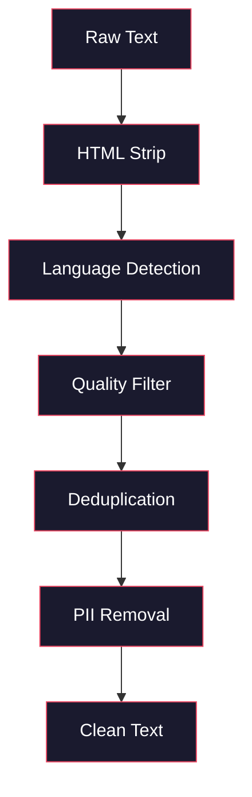
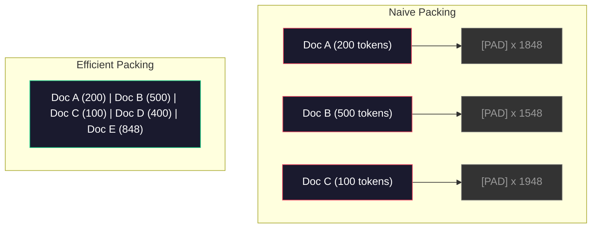

# पूर्व-शिक्षण के लिए डेटा पाइपलाइन

> मॉडल एक दर्पण है. यह जो भी डेटा आप उसे खिलाते हैं को दर्पण करता है. इसे कूड़ेदान खिलाता है, यह कूड़ेदान को पूरी तरलता से दर्पण करता है.

**Type:** Build
**Languages:** Python
**Prerequisites:** Phase 10, Lessons 01-02 (Tokenizers, Building a Tokenizer)
**Time:** ~90 minutes

## सीखने के लक्ष्य

- एक स्ट्रीमिंग डेटा पाइपलाइन बनाएं जो मेमोरी में लोड किए बिना टेक्स्ट के टेराबाइट्स को टोकन, टुकड़े, मिक्स और बैच करता है
- वास्तविक पूर्व-शिक्षण पाइपलाइनों में उपयोग किए जाने वाले डेटा गुणवत्ता फ़िल्टर (डिडप्लिकेशन, भाषा का पता लगाना, सामग्री फ़िल्टरिंग) को लागू करना
- ध्यान मास्क और दस्तावेज सीमा प्रबंधन के साथ निश्चित लंबाई के प्रशिक्षण अनुक्रम बनाएं
- प्रोफ़ाइल पाइपलाइन पारगमन डेटा लोडर GPU प्रशिक्षण गति के साथ बनाए रखने के लिए सुनिश्चित करने के लिए

## समस्या

आपके पास एक टोकन है, अब आपको डेटा की जरूरत है।

कोई डेटा सेट नहीं, कोई सीएसवी फ़ाइल नहीं. टेराबाइट्स पाठ -- साफ, डिडप्लिकेट, गुणवत्ता के लिए फ़िल्टर, निश्चित लंबाई के अनुक्रमों में टोकन, और यादृच्छिक बैच में पर्याप्त तेजी से सेवा की है कि आपका 8-जीपीयू क्लस्टर अगले बैच के लिए कभी इंतजार नहीं करता है।

अधिकांश लोग सोचते हैं कि एलएलएम प्रशिक्षण मॉडल वास्तुकला के बारे में है। यह नहीं है। Llama 3 ने 15.6 ट्रिलियन टोकन का उपयोग किया। GPT-3 ने 300 बिलियन का उपयोग किया। डीपसेक-वी 2 ने 8.1 ट्रिलियन का उपयोग किया। तीनों में वास्तुकला लगभग समान हैः ध्यान और फीडफॉरवर्ड परतों के साथ स्टैक किए गए ट्रांसफार्मर ब्लॉक। आउटपुट गुणवत्ता में अंतर डेटा से भारी मात्रा में आता है।

डीपमाइंड के चिंचिला पेपर ने यह सटीक बताया। किसी दिए गए कम्प्यूटिंग बजट के लिए, प्रशिक्षण टोकन के लिए मॉडल मापदंडों का एक इष्टतम अनुपात है। चिंचिला ने दिखाया कि 2022 में अधिकांश मॉडल काफी कम प्रशिक्षित थे -- उनके पास देखने वाले डेटा की मात्रा के लिए बहुत सारे पैरामीटर थे। 1.4 ट्रिलियन टोकन (चिंचिला-उत्तम) पर प्रशिक्षित 70B पैरामीटर मॉडल ने 300 बिलियन टोकन (गोफर) पर प्रशिक्षित 280B मॉडल से बेहतर प्रदर्शन किया।

आपका डेटा पाइपलाइन यह निर्धारित करता है कि आपका मॉडल भाषा सीखता है या शोर सीखता है।

## अवधारणा

### डेटा कहाँ से आया

प्रत्येक बड़े भाषा मॉडल को स्रोतों के मिश्रण पर प्रशिक्षित किया जाता है। सटीक रचना अधिकांश प्रयोगशालाओं के लिए एक सावधानीपूर्वक संरक्षित रहस्य है, लेकिन हम श्रेणियों को समझने के लिए पर्याप्त जानते हैं।

| Source | Size | Quality | Used By |
|--------|------|---------|---------|
| Common Crawl | ~250 TB raw | Low (needs heavy filtering) | GPT-3, Llama, most open models |
| Wikipedia | ~20 GB | High | Every major LLM |
| GitHub code | ~1 TB+ | Medium (lots of duplicates, dead code) | StarCoder, CodeLlama, DeepSeek-Coder |
| Books (BookCorpus, Pile) | ~100 GB | High | GPT-2, GPT-3, early models |
| Academic papers (arXiv, S2ORC) | ~100 GB | High for STEM | Llama, Galactica |
| StackOverflow, Reddit | ~100 GB | Medium | Llama, Falcon |
| Curated web (C4, RefinedWeb) | ~5 TB | Medium-High (pre-filtered) | T5, Falcon |

Llama 3 ने अपने डेटा मिक्स का खुलासा कियाः लगभग 50% वेब डेटा, 25% कोड, 13% किताबें और अकादमिक पत्र, 8% गणित डेटा, और 4% बहुभाषी वेब डेटा। कुल 15.6 ट्रिलियन टोकन थे जो 5 टीबी से अधिक कच्चे पाठ के स्रोतों से थे।

अनुपात उतना ही मायने रखता है जितना कि कुल आकार। बहुत अधिक वेब डेटा और मॉडल एक रेडिट चप्पू बन जाता है। बहुत कम कोड और यह प्रोग्राम नहीं कर सकता है। बहुत कम गणित और यह तर्क में विफल रहता है। इस मिश्रण को सही करना LLM के प्रशिक्षण के सबसे कठिन भागों में से एक है, और कोई सूत्र नहीं है - यह प्रयोग और मूल्यांकन की आवश्यकता है।

### डेटा क्लीनिंग

कच्चे वेब डेटा गंदा है. एक आम क्रॉल डंप में शामिल हैंः

- HTML टैग और जावास्क्रिप्ट
- बॉयलरप्लेट हेडर, फुटर्स, नेविगेशन मेनू
- दोहरे पृष्ठ (सही और लगभग दोहरे)
- मशीन द्वारा उत्पन्न स्पैम
- व्यक्तिगत रूप से पहचान योग्य जानकारी (PII)
- कम गुणवत्ता वाला पाठ (किवर्ड की सूची, एसईओ स्पैम)
- पाठ के रूप में एन्कोड की गई गैर-पाठ सामग्री

इसे साफ करना वैकल्पिक नहीं है। यह एक मॉडल के बीच अंतर है जो सुसंगत पैराग्राफ उत्पन्न करता है और एक जो उत्पाद सूचियों के साथ मिश्रित HTML टैग आउटपुट करता है।



प्रत्येक कदम शोर की एक श्रेणी को समाप्त करता हैः

**HTML stripping:**सभी मार्कअप हटा दें. केवल दृश्यमान पाठ सामग्री को रखें. पुस्तकालयों की तरह `trafilatura`या `readability`नेविगेशन, विज्ञापन और बॉयलरप्लेट को त्यागते हुए लेख सामग्री निकालें।

**Language detection:**प्रत्येक दस्तावेज़ को वर्गीकृत करने के लिए फास्टटेक्स्ट के भाषा पहचान मॉडल (lid.176.bin) का उपयोग करें। अपने लक्षित भाषाओं में फ़िल्टर करें। 0.8 से कम आत्मविश्वास के साथ अंग्रेजी के रूप में वर्गीकृत एक दस्तावेज़ शायद शुद्ध अंग्रेजी नहीं है।

**Quality filtering:**यह दिलचस्प है। रिफाइनडवेब (फैल्कन के पीछे डेटासेट) एक जटिलता आधारित फ़िल्टर का उपयोग करता हैः विकिपीडिया पर एक छोटे से भाषा मॉडल को प्रशिक्षित करें, फिर प्रत्येक दस्तावेज़ को स्कोर करें। उच्च जटिलता का मतलब है कि दस्तावेज़ विकिपीडिया से अलग है - संभवतः स्पैम, खोजशब्द सूची या मशीन-जनित सामग्री। एक सीमा से ऊपर की जटिलता वाले दस्तावेज़ हटा दिए जाते हैं।

**Deduplication:**सबसे प्रभावशाली सफाई चरण. कॉमन क्रॉल में बड़ी संख्या में डुप्लिकेट पृष्ठ शामिल हैं - कानूनी अस्वीकरण, कुकी सूचनाएं, सेवा की शर्तें। डुप्लिकेट पर प्रशिक्षण कचरा गणना और मॉडल को याद रखने और विशिष्ट अनुच्छेदों को शाब्दिक रूप से फिर से उबालने के लिए कर सकता है।

**PII removal:**नाम, ईमेल पते, फोन नंबर, सामाजिक सुरक्षा नंबर, संरचित PII के लिए Regex आधारित पता लगाना, संदर्भ में नाम के लिए NER मॉडल।

### MinHash के साथ डिडप्लिकेशन

सटीक डिडप्लिकेशन आसान हैः प्रत्येक दस्तावेज़ को हैश करें, डुप्लिकेट हटाएं। लेकिन लगभग डुप्लिकेट असली समस्या है। इसके चारों ओर थोड़ा अलग विज्ञापनों के साथ एक ही समाचार लेख की दो प्रतियां लगभग डुप्लिकेट हैं। सामग्री 95% समान है, लेकिन बाइट-टू-बाइट वे भिन्न हैं।

MinHash + स्थान-संवेदनशील हैशिंग (LSH) इसको कुशलतापूर्वक हल करता है।


विचारः

1. **Shingling:**प्रत्येक दस्तावेज़ को n-ग्राम (जैसे, 5 ग्राम शब्दों या वर्णों के) के सेट में परिवर्तित करें। 3-शब्दों के शिंगल के साथ "त्वरित भूरे लोर" {"त्वरित भूरे लोर"} बन जाता है।

2. **MinHash:**प्रत्येक दस्तावेज़ के शिंगल सेट के लिए, k हैश मानों की गणना करें। प्रत्येक हैश मान एक अलग हैश फ़ंक्शन के तहत सभी शिंगल पर न्यूनतम हैश है। यह एक निश्चित आकार का "हस्ताक्षर" बनाता है जो किसी भी दो दस्तावेजों के बीच जैकार्ड समानता के करीब है।

3. **LSH:**दस्तावेजों को अपने MinHash हस्ताक्षर के बैंड के आधार पर बाल्ट में समूह करें। एक ही बाल्ट में दस्तावेज उम्मीदवार लगभग डुप्लिकेट हैं। यह प्रत्येक जोड़ी की तुलना से बचता है - आप केवल उम्मीदवारों की तुलना करते हैं।

4. **Verify:**प्रत्येक उम्मीदवार जोड़ी के लिए, जैकार्ड की सटीक समानता की गणना करें। यदि समानता एक सीमा (आमतौर पर 0.8) से अधिक है तो एक प्रति हटा दें।

लामा टीम ने बताया कि उन्होंने अपने वेब डेटा का लगभग 38% डिडप्लिकेशन के माध्यम से हटा दिया। यह कोई छोटी संख्या नहीं है। कॉमन क्रॉल का एक तिहाई से अधिक दोहरी या लगभग दोहरी सामग्री है।

### अनुक्रम पैकिंग

आपके मॉडल में निश्चित लंबाई के इनपुट अनुक्रमों की उम्मीद है आपके दस्तावेज़ों में परिवर्तनीय लंबाई है. कुछ 50 टोकन हैं. कुछ 50,000 टोकन हैं.

साफ़-साफ़ दृष्टिकोणः प्रत्येक दस्तावेज़ को अधिकतम अनुक्रम लंबाई तक पैड करें। यह पैडिंग टोकन पर भारी गणना को बर्बाद करता है जो सीखने में कुछ भी योगदान नहीं देता है।

बेहतर दृष्टिकोणः एक एकल अनुक्रम में कई दस्तावेजों को पैक करें, क्रम के अंत टोकन द्वारा अलग। 2048 टोकन अनुक्रम में तीन छोटे दस्तावेज हो सकते हैं जो उनके बीच [ईओएस] टोकन के साथ संश्लेषित हैं।



ध्यान मास्क को सही ढंग से सेट किया जाना चाहिए। दस्तावेज़ A से टोकन एक ही पैक अनुक्रम के भीतर दस्तावेज़ B से टोकन को ध्यान में नहीं रखना चाहिए। इसके लिए ब्लॉक-आयामी ध्यान मास्क की आवश्यकता होती है।

लंबे दस्तावेजों को अनुक्रम सीमाओं पर टुकड़ों में विभाजित किया जाता है। विभाजन बिंदु मायने रखता हैः वाक्य के बीच में विभाजन मॉडल को अपूर्ण विचार देखने के लिए मजबूर करता है। कुछ पाइपलाइनें अनुच्छेद या वाक्य सीमाओं में विभाजन को संरेखित करती हैं जब संभव हो।

### चिंचिला स्केलिंग कानून

एक निश्चित गणना बजट C (FLOP में मापा जाता है) के लिए, आदर्श मॉडल आकार N और डेटासेट आकार D निम्नानुसार हैंः

```
N_opt ~ C^0.5
D_opt ~ C^0.5
```

अभ्यास में, इसका मतलब है कि आपको मॉडल आकार और डेटासेट आकार को लगभग समान रूप से मापना चाहिए। 10 गुना अधिक मापदंडों वाले मॉडल को समान हानि तक पहुंचने के लिए लगभग 10 गुना अधिक प्रशिक्षण टोकन की आवश्यकता होती है।

| Model | Parameters | Training Tokens | Chinchilla-Optimal? |
|-------|-----------|----------------|-------------------|
| GPT-3 | 175B | 300B | No (undertrained 3-4x) |
| Chinchilla | 70B | 1.4T | Yes (by design) |
| Llama 2 | 70B | 2T | Overtrained (intentionally) |
| Llama 3 | 70B | 15T | Heavily overtrained |

Llama 3 जानबूझकर Chinchilla कानून का उल्लंघन करता है। मेटा ने पाया कि अधिक डेटा पर ओवरट्रेनिंग - कम्प्यूटिंग-ऑप्टिमाइल अनुपात से बहुत परे - निष्कर्ष के लिए बेहतर मॉडल पैदा करता है। अतिरिक्त प्रशिक्षण लागत एक बार भुगतान की जाती है, लेकिन छोटे मॉडल को हमेशा के लिए सेवा करने के लिए सस्ता होता है। इसे कभी-कभी "उपलब्धता-ऑप्टिमाइल" स्केलिंग दृष्टिकोण कहा जाता है, और यह 2024 से उद्योग मानक बन गया है।

```figure
l5-data-pipeline
```

## इसे बनाओ

### चरण 1: पाठ को साफ करना

HTML को स्ट्रिप करें, व्हाइटस्पेस को सामान्य करें, गैर-पाठ सामग्री को हटा दें. हम अपने छोटे कॉर्पस के रूप में एक सार्वजनिक डोमेन पाठ (प्रोजेक्ट गुटेनबर्ग) का उपयोग करेंगे।

```python
import re

def clean_text(text):
    text = re.sub(r"<[^>]+>", "", text)
    text = re.sub(r"http\S+", "", text)
    text = re.sub(r"[^\x20-\x7E\n]", "", text)
    text = re.sub(r"\n{3,}", "\n\n", text)
    text = re.sub(r" {2,}", " ", text)
    return text.strip()

def quality_filter(text, min_words=50, max_ratio_caps=0.3, max_ratio_special=0.1):
    words = text.split()
    if len(words) < min_words:
        return False
    caps_ratio = sum(1 for w in words if w.isupper()) / len(words)
    if caps_ratio > max_ratio_caps:
        return False
    special_chars = sum(1 for c in text if not c.isalnum() and not c.isspace())
    if special_chars / max(len(text), 1) > max_ratio_special:
        return False
    return True
```

गुणवत्ता फ़िल्टर एसईओ स्पैम (ALL CAPS), मशीन-जनित शोर (उच्च विशेष वर्ण अनुपात) और स्टब पृष्ठ (बहुत छोटा) को पकड़ता है। ये तीन चेक अकेले वेब क्रॉल से एक आश्चर्यजनक मात्रा में कचरा निकालते हैं।

### चरण 2: MinHash डिडप्लिकेशन

शून्य से MinHash लागू करें. कोई बाहरी पुस्तकालयों की आवश्यकता नहीं है - बस`hashlib`. .

```python
import hashlib
from collections import defaultdict

def get_shingles(text, k=5):
    words = text.lower().split()
    if len(words) < k:
        return set()
    return {" ".join(words[i:i+k]) for i in range(len(words) - k + 1)}

def minhash_signature(shingles, num_hashes=128):
    signature = []
    for i in range(num_hashes):
        min_hash = float("inf")
        for shingle in shingles:
            h = int(hashlib.sha256(f"{i}:{shingle}".encode()).hexdigest(), 16)
            min_hash = min(min_hash, h)
        signature.append(min_hash)
    return signature

def lsh_buckets(signature, bands=16):
    rows_per_band = len(signature) // bands
    buckets = []
    for b in range(bands):
        start = b * rows_per_band
        band_data = tuple(signature[start:start + rows_per_band])
        bucket_hash = hashlib.md5(str(band_data).encode()).hexdigest()
        buckets.append((b, bucket_hash))
    return buckets

def deduplicate(documents, threshold=0.8, num_hashes=128, bands=16):
    signatures = []
    shingle_sets = []
    for doc in documents:
        shingles = get_shingles(doc)
        shingle_sets.append(shingles)
        signatures.append(minhash_signature(shingles, num_hashes))

    bucket_map = defaultdict(list)
    for doc_idx, sig in enumerate(signatures):
        for band_id, bucket_hash in lsh_buckets(sig, bands):
            bucket_map[(band_id, bucket_hash)].append(doc_idx)

    duplicate_pairs = set()
    for bucket_docs in bucket_map.values():
        if len(bucket_docs) < 2:
            continue
        for i in range(len(bucket_docs)):
            for j in range(i + 1, len(bucket_docs)):
                duplicate_pairs.add((bucket_docs[i], bucket_docs[j]))

    removed = set()
    for i, j in duplicate_pairs:
        if i in removed or j in removed:
            continue
        s1, s2 = shingle_sets[i], shingle_sets[j]
        if not s1 or not s2:
            continue
        jaccard = len(s1 & s2) / len(s1 | s2)
        if jaccard >= threshold:
            removed.add(j)

    return [doc for idx, doc in enumerate(documents) if idx not in removed], len(removed)
```

`num_hashes=128`और `bands=16`अधिक हैश अधिक सटीक समानता अनुमान देते हैं। अधिक बैंड अधिक झूठे सकारात्मक की लागत पर यादृच्छिकता (अधिक डुप्लिकेट पकड़ते हैं) को बढ़ाते हैं। ये मान सामान्य वेब पाठ के लिए अच्छी तरह से काम करते हैं।

### चरण 3: टोकन और पैक अनुक्रम

साफ, डिडप्लिकेट पाठ लें, उसे टोकन बनाएं, और प्रशिक्षण के लिए निश्चित लंबाई के अनुक्रमों में पैक करें।

```python
def tokenize_corpus(documents, tokenizer):
    all_tokens = []
    for doc in documents:
        tokens = tokenizer.encode(doc)
        all_tokens.extend(tokens)
        all_tokens.append(tokenizer.eos_id)
    return all_tokens

def pack_sequences(token_ids, seq_length, pad_id=0):
    sequences = []
    attention_masks = []
    for i in range(0, len(token_ids), seq_length):
        seq = token_ids[i:i + seq_length]
        mask = [1] * len(seq)
        if len(seq) < seq_length:
            pad_count = seq_length - len(seq)
            seq = seq + [pad_id] * pad_count
            mask = mask + [0] * pad_count
        sequences.append(seq)
        attention_masks.append(mask)
    return sequences, attention_masks
```

### चरण 4: प्रशिक्षण के लिए डेटा लोडर

पैक अनुक्रमों के यादृच्छिक बैच उत्पन्न करें. यह प्रशिक्षण लूप खपत है.

```python
import random

class PreTrainingDataLoader:
    def __init__(self, sequences, attention_masks, batch_size, shuffle=True):
        self.sequences = sequences
        self.attention_masks = attention_masks
        self.batch_size = batch_size
        self.shuffle = shuffle

    def __len__(self):
        return (len(self.sequences) + self.batch_size - 1) // self.batch_size

    def __iter__(self):
        indices = list(range(len(self.sequences)))
        if self.shuffle:
            random.shuffle(indices)
        for start in range(0, len(indices), self.batch_size):
            batch_idx = indices[start:start + self.batch_size]
            batch_seqs = [self.sequences[i] for i in batch_idx]
            batch_masks = [self.attention_masks[i] for i in batch_idx]
            yield batch_seqs, batch_masks
```

### चरण 5: डेटासेट आँकड़े

महत्वपूर्ण संख्याओं की गणना करेंः कुल टोकन, अद्वितीय टोकन, संपीड़न अनुपात, दस्तावेज़ लंबाई वितरण।

```python
from collections import Counter

def compute_statistics(documents, token_ids, sequences, tokenizer_vocab_size):
    total_chars = sum(len(d) for d in documents)
    total_tokens = len(token_ids)
    unique_tokens = len(set(token_ids))
    compression_ratio = total_chars / total_tokens

    doc_lengths = [len(d.split()) for d in documents]
    avg_doc_length = sum(doc_lengths) / max(len(doc_lengths), 1)
    max_doc_length = max(doc_lengths) if doc_lengths else 0
    min_doc_length = min(doc_lengths) if doc_lengths else 0

    token_counts = Counter(token_ids)
    top_tokens = token_counts.most_common(10)

    non_pad_tokens = sum(sum(1 for t in seq if t != 0) for seq in sequences)
    total_positions = sum(len(seq) for seq in sequences)
    utilization = non_pad_tokens / max(total_positions, 1)

    stats = {
        "total_documents": len(documents),
        "total_characters": total_chars,
        "total_tokens": total_tokens,
        "unique_tokens": unique_tokens,
        "vocab_utilization": unique_tokens / tokenizer_vocab_size,
        "compression_ratio": compression_ratio,
        "avg_doc_length_words": avg_doc_length,
        "max_doc_length_words": max_doc_length,
        "min_doc_length_words": min_doc_length,
        "num_sequences": len(sequences),
        "sequence_utilization": utilization,
        "top_10_tokens": top_tokens,
    }
    return stats
```

संपीड़न अनुपात आपको बताता है कि टोकन इस कॉर्पस पर कितना कुशल है। अंग्रेजी पाठ आमतौर पर प्रति टोकन लगभग 3-4 वर्णों तक संपीड़ित होता है। यदि आप प्रति टोकन 1.5 वर्ण देखते हैं, तो आपका टोकनराइज़र बहुत आक्रामक रूप से विभाजित हो रहा है। यदि आप 8+ देखते हैं, तो यह बहुत डोमेन-विशिष्ट विलय सीख गया है।

अनुक्रम उपयोग आपको बताता है कि आपके पैक अनुक्रमों में से कितना वास्तविक डेटा बनाम पैडिंग है. 90% से नीचे का मतलब है कि आपका पैकिंग अप्रभावी है - आप पैडिंग टोकन पर गणना बर्बाद कर रहे हैं.

## इसका प्रयोग करें

### HuggingFace डेटासेट की तुलना करें

HuggingFace के डेटा सेट पुस्तकालय में एक ही corpus लोड करें और पाइपलाइन गति की तुलना करें।

```python
from datasets import load_dataset
from transformers import AutoTokenizer

ds = load_dataset("wikitext", "wikitext-2-raw-v1", split="train")
tokenizer = AutoTokenizer.from_pretrained("meta-llama/Meta-Llama-3-8B")

import time

start = time.time()
tokenized = ds.map(
    lambda x: tokenizer(x["text"], truncation=True, max_length=2048),
    batched=True,
    num_proc=4,
)
hf_time = time.time() - start
total_tokens = sum(len(t) for t in tokenized["input_ids"])
print(f"HuggingFace: {total_tokens:,} tokens in {hf_time:.2f}s ({total_tokens/hf_time:,.0f} tokens/sec)")
```

HuggingFace पाइपलाइन में हुड के नीचे रस्ट टोकनाइज़र और 4 कोरों में समानांतर प्रसंस्करण का उपयोग किया जाता है। आपकी शुद्ध पायथन पाइपलाइन 10-50 गुना धीमी होगी। यही अंतर है कि उत्पादन टीमों द्वारा संकलित टोकनाइज़र का उपयोग क्यों किया जाता है। एल्गोरिथ्म समान है। कार्यान्वयन भाषा अंतर है।

## इसे भेजें

इस पाठ में LLM प्रशिक्षण पाइपलाइनों में डेटा गुणवत्ता को मान्य करने और डिबग करने के लिए एक संकेत मिलता है।`outputs/prompt-data-quality-checker.md`. .

## व्यायाम

1. **Easy:**सरल हेरिस्टिक (वर्ण सेट विश्लेषण) का उपयोग करके सफाई पाइपलाइन में भाषा का पता लगाने को जोड़ें। केवल अंग्रेजी दस्तावेजों को फ़िल्टर करें और मापें कि कितने दस्तावेज हटाए जाते हैं।
2. **Medium:**MinHash के निकट-डिडप्लिकेशन के साथ SHA-256 हैश का उपयोग करके सटीक डिडप्लिकेशन लागू करें। वेब-स्क्रैप किए गए कॉर्पस पर प्रत्येक विधि द्वारा पकड़े गए डुप्लिकेट की संख्या की तुलना करें।
3. **Hard:**एक जटिलता आधारित गुणवत्ता फ़िल्टर बनाएं। विकिपीडिया पाठ पर एक छोटे से बिग्राम भाषा मॉडल को प्रशिक्षित करें, प्रत्येक दस्तावेज़ को जटिलता के आधार पर स्कोर करें, और निचले 20% को हटा दें। फ़िल्टर किए गए बनाम अनफ़िल्टर किए गए डेटा पर प्रशिक्षण करते समय मॉडल आउटपुट गुणवत्ता की तुलना करें।

## प्रमुख शर्तें

| Term | What people say | What it actually means |
|------|----------------|----------------------|
| Common Crawl | "The internet" | A non-profit that crawls the web monthly -- ~250TB raw, the starting point for most LLM training data |
| MinHash | "Some hashing trick" | A technique to estimate Jaccard similarity between sets using fixed-size signatures -- enables near-duplicate detection at scale |
| LSH | "Locality-Sensitive Hashing" | A method to group similar items into the same bucket -- reduces pairwise comparisons from O(n^2) to near-linear |
| Sequence packing | "Concatenating documents" | Fitting multiple documents into fixed-length sequences with proper attention masks -- eliminates padding waste |
| Chinchilla scaling | "Train on more data" | For a fixed compute budget, optimal performance requires scaling model size and training tokens roughly equally |
| Fertility | "Tokens per word" | Average number of tokens per word -- 1.3 for English in GPT-4, higher for non-Latin scripts |
| Data mixing | "Choosing training data" | The ratio of code vs text vs math vs multilingual data -- no formula, requires experimentation |
| Perplexity filter | "Quality scoring" | Use a small language model to score documents -- high perplexity means the text is unlike clean reference data |
| Deduplication | "Removing copies" | Eliminating exact and near-duplicate documents -- typically removes 30-40% of raw web data |
| Attention mask | "Which tokens to look at" | A binary mask that prevents attention across document boundaries in packed sequences |

## आगे पढ़ना

- [Hoffmann et al., 2022 -- Training Compute-Optimal Large Language Models (Chinchilla)](https://arxiv.org/abs/2203.15556)-- पेपर जो डेटा स्केल के बारे में हमारी सोच को बदल गया
- [Penedo et al., 2023 -- The RefinedWeb Dataset for Falcon LLM](https://arxiv.org/abs/2306.01116)-- उच्च गुणवत्ता के लिए सामान्य क्रॉल को फ़िल्टर करने का तरीका
- [Touvron et al., 2023 -- Llama 2: Open Foundation and Fine-Tuned Chat Models](https://arxiv.org/abs/2307.09288)-- Llama 2 के लिए डेटा पाइपलाइन विवरण
- [Lee et al., 2022 -- Deduplicating Training Data Makes Language Models Better](https://arxiv.org/abs/2107.06499)-- क्यों डिडप्लिकेशन आप सोचते हैं से अधिक मायने रखता है
- [Broder, 1997 -- On the Resemblance and Containment of Documents](https://ieeexplore.ieee.org/document/666900)-- मूल मिन्हैश पेपर
- [Meta, 2024 -- Llama 3 Technical Report](https://arxiv.org/abs/2407.21783)-- 15.6T टोकन, डेटा मिश्रण अनुपात, फिल्टरिंग पाइपलाइन
