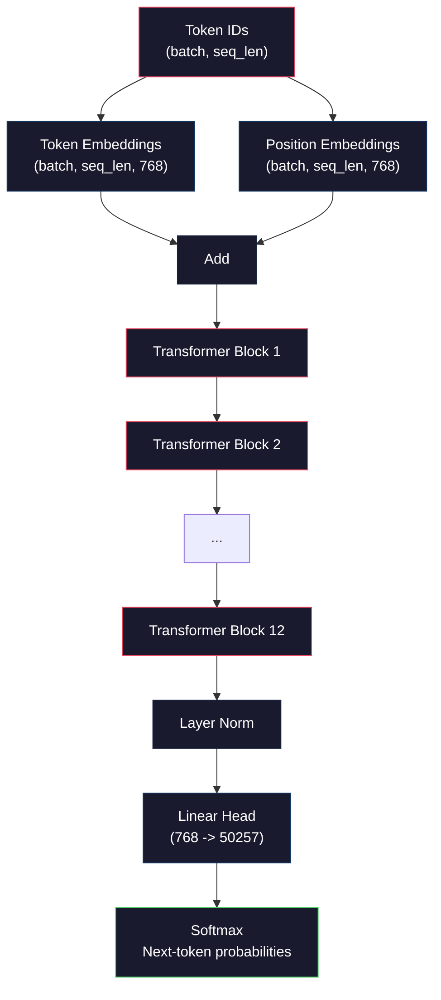
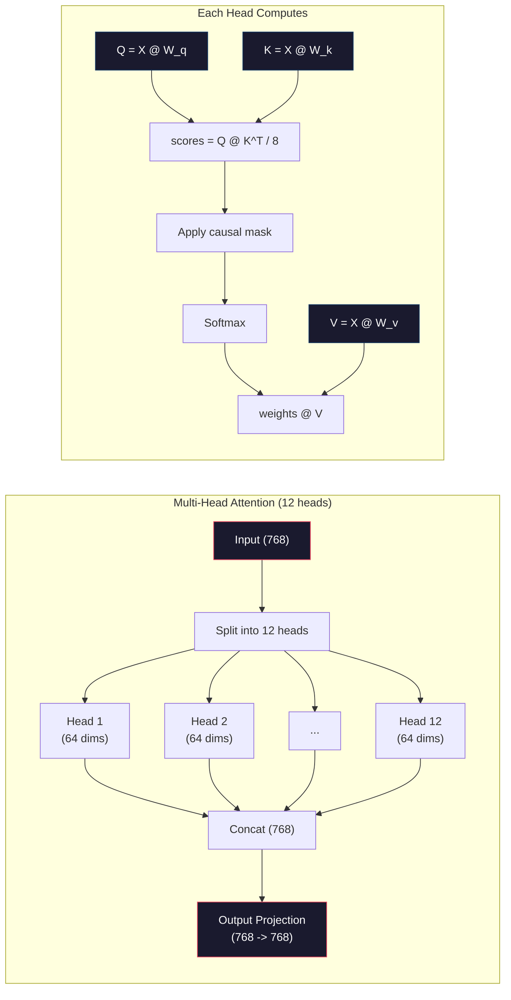
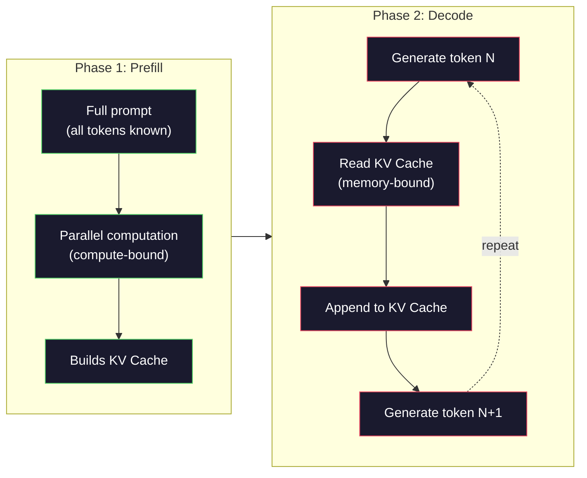

# मिनी जीपीटी (124M पैरामीटर) को पूर्व-प्रशिक्षण

> GPT-2 Small में 124 मिलियन पैरामीटर हैं. यह 12 ट्रांसफार्मर परतें हैं, 12 ध्यान हेड और 768 आयामी एम्बेडमेंट्स. आप इसे कुछ घंटों में एक ही GPU पर खरोंच से प्रशिक्षित कर सकते हैं. ज्यादातर लोग ऐसा कभी नहीं करते. वे पूर्व-प्रशिक्षित चेकपोस्ट का उपयोग करते हैं. लेकिन अगर आप स्वयं एक को प्रशिक्षित नहीं करते हैं, तो आप वास्तव में नहीं समझते कि आपके उत्पाद बनाने वाले मॉडल के अंदर क्या हो रहा है।

**Type:** Build
**Languages:** Python (with numpy)
**Prerequisites:** Phase 10, Lessons 01-03 (Tokenizers, Building a Tokenizer, Data Pipelines)
**Time:** ~120 minutes

## सीखने के लक्ष्य

- GPT-2 वास्तुकला (124M पैरामीटर) को स्क्रैच से लागू करेंः टोकन एम्बेडमेंट, पोजिशनिंग एम्बेडमेंट, ट्रांसफार्मर ब्लॉक और भाषा मॉडल हेड
- क्रॉस-एंट्रोपी हानि के साथ अगले टोकन भविष्यवाणी का उपयोग करके पाठ कॉर्पस पर जीपीटी मॉडल को प्रशिक्षित करें
- तापमान नमूनाकरण और शीर्ष-के/शीर्ष-पी फ़िल्टरिंग के साथ ऑटोरेग्रेसिव पाठ जनरेशन को लागू करना
- प्रशिक्षण हानि वक्रों की निगरानी करें और सत्यापित करें कि मॉडल सुसंगत भाषा पैटर्न सीखता है

## समस्या

आप जानते हैं कि ट्रांसफार्मर क्या है। आपने चित्रों को पढ़ा है। आप "ध्यान ही आपको चाहिए" कह सकते हैं और एक व्हाइटबोर्ड पर "मल्टी-हेड ध्यान" के साथ चिह्नित बक्से खींच सकते हैं।

इसका मतलब यह नहीं है कि आप समझते हैं कि जब एक मॉडल पाठ उत्पन्न करता है तो क्या होता है।

GPT-2 Small (वजन बंधन के साथ) में 124,438,272 पैरामीटर हैं। उनमें से प्रत्येक को एक प्रशिक्षण लूप चलाकर सेट किया गया थाः आगे पास, गणना हानि, पीछे पास, अद्यतन वजन। 12 ट्रांसफार्मर ब्लॉक। प्रति ब्लॉक 12 ध्यान सिर. एक 768 आयामी एम्बेडिंग अंतरिक्ष. 50,257 टोकन का शब्दावली। जब भी मॉडल एक टोकन उत्पन्न करता है, तो सभी 124 मिलियन पैरामीटर एक एकल मैट्रिक्स गुणन श्रृंखला में भाग लेते हैं जो टोकन आईडी का एक अनुक्रम लेता है और अगले टोकन पर संभावना वितरण का उत्पादन करता है।

अगर आपने इसे कभी खुद नहीं बनाया है, तो आप एक ब्लैक बॉक्स के साथ काम कर रहे हैं. आप एपीआई का उपयोग कर सकते हैं. आप ठीक कर सकते हैं. लेकिन जब कुछ गलत होता है - जब मॉडल पगलाता है, जब यह खुद को दोहराता है, जब यह निर्देशों का पालन करने से इनकार करता है - आपके पास कोई मानसिक मॉडल नहीं है * क्यों*.

इस पाठ में GPT-2 को स्माल से बनाया गया है। PyTorch में नहीं। Numpy में। प्रत्येक मैट्रिक्स गुणन दृश्यमान है। प्रत्येक ग्रेडिएंट आपके कोड द्वारा गणना की जाती है। आप देखेंगे कि अगले शब्द की भविष्यवाणी करने के लिए 124 मिलियन संख्याओं की योजना कैसे है।

## अवधारणा

### जीपीटी वास्तुकला

जीपीटी एक ऑटोरेग्रेसिव भाषा मॉडल है। "ऑटोरेग्रेसिव" का मतलब है कि यह एक समय में एक टोकन उत्पन्न करता है, प्रत्येक पिछले सभी टोकन पर स्थित है। वास्तुकला ट्रांसफार्मर डिकोडर ब्लॉकों का एक ढेर है।

यहाँ टोकन आईडी से अगले टोकन संभावनाओं तक की पूरी गणना ग्राफ हैः

1. टोकन आईडी आते हैं. आकारः (बच_साइज, seq_len).
2. टोकन एम्बेडिंग खोज. प्रत्येक आईडी 768 आयामी वेक्टर के लिए नक्शे. आकारः (बच_साइज, seq_len, 768).
3. स्थिति एम्बेडिंग खोज. प्रत्येक स्थिति (0, 1, 2, ...) 768 आयामी वेक्टर के लिए नक्शे. एक ही आकार.
4. टोकन एम्बेड + स्थिति एम्बेड जोड़ें।
5. 12 ट्रांसफार्मर ब्लॉक से गुजरें।
6. अंतिम परत सामान्यीकरण।
7. शब्दावली आकार के लिए रैखिक प्रक्षेपण। आकारः (बच_साइज, seq_len, vocab_size) ।
8. संभावनाओं को प्राप्त करने के लिए सॉफ्टमैक्स।

यह पूरी मॉडल है. कोई झुकना नहीं. कोई पुनरावृत्ति नहीं. बस एम्बेडमेंट, ध्यान, फ़ीडफॉरवर्ड नेटवर्क, और परत मानकों 12 बार ढेर.



### ट्रांसफार्मर ब्लॉक

12 ब्लॉक में से प्रत्येक एक ही पैटर्न का अनुसरण करता है। पूर्व-मानक वास्तुकला (जीपीटी-2 मूल ट्रांसफार्मर की तरह पूर्व-मानक, पोस्ट-मानक का उपयोग करता है):

1. लेयरनॉर्म
2. बहु-उपदेही आत्म-ध्यान
3. शेष कनेक्शन (इनपुट वापस जोड़ें)
4. लेयरनॉर्म
5. फ़ीड-फॉरवर्ड नेटवर्क (MLP)
6. शेष कनेक्शन (इनपुट वापस जोड़ें)

शेष कनेक्शन महत्वपूर्ण हैं। उनके बिना, ग्रेडिएंट बैकप्रॉपेगेशन के दौरान ब्लॉक 1 तक पहुंचने के समय गायब हो जाते हैं। उनके साथ, ग्रेडिएंट "स्किप" पथ के माध्यम से किसी भी परत से सीधे प्रवाह कर सकते हैं। यही कारण है कि आप 12, 32, या यहां तक कि 96 ब्लॉक को ढेर कर सकते हैं (GPT-4 का उपयोग करने की अफवाह है 120).

### ध्यान दें: मूल तंत्र

आत्म-विचार प्रत्येक टोकन को पिछले टोकन को देखने देता है और यह तय करता है कि प्रत्येक टोकन पर कितना ध्यान देना है। यहाँ गणित है।

प्रत्येक टोकन स्थिति के लिए, इनपुट से तीन वेक्टरों की गणना करेंः
- **Query (Q)**"मैं क्या खोज रहा हूँ?
- **Key (K)**"मैं क्या शामिल है?
- **Value (V)**: "मैं किस जानकारी को लेकर हूँ?

```
Q = input @ W_q    (768 -> 768)
K = input @ W_k    (768 -> 768)
V = input @ W_v    (768 -> 768)

attention_scores = Q @ K^T / sqrt(d_k)
attention_scores = mask(attention_scores)   # causal mask: -inf for future positions
attention_weights = softmax(attention_scores)
output = attention_weights @ V
```

कारण मास्क ही GPT को ऑटोरेग्रेसिव बनाता है। स्थिति 5 0-5 की स्थिति पर ध्यान दे सकती है लेकिन 6, 7, 8 आदि पर नहीं। यह मॉडल को प्रशिक्षण के दौरान भविष्य के टोकन को देखकर "चोट" करने से रोकती है।

**Multi-head attention**768 आयामी अंतरिक्ष को 64 आयामों के 12 सिरों में विभाजित करता है। प्रत्येक सिर एक अलग ध्यान पैटर्न सीखता है। एक सिर वाक्यबद्ध संबंधों (सब्जेक्ट-कार्यकर्ता समझौते) को ट्रैक कर सकता है। एक अन्य अर्थपूर्ण समानता (सिनॉनिम) को ट्रैक कर सकता है। एक अन्य स्थिति निकटता (समीप शब्द) को ट्रैक कर सकता है। सभी 12 सिरों के आउटपुट को एक श्रृंखला में रखा जाता है और 768 आयामों पर वापस प्रक्षेपित किया जाता है।



वर्ग (d_k) - वर्ग (squart) = 8 - स्केल हो रहा है। इसके बिना, उच्च आयामी वेक्टरों के लिए डॉट उत्पाद बड़े होते हैं, नरम अधिकतम को उन क्षेत्रों में धकेलते हैं जहां ग्रेडिएंट लगभग शून्य होते हैं। यह मूल "ध्यान आपको बस जरूरत है" पेपर में प्रमुख अंतर्दृष्टि में से एक था।

### केवी कैशः क्यों तर्क तेजी से है

प्रशिक्षण के दौरान, आप एक बार में पूरे अनुक्रम को संसाधित करते हैं। निष्कर्ष के दौरान, आप एक बार में एक टोकन उत्पन्न करते हैं। अनुकूलन के बिना, टोकन N उत्पन्न करने के लिए सभी N-1 पिछले टोकन के लिए ध्यान को पुनः गणना करने की आवश्यकता होती है। यह उत्पन्न टोकन पर O(N^2) या लंबाई N के अनुक्रम के लिए O(N^3) कुल है।

KV कैश यह हल करता है। प्रत्येक टोकन के लिए K और V की गणना करने के बाद, उन्हें स्टोर करें। जब टोकन N + 1 उत्पन्न करते हैं, तो आपको केवल नए टोकन के लिए Q की गणना करने की आवश्यकता है और सभी पिछले टोकन से कैश किए गए K और V को देखना है। इससे K और V गणना के लिए प्रति टोकन लागत O(N) से O(1) तक कम हो जाती है। ध्यान स्कोर गणना अभी भी O(N) है क्योंकि आप सभी पिछले पदों पर ध्यान देते हैं, लेकिन आप इनपुट पर redundant मैट्रिक्स गुणन से बचते हैं।

12 परतों और 12 सिरों के साथ GPT-2 के लिए, KV कैश 2 (K + V) x 12 परतें x 12 सिर x 64 डिम्स = प्रति टोकन 18,432 मानों को संग्रहीत करता है। 1024 टोकन अनुक्रम के लिए, यह FP32 में लगभग 75MB है। 128 परतों के साथ Llama 3 405B के लिए, एक एकल अनुक्रम के लिए KV कैश 10GB से अधिक हो सकता है। यही कारण है कि लंबे संदर्भ का निष्कर्ष स्मृति-सीमित है।

### पूर्व-पूर्ति बनाम डिकोडिंगः दो चरणों में इन्फेरेंस

जब आप LLM में एक प्रोम्प्ट भेजते हैं, तो निष्कर्ष दो अलग-अलग चरणों में होता है।

**Prefill**सभी टोकन ज्ञात हैं, इसलिए मॉडल एक साथ सभी स्थानों के लिए ध्यान की गणना कर सकता है। यह चरण गणना-सीमाबद्ध है - GPU पूर्ण आउटपुट पर मैट्रिक्स गुणन कर रहा है। A100 पर 1000 टोकन के लिए, प्रीफिल लगभग 20-50ms लेता है।

**Decode**एक समय में टोकन उत्पन्न करता है। प्रत्येक नए टोकन सभी पिछले टोकन पर निर्भर करता है। यह चरण मेमोरी से बंधा हुआ है -- बोतल गला मॉडल वजन और GPU मेमोरी से KV कैश पढ़ रहा है, मैट्रिक्स गणित स्वयं नहीं। GPU के कम्प्यूटिंग कोर ज्यादातर स्मृति रीड के लिए प्रतीक्षा कर बैठा है. जीपीटी-2 के लिए, प्रत्येक डिकोडिंग चरण में लगभग एक ही समय लगता है, भले ही मैटमुल को कितने FLOPs की आवश्यकता हो, क्योंकि मेमोरी बैंडविड्थ एक प्रतिबंध है।

यह अंतर उत्पादन प्रणालियों के लिए मायने रखता है। GPU गणना (अधिक FLOPS = तेजी से प्रीफिल) के साथ थ्रूपुट स्केल को पूर्व-भरण करें। मेमोरी बैंडविड्थ के साथ थ्रूपुट स्केल को डीकोड करें (फास्ट मेमोरी = तेजी से डिकोड करें) । यही कारण है कि NVIDIA का H100 A100 की तुलना में मेमोरी बैंडविड्थ सुधारों पर ध्यान केंद्रित करता है - यह सीधे टोकन उत्पादन को गति देता है।



### प्रशिक्षण चक्र

एक एलएलएम को प्रशिक्षित करना अगले टोकन का पूर्वानुमान है। दिए गए टोकन [0, 1, 2, ..., N-1], भविष्यवाणी टोकन [1, 2, 3, ..., N]। हानि समारोह मॉडल के भविष्यवाणी किए गए संभावना वितरण और वास्तविक अगले टोकन के बीच क्रॉस-एंट्रोपी है।

एक प्रशिक्षण चरणः

1. **Forward pass**: बैच को सभी 12 ब्लॉक में चलाएं। प्रत्येक स्थिति के लिए लॉगिट (पूर्व-मॉफ्टमैक्स स्कोर) प्राप्त करें।
2. **Compute loss**: लॉजिट और लक्षित टोकन के बीच क्रॉस-एंट्रोपी (इनपुट एक स्थिति से स्थानांतरित) ।
3. **Backward pass**: बैकप्रॉपेगमेंट का उपयोग करके सभी 124M पैरामीटर के लिए ग्रेडिएंट की गणना करें।
4. **Optimizer step**जीपीटी-2 एडम को सीखने की दर वार्मिंग और कॉसिन गिरावट के साथ उपयोग करता है।

सीखने की दर की योजना आपके अनुमान से अधिक मायने रखती है। GPT-2 पहले 2,000 चरणों में 0 से उच्च सीखने की दर तक गर्म होता है, फिर एक कॉसिन वक्र के बाद गिरावट आती है। उच्च सीखने की दर से शुरू होने से मॉडल विचलित होता है। निरंतर उच्च दर को बनाए रखना बाद में प्रशिक्षण में उतार-चढ़ाव का कारण बनता है। वार्मिंग-तो-विकास पैटर्न का उपयोग हर प्रमुख LLM द्वारा किया जाता है।

### जीपीटी-2 छोटाः संख्याएँ

| Component | Shape | Parameters |
|-----------|-------|------------|
| Token embeddings | (50257, 768) | 38,597,376 |
| Position embeddings | (1024, 768) | 786,432 |
| Per-block attention (W_q, W_k, W_v, W_out) | 4 x (768, 768) | 2,359,296 |
| Per-block FFN (up + down) | (768, 3072) + (3072, 768) | 4,718,592 |
| Per-block LayerNorms (2x) | 2 x 768 x 2 | 3,072 |
| Final LayerNorm | 768 x 2 | 1,536 |
| **Total per block** | | **7,080,960** |
| **Total (12 blocks)** | | **85,054,464 + 39,383,808 = 124,438,272** |

आउटपुट प्रोजेक्शन (लॉजिट्स हेड) टोकन एम्बेडिंग मैट्रिक्स के साथ वजन साझा करता है। इसे वजन बंधन कहा जाता है - यह पैरामीटर की संख्या को 38M तक कम करता है और प्रदर्शन में सुधार करता है क्योंकि यह मॉडल को इनपुट और आउटपुट के लिए एक ही प्रतिनिधित्व स्थान का उपयोग करने के लिए मजबूर करता है।

## इसे बनाओ

### चरण 1: परत डालना

टोकन एम्बेडेड 50257 संभावित टोकन में से प्रत्येक को 768 आयामी वेक्टर में मानचित्रित करते हैं। स्थिति एम्बेडेड में प्रत्येक टोकन अनुक्रम में कहां स्थित है, इस बारे में जानकारी मिलती है। दोनों को योगित किया जाता है।

```python
import numpy as np

class Embedding:
    def __init__(self, vocab_size, embed_dim, max_seq_len):
        self.token_embed = np.random.randn(vocab_size, embed_dim) * 0.02
        self.pos_embed = np.random.randn(max_seq_len, embed_dim) * 0.02

    def forward(self, token_ids):
        seq_len = token_ids.shape[-1]
        tok_emb = self.token_embed[token_ids]
        pos_emb = self.pos_embed[:seq_len]
        return tok_emb + pos_emb
```

आरंभिककरण के लिए 0.02 मानक विचलन GPT-2 पेपर से आता है। बहुत बड़ा और प्रारंभिक आगे पास चरम मान उत्पन्न करते हैं जो प्रशिक्षण को अस्थिर करते हैं। बहुत छोटा और प्रारंभिक आउटपुट सभी इनपुट के लिए लगभग समान हैं, जिससे प्रारंभिक ग्रेडिएंट संकेत बेकार हो जाते हैं।

### चरण 2: कारणों के कारण मास्क से आत्म-ध्यान

एक सिर ध्यान पहले. कारण मुखौटा सॉफ्टमैक्स से पहले भविष्य की स्थिति को नकारात्मक अनंत पर सेट करता है, यह सुनिश्चित करने के लिए कि प्रत्येक स्थिति केवल खुद और पहले की स्थिति को ध्यान में रख सकती है।

```python
def attention(Q, K, V, mask=None):
    d_k = Q.shape[-1]
    scores = Q @ K.transpose(0, -1, -2 if Q.ndim == 4 else 1) / np.sqrt(d_k)
    if mask is not None:
        scores = scores + mask
    weights = np.exp(scores - scores.max(axis=-1, keepdims=True))
    weights = weights / weights.sum(axis=-1, keepdims=True)
    return weights @ V
```

सॉफ्टमैक्स कार्यान्वयन एक्सपोनेंशिएटिंग से पहले अधिकतम घटाता है। इसके बिना, exp(large_number) अनंत तक ओवरफ्लो हो जाता है। यह एक संख्यात्मक स्थिरता चाल है जो आउटपुट को नहीं बदलती है क्योंकि किसी भी स्थिर c के लिए सॉफ्टमैक्स ((x - c) = सॉफ्टमैक्स ((x) ।

### चरण 3: बहु-उपदेश्य ध्यान

768 आयामी इनपुट को 64 आयामों के 12 सिरों में विभाजित करें। प्रत्येक सिर स्वतंत्र रूप से ध्यान की गणना करता है। परिणामों को जोड़ें और 768 आयामों पर वापस प्रोजेक्ट करें।

```python
class MultiHeadAttention:
    def __init__(self, embed_dim, num_heads):
        self.num_heads = num_heads
        self.head_dim = embed_dim // num_heads
        self.W_q = np.random.randn(embed_dim, embed_dim) * 0.02
        self.W_k = np.random.randn(embed_dim, embed_dim) * 0.02
        self.W_v = np.random.randn(embed_dim, embed_dim) * 0.02
        self.W_out = np.random.randn(embed_dim, embed_dim) * 0.02

    def forward(self, x, mask=None):
        batch, seq_len, d = x.shape
        Q = (x @ self.W_q).reshape(batch, seq_len, self.num_heads, self.head_dim).transpose(0, 2, 1, 3)
        K = (x @ self.W_k).reshape(batch, seq_len, self.num_heads, self.head_dim).transpose(0, 2, 1, 3)
        V = (x @ self.W_v).reshape(batch, seq_len, self.num_heads, self.head_dim).transpose(0, 2, 1, 3)

        scores = Q @ K.transpose(0, 1, 3, 2) / np.sqrt(self.head_dim)
        if mask is not None:
            scores = scores + mask
        weights = np.exp(scores - scores.max(axis=-1, keepdims=True))
        weights = weights / weights.sum(axis=-1, keepdims=True)
        attn_out = weights @ V

        attn_out = attn_out.transpose(0, 2, 1, 3).reshape(batch, seq_len, d)
        return attn_out @ self.W_out
```

पुनर्विकृति-परिवर्तन-पुनर्विकृति नृत्य बहु-मुख्य ध्यान का सबसे भ्रमित हिस्सा है। यहाँ क्या होता हैः (बैच, seq_len, 768) tensor (बैच, seq_len, 12, 64), तो (बैच, 12, seq_len, 64) बन जाता है। अब 12 सिरों में से प्रत्येक के पास ध्यान को चलाने के लिए अपना (seq_len, 64) मैट्रिक्स है। ध्यान देने के बाद, हम प्रक्रिया को उलट देते हैंः (बैच, 12, seq_len, 64) बन जाता है (बैच, seq_len, 12, 64) बन जाता है (बैच, seq_len, 768).

### चरण 4: ट्रांसफार्मर ब्लॉक

एक पूर्ण ट्रांसफार्मर ब्लॉकः लेयरनॉर्म, अवशिष्ट के साथ मल्टी-हेड ध्यान, लेयरनॉर्म, अवशिष्ट के साथ फीड फॉरवर्ड।

```python
class LayerNorm:
    def __init__(self, dim, eps=1e-5):
        self.gamma = np.ones(dim)
        self.beta = np.zeros(dim)
        self.eps = eps

    def forward(self, x):
        mean = x.mean(axis=-1, keepdims=True)
        var = x.var(axis=-1, keepdims=True)
        return self.gamma * (x - mean) / np.sqrt(var + self.eps) + self.beta


class FeedForward:
    def __init__(self, embed_dim, ff_dim):
        self.W1 = np.random.randn(embed_dim, ff_dim) * 0.02
        self.b1 = np.zeros(ff_dim)
        self.W2 = np.random.randn(ff_dim, embed_dim) * 0.02
        self.b2 = np.zeros(embed_dim)

    def forward(self, x):
        h = x @ self.W1 + self.b1
        h = np.maximum(0, h)  # GELU approximation: ReLU for simplicity
        return h @ self.W2 + self.b2


class TransformerBlock:
    def __init__(self, embed_dim, num_heads, ff_dim):
        self.ln1 = LayerNorm(embed_dim)
        self.attn = MultiHeadAttention(embed_dim, num_heads)
        self.ln2 = LayerNorm(embed_dim)
        self.ffn = FeedForward(embed_dim, ff_dim)

    def forward(self, x, mask=None):
        x = x + self.attn.forward(self.ln1.forward(x), mask)
        x = x + self.ffn.forward(self.ln2.forward(x))
        return x
```

फ़ीडफॉरवर्ड नेटवर्क 768-आयामी इनपुट को 3,072 आयाम (4x) तक बढ़ाता है, एक गैर-रेखीयता लागू करता है, फिर 768 पर वापस प्रोजेक्ट करता है। यह विस्तार-संकुचन पैटर्न मॉडल को प्रत्येक स्थिति में काम करने के लिए एक "व्यापक" आंतरिक प्रतिनिधित्व देता है। GPT-2 GELU सक्रियण का उपयोग करता है, लेकिन हम यहां सरलता के लिए ReLU का उपयोग करते हैं - अंतर वास्तुकला को समझने के लिए मामूली है।

### चरण 5: पूर्ण जीपीटी मॉडल

12 ट्रांसफार्मर ब्लॉक को स्टैक करें। सामने एम्बेडिंग परत और पीछे आउटपुट प्रोजेक्शन जोड़ें।

```python
class MiniGPT:
    def __init__(self, vocab_size=50257, embed_dim=768, num_heads=12,
                 num_layers=12, max_seq_len=1024, ff_dim=3072):
        self.embedding = Embedding(vocab_size, embed_dim, max_seq_len)
        self.blocks = [
            TransformerBlock(embed_dim, num_heads, ff_dim)
            for _ in range(num_layers)
        ]
        self.ln_f = LayerNorm(embed_dim)
        self.vocab_size = vocab_size
        self.embed_dim = embed_dim

    def forward(self, token_ids):
        seq_len = token_ids.shape[-1]
        mask = np.triu(np.full((seq_len, seq_len), -1e9), k=1)

        x = self.embedding.forward(token_ids)
        for block in self.blocks:
            x = block.forward(x, mask)
        x = self.ln_f.forward(x)

        logits = x @ self.embedding.token_embed.T
        return logits

    def count_parameters(self):
        total = 0
        total += self.embedding.token_embed.size
        total += self.embedding.pos_embed.size
        for block in self.blocks:
            total += block.attn.W_q.size + block.attn.W_k.size
            total += block.attn.W_v.size + block.attn.W_out.size
            total += block.ffn.W1.size + block.ffn.b1.size
            total += block.ffn.W2.size + block.ffn.b2.size
            total += block.ln1.gamma.size + block.ln1.beta.size
            total += block.ln2.gamma.size + block.ln2.beta.size
        total += self.ln_f.gamma.size + self.ln_f.beta.size
        return total
```

वजन को जोड़ने पर ध्यान दें: `logits = x @ self.embedding.token_embed.T`. आउटपुट प्रोजेक्शन टोकन एम्बेडिंग मैट्रिक्स (ट्रान्सपोस्ड) का पुनः उपयोग करता है। यह सिर्फ पैरामीटर-सेविंग ट्रिक नहीं है। इसका मतलब है कि मॉडल टोकन (एम्बेडिंग) को समझने और उन्हें भविष्यवाणी करने (आउटपुट) के लिए एक ही वेक्टर स्थान का उपयोग करता है।

### चरण 6: प्रशिक्षण लूप

124M पैरामीटर पर एक वास्तविक प्रशिक्षण रन के लिए, आपको एक GPU और PyTorch की आवश्यकता होगी। यह प्रशिक्षण लूप शुद्ध नम्पी में चलने वाले एक छोटे मॉडल पर यांत्रिकी का प्रदर्शन करता है। हम इसे ट्रिगर करने के लिए एक छोटे मॉडल (4 परतें, 4 सिर, 128 dims) का उपयोग करते हैं।

```python
def cross_entropy_loss(logits, targets):
    batch, seq_len, vocab_size = logits.shape
    logits_flat = logits.reshape(-1, vocab_size)
    targets_flat = targets.reshape(-1)

    max_logits = logits_flat.max(axis=-1, keepdims=True)
    log_softmax = logits_flat - max_logits - np.log(
        np.exp(logits_flat - max_logits).sum(axis=-1, keepdims=True)
    )

    loss = -log_softmax[np.arange(len(targets_flat)), targets_flat].mean()
    return loss


def train_mini_gpt(text, vocab_size=256, embed_dim=128, num_heads=4,
                   num_layers=4, seq_len=64, num_steps=200, lr=3e-4):
    tokens = np.array(list(text.encode("utf-8")[:2048]))
    model = MiniGPT(
        vocab_size=vocab_size, embed_dim=embed_dim, num_heads=num_heads,
        num_layers=num_layers, max_seq_len=seq_len, ff_dim=embed_dim * 4
    )

    print(f"Model parameters: {model.count_parameters():,}")
    print(f"Training tokens: {len(tokens):,}")
    print(f"Config: {num_layers} layers, {num_heads} heads, {embed_dim} dims")
    print()

    for step in range(num_steps):
        start_idx = np.random.randint(0, max(1, len(tokens) - seq_len - 1))
        batch_tokens = tokens[start_idx:start_idx + seq_len + 1]

        input_ids = batch_tokens[:-1].reshape(1, -1)
        target_ids = batch_tokens[1:].reshape(1, -1)

        logits = model.forward(input_ids)
        loss = cross_entropy_loss(logits, target_ids)

        if step % 20 == 0:
            print(f"Step {step:4d} | Loss: {loss:.4f}")

    return model
```

नुकसान ln(vocab_size) के पास शुरू होता है - 256-टोकन बाइट-स्तर की शब्दावली के लिए, जो ln(256) = 5.55. एक यादृच्छिक मॉडल प्रत्येक टोकन को समान संभावना देता है। प्रशिक्षण के साथ-साथ, नुकसान कम होता है क्योंकि मॉडल सामान्य पैटर्न की भविष्यवाणी करना सीखता हैः "th" के बाद "t", अवधि के बाद स्थान, आदि।

उत्पादन में, आप ग्रेडिएंट जमा, सीखने की दर वार्मिंग, और ग्रेडिएंट क्लिपिंग के साथ एडम ऑप्टिमाइज़र का उपयोग करेंगे। आगे-पास-लॉस-बैकवर्ड-अपडेट लूप समान है। ऑप्टिमाइज़र अधिक परिष्कृत है।

### चरण 7: पाठ उत्पन्न करना

पीढ़ी एक समय में एक टोकन की भविष्यवाणी करने के लिए प्रशिक्षित मॉडल का उपयोग करती है। प्रत्येक भविष्यवाणी आउटपुट वितरण से नमूने की जाती है (या इसे argmax के रूप में लोभ से लिया जाता है) ।

```python
def generate(model, prompt_tokens, max_new_tokens=100, temperature=0.8):
    tokens = list(prompt_tokens)
    seq_len = model.embedding.pos_embed.shape[0]

    for _ in range(max_new_tokens):
        context = np.array(tokens[-seq_len:]).reshape(1, -1)
        logits = model.forward(context)
        next_logits = logits[0, -1, :]

        next_logits = next_logits / temperature
        probs = np.exp(next_logits - next_logits.max())
        probs = probs / probs.sum()

        next_token = np.random.choice(len(probs), p=probs)
        tokens.append(next_token)

    return tokens
```

तापमान आकस्मिकता को नियंत्रित करता है। तापमान 1.0 कच्चे वितरण का उपयोग करता है। तापमान 0.5 इसे तेज करता है (अधिक निर्धारात्मक - मॉडल अपने शीर्ष विकल्पों को अधिक बार चुनता है) । तापमान 1.5 इसे सपाट करता है (अधिक आकस्मिक - कम संभावना टोकन एक बड़ा मौका मिलता है) । तापमान 0.0 लालची डिकोडिंग है (हमेशा उच्चतम संभावना टोकन चुनें) ।

`tokens[-seq_len:]`विंडो आवश्यक है क्योंकि मॉडल में अधिकतम संदर्भ लंबाई (1024 GPT-2 के लिए) है। एक बार जब आप इसे पार कर लेते हैं, तो आपको सबसे पुराने टोकन छोड़ देना होगा। यह "सामग्री विंडो" है जिसके बारे में सभी बात करते हैं।

```figure
sampling-decoder
```

## इसका प्रयोग करें

### पूर्ण प्रशिक्षण और पीढ़ी डेमो

```python
corpus = """The transformer architecture has revolutionized natural language processing.
Attention mechanisms allow the model to focus on relevant parts of the input.
Self-attention computes relationships between all pairs of positions in a sequence.
Multi-head attention splits the representation into multiple subspaces.
Each attention head can learn different types of relationships.
The feedforward network provides nonlinear transformations at each position.
Residual connections enable gradient flow through deep networks.
Layer normalization stabilizes training by normalizing activations.
Position embeddings give the model information about token ordering.
The causal mask ensures autoregressive generation during training.
Pre-training on large text corpora teaches the model general language understanding.
Fine-tuning adapts the pre-trained model to specific downstream tasks."""

model = train_mini_gpt(corpus, num_steps=200)

prompt = list("The transformer".encode("utf-8"))
output_tokens = generate(model, prompt, max_new_tokens=100, temperature=0.8)
generated_text = bytes(output_tokens).decode("utf-8", errors="replace")
print(f"\nGenerated: {generated_text}")
```

एक छोटे से मॉडल के साथ एक छोटे से कॉर्पस पर, उत्पन्न पाठ सबसे अच्छा में अर्ध-समन्वयित होगा। यह प्रशिक्षण पाठ से कुछ बाइट-स्तर पैटर्न सीखता है लेकिन 40GB प्रशिक्षण डेटा और पूर्ण 124M पैरामीटर वास्तुकला के साथ GPT-2 के तरीके को सामान्य नहीं कर सकता है। मुद्दा आउटपुट की गुणवत्ता नहीं है। मुद्दा यह है कि आप हर कदम को ट्रैक कर सकते हैंः एम्बेडिंग खोज, ध्यान गणना, फ़ीड फॉरवर्ड परिवर्तन, लॉजिट प्रोजेक्शन, सॉफ्टमैक्स, और नमूनाकरण। हर ऑपरेशन दिखाई देता है।

## इसे भेजें

यह सबक हमें फल देता है`outputs/prompt-gpt-architecture-analyzer.md`-- एक प्रॉम्प्ट जो किसी भी जीपीटी शैली मॉडल में वास्तुकला विकल्पों का विश्लेषण करता है. इसे एक मॉडल कार्ड या तकनीकी रिपोर्ट खिलाता है और यह पैरामीटर आवंटन, ध्यान डिजाइन, और स्केलिंग निर्णयों को तोड़ता है।

## व्यायाम

1. 12/12 के बजाय 24 परतों और 16 सिरों का उपयोग करने के लिए मॉडल को संशोधित करें। पैरामीटर गिनें। गहराई को दोगुना करना चौड़ाई को दोगुना करने (एम्बेडिंग आयाम) की तुलना में कैसे करता है?

2. GELU सक्रियण फ़ंक्शन (GELU(x) = x * 0.5 * (1 + erf(x / sqrt(2)))) को लागू करें और फ़ीडफ़ॉर्वार्ड नेटवर्क में ReLU को प्रतिस्थापित करें। प्रत्येक सक्रियण के साथ 500 चरणों के लिए प्रशिक्षण चलाएं और अंतिम नुकसान की तुलना करें।

3. जनरेशन फ़ंक्शन में KV कैश जोड़ें। पहले आगे के पास के बाद प्रत्येक परत के लिए K और V टेन्सर स्टोर करें, और बाद के टोकन के लिए उनका पुनः उपयोग करें। स्पीडअप मापेंः कैश के साथ और बिना 200 टोकन उत्पन्न करें और वॉल-क्लॉक समय की तुलना करें।

4. शीर्ष-के नमूनाकरण (केवल उच्चतम संभावना टोकन पर विचार करें) और शीर्ष-पी नमूनाकरण (नक्लस नमूनाकरणः टोकन के सबसे छोटे सेट पर विचार करें जिनकी संचयी संभावना p से अधिक है) लागू करें। तापमान 0.8 पर आउटपुट गुणवत्ता की तुलना करें शीर्ष-के=50 बनाम शीर्ष-पी=0.95.

5. प्रशिक्षण हानि वक्र प्लैटर बनाएं। मॉडल को 1000 चरणों के लिए प्रशिक्षित करें और प्लैट हानि बनाम चरण। तीन चरणों की पहचान करेंः तेजी से प्रारंभिक गिरावट (सामान्य बाइट्स सीखना), धीमा मध्य चरण (बाइट पैटर्न सीखना) और पठार (छोटे कॉर्पस पर ओवरफिटिंग) । इस वक्र का आकार एक ही है चाहे आप 128-आयामी मॉडल या जीपीटी-4 का प्रशिक्षण दे रहे हों।

## प्रमुख शर्तें

| Term | What people say | What it actually means |
|------|----------------|----------------------|
| Autoregressive | "It generates one word at a time" | Each output token is conditioned on all previous tokens -- the model predicts P(token_n \| token_0, ..., token_{n-1}) |
| Causal mask | "It can't see the future" | An upper-triangular matrix of -infinity values that prevents attention to future positions during training |
| Multi-head attention | "Multiple attention patterns" | Splitting Q, K, V into parallel heads (e.g., 12 heads of 64 dims each for GPT-2) so each head can learn different relationship types |
| KV Cache | "Caching for speed" | Storing computed Key and Value tensors from previous tokens to avoid redundant computation during autoregressive generation |
| Prefill | "Processing the prompt" | The first inference phase where all prompt tokens are processed in parallel -- compute-bound on GPU FLOPS |
| Decode | "Generating tokens" | The second inference phase where tokens are generated one at a time -- memory-bound on GPU bandwidth |
| Weight tying | "Sharing embeddings" | Using the same matrix for input token embeddings and the output projection head -- saves 38M params in GPT-2 |
| Residual connection | "Skip connection" | Adding the input directly to the output of a sublayer (x + sublayer(x)) -- enables gradient flow in deep networks |
| Layer normalization | "Normalizing activations" | Normalizing across the feature dimension to mean 0 and variance 1, with learnable scale and bias parameters |
| Cross-entropy loss | "How wrong the predictions are" | -log(probability assigned to the correct next token), averaged over all positions -- the standard LLM training objective |

## आगे पढ़ना

- [Radford et al., 2019 -- "Language Models are Unsupervised Multitask Learners" (GPT-2)](https://cdn.openai.com/better-language-models/language_models_are_unsupervised_multitask_learners.pdf)-- जीपीटी-2 पेपर जो 124M से 1.5B पैरामीटर परिवार को पेश किया
- [Vaswani et al., 2017 -- "Attention Is All You Need"](https://arxiv.org/abs/1706.03762)-- मूल ट्रांसफार्मर कागज स्केल डॉट-प्रोडक्ट ध्यान और बहु-हेड ध्यान के साथ
- [Llama 3 Technical Report](https://arxiv.org/abs/2407.21783)-- कैसे मेटा 16K GPUs के साथ 405B पैरामीटर के लिए GPT वास्तुकला स्केल
- [Pope et al., 2022 -- "Efficiently Scaling Transformer Inference"](https://arxiv.org/abs/2211.05102)-- कागज जो औपचारिक रूप से पूर्व भरने बनाम डिकोड और KV कैश विश्लेषण
