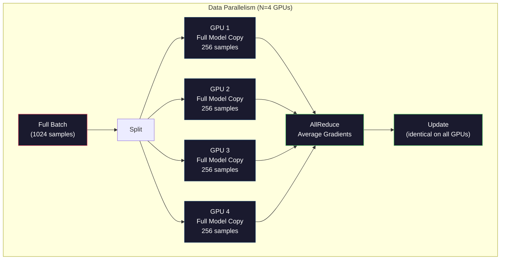
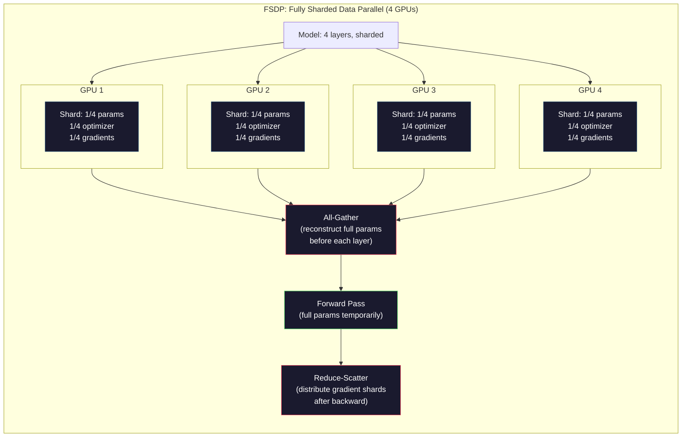
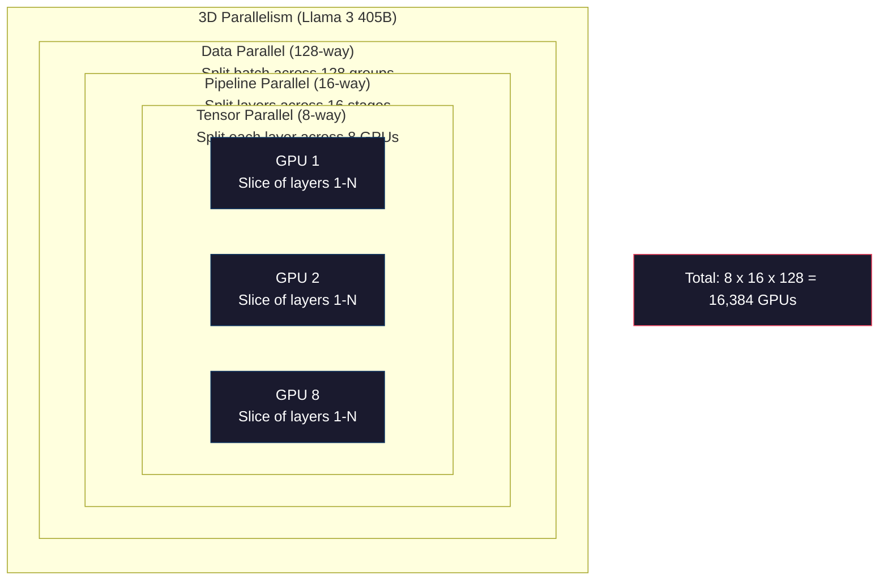

# स्केलिंगः वितरित प्रशिक्षण, एफएसडीपी, डीपस्पीड

> आपके 124M मॉडल को एक GPU पर प्रशिक्षित किया गया है। अब 7 बिलियन पैरामीटर का परीक्षण करें। मॉडल मेमोरी में फिट नहीं होता है। डेटा एक मशीन पर हफ्तों तक लेता है। वितरित प्रशिक्षण पैमाने पर वैकल्पिक नहीं है। यह एकमात्र रास्ता आगे है।

**Type:** Build
**Languages:** Python
**Prerequisites:** Phase 10, Lesson 04 (Pre-Training a Mini GPT)
**Time:** ~120 minutes

## सीखने के लक्ष्य

- समानांतर के तीन प्रकार (डेटा, टेंसर, पाइपलाइन) और मॉडल और क्लस्टर आकार के आधार पर प्रत्येक आवश्यक होने पर समझाएं
- कई GPU के बीच ग्रेडिएंट सिंक्रनाइज़ेशन के साथ PyTorch DDP का उपयोग करके डेटा-समान प्रशिक्षण लागू करें
- न्यूनतम हार्डवेयर निर्धारित करने के लिए एक दिए गए मॉडल आकार (वजन + अनुकूलक राज्यों + ग्रेडिएंट + सक्रियण) के लिए मेमोरी बजट की गणना करें
- जीपीयू पर मॉडल राज्यों को टुकड़े करने के लिए FSDP या डीप स्पीड ZeRO चरणों को कॉन्फ़िगर करें और एकल-जीपीयू मेमोरी से अधिक फिट मॉडल

## समस्या

FP16 में 7B पैरामीटर मॉडल को केवल वजन के लिए 14GB की आवश्यकता होती है। एडम ऑप्टिमाइज़र प्रत्येक पैरामीटर (पहले और दूसरे क्षण के अनुमान) की दो अतिरिक्त प्रतियां संग्रहीत करता है। यह एक और 28GB है। बैकप्रॉपेगेशन के दौरान ग्रेडिएंट्स 14GB और जोड़ते हैं। आप एक ही सक्रियण संग्रहीत होने से पहले 56GB पर हैं।

एनवीडीए ए100 में 80 जीबी मेमोरी है।

56GB 80GB में से खपत. यह सक्रियण के लिए 24GB बचा है - आगे के पास के दौरान गणना किए गए मध्यवर्ती मान जो बैकप्रप्लैग के लिए जीवित रखा जाना चाहिए. 4096 आयामी मॉडल के साथ 2048-टोकन अनुक्रम के लिए, एक एकल परत की सक्रियण लगभग 64MB का उपयोग करती है. 32 परतों के साथ, आपको प्रति नमूना 2GB की आवश्यकता होती है. 8 बैच आकार के लिए 16GB की आवश्यकता होती है. आपके पास 24GB है. 12 बैच आकार उड़ा जाता है।

अब 70 बी पैरामीटर का प्रयास करें। अकेले वजनः FP16 में 140 जीपीयू। यह एक जीपीयू पर फिट नहीं होता है। वजन को पकड़ने के लिए आपको कम से कम 2 ए 100 (2 x 80 जीपी = 160 जीपी) की आवश्यकता होती है। अनुकूलक राज्यों और ग्रेडिएंट जोड़ें और आपको बहुत अधिक की आवश्यकता होती हैः 3+ जीपीयू न्यूनतम, और यथार्थवादी रूप से 8-16 टुकड़े टुकड़े करने की रणनीति के आधार पर।

Llama 3 405B को 16,384 NVIDIA H100 GPU पर प्रशिक्षित किया गया था।$100 million in compute. DeepSeek V3 trained a comparable model for roughly $5.6 मिलियन वास्तुकला के बारे में स्मार्ट होने के द्वारा (विशेषज्ञों का मिश्रण का मतलब है कि प्रति टोकन पैरामीटर का केवल एक अंश सक्रिय होता है) और प्रशिक्षण दक्षता।

इस पाठ में चार रणनीतियाँ शामिल हैं जो बड़े पैमाने पर प्रशिक्षण को संभव बनाती हैंः डेटा समानांतर, Tensor समानांतर, पाइपलाइन समानांतर और पूरी तरह से टुकड़े टुकड़े किए गए डेटा समानांतर। आप एक वितरित प्रशिक्षण ढांचे को छूने से पहले यांत्रिकी को समझने के लिए शुद्ध पायथन में प्रत्येक का अनुकरण करेंगे।

## अवधारणा

### वितरण क्यों आवश्यक है

यहाँ वास्तविक मॉडल के लिए स्मृति गणित है. हर संख्या की गणना की जाती है, अनुमान नहीं.

| Model | Params | Weights (FP16) | Adam States | Gradients (FP16) | Total (no activations) |
|-------|--------|----------------|-------------|------------------|----------------------|
| GPT-2 Small | 124M | 248 MB | 992 MB | 248 MB | 1.5 GB |
| Llama 3 8B | 8B | 16 GB | 64 GB | 16 GB | 96 GB |
| Llama 3 70B | 70B | 140 GB | 560 GB | 140 GB | 840 GB |
| Llama 3 405B | 405B | 810 GB | 3,240 GB | 810 GB | 4,860 GB |

"एडम स्टेटस" कॉलम हत्यारा है। एडम प्रत्येक पैरामीटर के लिए एक चलती औसत (एम) और एक चलती भिन्नता (वी) संग्रहीत करता है, दोनों FP32 में। 70B मॉडल के लिए, यह 70B x 4 बाइट्स x 2 = 560GB है। अनुकूलक को अकेले सात A100 की आवश्यकता होती है।

एक एकल H100 में 80GB है. Llama 3 405B को वजन, अनुकूलक और ग्रेडिएंट को बनाए रखने के लिए कम से कम 61 H100 की आवश्यकता होती है. सक्रियण जोड़ें और संख्या और बढ़ जाती है। मेटा ने 16,384 GPU का उपयोग किया क्योंकि वे नहीं चाहते थे - क्योंकि उन्हें करना था।

### डेटा समानांतर

सबसे सरल वितरित रणनीति। पूरे मॉडल को N GPUs में कॉपी करें। प्रत्येक प्रशिक्षण बैच को N समान भागों में विभाजित करें। प्रत्येक GPU डेटा के अपने टुकड़े पर आगे और पीछे की ओर पास चलाता है। पीछे की ओर पास करने के बाद, सभी GPUs पर ग्रेडिएंट्स को औसत बनाएं। प्रत्येक GPU वजन की अपनी प्रति को समान औसत ग्रेडिएंट्स के साथ अपडेट करता है, सभी प्रतियों को सिंक्रनाइज़ करता है।

**The good:**रैखिक आउटपुट स्केलिंग। N GPUs N गुना अधिक डेटा प्रति चरण संसाधित करते हैं। संचार ग्रेडिएंट औसत तक सीमित है, जो गणना के साथ ओवरलैप करता है।

**The bad:**प्रत्येक GPU में मॉडल, ऑप्टिमाइज़र स्टेटस और ग्रेडिएंट की पूरी कॉपी होती है। 70B मॉडल के लिए, प्रत्येक GPU को 840GB की आवश्यकता होती है। डेटा समानांतरता प्रति GPU मेमोरी को कम करने के लिए कुछ नहीं करती है। यह केवल प्रशिक्षण समय को कम करती है।

**The math:**प्रभावी बैच आकार = प्रति_gpu_batch_size x N. प्रति-GPU बैच 16 के साथ N=64 GPUs के लिए, प्रभावी बैच 1,024. Llama 3 ने प्रति चरण 16 मिलियन टोकन के प्रभावी बैच आकार का उपयोग किया।



### टेन्सर समानांतर

GPU के बीच व्यक्तिगत परतों को विभाजित करें। एक एकल मैट्रिक्स गुणा GPU के बीच विभाजित किया जाता है, प्रत्येक परिणाम का कंप्यूटिंग हिस्सा।

एक फीड फॉरवर्ड परत में आकार (8192, 8192) के वजन मैट्रिक्स पर विचार करें। 4-तरफा टेंसर समानांतरता के साथ, प्रत्येक GPU में एक (8192, 2048) टुकड़ा होता है। प्रत्येक GPU में अपने टुकड़े से इनपुट गुणा होता है, जिससे आंशिक परिणाम होता है। आंशिक परिणामों को पूर्ण आउटपुट उत्पन्न करने के लिए संयुक्त किया जाता है (सभी-कम या सभी-कट्ठा करके) ।

**The good:**मॉडल के वजन के लिए प्रति जीपीयू मेमोरी को कम करता है। एक 70 बी मॉडल 8 जीपीयू में विभाजित होने का मतलब है कि प्रत्येक जीपीयू में ~ 8.75 बी पैरामीटर के वजन हैं।

**The bad:**प्रत्येक परत के बाद तेजी से अंतर-जीपीयू संचार की आवश्यकता होती है। प्रत्येक मैटमुल के बाद ऑल-रिड्यूस लेटेंसी जोड़ता है। यह एनवीलिंक (900 जीपीयू के बीच एक ही नोड पर जीपीयू के बीच) के साथ अच्छी तरह से काम करता है, लेकिन इनफिनीबैंड (400 जीपीयू / एस, लगभग 50 जीपीयू / एस) से जुड़े नोडों के बीच खराब रूप से। टेन्सर समानांतरता लगभग हमेशा एक नोड (8 जीपीयू) के भीतर सीमित होती है।

**Real usage:**मेगाट्रॉन-एलएम ने टेंसर समानांतरता की शुरुआत की। Llama 3 405B प्रत्येक नोड के भीतर 8-तरफा टेंसर समानांतरता का उपयोग करता है।

### पाइपलाइन समानांतरता

GPU 1 लेयर 1 से 8 लेयर चलाता है। GPU 2 लेयर 9 से 16 चलाता है। GPU 3 लेयर 17 से 24 चलाता है। GPU 4 लेयर 25 से 32 चलाता है। डेटा पाइपलाइन के माध्यम से बहता हैः GPU 1 इसकी परतों की गणना करता है और GPU 2 को सक्रियण भेजता है, जो इसकी परतों की गणना करता है और GPU 3 को भेजता है।

**The good:**GPU के बीच न्यूनतम संचार - केवल परत सीमाओं पर सक्रियण, जो ग्रेडिएंट या वजन की तुलना में छोटे हैं. नोड्स के बीच काम करता है क्योंकि बैंडविड्थ आवश्यकताएं कम हैं.

**The bad:**पाइपलाइन बुलबुले. जब GPU 4 माइक्रो-बैच 1, GPU 1, 2 और 3 पर आगे के पास की गणना कर रहा है तो GPU निष्क्रिय हैं (वे पहले ही अपना हिस्सा अग्रेषित कर चुके हैं) । पीछे के पास के दौरान, पैटर्न उलटता है। साफ़ पाइपलाइन के साथ, GPU उपयोग केवल 1/N है N पाइपलाइन चरणों के लिए।

**GPipe and PipeDream**गुब्बारा समस्या को हल करने के लिए बैच को माइक्रो बैच में विभाजित करें। GPU 1 माइक्रो बैच 2 पर शुरू होता है जैसे ही यह माइक्रो बैच को फिर से भेजता है। यह पाइपलाइन चरणों के माध्यम से गणना को ओवरलैप करता है। M माइक्रो बैच और N चरणों के साथ, गुब्बारा अंश (N-1) / M तक गिर जाता है। N = 4 चरणों के साथ M = 16 माइक्रो बैच का उपयोग करें और गुब्बारा 3/16 = 18.75% निष्क्रिय समय है।

### FSDP: पूर्णतः टुकड़े टुकड़े किए गए डेटा समानांतर

FSDP डेटा समानांतरता की स्केलेबिलिटी को स्क्रैडिंग की मेमोरी दक्षता के साथ जोड़ता है। प्रत्येक GPU के बजाय मॉडल की पूरी प्रति धारण करता है, प्रत्येक GPU में केवल पैरामीटर, ग्रेडिएंट और ऑप्टिमाइज़र राज्यों का 1/N होता है।

एक परत के आगे पारित करने से पहले, FSDP एक **all-gather**प्रत्येक GPU की मेमोरी में सभी GPU से पूर्ण पैरामीटर एकत्र करने के लिए। आगे के पास के बाद, प्रत्येक GPU गैर-स्थानीय पैरामीटर को त्याग देता है। पीछे के दौरान, सभी-गैर-गैर-स्थानीय पैरामीटर को फिर से चलाता है।**reduce-scatter**ग्रेडिएंट टुकड़े वितरित करता है ताकि प्रत्येक GPU केवल ग्रेडिएंट का 1/N संग्रहीत करता है।

**The math for a 70B model on 8 GPUs:**

| Component | Without FSDP | With FSDP |
|-----------|-------------|-----------|
| Weights (FP16) | 140 GB per GPU | 17.5 GB per GPU |
| Adam States (FP32) | 560 GB per GPU | 70 GB per GPU |
| Gradients (FP16) | 140 GB per GPU | 17.5 GB per GPU |
| **Total** | **840 GB per GPU** | **105 GB per GPU** |

FSDP के बिना, आप एक 80GB GPU पर 70B मॉडल फिट नहीं कर सकते। 8 GPU पर FSDP के साथ, प्रत्येक GPU 105GB का उपयोग करता है - प्रतीक्षा, यह अभी भी फिट नहीं होता है। आपको प्रति GPU 80GB से कम होने के लिए कम से कम 16 GPU की आवश्यकता होती है, या आप FSDP को सक्रियण चेकपॉइंटिंग (उन्हें संग्रहीत करने के बजाय पीछे की ओर सक्रियण को पुनः गणना) के साथ जोड़ते हैं।

संचार लागत वैनिला डेटा समानांतरता की तुलना में अधिक है क्योंकि प्रत्येक परत से पहले सभी एकत्र किए जाते हैं। लेकिन मेमोरी बचत पहले असंभव प्रशिक्षण रन संभव बनाती है।



### डीपस्पीड ज़ेरो

डीपस्पीड का ZeRO (जीरो रेडंडेंसी ऑप्टिमाइज़र) अवधारणात्मक रूप से FSDP के समान है लेकिन इसे माइक्रोसॉफ्ट द्वारा स्वतंत्र रूप से विकसित किया गया था। यह तीन चरणों को परिभाषित करता है, प्रत्येक अधिक आक्रामक रूप से sharding:

| Stage | Shards | Memory Savings | Communication |
|-------|--------|---------------|---------------|
| ZeRO-1 | Optimizer states only | ~4x reduction | Same as data parallel |
| ZeRO-2 | + Gradients | ~8x reduction | Slightly more |
| ZeRO-3 | + Parameters | ~Nx reduction (N GPUs) | All-gather per layer |

ZeRO-3 FSDP के बराबर है। नाम अलग है, तंत्र एक ही है। पायटॉर्च ने डीपस्पीड ने अवधारणा साबित करने के बाद FSDP को एक मूल कार्यान्वयन के रूप में जोड़ा।

डीपस्पीड ने ज़ेरो-ऑफलोड (सीपीयू रैम को ऑप्टिमाइज़र ऑफलोड करने के लिए सस्ता और बड़ा) और ज़ेरो-अनफिनिटी (एनवीएमई एसएसडी पर ऑफलोड) भी पेश किया। ये मेमोरी क्षमता के लिए गणना की गति का व्यापार करते हैं - ऑफलोड किए गए ऑपरेशन धीमे होते हैं लेकिन GPU मेमोरी को मुक्त करते हैं।

### मिश्रित सटीकता प्रशिक्षण

आधुनिक प्रशिक्षण एक साथ कई फ्लोटिंग-पॉइंट प्रारूपों का उपयोग करता हैः

- **Forward pass**FP16 या BF16 (16-बिट) । FP32 की आधी स्मृति। मटमूल टेन्सर कोर पर दो गुना तेज़ चलते हैं।
- **Master weights**: FP32 (32-बिट) वजन अद्यतन के दौरान संख्यात्मक सटीकता के लिए अनुकूलक द्वारा बनाए रखा गया।
- **Loss scaling**: FP16 ग्रेडिएंट को शून्य तक कम होने से रोकने के लिए पीछे की ओर जाने से पहले एक बड़े स्थिर से हानि को गुणा करें। अनुकूलक चरण से पहले उसी स्थिर से विभाजित करें।

BF16 (Brain Float 16) में FP32 (8 exponent bits) के समान एक्सपोनेंट रेंज है लेकिन कम सटीकता (7 mantissa bits vs FP32s 23) है। इसे शायद ही कभी नुकसान स्केलिंग की आवश्यकता होती है क्योंकि यह मानों की एक ही रेंज का प्रतिनिधित्व कर सकता है। FP16 में 5 exponent bits और 10 mantissa bits हैं - यह बारीक-बीज वाले मानों का प्रतिनिधित्व कर सकता है लेकिन चरम magnitudes पर ओवरफ्लो / डाउनफ्लो करता है।

गूगल के टीपीयू बीएफ16 को मूल रूप से उपयोग करते हैं। एनवीआईडीआईए के ए 100 और एच 100 एफपी16 और बीएफ16 दोनों का समर्थन करते हैं। उद्योग काफी हद तक बीएफ16 पर चला गया है क्योंकि यह नुकसान स्केलिंग सिरदर्द को समाप्त करता है।

**Memory comparison for a 7B model:**

| Precision | Weights | Optimizer | Gradients | Total |
|-----------|---------|-----------|-----------|-------|
| FP32 everywhere | 28 GB | 56 GB | 28 GB | 112 GB |
| Mixed (BF16 + FP32 master) | 14 GB | 56 GB | 14 GB | 84 GB |

मिश्रित परिशुद्धता इस मॉडल पर 28GB बचाता है. अनुकूलक राज्यों FP32 में रहने के बावजूद - यह है जहां अधिकांश स्मृति जाता है.

### मेगाट्रॉन-एलएम और 3डी समानांतर

वास्तविक बड़े पैमाने पर प्रशिक्षण में तीनों समानांतरों का संयोजन हैः

- **Data parallelism**नोड्स के समूहों में (पैमाना बैच आकार)
- **Tensor parallelism**एक नोड के भीतर (8 GPU पर विभाजित परतें)
- **Pipeline parallelism**नोड्स (मशीनों के बीच विभाजित परत समूह)

एलएमए 3 405बी पर 16,384 H100s:
- प्रत्येक नोड के भीतर 8-तरफा टेंसर समानांतर (8 GPU प्रति नोड)
- 16 मार्ग पाइपलाइन समानांतर नोड्स (16 पाइपलाइन चरण)
- शेष आयाम (16,384 / 8 / 16 = 128) पर 128-तरफ़ा डेटा समानांतरता

यह 3 डी विघटन (8 x 16 x 128 = 16,384) है कि आप हजारों GPUs के लिए कैसे पैमाने पर हैं। प्रत्येक GPU एक अलग डेटा शेड (डेटा समानांतर) देखता है, प्रत्येक परत का एक स्लाइस रखता है (टेंसर समानांतर) और परतों का एक अलग सेट (पाइपलाइन समानांतर) की गणना करता है।

डीपसेक V3 ने एक अलग दृष्टिकोण लिया। उनके विशेषज्ञों के मिश्रण वास्तुकला प्रति टोकन में से केवल 37B पैरामीटर सक्रिय करता है। इसका मतलब है कि प्रत्येक GPU को केवल सक्रिय पैरामीटर की गणना करने (और सक्रियण संग्रहीत करने) की आवश्यकता है। उन्होंने 2,048 H800 GPU पर प्रशिक्षण दिया - मेटा की GPU गिनती की 1/8 से कम - के लिए$5.6M vs Meta's estimated $100 मी.



```figure
paged-kv-cache
```

## इसे बनाओ

### चरण 1: डेटा समानांतरता का अनुकरण करें

एक बैच को सिमुलेटेड जीपीयू में विभाजित करें। प्रत्येक जीपीयू अपने टुकड़े पर एक आगे पास की गणना करता है। "ग्रैडिएंट" का औसत करें (हम उन्हें हानि मानों के रूप में सिमुलेट करते हैं) ।

```python
import numpy as np

def simulate_data_parallelism(data, num_gpus, model_fn):
    batch_size = len(data)
    shard_size = batch_size // num_gpus
    remainder = batch_size % num_gpus

    gpu_losses = []
    gpu_gradients = []

    offset = 0
    for gpu_id in range(num_gpus):
        extra = 1 if gpu_id < remainder else 0
        shard = data[offset:offset + shard_size + extra]
        offset += shard_size + extra

        loss, grad = model_fn(shard)
        gpu_losses.append(loss)
        gpu_gradients.append(grad)

    avg_loss = np.mean(gpu_losses)
    avg_gradient = np.mean(gpu_gradients, axis=0)

    return avg_loss, avg_gradient
```

सर्व-कम ऑपरेशन (औसत ग्रेडिएंट) डेटा समानांतर में एकमात्र संचार है। व्यवहार में, यह एनवीआईडीआईए जीपीयू पर एनसीसीएल पुस्तकालय का उपयोग करता है, जो रिंग ऑल-रिड्यूस लागू करता हैः प्रत्येक जीपीयू अपने पड़ोसी को अपने ग्रेडिएंट का 1/एन भेजता है, दूसरे पड़ोसी से 1/एन प्राप्त करता है, और N-1 चरणों के बाद प्रत्येक जीपीयू में पूर्ण औसत होता है। कुल संचार मात्राः 2 x gradient_size x (N-1)/N, बड़े N के लिए gradient आकार के 2x के करीब।

### चरण 2: टेन्सर समानांतरता का अनुकरण करें

GPU के बीच एक वजन मैट्रिक्स विभाजित करें. प्रत्येक GPU आंशिक मैट्रिक्स गुणा की गणना करता है. परिणामों को जोड़ें.

```python
def simulate_tensor_parallelism(input_data, weight_matrix, num_gpus):
    d_in, d_out = weight_matrix.shape
    assert d_out % num_gpus == 0, f"d_out {d_out} not divisible by num_gpus {num_gpus}"
    shard_size = d_out // num_gpus

    partial_results = []
    for gpu_id in range(num_gpus):
        start = gpu_id * shard_size
        end = start + shard_size
        weight_shard = weight_matrix[:, start:end]

        partial = input_data @ weight_shard
        partial_results.append(partial)

    full_output = np.concatenate(partial_results, axis=-1)

    direct_output = input_data @ weight_matrix
    error = np.abs(full_output - direct_output).max()

    return full_output, error
```

त्रुटि बिल्कुल शून्य होनी चाहिए (या मशीन ईप्सिलन) । टेंसर समानांतर गणितीय रूप से सटीक है - यह एक GPU पर पूर्ण मैटमुल की गणना के समान परिणाम देता है। विभाजन आउटपुट आयाम के साथ होता है, इसलिए प्रत्येक GPU स्तंभों का एक अलग टुकड़ा उत्पन्न करता है, और एकजुटता पूर्ण परिणाम को पुनर्निर्माण करती है।

स्तंभ-समान रैखिक परतों (आउटपुट आयाम को विभाजित करने) के लिए, आप कॉनकेटेड करते हैं। पंक्ति-समान (इनपुट आयाम को विभाजित करने) के लिए, आप योग करते हैं। एक ट्रांसफार्मर FFN में, पहला रैखिक (विस्तार) स्तंभ-समान और दूसरा रैखिक (अनुबंध) पंक्ति-समान का उपयोग करता है। यह दोनों परतों के बीच एक पूर्ण-कम से कम होने से बचाता है।

### चरण 3: पाइपलाइन समानांतरता का अनुकरण करें

वर्चुअल जीपीयू पर मॉडल की परतों को विभाजित करें। बुलबुला समस्या दिखाएं जहां शुरुआती चरण निष्क्रिय रहते हैं जबकि बाद के चरण गणना करते हैं।

```python
def simulate_pipeline_parallelism(num_layers, num_stages, num_microbatches):
    layers_per_stage = num_layers // num_stages

    timeline = {}
    clock = 0

    for mb in range(num_microbatches):
        for stage in range(num_stages):
            start_time = max(
                timeline.get((stage, mb - 1, "fwd"), (0, 0))[1] if mb > 0 else 0,
                timeline.get((stage - 1, mb, "fwd"), (0, 0))[1] if stage > 0 else 0,
            )
            end_time = start_time + layers_per_stage
            timeline[(stage, mb, "fwd")] = (start_time, end_time)

    last_fwd_end = max(v[1] for v in timeline.values())

    for mb in range(num_microbatches - 1, -1, -1):
        for stage in range(num_stages - 1, -1, -1):
            deps = [last_fwd_end]
            if mb < num_microbatches - 1 and (stage, mb + 1, "bwd") in timeline:
                deps.append(timeline[(stage, mb + 1, "bwd")][1])
            if stage < num_stages - 1 and (stage + 1, mb, "bwd") in timeline:
                deps.append(timeline[(stage + 1, mb, "bwd")][1])
            start_time = max(deps)
            end_time = start_time + layers_per_stage
            timeline[(stage, mb, "bwd")] = (start_time, end_time)

    total_time = max(v[1] for v in timeline.values())
    compute_time = num_microbatches * num_stages * layers_per_stage * 2
    bubble_fraction = 1.0 - compute_time / (total_time * num_stages)

    return timeline, total_time, bubble_fraction
```

4 चरणों और 1 माइक्रो बैच के साथ, बुलबुला अंश 75% है - चार में से तीन GPU किसी भी समय निष्क्रिय है. 16 माइक्रो बैच के साथ, यह लगभग 19% तक गिर जाता है। बुलबुले को खत्म करने की लागत स्मृति हैः आपको उड़ान में सभी माइक्रो बैच के लिए सक्रियण को एक साथ संग्रहीत करना होगा।

### चरण 4: मेमोरी कैलकुलेटर

किसी भी आकार के मॉडल को प्रशिक्षित करने के लिए सटीक स्मृति आवश्यकताओं की गणना करें।

```python
def memory_calculator(
    params_billions,
    precision_bytes=2,
    optimizer="adam",
    num_gpus=1,
    sharding="none",
    sequence_length=2048,
    batch_size_per_gpu=1,
    hidden_dim=None,
    num_layers=None,
):
    params = params_billions * 1e9

    weight_memory = params * precision_bytes

    if optimizer == "adam":
        optimizer_memory = params * 4 * 2
    elif optimizer == "sgd":
        optimizer_memory = params * 4
    else:
        optimizer_memory = 0

    gradient_memory = params * precision_bytes

    total_no_activation = weight_memory + optimizer_memory + gradient_memory

    if hidden_dim and num_layers:
        activation_per_layer = (
            sequence_length * batch_size_per_gpu * hidden_dim * precision_bytes * 4
        )
        activation_memory = activation_per_layer * num_layers
    else:
        activation_memory = params * precision_bytes * 0.5

    if sharding == "fsdp" or sharding == "zero3":
        weight_memory /= num_gpus
        optimizer_memory /= num_gpus
        gradient_memory /= num_gpus
    elif sharding == "zero2":
        optimizer_memory /= num_gpus
        gradient_memory /= num_gpus
    elif sharding == "zero1":
        optimizer_memory /= num_gpus

    per_gpu_total = weight_memory + optimizer_memory + gradient_memory + activation_memory

    return {
        "params_billions": params_billions,
        "weights_gb": weight_memory / 1e9,
        "optimizer_gb": optimizer_memory / 1e9,
        "gradients_gb": gradient_memory / 1e9,
        "activations_gb": activation_memory / 1e9,
        "per_gpu_total_gb": per_gpu_total / 1e9,
        "total_across_gpus_gb": per_gpu_total * num_gpus / 1e9,
        "fits_on_80gb": per_gpu_total / 1e9 <= 80,
        "num_gpus": num_gpus,
        "sharding": sharding,
    }
```

यह कैलकुलेटर हर एमएल इंजीनियर के पूछे जाने वाले प्रश्न का उत्तर देता हैः "मुझे कितने जीपीयू की आवश्यकता है?" इसे मॉडल आकार में खिलाएं और देखें कि यह फिट बैठता है या नहीं। जब तक प्रति जीपीयू कुल 80 जीबी से नीचे नहीं गिर जाता तब तक टुकड़े टुकड़े करने की रणनीति को समायोजित करें।

### चरण 5: मिश्रित सटीकता सिमुलेशन

FP32, FP16 और मिश्रित परिशुद्धता प्रशिक्षण के बीच स्मृति उपयोग की तुलना करें।

```python
def mixed_precision_comparison(params_billions):
    params = params_billions * 1e9

    fp32_weights = params * 4
    fp32_optimizer = params * 4 * 2
    fp32_gradients = params * 4
    fp32_total = fp32_weights + fp32_optimizer + fp32_gradients

    fp16_weights = params * 2
    fp16_master = params * 4
    fp16_optimizer = params * 4 * 2
    fp16_gradients = params * 2
    fp16_total = fp16_weights + fp16_master + fp16_optimizer + fp16_gradients

    mixed_weights = params * 2
    mixed_optimizer = params * 4 * 2
    mixed_gradients = params * 2
    mixed_total = mixed_weights + mixed_optimizer + mixed_gradients

    return {
        "fp32_total_gb": fp32_total / 1e9,
        "fp16_with_master_gb": fp16_total / 1e9,
        "mixed_bf16_gb": mixed_total / 1e9,
        "savings_vs_fp32": 1 - mixed_total / fp32_total,
    }
```

अधिकांश लोगों के लिए सबसे बड़ा आश्चर्यः मिश्रित परिशुद्धता मेमोरी को आधा नहीं करती है। ऑप्टिमाइज़र स्टेटस (आदम के एम और वी) सटीकता के बावजूद एफपी32 में रहते हैं। 7 बी मॉडल के लिए, एफपी32 प्रशिक्षण 112 जीबी का उपयोग करता है। मिश्रित परिशुद्धता 84 जीबी का उपयोग करती है। यह 25% की कमी है, 50% नहीं। ऑप्टिमाइज़र हावी है।

## इसका प्रयोग करें

### सभी सिमुलेशन चलाएँ

```python
def run_all_demos():
    print("=" * 70)
    print("DATA PARALLELISM SIMULATION")
    print("=" * 70)

    np.random.seed(42)
    data = np.random.randn(64, 32)
    weight = np.random.randn(32, 16)

    def model_fn(batch):
        output = batch @ weight
        loss = np.mean(output ** 2)
        grad = 2 * batch.T @ (batch @ weight) / len(batch)
        return loss, grad

    for n_gpus in [1, 2, 4, 8]:
        loss, grad = simulate_data_parallelism(data, n_gpus, model_fn)
        print(f"  {n_gpus} GPUs: loss={loss:.4f}, grad_norm={np.linalg.norm(grad):.4f}")

    print()
    print("=" * 70)
    print("TENSOR PARALLELISM SIMULATION")
    print("=" * 70)

    x = np.random.randn(4, 8192)
    W = np.random.randn(8192, 8192)

    for n_gpus in [1, 2, 4, 8]:
        output, error = simulate_tensor_parallelism(x, W, n_gpus)
        print(f"  {n_gpus} GPUs: output_shape={output.shape}, max_error={error:.2e}")

    print()
    print("=" * 70)
    print("PIPELINE PARALLELISM SIMULATION")
    print("=" * 70)

    for n_mb in [1, 4, 8, 16, 32]:
        _, total_t, bubble = simulate_pipeline_parallelism(32, 4, n_mb)
        print(f"  {n_mb:2d} micro-batches: total_time={total_t:4d}, bubble={bubble:.1%}")

    print()
    print("=" * 70)
    print("MEMORY CALCULATOR")
    print("=" * 70)

    configs = [
        (7, "none", 1),
        (7, "fsdp", 8),
        (70, "none", 1),
        (70, "fsdp", 8),
        (70, "fsdp", 16),
        (405, "fsdp", 64),
        (405, "fsdp", 128),
    ]

    print(f"  {'Model':>8} {'Sharding':>8} {'GPUs':>5} {'Per-GPU':>10} {'Fits 80GB':>10}")
    print("  " + "-" * 50)
    for params, shard, gpus in configs:
        result = memory_calculator(params, num_gpus=gpus, sharding=shard)
        fits = "Yes" if result["fits_on_80gb"] else "No"
        print(f"  {params:>6}B {shard:>8} {gpus:>5} {result['per_gpu_total_gb']:>8.1f}GB {fits:>10}")

    print()
    print("=" * 70)
    print("MIXED PRECISION COMPARISON")
    print("=" * 70)

    for params_b in [7, 13, 70, 405]:
        result = mixed_precision_comparison(params_b)
        print(f"  {params_b}B: FP32={result['fp32_total_gb']:.0f}GB, "
              f"Mixed BF16={result['mixed_bf16_gb']:.0f}GB, "
              f"Savings={result['savings_vs_fp32']:.0%}")
```

## इसे भेजें

यह सबक हमें फल देता है`outputs/prompt-distributed-training-planner.md`-- एक प्रॉम्प्ट जो मॉडल आकार और उपलब्ध हार्डवेयर लेता है, फिर एक पूर्ण वितरित प्रशिक्षण योजना का उत्पादन करता हैः समानांतरता रणनीति, स्मृति बजट, संचार ओवरहेड, और अपेक्षित आउटपुट।

## व्यायाम

1. मेमोरी कैलकुलेटर को सक्रियण चेकपॉइंटिंग को शामिल करने के लिए संशोधित करें। चेकपॉइंटिंग के साथ, केवल प्रत्येक K-th परत पर सक्रियण संग्रहीत करें (आमतौर पर K = 1, जिसका अर्थ है कि सभी को पुनः गणना करें) मेमोरी-कंप्यूटिंग ट्रेडऑफ दिखाएंः चेकपॉइंटिंग कितना मेमोरी बचाता है, और यह प्रशिक्षण को कितना धीमा करता है (पूरी चेकपॉइंटिंग के लिए लगभग 33% अधिक गणना)?

2. पाइपलाइन समानांतरता सिमुलेशन को बढ़ाकर पाइपड्रीम द्वारा उपयोग किए जाने वाले 1F1B (एक आगे, एक पीछे) शेड्यूल को लागू करें। 4 चरणों और 8 माइक्रो-बैच के लिए साफ़ शेड्यूल के साथ बुलबुला अंश की तुलना करें। 1F1B शेड्यूल में एक छोटी पीक मेमोरी होनी चाहिए क्योंकि यह पहले पीछे की ओर गुजरता है।

3. एक ग्रेडिएंट संचय सिम्युलेटर लागू करें। प्रत्येक सूक्ष्म बैच के बाद सभी घटाने के बजाय, K चरणों के लिए स्थानीय रूप से ग्रेडिएंट जमा करें, फिर सभी घटाने। दिखाएं कि यह K समय से संचार को कैसे कम करता है लेकिन समान अंतिम ग्रेडिएंट (और इसलिए समान प्रशिक्षण) का उत्पादन करता है।

4. लागत अनुमानक बनाएँ. मॉडल आकार, लक्ष्य टोकन गिनती, GPU प्रकार (A100 पर $2/hr, H100 at $3.50/h), और समानांतरता रणनीति, डॉलर में प्रशिक्षण की कुल लागत का अनुमान लगाते हैं। ज्ञात लागतों के साथ वैधताः Llama 3 405B लागत कथित रूप से ~$100M, DeepSeek V3 cost ~$5.6M।

5. मेमोरी कैलकुलेटर में ZeRO-Offload जोड़ें. मान लें कि CPU RAM 512GB प्रति नोड है और NVMe 2TB है. दिखाएं कि CPU को ऑप्टिमाइज़र से बाहर निकालने से 70B मॉडल को 16 की बजाय 4 GPU पर प्रशिक्षित करने की अनुमति मिलती है, 30-50% धीमी ऑप्टिमाइज़र चरणों की लागत से।

## प्रमुख शर्तें

| Term | What people say | What it actually means |
|------|----------------|----------------------|
| Data parallelism | "Copy the model to every GPU" | Each GPU processes a different data shard; gradients are averaged via all-reduce after each step |
| Tensor parallelism | "Split a layer across GPUs" | Partition weight matrices so each GPU computes part of the matmul; requires fast NVLink interconnect |
| Pipeline parallelism | "Split layers across GPUs" | Each GPU runs a different group of layers; data flows through the pipeline with micro-batches to reduce bubbles |
| FSDP | "Shard everything" | Fully Sharded Data Parallel -- each GPU holds 1/N of weights, gradients, and optimizer states; all-gather before compute |
| ZeRO | "DeepSpeed's version of FSDP" | Zero Redundancy Optimizer with 3 stages: shard optimizer (Stage 1), + gradients (Stage 2), + parameters (Stage 3) |
| All-reduce | "Average across GPUs" | Collective operation where every GPU ends with the sum (or average) of all GPUs' inputs -- typically implemented as ring all-reduce |
| All-gather | "Collect from all GPUs" | Collective operation where every GPU ends with the concatenation of all GPUs' data -- used in FSDP to reconstruct full parameters |
| Reduce-scatter | "Sum and distribute" | Collective operation that reduces (sums) data and scatters different chunks to different GPUs -- used in FSDP for gradient sharding |
| Mixed precision | "Train in half precision" | Use FP16/BF16 for forward/backward and FP32 for optimizer states -- saves ~25% memory, not 50%, because the optimizer dominates |
| Pipeline bubble | "Idle time in the pipeline" | Fraction of time GPUs sit idle waiting for data from the previous stage -- reduced by using more micro-batches |

## आगे पढ़ना

- [Rajbhandari et al., 2020 -- "ZeRO: Memory Optimizations Toward Training Trillion Parameter Models"](https://arxiv.org/abs/1910.02054)-- डीपस्पीड ZeRO पेपर जो तीन टुकड़े टुकड़े चरणों को परिभाषित किया
- [Shoeybi et al., 2020 -- "Megatron-LM: Training Multi-Billion Parameter Language Models Using Model Parallelism"](https://arxiv.org/abs/1909.08053)-- NVIDIA के ट्रांसफार्मर के लिए टेंसर समानांतर
- [Narayanan et al., 2021 -- "Efficient Large-Scale Language Model Training on GPU Clusters Using Megatron-LM"](https://arxiv.org/abs/2104.04473)-- 3D समानांतर डेटा, tensor, और पाइपलाइन को जोड़ने
- [Zhao et al., 2023 -- "PyTorch FSDP: Experiences on Scaling Fully Sharded Data Parallel"](https://arxiv.org/abs/2304.11277)-- PyTorch का मूल FSDP कार्यान्वयन
- [Llama 3 Technical Report](https://arxiv.org/abs/2407.21783)-- 16384 GPU प्रशिक्षण 3D समानांतर विवरण के साथ
- [DeepSeek-V3 Technical Report](https://arxiv.org/abs/2412.19437)-- कैसे एमओई वास्तुकला प्रशिक्षण लागत को एक आदेश के आकार से कम करता है
