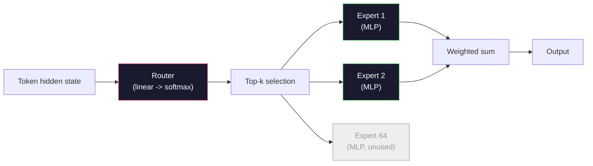

# खुले मॉडल: वास्तुकला के मार्गदर्शक

> आपने पाठ 04 में एक जीपीटी-2 छोटा खरोंच से बनाया। 2026 में फ्रंटियर ओपन मॉडल पांच या छह ठोस परिवर्तनों के साथ एक ही परिवार हैं। LayerNorm के बजाय RMSNorm। जीएलयू के बजाय स्विगलू। सीखे पदों के बजाय रोपे। पूर्ण एमएचए के बजाय जीक्यूए या एमएलए। विशेषज्ञों के मिश्रण के पैमाने पर। गणित जो आप पहले से ही जानते हैं उनमें से 95% को कवर करता है। यह पाठ लामा 3, डीपसिक-वी3, मिक्स्ट्रल, क्यूवेन और जेम्मा को एक साथ पढ़ता है और उस सटीक रेखा का नाम देता है जहां प्रत्येक वास्तुकला भिन्न होती है।

**Type:** Learn
**Languages:** Python (stdlib)
**Prerequisites:** Phase 10, Lessons 04, 05, 12 (Pre-training, Scaling, Inference)
**Time:** ~45 minutes

## सीखने के लक्ष्य

- Llama 3, Mistral, Mixtral, Gemma 2, Qwen 2.5 और DeepSeek-V3 के config.json को पढ़ें और प्रत्येक क्षेत्र की व्याख्या करें
- GPT-2 छोटे के मुकाबले प्रत्येक मॉडल द्वारा किए गए विशिष्ट वास्तुकला परिवर्तन का नाम दें और इसे पहले सिद्धांतों से सही ठहराते हैं
- किसी भी खुले मॉडल के लिए गणना पैरामीटर, KV कैश आकार, और सक्रियण स्मृति केवल इसके कॉन्फ़िग से
- विलंबता, मेमोरी और क्षमता प्रतिबंधों को देखते हुए एक तैनाती लक्ष्य के लिए सही खुला मॉडल चुनें

## समस्या

पाठ 04 में आप 350 पंक्तियों के numpy लिखा और एक GPT-2 के आकार का मॉडल था। Llama 3 405B में 200 पृष्ठों की तकनीकी रिपोर्ट है। आपका स्वभाव यह है कि ये अलग जानवर हैं। वे नहीं हैं. 200 पृष्ठों में एक ही वस्तु का वर्णन किया गया है जिसमें पांच या छह अच्छी तरह से प्रेरित संशोधन हैं, साथ ही स्केलिंग के बारे में एक हजार कार्यान्वयन विवरण हैं। कंकाल -- एम्बेडिंग, ट्रांसफार्मर ब्लॉक, ध्यान, एमएलपी, मानदंड, सिर -- अपरिवर्तित है।

यह सबक एक अंतर है. प्रत्येक प्रमुख खुले मॉडल परिवार के लिए, हम सूचीबद्ध करते हैं कि GPT-2 से क्या बदल गया है, क्यों, और इसकी लागत क्या है। जब आप कर चुके हैं तो आप एक नया मॉडल कार्ड पढ़ सकते हैं और इसे मानसिक रूप से GPT-2 मूल रेखा में वापस अनुवाद कर सकते हैं।

व्यावहारिक लाभ यह है कि जब मेटा लामा 5 जारी करता है या डीपसेक V4 जारी करता है, तो आपको एक नए मानसिक मॉडल की आवश्यकता नहीं होगी। आप कॉन्फ़िग को देखेंगे, देखेंगे कि प्रसिद्ध बटनों में से कौन सा स्थानांतरित हुआ है, और जानेंगे कि डाउनस्ट्रीम प्रभाव क्या हैं। 2026 वास्तुकला एक सीमित टूलबॉक्स है। प्रत्येक नया मॉडल एक अलग उपसमूह चुनता है।

## अवधारणा

### अपरिवर्तनीय मूल

सभी ऑटोरेग्रेसिव ओपन मॉडल साझा करते हैंः

- टोकन एम्बेडिंग मैट्रिक्स (वोकैब_साइज x छिपा_डीएम) ।
- N डिकोडर ब्लॉकों का ढेरः मानक, आत्म-विचार, अवशिष्ट, मानक, एमएलपी, अवशिष्ट।
- अंतिम मानदंड और रैखिक सिर को vocab_size पर प्रक्षेपित करना (अक्सर एम्बेडेड के साथ वजन-बंद) ।
- कारण मुखौटा, अगले टोकन क्रॉस-एंट्रोपी हानि।

यह आकार है, बाकी बटन हैं।

### वास्तव में चलने वाले छह बटन

2024-2026 तक हर सीमा खुली मॉडल में, वही छह डिजाइन विकल्प बार-बार चुने जाते हैंः

1. **Normalization.**LayerNorm -> RMSNorm।
2. **Positional encoding.**सीखा गया पूर्ण -> RoPE (प्लस वेरिएंटः YaRN, NTK) ।
3. **Activation.**GELU -> SwiGLU (या GeGLU)
4. **Attention head sharing.**एमएचए -> जीक्यूए -> एमक्यूए -> एमएलए।
5. **Dense vs sparse MLP.**घने -> विशेषज्ञों के मिश्रण।
6. **Pre-norm placement.**पूर्व-नियमित रहता है, पोस्ट-नियमित चला गया है।

बाकी सब कुछ (शिक्षा दर अनुसूची, डेटा मिश्रण, बैच आकार, संदर्भ लंबाई) प्रशिक्षण कॉन्फ़िगरेशन में रहता है, वास्तुकला में नहीं। छह बटन।

### बटन 1: RMSNorm

LayerNorm औसत घटाता है, std, पैमाने, और शिफ्ट द्वारा विभाजित। RMSNorm केवल पैमाने को रखता हैः

```
RMSNorm(x) = x / sqrt(mean(x^2) + eps) * gamma
```

कोई औसत घटाव नहीं। कोई पूर्वाग्रह नहीं। प्रति टोकन एक मैमूल कम। Zhang और Sennrich (2019) ने तर्क दिया कि यह मशीन अनुवाद पर LayerNorm से मेल खाता है जबकि 10% तेज़ है। हर आधुनिक खुला मॉडल इसे चलाता है।

लागतः कोई नहीं लाभः छोटी गति जीत, सरल कोड।

### नट 2: रोपी

सीखे गए स्थिति एम्बेडमेंट GPT-2 में 1024 स्लॉट की खोज तालिका थे। संदर्भ 1025 तालिका के अंत से बाहर है। मॉडल अपनी प्रशिक्षण लंबाई से परे एक्सट्रापोलेट नहीं कर सकते।

रोटर पोजीशन एम्बेडिंग (RoPE, Su et al. 2021) ध्यान बिंदु उत्पाद से पहले प्रत्येक Q और K वेक्टर को जोड़े में घुमाकर स्थिति इंजेक्ट करता है। घूर्णन कोण स्थिति का निर्धारक कार्य है, इसलिए कुछ भी नहीं सीखा और कुछ भी नहीं चलाया जा सकता है। स्केलिंग ट्रिक्स (NTK-awareness interpolation, YaRN) के साथ, 8k संदर्भ पर प्रशिक्षित एक मॉडल मामूली सटीकता हानि के साथ अनुमान पर 128k तक बढ़ा सकता है।

```
q_rotated = rotate(q, angle(pos))
k_rotated = rotate(k, angle(pos))
score = q_rotated . k_rotated
```

प्रत्येक लामा, मिस्ट्रल, क्यूवेन, डीपसेक और जेम्मा में रोपीई का उपयोग किया जाता है। जेम्मा 2 में हाइब्रिड (ज्यादातर परतों पर रोपीई, अन्य पर स्थानीय स्लाइडिंग विंडो ध्यान) का उपयोग किया जाता है।

### घुड़सवार 3: SwiGLU

जीपीटी-2 की एमएलपी है `x -> gelu(xW1 + b1) -> (...)W2 + b2`. SwiGLU (Shazeer 2020) सक्रियण को एक बंद उत्पाद से बदल देता हैः

```
SwiGLU(x) = (xW1) * sigmoid(xW1) * xV
```

एक के बजाय समानांतर दो प्रोजेक्शन, स्विश सक्रियण द्वारा गॉट किए गए। पैरामीटर प्रति भ्रम पर अनुभवजन्य रूप से मजबूत। Llama 2 ने इसे अपनाया, सभी ने इसका पालन किया। MLP का छिपा आकार आमतौर पर सेट किया जाता है ताकि कुल पैरामीटर की गिनती मूल घने MLP से मेल खाएः यदि GPT-2 का उपयोग किया गया था`ff_dim = 4 * hidden`, SwiGLU का उपयोग करता है `ff_dim = (2/3) * 4 * hidden = 8/3 * hidden`. .

### चौथा बटनः ध्यान देने योग्य सिर साझा करना

GPT-2 का प्रयोग किया गया **Multi-Head Attention (MHA)**: प्रत्येक सिर का अपना स्वयं का क्यू, के, वी प्रोजेक्शन होता है।

**Multi-Query Attention (MQA, Shazeer 2019)**सभी सिरों पर एक K और एक V साझा करता है। KV कैश को num_heads द्वारा काटता है, जो एक विशिष्ट मॉडल पर 12x से 32x तक की कमी है। हार्ड बेंचमार्क पर सटीकता थोड़ी गिर जाती है।

**Grouped-Query Attention (GQA, Ainslie et al. 2023)**मध्य बिंदु हैः Q सिरों के G समूह एक K और एक V साझा करते हैं। Llama 3 8B 32 Q सिरों और 8 KV सिरों (G=8) के साथ GQA का उपयोग करता है, इसलिए KV कैश पूर्ण MHA के मुकाबले 4x छोटा होता है।

**Multi-Head Latent Attention (MLA, DeepSeek 2024)**यह एक साझा कम रैंक वाले लटेंट में K और V को संपीड़ित करता है, जिससे उन्हें प्रति सिर वापस प्रक्षेपित किया जाता है। यह प्रति सिर अभिव्यक्तिशीलता को बनाए रखते हुए KV कैश को और कम करता है। डीपसेक-वी 2 और वी 3 अपने लंबे संदर्भ प्रदर्शन के लिए इस पर निर्भर करते हैं।

| Scheme | KV Heads | KV Cache | Accuracy |
|--------|----------|----------|----------|
| MHA    | num_heads | full | best |
| GQA    | num_groups (G < num_heads) | num_heads / G reduction | near-MHA |
| MQA    | 1 | num_heads reduction | small hit |
| MLA    | latent, per-head decompression | smaller than MQA | near-MHA |

~ 13 बी मापदंडों से ऊपर के किसी भी मॉडल के लिए, GQA या MLA प्रभावी रूप से अनिवार्य है। पैमाने पर पूर्ण MHA एक KV कैश आपदा है।

### नट 5: विशेषज्ञों का मिश्रण

एक मोटे एमएलपी प्रत्येक टोकन के लिए अपने सभी मापदंडों को सक्रिय करता है। एक एमओई एमएलपी में प्रति ब्लॉक के विशेषज्ञ और एक राउटर होता है जो प्रति टोकन (आमतौर पर शीर्ष-2) शीर्ष-के विशेषज्ञों का चयन करता है। केवल उन विशेषज्ञों के वजन उस टोकन के लिए आगे का पास देखते हैं।

```
router_logits = xW_r
indices, weights = top_k(router_logits, k=2)
output = sum_i weights[i] * expert[indices[i]](x)
```

अपीलः आप आकार 7B के 64 विशेषज्ञों को प्रत्येक (इसलिए कुल पैरामीटर गिनती बहुत बड़ी है) कर सकते हैं जबकि उनमें से केवल 2 प्रति टोकन चला रहे हैं (इसलिए प्रति टोकन गणना घने 7B मॉडल से मेल खाती है) । मिक्स्ट्रल 8x7B में 47B कुल पैरामीटर हैं लेकिन प्रति टोकन केवल 13B को सक्रिय करता है। डीपसेक-वी 3 में 671B कुल पैरामीटर हैं लेकिन प्रति टोकन केवल 37B को सक्रिय करता है।



पेशेवरोंः एक ही गणना, अधिक मापदंड, बेहतर क्षमता। नुकसानः विशेषज्ञ स्मृति को अभी भी कहीं रहना होगा (इसलिए सेवा को घने समकक्ष की तुलना में अधिक वीआरएएम की आवश्यकता होती है), राउटर को भार संतुलन करना मुश्किल है, और संरेखण के दौरान राउटर को ठीक से समायोजित करना अपना स्वयं का शोध क्षेत्र है।

### बटन 6: पूर्व-मानक रहता है

मूल ट्रांसफार्मर प्रत्येक उपपरक के बाद परत मानदंड लागू करता है। GPT-2 के बाद से हर खुले मॉडल इसे * प्रत्येक उपपरक के पहले * रखता है। गहराई में प्रशिक्षण के लिए पूर्व-मानदंड सख्ती से आसान है। बहस करने के लिए कुछ भी नहीं है।

### मॉडल-दर-मॉडल अंतर

यहाँ यह तालिका है जो इस सब को कंक्रीट बनाती है।

| Model | Year | Total Params | Active Params | Norm | Activation | Position | Attention | MoE | Context |
|-------|------|-------------|---------------|------|-----------|----------|-----------|-----|---------|
| GPT-2 Small | 2019 | 124M | 124M | LayerNorm | GELU | Learned | MHA (12 heads) | no | 1k |
| Llama 3 8B | 2024 | 8B | 8B | RMSNorm | SwiGLU | RoPE | GQA (32/8) | no | 128k |
| Llama 3 70B | 2024 | 70B | 70B | RMSNorm | SwiGLU | RoPE | GQA (64/8) | no | 128k |
| Llama 3 405B | 2024 | 405B | 405B | RMSNorm | SwiGLU | RoPE | GQA (128/16) | no | 128k |
| Mistral 7B | 2023 | 7.2B | 7.2B | RMSNorm | SwiGLU | RoPE | GQA | no | 32k |
| Mixtral 8x7B | 2023 | 47B | 13B | RMSNorm | SwiGLU | RoPE | GQA | yes (8 experts, top-2) | 32k |
| Gemma 2 9B | 2024 | 9B | 9B | RMSNorm (pre+post) | GeGLU | RoPE + sliding | GQA | no | 8k |
| Qwen 2.5 72B | 2024 | 72B | 72B | RMSNorm | SwiGLU | RoPE (YaRN) | GQA (64/8) | no | 128k |
| DeepSeek V2 236B | 2024 | 236B | 21B | RMSNorm | SwiGLU | RoPE | MLA | yes (160 experts, top-6) | 128k |
| DeepSeek V3 | 2024 | 671B | 37B | RMSNorm | SwiGLU | RoPE | MLA | yes (256 experts, top-8) | 128k |

स्तंभों को स्कैन करें। RMSNorm सार्वभौमिक है। SwiGLU या इसके GeGLU चचेरे भाई सार्वभौमिक है। RoPE सार्वभौमिक है। GQA 7B से ऊपर सार्वभौमिक है, जब तक कि MLA द्वारा प्रतिस्थापित नहीं किया जाता है। MoE शीर्ष अंत में अंतर है।

### एक config.json पढ़ना

Llama 3 8B कॉन्फ़िगरेशनः

```
{
  "hidden_size": 4096,
  "intermediate_size": 14336,
  "num_hidden_layers": 32,
  "num_attention_heads": 32,
  "num_key_value_heads": 8,
  "max_position_embeddings": 131072,
  "rope_theta": 500000.0,
  "rms_norm_eps": 1e-5,
  "vocab_size": 128256
}
```

प्रत्येक क्षेत्र आपके द्वारा पहले से ही लागू किए गए किसी चीज़ के अनुरूप है।

- `hidden_size`: सम्मिलित आयाम।
- `intermediate_size`: एमएलपी छिपा आकार (3.5x छिपा -- SwiGLU गणित).
- `num_hidden_layers`: स्टैक गहराई।
- `num_attention_heads`: क्यू हेड।
- `num_key_value_heads`: KV हेड (GQA)
- `max_position_embeddings`: प्रशिक्षण संदर्भ लंबाई।
- `rope_theta`: RoPE आधार आवृत्ति. मेटा इसे लंबे संदर्भ के लिए डिफ़ॉल्ट 10k से 500k तक स्केल किया।
- `rms_norm_eps`: संख्यात्मक स्थिरता।
- `vocab_size`: टोकन

केवल इनसे आप कुल मापदंडों, KV कैश और पीक सक्रियण स्मृति की गणना करते हैं।`code/main.py`सटीक सूत्रों के लिए।

### सक्रियण स्मृति बजट

कुछ अरबों पैरामीटर से ऊपर प्रशिक्षण स्मृति पर सक्रियता हावी होती है। प्री-ट्रेनिंग के लिए अंगूठे का नियम (ग्रेडिएंट चेकपोइंटिंग के साथ):

```
activation_mem ~ batch_size * seq_len * hidden_size * num_layers * bytes_per_element
```

Llama 3 8B के लिए बैच 1 पर, सीक्वल 8192, BF16, 32 परतें, छिपी हुई 4096: लगभग 8 GB केवल चेकपॉइंटिंग के साथ सक्रियण के लिए, 40 GB के बिना। यही कारण है कि फ्लैश-अंतर्वतन और रिंग-अंतर्वतन मायने रखता है - वे ध्यान गणना को फिर से लिखते हैं ताकि सक्रियण फिट हो।

### KV कैश बजट

अधिकतम संदर्भ में निष्कर्ष के लिएः

```
kv_cache = 2 * num_layers * num_kv_heads * head_dim * max_seq_len * bytes_per_element
```

Llama 3 8B 128k संदर्भ में, BF16, head_dim = छिपा / num_heads = 128:
`2 * 32 * 8 * 128 * 131072 * 2 = 17.2 GB`क्रम के अनुसार।

8B वजन BF16 में 16 GB है। एकल 128k अनुक्रम के लिए KV कैश वजन से बड़ा है। यह GQA, MLA और KV कैश क्वांटिज़ेशन अनुसंधान को चलाने वाले मेमोरी दबाव है।

### जब प्रत्येक मॉडल जीतता है

- **Single 80GB GPU, no MoE**: लामा 3 8 बी, मिस्ट्रल 7 बी, जेम्मा 2 9 बी. सेवा करने में आसान, व्यापक उपकरण।
- **Single node (8x80GB), big capacity**: Llama 3 70B, Qwen 2.5 72B. उच्चतम घनत्व खुला क्षमता।
- **Biggest open capability, accept MoE complexity**: डीप सीक V3, मिक्स्ट्रल 8x22B. प्रति सक्रिय FLOP में सर्वश्रेष्ठ क्षमता।
- **Long-context needs**: Llama 3 (128k RoPE स्केलिंग के साथ), डीप सीक (MLA लाभ) ।
- **Low-latency serving**: Gemma 2 9B (स्लाइडिंग विंडो लंबी-सामग्री गणना काटता है) ।

```figure
rmsnorm-vs-layernorm
```

## इसे बनाओ

पाठ का कोड एक कैलकुलेटर है। किसी भी config.json को देखते हुए, यह घटक द्वारा पैरामीटर गिनती, अधिकतम संदर्भ पर KV कैश, SwiGLU MLP अनुपात और वास्तुकला पर एक छोटा फैसला (घन / GQA / MLA / MoE) प्रिंट करता है।

```python
config = {
    "hidden_size": 4096, "intermediate_size": 14336,
    "num_hidden_layers": 32, "num_attention_heads": 32,
    "num_key_value_heads": 8, "vocab_size": 128256,
    "max_position_embeddings": 131072,
}
```

स्क्रिप्ट वास्तुकला क्षेत्र को क्षेत्र द्वारा चलाता है, एम्बेडिंग, ध्यान (जीक्यूए कमी के साथ), एमएलपी (स्विगल एक्सपेंशन के साथ), परत मानकों और सिर के लिए पैरामीटर गिनती की गणना करता है। फिर यह निर्दिष्ट संदर्भ लंबाई पर केवी कैश की गणना करता है और सारांश प्रिंट करता है।

देखो`code/main.py`कार्यान्वयन के लिए।

## इसका प्रयोग करें

स्क्रिप्ट में बंडल किए गए Llama 3 8B, Mistral 7B, Mixtral 8x7B और DeepSeek V3 कॉन्फ़िगरेशन पर कैलकुलेटर चलाएं। पैरामीटर ब्रेकडाउन की तुलना करें। ध्यान दें कि MoE मॉडल में एक कुल पैरामीटर काउंट है जो घने मॉडल को छोटा करता है लेकिन एक सक्रिय पैरामीटर काउंट जो अक्सर छोटा होता है। ध्यान दें कि DeepSeek V3 का KV कैश Llama 3 405B की तुलना में छोटा है।

फिर स्थानीय रूप से आपके पास मौजूद किसी भी मॉडल के लिए एक कॉन्फ़िग को प्लग करें, सारांश पढ़ें, और तय करें कि क्या यह आपके GPU के अनुरूप है।

## इसे भेजें

यह सबक हमें फल देता है`outputs/skill-open-model-picker.md`. एक तैनाती लक्ष्य (जीपीयू प्रकार, वीआरएएम, संदर्भ लंबाई, विलंबता बजट) और एक कार्य प्रोफ़ाइल (चैट, कोड, तर्क, लंबी-संदर्भ) को देखते हुए, यह एक खुले मॉडल, पाठ 11 से एक क्वांटिज़ेशन योजना और पाठ 12 से एक निष्कर्ष स्टैक की सिफारिश करता है, जिसमें छह वास्तुकला बटनों के बारे में स्पष्ट तर्क दिया जाता है।

## व्यायाम

1. HuggingFace से Qwen 2.5 72B कॉन्फ़िग पढ़ें। स्क्रैच से कुल मापदंडों की गणना करें। HF द्वारा रिपोर्ट किए गए मान की तुलना करें और किसी भी डेल्टा की उत्पत्ति की पहचान करें (हेड डिम गोल, KV साझा कारक, आदि) ।

2. डीपसेक V3 में शीर्ष 8 रूटिंग के साथ 256 विशेषज्ञों का उपयोग किया जाता है। सक्रिय विशेषज्ञों के अनुपात को कुल विशेषज्ञों के बीच गणना करें और Mixtral 8x7B के शीर्ष 2 की तुलना करें। 8. फ्लोप प्रति क्षमता के बारे में घना (25%) से घना दुर्लभ (3%) तक की शिफ्ट क्या है?

3. FP8 और BF16 में 128k संदर्भ में Llama 3 405B के लिए KV कैश की गणना करें। FP8 में यह BF16 संख्या का आधा है। आप एक एकल 8xH100 नोड पर कितने समानांतर अनुक्रमों को सेवा दे सकते हैं (80GB प्रत्येक = 640GB कुल, वज़न स्मृति को घटाकर)?

4. जेम्मा 2 पूर्ण ध्यान और स्लाइडिंग विंडो-अटेंशन परतों का आदान-प्रदान करता है। केवी कैश के लिए गणित लिखें जब आधे परतें पूर्ण संदर्भ के बजाय 4096 टोकन स्लाइडिंग विंडो का उपयोग करती हैं। कुल संदर्भ में 8k पर यह कितनी स्मृति बचाता है?

5. एक हालिया सीमा मुक्त मॉडल खोजें जो इस पाठ के लिखने के बाद जारी किया गया था. यह पहचानें कि उसने किन छह बटनों को चुना और क्या उसने सातवें बटन को पेश किया। पाठ्यक्रम एक नए वास्तुकला जहाज के क्षण में पुराना महसूस करेगा - लक्ष्य आपके मानसिक मॉडल को पुनर्निर्माण किए बिना अपनी मेज को अपडेट करना है।

## प्रमुख शर्तें

| Term | What people say | What it actually means |
|------|----------------|----------------------|
| RMSNorm | "LayerNorm without the mean" | Normalize by root mean square only, with a learned scale — cheaper and comparable to LayerNorm |
| RoPE | "Rotary positions" | Rotate each Q and K vector in 2D pairs by an angle that depends on position — extrapolates beyond training length with scaling tricks |
| SwiGLU | "The new MLP activation" | Gated linear unit with Swish: `(xW1) * sigmoid(xW1) * xV` — standard in every 2024+ open model |
| GQA | "Middle ground attention" | Grouped-Query Attention: G groups of Q heads share one K and one V head — shrinks KV cache without MQA's accuracy hit |
| MLA | "DeepSeek's attention" | Multi-Head Latent Attention: compress K/V into a shared low-rank latent, decompress per head — smallest KV cache for large models |
| MoE | "Sparse experts" | Mixture of Experts: N MLPs per block, router picks top-k per token — huge total params, small active params |
| Top-k routing | "Pick k experts per token" | The router computes a score per expert and activates the k highest — typical k is 2 (Mixtral) to 8 (DeepSeek) |
| YaRN | "Stretch RoPE" | Yet another RoPE extension — interpolates rotary angles to extend context from 8k to 128k+ at inference time |
| Sliding-window attention | "Don't attend to everything" | Each token attends only to the last W tokens — caps attention cost at O(W) per token, used in Gemma 2 and early Mistral |
| Active params | "What runs per token" | For MoE models, the parameter count that sees a forward pass per token (much smaller than total params) — governs per-token FLOPs |

## आगे पढ़ना

- [Dubey et al., 2024 -- "The Llama 3 Herd of Models"](https://arxiv.org/abs/2407.21783)-- घने लामा 3 परिवार के लिए वास्तुशिल्प और प्रशिक्षण संदर्भ
- [DeepSeek-AI, 2024 -- "DeepSeek-V3 Technical Report"](https://arxiv.org/abs/2412.19437)-- MLA प्लस सहायक हानि मुक्त भार संतुलन प्लस 671B MoE
- [Jiang et al., 2024 -- "Mixtral of Experts"](https://arxiv.org/abs/2401.04088)-- कैनोनिक एमओई ओपन मॉडल पेपर
- [Su et al., 2021 -- "RoFormer: Enhanced Transformer with Rotary Position Embedding"](https://arxiv.org/abs/2104.09864)-- RoPE कागज
- [Shazeer, 2020 -- "GLU Variants Improve Transformer"](https://arxiv.org/abs/2002.05202)-- SwiGLU, GeGLU, और दोस्तों
- [Ainslie et al., 2023 -- "GQA: Training Generalized Multi-Query Transformer Models"](https://arxiv.org/abs/2305.13245)-- GQA पेपर
- [Gemma 2 Team, 2024 -- "Gemma 2: Improving Open Language Models at a Practical Size"](https://arxiv.org/abs/2408.00118)-- हाइब्रिड फुल+स्लाइडिंग ध्यान, प्री+पोस्ट-नॉर्म
- [Qwen Team, 2024 -- "Qwen 2.5 Technical Report"](https://arxiv.org/abs/2412.15115)-- YaRN संदर्भ विस्तार और लंबी-संदर्भ प्रशिक्षण व्यंजन
