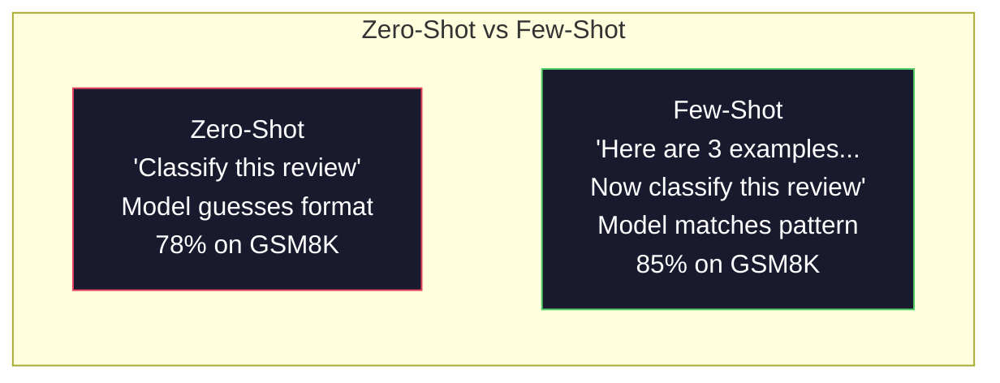
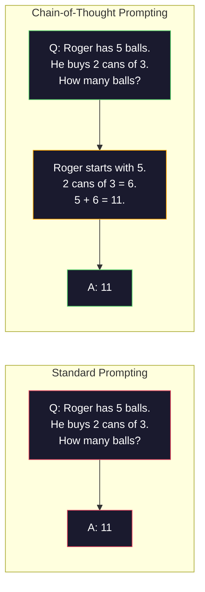
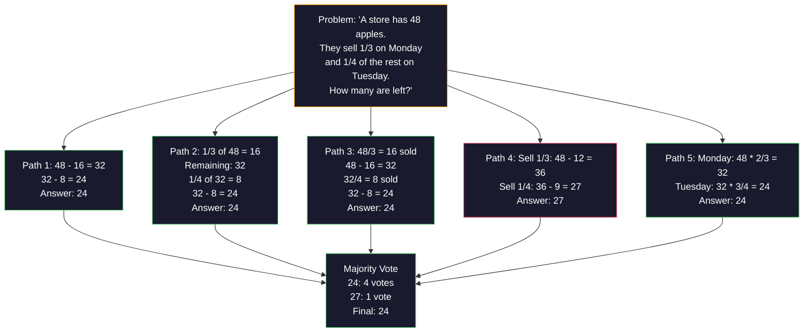
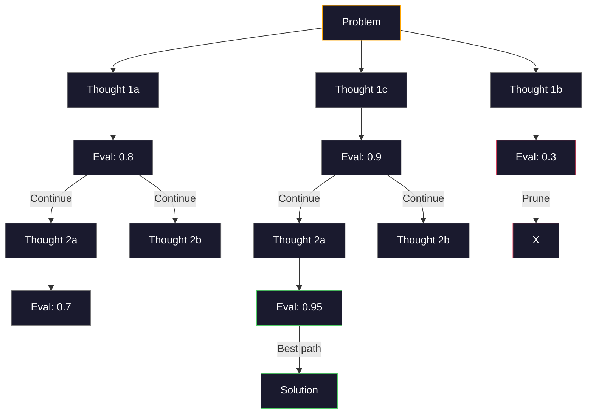

# कुछ शॉट, सोच की श्रृंखला, सोच के पेड़

> एक मॉडल को यह बताने के लिए कि क्या करना है, यह प्रेरित करना है। इसे सोचने का तरीका दिखाना इंजीनियरिंग है। एक ही मॉडल, एक ही कार्य, एक ही डेटा पर 78% और 91% सटीकता के बीच का अंतर एक बेहतर मॉडल नहीं है। यह एक बेहतर तर्क रणनीति है।

**Type:** Build
**Languages:** Python
**Prerequisites:** Lesson 11.01 (Prompt Engineering)
**Time:** ~45 minutes

## सीखने के लक्ष्य

- कुछ शॉट्स के लिए अनुरोध को लागू करें जो कार्य सटीकता को अधिकतम करने के लिए उदाहरण प्रदर्शनों का चयन और स्वरूपण करके
- गणित शब्द समस्या जैसे बहु-चरण समस्याओं पर सटीकता में सुधार के लिए सोच श्रृंखला (CoT) तर्क का उपयोग करें
- एक विचार-वृक्ष का निर्माण करें जो कई तर्क पथों की खोज करता है और सबसे अच्छा चुनता है
- मानक बेंचमार्क पर शून्य शॉट बनाम कुछ शॉट बनाम CoT से सटीकता में सुधार को मापें

## समस्या

आप एक गणित ट्यूटोरियल ऐप बनाते हैं. आपका प्रॉम्प्ट कहता हैः "इस शब्द समस्या को हल करें". जीपीटी-5 जीएसएम 8 के पर 94% समय सही करता है, मानक ग्रेड स्कूल गणित बेंचमार्क। आप सोचते हैं कि आप पहले से ही शिखर पर हैं। आप नहीं करते हैं  सोच श्रृंखला अभी भी 3-4 अंक जोड़ता है।

पांच शब्द जोड़ें - "चलो कदम से कदम सोचें" - और सटीकता 91% तक बढ़ जाती है। कुछ काम किए गए उदाहरण जोड़ें और यह 95% तक पहुंच जाता है। एक ही मॉडल। एक ही तापमान। एक ही एपीआई लागत। एकमात्र अंतर यह है कि आपने मॉडल को खरोंच पेपर दिया है।

यह हैक नहीं है. यह तर्क कैसे काम करता है. मनुष्य एक मानसिक छलांग में बहु-चरण समस्याओं को हल नहीं करते हैं। न ही ट्रांसफार्मर करते हैं। जब आप एक मॉडल को मध्यवर्ती टोकन उत्पन्न करने के लिए मजबूर करते हैं, तो ये टोकन अगले टोकन के संदर्भ का हिस्सा बन जाते हैं। प्रत्येक तर्क चरण अगले को खिलाता है। मॉडल सचमुच उत्तर के लिए अपना रास्ता गणना करता है।

लेकिन "चरण-चरण सोचें" शुरुआत है, अंत नहीं। क्या होगा अगर आप पांच तर्क पथों का नमूना लेते हैं और बहुमत का वोट लेते हैं? क्या होगा यदि आप मॉडल को संभावनाओं के पेड़ का पता लगाने देते हैं, मूल्यांकन और शाखाओं को काटते हैं? क्या होगा यदि आप तर्क को उपकरण के उपयोग के साथ जोड़ते हैं? ये परिकल्पना नहीं हैं। ये मापने वाले सुधारों के साथ प्रकाशित तकनीकें हैं, और आप उन्हें सभी का निर्माण करेंगे इस पाठ में।

## अवधारणा

### शून्य शॉट बनाम कुछ शॉटः जब उदाहरण निर्देशों को हराते हैं

शून्य-शॉट प्रलोभन मॉडल को एक कार्य देता है और कुछ और नहीं। कुछ-शॉट प्रलोभन उसे पहले उदाहरण देता है।

वेई और अन्य (2022) ने 8 बेंचमार्क के माध्यम से यह मापा। भावना वर्गीकरण जैसे सरल कार्यों के लिए, शून्य-शॉट और कुछ-शॉट एक दूसरे के 2% के भीतर किए गए। बहु-चरण अंकगणित और प्रतीकात्मक तर्क जैसे जटिल कार्यों के लिए, कुछ-शॉट ने 10-25% की सटीकता में सुधार किया।

अंतर्ज्ञानः उदाहरण संपीड़ित निर्देश हैं। आप आउटपुट प्रारूप का वर्णन करने के बजाय, इसे दिखाते हैं। तर्क प्रक्रिया की व्याख्या करने के बजाय, आप इसे प्रदर्शित करते हैं। मॉडल पैटर्न उदाहरणों पर अधिक विश्वसनीय रूप से मेल खाता है। यह अमूर्त निर्देशों की व्याख्या करता है।



**When few-shot wins:**प्रारूप-संवेदनशील कार्य, वर्गीकरण, संरचित निकासी, डोमेन-विशिष्ट जारगोन, कोई भी कार्य जहां मॉडल को एक विशिष्ट पैटर्न से मेल खाने की आवश्यकता होती है।

**When zero-shot wins:**सरल तथ्यात्मक प्रश्न, रचनात्मक कार्य जहां उदाहरण रचनात्मकता को सीमित करते हैं, कार्य जहां अच्छे उदाहरण ढूंढना अच्छे निर्देश लिखने से कठिन है।

### उदाहरण चयनः समान बेट्स यादृच्छिक

सभी उदाहरण समान नहीं हैं। लक्ष्य इनपुट के समान उदाहरणों का चयन वर्गीकरण कार्यों पर यादृच्छिक चयन से 5-15% बेहतर प्रदर्शन करता है (लिउ एट अल, 2022) । तीन सिद्धांतः

1. **Semantic similarity**: एम्बेडिंग स्पेस में इनपुट के सबसे निकट उदाहरण चुनें
2. **Label diversity**: अपने उदाहरणों में सभी आउटपुट श्रेणियों को कवर
3. **Difficulty matching**: लक्ष्य समस्या की जटिलता के स्तर से मेल खाता है

अधिकांश कार्यों के लिए उदाहरणों की इष्टतम संख्या 3-5 है। 3 के नीचे, मॉडल में पैटर्न निकालने के लिए पर्याप्त संकेत नहीं है। 5 के ऊपर, आप घटते रिटर्न और संदर्भ विंडो टोकन को मारते हैं। कई लेबल के साथ वर्गीकरण के लिए, प्रत्येक लेबल के लिए एक उदाहरण का उपयोग करें।

### सोच श्रृंखलाः मॉडल देना स्क्रैच पेपर

Google Brain में Wei et al. (2022) द्वारा विचार श्रृंखला (CoT) प्रलोभन शुरू किया गया था। विचार सरल हैः केवल उत्तर के लिए मॉडल से पूछने के बजाय, उसे पहले अपने तर्क चरणों को दिखाने के लिए कहें।



यह यांत्रिक रूप से क्यों काम करता है? प्रत्येक टोकन जो एक ट्रांसफार्मर उत्पन्न करता है, अगले टोकन के लिए संदर्भ बन जाता है। बिना CoT के, मॉडल को एक एकल फॉरवर्ड पास की छिपी हुई स्थिति में सभी तर्क को संपीड़ित करना चाहिए। CoT के साथ, मॉडल टोकन के रूप में मध्यवर्ती गणना को बाहरी करता है। प्रत्येक तर्क टोकन प्रभावी गणना गहराई का विस्तार करता है।

**GSM8K benchmarks (grade-school math, 8.5K problems):**

| Model | Zero-Shot | Zero-Shot CoT | Few-Shot CoT |
|-------|-----------|---------------|--------------|
| GPT-4o | 78% | 91% | 95% |
| GPT-5 | 94% | 97% | 98% |
| o4-mini (reasoning) | 97% | — | — |
| Claude Opus 4.7 | 93% | 97% | 98% |
| Gemini 3 Pro | 92% | 96% | 98% |
| Llama 4 70B | 80% | 89% | 94% |
| DeepSeek-V3.1 | 89% | 94% | 96% |

**Note on reasoning models.**ओपनएआई के ओ-सीरीज (ओ3, ओ4-मिनी) और डीपसेक-आर1 जैसे मॉडल अपने उत्तर जारी करने से पहले आंतरिक रूप से विचार श्रृंखला चलाते हैं। तर्क मॉडल में "चलो कदम से कदम सोचें" जोड़ना अधिमानतः और कभी-कभी प्रतिकूल होता है।

कोट के दो स्वादः

**Zero-shot CoT**कोजिमा एट अल. (2022) ने दिखाया कि यह एकल वाक्य अंकगणित, सामान्य ज्ञान और प्रतीकात्मक तर्क कार्यों में सटीकता में सुधार करता है।

**Few-shot CoT**शून्य शॉट CoT से अधिक प्रभावी क्योंकि मॉडल आपको अपेक्षित तर्क प्रारूप को देखता है।

**When CoT hurts**: सरल तथ्यात्मक याद ("फ्रांस की राजधानी क्या है?"), एकल-चरण वर्गीकरण, ऐसे कार्य जहां सटीकता से अधिक गति महत्वपूर्ण है। CoT प्रति क्वेरी तर्क सामान्य लागत के 50-200 टोकन जोड़ता है। उच्च-प्रभाव, कम जटिलता वाले कार्यों के लिए, यह व्यर्थ लागत है।

### आत्म-समन्वय: कई लोगों का नमूना लें, एक बार वोट दें

वांग और सहयोगियों (2023) ने आत्म-समर्पण की शुरुआत की। अंतर्दृष्टिः एक एकल CoT पथ में तर्क त्रुटियां हो सकती हैं। लेकिन यदि आप N स्वतंत्र तर्क पथों का नमूना लेते हैं (तापमान > 0 का उपयोग करते हुए) और अंतिम उत्तर पर बहुमत का वोट लेते हैं, तो त्रुटियां रद्द हो जाती हैं।



आत्म-समरूपता ने मूल पॉलम 540 बी प्रयोगों पर N=40 के साथ GSM8K सटीकता को 56.5% (एकल CoT) से 74.4% तक बढ़ाया। जीपीटी-5 पर सुधार छोटा है (97% से 98%) क्योंकि आधार सटीकता पहले से ही संतृप्त है। तकनीक 60-85% बेस कोट सटीकता वाले मॉडल पर सबसे ज्यादा चमकती है -- एक मीठा बिंदु जहां एकल पथ त्रुटियां अक्सर होती हैं लेकिन व्यवस्थित नहीं होती हैं। तर्क मॉडल (ओ-सीरीज, R1) के लिए आत्म-समंजस्य अंतर्निहित आंतरिक नमूनाकरण द्वारा समाहित किया जाता है।

N नमूने का मतलब है Nx एपीआई लागत और विलंबता। व्यवहार में, N=5 अधिकांश लाभ को पकड़ता है। N=3 एक सार्थक वोट के लिए न्यूनतम है। N > 10 में अधिकांश कार्यों के लिए घटती हुई रिटर्न होती है।

### विचार का वृक्षः शाखाओं की खोज

याओ एट एल्स (2023) ने ट्री ऑफ थिंक (ToT) पेश किया। जहां CoT एक रैखिक तर्क पथ का अनुसरण करता है, तो ToT आगे बढ़ने से पहले कई शाखाओं का पता लगाता है और मूल्यांकन करता है जो सबसे अधिक आशाजनक हैं।



TOT में तीन घटक हैंः

1. **Thought generation**: कई उम्मीदवारों को अगले चरणों में उत्पन्न
2. **State evaluation**: प्रत्येक उम्मीदवार को स्कोर (एलएलएम स्वयं का मूल्यांकनकर्ता के रूप में उपयोग कर सकते हैं)
3. **Search algorithm**: बीएफएस या डीएफएस पेड़ के माध्यम से, कम स्कोर वाली शाखाओं को काटने

24 के खेल के कार्य पर (गणितीय उपयोग करके 24 बनाने के लिए 4 संख्याओं को मिलाएं), मानक प्रलोभन के साथ GPT-4 7.3% समस्याओं को हल करता है। CoT के साथ, 4.0% (CoT वास्तव में यहां चोट करता है क्योंकि खोज स्थान व्यापक है) । ToT के साथ, 74%.

ToT महंगा है। पेड़ में प्रत्येक नोड को LLM कॉल की आवश्यकता होती है। शाखा कारक 3 और गहराई 3 के साथ एक पेड़ को 39 LLM कॉल की आवश्यकता होती है। इसका उपयोग केवल उन समस्याओं के लिए करें जहां खोज स्थान बड़ा है लेकिन मूल्यांकन योग्य है - योजना, पहेली हल करना, प्रतिबंधों के साथ रचनात्मक समस्या समाधान।

### प्रतिक्रियाः सोच + कार्य

याओ एट अल. (2022) ने तर्क के निशानों को कार्यों के साथ जोड़ा। मॉडल सोच (विकल्पना उत्पन्न करना) और कार्य (उपकरणों को कॉल करना, खोज करना, कंप्यूटिंग) के बीच बदलता है।

```mermaid
graph LR
    Q["Question:\nWhat is the\npopulation of the\ncountry where\nthe Eiffel Tower\nis located?"]
    T1["Thought: I need to\nfind which country\nhas the Eiffel Tower"]
    A1["Action: search\n'Eiffel Tower location'"]
    O1["Observation:\nParis, France"]
    T2["Thought: Now I need\nFrance's population"]
    A2["Action: search\n'France population 2024'"]
    O2["Observation:\n68.4 million"]
    T3["Thought: I have\nthe answer"]
    F["Answer:\n68.4 million"]

    Q --> T1 --> A1 --> O1 --> T2 --> A2 --> O2 --> T3 --> F

    style Q fill:#1a1a2e,stroke:#ffa500,color:#fff
    style T1 fill:#1a1a2e,stroke:#51cf66,color:#fff
    style A1 fill:#1a1a2e,stroke:#e94560,color:#fff
    style O1 fill:#1a1a2e,stroke:#808080,color:#fff
    style T2 fill:#1a1a2e,stroke:#51cf66,color:#fff
    style A2 fill:#1a1a2e,stroke:#e94560,color:#fff
    style O2 fill:#1a1a2e,stroke:#808080,color:#fff
    style T3 fill:#1a1a2e,stroke:#51cf66,color:#fff
    style F fill:#1a1a2e,stroke:#51cf66,color:#fff
```



ReAct ज्ञान-गहन कार्यों पर शुद्ध CoT से बेहतर प्रदर्शन करता है क्योंकि यह वास्तविक डेटा पर अपना तर्क आधारित कर सकता है। HotpotQA (मल्टी-हॉप प्रश्न उत्तर) पर, GPT-4 के साथ ReAct अकेले CoT के लिए 35.1% सटीक मैच बनाम 29.4% प्राप्त करता है। वास्तविक शक्ति यह है कि तर्क त्रुटियों को अवलोकन द्वारा सुधार दिया जाता है - मॉडल अपने योजना को मध्य निष्पादन में अपडेट कर सकता है।

ReAct आधुनिक AI एजेंटों की नींव है। प्रत्येक एजेंट फ्रेमवर्क (LangChain, CrewAI, AutoGen) विचार-क्रिया-निरीक्षण लूप के कुछ प्रकार को लागू करता है। आप चरण 14 में पूर्ण एजेंट बनाएंगे। यह सबक प्रलोभन पैटर्न को कवर करता है।

### संरचित प्रमोटिंगः एक्सएमएल टैग, डेलिमिटर, हेडर

जैसे-जैसे प्रॉम्प्ट जटिल होते जाते हैं, संरचना मॉडल को भ्रमित करने से रोकती है। तीन दृष्टिकोणः

**XML tags**(क्लाउड के साथ सबसे अच्छा काम करता है, हर जगह ठोस):
```
<context>
You are reviewing a pull request.
The codebase uses TypeScript and React.
</context>

<task>
Review the following diff for bugs, security issues, and style violations.
</task>

<diff>
{diff_content}
</diff>

<output_format>
List each issue with: file, line, severity (critical/warning/info), description.
</output_format>
```

**Markdown headers**(सार्वभौमिक):
```
## Role
Senior security engineer at a fintech company.

## Task
Analyze this API endpoint for vulnerabilities.

## Input
{api_code}

## Rules
- Focus on OWASP Top 10
- Rate each finding: critical, high, medium, low
- Include remediation steps
```

**Delimiters**(कम से कम लेकिन प्रभावी):
```
---INPUT---
{user_text}
---END INPUT---

---INSTRUCTIONS---
Summarize the above in 3 bullet points.
---END INSTRUCTIONS---
```

### शीघ्र श्रृंखलाः क्रमशः विघटन

कुछ कार्य एक ही प्रॉम्प्ट के लिए बहुत जटिल होते हैं। प्रॉम्प्ट चेनिंग उन्हें चरणों में तोड़ देती है, जहां एक प्रॉम्प्ट का आउटपुट अगले का इनपुट बन जाता है।


तीन कारणों से चेनिंग एक ही प्रम्प्ट से धड़कता हैः

1. **Each step is simpler**: मॉडल एक केंद्रित कार्य को संभालता है बजाय सब कुछ संगम
2. **Intermediate outputs are inspectable**: आप चरणों के बीच सत्यापित और सुधार कर सकते हैं
3. **Different steps can use different models**: निष्कर्षण के लिए सस्ते मॉडल का उपयोग करें, तर्क के लिए एक महंगा

### प्रदर्शन तुलना

| Technique | Best For | GSM8K Accuracy (GPT-5) | API Calls | Token Overhead | Complexity |
|-----------|----------|------------------------|-----------|----------------|------------|
| Zero-Shot | Simple tasks | 94% | 1 | None | Trivial |
| Few-Shot | Format matching | 96% | 1 | 200-500 tokens | Low |
| Zero-Shot CoT | Quick reasoning boost | 97% | 1 | 50-200 tokens | Trivial |
| Few-Shot CoT | Maximum single-call accuracy | 98% | 1 | 300-600 tokens | Low |
| Self-Consistency (N=5) | High-stakes reasoning | 98.5% | 5 | 5x token cost | Medium |
| Reasoning model (o4-mini) | Drop-in CoT replacement | 97% | 1 | hidden (2-10x internal) | Trivial |
| Tree-of-Thought | Search/planning problems | N/A (74% on Game of 24) | 10-40+ | 10-40x token cost | High |
| ReAct | Knowledge-grounded reasoning | N/A (35.1% on HotpotQA) | 3-10+ | Variable | High |
| Prompt Chaining | Complex multi-step tasks | 96% (pipeline) | 2-5 | 2-5x token cost | Medium |

सही तकनीक तीन कारकों पर निर्भर करती हैः सटीकता आवश्यकता, विलंबता बजट और लागत सहिष्णुता। अधिकांश उत्पादन प्रणालियों के लिए, 3-सैम्पल स्व-समरूपता रिटर्न के साथ कुछ शॉट सीओटी 90% उपयोग मामलों को कवर करता है।

```figure
few-shot-curve
```

## इसे बनाओ

हम एक गणितीय समस्या समाधान का निर्माण करेंगे जो कुछ ही शॉट्स के लिए प्रेरित, सोच-श्रृंखला तर्क और आत्म-समर्पण मतदान को एक पाइपलाइन में जोड़ देगा। फिर हम कठिन समस्याओं के लिए विचार-वृक्ष जोड़ेंगे।

पूर्ण कार्यान्वयन `code/advanced_prompting.py`यहाँ मुख्य घटक हैं।

### चरण 1: कुछ शॉट उदाहरण स्टोर

पहला घटक कुछ ही उदाहरणों का प्रबंधन करता है और किसी दिए गए समस्या के लिए सबसे प्रासंगिक लोगों का चयन करता है।

```python
GSM8K_EXAMPLES = [
    {
        "question": "Janet's ducks lay 16 eggs per day. She eats three for breakfast every morning and bakes muffins for her friends every day with four. She sells every egg at the farmers' market for $2. How much does she make every day at the farmers' market?",
        "reasoning": "Janet's ducks lay 16 eggs per day. She eats 3 and bakes 4, using 3 + 4 = 7 eggs. So she has 16 - 7 = 9 eggs left. She sells each for $2, so she makes 9 * 2 = $18 per day.",
        "answer": "18"
    },
    ...
]
```

प्रत्येक उदाहरण में तीन भाग होते हैंः प्रश्न, तर्क श्रृंखला और अंतिम उत्तर। तर्क श्रृंखला वह है जो एक नियमित कुछ-शॉट उदाहरण को एक CoT कुछ-शॉट उदाहरण में बदल देती है।

### चरण 2: विचार श्रृंखला का त्वरित निर्माण

प्रॉम्प्ट बिल्डर सिस्टम संदेश, तर्क श्रृंखलाओं के साथ कुछ शॉट उदाहरणों और लक्ष्य प्रश्न को एक एकल प्रॉम्प्ट में इकट्ठा करता है।

```python
def build_cot_prompt(question, examples, num_examples=3):
    system = (
        "You are a math problem solver. "
        "For each problem, show your step-by-step reasoning, "
        "then give the final numerical answer on the last line "
        "in the format: 'The answer is [number]'."
    )

    example_text = ""
    for ex in examples[:num_examples]:
        example_text += f"Q: {ex['question']}\n"
        example_text += f"A: {ex['reasoning']} The answer is {ex['answer']}.\n\n"

    user = f"{example_text}Q: {question}\nA:"
    return system, user
```

प्रारूप प्रतिबंध ("जवाब [संख्या] है") महत्वपूर्ण है। इसके बिना, आत्म-समरूपता नमूने के बीच उत्तरों को निकालने और तुलना नहीं कर सकती है।

### चरण 3: स्व-समन्वित मतदान

N तर्क पथ का नमूना लें और बहुमत का उत्तर लें।

```python
def self_consistency_solve(question, examples, client, model, n_samples=5):
    system, user = build_cot_prompt(question, examples)

    answers = []
    reasonings = []
    for _ in range(n_samples):
        response = client.chat.completions.create(
            model=model,
            messages=[
                {"role": "system", "content": system},
                {"role": "user", "content": user}
            ],
            temperature=0.7
        )
        text = response.choices[0].message.content
        reasonings.append(text)
        answer = extract_answer(text)
        if answer is not None:
            answers.append(answer)

    vote_counts = Counter(answers)
    best_answer = vote_counts.most_common(1)[0][0] if vote_counts else None
    confidence = vote_counts[best_answer] / len(answers) if best_answer else 0

    return best_answer, confidence, reasonings, vote_counts
```

तापमान 0.7 महत्वपूर्ण है. तापमान 0.0 पर, सभी N नमूने समान होंगे, उद्देश्य को हरा देंगे। आपको विभिन्न तर्क पथों के लिए पर्याप्त यादृच्छिकता की आवश्यकता है लेकिन इतना नहीं कि मॉडल गिबर्श पैदा करता है।

### चरण 4: विचार के पेड़ का समाधान

ऐसी समस्याओं के लिए जहां रैखिक तर्क विफल रहता है, तोटी कई दृष्टिकोणों की खोज करता है और यह आकलन करता है कि कौन सा दिशा सबसे अधिक आशाजनक है।

```python
def tree_of_thought_solve(question, client, model, breadth=3, depth=3):
    thoughts = generate_initial_thoughts(question, client, model, breadth)
    scored = [(t, evaluate_thought(t, question, client, model)) for t in thoughts]
    scored.sort(key=lambda x: x[1], reverse=True)

    for current_depth in range(1, depth):
        next_thoughts = []
        for thought, score in scored[:2]:
            extensions = extend_thought(thought, question, client, model, breadth)
            for ext in extensions:
                ext_score = evaluate_thought(ext, question, client, model)
                next_thoughts.append((ext, ext_score))
        scored = sorted(next_thoughts, key=lambda x: x[1], reverse=True)

    best_thought = scored[0][0] if scored else ""
    return extract_answer(best_thought), best_thought
```

मूल्यांकनकर्ता स्वयं एक LLM कॉल है. आप मॉडल से पूछते हैंः "0.0 से 1.0 के पैमाने पर, समस्या को हल करने के लिए यह तर्क पथ कितना आशाजनक है? यह ToT की मुख्य अंतर्दृष्टि है - मॉडल अपने स्वयं के आंशिक समाधान का मूल्यांकन करता है।

### चरण 5: पूर्ण पाइपलाइन

पाइपलाइन में सभी तकनीकें एक बढ़ते युद्ध के साथ जोड़ दी गई हैं।

```python
def solve_with_escalation(question, examples, client, model):
    system, user = build_cot_prompt(question, examples)
    single_response = call_llm(client, model, system, user, temperature=0.0)
    single_answer = extract_answer(single_response)

    sc_answer, confidence, _, _ = self_consistency_solve(
        question, examples, client, model, n_samples=5
    )

    if confidence >= 0.8:
        return sc_answer, "self_consistency", confidence

    tot_answer, _ = tree_of_thought_solve(question, client, model)
    return tot_answer, "tree_of_thought", None
```

एस्केलेशन लॉजिकः सबसे पहले सस्ते (सिंगल CoT) की कोशिश करें. यदि आत्म-समर्पण विश्वास 0.8 से नीचे है (5 नमूनों में से 4 से कम सहमत), ToT पर चढ़ें. यह लागत और सटीकता को संतुलित करता है - अधिकांश समस्याओं को सस्ते में हल किया जाता है, कठिन समस्याओं को अधिक गणना मिलती है।

## इसका प्रयोग करें

### टेम्पलेट-ड्राइव कुछ शॉट संकेत

लैंगचेन शीघ्र टेम्पलेट्स और आउटपुट पार्सिंग के लिए अंतर्निहित समर्थन प्रदान करता है जो कुछ शॉट और CoT पैटर्न को सरल बनाता हैः

```python
from langchain_core.prompts import FewShotPromptTemplate, PromptTemplate
from langchain_openai import ChatOpenAI

example_prompt = PromptTemplate(
    input_variables=["question", "reasoning", "answer"],
    template="Q: {question}\nA: {reasoning} The answer is {answer}."
)

few_shot_prompt = FewShotPromptTemplate(
    examples=examples,
    example_prompt=example_prompt,
    suffix="Q: {input}\nA: Let's think step by step.",
    input_variables=["input"]
)

llm = ChatOpenAI(model="gpt-4o", temperature=0.7)
chain = few_shot_prompt | llm
result = chain.invoke({"input": "If a train travels 120 km in 2 hours..."})
```

लैंगचेन में भी है `ExampleSelector`अर्थिक समानता चयन के लिए वर्गः

```python
from langchain_core.example_selectors import SemanticSimilarityExampleSelector
from langchain_openai import OpenAIEmbeddings

selector = SemanticSimilarityExampleSelector.from_examples(
    examples,
    OpenAIEmbeddings(),
    k=3
)
```

### संकलित संकेत

DSPy प्रलोभन रणनीतियों को अनुकूलन योग्य मॉड्यूल के रूप में व्यवहार करता है। हाथ से कॉट प्रलोभन बनाने के बजाय, आप एक हस्ताक्षर को परिभाषित करते हैं और DSPy को प्रलोभन को अनुकूलित करने देते हैंः

```python
import dspy

dspy.configure(lm=dspy.LM("openai/gpt-4o", temperature=0.7))

class MathSolver(dspy.Module):
    def __init__(self):
        self.solve = dspy.ChainOfThought("question -> answer")

    def forward(self, question):
        return self.solve(question=question)

solver = MathSolver()
result = solver(question="Janet's ducks lay 16 eggs per day...")
```

डीएसपीई `ChainOfThought`स्वचालित रूप से तर्क के निशान जोड़ता है। `dspy.majority`आत्म-समन्वयता को लागू करता हैः

```python
result = dspy.majority(
    [solver(question=q) for _ in range(5)],
    field="answer"
)
```

### तुलनाः स्क्रैच बनाम फ्रेमवर्क

| Feature | From-Scratch (this lesson) | LangChain | DSPy |
|---------|--------------------------|-----------|------|
| Control over prompt format | Full | Template-based | Automatic |
| Self-consistency | Manual voting | Manual | Built-in (`dspy.majority`) |
| Example selection | Custom logic | `ExampleSelector` | `dspy.BootstrapFewShot` |
| Tree-of-Thought | Custom tree search | Community chains | Not built-in |
| Prompt optimization | Manual iteration | Manual | Automatic compilation |
| Best for | Learning, custom pipelines | Standard workflows | Research, optimization |

## इसे भेजें

इस पाठ में दो कलाकृतियां हैं।

**1. Reasoning Chain Prompt**(`outputs/prompt-reasoning-chain.md`): स्व-समन्वित के साथ कुछ शॉट CoT के लिए उत्पादन के लिए तैयार एक प्रम्प्ट टेम्पलेट। अपने उदाहरणों और समस्या डोमेन में प्लग करें।

**2. CoT Pattern Selection Skill**(`outputs/skill-cot-patterns.md`): कार्य प्रकार, सटीकता आवश्यकताओं और लागत बाधाओं के आधार पर सही तर्क तकनीक चुनने के लिए एक निर्णय ढांचा।

## व्यायाम

1. **Measure the gap**: 10 GSM8K समस्याओं को लें. शून्य-शॉट, कुछ-शॉट, शून्य-शॉट CoT, और कुछ-शॉट CoT के साथ प्रत्येक को हल करें. प्रत्येक के लिए सटीकता रिकॉर्ड करें. कौन सी तकनीक आपके मॉडल पर सबसे बड़ा उठाने देती है?

2. **Example selection experiment**: एक ही 10 समस्याओं के लिए, यादृच्छिक उदाहरण चयन बनाम हाथ से चुने गए समान उदाहरणों की तुलना करें। सटीकता अंतर मापें। उदाहरण की गुणवत्ता का क्या महत्व है?

3. **Self-consistency cost curve**: 20 GSM8K समस्याओं पर N=1, 3, 5, 7, 10 के साथ आत्म-समर्पण चलाएं। प्लॉट सटीकता बनाम लागत (कुल टोकन) । आपके मॉडल के लिए वक्र का घुटना कहां है?

4. **Build a ReAct loop**: पाइपलाइन को एक कैलकुलेटर टूल के साथ बढ़ाएं. जब मॉडल एक गणितीय अभिव्यक्ति उत्पन्न करता है, तो इसे पायथन के साथ निष्पादित करें `eval()`(सैंडबॉक्स में) और परिणाम वापस खिलाएं। मापें कि क्या उपकरण-आधारित तर्क शुद्ध CoT से बेहतर प्रदर्शन करता है।

5. **ToT for creative tasks**: रचनात्मक लेखन कार्य के लिए विचार के पेड़ के समाधान को अनुकूलित करेंः "एक 6 शब्द की कहानी लिखें जो मजाकिया और दुखद दोनों हो।" एलएलएम का उपयोग मूल्यांकनकर्ता के रूप में करें। क्या शाखाओं की खोज एकल शॉट पीढ़ी की तुलना में बेहतर रचनात्मक परिणाम देती है?

## प्रमुख शर्तें

| Term | What people say | What it actually means |
|------|----------------|----------------------|
| Few-shot prompting | "Give it some examples" | Including input-output demonstrations in the prompt to anchor the model's output format and behavior |
| Chain-of-Thought | "Make it think step by step" | Eliciting intermediate reasoning tokens that extend the model's effective computation before producing a final answer |
| Self-Consistency | "Run it multiple times" | Sampling N diverse reasoning paths at temperature > 0 and selecting the most common final answer by majority vote |
| Tree-of-Thought | "Let it explore options" | Structured search over reasoning branches where each partial solution is evaluated and only promising paths are expanded |
| ReAct | "Thinking + tool use" | Interleaving reasoning traces with external actions (search, compute, API calls) in a Thought-Action-Observation loop |
| Prompt chaining | "Break it into steps" | Decomposing a complex task into sequential prompts where each output feeds the next input |
| Zero-shot CoT | "Just add 'think step by step'" | Appending a reasoning trigger phrase to a prompt without any examples, relying on the model's latent reasoning capability |

## आगे पढ़ना

- [Chain-of-Thought Prompting Elicits Reasoning in Large Language Models](https://arxiv.org/abs/2201.11903)-- Wei et al. 2022। Google Brain से मूल CoT पेपर। मुख्य परिणामों के लिए खंड 2-3 पढ़ें।
- [Self-Consistency Improves Chain of Thought Reasoning in Language Models](https://arxiv.org/abs/2203.11171)-- वांग और सहयोगियों 2023. आत्म-समंजस्य पत्र. तालिका 1 में आप सभी संख्याओं की जरूरत है.
- [Tree of Thoughts: Deliberate Problem Solving with Large Language Models](https://arxiv.org/abs/2305.10601)- याओ और सहयोगियों 2023. TOT पेपर. 24 के खेल के परिणाम सेक्शन 4 में है.
- [ReAct: Synergizing Reasoning and Acting in Language Models](https://arxiv.org/abs/2210.03629)-- याओ और सहयोगियों। 2022। आधुनिक एआई एजेंटों की नींव। धारा 3 विचार-कार्य-निरीक्षण लूप की व्याख्या करती है।
- [Large Language Models are Zero-Shot Reasoners](https://arxiv.org/abs/2205.11916)-- कोजिमा et al. 2022। "चलो कदम से कदम सोचें" पेपर. यह कितना सरल है के लिए आश्चर्यजनक रूप से प्रभावी.
- [DSPy: Compiling Declarative Language Model Calls into Self-Improving Pipelines](https://arxiv.org/abs/2310.03714)-- Khattab et al. 2023. एक संकलन समस्या के रूप में प्रलोभन को व्यवहार करता है. पढ़ें यदि आप मैनुअल प्रलोभन इंजीनियरिंग से परे जाना चाहते हैं.
- [OpenAI — Reasoning models guide](https://platform.openai.com/docs/guides/reasoning)-- विक्रेता मार्गदर्शन पर जब सोच श्रृंखला एक आंतरिक, मूल्य प्रति टोकन "कारण" मोड बन जाता है एक शीघ्र स्तर की चाल के खिलाफ।
- [Lightman et al., "Let's Verify Step by Step" (2023)](https://arxiv.org/abs/2305.20050)-- प्रक्रिया पुरस्कार मॉडल (पीआरएम) जो एक श्रृंखला के प्रत्येक चरण को दर्जा देते हैं; तर्क निगरानी संकेत जो केवल परिणाम-उत्पाद पुरस्कारों में सफल होता है।
- [Snell et al., "Scaling LLM Test-Time Compute Optimally" (2024)](https://arxiv.org/abs/2408.03314)-- CoT लंबाई, आत्म-समरूपता नमूना लेने, और MCTS का व्यवस्थित अध्ययन; जहां "चरण-दर-चरण सोचें" होता है जब सटीकता लटान्टी से अधिक मायने रखती है।
