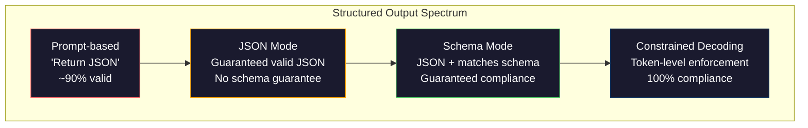
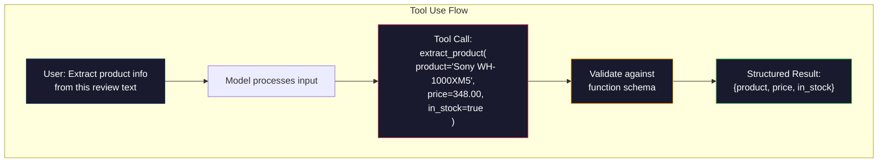

# संरचित आउटपुटः JSON, स्कीम सत्यापन, प्रतिबंधित डिकोडिंग

> आपका LLM एक स्ट्रिंग लौटाता है. आपके आवेदन को JSON की आवश्यकता है. उस अंतर ने किसी भी मॉडल भ्रम की तुलना में अधिक उत्पादन प्रणालियों को दुर्घटनाग्रस्त कर दिया है. संरचित आउटपुट प्राकृतिक भाषा और टाइप किए गए डेटा के बीच पुल है. इसे सही करें और आपका LLM एक विश्वसनीय एपीआई बन जाता है. इसे गलत करें और आप 3 बजे रेजेक्स के साथ मुक्त पाठ को पार्स कर रहे हैं।

**Type:** Build
**Languages:** Python
**Prerequisites:** Phase 10, Lessons 01-05 (LLMs from Scratch)
**Time:** ~90 minutes
**Related:**चरण 5 · 20 (संरचित आउटपुट और प्रतिबंधित डिकोडिंग) डिकोडर-स्तर सिद्धांत (FSM/CFG लॉजिट प्रोसेसर, रूपरेखा, XGrammar) को कवर करता है। यह पाठ उत्पादन एसडीके सतह (OpenAI `response_format`, मानव संसाधन उपकरण उपयोग, प्रशिक्षक)  पहले चरण 5 · 20 पढ़ें यदि आप समझना चाहते हैं कि एपीआई के नीचे क्या हो रहा है।

## सीखने के लक्ष्य

- OpenAI और Anthropic API पैरामीटर का उपयोग करके JSON मोड और स्कीमा-सीमित आउटपुट लागू करें
- एक पायदान्टिक सत्यापन परत का निर्माण करें जो गलत LLM आउटपुट और त्रुटि प्रतिक्रिया के साथ पुनः प्रयासों को अस्वीकार करता है
- समझाएं कि कैसे प्रतिबंधित डिकोडिंग प्रसंस्करण के बिना टोकन स्तर पर मान्य JSON को मजबूर करता है
- मजबूत निष्कर्षण प्रमाणीकरण डिजाइन करें जो अविष्कृत पाठ को विश्वसनीय रूप से टाइप किए गए डेटा संरचनाओं में परिवर्तित करते हैं

## समस्या

आप एक LLM से पूछते हैंः "इस पाठ से उत्पाद का नाम, कीमत और उपलब्धता निकालें।" वह जवाब देता हैः

```
The product is the Sony WH-1000XM5 headphones, which cost $348.00 and are currently in stock.
```

यह एक पूरी तरह से सही उत्तर है. यह आपके आवेदन के लिए भी पूरी तरह से बेकार है. आपकी सूची प्रणाली की जरूरत है।`{"product": "Sony WH-1000XM5", "price": 348.00, "in_stock": true}`. आपको विशिष्ट कुंजी, विशिष्ट प्रकार और विशिष्ट मूल्य प्रतिबंधों के साथ एक JSON वस्तु की आवश्यकता है. आपको एक वाक्य की आवश्यकता नहीं है.

सरल समाधानः अपने प्रॉम्प्ट में "JSON में जवाब दें" जोड़ें। यह 90% समय काम करता है। अन्य 10% मॉडल JSON को मार्कडाउन कोड बाड़ों में लपेटता है, या "यहां JSON हैः" जैसे एक प्रस्तावना जोड़ता है, या वाक्यरचनात्मक रूप से अमान्य JSON का उत्पादन करता है क्योंकि यह एक ब्रैकेट को जल्दी बंद करता है। आपका JSON पार्सर दुर्घटनाग्रस्त हो गया। आपका पाइपलाइन टूट जाता है. आप try/except जोड़ते हैं और एक retry loop. पुनः प्रयास कभी-कभी अलग-अलग डेटा उत्पन्न करता है। अब आपके पास एक पार्सिंग समस्या के शीर्ष पर एक स्थिरता समस्या है।

यह एक त्वरित इंजीनियरिंग समस्या नहीं है। यह एक डिकोडिंग समस्या है। मॉडल बाएं से दाएं टोकन उत्पन्न करता है। प्रत्येक स्थिति में, यह 100K + विकल्पों की शब्दावली से सबसे अधिक संभावना वाला अगला टोकन चुनता है। उन विकल्पों में से अधिकांश किसी भी स्थिति में अमान्य JSON उत्पन्न करेंगे। यदि मॉडल अभी जारी किया गया है `{"price":`, अगले टोकन एक अंक होना चाहिए, एक उद्धरण (स्ट्रिंग के लिए), `null`,`true`,`false`बिना किसी प्रतिबंध के, मॉडल एक पूरी तरह से उचित अंग्रेजी शब्द चुन सकता है जो वाक्य रचना में विनाशकारी रूप से गलत है।

## अवधारणा

### संरचित आउटपुट स्पेक्ट्रम

संरचनात्मक आउटपुट नियंत्रण के चार स्तर हैं, प्रत्येक पिछले से अधिक विश्वसनीय है।



**Prompt-based**("वैध JSON में जवाब दें"): कोई निष्पादन नहीं। मॉडल आमतौर पर अनुपालन करता है लेकिन कभी-कभी नहीं। विश्वसनीयताः ~ 90%. विफलता मोडः मार्कडाउन बाड़, प्रस्तावना पाठ, ट्रंक आउटपुट, गलत संरचना।

**JSON mode**: एपीआई आउटपुट मान्य JSON है की गारंटी देता है।`response_format: { type: "json_object" }`यह संभव है. आउटपुट त्रुटि के बिना विश्लेषण करेगा. लेकिन यह आपके अपेक्षित योजना से मेल नहीं खा सकता है - अतिरिक्त कुंजी, गलत प्रकार, गायब क्षेत्रों.

**Schema mode**2026 में, प्रत्येक प्रमुख प्रदाता इसे मूल रूप से समर्थन करता हैः ओपनएआई के `response_format: { type: "json_schema", json_schema: {...} }`(अधिकतर `tool_choice="required"`), एंट्रोपिक के उपकरण का उपयोग `input_schema`, और जुड़वां के `response_schema`+ `response_mime_type: "application/json"`. आउटपुट में आपके द्वारा निर्दिष्ट कुंजी, प्रकार और प्रतिबंध हैं।

**Constrained decoding**: उत्पन्न के दौरान प्रत्येक टोकन स्थिति पर, डिकोडर उन सभी टोकन को छिपाता है जो अमान्य आउटपुट उत्पन्न करेंगे। यदि स्कीमा में एक संख्या की आवश्यकता होती है और मॉडल एक अक्षर जारी करने के लिए तैयार है, तो वह टोकन शून्य संभावना पर सेट किया जाता है। मॉडल केवल टोकन उत्पन्न कर सकता है जो वैध आउटपुट का कारण बनता है। यह है कि OpenAI के संरचित आउटपुट मोड और लाइब्रेरी जैसे रूपरेखा और मार्गदर्शन हुड के तहत लागू करते हैं।

### JSON स्कीमः अनुबंध भाषा

JSON Schema यह है कि आप मॉडल (या सत्यापन परत) को कैसे बताते हैं कि आउटपुट का क्या आकार होना चाहिए। प्रत्येक प्रमुख संरचित आउटपुट सिस्टम इसका उपयोग करता है।

```json
{
  "type": "object",
  "properties": {
    "product": { "type": "string" },
    "price": { "type": "number", "minimum": 0 },
    "in_stock": { "type": "boolean" },
    "categories": {
      "type": "array",
      "items": { "type": "string" }
    }
  },
  "required": ["product", "price", "in_stock"]
}
```

इस योजना में कहा गया हैः आउटपुट एक स्ट्रिंग के साथ एक वस्तु होना चाहिए `product`, एक गैर-नकारात्मक संख्या `price`, एक बुलियन `in_stock`, और स्ट्रिंग की एक वैकल्पिक सरणी `categories`. जो भी आउटपुट मेल नहीं खाता उसे अस्वीकार कर दिया जाता है.

योजनाओं में कठिन मामलों को संभालते हैंः घोंसले हुए वस्तुओं, टाइप किए गए आइटम वाले सरणी, एनयूम (एक स्ट्रिंग को विशिष्ट मानों तक सीमित करें), पैटर्न मिलान (स्ट्रिंग पर रेगेक्स) और संयोजक (एक-ऑफ, किसी भी, बहुरूप आउटपुट के लिए सभी-ऑफ) ।

### पाइडान्टिक पैटर्न

पायथन में, आप JSON स्कीमा को हाथ से नहीं लिखते हैं। आप एक पायदानटिक मॉडल को परिभाषित करते हैं और यह आपके लिए स्कीमा उत्पन्न करता है।

```python
from pydantic import BaseModel

class Product(BaseModel):
    product: str
    price: float
    in_stock: bool
    categories: list[str] = []
```

यह उपरोक्त के समान JSON योजना का उत्पादन करता है। इंस्ट्रक्टर लाइब्रेरी (और OpenAI के SDK) सीधे पायदान्टिक मॉडल स्वीकार करते हैंः मॉडल वर्ग पास करें, एक सत्यापित उदाहरण वापस प्राप्त करें। यदि एलएलएम आउटपुट मेल नहीं खाता है, तो इंस्ट्रक्टर स्वचालित रूप से पुनः प्रयास करता है।

### फ़ंक्शन कॉल / टूल का उपयोग

एक ही समस्या के लिए एक वैकल्पिक इंटरफ़ेस। मॉडल से सीधे JSON उत्पन्न करने के लिए पूछने के बजाय, आप टाइप किए गए पैरामीटर के साथ "उपकरण" (फंक्शन) को परिभाषित करते हैं। मॉडल संरचित तर्कों के साथ एक फ़ंक्शन कॉल आउटपुट करता है। ओपनएआई इसे "फ़ंक्शन कॉल" कहता है। मानव जाति इसे "उपकरण उपयोग" कहता है। परिणाम समान हैः संरचित डेटा।



उपकरण का उपयोग तब पसंद किया जाता है जब मॉडल को यह चुनना होता है कि किस फ़ंक्शन को कॉल करना है, न कि केवल पैरामीटर भरना। यदि आपके पास 10 अलग-अलग निष्कर्षण योजनाएं हैं और मॉडल को इनपुट के आधार पर सही एक चुनना चाहिए, तो उपकरण का उपयोग आपको स्कीमा चयन और संरचित आउटपुट दोनों देता है।

### आम विफलता मोड

यहां तक कि योजना के कार्यान्वयन के साथ, संरचित आउटपुट सूक्ष्म तरीकों से विफल हो सकते हैं।

**Hallucinated values**: आउटपुट योजना से मेल खाता है लेकिन आविष्कार डेटा शामिल है। मॉडल उत्पन्न करता है `{"price": 299.99}`जब पाठ कहता है $348. स्कीम सत्यापन यह नहीं पकड़ सकता है - प्रकार सही है, मूल्य गलत है.

**Enum confusion**: आप एक क्षेत्र को सीमित करते हैं `["in_stock", "out_of_stock", "preorder"]`. मॉडल आउटपुट `"available"`-- अर्थशास्त्र में सही, लेकिन अनुमति सेट में नहीं. अच्छा प्रतिबंधित डिकोडिंग इससे बचाता है. प्रॉम्प्ट आधारित दृष्टिकोण नहीं करते.

**Nested object depth**: गहरे घोंसले वाले योजनाओं (4+ स्तर) में अधिक त्रुटियां होती हैं। घोंसले के प्रत्येक स्तर एक और स्थान है जहां मॉडल संरचना का ट्रैक खो सकता है।

**Array length**: मॉडल में एक सरणी में बहुत अधिक या बहुत कम आइटम उत्पन्न हो सकते हैं। योजनाओं का समर्थन `minItems`और `maxItems`लेकिन सभी प्रदाताओं को उन्हें डिकोडिंग स्तर पर लागू नहीं करना चाहिए।

**Optional field omission**: मॉडल उन फ़ील्ड को छोड़ देता है जो तकनीकी रूप से वैकल्पिक हैं लेकिन आपके उपयोग के मामले के लिए अर्थशास्त्र रूप से महत्वपूर्ण हैं। उन्हें योजना में आवश्यक के रूप में सेट करें भले ही कभी-कभी डेटा गायब हो जाए - मॉडल को उत्पन्न करने के लिए मजबूर करें`null`स्पष्ट रूप से।

```figure
mx-schema-funnel
```

## इसे बनाओ

### चरण 1: JSON योजना सत्यापितकर्ता

एक सत्यापनकर्ता को खरोंच से बनाएं जो जांचता है कि क्या एक पायथन ऑब्जेक्ट JSON स्कीम से मेल खाता है। यह अनुपालन की पुष्टि करने के लिए आउटपुट पक्ष पर चलता है।

```python
import json

def validate_schema(data, schema):
    errors = []
    _validate(data, schema, "", errors)
    return errors

def _validate(data, schema, path, errors):
    schema_type = schema.get("type")

    if schema_type == "object":
        if not isinstance(data, dict):
            errors.append(f"{path}: expected object, got {type(data).__name__}")
            return
        for key in schema.get("required", []):
            if key not in data:
                errors.append(f"{path}.{key}: required field missing")
        properties = schema.get("properties", {})
        for key, value in data.items():
            if key in properties:
                _validate(value, properties[key], f"{path}.{key}", errors)

    elif schema_type == "array":
        if not isinstance(data, list):
            errors.append(f"{path}: expected array, got {type(data).__name__}")
            return
        min_items = schema.get("minItems", 0)
        max_items = schema.get("maxItems", float("inf"))
        if len(data) < min_items:
            errors.append(f"{path}: array has {len(data)} items, minimum is {min_items}")
        if len(data) > max_items:
            errors.append(f"{path}: array has {len(data)} items, maximum is {max_items}")
        items_schema = schema.get("items", {})
        for i, item in enumerate(data):
            _validate(item, items_schema, f"{path}[{i}]", errors)

    elif schema_type == "string":
        if not isinstance(data, str):
            errors.append(f"{path}: expected string, got {type(data).__name__}")
            return
        enum_values = schema.get("enum")
        if enum_values and data not in enum_values:
            errors.append(f"{path}: '{data}' not in allowed values {enum_values}")

    elif schema_type == "number":
        if not isinstance(data, (int, float)):
            errors.append(f"{path}: expected number, got {type(data).__name__}")
            return
        minimum = schema.get("minimum")
        maximum = schema.get("maximum")
        if minimum is not None and data < minimum:
            errors.append(f"{path}: {data} is less than minimum {minimum}")
        if maximum is not None and data > maximum:
            errors.append(f"{path}: {data} is greater than maximum {maximum}")

    elif schema_type == "boolean":
        if not isinstance(data, bool):
            errors.append(f"{path}: expected boolean, got {type(data).__name__}")

    elif schema_type == "integer":
        if not isinstance(data, int) or isinstance(data, bool):
            errors.append(f"{path}: expected integer, got {type(data).__name__}")
```

### चरण 2: पाइडान्टिक-स्टाइल मॉडल से योजना तक

एक न्यूनतम वर्ग से योजना कनवर्टर बनाएं। एक पायथन वर्ग को परिभाषित करें और स्वचालित रूप से इसका JSON योजना उत्पन्न करें।

```python
class SchemaField:
    def __init__(self, field_type, required=True, default=None, enum=None, minimum=None, maximum=None):
        self.field_type = field_type
        self.required = required
        self.default = default
        self.enum = enum
        self.minimum = minimum
        self.maximum = maximum

def python_type_to_schema(field):
    type_map = {
        str: "string",
        int: "integer",
        float: "number",
        bool: "boolean",
    }

    schema = {}

    if field.field_type in type_map:
        schema["type"] = type_map[field.field_type]
    elif field.field_type == list:
        schema["type"] = "array"
        schema["items"] = {"type": "string"}
    elif isinstance(field.field_type, dict):
        schema = field.field_type

    if field.enum:
        schema["enum"] = field.enum
    if field.minimum is not None:
        schema["minimum"] = field.minimum
    if field.maximum is not None:
        schema["maximum"] = field.maximum

    return schema

def model_to_schema(name, fields):
    properties = {}
    required = []

    for field_name, field in fields.items():
        properties[field_name] = python_type_to_schema(field)
        if field.required:
            required.append(field_name)

    return {
        "type": "object",
        "properties": properties,
        "required": required,
    }
```

### चरण 3: प्रतिबंधित टोकन फ़िल्टर

सीमित डिकोडिंग का अनुकरण करें। आंशिक JSON स्ट्रिंग और एक स्कीमा को देखते हुए, निर्धारित करें कि वर्तमान स्थिति में कौन से टोकन श्रेणियां मान्य हैं।

```python
def next_valid_tokens(partial_json, schema):
    stripped = partial_json.strip()

    if not stripped:
        return ["{"]

    try:
        json.loads(stripped)
        return ["<EOS>"]
    except json.JSONDecodeError:
        pass

    last_char = stripped[-1] if stripped else ""

    if last_char == "{":
        return ['"', "}"]
    elif last_char == '"':
        if stripped.endswith('":'):
            return ['"', "0-9", "true", "false", "null", "[", "{"]
        return ["a-z", '"']
    elif last_char == ":":
        return [" ", '"', "0-9", "true", "false", "null", "[", "{"]
    elif last_char == ",":
        return [" ", '"', "{", "["]
    elif last_char in "0123456789":
        return ["0-9", ".", ",", "}", "]"]
    elif last_char == "}":
        return [",", "}", "]", "<EOS>"]
    elif last_char == "]":
        return [",", "}", "<EOS>"]
    elif last_char == "[":
        return ['"', "0-9", "true", "false", "null", "{", "[", "]"]
    else:
        return ["any"]

def demonstrate_constrained_decoding():
    partial_states = [
        '',
        '{',
        '{"product"',
        '{"product":',
        '{"product": "Sony"',
        '{"product": "Sony",',
        '{"product": "Sony", "price":',
        '{"product": "Sony", "price": 348',
        '{"product": "Sony", "price": 348}',
    ]

    print(f"{'Partial JSON':<45} {'Valid Next Tokens'}")
    print("-" * 80)
    for state in partial_states:
        valid = next_valid_tokens(state, {})
        display = state if state else "(empty)"
        print(f"{display:<45} {valid}")
```

### चरण 4: निष्कर्षण पाइपलाइन

सब कुछ एक निष्कर्षण पाइपलाइन में जोड़ेंः एक योजना को परिभाषित करें, एक एलएलएम का अनुकरण करें जो संरचित आउटपुट का उत्पादन करता है, आउटपुट को मान्य करें, और पुनः प्रयासों को संभालें।

```python
def simulate_llm_extraction(text, schema, attempt=0):
    if "headphones" in text.lower() or "sony" in text.lower():
        if attempt == 0:
            return '{"product": "Sony WH-1000XM5", "price": 348.00, "in_stock": true, "categories": ["audio", "headphones"]}'
        return '{"product": "Sony WH-1000XM5", "price": 348.00, "in_stock": true}'

    if "laptop" in text.lower():
        return '{"product": "MacBook Pro 16", "price": 2499.00, "in_stock": false, "categories": ["computers"]}'

    return '{"product": "Unknown", "price": 0, "in_stock": false}'

def extract_with_retry(text, schema, max_retries=3):
    for attempt in range(max_retries):
        raw = simulate_llm_extraction(text, schema, attempt)

        try:
            data = json.loads(raw)
        except json.JSONDecodeError as e:
            print(f"  Attempt {attempt + 1}: JSON parse error -- {e}")
            continue

        errors = validate_schema(data, schema)
        if not errors:
            return data

        print(f"  Attempt {attempt + 1}: Schema validation errors -- {errors}")

    return None

product_schema = {
    "type": "object",
    "properties": {
        "product": {"type": "string"},
        "price": {"type": "number", "minimum": 0},
        "in_stock": {"type": "boolean"},
        "categories": {"type": "array", "items": {"type": "string"}},
    },
    "required": ["product", "price", "in_stock"],
}
```

### चरण 5: पूरी पाइपलाइन चलाएं

```python
def run_demo():
    print("=" * 60)
    print("  Structured Output Pipeline Demo")
    print("=" * 60)

    print("\n--- Schema Definition ---")
    product_fields = {
        "product": SchemaField(str),
        "price": SchemaField(float, minimum=0),
        "in_stock": SchemaField(bool),
        "categories": SchemaField(list, required=False),
    }
    generated_schema = model_to_schema("Product", product_fields)
    print(json.dumps(generated_schema, indent=2))

    print("\n--- Schema Validation ---")
    test_cases = [
        ({"product": "Test", "price": 10.0, "in_stock": True}, "Valid object"),
        ({"product": "Test", "price": -5.0, "in_stock": True}, "Negative price"),
        ({"product": "Test", "in_stock": True}, "Missing price"),
        ({"product": "Test", "price": "ten", "in_stock": True}, "String as price"),
        ("not an object", "String instead of object"),
    ]

    for data, label in test_cases:
        errors = validate_schema(data, product_schema)
        status = "PASS" if not errors else f"FAIL: {errors}"
        print(f"  {label}: {status}")

    print("\n--- Constrained Decoding Simulation ---")
    demonstrate_constrained_decoding()

    print("\n--- Extraction Pipeline ---")
    texts = [
        "The Sony WH-1000XM5 headphones are priced at $348 and currently available.",
        "The new MacBook Pro 16-inch laptop costs $2499 but is sold out.",
        "This is a random sentence with no product info.",
    ]

    for text in texts:
        print(f"\n  Input: {text[:60]}...")
        result = extract_with_retry(text, product_schema)
        if result:
            print(f"  Output: {json.dumps(result)}")
        else:
            print(f"  Output: FAILED after retries")
```

## इसका प्रयोग करें

### OpenAI संरचित आउटपुट

```python
# from openai import OpenAI
# from pydantic import BaseModel
#
# client = OpenAI()
#
# class Product(BaseModel):
#     product: str
#     price: float
#     in_stock: bool
#
# response = client.beta.chat.completions.parse(
#     model="gpt-5-mini",
#     messages=[
#         {"role": "system", "content": "Extract product information."},
#         {"role": "user", "content": "Sony WH-1000XM5, $348, in stock"},
#     ],
#     response_format=Product,
# )
#
# product = response.choices[0].message.parsed
# print(product.product, product.price, product.in_stock)
```

OpenAI के संरचित आउटपुट मोड में आंतरिक रूप से प्रतिबंधित डिकोडिंग का उपयोग किया जाता है। मॉडल द्वारा उत्पन्न किए जाने वाले प्रत्येक टोकन को पाइदान्टिक योजना से मेल खाने वाले आउटपुट का उत्पादन करने की गारंटी है। कोई पुनः प्रयास की आवश्यकता नहीं है। कोई सत्यापन की आवश्यकता नहीं है। प्रतिबंध को डिकोडिंग प्रक्रिया में बेक किया जाता है।

### मानव संसाधन उपकरण का उपयोग

```python
# import anthropic
#
# client = anthropic.Anthropic()
#
# response = client.messages.create(
#     model="claude-opus-4-7",
#     max_tokens=1024,
#     tools=[{
#         "name": "extract_product",
#         "description": "Extract product information from text",
#         "input_schema": {
#             "type": "object",
#             "properties": {
#                 "product": {"type": "string"},
#                 "price": {"type": "number"},
#                 "in_stock": {"type": "boolean"},
#             },
#             "required": ["product", "price", "in_stock"],
#         },
#     }],
#     messages=[{"role": "user", "content": "Extract: Sony WH-1000XM5, $348, in stock"}],
# )
```

एंथ्रोपिक उपकरण के उपयोग के माध्यम से संरचित आउटपुट प्राप्त करता है। मॉडल इनपुट_स्कीम से मेल खाने वाले संरचित तर्कों के साथ एक उपकरण कॉल जारी करता है। समान परिणाम, अलग एपीआई सतह।

### प्रशिक्षक पुस्तकालय

```python
# pip install instructor
# import instructor
# from openai import OpenAI
# from pydantic import BaseModel
#
# client = instructor.from_openai(OpenAI())
#
# class Product(BaseModel):
#     product: str
#     price: float
#     in_stock: bool
#
# product = client.chat.completions.create(
#     model="gpt-5-mini",
#     response_model=Product,
#     messages=[{"role": "user", "content": "Sony WH-1000XM5, $348, in stock"}],
# )
```

इंस्ट्रक्टर किसी भी एलएलएम क्लाइंट को लपेटता है और सत्यापन के साथ स्वचालित पुनः प्रयास जोड़ता है। यदि पहला प्रयास सत्यापन में विफल रहता है, तो यह संदर्भ के रूप में मॉडल को त्रुटियों को वापस भेजता है और आउटपुट को ठीक करने के लिए कहता है। यह केवल ओपनएआई के साथ काम नहीं करता है।

## इसे भेजें

यह सबक हमें फल देता है`outputs/prompt-structured-extractor.md`-- एक पुनः प्रयोज्य प्रॉम्प्ट टेम्पलेट जो किसी भी पाठ से संरचित डेटा निकालेगा जो एक स्कीमा परिभाषा दी गई है। इसे एक JSON स्कीमा और असंगठित पाठ खिलाएं, और यह मान्य JSON लौटाता है।

यह भी उत्पादन करता है `outputs/skill-structured-outputs.md`-- आपके प्रदाता, विश्वसनीयता आवश्यकताओं और योजना जटिलता के आधार पर सही संरचित आउटपुट रणनीति चुनने के लिए एक निर्णय ढांचा।

## व्यायाम

1. समर्थन करने के लिए स्कीम सत्यापनकर्ता का विस्तार करें `oneOf`(डेटा कई योजनाओं में से एक से बिल्कुल मेल खाने चाहिए) यह बहुरूप आउटपुट को संभालता है - उदाहरण के लिए, एक क्षेत्र जो या तो एक हो सकता है`Product`या `Service`विभिन्न आकारों के वस्तुओं।

2. एक "स्केमा डिफर" उपकरण बनाएं जो दो योजनाओं की तुलना करता है और ब्रेक परिवर्तनों (आवश्यक क्षेत्रों को हटा दिया गया, प्रकार बदल दिए गए) को गैर-ब्रेकिंग परिवर्तनों (जोड़े गए वैकल्पिक क्षेत्र, ढील दिए गए प्रतिबंध) के खिलाफ पहचानता है। यह उत्पादन में आपके निष्कर्षण योजनाओं को संस्करणित करने के लिए आवश्यक है।

3. एक अधिक यथार्थवादी प्रतिबंधित डिकोडिंग सिम्युलेटर लागू करें। एक JSON योजना और 100 टोकन (अक्षर, अंकों, विरामचिह्न, कीवर्ड) की शब्दावली को देखते हुए, प्रत्येक स्थिति में अमान्य टोकन को छिपाने के लिए पीढ़ी के माध्यम से कदम से कदम चलाएं। प्रत्येक चरण में शब्दावली का प्रतिशत कितना मान्य है, इसका माप करें।

4. एक निष्कर्षण मूल्यांकन सूट बनाएं। 50 उत्पाद विवरण बनाएँ जो हाथ से लेबल किए गए JSON आउटपुट के साथ हैं। अपने निष्कर्षण पाइपलाइन को सभी 50 पर चलाएं और सटीक मैच, क्षेत्र स्तर की सटीकता और प्रकार अनुपालन मापें। पहचानें कि कौन से फ़ील्ड सही ढंग से निष्कर्षण करने के लिए सबसे कठिन हैं।

5. अपने निष्कर्षण पाइपलाइन में "विश्वास स्कोर" जोड़ें। प्रत्येक निष्कर्षित क्षेत्र के लिए, अनुमान लगाएं कि मॉडल कितना आश्वस्त है (टोकन संभावनाओं के आधार पर, या निष्कर्षण को 3 बार चलाकर और स्थिरता को मापकर) । मानव समीक्षा के लिए कम-विश्वास वाले क्षेत्रों को चिह्नित करें।

## प्रमुख शर्तें

| Term | What people say | What it actually means |
|------|----------------|----------------------|
| JSON mode | "Returns JSON" | API flag that guarantees syntactically valid JSON output, but does not enforce any particular schema |
| Structured output | "Typed JSON" | Output that matches a specific JSON Schema with correct keys, types, and constraints |
| Constrained decoding | "Guided generation" | At each token position, mask out tokens that would produce invalid output -- guarantees 100% schema compliance |
| JSON Schema | "A JSON template" | A declarative language for describing the structure, types, and constraints of JSON data (used by OpenAPI, JSON Forms, etc.) |
| Pydantic | "Python dataclasses+" | Python library that defines data models with type validation, used by FastAPI and Instructor to generate JSON Schemas |
| Function calling | "Tool use" | LLM outputs a structured function invocation (name + typed arguments) instead of free text -- OpenAI and Anthropic both support this |
| Instructor | "Pydantic for LLMs" | Python library that wraps LLM clients to return validated Pydantic instances, with automatic retry on validation failure |
| Token masking | "Filtering the vocabulary" | Setting specific token probabilities to zero during generation so the model cannot produce them |
| Schema compliance | "Matches the shape" | The output has every required field, correct types, values within constraints, and no extra disallowed fields |
| Retry loop | "Try again until it works" | Send validation errors back to the model and ask it to fix the output -- Instructor does this automatically, up to a configurable max |

## आगे पढ़ना

- [OpenAI Structured Outputs Guide](https://platform.openai.com/docs/guides/structured-outputs)-- OpenAI API में JSON स्कीम आधारित प्रतिबंधित डिकोडिंग के लिए आधिकारिक दस्तावेज
- [Willard & Louf, 2023 -- "Efficient Guided Generation for Large Language Models"](https://arxiv.org/abs/2307.09702)-- रेखाचित्र पेपर, वर्णन कैसे टोकन स्तर की बाधाओं के लिए अंत राज्य मशीनों में JSON योजनाओं को संकलित करने के लिए
- [Instructor documentation](https://python.useinstructor.com/)-- पदान्टिक सत्यापन और पुनः प्रयासों के साथ किसी भी LLM से संरचित आउटपुट प्राप्त करने के लिए मानक पुस्तकालय
- [Anthropic Tool Use Guide](https://docs.anthropic.com/en/docs/tool-use)-- कैसे क्लाउड JSON Schema input_schema के साथ उपकरण के उपयोग के माध्यम से संरचित आउटपुट को लागू करता है
- [JSON Schema specification](https://json-schema.org/)-- प्रत्येक प्रमुख संरचित आउटपुट प्रणाली द्वारा उपयोग की जाने वाली स्कीमा भाषा के लिए पूर्ण विनिर्देश
- [Outlines library](https://github.com/outlines-dev/outlines)-- रिजेक्स और जेएसओएन योजना का उपयोग करके सीमित राज्य मशीनों के लिए संकलित ओपन-सोर्स सीमित पीढ़ी
- [Dong et al., "XGrammar: Flexible and Efficient Structured Generation Engine for Large Language Models" (MLSys 2025)](https://arxiv.org/abs/2411.15100)-- वर्तमान अत्याधुनिक व्याकरण इंजन; पुश-डाउन ऑटोमोटन संकलन जो टोकन को ~ 100 एनएस / टोकन पर कवर करता है।
- [Beurer-Kellner et al., "Prompting Is Programming: A Query Language for Large Language Models" (LMQL)](https://arxiv.org/abs/2212.06094)-- LMQL कागज फ्रेमिंग प्रकार और मूल्य प्रतिबंधों के साथ क्वेरी भाषा के रूप में प्रतिबंधित डिकोडिंग।
- [Microsoft Guidance (framework docs)](https://github.com/guidance-ai/guidance)-- टेम्पलेट-चालित सीमित पीढ़ी; विक्रेता-अज्ञानी रूपरेखा और XGrammar के पूरक।
