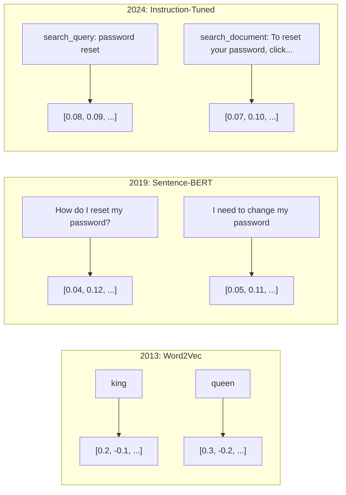
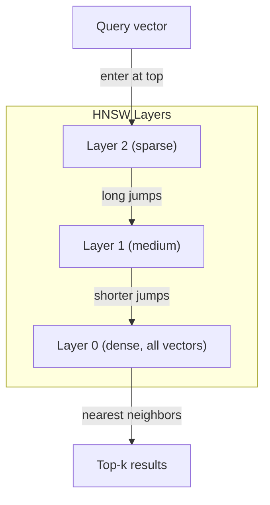

# सम्मिलित और वेक्टर प्रतिनिधित्व

> पाठ अलग है. गणित निरंतर है. जब भी आप एलएलएम से "समान" दस्तावेज खोजने, अर्थों की तुलना करने या कीवर्ड से परे खोज करने के लिए कहते हैं, तो आप इन दो दुनियाओं के बीच एक पुल पर भरोसा कर रहे हैं। यह पुल एक एम्बेडिंग है। यदि आप एम्बेडिंग को नहीं समझते हैं, तो आप आधुनिक एआई को नहीं समझते हैं। आप बस इसका उपयोग करते हैं।

**Type:** Build
**Languages:** Python
**Prerequisites:** Phase 11, Lesson 01 (Prompt Engineering)
**Time:** ~75 minutes
**Related:**चरण 5 · 22 (इम्बेडिंग मॉडल गहरी गोता) घने बनाम दुर्लभ बनाम मल्टी-वेक्टर, मैट्रियोस्का ट्रंक्शन और प्रति अक्ष मॉडल चयन को कवर करता है। यह पाठ उत्पादन पाइपलाइन (वेक्टर डीबी, एचएनएसडब्ल्यू, समानता गणित) पर केंद्रित है। मॉडल चुनने से पहले चरण 5 · 22 पढ़ें।

## सीखने के लक्ष्य

- एपीआई प्रदाताओं और ओपन-सोर्स मॉडल का उपयोग करके पाठ एम्बेडमेंट उत्पन्न करें, और उनके बीच कॉसिन समानता की गणना करें
- व्याख्या करें कि एम्बेड किए गए शब्द संग्रह असंगतता समस्या का समाधान क्यों करते हैं जो कीवर्ड खोज का सामना नहीं कर सकती है
- एक अर्थपूर्ण खोज सूचकांक बनाएं जो सटीक कीवर्ड मैच के बजाय अर्थ द्वारा दस्तावेज प्राप्त करता है
- रिट्रीवल बेंचमार्क (precision@k, recall) का उपयोग करके एम्बेडिंग गुणवत्ता का मूल्यांकन करें और अपने कार्य के लिए सही एम्बेडिंग मॉडल चुनें

## समस्या

आपके पास 10,000 सपोर्ट टिकट हैं. एक ग्राहक लिखता है "मेरा भुगतान नहीं हुआ।" आपको इसी तरह के पिछले टिकट खोजने की आवश्यकता है। कीवर्ड खोज "भुगतान" और "गैर-गैर-गैर-गैर-गैर-गैर-गैर-गैर-गैर-गैर-गैर-गैर-गैर-गैर-गैर-गैर-गैर-गैर-गैर-गैर-गैर-गैर-गैर-गैर-गैर-गैर-गैर-गैर-गैर-गैर-गैर-गैर-गैर-गैर-गैर-गैर-गैर-गैर-गैर-गैर-गैर-गैर-गैर-गैर-गैर-गैर-गैर-गैर-गैर-गैर-गैर-गैर-गैर-गैर-गैर-गैर-गैर-गैर-गैर-गैर-गैर-गैर-गैर-गैर-गैर-गैर-गैर-गैर-गैर-गैर-गैर-गैर-गैर-गैर-गैर-गैर-गैर-गैर-गैर-गैर-गैर-गैर-गैर-गैर-गैर-गैर-गैर-गैर-गैर-गैर-गैर-गैर-गैर-गैर-गैर-गैर-गैर-गैर-गैर-गैर-गैर-गैर-गैर-गैर-गैर-गैर-गैर-गैर-गैर-गैर-गैर-गैर-गैर-गैर-गैर-गैर-गैर-गैर-गैर-गैर-गैर-गैर-गैर-गैर-गैर-गैर-गैर-गैर-गैर-गैर-गैर-गैर-गैर-गैर-गैर-गैर-गैर-गैर-गैर-गैर-गैर-गैर-गैर-गैर-गैर-गैर-गैर-गैर-गैर-गैर-गैर-गैर-गैर-गैर-गैर-गैर-ग

यह शब्द संग्रह असंगतता समस्या है। मानव भाषा में एक ही बात कहने के दर्जनों तरीके हैं। कीवर्ड खोज प्रत्येक शब्द को एक स्वतंत्र प्रतीक के रूप में बिना अर्थ के व्यवहार करती है। यह नहीं जान सकती कि "अस्वीकृत" और "से नहीं गुजरता" एक ही अवधारणा का संदर्भ देते हैं।

आपको एक पाठ का प्रतिनिधित्व करने की आवश्यकता है जहां अर्थ, वर्तनी नहीं, समानता निर्धारित करता है। आपको "मेरे भुगतान को नहीं किया गया" और "लेनदेन को अस्वीकार कर दिया गया था" को एक साथ रखने का एक तरीका चाहिए, कुछ गणितीय स्थान में, "मेरे भुगतान समय पर आया" को दूर धक्का देते हुए शब्द "भुगतान" साझा करने के बावजूद।

यह प्रतिनिधित्व एक सम्मिलन है।

## अवधारणा

### एक इम्प्लोडिंग क्या है?

एक एम्बेडिंग एक घने वेक्टर है जो फ्लोटिंग-पॉइंट नंबरों का प्रतिनिधित्व करता है जो पाठ के अर्थ का प्रतिनिधित्व करता है। "घनता" शब्द मायने रखता है - प्रत्येक आयाम में जानकारी होती है, दुर्लभ प्रतिनिधित्वों (बैग-ऑफ-वर्ड, TF-IDF) के विपरीत जहां अधिकांश आयाम शून्य होते हैं।

" बिल्ली गद्दे पर बैठी" कुछ ऐसा हो जाता है जैसे `[0.023, -0.041, 0.087, ..., 0.012]`... 768 से 3072 संख्याओं की एक सूची मॉडल के आधार पर। ये संख्याएं अर्थ को एन्कोड करती हैं। आप उन्हें सीधे नहीं जांचते। आप उन्हें तुलना करते हैं।

### Word2Vec का सफलता

2013 में, टोमस मिकोलोव और Google के सहयोगियों ने वर्ड 2 वीईसी प्रकाशित किया। मूल अंतर्दृष्टिः अपने पड़ोसियों (या पड़ोसियों से एक शब्द) से एक शब्द की भविष्यवाणी करने के लिए एक तंत्रिका नेटवर्क को प्रशिक्षित करें, और छिपे हुए परत वजन सार्थक वेक्टर प्रतिनिधित्व बन जाते हैं।

प्रसिद्ध परिणामः

```
king - man + woman = queen
```

शब्द एम्बेडिंग पर वेक्टर अंकगणित अर्थिक संबंधों को कैप्चर करता है। "पुरुष" से "महिला" की दिशा "राजा" से "रानी" की दिशा के समान है। यह वह क्षण था जब क्षेत्र को एहसास हुआ कि ज्यामिति अर्थ को कोडित कर सकती है।

Word2Vec ने 300 आयामी वेक्टर उत्पन्न किए। प्रत्येक शब्द को संदर्भ के बावजूद एक वेक्टर मिला। "नदी के किनारे" में "बैंक" और "बैंक खाता" में एक ही एम्बेडिंग थी। इस सीमा ने अगले दशक के शोध को चलाया।

### शब्दों से वाक्य तक

वर्ड एम्बेडमेंट्स एकल टोकन का प्रतिनिधित्व करते हैं। उत्पादन प्रणालियों को पूरे वाक्य, पैराग्राफ या दस्तावेजों को एम्बेड करने की आवश्यकता होती है। चार दृष्टिकोण सामने आएः

**Averaging**: वाक्य में सभी शब्द वेक्टरों का औसत लें. सस्ता, खोया, संक्षिप्त पाठ के लिए आश्चर्यजनक रूप से सभ्य। शब्द क्रम पूरी तरह से खो देता है - "कुत्ता आदमी को काटता है" और "मानव कुत्ते को काटता है" समान एम्बेडेड मिलता है।

**CLS token**: ट्रांसफार्मर मॉडल (BERT, 2018) एक विशेष [CLS] टोकन एम्बेडिंग का उत्पादन करते हैं जो पूरे इनपुट का प्रतिनिधित्व करता है। औसत से बेहतर है लेकिन [CLS] टोकन को अगले वाक्य की भविष्यवाणी के लिए प्रशिक्षित किया गया था, न कि समानता।

**Contrastive learning**: मॉडल को स्पष्ट रूप से समान जोड़े को एक साथ और असमान जोड़े को अलग करने के लिए प्रशिक्षित करें। Sentence-BERT (Reimers & Gurevych, 2019) ने इस दृष्टिकोण का उपयोग किया और आधुनिक एम्बेडिंग मॉडल का आधार बन गया। "मैं अपना पासवर्ड कैसे रीसेट करता हूं? " और "मुझे अपना पासवर्ड बदलना चाहिए", मॉडल सीखता है कि इनमे लगभग समान वेक्टर होना चाहिए।

**Instruction-tuned embeddings**: नवीनतम दृष्टिकोण। E5 और GTE जैसे मॉडल एक कार्य पूर्वावलोकन ("search_query:", "search_document:") स्वीकार करते हैं जो मॉडल को बताता है कि किस प्रकार का एम्बेडिंग उत्पन्न करना है। यह एक मॉडल को कई कार्यों को पूरा करने की अनुमति देता है।



### आधुनिक एम्बेडिंग मॉडल

बाजार में उत्पादन-ग्रेड विकल्पों के एक मुट्ठी भर में सेट किया गया है (MTEB स्कोर 2026 की शुरुआत में, MTEB v2):

| Model | Provider | Dimensions | MTEB | Context | Cost / 1M tokens |
|-------|----------|-----------|------|---------|------------------|
| Gemini Embedding 2 | Google | 3072 (Matryoshka) | 67.7 (retrieval) | 8192 | $0.15 |
| embed-v4 | Cohere | 1024 (Matryoshka) | 65.2 | 128K | $0.12 |
| voyage-4 | Voyage AI | 1024/2048 (Matryoshka) | 66.8 | 32K | $0.12 |
| text-embedding-3-large | OpenAI | 3072 (Matryoshka) | 64.6 | 8192 | $0.13 |
| text-embedding-3-small | OpenAI | 1536 (Matryoshka) | 62.3 | 8192 | $0.02 |
| BGE-M3 | BAAI | 1024 (dense+sparse+ColBERT) | 63.0 multilingual | 8192 | Open-weight |
| Qwen3-Embedding | Alibaba | 4096 (Matryoshka) | 66.9 | 32K | Open-weight |
| Nomic-embed-v2 | Nomic | 768 (Matryoshka) | 63.1 | 8192 | Open-weight |

MTEB (मॉसिव टेक्स्ट एम्बेडिंग बेंचमार्क) v2 में 100+ कार्य शामिल हैं जो रिट्रीवल, वर्गीकरण, क्लस्टरिंग, री रैंकिंग और सारांश में शामिल हैं। अधिक उच्च बेहतर है। 2026 तक, अधिकांश अक्षों पर खुले वजन वाले मॉडल (Qwen3-Embedding, BGE-M3) बंद होस्ट किए गए मॉडल से मेल खाते हैं या उन्हें हरा देते हैं। मिथुन एम्बेडिंग 2 शुद्ध पुनर्प्राप्ति का नेतृत्व करता है; यात्रा / सहवास विशिष्ट डोमेन (वित्त, कानून, कोड) का नेतृत्व करता है। प्रतिबद्धता करने से पहले अपने स्वयं के प्रश्नों पर हमेशा बेंचमार्क करें।

### समानता मेट्रिक्स

दो एम्बेडिंग वेक्टरों को देखते हुए, यह मापने के तीन तरीके हैं कि वे कितने समान हैंः

**Cosine similarity**: दो वेक्टरों के बीच कोण का कोसिन। -1 (उपरोक्त) से 1 (समान दिशा) तक। परिमाण को अनदेखा करता है - 10 शब्द वाक्य और 500 शब्द के दस्तावेज़ को 1.0 स्कोर कर सकते हैं यदि वे एक ही दिशा में इंगित करते हैं। यह उपयोग के मामलों के 90% के लिए डिफ़ॉल्ट है।

```
cosine_sim(a, b) = dot(a, b) / (||a|| * ||b||)
```

**Dot product**: दो वेक्टरों का कच्चा आंतरिक उत्पाद। वेक्टरों को सामान्यीकृत करने पर कॉसिन की समानता के समान (इकाई लंबाई) । गणना करने के लिए तेज़। ओपनएआई के एम्बेडमेंट सामान्यीकृत हैं, इसलिए डॉट उत्पाद और कॉसिन एक ही रैंकिंग देते हैं।

```
dot(a, b) = sum(a_i * b_i)
```

**Euclidean (L2) distance**: वेक्टर स्थान में सीधी रेखा की दूरी। छोटा = अधिक समान। परिमाण अंतर के प्रति संवेदनशील। उपयोग करें जब अंतरिक्ष में पूर्ण स्थिति महत्वपूर्ण है, न कि केवल दिशा।

```
L2(a, b) = sqrt(sum((a_i - b_i)^2))
```

किस समय उपयोग किया जाएः

| Metric | Use when | Avoid when |
|--------|----------|------------|
| Cosine similarity | Comparing texts of different lengths; most retrieval tasks | Magnitude carries information |
| Dot product | Embeddings are already normalized; maximum speed | Vectors have varying magnitudes |
| Euclidean distance | Clustering; spatial nearest-neighbor problems | Comparing documents of wildly different lengths |

### वेक्टर डेटाबेस और HNSW

एक क्रूर बल समानता खोज प्रत्येक संग्रहीत वेक्टर के साथ क्वेरी की तुलना करता है. 1536 आयामों के साथ 1 मिलियन वेक्टर पर, यह प्रति क्वेरी 1.5 बिलियन गुणा-जोड़ा संचालन है। बहुत धीमा।

वेक्टर डेटाबेस इसे Approximate Nearest Neighbor (ANN) एल्गोरिदम के साथ हल करते हैं। प्रमुख एल्गोरिदम HNSW (हियरार्मिकल नेविगेबल स्मॉल वर्ल्ड) हैः

1. वेक्टरों के एक बहु-परत ग्राफ बनाएं
2. शीर्ष परतें दुर्लभ हैं - दूरस्थ समूहों के बीच लंबी दूरी की कनेक्शन
3. नीचे की परतें घनी हैं - निकटवर्ती वेक्टरों के बीच बारीक-अमल कनेक्शन
4. खोज शीर्ष परत से शुरू होती है, लालच से परिष्कृत करने के लिए नीचे जाती है
5. O(log n) समय में O(n के बजाय लगभग शीर्ष-k परिणाम देता है

HNSW बड़ी गति के लिए एक छोटी सटीकता हानि (आमतौर पर 95-99% याद) का व्यापार करता है। 10 मिलियन वेक्टर पर, क्रूर बल सेकंड लेता है। HNSW मिलीसेकंड लेता है।



उत्पादन विकल्पः

| Database | Type | Best for | Max scale |
|----------|------|----------|-----------|
| Pinecone | Managed SaaS | Zero-ops production | Billions |
| Weaviate | Open source | Self-hosted, hybrid search | 100M+ |
| Qdrant | Open source | High performance, filtering | 100M+ |
| ChromaDB | Embedded | Prototyping, local dev | 1M |
| pgvector | Postgres extension | Already using Postgres | 10M |
| FAISS | Library | In-process, research | 1B+ |

### टुकड़े टुकड़े करने की रणनीति

दस्तावेज एक ही वेक्टर के रूप में एम्बेड करने के लिए बहुत लंबे हैं. एक 50 पृष्ठों का पीडीएफ दर्जनों विषयों को कवर करता है -- इसका एम्बेडमेंट हर चीज का औसत बन जाता है, कुछ भी विशिष्ट नहीं के समान। आप दस्तावेजों को टुकड़ों में विभाजित करते हैं और प्रत्येक को एम्बेड करते हैं।

**Fixed-size chunking**: M-token ओवरलैप के साथ प्रत्येक N टोकन को विभाजित करें. सरल और पूर्वानुमान योग्य। जब दस्तावेजों की कोई स्पष्ट संरचना नहीं होती है तो यह अच्छी तरह से काम करता है। 50 टोकन ओवरलैप के साथ 512 टोकन का एक टुकड़ाः 1 टोकन 0-511, 2 टोकन 462-973 है।

**Sentence-based chunking**एक वाक्य को एक वाक्य में विभाजित करके वाक्य को एक वाक्य में विभाजित करें, जब तक कि आप एक वाक्य की सीमा तक नहीं पहुंच जाते। प्रत्येक टुकड़ा कम से कम एक पूर्ण वाक्य है। निश्चित आकार से बेहतर है क्योंकि आप कभी भी एक विचार को आधे में नहीं काटते हैं।

**Recursive chunking**: सबसे बड़ी सीमा पर पहले विभाजित करने का प्रयास करें (खंड के शीर्षकों) । अगर अभी भी बहुत बड़ा है, पैराग्राफ सीमाओं का प्रयास करें। फिर वाक्य सीमाओं का प्रयास करें। फिर वर्ण सीमाएं। यह लैंगचेन का है `RecursiveCharacterTextSplitter`और यह मिश्रित प्रारूप के शरीर के लिए अच्छी तरह से काम करता है.

**Semantic chunking**: प्रत्येक वाक्य को एम्बेड करें, फिर ऐसे लगातार वाक्य समूह करें जिनकी एम्बेडिंग समान होती है। जब एम्बेडिंग समानता एक सीमा से नीचे गिर जाती है, तो एक नया टुकड़ा शुरू करें। महंगा (प्रत्येक वाक्य को व्यक्तिगत रूप से एम्बेड करना आवश्यक है) लेकिन सबसे सुसंगत टुकड़े उत्पन्न करता है।

| Strategy | Complexity | Quality | Best for |
|----------|-----------|---------|----------|
| Fixed-size | Low | Decent | Unstructured text, logs |
| Sentence-based | Low | Good | Articles, emails |
| Recursive | Medium | Good | Markdown, HTML, mixed docs |
| Semantic | High | Best | Critical retrieval quality |

अधिकांश प्रणालियों के लिए मीठा बिंदुः 256-512 टोकन टुकड़े 50 टोकन ओवरलैप के साथ।

### द्वि-संकेतक बनाम क्रॉस-संकेतक

एक द्वि-संकेतक स्वतंत्र रूप से क्वेरी और दस्तावेजों को एम्बेड करता है, फिर वेक्टरों की तुलना करता है. तेजी से - आप क्वेरी को एक बार एम्बेड करते हैं और पूर्व-कंप्यूटेड दस्तावेज़ एम्बेड के साथ तुलना करते हैं. यह आप पुनर्प्राप्ति के लिए उपयोग करते हैं।

क्रॉस-एन्कोडर एक एकल इनपुट के रूप में क्वेरी और एक दस्तावेज़ लेता है और प्रासंगिकता स्कोर आउटपुट करता है। धीमा - यह पूरे मॉडल के माध्यम से प्रत्येक क्वेरी-डॉक्यूमेंट जोड़ी को संसाधित करता है। लेकिन बहुत अधिक सटीक क्योंकि यह एक साथ क्वेरी और दस्तावेज़ टोकन पर भाग ले सकता है।

उत्पादन पैटर्नः द्वि-संकेतक शीर्ष 100 उम्मीदवारों को प्राप्त करता है, क्रॉस-संकेतक उन्हें शीर्ष 10 में वापस रखता है। यह पुनर्प्राप्त करने-फिर-श्रेणी पाइपलाइन है।


रेंकिंग मॉडलः कोहरे रेंक 3.5 ($ 2 प्रति 1000 क्वेरी), बीजीई-रेंकर-वी2 (मुक्त, ओपन सोर्स), जिना रेंकर वी2 (मुक्त, ओपन सोर्स) ।

### मैट्रियोशका एम्बेड

पारंपरिक एम्बेडेड सब कुछ या कुछ नहीं हैं. 1536 आयामी वेक्टर 1536 फ्लोट का उपयोग करता है. आप 256 आयामों तक बिना फिर से प्रशिक्षण के ट्रंक नहीं कर सकते हैं।

मैट्रियोस्का प्रतिनिधित्व सीखने (कुसुपति और सहयोगियों, 2022) इस समस्या को ठीक करता है। मॉडल को प्रशिक्षित किया गया है ताकि पहले N आयाम सबसे महत्वपूर्ण जानकारी को कैप्चर करें, जैसे कि एक रूसी गुड़िया गुड़िया। 1536 डी मैट्रियोस्का एम्बेडिंग को 256 आयामों तक काटने से कुछ सटीकता कम हो जाती है लेकिन कार्यात्मक बनी रहती है।

OpenAI के पाठ-एम्बेडिंग-3-छोटे और पाठ-एम्बेडिंग-3-बड़े समर्थन Matryoshka truncation के माध्यम से `dimensions`पैरामीटर. 1536 के बजाय 256 आयामों का अनुरोध करने से भंडारण 6 गुना कम हो जाता है, MTEB बेंचमार्क पर लगभग 3-5% सटीकता का नुकसान होता है।

### द्विआधारी मात्रा

एक 1536 आयामी एम्बेडिंग float32 के रूप में संग्रहीत 6,144 बाइट्स का उपयोग करता है. 10 मिलियन दस्तावेजों द्वारा गुणाः 61 GB केवल वेक्टर के लिए।

द्विआधारी क्वांटिज़ेशन प्रत्येक फ्लोट को एक एकल बिट में परिवर्तित करता हैः सकारात्मक मान 1 बन जाते हैं, नकारात्मक मान 0 बन जाते हैं। भंडारण 6,144 बाइट से 192 बाइट्स तक गिर जाता है - 32 गुना कम। समानता हैमिंग दूरी (अलग बिट्स की गिनती) का उपयोग करके गणना की जाती है, जो सीपीयू एक निर्देश में कर सकते हैं।

सटीकता हिट पुनर्प्राप्ति याद करने पर लगभग 5-10% है। सामान्य पैटर्नः लाखों वेक्टरों पर पहले पास खोज के लिए द्विआधारी क्वांटिज़ेशन, फिर पूर्ण-सटीक वेक्टरों के साथ शीर्ष-1000 को फिर से स्कोर करें। यह आपको 32 गुना कम मेमोरी पर 95%+ पूर्ण-सटीक सटीकता देता है।

```figure
cosine-similarity
```

## इसे बनाओ

हम खरोंच से एक अर्थपूर्ण खोज इंजन बनाया. कोई वेक्टर डेटाबेस नहीं. कोई बाहरी एम्बेडिंग एपीआई. गणित के लिए numpy के साथ शुद्ध पायथन.

### चरण 1: पाठ को टुकड़े टुकड़े करना

```python
def chunk_text(text, chunk_size=200, overlap=50):
    words = text.split()
    chunks = []
    start = 0
    while start < len(words):
        end = start + chunk_size
        chunk = " ".join(words[start:end])
        chunks.append(chunk)
        start += chunk_size - overlap
    return chunks


def chunk_by_sentences(text, max_chunk_tokens=200):
    sentences = text.replace("\n", " ").split(".")
    sentences = [s.strip() + "." for s in sentences if s.strip()]
    chunks = []
    current_chunk = []
    current_length = 0
    for sentence in sentences:
        sentence_length = len(sentence.split())
        if current_length + sentence_length > max_chunk_tokens and current_chunk:
            chunks.append(" ".join(current_chunk))
            current_chunk = []
            current_length = 0
        current_chunk.append(sentence)
        current_length += sentence_length
    if current_chunk:
        chunks.append(" ".join(current_chunk))
    return chunks
```

### चरण 2: खरोंच से अंतर्निहित निर्माण

हम L2 सामान्यीकरण के साथ TF-IDF का उपयोग करके एक सरल घने एम्बेडिंग लागू करते हैं। यह एक तंत्रिका एम्बेडिंग नहीं है, लेकिन यह एक ही अनुबंध का पालन करता हैः पाठ में, फिक्स्ड-साइज़ वेक्टर आउट, समान पाठ समान वेक्टर उत्पन्न करते हैं।

```python
import math
import numpy as np
from collections import Counter

class SimpleEmbedder:
    def __init__(self):
        self.vocab = []
        self.idf = []
        self.word_to_idx = {}

    def fit(self, documents):
        vocab_set = set()
        for doc in documents:
            vocab_set.update(doc.lower().split())
        self.vocab = sorted(vocab_set)
        self.word_to_idx = {w: i for i, w in enumerate(self.vocab)}
        n = len(documents)
        self.idf = np.zeros(len(self.vocab))
        for i, word in enumerate(self.vocab):
            doc_count = sum(1 for doc in documents if word in doc.lower().split())
            self.idf[i] = math.log((n + 1) / (doc_count + 1)) + 1

    def embed(self, text):
        words = text.lower().split()
        count = Counter(words)
        total = len(words) if words else 1
        vec = np.zeros(len(self.vocab))
        for word, freq in count.items():
            if word in self.word_to_idx:
                tf = freq / total
                vec[self.word_to_idx[word]] = tf * self.idf[self.word_to_idx[word]]
        norm = np.linalg.norm(vec)
        if norm > 0:
            vec = vec / norm
        return vec
```

### चरण 3: समानता कार्य

```python
def cosine_similarity(a, b):
    dot = np.dot(a, b)
    norm_a = np.linalg.norm(a)
    norm_b = np.linalg.norm(b)
    if norm_a == 0 or norm_b == 0:
        return 0.0
    return float(dot / (norm_a * norm_b))


def dot_product(a, b):
    return float(np.dot(a, b))


def euclidean_distance(a, b):
    return float(np.linalg.norm(a - b))
```

### चरण 4: ब्रूट-फोर्स सर्च के साथ वेक्टर इंडेक्स

```python
class VectorIndex:
    def __init__(self):
        self.vectors = []
        self.texts = []
        self.metadata = []

    def add(self, vector, text, meta=None):
        self.vectors.append(vector)
        self.texts.append(text)
        self.metadata.append(meta or {})

    def search(self, query_vector, top_k=5, metric="cosine"):
        scores = []
        for i, vec in enumerate(self.vectors):
            if metric == "cosine":
                score = cosine_similarity(query_vector, vec)
            elif metric == "dot":
                score = dot_product(query_vector, vec)
            elif metric == "euclidean":
                score = -euclidean_distance(query_vector, vec)
            else:
                raise ValueError(f"Unknown metric: {metric}")
            scores.append((i, score))
        scores.sort(key=lambda x: x[1], reverse=True)
        results = []
        for idx, score in scores[:top_k]:
            results.append({
                "text": self.texts[idx],
                "score": score,
                "metadata": self.metadata[idx],
                "index": idx
            })
        return results

    def size(self):
        return len(self.vectors)
```

### चरण 5: अर्थपूर्ण खोज इंजन

```python
class SemanticSearchEngine:
    def __init__(self, chunk_size=200, overlap=50):
        self.embedder = SimpleEmbedder()
        self.index = VectorIndex()
        self.chunk_size = chunk_size
        self.overlap = overlap

    def index_documents(self, documents, source_names=None):
        all_chunks = []
        all_sources = []
        for i, doc in enumerate(documents):
            chunks = chunk_text(doc, self.chunk_size, self.overlap)
            all_chunks.extend(chunks)
            name = source_names[i] if source_names else f"doc_{i}"
            all_sources.extend([name] * len(chunks))
        self.embedder.fit(all_chunks)
        for chunk, source in zip(all_chunks, all_sources):
            vec = self.embedder.embed(chunk)
            self.index.add(vec, chunk, {"source": source})
        return len(all_chunks)

    def search(self, query, top_k=5, metric="cosine"):
        query_vec = self.embedder.embed(query)
        return self.index.search(query_vec, top_k, metric)

    def search_with_scores(self, query, top_k=5):
        results = self.search(query, top_k)
        return [
            {
                "text": r["text"][:200],
                "source": r["metadata"].get("source", "unknown"),
                "score": round(r["score"], 4)
            }
            for r in results
        ]
```

### चरण 6: समानता के माप की तुलना करना

```python
def compare_metrics(engine, query, top_k=3):
    results = {}
    for metric in ["cosine", "dot", "euclidean"]:
        hits = engine.search(query, top_k=top_k, metric=metric)
        results[metric] = [
            {"score": round(h["score"], 4), "preview": h["text"][:80]}
            for h in hits
        ]
    return results
```

## इसका प्रयोग करें

एक उत्पादन एम्बेडिंग एपीआई के साथ, वास्तुकला समान रहता है. केवल एम्बेडर बदलता हैः

```python
from openai import OpenAI

client = OpenAI()

def openai_embed(texts, model="text-embedding-3-small", dimensions=None):
    kwargs = {"model": model, "input": texts}
    if dimensions:
        kwargs["dimensions"] = dimensions
    response = client.embeddings.create(**kwargs)
    return [item.embedding for item in response.data]
```

ओपनएआई के साथ मैट्रियोशका ट्रंक - एक ही मॉडल, कम आयाम, कम भंडारणः

```python
full = openai_embed(["semantic search query"], dimensions=1536)
compact = openai_embed(["semantic search query"], dimensions=256)
```

256-डी वेक्टर में 6 गुना कम स्टोरेज होता है. 10 मिलियन दस्तावेजों के लिए, यह 10 GB बनाम 61 GB है. मानक बेंचमार्क पर सटीकता हानि लगभग 3-5% है।

कोहरे के साथ रैंक बदलने के लिएः

```python
import cohere

co = cohere.ClientV2()

results = co.rerank(
    model="rerank-v3.5",
    query="What is the refund policy?",
    documents=["Full refund within 30 days...", "No refunds after 90 days..."],
    top_n=3
)
```

एपीआई निर्भरता के बिना स्थानीय एम्बेड के लिएः

```python
from sentence_transformers import SentenceTransformer

model = SentenceTransformer("BAAI/bge-small-en-v1.5")
embeddings = model.encode(["semantic search query", "another document"])
```

हमारे निर्माण से वेक्टर इंडेक्स वर्ग इनमें से किसी के साथ काम करता है. एम्बेडिंग समारोह स्विच, खोज तर्क बनाए रखें.

## इसे भेजें

इस पाठ से उत्पन्न होता हैः
- `outputs/prompt-embedding-advisor.md`-- विशिष्ट उपयोग मामलों के लिए एम्बेडिंग मॉडल और रणनीतियों का चयन करने के लिए एक संकेत
- `outputs/skill-embedding-patterns.md`-- एक कौशल जो एजेंटों को सिखाता है कि उत्पादन में प्रभावी ढंग से एम्बेड का उपयोग कैसे करें

## व्यायाम

1. **Metric comparison**: कॉसिन समानता, डॉट प्रॉडक्ट और यूक्लिडियन दूरी का उपयोग करके नमूना दस्तावेजों के साथ एक ही 5 प्रश्नों को चलाएं। प्रत्येक के लिए शीर्ष 3 परिणाम रिकॉर्ड करें। किस प्रश्न के लिए माप असहमत हैं? क्यों?

2. **Chunk size experiment**: 50, 100, 200 और 500 शब्दों के टुकड़े आकार के साथ नमूना दस्तावेजों का सूचकांक बनाएं। प्रत्येक के लिए 5 क्वेरी चलाएं और शीर्ष-1 समानता स्कोर रिकॉर्ड करें। टुकड़े के आकार और निकासी की गुणवत्ता के बीच संबंध का पता लगाएं। उस बिंदु को ढूंढें जहां बड़े टुकड़े चोट लगने लगते हैं।

3. **Matryoshka simulation**: एक सरल एम्बेडर बनाएं जो 500 डी वेक्टर उत्पन्न करता है। 50, 100, 200, और 500 आयामों तक ट्रंक करें। मापें कि प्रत्येक ट्रंकिंग पर पुनर्प्राप्तिकरण याद कैसे घटता है। यह वास्तविक प्रशिक्षण ट्रिक की आवश्यकता के बिना मैट्रियोस्का व्यवहार का अनुकरण करता है।

4. **Binary quantization**: खोज इंजन से एम्बेडमेंट लें, उन्हें बाइनरी में परिवर्तित करें (1 यदि सकारात्मक, 0 यदि नकारात्मक), और हैमिंग दूरी खोज लागू करें। पूर्ण-सटीक कॉसिन समानता के साथ शीर्ष 10 परिणामों की तुलना करें। ओवरलैप प्रतिशत मापें।

5. **Sentence-based chunking**: फिक्स्ड साइज के चश्मा को `chunk_by_sentences`. . वही प्रश्न करें और प्राप्ति स्कोर की तुलना करें. क्या वाक्य सीमाओं का सम्मान परिणामों में सुधार करता है?

## प्रमुख शर्तें

| Term | What people say | What it actually means |
|------|----------------|----------------------|
| Embedding | "Text to numbers" | A dense vector where geometric proximity encodes semantic similarity |
| Word2Vec | "The OG embedding" | 2013 model that learned word vectors by predicting context words; proved vector arithmetic encodes meaning |
| Cosine similarity | "How similar are two vectors" | Cosine of the angle between vectors; 1 = identical direction, 0 = orthogonal, -1 = opposite |
| HNSW | "Fast vector search" | Hierarchical Navigable Small World graph -- multi-layer structure enabling O(log n) approximate nearest neighbor search |
| Bi-encoder | "Embed separately, compare fast" | Encodes query and document independently into vectors; enables pre-computation and fast retrieval |
| Cross-encoder | "Slow but accurate reranker" | Processes query-document pair jointly through the full model; higher accuracy, no pre-computation |
| Matryoshka embeddings | "Truncatable vectors" | Embeddings trained so the first N dimensions capture the most important information, enabling variable-size storage |
| Binary quantization | "1-bit embeddings" | Converting float vectors to binary (sign bit only) for 32x storage reduction with Hamming distance search |
| Chunking | "Split docs for embedding" | Breaking documents into 256-512 token segments so each can be independently embedded and retrieved |
| Vector database | "Search engine for embeddings" | Data store optimized for storing vectors and performing approximate nearest neighbor search at scale |
| Contrastive learning | "Train by comparison" | Training approach that pushes similar pair embeddings together and dissimilar pair embeddings apart |
| MTEB | "The embedding benchmark" | Massive Text Embedding Benchmark -- 56 datasets across 8 tasks; standard for comparing embedding models |

## आगे पढ़ना

- Mikolov et al., "वेक्टर स्पेस में वर्ड प्रतिनिधित्व का कुशल अनुमान" (2013) -- Word2Vec पेपर जिसने राजा-रानी समानता के साथ एम्बेडिंग क्रांति शुरू की
- रीमर और गुरेविच, "सेंटेंस-BERT: सिएमिस BERT-नेटवर्क का उपयोग करके वाक्य एम्बेडिंग" (2019) -- वाक्य-स्तर की समानता के लिए द्वि-संकेतक को कैसे प्रशिक्षित करें, आधुनिक एम्बेडिंग मॉडल की नींव
- कुसुपति और अन्य, "मैत्र्योश्का प्रतिनिधित्व सीखने" (2022) -- वैरिएबल-डिमेंशन एम्बेडिंग के पीछे की तकनीक जिसे ओपनएआई ने टेक्स्ट एम्बेडिंग के लिए अपनाया-3
- मालकोव और यशूनिन, "एफ़िशिएंट एंड रॉबस्ट नेविगेबल स्माल वर्ल्ड ग्राफ्स का उपयोग करके निकटतम पड़ोसी का उपयोग करना" (2018) -- एचएनएसडब्ल्यू पेपर, अधिकांश उत्पादन वेक्टर खोज के पीछे एल्गोरिथ्म
- OpenAI एम्बेडिंग गाइड (platform.openai.com/docs/guides/embeddings) -- मैट्रियोस्का आयाम घटाने सहित पाठ-एम्बेडिंग-3 मॉडल के लिए व्यावहारिक संदर्भ
- MTEB Leaderboard (huggingface.co/spaces/mteb/leaderboard) -- सभी एम्बेडिंग मॉडल की तुलना करने वाला लाइव बेंचमार्क विभिन्न कार्यों और भाषाओं में
- [Muennighoff et al., "MTEB: Massive Text Embedding Benchmark" (EACL 2023)](https://arxiv.org/abs/2210.07316)-- 8 कार्य श्रेणियों (वर्गीकरण, समूह, जोड़ी वर्गीकरण, पुनर्व्यवस्थापन, पुनर्प्राप्ती, एसटीएस, सारांश, बीट टेक्स्ट माइनिंग) को परिभाषित करने वाला बेंचमार्क जो रैंकिंग बोर्ड रिपोर्ट करता है; किसी भी एकल एमटीईबी स्कोर पर भरोसा करने से पहले पढ़ें।
- [Sentence Transformers documentation](https://www.sbert.net/)-- bi-encoder बनाम क्रॉस-encoder के लिए कैनोनिक संदर्भ, सामूहिकरण रणनीतियों, और सेवन-विभाजित-बंद-स्टोर RAG पाइपलाइन इस सबक को लागू करता है।
