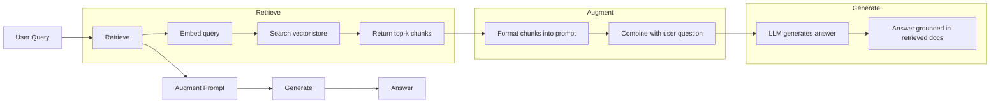
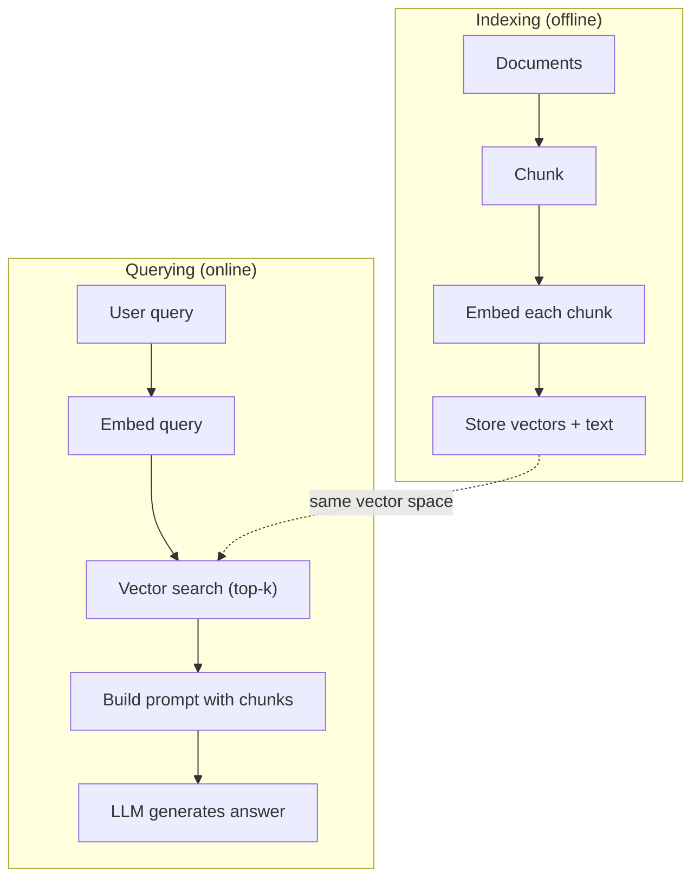

# आरएजी (पुनर्प्राप्त-वृद्धि पीढ़ी)

> आपका LLM प्रशिक्षण कटऑफ तक सब कुछ जानता है। यह आपकी कंपनी के दस्तावेजों, आपके कोडबेस, या पिछले सप्ताह के बैठक नोटों के बारे में कुछ नहीं जानता है। RAG प्रासंगिक दस्तावेजों को प्राप्त करके और उन्हें प्रॉम्प्ट में भरकर हल करता है। यह उत्पादन एआई में सबसे अधिक तैनात पैटर्न है। यदि आप इस पाठ्यक्रम से एक चीज बनाते हैं, तो एक RAG पाइपलाइन बनाते हैं।

**Type:** Build
**Languages:** Python
**Prerequisites:** Phase 10 (LLMs from Scratch), Phase 11 Lessons 01-05
**Time:** ~90 minutes
**Related:**चरण 5 · 23 (RAG के लिए Chunking Strategies) छह Chunking एल्गोरिदम के लिए और जब प्रत्येक जीतता है। चरण 5 · 22 (एम्बेडिंग मॉडल गहरी गोता) एम्बेडर को चुनने के लिए। चरण 11 · 07 (एडवांस्ड RAG) हाइब्रिड खोज, पुनः रैंकिंग और क्वेरी परिवर्तन के लिए।

## सीखने के लक्ष्य

- एक पूर्ण आरएजी पाइपलाइन बनाएंः दस्तावेज़ लोड करना, टुकड़े करना, एम्बेडिंग करना, वेक्टर स्टोरेज करना, निकालना और उत्पन्न करना
- सही अनुक्रमण के साथ वेक्टर डेटाबेस (ChromaDB, FAISS, या Pinecone) का उपयोग करके अर्थपूर्ण खोज लागू करें
- समझाना कि ज्ञान आधारित अनुप्रयोगों के लिए RAG को बारीकी से समायोजित करने से क्यों अधिक पसंद किया जाता है (लागत, ताजापन, श्रेय)
- आरएजी गुणवत्ता का मूल्यांकन रिकवरी मेट्रिक्स (सटीकता, याद) और उत्पादन मेट्रिक्स (निष्ठा, प्रासंगिकता) का उपयोग करके करना

## समस्या

आप अपनी कंपनी के लिए एक चैटबॉट बनाते हैं। एक ग्राहक पूछता है "उद्यम योजनाओं के लिए धनवापसी नीति क्या है?" एलएलएम विशिष्ट सास धनवापसी नीतियों के बारे में एक सामान्य उत्तर के साथ जवाब देता है। वास्तविक नीति, 200 पृष्ठों की आंतरिक विकी में दफन, कहता है कि उद्यम ग्राहकों को प्रो-रेटेड धनवापसी के साथ 60 दिन का खिड़का मिलता है। एलएलएम ने इस दस्तावेज़ को कभी नहीं देखा है। यह नहीं जान सकता कि यह किस पर प्रशिक्षित नहीं किया गया था।

फाइन ट्यूनिंग एक समाधान है. एलएलएम लें, इसे अपने आंतरिक दस्तावेजों पर प्रशिक्षित करें, और अद्यतन मॉडल को तैनात करें। यह काम करता है लेकिन गंभीर समस्याएं हैं। फाइन ट्यूनिंग की लागत गणना में हजारों डॉलर है। एक दस्तावेज़ बदलने के तुरंत बाद मॉडल अप्रचलित हो जाता है। आपके पास यह जानने का कोई तरीका नहीं है कि मॉडल किस स्रोत से आया था। और यदि कंपनी अगले महीने एक और उत्पाद लाइन प्राप्त करती है, तो आप फिर से ठीक-ठीक करते हैं।

आरएजी दूसरा समाधान है। मॉडल को छूने से बचना। जब कोई प्रश्न आता है, तो अपने दस्तावेज़ भंडार में प्रासंगिक अंशों की खोज करें, उन्हें प्रश्न से पहले के संकेत पत्र में पेस्ट करें, और मॉडल को संदर्भ के रूप में उन अंशों का उपयोग करके उत्तर देने दें। दस्तावेज़ भंडार को मिनटों में अपडेट किया जा सकता है। आप देख सकते हैं कि कौन से दस्तावेज ठीक से बरामद किए गए थे। मॉडल स्वयं कभी नहीं बदलता है। यही कारण है कि आरएजी उत्पादन में प्रमुख पैटर्न हैः यह सस्ता, ताजा, अधिक लेखा परीक्षा योग्य है, और किसी भी एलएलएम के साथ काम करता है।

## अवधारणा

### आरएजी पैटर्न

पूरे पैटर्न चार चरणों में फिट बैठता हैः



क्वेरी -> रिट्रीव -> बढ़ाना प्रॉम्प्ट -> जेनरेट करें. प्रत्येक RAG सिस्टम इस पैटर्न का पालन करता है। उत्पादन RAG सिस्टम के बीच अंतर प्रत्येक चरण के विवरण में हैः आप कैसे टुकड़े करते हैं, कैसे आप एम्बेड करते हैं, कैसे आप खोज करते हैं, और कैसे आप प्रॉम्प्ट का निर्माण करते हैं।

### क्यों RAG ठीक-ठाक से बेहतर है

| Concern | Fine-tuning | RAG |
|---------|------------|-----|
| Cost | $1,000-$100,000+ per training run | $0.01-$0.10 per query (embedding + LLM) |
| Freshness | Stale until retrained | Updated in minutes by re-indexing docs |
| Auditability | Cannot trace answer to source | Can show exact retrieved passages |
| Hallucination | Still hallucinates freely | Grounded in retrieved documents |
| Data privacy | Training data baked into weights | Documents stay in your vector store |

ठीक-ठीक समायोजन मॉडल के वजन को स्थायी रूप से बदलता है। RAG मॉडल के संदर्भ को अस्थायी रूप से बदलता है। अधिकांश अनुप्रयोगों के लिए, अस्थायी संदर्भ वह है जो आप चाहते हैं।

एक मामला जहां ठीक-ठीक ट्यूनिंग जीतता हैः जब आपको मॉडल को एक विशिष्ट शैली, स्वर या तर्क पैटर्न को अपनाने की आवश्यकता होती है जिसे अकेले आग्रह के माध्यम से प्राप्त नहीं किया जा सकता है। तथ्यगत ज्ञान प्राप्त करने के लिए, आरएजी हर बार जीतता है।

### मॉडल को सम्मिलित करना

एक एम्बेडिंग मॉडल पाठ को घने वेक्टर में परिवर्तित करता है। इसी तरह के पाठ इस उच्च आयामी स्थान में एक दूसरे के करीब वाले वेक्टर उत्पन्न करते हैं। "मैं अपना पासवर्ड कैसे रीसेट करूं?" और "मुझे अपना पासवर्ड बदलना है" कुछ शब्दों को साझा करने के बावजूद लगभग समान वेक्टर उत्पन्न करते हैं। " बिल्ली मैट पर बैठी" एक बहुत अलग वेक्टर उत्पन्न करती है।

आम एम्बेडिंग मॉडल (2026 लाइनअप  पूर्ण विश्लेषण के लिए चरण 5 · 22 देखें):

| Model | Dimensions | Provider | Notes |
|-------|-----------|----------|-------|
| text-embedding-3-small | 1536 (Matryoshka) | OpenAI | Best price/performance for most use cases |
| text-embedding-3-large | 3072 (Matryoshka) | OpenAI | Higher accuracy, truncatable to 256/512/1024 |
| Gemini Embedding 2 | 3072 (Matryoshka) | Google | Top MTEB retrieval; 8K context |
| voyage-4 | 1024/2048 (Matryoshka) | Voyage AI | Domain variants (code, finance, law) |
| Cohere embed-v4 | 1024 (Matryoshka) | Cohere | Strong multilingual, 128K context |
| BGE-M3 | 1024 (dense + sparse + ColBERT) | BAAI (open-weight) | Three views from one model |
| Qwen3-Embedding | 4096 (Matryoshka) | Alibaba (open-weight) | Top open-weight retrieval score |
| all-MiniLM-L6-v2 | 384 | Open-weight (Sentence Transformers) | Prototyping baseline |

इस पाठ के लिए, हम TF-IDF का उपयोग करके अपना स्वयं का सरल एम्बेडिंग बनाते हैं. यह इसलिए नहीं है क्योंकि TF-IDF उत्पादन प्रणालियों का उपयोग करता है, बल्कि इसलिए है क्योंकि यह अवधारणा को ठोस बनाता हैः पाठ अंदर जाता है, एक वेक्टर बाहर आता है, समान पाठ समान वेक्टर उत्पन्न करते हैं।

### वेक्टर समानता

दो वेक्टरों को देखते हुए, आप समानता को कैसे मापते हैं? तीन विकल्पः

**Cosine similarity**: दो वेक्टरों के बीच कोण का कोसिन। -1 (उपरोक्त) से 1 (समान) तक। परिमाण को अनदेखा करता है, केवल दिशा की परवाह करता है। यह RAG के लिए डिफ़ॉल्ट है।

```
cosine_sim(a, b) = dot(a, b) / (||a|| * ||b||)
```

**Dot product**बड़े वेक्टरों को उच्च स्कोर मिलता है। जब परिमाण में जानकारी होती है तो उपयोगी होता है (लंबे दस्तावेज अधिक प्रासंगिक हो सकते हैं) ।

```
dot(a, b) = sum(a_i * b_i)
```

**L2 (Euclidean) distance**: वेक्टर स्थान में सीधी रेखा की दूरी। छोटी दूरी = अधिक समान। परिमाण अंतर के प्रति संवेदनशील।

```
L2(a, b) = sqrt(sum((a_i - b_i)^2))
```

कॉसिन समानता मानक है. यह विभिन्न लंबाई के दस्तावेजों को gracefully संभालता है क्योंकि यह परिमाण द्वारा सामान्यीकरण करता है. जब कोई कहता है "वेक्टर खोज", वे लगभग हमेशा मतलब कॉसिन समानता.

### टुकड़े टुकड़े करने की रणनीति

दस्तावेज़ एक ही वेक्टर के रूप में एम्बेड करने के लिए बहुत लंबे हैं. 50 पृष्ठों का पीडीएफ एक भयानक एम्बेडिंग का उत्पादन कर सकता है क्योंकि इसमें दर्जनों विषय शामिल हैं। इसके बजाय, आप दस्तावेजों को टुकड़ों में विभाजित करते हैं और प्रत्येक टुकड़े को अलग से एम्बेड करते हैं।

**Fixed-size chunking**एक 512 टोकन टुकड़ा 50 टोकन ओवरलैप के साथ का मतलब है कि टुकड़ा 1 टोकन 0-511, टुकड़ा 2 टोकन 462-973 है, और इतने पर है। ओवरलैप सुनिश्चित करता है कि आप एक वाक्य को एक दुर्भाग्यपूर्ण सीमा पर विभाजित नहीं करते हैं।

**Semantic chunking**अनुच्छेद, अनुभाग या मार्कडाउन हेडर। प्रत्येक टुकड़ा अर्थ की एक सुसंगत इकाई है। इसे लागू करने के लिए अधिक जटिल है लेकिन बेहतर पुनर्प्राप्ति का उत्पादन करता है।

**Recursive chunking**: सबसे पहले सबसे बड़ी सीमा पर विभाजित करने का प्रयास करें (भाग के शीर्षक) यदि कोई खंड अभी भी बहुत बड़ा है, तो पैराग्राफ सीमाओं पर विभाजित करें। यदि कोई पैराग्राफ अभी भी बहुत बड़ा है, तो वाक्य सीमाओं पर विभाजित करें। यह लैंगचेन रिकर्सिव कैरेक्टरटेक्स्ट स्प्लिटर दृष्टिकोण है और यह व्यवहार में अच्छा काम करता है।

टुकड़े का आकार लोगों की सोच से अधिक मायने रखता हैः

- बहुत छोटे (64-128 टोकन): प्रत्येक टुकड़े में संदर्भ की कमी है। "यह पिछले तिमाही में 15% बढ़ गया" का अर्थ कुछ भी नहीं है जब तक कि "यह" का क्या अर्थ है, यह नहीं जानता।
- बहुत बड़ा (2048+ टोकन): प्रत्येक टुकड़ा कई विषयों को कवर करता है, प्रासंगिकता को पतला करता है। जब आप राजस्व डेटा की खोज करते हैं, तो आपको एक टुकड़ा मिलता है जो राजस्व के बारे में 10% है और कर्मचारियों के बारे में 90% है।
- Sweet spot (256-512 tokens): पर्याप्त संदर्भ जो आत्मनिर्भर हो, पर्याप्त रूप से प्रासंगिक हो।

अधिकांश उत्पादन आरएजी सिस्टम 256-512 टोकन टुकड़े का उपयोग करते हैं जिनमें 50 टोकन ओवरलैप होते हैं। एंथ्रोपिक के आरएजी दिशानिर्देश इस रेंज की सिफारिश करते हैं।

### वेक्टर डेटाबेस

एक बार जब आपके पास एम्बेड होते हैं, तो आपको उन्हें स्टोर करने और खोजने के लिए कहीं की आवश्यकता होती है।

| Database | Type | Best for |
|----------|------|----------|
| FAISS | Library (in-process) | Prototyping, small to medium datasets |
| Chroma | Lightweight DB | Local development, small deployments |
| Pinecone | Managed service | Production without ops overhead |
| Weaviate | Open source DB | Self-hosted production |
| pgvector | Postgres extension | Already using Postgres |
| Qdrant | Open source DB | High-performance self-hosted |

इस पाठ के लिए, हम एक सरल इन-मेमोरी वेक्टर स्टोर बनाते हैं। यह सूची में वेक्टरों को संग्रहीत करता है और क्रूर-फोर्स कॉसिन समानता खोज करता है। यह एक सपाट सूचकांक के साथ FAISS के बराबर है। यह धीमा होने से पहले शायद 100,000 वेक्टरों तक स्केल करता है। उत्पादन प्रणालियों को मिलीसेकंड में लाखों वेक्टरों की खोज करने के लिए एचएनएसडब्ल्यू जैसे करीबी पड़ोसी (एएनएन) एल्गोरिदम का उपयोग किया जाता है।

### पूरी पाइपलाइन



अनुक्रमणिका चरण प्रत्येक दस्तावेज़ (या जब दस्तावेज़ अद्यतन) पर एक बार चलता है। क्वेरी चरण प्रत्येक उपयोगकर्ता अनुरोध पर चलता है। उत्पादन में, अनुक्रमणिका घंटों में लाखों दस्तावेजों को संसाधित कर सकती है। क्वेरी को एक सेकंड से कम समय में जवाब देना चाहिए।

### वास्तविक संख्याएँ

अधिकांश उत्पादन आरएजी सिस्टम इन मापदंडों का उपयोग करते हैंः

- **k = 5 to 10**प्रति क्वेरी प्राप्त टुकड़े
- **Chunk size = 256 to 512 tokens**50 टोकन के साथ ओवरलैप
- **Context budget**: प्रति क्वेरी प्राप्त सामग्री के 2,500-5,000 टोकन
- **Total prompt**: ~ 8,000-16,000 टोकन (सिस्टम प्रॉम्प्ट + निकाले गए टुकड़े + वार्तालाप इतिहास + उपयोगकर्ता क्वेरी)
- **Embedding dimension**: 384-3072 मॉडल के अनुसार
- **Indexing throughput**: एपीआई एम्बेडेड के साथ प्रति सेकंड 100-1,000 दस्तावेज़
- **Query latency**: 50-200ms के लिए पुनर्प्राप्ति, 500-3000ms के लिए पीढ़ी

```figure
rag-chunking
```

## इसे बनाओ

### चरण 1: दस्तावेज़ों को टुकड़े टुकड़े करना

```python
def chunk_text(text, chunk_size=200, overlap=50):
    words = text.split()
    chunks = []
    start = 0
    while start < len(words):
        end = start + chunk_size
        chunk = " ".join(words[start:end])
        chunks.append(chunk)
        start += chunk_size - overlap
    return chunks
```

### चरण 2: TF-IDF एम्बेड

हम एक सरल एम्बेडिंग फ़ंक्शन बनाते हैं। TF-IDF (Term Frequency-Inverse Document Frequency) एक तंत्रिका एम्बेडिंग नहीं है, लेकिन यह पाठ को वेक्टरों में एक ऐसे तरीके से परिवर्तित करता है जो शब्द महत्व को कैप्चर करता है। एक दस्तावेज़ में लगातार शब्द उच्च TF प्राप्त करते हैं। कॉर्पस में दुर्लभ शब्द उच्च IDF प्राप्त करते हैं। उत्पाद एक वेक्टर देता है जहां महत्वपूर्ण, विशिष्ट शब्द उच्च मूल्य रखते हैं।

```python
import math
from collections import Counter

def build_vocabulary(documents):
    vocab = set()
    for doc in documents:
        vocab.update(doc.lower().split())
    return sorted(vocab)

def compute_tf(text, vocab):
    words = text.lower().split()
    count = Counter(words)
    total = len(words)
    return [count.get(word, 0) / total for word in vocab]

def compute_idf(documents, vocab):
    n = len(documents)
    idf = []
    for word in vocab:
        doc_count = sum(1 for doc in documents if word in doc.lower().split())
        idf.append(math.log((n + 1) / (doc_count + 1)) + 1)
    return idf

def tfidf_embed(text, vocab, idf):
    tf = compute_tf(text, vocab)
    return [t * i for t, i in zip(tf, idf)]
```

### चरण 3: कॉसिन समानता खोजें

```python
def cosine_similarity(a, b):
    dot = sum(x * y for x, y in zip(a, b))
    norm_a = math.sqrt(sum(x * x for x in a))
    norm_b = math.sqrt(sum(x * x for x in b))
    if norm_a == 0 or norm_b == 0:
        return 0.0
    return dot / (norm_a * norm_b)

def search(query_embedding, stored_embeddings, top_k=5):
    scores = []
    for i, emb in enumerate(stored_embeddings):
        sim = cosine_similarity(query_embedding, emb)
        scores.append((i, sim))
    scores.sort(key=lambda x: x[1], reverse=True)
    return scores[:top_k]
```

### चरण 4: शीघ्र निर्माण

यह वह जगह है जहां RAG में "बढ़ता" होता है। प्राप्त टुकड़ों को लें, उन्हें एक प्रॉम्प्ट में प्रारूपित करें, और प्रदान की गई संदर्भ के आधार पर उत्तर देने के लिए LLM से पूछें।

```python
def build_rag_prompt(query, retrieved_chunks):
    context = "\n\n---\n\n".join(
        f"[Source {i+1}]\n{chunk}"
        for i, chunk in enumerate(retrieved_chunks)
    )
    return f"""Answer the question based ONLY on the following context.
If the context doesn't contain enough information, say "I don't have enough information to answer that."

Context:
{context}

Question: {query}

Answer:"""
```

### चरण 5: पूर्ण आरएजी पाइपलाइन

```python
class RAGPipeline:
    def __init__(self):
        self.chunks = []
        self.embeddings = []
        self.vocab = []
        self.idf = []

    def index(self, documents):
        all_chunks = []
        for doc in documents:
            all_chunks.extend(chunk_text(doc))
        self.chunks = all_chunks
        self.vocab = build_vocabulary(all_chunks)
        self.idf = compute_idf(all_chunks, self.vocab)
        self.embeddings = [
            tfidf_embed(chunk, self.vocab, self.idf)
            for chunk in all_chunks
        ]

    def query(self, question, top_k=5):
        query_emb = tfidf_embed(question, self.vocab, self.idf)
        results = search(query_emb, self.embeddings, top_k)
        retrieved = [(self.chunks[i], score) for i, score in results]
        prompt = build_rag_prompt(
            question, [chunk for chunk, _ in retrieved]
        )
        return prompt, retrieved
```

### चरण 6: पीढ़ी (अनुकरण)

उत्पादन में, यह है जहां आप LLM एपीआई कहते हैं. इस पाठ के लिए, हम पुनर्प्राप्त संदर्भ से सबसे प्रासंगिक वाक्य निकालने से पीढ़ी का अनुकरण.

```python
def simple_generate(prompt, retrieved_chunks):
    query_words = set(prompt.lower().split("question:")[-1].split())
    best_sentence = ""
    best_score = 0
    for chunk in retrieved_chunks:
        for sentence in chunk.split("."):
            sentence = sentence.strip()
            if not sentence:
                continue
            words = set(sentence.lower().split())
            overlap = len(query_words & words)
            if overlap > best_score:
                best_score = overlap
                best_sentence = sentence
    return best_sentence if best_sentence else "I don't have enough information."
```

## इसका प्रयोग करें

एक वास्तविक एम्बेडिंग मॉडल और LLM के साथ, कोड मुश्किल से बदलता हैः

```python
from openai import OpenAI

client = OpenAI()

def embed(text):
    response = client.embeddings.create(
        model="text-embedding-3-small",
        input=text
    )
    return response.data[0].embedding

def generate(prompt):
    response = client.chat.completions.create(
        model="gpt-4o-mini",
        messages=[{"role": "user", "content": prompt}],
        temperature=0
    )
    return response.choices[0].message.content
```

या मानव के साथः

```python
import anthropic

client = anthropic.Anthropic()

def generate(prompt):
    response = client.messages.create(
        model="claude-sonnet-5",
        max_tokens=1024,
        messages=[{"role": "user", "content": prompt}]
    )
    return response.content[0].text
```

पाइपलाइन एक ही है. एम्बेडिंग फ़ंक्शन को स्विच करें. जनरेशन फ़ंक्शन को स्विच करें. निकालने का तर्क, टुकड़ा करना, शीघ्र निर्माण - सभी समान हैं चाहे आप किस मॉडल का उपयोग करें।

पैमाने पर वेक्टर भंडारण के लिए, क्रूर बल खोज को उचित वेक्टर डेटाबेस से प्रतिस्थापित करेंः

```python
import chromadb

client = chromadb.Client()
collection = client.create_collection("my_docs")

collection.add(
    documents=chunks,
    ids=[f"chunk_{i}" for i in range(len(chunks))]
)

results = collection.query(
    query_texts=["What is the refund policy?"],
    n_results=5
)
```

क्रोमा आंतरिक रूप से एम्बेडिंग को संभालता है (यह डिफ़ॉल्ट रूप से ऑल-मिनीएलएम-एल 6-वी 2 का उपयोग करता है) और स्थानीय डेटाबेस में वेक्टरों को संग्रहीत करता है। एक ही पैटर्न, अलग नल।

## इसे भेजें

इस पाठ से उत्पन्न होता हैः
- `outputs/prompt-rag-architect.md`-- विशिष्ट उपयोग मामलों के लिए आरएजी प्रणालियों के डिजाइन के लिए एक संकेत
- `outputs/skill-rag-pipeline.md`-- एक कौशल जो एजेंटों को सिखाता है कि कैसे निर्माण और डीबग RAG पाइपलाइन

## व्यायाम

1. TF-IDF एम्बेडमेंट को सरल शब्द-बैक-ऑफ-वर्ड दृष्टिकोण (बाइनरीः 1 यदि शब्द मौजूद है, 0 यदि नहीं) के साथ प्रतिस्थापित करें। नमूना दस्तावेजों पर निकासी की गुणवत्ता की तुलना करें। TF-IDF को बेहतर प्रदर्शन करना चाहिए क्योंकि यह दुर्लभ शब्दों का वजन अधिक है।

2. टुकड़े के आकारों के साथ प्रयोग करेंः एक ही दस्तावेज़ सेट पर 50, 100, 200, और 500 शब्दों का प्रयास करें। प्रत्येक आकार के लिए, समान 5 प्रश्न चलाएं और गणना करें कि शीर्ष 3 में कितने संबंधित टुकड़े लौटते हैं। उस मीठे बिंदु को ढूंढें जहां पुनर्प्राप्ति गुणवत्ता चरम पर है।

3. प्रत्येक टुकड़े में मेटाडेटा जोड़ें (स्रोत दस्तावेज़ नाम, टुकड़े की स्थिति) स्रोत श्रेय शामिल करने के लिए प्रॉम्प्ट टेम्पलेट को संशोधित करें ताकि LLM इसके स्रोतों का उल्लेख करे।

4. एक सरल मूल्यांकन करेंः 10 प्रश्न-उत्तर जोड़े दिए जाने पर, प्रत्येक प्रश्न को आरएजी पाइपलाइन के माध्यम से चलाएं, और मापें कि प्राप्त टुकड़ों का प्रतिशत उत्तर में कितना है। यह k पर पुनर्प्राप्तिकरण याद है।

5. बातचीत के लिए जागरूक आरएजी पाइपलाइन बनाएंः पिछले 3 एक्सचेंजों का इतिहास बनाए रखें और उन्हें प्राप्त टुकड़ों के साथ प्रॉम्प्ट में शामिल करें। मूल्य निर्धारण के बारे में पूछने के बाद "उद्यम के बारे में क्या? " जैसे अनुवर्ती प्रश्नों के साथ परीक्षण करें।

## प्रमुख शर्तें

| Term | What people say | What it actually means |
|------|----------------|----------------------|
| RAG | "AI that reads your docs" | Retrieve relevant documents, paste them into the prompt, and generate an answer grounded in those documents |
| Embedding | "Convert text to numbers" | A dense vector representation of text where similar meanings produce similar vectors |
| Vector database | "Search engine for AI" | A data store optimized for storing vectors and finding the nearest neighbors by similarity |
| Chunking | "Split docs into pieces" | Breaking documents into smaller segments (typically 256-512 tokens) so each can be embedded and retrieved independently |
| Cosine similarity | "How similar are two vectors" | The cosine of the angle between two vectors; 1 = identical direction, 0 = orthogonal, -1 = opposite |
| Top-k retrieval | "Get the k best matches" | Return the k most similar chunks to the query from the vector store |
| Context window | "How much text the LLM can see" | The maximum number of tokens the LLM can process in a single request; retrieved chunks must fit within this |
| Augmented generation | "Answer using given context" | Generating a response using retrieved documents as context rather than relying solely on trained knowledge |
| TF-IDF | "Word importance scoring" | Term Frequency times Inverse Document Frequency; weights words by how distinctive they are within a corpus |
| Indexing | "Preparing docs for search" | The offline process of chunking, embedding, and storing documents so they can be searched at query time |

## आगे पढ़ना

- लुईस एट एल., "ज्ञान-गहन एनएलपी कार्यों के लिए पुनर्प्राप्त-बढ़ती पीढ़ी" (2020) -- फेसबुक एआई रिसर्च से मूल आरएजी पेपर जिसने पुनर्प्राप्त-फिर-जनित पैटर्न को औपचारिक रूप दिया
- मानव जाति के आरएजी दस्तावेज (docs.anthropic.com) - टुकड़े के आकार, शीघ्र निर्माण और मूल्यांकन के लिए व्यावहारिक दिशा-निर्देश
- पाइनकोन लर्निंग सेंटर, "आरएजी क्या है?" -- उत्पादन विचार के साथ आरएजी पाइपलाइन की स्पष्ट दृश्य व्याख्याएं
- वाक्य-BERT: Reimers & Gurevych (2019) -- सभी-MiniLM एम्बेडिंग मॉडल के पीछे का पेपर, जो बताता है कि अर्थिक समानता के लिए द्वि-संकेतक को कैसे प्रशिक्षित किया जाए
- [Karpukhin et al., "Dense Passage Retrieval for Open-Domain Question Answering" (EMNLP 2020)](https://arxiv.org/abs/2004.04906)-- डीपीआर पेपर जो साबित किया घने द्वि-संकेतक निकालने BM25 पर खुले डोमेन QA और सेट पैटर्न के लिए आधुनिक RAG निकालने.
- [LlamaIndex High-Level Concepts](https://docs.llamaindex.ai/en/stable/getting_started/concepts.html)-- RAG पाइपलाइन बनाने के दौरान जानने के लिए मुख्य अवधारणाएंः डेटा लोडर, नोड पार्सर, सूचकांक, रिट्रीवर, प्रतिक्रिया संश्लेषक।
- [LangChain RAG tutorial](https://python.langchain.com/docs/tutorials/rag/)-- विपरीत स्वाद के संग्राहक; श्रृंखला-के-runnables दृश्य एक ही प्राप्त-फिर-जनित पैटर्न।
