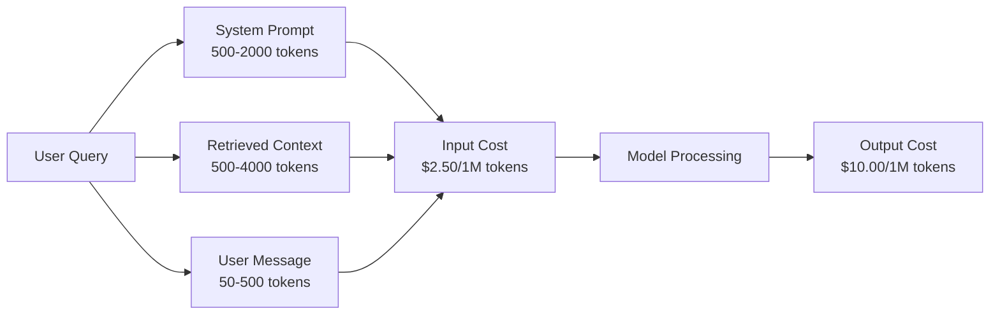
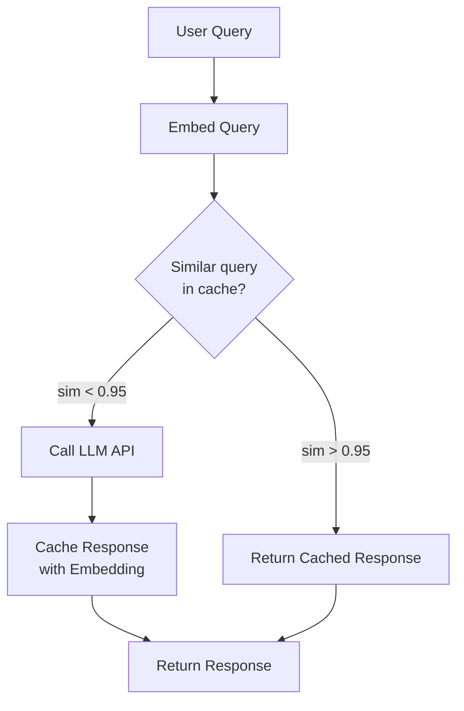
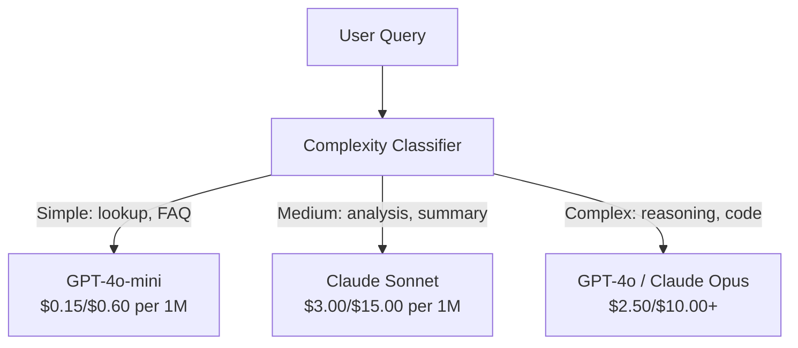

# कैशिंग, दरों की सीमा और लागत अनुकूलन

> अधिकांश एआई स्टार्टअप खराब मॉडल से नहीं मरते. वे खराब इकाई अर्थव्यवस्था से मरते हैं. एक जीपीटी-4o कॉल की लागत एक सेंट का अंश है. दस हजार उपयोगकर्ता जो प्रति दिन दस कॉल करते हैं, केवल इनपुट टोकन में $ 250 की लागत है - इससे पहले कि आप एक डॉलर भी चार्ज करें। जो कंपनियां जीवित हैं वे हैं जो प्रत्येक एपीआई कॉल को वित्तीय लेनदेन के रूप में मानते हैं, फ़ंक्शन कॉल नहीं।

**Type:** Build
**Languages:** Python
**Prerequisites:** Phase 11 Lesson 09 (Function Calling)
**Time:** ~45 minutes
**Related:**चरण 11 · 15 (प्रॉम्प्ट कैशिंग)  यह पाठ एप्लिकेशन-लेयर कैशिंग (सिमेंटिक कैश, सटीक हैश कैश, मॉडल रूटिंग) को कवर करता है। पाठ 15 प्रदाता-लेयर प्रॉम्प्ट कैशिंग (एंट्रोपिक कैश_कंट्रोल, ओपनएआई स्वचालित, जेमिनी कैश सामग्री) को कवर करता है। लागत में 50-95% की कमी के लिए दोनों को जोड़ें।

## सीखने के लक्ष्य

- एक नए एपीआई कॉल करने के बजाय कैश से दोहराए गए या समान क्वेरी को पूरा करने वाले अर्थिक कैशिंग को लागू करें
- प्रदाताओं के बीच प्रति अनुरोध लागत की गणना करें और टोकन-जाहिर दर सीमा और बजट अलर्ट लागू करें
- त्वरित संपीड़न, मॉडल रूटिंग (महंगी बनाम सस्ती) और प्रतिक्रिया कैशिंग के साथ लागत अनुकूलन परत का निर्माण करें
- विभिन्न क्वेरी प्रकारों के लिए सटीक मैच, अर्थिक समानता और पूर्वावलोकन कैशिंग का उपयोग करके एक स्तरीय कैशिंग रणनीति डिजाइन करें

## समस्या

आप एक RAG चैटबॉट बनाते हैं यह खूबसूरत काम करता है। उपयोगकर्ता इसे पसंद करते हैं।

फिर बिल आता है।

जीपीटी-5 लागत $5 per million input tokens and $प्रति मिलियन उत्पादन 15। क्लाउड ओपस 4.7 लागत $15 input / $75 उत्पादन. Gemini 3 प्रो लागत $1.25 input / $5 आउटपुट। GPT-5-मिनी है $0.25/$2. नीचे दी गई कीमतें स्पष्ट रूप से दी गई हैं; हमेशा प्रदाता के वर्तमान मूल्य निर्धारण पृष्ठ की जाँच करें।

यहाँ है गणित जो स्टार्टअप को मारता हैः

- 10,000 दैनिक सक्रिय उपयोगकर्ता
- प्रति उपयोगकर्ता प्रति दिन 10 प्रश्न
- प्रति क्वेरी 1,000 इनपुट टोकन (सिस्टम प्रॉम्प्ट + संदर्भ + उपयोगकर्ता संदेश)
- प्रति प्रतिक्रिया 500 आउटपुट टोकन

**Daily input cost:**10,000 x 10 x 1,000 / 1,000,000 x $2.50 = **$250/दिन**
**Daily output cost:**10,000 x 10 x 500 / 1,000,000 x $10.00 = **$500/दिन**
**Monthly total:** **$22,500/month**

यह सिर्फ LLM है. एम्बेडिंग जोड़ें, वेक्टर डेटाबेस होस्टिंग, बुनियादी ढांचा. आप एक चैटबॉट के लिए $ 30,000 / महीने की तलाश कर रहे हैं.

क्रूर भागः 40-60% इन सवालों के लगभग डुप्लिकेट हैं. उपयोगकर्ता एक ही प्रश्न थोड़ा अलग शब्दों में पूछते हैं. आपका सिस्टम प्रोम्प्ट - प्रत्येक अनुरोध पर समान - हर बार बिल किया जाता है. RAG द्वारा प्राप्त संदर्भ दस्तावेज उपयोगकर्ताओं के बीच दोहराए जाते हैं जो एक ही विषय के बारे में पूछते हैं।

आप अपर्याप्त गणना के लिए पूरी कीमत का भुगतान कर रहे हैं।

## अवधारणा

### LLM कॉल की लागत एनाटॉमी

प्रत्येक एपीआई कॉल में पांच लागत घटक होते हैं।



सिस्टम संकेतों को चुप हत्यारा है. एक 1,500 टोकन प्रणाली संकेत हर अनुरोध लागत के साथ भेजा जाता है।$3.75 per million requests just for that prefix. At 100K requests per day, that is $375 दिन -- 11,250 डॉलर प्रति माह -- पाठ के लिए जो कभी नहीं बदलता है।

### प्रदाता कैशिंगः अंतर्निहित छूट

सभी तीन प्रमुख प्रदाता 2026 में प्रदाता-पक्ष शीघ्र कैशिंग प्रदान करते हैं, लेकिन यांत्रिकी भिन्न होती है। गहरे गोता लगाने के लिए चरण 11 · 15 देखें।

| Provider | Mechanism | Discount | Minimum | Cache Duration |
|----------|-----------|----------|---------|----------------|
| Anthropic | Explicit cache_control markers | 90% on cache hits (pay 25% extra on write) | 1,024 tokens (Sonnet/Opus), 2,048 (Haiku) | 5 min default; 1h extended (2x write premium) |
| OpenAI | Automatic prefix matching | 50% on cache hits | 1,024 tokens | Best-effort up to 1 hour |
| Google Gemini | Explicit CachedContent API | ~75% reduction (plus storage) | 4,096 (Flash) / 32,768 (Pro) | User-configurable TTL |

**Anthropic's approach**आप अपने संकेत के कुछ भागों को चिह्नित करते हैं`cache_control: {"type": "ephemeral"}`. पहले अनुरोध के लिए 25% लेखन प्रीमियम का भुगतान किया जाता है. उसी उपसर्ग के साथ बाद के अनुरोध 90% छूट प्राप्त करते हैं. 2,000 टोकन प्रणाली लागत को सूचित करती है$0.005 normally costs $0.000625 कैश हिट पर 100K से अधिक अनुरोधों, जो 437.50 $ / दिन बचाता है।

**OpenAI's approach**किसी भी पूर्ववर्ती अनुरोध से मेल खाने वाले किसी भी शीघ्र पूर्वावलोकन को 50% छूट मिलती है। कोई मार्कर आवश्यक नहीं है। समझौताः कम छूट, कम नियंत्रण, लेकिन शून्य कार्यान्वयन प्रयास।

### अर्थिक कैशिंगः आपकी कस्टम परत

प्रदाता कैशिंग केवल समान पूर्वावधानों के लिए काम करता है। अर्थपूर्ण कैशिंग कठिन मामले को संभालता हैः एक ही अर्थ के साथ विभिन्न क्वेरी।

"रिटर्न पॉलिसी क्या है?" और "मैं किसी आइटम को कैसे लौटाऊंगा?" अलग-अलग स्ट्रिंग हैं लेकिन एक ही इरादा है। एक अर्थपूर्ण कैश दोनों क्वेरी को एम्बेड करता है, कॉसिन समानता की गणना करता है, और कैश किए गए उत्तर को लौटाता है यदि समानता एक सीमा से अधिक है (आमतौर पर 0.92-0.95) ।



इनबॉडींग लागतें नाकाफी हैं। ओपनएआई के टेक्स्ट-इम्बेडेड-3-लघु प्रति मिलियन टोकन $ 0.02 लागत है। कैश की जांच करने की लागत पूरी LLM कॉल की तुलना में लगभग कुछ भी नहीं है।

### सटीक कैशिंगः हैश और मैच

निर्धारक कॉल के लिए (तापमान = 0, एक ही मॉडल, एक ही प्रॉम्प्ट) सटीक कैशिंग सरल और तेज़ है। पूर्ण प्रॉम्प्ट को हैश करें, कैश की जांच करें, यदि पाया गया तो वापस करें।

यह सही ढंग से काम करता हैः
- सिस्टम प्रॉम्प्ट + फिक्स्ड कॉन्टेक्स्ट + समान उपयोगकर्ता क्वेरी
- समान उपकरण परिभाषाओं के साथ फ़ंक्शन कॉल
- बैच प्रसंस्करण जहां एक ही दस्तावेज़ को कई बार संसाधित किया जाता है

### दरों की सीमा: अपना बजट सुरक्षित रखें

दरों की सीमा सिर्फ न्याय से नहीं है, यह जीवित रहने से है।

**Token bucket algorithm:**प्रत्येक उपयोगकर्ता को N टोकन का एक बाल्टी मिलता है जो प्रति सेकंड R दर से भरता है। एक अनुरोध बाल्टी से टोकन का उपभोग करता है। यदि बाल्टी खाली है, तो अनुरोध अस्वीकार कर दिया जाता है। यह औसत दर लागू करते हुए फटकों (एक बार में पूरे बाल्टी का उपयोग) की अनुमति देता है।

**Per-user quotas:**उपयोगकर्ता स्तर के अनुसार दैनिक/मासिक टोकन सीमाएं निर्धारित करें।

| Tier | Daily Token Limit | Max Requests/min | Model Access |
|------|------------------|------------------|-------------|
| Free | 50,000 | 10 | GPT-4o-mini only |
| Pro | 500,000 | 60 | GPT-4o, Claude Sonnet |
| Enterprise | 5,000,000 | 300 | All models |

### मॉडल रूटिंग: सही नौकरी के लिए सही मॉडल

हर प्रश्न में GPT-4o की आवश्यकता नहीं होती है।

"दुकान कब बंद होता है? "$10/M-output model. GPT-4o-mini at $0.60 / M आउटपुट इसे सही ढंग से संभालता है। $ 1.25 / M आउटपुट पर क्लाउड हैकू इसे संभालता है। एक सरल वर्गीकरण सस्ते मॉडल के लिए सस्ते क्वेरी और महंगे मॉडल के लिए जटिल क्वेरी को रूट करता है।



एक अच्छी तरह से ट्यून राउटर केवल मॉडल लागत पर 40-70% की बचत करता है।

### लागत ट्रैक करनाः जानें कि पैसा कहां जाता है

आप जो नहीं मापते हैं उसे अनुकूलित नहीं कर सकते. प्रत्येक एपीआई कॉल को लॉग इन करेंः

- समय टिकट
- मॉडल नाम
- इनपुट टोकन
- आउटपुट टोकन
- विलंबता (ms)
- गणना लागत ($)
- उपयोगकर्ता आईडी
- कैश हिट/मिस
- अनुरोध श्रेणी

यह आंकड़े बताते हैं कि कौन सी सुविधाएँ महंगी हैं, कौन से उपयोगकर्ता भारी उपभोक्ता हैं, और कैशिंग का सबसे अधिक प्रभाव कहां पड़ता है।

### बैचिंगः बड़े पैमाने पर छूट

OpenAI के बैच एपीआई 50% छूट पर असिनक्रोनस रूप से अनुरोधों को संसाधित करता है। आप 50,000 तक के अनुरोधों का बैच जमा करते हैं, और परिणाम 24 घंटे के भीतर वापस आते हैं।

बैचिंग का उपयोगः
- रात्रि प्रसंस्करण
- बल्क वर्गीकरण
- मूल्यांकन रन
- डेटा संवर्धन पाइपलाइन

वास्तविक समय में उपयोगकर्ता-अनुरोधित प्रश्नों के लिए नहीं (लैटेंसी के मामले)

### बजट अलर्ट और सर्किट ब्रेकर

जब आप सीमा तक पहुंच जाते हैं तो सर्किट ब्रेकर खर्च करना बंद कर देता है।

तीन सीमाएँ निर्धारित करेंः
1. **Warning**(बजट का 70%): अलर्ट भेजें
2. **Throttle**बजट का 85%: केवल सस्ते मॉडल पर स्विच करें
3. **Stop**(95% बजट): नए अनुरोधों को अस्वीकार करना, केवल कैश किए गए उत्तर लौटाएं

### अनुकूलन स्टैक

इन तकनीकों को क्रम में लागू करें. प्रत्येक परत पिछले लोगों पर यौगिकों।

| Layer | Technique | Typical Savings | Implementation Effort |
|-------|-----------|----------------|----------------------|
| 1 | Provider prompt caching | 30-50% | Low (add cache markers) |
| 2 | Exact caching | 10-20% | Low (hash + dict) |
| 3 | Semantic caching | 15-30% | Medium (embeddings + similarity) |
| 4 | Model routing | 40-70% | Medium (classifier) |
| 5 | Rate limiting | Budget protection | Low (token bucket) |
| 6 | Prompt compression | 10-30% | Medium (rewrite prompts) |
| 7 | Batching | 50% on eligible | Low (batch API) |

एक RAG ऐप जो परतों 1-5 को लागू करता है, आमतौर पर लागत को कम करता है $22,500/month to $4,000-6,000 प्रति माह. यह जलने रनवे और एक व्यवसाय का निर्माण के बीच अंतर है.

### वास्तविक बचतः इससे पहले और बाद में

यहाँ एक RAG चैटबॉट के लिए एक असली टूटना है 10,000 DAU सेवा.

| Metric | Before Optimization | After Optimization | Savings |
|--------|--------------------|--------------------|---------|
| Monthly LLM cost | $22,500 | $5,200 | 77% |
| Avg cost per query | $0.0075 | $0.0017 | 77% |
| Cache hit rate | 0% | 52% | -- |
| Queries routed to mini | 0% | 65% | -- |
| P95 latency | 2,800ms | 900ms (cache hits: 50ms) | 68% |
| Monthly embedding cost | $0 | $180 | (new cost) |
| Total monthly cost | $22,500 | $5,380 | 76% |

अर्थिक कैशिंग के लिए एम्बेडिंग लागत ($180/महीना) कैश हिट के पहले घंटे के भीतर खुद को भुगतान करती है।

```figure
semantic-cache
```

## इसे बनाओ

### चरण 1: लागत कैलकुलेटर

एक टोकन लागत कैलकुलेटर का निर्माण करें जो प्रमुख मॉडल के लिए वर्तमान मूल्य निर्धारण को जानता है।

```python
import hashlib
import time
import json
import math
from dataclasses import dataclass, field


MODEL_PRICING = {
    "gpt-4o": {"input": 2.50, "output": 10.00, "cached_input": 1.25},
    "gpt-4o-mini": {"input": 0.15, "output": 0.60, "cached_input": 0.075},
    "gpt-4.1": {"input": 2.00, "output": 8.00, "cached_input": 0.50},
    "gpt-4.1-mini": {"input": 0.40, "output": 1.60, "cached_input": 0.10},
    "gpt-4.1-nano": {"input": 0.10, "output": 0.40, "cached_input": 0.025},
    "o3": {"input": 2.00, "output": 8.00, "cached_input": 0.50},
    "o3-mini": {"input": 1.10, "output": 4.40, "cached_input": 0.55},
    "o4-mini": {"input": 1.10, "output": 4.40, "cached_input": 0.275},
    "claude-opus-4": {"input": 15.00, "output": 75.00, "cached_input": 1.50},
    "claude-sonnet-4": {"input": 3.00, "output": 15.00, "cached_input": 0.30},
    "claude-haiku-3.5": {"input": 0.80, "output": 4.00, "cached_input": 0.08},
    "gemini-2.5-pro": {"input": 1.25, "output": 10.00, "cached_input": 0.3125},
    "gemini-2.5-flash": {"input": 0.15, "output": 0.60, "cached_input": 0.0375},
}


def calculate_cost(model, input_tokens, output_tokens, cached_input_tokens=0):
    if model not in MODEL_PRICING:
        return {"error": f"Unknown model: {model}"}
    pricing = MODEL_PRICING[model]
    non_cached = input_tokens - cached_input_tokens
    input_cost = (non_cached / 1_000_000) * pricing["input"]
    cached_cost = (cached_input_tokens / 1_000_000) * pricing["cached_input"]
    output_cost = (output_tokens / 1_000_000) * pricing["output"]
    total = input_cost + cached_cost + output_cost
    return {
        "model": model,
        "input_tokens": input_tokens,
        "output_tokens": output_tokens,
        "cached_input_tokens": cached_input_tokens,
        "input_cost": round(input_cost, 6),
        "cached_input_cost": round(cached_cost, 6),
        "output_cost": round(output_cost, 6),
        "total_cost": round(total, 6),
    }
```

### चरण 2: सटीक कैश

पूर्ण शीघ्र को हाश करें और समान अनुरोधों के लिए कैश किए गए उत्तरों को लौटाएं।

```python
class ExactCache:
    def __init__(self, max_size=1000, ttl_seconds=3600):
        self.cache = {}
        self.max_size = max_size
        self.ttl = ttl_seconds
        self.hits = 0
        self.misses = 0

    def _hash(self, model, messages, temperature):
        key_data = json.dumps({"model": model, "messages": messages, "temperature": temperature}, sort_keys=True)
        return hashlib.sha256(key_data.encode()).hexdigest()

    def get(self, model, messages, temperature=0.0):
        if temperature > 0:
            self.misses += 1
            return None
        key = self._hash(model, messages, temperature)
        if key in self.cache:
            entry = self.cache[key]
            if time.time() - entry["timestamp"] < self.ttl:
                self.hits += 1
                entry["access_count"] += 1
                return entry["response"]
            del self.cache[key]
        self.misses += 1
        return None

    def put(self, model, messages, temperature, response):
        if temperature > 0:
            return
        if len(self.cache) >= self.max_size:
            oldest_key = min(self.cache, key=lambda k: self.cache[k]["timestamp"])
            del self.cache[oldest_key]
        key = self._hash(model, messages, temperature)
        self.cache[key] = {
            "response": response,
            "timestamp": time.time(),
            "access_count": 1,
        }

    def stats(self):
        total = self.hits + self.misses
        return {
            "hits": self.hits,
            "misses": self.misses,
            "hit_rate": round(self.hits / total, 4) if total > 0 else 0,
            "cache_size": len(self.cache),
        }
```

### चरण 3: अर्थिक कैश

जब समानता एक सीमा से अधिक हो तो क्वेरी को एम्बेड करें और कैश किए गए उत्तर वापस करें।

```python
def simple_embed(text):
    words = text.lower().split()
    vocab = {}
    for w in words:
        vocab[w] = vocab.get(w, 0) + 1
    norm = math.sqrt(sum(v * v for v in vocab.values()))
    if norm == 0:
        return {}
    return {k: v / norm for k, v in vocab.items()}


def cosine_similarity(a, b):
    if not a or not b:
        return 0.0
    all_keys = set(a) | set(b)
    dot = sum(a.get(k, 0) * b.get(k, 0) for k in all_keys)
    return dot


class SemanticCache:
    def __init__(self, similarity_threshold=0.85, max_size=500, ttl_seconds=3600):
        self.entries = []
        self.threshold = similarity_threshold
        self.max_size = max_size
        self.ttl = ttl_seconds
        self.hits = 0
        self.misses = 0

    def get(self, query):
        query_embedding = simple_embed(query)
        now = time.time()
        best_match = None
        best_sim = 0.0
        for entry in self.entries:
            if now - entry["timestamp"] > self.ttl:
                continue
            sim = cosine_similarity(query_embedding, entry["embedding"])
            if sim > best_sim:
                best_sim = sim
                best_match = entry
        if best_match and best_sim >= self.threshold:
            self.hits += 1
            best_match["access_count"] += 1
            return {"response": best_match["response"], "similarity": round(best_sim, 4), "original_query": best_match["query"]}
        self.misses += 1
        return None

    def put(self, query, response):
        if len(self.entries) >= self.max_size:
            self.entries.sort(key=lambda e: e["timestamp"])
            self.entries.pop(0)
        self.entries.append({
            "query": query,
            "embedding": simple_embed(query),
            "response": response,
            "timestamp": time.time(),
            "access_count": 1,
        })

    def stats(self):
        total = self.hits + self.misses
        return {
            "hits": self.hits,
            "misses": self.misses,
            "hit_rate": round(self.hits / total, 4) if total > 0 else 0,
            "cache_size": len(self.entries),
        }
```

### चरण 4: दर सीमा

प्रति उपयोगकर्ता कोटा के साथ टोकन बाल्ट दर सीमा।

```python
class TokenBucketRateLimiter:
    def __init__(self):
        self.buckets = {}
        self.tiers = {
            "free": {"capacity": 50_000, "refill_rate": 500, "max_requests_per_min": 10},
            "pro": {"capacity": 500_000, "refill_rate": 5_000, "max_requests_per_min": 60},
            "enterprise": {"capacity": 5_000_000, "refill_rate": 50_000, "max_requests_per_min": 300},
        }

    def _get_bucket(self, user_id, tier="free"):
        if user_id not in self.buckets:
            tier_config = self.tiers.get(tier, self.tiers["free"])
            self.buckets[user_id] = {
                "tokens": tier_config["capacity"],
                "capacity": tier_config["capacity"],
                "refill_rate": tier_config["refill_rate"],
                "last_refill": time.time(),
                "request_timestamps": [],
                "max_rpm": tier_config["max_requests_per_min"],
                "tier": tier,
                "total_tokens_used": 0,
            }
        return self.buckets[user_id]

    def _refill(self, bucket):
        now = time.time()
        elapsed = now - bucket["last_refill"]
        refill = int(elapsed * bucket["refill_rate"])
        if refill > 0:
            bucket["tokens"] = min(bucket["capacity"], bucket["tokens"] + refill)
            bucket["last_refill"] = now

    def check(self, user_id, tokens_needed, tier="free"):
        bucket = self._get_bucket(user_id, tier)
        self._refill(bucket)
        now = time.time()
        bucket["request_timestamps"] = [t for t in bucket["request_timestamps"] if now - t < 60]
        if len(bucket["request_timestamps"]) >= bucket["max_rpm"]:
            return {"allowed": False, "reason": "rate_limit", "retry_after_seconds": 60 - (now - bucket["request_timestamps"][0])}
        if bucket["tokens"] < tokens_needed:
            deficit = tokens_needed - bucket["tokens"]
            wait = deficit / bucket["refill_rate"]
            return {"allowed": False, "reason": "token_limit", "tokens_available": bucket["tokens"], "retry_after_seconds": round(wait, 1)}
        return {"allowed": True, "tokens_available": bucket["tokens"]}

    def consume(self, user_id, tokens_used, tier="free"):
        bucket = self._get_bucket(user_id, tier)
        bucket["tokens"] -= tokens_used
        bucket["request_timestamps"].append(time.time())
        bucket["total_tokens_used"] += tokens_used

    def get_usage(self, user_id):
        if user_id not in self.buckets:
            return {"error": "User not found"}
        b = self.buckets[user_id]
        return {
            "user_id": user_id,
            "tier": b["tier"],
            "tokens_remaining": b["tokens"],
            "capacity": b["capacity"],
            "total_tokens_used": b["total_tokens_used"],
            "utilization": round(b["total_tokens_used"] / b["capacity"], 4) if b["capacity"] else 0,
        }
```

### चरण 5: लागत ट्रैकर

हर कॉल को लॉग करें और चल रहे कुल की गणना करें।

```python
class CostTracker:
    def __init__(self, monthly_budget=1000.0):
        self.logs = []
        self.monthly_budget = monthly_budget
        self.alerts = []

    def log_call(self, model, input_tokens, output_tokens, cached_input_tokens=0, latency_ms=0, user_id="anonymous", cache_status="miss"):
        cost = calculate_cost(model, input_tokens, output_tokens, cached_input_tokens)
        entry = {
            "timestamp": time.time(),
            "model": model,
            "input_tokens": input_tokens,
            "output_tokens": output_tokens,
            "cached_input_tokens": cached_input_tokens,
            "latency_ms": latency_ms,
            "cost": cost["total_cost"],
            "user_id": user_id,
            "cache_status": cache_status,
        }
        self.logs.append(entry)
        self._check_budget()
        return entry

    def _check_budget(self):
        total = self.total_cost()
        pct = total / self.monthly_budget if self.monthly_budget > 0 else 0
        if pct >= 0.95 and not any(a["level"] == "stop" for a in self.alerts):
            self.alerts.append({"level": "stop", "message": f"Budget 95% consumed: ${total:.2f}/${self.monthly_budget:.2f}", "timestamp": time.time()})
        elif pct >= 0.85 and not any(a["level"] == "throttle" for a in self.alerts):
            self.alerts.append({"level": "throttle", "message": f"Budget 85% consumed: ${total:.2f}/${self.monthly_budget:.2f}", "timestamp": time.time()})
        elif pct >= 0.70 and not any(a["level"] == "warning" for a in self.alerts):
            self.alerts.append({"level": "warning", "message": f"Budget 70% consumed: ${total:.2f}/${self.monthly_budget:.2f}", "timestamp": time.time()})

    def total_cost(self):
        return round(sum(e["cost"] for e in self.logs), 6)

    def cost_by_model(self):
        by_model = {}
        for e in self.logs:
            m = e["model"]
            if m not in by_model:
                by_model[m] = {"calls": 0, "cost": 0, "input_tokens": 0, "output_tokens": 0}
            by_model[m]["calls"] += 1
            by_model[m]["cost"] = round(by_model[m]["cost"] + e["cost"], 6)
            by_model[m]["input_tokens"] += e["input_tokens"]
            by_model[m]["output_tokens"] += e["output_tokens"]
        return by_model

    def cache_savings(self):
        cache_hits = [e for e in self.logs if e["cache_status"] == "hit"]
        if not cache_hits:
            return {"saved": 0, "cache_hits": 0}
        saved = 0
        for e in cache_hits:
            full_cost = calculate_cost(e["model"], e["input_tokens"], e["output_tokens"])
            saved += full_cost["total_cost"]
        return {"saved": round(saved, 4), "cache_hits": len(cache_hits)}

    def summary(self):
        if not self.logs:
            return {"total_calls": 0, "total_cost": 0}
        total_latency = sum(e["latency_ms"] for e in self.logs)
        cache_hits = sum(1 for e in self.logs if e["cache_status"] == "hit")
        return {
            "total_calls": len(self.logs),
            "total_cost": self.total_cost(),
            "avg_cost_per_call": round(self.total_cost() / len(self.logs), 6),
            "avg_latency_ms": round(total_latency / len(self.logs), 1),
            "cache_hit_rate": round(cache_hits / len(self.logs), 4),
            "cost_by_model": self.cost_by_model(),
            "cache_savings": self.cache_savings(),
            "budget_remaining": round(self.monthly_budget - self.total_cost(), 2),
            "budget_utilization": round(self.total_cost() / self.monthly_budget, 4) if self.monthly_budget > 0 else 0,
            "alerts": self.alerts,
        }
```

### चरण 6: मॉडल राउटर

सबसे सस्ता मॉडल के लिए मार्ग पूछताछ जो उन्हें संभाल सकता है.

```python
SIMPLE_KEYWORDS = ["what time", "hours", "address", "phone", "price", "return policy", "hello", "hi", "thanks", "yes", "no"]
COMPLEX_KEYWORDS = ["analyze", "compare", "explain why", "write code", "debug", "architect", "design", "trade-off", "evaluate"]


def classify_complexity(query):
    q = query.lower()
    if len(q.split()) <= 5 or any(kw in q for kw in SIMPLE_KEYWORDS):
        return "simple"
    if any(kw in q for kw in COMPLEX_KEYWORDS):
        return "complex"
    return "medium"


def route_model(query, tier="pro"):
    complexity = classify_complexity(query)
    routing_table = {
        "simple": {"free": "gpt-4.1-nano", "pro": "gpt-4o-mini", "enterprise": "gpt-4o-mini"},
        "medium": {"free": "gpt-4o-mini", "pro": "claude-sonnet-4", "enterprise": "claude-sonnet-4"},
        "complex": {"free": "gpt-4o-mini", "pro": "gpt-4o", "enterprise": "claude-opus-4"},
    }
    model = routing_table[complexity].get(tier, "gpt-4o-mini")
    return {"query": query, "complexity": complexity, "model": model, "tier": tier}
```

### चरण 7: डेमो चलाएं

```python
def simulate_llm_call(model, query):
    input_tokens = len(query.split()) * 4 + 500
    output_tokens = 150 + (len(query.split()) * 2)
    latency = 200 + (output_tokens * 2)
    return {
        "model": model,
        "response": f"[Simulated {model} response to: {query[:50]}...]",
        "input_tokens": input_tokens,
        "output_tokens": output_tokens,
        "latency_ms": latency,
    }


def run_demo():
    print("=" * 60)
    print("  Caching, Rate Limiting & Cost Optimization Demo")
    print("=" * 60)

    print("\n--- Model Pricing ---")
    for model, pricing in list(MODEL_PRICING.items())[:6]:
        cost_1k = calculate_cost(model, 1000, 500)
        print(f"  {model}: ${cost_1k['total_cost']:.6f} per 1K in + 500 out")

    print("\n--- Cost Comparison: 100K Requests ---")
    for model in ["gpt-4o", "gpt-4o-mini", "claude-sonnet-4", "claude-haiku-3.5"]:
        cost = calculate_cost(model, 1000 * 100_000, 500 * 100_000)
        print(f"  {model}: ${cost['total_cost']:.2f}")

    print("\n--- Anthropic Cache Savings ---")
    no_cache = calculate_cost("claude-sonnet-4", 2000, 500, 0)
    with_cache = calculate_cost("claude-sonnet-4", 2000, 500, 1500)
    saving = no_cache["total_cost"] - with_cache["total_cost"]
    print(f"  Without cache: ${no_cache['total_cost']:.6f}")
    print(f"  With 1500 cached tokens: ${with_cache['total_cost']:.6f}")
    print(f"  Savings per call: ${saving:.6f} ({saving/no_cache['total_cost']*100:.1f}%)")

    exact_cache = ExactCache(max_size=100, ttl_seconds=300)
    semantic_cache = SemanticCache(similarity_threshold=0.75, max_size=100)
    rate_limiter = TokenBucketRateLimiter()
    tracker = CostTracker(monthly_budget=100.0)

    print("\n--- Exact Cache ---")
    messages_1 = [{"role": "user", "content": "What is the return policy?"}]
    result = exact_cache.get("gpt-4o-mini", messages_1, 0.0)
    print(f"  First lookup: {'HIT' if result else 'MISS'}")
    exact_cache.put("gpt-4o-mini", messages_1, 0.0, "You can return items within 30 days.")
    result = exact_cache.get("gpt-4o-mini", messages_1, 0.0)
    print(f"  Second lookup: {'HIT' if result else 'MISS'} -> {result}")
    result = exact_cache.get("gpt-4o-mini", messages_1, 0.7)
    print(f"  With temp=0.7: {'HIT' if result else 'MISS (non-deterministic, skip cache)'}")
    print(f"  Stats: {exact_cache.stats()}")

    print("\n--- Semantic Cache ---")
    test_queries = [
        ("What is the return policy?", "Items can be returned within 30 days with receipt."),
        ("How do I return an item?", None),
        ("What are your store hours?", "We are open 9am-9pm Monday through Saturday."),
        ("When does the store open?", None),
        ("Tell me about quantum computing", "Quantum computers use qubits..."),
        ("Explain quantum mechanics", None),
    ]
    for query, response in test_queries:
        cached = semantic_cache.get(query)
        if cached:
            print(f"  '{query[:40]}' -> CACHE HIT (sim={cached['similarity']}, original='{cached['original_query'][:40]}')")
        elif response:
            semantic_cache.put(query, response)
            print(f"  '{query[:40]}' -> MISS (stored)")
        else:
            print(f"  '{query[:40]}' -> MISS (no match)")
    print(f"  Stats: {semantic_cache.stats()}")

    print("\n--- Rate Limiting ---")
    for i in range(12):
        check = rate_limiter.check("user_1", 1000, "free")
        if check["allowed"]:
            rate_limiter.consume("user_1", 1000, "free")
        status = "OK" if check["allowed"] else f"BLOCKED ({check['reason']})"
        if i < 5 or not check["allowed"]:
            print(f"  Request {i+1}: {status}")
    print(f"  Usage: {rate_limiter.get_usage('user_1')}")

    print("\n--- Model Routing ---")
    routing_queries = [
        "What time do you close?",
        "Summarize this quarterly earnings report",
        "Analyze the trade-offs between microservices and monoliths",
        "Hello",
        "Write code for a binary search tree with deletion",
    ]
    for q in routing_queries:
        route = route_model(q, "pro")
        print(f"  '{q[:50]}' -> {route['model']} ({route['complexity']})")

    print("\n--- Full Pipeline: Before vs After Optimization ---")
    queries = [
        "What is the return policy?",
        "How do I return something?",
        "What are your hours?",
        "When do you open?",
        "Explain the difference between TCP and UDP",
        "Compare TCP vs UDP protocols",
        "Hello",
        "What is your phone number?",
        "Write a Python function to sort a list",
        "Analyze the pros and cons of serverless architecture",
    ]

    print("\n  [Before: no caching, single model (gpt-4o)]")
    tracker_before = CostTracker(monthly_budget=1000.0)
    for q in queries:
        result = simulate_llm_call("gpt-4o", q)
        tracker_before.log_call("gpt-4o", result["input_tokens"], result["output_tokens"], latency_ms=result["latency_ms"], cache_status="miss")
    before = tracker_before.summary()
    print(f"  Total cost: ${before['total_cost']:.6f}")
    print(f"  Avg cost/call: ${before['avg_cost_per_call']:.6f}")
    print(f"  Avg latency: {before['avg_latency_ms']}ms")

    print("\n  [After: caching + routing + rate limiting]")
    exact_c = ExactCache()
    semantic_c = SemanticCache(similarity_threshold=0.75)
    tracker_after = CostTracker(monthly_budget=1000.0)

    for q in queries:
        messages = [{"role": "user", "content": q}]
        cached = exact_c.get("gpt-4o", messages, 0.0)
        if cached:
            tracker_after.log_call("gpt-4o-mini", 0, 0, latency_ms=5, cache_status="hit")
            continue
        sem_cached = semantic_c.get(q)
        if sem_cached:
            tracker_after.log_call("gpt-4o-mini", 0, 0, latency_ms=15, cache_status="hit")
            continue
        route = route_model(q)
        result = simulate_llm_call(route["model"], q)
        tracker_after.log_call(route["model"], result["input_tokens"], result["output_tokens"], latency_ms=result["latency_ms"], cache_status="miss")
        exact_c.put(route["model"], messages, 0.0, result["response"])
        semantic_c.put(q, result["response"])

    after = tracker_after.summary()
    print(f"  Total cost: ${after['total_cost']:.6f}")
    print(f"  Avg cost/call: ${after['avg_cost_per_call']:.6f}")
    print(f"  Avg latency: {after['avg_latency_ms']}ms")
    print(f"  Cache hit rate: {after['cache_hit_rate']:.0%}")

    if before["total_cost"] > 0:
        savings_pct = (1 - after["total_cost"] / before["total_cost"]) * 100
        print(f"\n  SAVINGS: {savings_pct:.1f}% cost reduction")
        print(f"  Latency improvement: {(1 - after['avg_latency_ms'] / before['avg_latency_ms']) * 100:.1f}% faster")

    print("\n--- Budget Alerts Demo ---")
    alert_tracker = CostTracker(monthly_budget=0.01)
    for i in range(5):
        alert_tracker.log_call("gpt-4o", 5000, 2000, latency_ms=500)
    print(f"  Total spent: ${alert_tracker.total_cost():.6f} / ${alert_tracker.monthly_budget}")
    for alert in alert_tracker.alerts:
        print(f"  ALERT [{alert['level'].upper()}]: {alert['message']}")

    print("\n--- Cost Breakdown by Model ---")
    multi_tracker = CostTracker(monthly_budget=500.0)
    for _ in range(50):
        multi_tracker.log_call("gpt-4o-mini", 800, 200, latency_ms=150)
    for _ in range(30):
        multi_tracker.log_call("claude-sonnet-4", 1500, 500, latency_ms=400)
    for _ in range(10):
        multi_tracker.log_call("gpt-4o", 2000, 800, latency_ms=600)
    for _ in range(10):
        multi_tracker.log_call("claude-opus-4", 3000, 1000, latency_ms=1200)
    breakdown = multi_tracker.cost_by_model()
    for model, data in sorted(breakdown.items(), key=lambda x: x[1]["cost"], reverse=True):
        print(f"  {model}: {data['calls']} calls, ${data['cost']:.6f}, {data['input_tokens']:,} in / {data['output_tokens']:,} out")
    print(f"  Total: ${multi_tracker.total_cost():.6f}")

    print("\n" + "=" * 60)
    print("  Demo complete.")
    print("=" * 60)


if __name__ == "__main__":
    run_demo()
```

## इसका प्रयोग करें

### मानव जाति के लिए तत्काल कैशिंग

```python
# import anthropic
#
# client = anthropic.Anthropic()
#
# response = client.messages.create(
#     model="claude-sonnet-5",
#     max_tokens=1024,
#     system=[
#         {
#             "type": "text",
#             "text": "You are a helpful customer support agent for Acme Corp...",
#             "cache_control": {"type": "ephemeral"},
#         }
#     ],
#     messages=[{"role": "user", "content": "What is the return policy?"}],
# )
#
# print(f"Input tokens: {response.usage.input_tokens}")
# print(f"Cache creation tokens: {response.usage.cache_creation_input_tokens}")
# print(f"Cache read tokens: {response.usage.cache_read_input_tokens}")
```

पहला कॉल कैश में लिखता है (25% प्रीमियम) । उसी सिस्टम प्रॉम्प्ट प्रीफिक्स के साथ प्रत्येक बाद का कॉल कैश से पढ़ता है (90% छूट) । कैश 5 मिनट तक रहता है और हर हिट पर टाइमर को रीसेट करता है।

### ओपनएआई स्वचालित कैशिंग

```python
# from openai import OpenAI
#
# client = OpenAI()
#
# response = client.chat.completions.create(
#     model="gpt-4o",
#     messages=[
#         {"role": "system", "content": "You are a helpful customer support agent..."},
#         {"role": "user", "content": "What is the return policy?"},
#     ],
# )
#
# print(f"Prompt tokens: {response.usage.prompt_tokens}")
# print(f"Cached tokens: {response.usage.prompt_tokens_details.cached_tokens}")
# print(f"Completion tokens: {response.usage.completion_tokens}")
```

OpenAI स्वचालित रूप से कैश करता है. किसी भी 1,024+ टोकन के शीघ्र पूर्वनिर्धारित जो हाल ही में अनुरोध से मेल खाता है 50% छूट प्राप्त करता है. कोई कोड परिवर्तन की आवश्यकता नहीं है - बस जांचें`prompt_tokens_details.cached_tokens`यह काम कर रहा है की पुष्टि करने के लिए प्रतिक्रिया में।

### OpenAI बैच एपीआई

```python
# import json
# from openai import OpenAI
#
# client = OpenAI()
#
# requests = []
# for i, query in enumerate(queries):
#     requests.append({
#         "custom_id": f"request-{i}",
#         "method": "POST",
#         "url": "/v1/chat/completions",
#         "body": {
#             "model": "gpt-4o-mini",
#             "messages": [{"role": "user", "content": query}],
#         },
#     })
#
# with open("batch_input.jsonl", "w") as f:
#     for r in requests:
#         f.write(json.dumps(r) + "\n")
#
# batch_file = client.files.create(file=open("batch_input.jsonl", "rb"), purpose="batch")
# batch = client.batches.create(input_file_id=batch_file.id, endpoint="/v1/chat/completions", completion_window="24h")
# print(f"Batch ID: {batch.id}, Status: {batch.status}")
```

बैच एपीआई सभी टोकन पर 50% की छूट देता है। परिणाम 24 घंटे के भीतर पहुंचते हैं। गैर-वास्तविक समय के कार्यभार के लिए एकदम सहीः मूल्यांकन, डेटा लेबलिंग, बल्क सारांश।

### रेडिस के साथ उत्पादन अर्थिक कैश

```python
# import redis
# import numpy as np
# from openai import OpenAI
#
# r = redis.Redis()
# client = OpenAI()
#
# def get_embedding(text):
#     response = client.embeddings.create(model="text-embedding-3-small", input=text)
#     return response.data[0].embedding
#
# def semantic_cache_lookup(query, threshold=0.95):
#     query_emb = np.array(get_embedding(query))
#     keys = r.keys("cache:emb:*")
#     best_sim, best_key = 0, None
#     for key in keys:
#         stored_emb = np.frombuffer(r.get(key), dtype=np.float32)
#         sim = np.dot(query_emb, stored_emb) / (np.linalg.norm(query_emb) * np.linalg.norm(stored_emb))
#         if sim > best_sim:
#             best_sim, best_key = sim, key
#     if best_sim >= threshold and best_key:
#         response_key = best_key.decode().replace("cache:emb:", "cache:resp:")
#         return r.get(response_key).decode()
#     return None
```

उत्पादन में, रैखिक स्कैन को वेक्टर सूचकांक (रेडिस वेक्टर खोज, पाइनकोन, या पीजीवेक्टर) के साथ बदलें। रैखिक स्कैन <1,000 प्रविष्टियों के लिए काम करता है। इसके अलावा, ओ(लॉग एन) खोज के लिए एएनएन (अंदाजी निकटतम पड़ोसी) का उपयोग करें।

## इसे भेजें

यह सबक हमें फल देता है`outputs/prompt-cost-optimizer.md`-- एक पुनः प्रयोज्य संकेत जो आपके LLM आवेदन का विश्लेषण करता है और अनुमानित बचत के साथ विशिष्ट लागत अनुकूलन की सिफारिश करता है।

यह भी उत्पादन करता है `outputs/skill-cost-patterns.md`-- एक निर्णय ढांचा सही कैशिंग रणनीति चुनने के लिए, दर सीमा विन्यास, और मॉडल रूटिंग नियमों के लिए अपने उपयोग के मामले के लिए.

## व्यायाम

1. **Implement LRU eviction for the semantic cache.**सबसे पुराने पहले निकासी को सबसे कम हाल ही में इस्तेमाल किए गए के साथ बदलें. प्रत्येक प्रविष्टि के लिए अंतिम पहुंच समय को ट्रैक करें और कैश भरने पर सबसे पुराने पहुंच समय के साथ प्रविष्टि को निकालें। 100 से अधिक क्वेरी के बीच दो रणनीतियों के बीच हिट दरों की तुलना करें।

2. **Build a cost projection tool.**एपीआई कॉल लॉग (कॉस्टट्रैकर लॉग) को देखते हुए, सात दिनों के औसत के आधार पर मासिक लागत का अनुमान लगाएं। सप्ताह के दिनों / सप्ताहांत पैटर्न का खाता बनाएं। यदि अनुमानित मासिक लागत बजट से 20% से अधिक है तो एक अलर्ट ट्रिगर करें।

3. **Implement tiered semantic caching.**दो समानता सीमाओं का उपयोग करेंः उच्च-विश्वास हिट के लिए 0.98 (तत्काल वापसी) और मध्यम-विश्वास हिट के लिए 0.90 (डिस्क्लॉइमर के साथ वापसीः "एक समान पिछले प्रश्न के आधार पर ...") प्रत्येक हिट किस स्तर से आया था इसका पता लगाएं और उपयोगकर्ता संतुष्टि अंतर को मापें।

4. **Build a model routing classifier.**कीवर्ड-आधारित वर्गीकरण को एम्बेडिंग-आधारित से बदलें। 50 लेबल वाले क्वेरी (सरल/मध्यम/कम्प्लेक्स) एम्बेड करें, फिर निकटतम लेबल वाले उदाहरण को ढूंढकर नए क्वेरी को वर्गीकृत करें। 20 क्वेरी के एक परीक्षण सेट के खिलाफ वर्गीकरण सटीकता मापें।

5. **Implement a circuit breaker with degradation levels.**70% बजट पर, एक चेतावनी दर्ज करें। 85% पर, स्वचालित रूप से सभी रूटिंग को सबसे सस्ता मॉडल (gpt-4o-mini) पर स्विच करें। 95% पर, केवल कैश किए गए उत्तरों को सेवा दें और नए प्रश्नों को अस्वीकार करें। $ 1.00 बजट के खिलाफ 1,000 अनुरोधों का अनुकरण करके परीक्षण करें और प्रत्येक सीमा को सही ढंग से सत्यापित करें।

## प्रमुख शर्तें

| Term | What people say | What it actually means |
|------|----------------|----------------------|
| Prompt caching | "Cache the system prompt" | Provider-level caching where repeated prompt prefixes get a discount (90% Anthropic, 50% OpenAI) -- no code changes for OpenAI, explicit markers for Anthropic |
| Semantic caching | "Smart caching" | Embedding the query, computing similarity to past queries, and returning the cached response if similarity exceeds a threshold -- catches paraphrases that exact matching misses |
| Exact caching | "Hash caching" | Hashing the full prompt (model + messages + temperature) and returning the cached response for identical inputs -- only works for temperature=0 deterministic calls |
| Token bucket | "Rate limiter" | An algorithm where each user has a bucket of N tokens that refills at rate R per second -- allows bursts up to N while enforcing an average rate of R |
| Model routing | "Cheapskate routing" | Using a classifier to send simple queries to cheap models (GPT-4o-mini, Haiku) and complex queries to expensive models (GPT-4o, Opus) -- saves 40-70% on model costs |
| Cost tracking | "Metering" | Logging every API call with model, tokens, latency, cost, and user ID so you know exactly where money goes and which features are expensive |
| Circuit breaker | "Kill switch" | Automatically degrading service (cheaper models, cached-only) or stopping requests entirely when spending approaches the budget limit |
| Batch API | "Bulk discount" | OpenAI's asynchronous processing at 50% discount -- submit up to 50,000 requests, get results within 24 hours |
| Prompt compression | "Token diet" | Rewriting system prompts and context to use fewer tokens while preserving meaning -- shorter prompts cost less and often perform better |
| Cache hit rate | "Cache efficiency" | The percentage of requests served from cache instead of calling the LLM -- 40-60% is typical for production chatbots, saves proportionally on cost |

## आगे पढ़ना

- [Anthropic Prompt Caching Guide](https://docs.anthropic.com/en/docs/build-with-claude/prompt-caching)-- Anthropic के स्पष्ट कैश_कंट्रोल मार्कर, मूल्य निर्धारण, और कैश जीवनकाल व्यवहार के लिए आधिकारिक दस्तावेजों
- [OpenAI Prompt Caching](https://platform.openai.com/docs/guides/prompt-caching)-- OpenAI के स्वचालित कैशिंग, उपयोग क्षेत्रों के माध्यम से कैश हिट की पुष्टि करने के लिए कैसे, और न्यूनतम उपसर्ग लंबाई
- [OpenAI Batch API](https://platform.openai.com/docs/guides/batch)-- असिनक्रोनस प्रोसेसिंग, JSONL प्रारूप, 24 घंटे की पूर्णता विंडो और 50K अनुरोध सीमाओं के लिए 50% छूट
- [GPTCache](https://github.com/zilliztech/GPTCache)-- ओपन सोर्स सेमॅटिक कैशिंग लाइब्रेरी कई एम्बेडिंग बैकेंड, वेक्टर स्टोर और निकासी नीति का समर्थन करती है
- [Martian Model Router](https://docs.withmartian.com)-- उत्पादन मॉडल रूटिंग जो स्वचालित रूप से प्रत्येक क्वेरी को संभालने में सक्षम सबसे सस्ता मॉडल का चयन करता है
- [Not Diamond](https://www.notdiamond.ai)-- एमएल आधारित मॉडल राउटर जो आपके ट्रैफ़िक पैटर्न से प्रदाताओं के बीच लागत/गुणवत्ता के व्यापार को अनुकूलित करने के लिए सीखता है
- [Helicone](https://www.helicone.ai)-- लागत ट्रैकिंग, कैशिंग, दर सीमा और बजट अलर्ट के साथ एलएलएम अवलोकन क्षमता मंच एक प्रॉक्सी परत के रूप में
- [Dean & Barroso, "The Tail at Scale" (CACM 2013)](https://research.google/pubs/the-tail-at-scale/)-- विलंबता, पारगमन, TTFT/TPOT प्रतिशत और हेज किए गए अनुरोध; "सबसे सस्ता मॉडल चुनें जो अभी भी P95 को पूरा करता है। "
- [Kwon et al., "Efficient Memory Management for Large Language Model Serving with PagedAttention" (SOSP 2023)](https://arxiv.org/abs/2309.06180)-- vLLM पेपर; क्यों पेज केवी-कैश + निरंतर बैचिंग भोले सर्वर 24x पर आउटपुट पर, "कैशिंग और लागत" के तहत इन्फ्रारेड परत से परे है।
- [Dao et al., "FlashAttention-2: Faster Attention with Better Parallelism and Work Partitioning" (ICLR 2024)](https://arxiv.org/abs/2307.08691)-- कर्नेल स्तर पर लागत में कमी को आदेश कैशिंग के लिए orthogonal; अनुमानात्मक डिकोडिंग और GQA के साथ पढ़ें लागत वक्र की पूरी तस्वीर के लिए।
