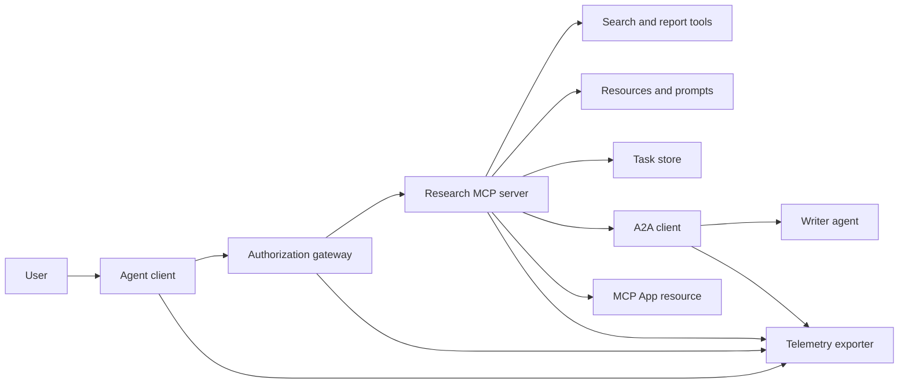
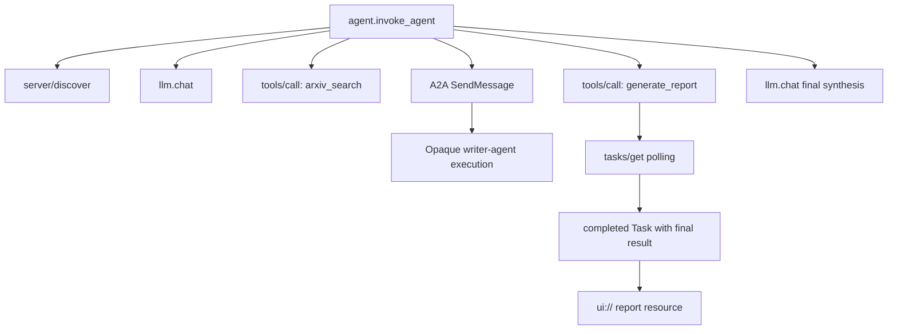
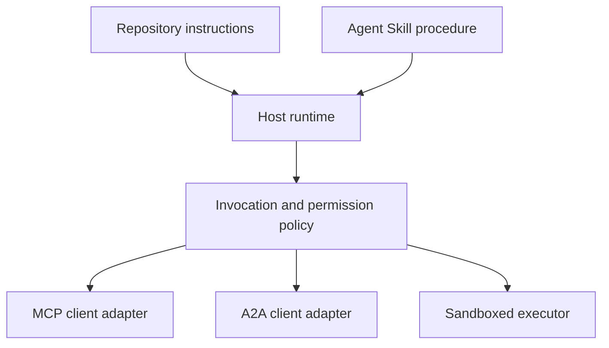

# कैपस्टोनः देशहीन उपकरण पारिस्थितिकी तंत्र

> एक उत्पादन एजेंट प्रणाली सीमाओं का एक सेट है, सुविधाओं का एक ढेर नहीं। यह कैप्सस्टोन प्रोटोकॉल क्लाइंट, प्राधिकरण सर्वर, सैंडबॉक्स और टेलीमेट्री निर्यातक से एक पठनीय प्रक्रिया सिमुलेशन को अलग करता है, जिसे अभी भी वास्तविक तैनाती की आवश्यकता है।

**Type:** Build
**Languages:** Python (stdlib, in-process simulation)
**Prerequisites:** Phase 13 · 01 through 22, using MCP revision `2026-07-28`
**Time:** ~120 minutes

## सीखने के लक्ष्य

- उपकरण कॉल, कार्य के आकार के परिणाम, आवंटित कार्य, UI संसाधन, प्राधिकरण नीति और एक प्रवाह में रिकॉर्ड ट्रैक करें।
- एक कनेक्शन सत्र पर निर्भर करने के बजाय प्रत्येक MCP अनुरोध पर प्रोटोकॉल संस्करण, क्लाइंट पहचान और क्षमताएं ले जाएं।
- उपयोग से पहले सर्वर का पता लगाएं और आधिकारिक कार्य विस्तार के माध्यम से लंबे समय तक काम करें।
- एक प्रोटोकॉल के आकार की सिमुलेशन को MCP, A2A, OAuth या OpenTelemetry कार्यान्वयन से अलग करना।
- प्रत्येक अनुकरित सीमा को उस उत्पादन घटक के लिए नक्शा बनाएं जो उसे प्रतिस्थापित करना चाहिए।
- रखो`AGENTS.md`, एक एजेंट कौशल, रनटाइम एडॉप्टर, उपकरण, और सुरक्षा नीति उनकी सही भूमिकाओं में.
- बताएं कि स्थानीय आउटपुट से कौन से दावे सत्यापित किए जा सकते हैं और कौन से लाइव इंटीग्रेशन परीक्षणों की आवश्यकता है।

## समस्या

एक शोध-और-रिपोर्ट प्रणाली डिजाइन करें। एक उपयोगकर्ता एजेंट प्रोटोकॉल पर कागजात मांगता है। सिस्टम एक पेपर कैटलॉग खोजता है, सारांश को सौंपता है, एक रिपोर्ट उत्पन्न करता है, एक UI संसाधन लौटाता है, और सिस्टम के माध्यम से पथ रिकॉर्ड करता है।

उस वाक्य में कई स्वतंत्र अनुबंध छिपाए जाते हैंः

- मॉडल-उन्मुख उपकरण योजना;
- एक राज्यहीन अनुरोध कूपन और सर्वर खोज अनुबंध;
- एक गेटवे निर्णय अभिनेता, दायरा और उपकरण की पहचान के लिए;
- दीर्घकालिक परिचालन अनुबंध;
- एक प्रतिनिधिमंडल प्रोटोकॉल;
- एक होस्ट-एप पुल;
- निशान प्रजनन और निर्यात;
- एक पुनः प्रयोज्य परिचालन प्रक्रिया।

`code/main.py`यह एक परिवहन नहीं खोलता है, arXiv से संपर्क नहीं करता है, OAuth नहीं करता है, A2A सर्वर को कॉल नहीं करता है, MCP ऐप को रेंडर नहीं करता है, या दूरदर्शन निर्यात नहीं करता है। यह नियंत्रण प्रवाह को एक अनुपालन सेवा के रूप में प्रस्तुत किए बिना निरीक्षण करने में आसान बनाता है।

## अवधारणा

### लक्ष्य वास्तुकला



वास्तुकला सार्वजनिक प्रोटोकॉल पैटर्न की एक अवधारणात्मक संरचना है। यह किसी भी उत्पाद के निजी आंतरिक के बारे में दावा नहीं है।

### लक्ष्य का पता लगाना



एक वास्तविक कार्यान्वयन में, प्रत्येक हॉप ट्रैक संदर्भ को प्रचारित करता है। स्पैन नामों और गुणों को चयनित उपकरण संस्करण द्वारा समर्थित ओपनटेलेमेट्री अर्थशास्त्र सम्मेलनों का पालन करना चाहिए। एक साझा ट्रैक पहचानकर्ता अकेले सही अभिभावक, निर्यात या बैकेंड सेवन साबित नहीं करता है।

### वर्तमान प्रोटोकॉल सतहें

वर्तमान प्रोटोकॉल द्वारा परिभाषित विधि नामों का उपयोग करें, पुराने मसौदे से याद किए गए नामों का नहींः

| Boundary | Current surface | What the capstone simulates |
|---|---|---|
| MCP discovery | Mandatory `server/discover` | A direct function returning versions, capabilities, and server identity |
| MCP request context | Version, capabilities, and client identity in every `params._meta` | Fresh request metadata passed to every simulated call |
| MCP tool call | `tools/call` | Direct Python function dispatch |
| MCP task polling | `io.modelcontextprotocol/tasks` with `tasks/get` | A working handle followed by a completed task carrying its final result |
| A2A delegation | `SendMessage` in gRPC and JSON-RPC; `POST /message:send` in HTTP+JSON | One nested span with no remote call or artificial delay |
| MCP App calling a server tool | `app.callServerTool({ name, arguments })` | An HTML string with no live bridge |
| OAuth authorization | Authorization server, protected-resource metadata, audience and scope validation | Static token lookup and scope membership |
| OpenTelemetry | SDK, propagator, exporter, and collector or backend | In-memory span dictionaries |

प्रोटोकॉल नाम केवल पहली परत हैं। उत्पादन परीक्षणों को वास्तविक तार पर धारावाहिकता, प्रमाणीकरण विफलता, रद्द, समय, पुनः प्रयास और संस्करण संगतता का अभ्यास करना चाहिए।

### बिना नागरिकता वाले एमसीपी ने एकीकरण सीमा को बदल दिया

संशोधन `2026-07-28`प्रोटोकॉल सत्रों को हटा देता है और `initialize`/`notifications/initialized`यह भी हटा देता है`Mcp-Session-Id`प्रत्येक अनुरोध में ये नामों के साथ हैं`_meta`क्षेत्रः

```json
{
  "io.modelcontextprotocol/protocolVersion": "2026-07-28",
  "io.modelcontextprotocol/clientCapabilities": {
    "extensions": {
      "io.modelcontextprotocol/tasks": {}
    }
  },
  "io.modelcontextprotocol/clientInfo": {
    "name": "capstone-client",
    "version": "1.0.0"
  }
}
```

सर्वर को लागू करना होगा `server/discover`. सामान्य परिणाम उपयोग `resultType: "complete"`; एक कार्य हैंडल का उपयोग करता है `resultType: "task"`. प्रत्येक परिणाम में सर्वर की पहचान करनी चाहिए `_meta.io.modelcontextprotocol/serverInfo`. .

कार्य विस्तार के लिए `tasks/get`,`tasks/update`और `tasks/cancel`. एक उपकरण पहले लौट सकता है `resultType: "task"``tasks/get`स्वयं लौटता है `resultType: "complete"`, और पूरा किया गया `Task`अंतिम परिणाम में शामिल है।`tasks/result`और `tasks/list`ग्राहकों को विज्ञापन देना चाहिए।`io.modelcontextprotocol/tasks`उसी अनुरोध में जो एक कार्य हैंडल प्राप्त कर सकता है। यदि यह नहीं करता है, तो सर्वर वापस आ जाता है `-32021`के साथ`requiredCapabilities`ग्राहक क्षमता वस्तु के रूप में आकार, जिसमें `extensions.io.modelcontextprotocol/tasks`. .

### सुरक्षा की स्थिति

नियत तैनाती में गहन रक्षा का उपयोग किया जाता हैः

- PKCE के साथ OAuth प्राधिकरण जहां क्लाइंट प्रकार इसकी आवश्यकता है;
- जारी किए गए एक्सेस टोकन के लिए संसाधन और दर्शकों को बाध्य करना;
- गेटवे आरबीएसी जो अनुरोधित उपकरण और दायरा की जांच करता है;
- मॉडल के दृश्यमान संदर्भ के बाहर रखे गए अपस्ट्रीम क्रेडेंशियल;
- एक चिपकाया या समीक्षा किया गया उपकरण विवरण मैनिफ;
- अविश्वसनीय प्रविष्टियों, संवेदनशील डेटा और परिणामी कार्यों के लिए एक नियम दो की समीक्षा;
- एक निष्पादन सैंडबॉक्स जिसका फ़ाइल सिस्टम, प्रक्रिया, नेटवर्क, क्रेडेंशियल और संसाधन सीमाएं कौशल के बाहर लागू की जाती हैं।

डेमो केवल स्थैतिक टोकन, दायरा जांच और विवरण हैश लागू करता है। यह नीति प्रवाह के लिए उपयोगी है, सुरक्षा सत्यापन के लिए नहीं।

### कौशल प्रक्रिया है, परिवहन नहीं

एक एजेंट कौशल शोध कार्यप्रवाह को कैसे निष्पादित करें, किस उपकरण अनुबंधों की उम्मीद करें, किस सबूत को सहेजें, और कब रोकें, यह रनटाइम को बता सकता है। यह एक एमसीपी सर्वर को मौजूद नहीं कर सकता है, ए 2 ए संगतता स्थापित नहीं कर सकता है, स्कोप प्रदान नहीं कर सकता है, या सैंडबॉक्स बना सकता है।



इस पुराने कैपस्टोन में फ्लैट आर्टिफैक्ट एक कोर्स ब्लूप्रिंट है, सबूत नहीं है कि एक मेजबान एक पोर्टेबल बंडल को संरक्षित करता है। पाठ 24 से 27 पूरे बंडल जीवन चक्र का निर्माण और परीक्षण करते हैं।

### पाठ्यक्रम कलाकृतियों मेटाडेटा एक स्थानीय एडाप्टर है

पाठ्यक्रम कैटलॉग और इंस्टॉलर नामित फ्लैट फ़ाइलों को पहचानते हैं `skill-*.md`, लेकिन यह एक भंडारण सम्मेलन है, न कि पोर्टेबल एजेंट कौशल पैकेज अनुबंध। उनके न्यूनतम फ्रंटमैटर पार्सर केवल शीर्ष स्तर की कुंजी पढ़ता है। इस सबक के कारण पोर्टेबल पहचान क्षेत्रों और पाठ्यक्रम कैटलॉग क्षेत्रों को एक ही स्तर पर रखा जाता हैः

```yaml
---
name: ecosystem-blueprint
description: Produce a full Phase 13 ecosystem architecture for a product need.
version: "1.0.0"
phase: "13"
lesson: "23"
tags: [mcp, capstone, ecosystem, architecture, a2a, otel]
---
```

`name`और `description`पोर्टेबल पहचान फ़ील्ड हैं। `version`,`phase`,`lesson`और `tags`पाठ्यक्रम पार्सर की आवश्यकता होती है`tags`एक इनलाइन सूची के रूप में तो `--tag capstone`यह मेल कर सकते हैं.

एक पोर्टेबल निर्देशिका कौशल वैकल्पिक का उपयोग कर सकते हैं `metadata`स्ट्रिंग-मूल्यवान विस्तार डेटा के लिए नक्शा. यह नहीं बनाता है`metadata`इस भंडार की कैटलॉग योजना के साथ आदान-प्रदान किया जा सकता है. अगर इस फ्लैट फ़ाइल घोंसले`version`या `tags`नीचे `metadata`, न्यूनतम पार्सर इन इंडेन्टेड कुंजी को छोड़ देता है, कैटलॉग रिक्त संस्करण रिकॉर्ड करता है, और टैग फ़िल्टरिंग कलाकृतियों को नहीं पा सकता है। उत्पादन मेजबानों को एक सुरक्षित YAML पार्सर का उपयोग करना चाहिए और अपने स्वयं के प्रलेखित योजना को मान्य करना चाहिए।

### सिमुलेशन बनाम उत्पादन

| Layer | `code/main.py` | Production replacement | Required evidence |
|---|---|---|---|
| Discovery | `server_discover()` plus static `TOOLS` | `server/discover` followed by cache-aware `tools/list` | Wire transcript, deterministic order, and schema validation |
| Authentication | Token-keyed dictionary | OAuth authorization and resource server validation | Issuer, audience, scope, expiry, and failure tests |
| Authorization | Scope membership | Gateway policy bound to actor, tool, target, and tenant | Allow and deny audit cases |
| Search | Static paper fixtures | Search API or MCP server | Source provenance, ranking, and error tests |
| Tasks | Local handle plus immediate `tasks/get` | Durable `io.modelcontextprotocol/tasks` store with `tasks/get`, `tasks/update`, `tasks/cancel`, and TTL | State-transition, input, cancellation, and recovery tests |
| Delegation | Sleep plus nested span | A2A client and remote Agent Card | Contract, timeout, retry, and opacity tests |
| App | HTML string and URI | MCP Apps resource and `App` bridge | CSP, permissions, tool-call, and browser tests |
| Telemetry | In-memory list | OTel SDK and exporter | Collector receipt and trace-parent assertions |
| Sandbox | None | Host-enforced isolated executor | Escape, egress, secret, and resource-limit tests |

यह तालिका हस्तांतरण सीमा है. एक हरे स्थानिक रन केवल अनुकरण को मान्य करता है.

### चरण 13 का नक्शा

| Lessons | Contribution |
|---|---|
| 01-05 | Tool interfaces, calls, schemas, structured results, and deterministic validation |
| 06-14 | Stateless MCP request envelopes, discovery, transports, resources, prompts, extensions, and Apps |
| 15-18 | Poisoning defenses, OAuth, gateways, registries, and production authentication |
| 19 | A2A message and task delegation |
| 20 | OpenTelemetry GenAI trace design |
| 21 | Model-provider routing |
| 22 | Portable skill contract and runtime boundary |

```figure
t3-capstone-chain
```

## इसे बनाओ

प्रक्रिया में हर्नर चलाएं:

```bash
cd phases/13-tools-and-protocols/23-capstone-tool-ecosystem
python3 code/main.py
```

पांच बातों का निरीक्षण करेंः

1. `server/discover`विज्ञापन संशोधन `2026-07-28`और कार्य विस्तार।
2. एलिस एक रिपोर्ट पढ़ सकती है और उत्पन्न कर सकती है, जबकि बॉब के लिखित कॉल को अस्वीकार कर दिया जाता है।
3. एक ऑर्केस्ट्रेटर रन में प्रत्येक स्थानीय स्पैन एक निशान पहचानकर्ता साझा करता है और माता-पिता स्पैन पहचानकर्ता रिकॉर्ड करता है।
4. रिपोर्ट कार्य के रूप में शुरू होती है। `tasks/get`एक पूरा कार्य लौटाता है जिसका अंतिम परिणाम में पाठ और एक `ui://`संदर्भ।
5. प्रतिनिधि लेखक अस्पष्ट रहता है क्योंकि संगीतकार केवल सीमा सीमा को रिकॉर्ड करता है।
6. कोई आउटपुट दावा नहीं करता है कि नेटवर्क कनेक्शन, ओएथ एक्सचेंज, कलेक्टर निर्यात, ब्राउज़र रेंडर या सैंडबॉक्स निष्पादन हुआ।

स्क्रिप्ट दो बार चलाता है, तो यह दो जड़ निशान पैदा करता है. ऑडिट प्रविष्टियों प्रक्रिया स्थानीय हैं और अगले रन पर रीसेट.

## इसका प्रयोग करें

एक बार में एक परत को बढ़ावा देंः

1. प्रतिस्थापन`server_discover()`और वास्तविक के साथ स्थैतिक उपकरण सूची `server/discover`और `tools/list`कॉल. प्रत्येक अनुरोध में संस्करण, पहचान, और क्षमताओं भेजें.
2. स्थैतिक टोकन को एक प्राधिकरण सर्वर और संरक्षित संसाधन सत्यापन के साथ प्रतिस्थापित करें।
3. `io.modelcontextprotocol/tasks`विस्तार और परीक्षण `tasks/get`,`tasks/update`,`tasks/cancel`, टाइमआउट, टीटीएल, और पुनः आरंभ वसूली. जोड़ें नहीं`tasks/result`या `tasks/list`. .
4. एक ए 2 ए क्लाइंट के साथ प्रतिनिधि स्टब को बदलें जो एजेंट कार्ड को हल करता है और एक संदेश भेजता है।
5. आधिकारिक SDK के साथ ऐप बनाएं और सर्वर टूल को कॉल करें `app.callServerTool`. .
6. परीक्षण कलेक्टर को निर्यात की अवधि और प्राप्तकर्ता पर वंशावली का दावा करें।
7. पाठ 26 से सैंडबॉक्स अनुबंध के अंदर उपकरण और स्क्रिप्ट निष्पादन चलाएं।
8. प्रक्रिया को एक पूर्ण निर्देशिका बंडल के रूप में पैक करें और पाठ 27 रिलीज़ गेट को पास करें।

प्रत्येक पदोन्नति को एक एकीकृत परीक्षण की आवश्यकता होती है जो नई सीमा पार करता है। तार वास्तविक हो जाने पर नीच स्तर के परीक्षणों को हटाएं नहीं।

## इसे भेजें

यह सबक हमें फल देता है`outputs/skill-ecosystem-blueprint.md`, एक विरासत एकल-फ़ाइल पाठ्यक्रम कलाकृतियाँ। यह एक-पृष्ठ वास्तुकला की मांग करता है जो आदिमता, सुरक्षा, प्रतिनिधि, दूरदर्शन, पैकेजिंग और सबसे कठिन परिचालन जोखिम को कवर करता है। इसके शीर्ष-स्तरीय कैटलॉग फ़ील्ड को रिपॉजिटरी के वास्तविक कैटलॉग और इंस्टॉलर पार्सर द्वारा अभ्यास किया जाता है।

क्योंकि यह एक निर्देशिका बंडल नहीं है, यह संदर्भ, स्क्रिप्ट, संपत्ति या मूल्यांकन फिक्स्चर नहीं ले सकता है। इस पाठ्यक्रम के बाहर पुनः प्रयोज्य कौशल प्रकाशित करते समय पाठ 22 और 24 से 27 तक पैकेज प्रारूप का उपयोग करें।

## व्यायाम

1. दौड़ें`code/main.py`उत्पादन के दावों से उत्पादन द्वारा प्रमाणित अलग-अलग तथ्य जो अभी भी एकीकरण के प्रमाण की आवश्यकता है।
2. एक दूसरे स्थैतिक बैकेंड जोड़ें और एक ही नाम के साथ दो उपकरणों के लिए टकराव नियम को परिभाषित करें। फिर दोनों सूचियों को वास्तविक से बदलें `tools/list`कॉल.
3. एक A2A परीक्षण सर्वर के साथ लेखक स्टब की जगह. एजेंट कार्ड रिकॉर्ड, संदेश अनुरोध, समय सीमा पथ, और लौटा कलाकृतियों.
4. एक कार्य भंडार जो प्रक्रिया पुनरारंभ से बचता है जोड़ें. साबित करें कि एक क्लाइंट के साथ फिर से शुरू कर सकते हैं `tasks/get`, सम्मान `pollIntervalMs`, और बिना `tasks/result`. .
5. एक न्यूनतम MCP ऐप बनाएं और सत्यापित करें `app.callServerTool`एक प्रतिबंधात्मक सीएसपी और स्पष्ट अनुमतियों वाले ब्राउज़र में।
6. ओटीएल एसडीके के माध्यम से स्थानीय कलेक्टर में अनुकरणित स्पैन निर्यात करें। प्राप्ति, निशान पहचानकर्ता, वंश और त्रुटि स्थिति का दावा करें।
7. लिखें `AGENTS.md`भंडार के लिए रखरखाव के नियमों और पुनः प्रयोज्य अनुसंधान प्रक्रिया के लिए एक अलग कौशल बंडल के लिए। समझाएं कि कोई भी फ़ाइल उपकरण प्राधिकरण क्यों नहीं देती है।

## प्रमुख शर्तें

| Term | What people say | What it actually means |
|---|---|---|
| Capstone | "Everything wired together" | A staged integration whose simulated and live boundaries remain explicit |
| Protocol-shaped simulation | "It is basically MCP" | Local data and calls that resemble a protocol without implementing its wire contract |
| Tasks extension | "Long tool call" | An optional `io.modelcontextprotocol/tasks` lifecycle with durable identity, polling, client input, final result, and cancellation semantics |
| Opacity boundary | "The other agent handles it" | The caller sees the declared interface and artifacts, not private reasoning or internal state |
| Runtime adapter | "Skill integration" | Host code that maps portable procedure to discovery, invocation, tools, policy, and context |
| Integration evidence | "It passed" | A transcript, artifact, or receiver-side observation proving the real boundary was crossed |

## आगे पढ़ना

- [MCP specification 2026-07-28](https://modelcontextprotocol.io/specification/2026-07-28)बिना राज्य के अनुरोध, खोज, उपकरण, प्राधिकरण और परिवहन व्यवहार के लिए।
- [MCP 2026-07-28 key changes](https://modelcontextprotocol.io/specification/2026-07-28/changelog)सत्र हटाने के लिए, प्रति अनुरोध मेटाडेटा, एमआरटीआर, विस्तार और अवकाश।
- [MCP Tasks extension](https://tasks.extensions.modelcontextprotocol.io/specification/draft/tasks)के लिए`tasks/get`,`tasks/update`,`tasks/cancel`, और अंतिम कार्यों द्वारा किए गए अंतिम परिणाम।
- [MCP Apps SDK](https://github.com/modelcontextprotocol/ext-apps/blob/main/docs/overview.md)के लिए`App`और `app.callServerTool`. .
- [A2A protocol](https://a2a-protocol.org/latest/)एजेंट कार्ड, संदेश वितरण, कार्य, कलाकृतियों और परिवहन बंधन के लिए।
- [OpenTelemetry GenAI semantic conventions](https://opentelemetry.io/docs/specs/semconv/gen-ai/)निशान और विशेषता सम्मेलनों के लिए।
- [Agent Skills specification](https://agentskills.io/specification)प्रक्रियात्मक परत द्वारा उपयोग किए जाने वाले पोर्टेबल पैकेज अनुबंध के लिए।
