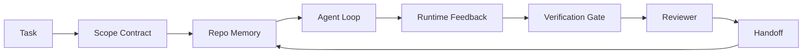

# एजेंट वर्कबेंच इंजीनियरिंगः क्यों सक्षम मॉडल अभी भी विफल रहे

> एक सक्षम मॉडल पर्याप्त नहीं है। विश्वसनीय एजेंटों को एक कार्य डेस्क की आवश्यकता हैः निर्देश, स्थिति, दायरा, प्रतिक्रिया, सत्यापन, समीक्षा और हाथोड़। उन्हें दूर करें और यहां तक कि सीमा मॉडल भी काम का उत्पादन करता है जो जहाज करने के लिए असुरक्षित है।

**Type:** Learn + Build
**Languages:** Python (stdlib)
**Prerequisites:** Phase 14 · 01 (Agent Loop), Phase 14 · 26 (Failure Modes)
**Time:** ~45 minutes

## सीखने के लक्ष्य

- निष्पादन विश्वसनीयता से मॉडल क्षमता को अलग करना।
- सात कार्यक्षेत्रों का नाम बताइए जो एजेंट के जहाज जाने-जाने का निर्णय लेते हैं।
- एक छोटे से रेपो कार्य पर एक कार्य डेस्क-निर्देशित रन के साथ केवल शीघ्र रन की तुलना करें।
- विफलता मोड रिपोर्ट तैयार करें जो प्रत्येक चूक सतह को उसके कारण होने वाले लक्षण के लिए मैप करता है।

## समस्या

आप एक सीमा मॉडल को वास्तविक रेपो में छोड़ देते हैं और इसे इनपुट सत्यापन जोड़ने के लिए कहते हैं। यह चार फ़ाइलें खोलता है, व्यवहार्य कोड लिखता है, सफलता की घोषणा करता है, और रुकता है। आप परीक्षण चलाते हैं। दो विफल होते हैं। एक तीसरी फ़ाइल को छूया जाता है जिसका सत्यापन से कोई लेना-देना नहीं था। एजेंट ने क्या माना, उसने पहले क्या कोशिश की, या क्या करना बाकी है इसका कोई रिकॉर्ड नहीं है।

यह मॉडल पायथन के बारे में गलत नहीं था, यह काम के बारे में गलत था। यह नहीं जानता था कि क्या किया गया था, इसे कहां लिखने की अनुमति थी, क्या परीक्षण प्रामाणिक थे, या अगले सत्र को कैसे लेना था।

यह एक मॉडल बग नहीं है यह एक कार्य डेस्क बग है एजेंट के आसपास की सतह में उन भागों की कमी है जो एक शॉट पीढ़ी को विश्वसनीय, पुनः प्रयोज्य इंजीनियरिंग में बदल देते हैं।

## अवधारणा

कार्य डेस्क वह परिचालन वातावरण है जो कार्य के दौरान मॉडल को लपेटता है। इसमें सात सतहें हैंः

| Surface | What it carries | Failure when missing |
|---------|-----------------|----------------------|
| Instructions | Startup rules, forbidden actions, definition of done | Agent guesses what shipping means |
| State | Current task, touched files, blockers, next action | Each session restarts from zero |
| Scope | Allowed files, forbidden files, acceptance criteria | Edits leak into unrelated code |
| Feedback | Real command output captured into the loop | Agent declares success on a 400 |
| Verification | Tests, lint, smoke run, scope check | "Looks good" reaches main |
| Review | A second pass with a different role | Builder marks own homework |
| Handoff | What changed, why, what is left | Next session re-discovers everything |

काम की डेस्क मॉडल से स्वतंत्र है. आप मॉडल को बदल सकते हैं और सतहों को रख सकते हैं. आप सतहों को नहीं बदल सकते हैं और विश्वसनीयता को बनाए रख सकते हैं।



लूप स्टेट फाइल पर बंद हो जाता है, चैट हिस्ट्री पर नहीं चैट अस्थिर है रेपो रिकॉर्डिंग सिस्टम है।

### कार्य डेस्क बनाम शीघ्र इंजीनियरिंग

प्रमोटिंग मॉडल को बताता है कि आप इस वक्र में क्या चाहते हैं। एक कार्य डेस्क मॉडल को बताता है कि कैसे कार्य करना है, वक्रों के पार और सत्रों के पार। अधिकांश एजेंट विफलता कहानियां प्रमोटिंग इंजीनियरिंग कपड़े पहनने पर कार्य डेस्क विफलता हैं।

### कार्यक्षेत्र बनाम ढांचा

एक फ्रेमवर्क आपको रनटाइम (लंगग्राफ, ऑटोजेन, एजेंट एसडीके) देता है। एक वर्कबेंच एजेंट को उस रनटाइम के भीतर काम करने के लिए एक जगह देता है। आपको दोनों की आवश्यकता होती है। यह मिनी-ट्रैक दूसरे के बारे में है।

### विक्रेता टैक्सोनोमी से नहीं बल्कि आदिम से तर्क

"हार्नेस इंजीनियरिंग" पर बहुत कुछ लिखा जा रहा है अभी। एडडी ओस्मानी, ओपनएआई, एंथ्रोपिक, लैंगचेन, मार्टिन फ़ॉलर, मोंगोडीबी, ह्यूमनलेयर, ऑगमेंट कोड, थिचवर्क्स, वॉकलैब्स की शानदार सूची, और मीडियम और हैकर न्यूज के टुकड़ों की एक स्थिर ड्रमबीट सभी इसे ले रहे हैं। वे इस बात पर असहमत हैं कि हर्नस क्या है, किस श्रेणी में है और किस शब्दावली का उपयोग करना है। हमें किसी पक्ष का चयन करने की आवश्यकता नहीं है। सात सतहें एक यूएक्स परत हैं; प्रत्येक कार्य डेस्क के नीचे वितरित-प्रणाली आदिमों का एक ही सेट है जो किसी भी विश्वसनीय बैकेंड को पकड़ता है।

एजेंट लेबल को एक पल के लिए बंद करें। एजेंट रन एक गणना है जो समय, प्रक्रियाओं और मशीनों को पार करती है। इसे विश्वसनीय बनाने के लिए आपको किसी भी उत्पादन प्रणाली की आवश्यकता के समान आदिम की आवश्यकता होती है।

| Primitive | What it is | What it carries for an agent |
|-----------|------------|------------------------------|
| Function | Typed handler. Pure where possible. Owns its inputs and outputs. | A tool call, a rule check, a verification step, a model invocation |
| Worker | Long-lived process that owns one or more functions and a lifecycle | The builder, the reviewer, the verifier, an MCP server |
| Trigger | Event source that invokes a function | Agent loop tick, HTTP request, queue message, cron, file change, hook |
| Runtime | The boundary that decides what runs where, with what timeouts and resources | Claude Code's process, LangGraph's runtime, a worker container |
| HTTP / RPC | The wire between caller and worker | Tool-call protocol, MCP request, model API |
| Queue | Durable buffer between trigger and worker; back-pressure, retry, idempotency | The task board, the feedback log, the review inbox |
| Session persistence | State that survives crashes, restarts, model swaps | `agent_state.json`, checkpoints, KV stores, the repo itself |
| Authorization policy | Who can call what function with which scope | Allowed/forbidden files, approval boundaries, MCP capability lists |

अब उन आदिमों पर सात कार्य डेस्क सतहों का नक्शा बनाएं।

- **Instructions** नीति + फ़ंक्शन मेटाडेटा। नियम चेक (फ़ंक्शन) हैं। राउटर (`AGENTS.md`) रनटाइम के स्टार्टअप से जुड़ी नीति है।
- **State** सत्र की निरंतरता. एक कुंजीबद्ध भंडारण हर चरण में रनटाइम पढ़ता है. फ़ाइल, KV, या DB; निरंतरता अर्थशास्त्र मायने रखता है, भंडारण बैकेंड नहीं करता है।
- **Scope** प्रति कार्य प्राधिकरण नीति. अनुमति/प्रतिबन्धित गोलियां एक एसीएल हैं. अनुमोदन की आवश्यकता एक अनुमति जाल है।
- **Feedback** एक कतार में लिखा गया कॉल लॉग. प्रत्येक शेल कॉल एक रिकॉर्ड है, टिकाऊ, replayable.
- **Verification** एक फ़ंक्शन. इनपुट पर निर्धारक. कार्य बंद होने पर ट्रिगर किया गया. विफलता बंद हो गई।
- **Review** एक अलग कार्यकर्ता जो केवल निर्माण कलाकृतियों पर केवल पढ़ने और समीक्षा रिपोर्ट पर केवल लिखने का अधिकार रखता है।
- **Handoff** सत्र के अंत में ट्रिगर द्वारा जारी एक टिकाऊ रिकॉर्ड। अगले सत्र के स्टार्टअप ट्रिगर इसे पढ़ता है।

एजेंट लूप स्वयं एक कार्यकर्ता है जो घटनाओं (उपयोगकर्ता संदेश, उपकरण परिणाम, टाइमर टिक) का उपभोग करता है, कार्यों (मॉडल, फिर मॉडल द्वारा चुने गए उपकरण) को कॉल करता है, रिकॉर्ड लिखता है (स्थिति, प्रतिक्रिया) और ट्रिगर (सत्यापन, समीक्षा, हाथ-प्रसार) जारी करता है। कोई रहस्य नहीं; एक नौकरी प्रोसेसर के समान आकार।

### प्रचलन में पैटर्न, आदिम में अनुवादित

हर लोकप्रिय हर्न पैटर्न आठ आदिम तक कम हो जाता है। अनुवाद तालिका।

| Vendor or community pattern | What it actually is |
|------------------------------|--------------------|
| Ralph Loop (Claude Code, Codex, agentic_harness book) — re-inject original intent into a fresh context window when the agent tries to stop early | A trigger that re-enqueues a task with a clean context; session persistence carries the goal forward |
| Plan / Execute / Verify (PEV) | Three workers, one per role, communicating via state and a queue between phases |
| Harness-compute separation (OpenAI Agents SDK, April 2026) — split control plane from execution plane | Restating control-plane / data-plane. Predates the agent label by decades |
| Open Agent Passport (OAP, March 2026) — sign and audit every tool call against a declarative policy before execution | An authorization policy enforced by a pre-action worker, with a signed audit queue |
| Guides and Sensors (Birgitta Böckeler / Thoughtworks) — feedforward rules + feedback observability | Authorization policy + verification functions + observability traces |
| Progressive compaction, 5-stage (Claude Code reverse engineering, April 2026) | A state-management worker that runs cron-like over session persistence to keep it within a budget |
| Hooks / middleware (LangChain, Claude Code) — intercept model and tool calls | Triggers + functions wrapped around the runtime's invocation path |
| Skills as Markdown with progressive disclosure (Anthropic, Flue) | A function registry where the function metadata is loaded into context just-in-time |
| Sandbox agents (Codex, Sandcastle, Vercel Sandbox) | The compute plane: a runtime with isolated filesystem, network, and lifecycle |
| MCP servers | Workers exposing functions over a stable RPC, with capability lists as authorization |

उस तालिका में प्रत्येक प्रविष्टि एजेंट समुदाय है जो पहले से ही वितरित प्रणालियों में एक नाम था कि एक आदिम पर पहुंचता है और उसे एक नया देता है। विपणन के लिए उपयोगी लेबल; इंजीनियरिंग शब्दावली के रूप में उपयोगी नहीं है।

### रसीदों में वास्तव में क्या कहा जाता है

हर्नस ओवर मॉडल का दावा अब इसके पीछे संख्याएं हैं, यह जानने लायक है, क्योंकि वे "बस एक स्मार्ट मॉडल के लिए प्रतीक्षा करें" के खिलाफ एकमात्र ईमानदार तर्क भी हैं।

- टर्मिनल बेंच 2.0  एक ही मॉडल, हर्नस परिवर्तन ने एक कोडिंग एजेंट को शीर्ष 30 के बाहर से पांचवें स्थान पर ले जाया (लंगचेन, *एजेंट हर्नस का शरीर रचना*) ।
- वर्सेल  ने अपने एजेंट के 80% उपकरण हटा दिए; सफलता दर 80% से बढ़कर 100% हो गई (MongoDB) ।
- हार्वे  कानूनी एजेंटों ने अकेले हर्नस अनुकूलन (MongoDB) के माध्यम से सटीकता को दोगुना से अधिक बढ़ाया।
- 88% उद्यम एआई एजेंट परियोजनाएं उत्पादन तक नहीं पहुंचती हैं। विफलताएं रनटाइम के आसपास समूहीकृत होती हैं, तर्क के बजाय (preprints.org, *Harness Engineering for Language Agents*, मार्च 2026) ।
- तीन लोकप्रिय ओपन-सोर्स फ्रेमवर्क पर 2025 के बेंचमार्क अध्ययन में ~50% कार्य पूरा होने की सूचना दी गई; लंबी-संदर्भ वेबएजेंट लंबी-संदर्भ स्थितियों में 40-50% से 10% से नीचे गिर गया, ज्यादातर अंतहीन लूप और लक्ष्य हानि (2026 के शुरुआती लेखन में व्यापक रूप से कवर किया गया) से।

यह निष्कर्ष यह नहीं है कि "हार्नेस हमेशा जीतता है।" मॉडल समय के साथ ही हार्नेस ट्रिक्स को अवशोषित करते हैं। निष्कर्ष यह है कि आज, लोड-बहन इंजीनियरिंग मॉडल के आसपास है, उसके अंदर नहीं, और उस लोड को ले जाने वाले आदिम हैं जो हर उत्पादन प्रणाली को हमेशा की जरूरत है।

### जहां विक्रेता लेखन कम रुक

यह वह हिस्सा है जिसके बारे में आपको विनम्र होने की जरूरत नहीं है।

- लैंगचेन के *एजेन्ट हर्नस का शरीरविज्ञान* में ग्यारह घटक हैं  प्रम्प्ट, उपकरण, हुक, रेत बॉक्स, ऑर्केस्ट्रेशन, मेमोरी, कौशल, उप-सब्जेन्ट और रनटाइम "मूर्ख लूप।" यह कतारों, एक तैनाती इकाई के रूप में श्रमिकों, ट्रिगर अर्थशास्त्र, सत्र की निरंतरता को एक अलग चिंता या प्राधिकरण नीति के रूप में नहीं कहता है। यह हर्नस को एक ऑब्जेक्ट के रूप में व्यवहार करता है जिसे आप कॉन्फ़िगर करते हैं, न कि एक सिस्टम के रूप में आप तैनात करते हैं।
- एडडी ओस्मानी की *एजेंट हर्नस इंजीनियरिंग* फ्रेमिंग को लैंड करती है `Agent = Model + Harness`और रशशश पैटर्न, लेकिन यह कहने के लिए बंद कर देता है कि एक हार्नेस क्या से बनाया गया है. यह एक रुख के रूप में पढ़ता है, एक विनिर्देश नहीं.
- एंट्रोपिक और ओपनएआई सतहों पर सबसे गहरा जाता है लेकिन अपने स्वयं के रनटाइम के भीतर रहता है। अप्रैल 2026 एजेंट एसडीके में "हार्नेस-कंप्यूटर अलगाव" घोषणा पहली विक्रेता टुकड़ा है जो स्पष्ट रूप से नियंत्रण-स्तर / डेटा-स्तर विभाजन का समर्थन करता है। यह एक आदिम विचार है, एक नया नहीं है।
- एजेंटिक_हार्नेस पुस्तक में एक कॉन्फिग ऑब्जेक्ट के रूप में हार्नेस को माना जाता है (जेमिन वेस्ट की *एजेंटिक इंजीनियरिंग*, अध्याय 6) और इसमें सबसे मजबूत पंक्ति यह है कि "एजेंटिक सिस्टम में हार्नेस प्राथमिक सुरक्षा सीमा है।" यह केवल प्राधिकरण नीति है, दोहराया गया।
- हैकर न्यूज थ्रेड एक ही स्थान पर आते रहते हैं। अप्रैल 2026 थ्रेड *एजेंट हर्नस सैंडबॉक्स के बाहर का है* तर्क देता है कि हर्नस को "सब कुछ के बाहर बैठने वाले हाइपरवाइजर की तरह होना चाहिए और संदर्भ और उपयोगकर्ता के आधार पर पहुंच को अधिकृत करता है।" यानी, एक अलग विमान के रूप में प्राधिकरण नीति।

आप इन टुकड़ों में से किसी के साथ असहमत होने की जरूरत नहीं है अंतर को नोटिस करने के लिए. वे एक प्रणाली के UX विवरण लिख रहे हैं जो पहले से ही मौजूद है. हम प्रणाली लिख रहे हैं. जब प्रणाली सही ढंग से बनाया गया है, सात सतहों आदिम से गिर जाते हैं. जब यह गलत बनाया गया है, कोई मात्रा नहीं है `AGENTS.md`पॉलिश लापता कतार को ठीक करता है।

तो जब आप "हार्नेस इंजीनियरिंग" को कहीं और सुनते हैं, तो आदिमों में अनुवाद करें। निर्देश और नियम नीति और कार्य हैं। स्टैफलिंग रनटाइम है। गार्डरेल्स प्राधिकरण + सत्यापन हैं। हुक ट्रिगर हैं। स्मृति सत्र की निरंतरता है। राल्फ लूप रिकाउ है। उप-महिला मजदूर हैं। रेत के बक्से कम्प्यूटर विमान हैं। शब्दावली बदलती है, इंजीनियरिंग नहीं। कार्यक्षेत्र एजेंट-उन्मुख UX है; हर्नस, उस अर्थ में जो अगले विक्रेता रीफ्रेम से बचता है, कार्य, श्रमिक, ट्रिगर, रनटाइम, कतारें, दृढ़ता और नीति को सही ढंग से एक साथ जोड़ दिया गया है।

```figure
wb-seven-surfaces
```

## इसे बनाओ

`code/main.py`एक छोटा रेपो कार्य दो बार चलाता है. पहले केवल शीघ्र के रूप में, फिर सात सतहों के साथ तारों में. एक ही मॉडल, एक ही कार्य. स्क्रिप्ट गिनती करता है कि विफल रन पर कौन सी सतहें गायब थीं और एक विफलता मोड रिपोर्ट प्रिंट करता है.

रेपो कार्य उद्देश्य से छोटा हैः एक फ़ाइल FastAPI शैली हैंडलर में इनपुट सत्यापन जोड़ें और पास टेस्ट लिखें।

इसे चलाओः

```
python3 code/main.py
```

आउटपुटः दो रन का एक-साथ लॉग, एक `failure_modes.json`केवल शीघ्र दौड़ का सारांश, और कार्य डेस्क दौड़ के लिए एक पंक्ति का फैसला.

एजेंट एक छोटा नियम आधारित स्टब है; बिंदु सतहों पर है, मॉडल नहीं। इस मिनी-ट्रैक के बाकी हिस्सों में आप प्रत्येक सतह को वास्तविक, पुनः प्रयोज्य कलाकृतियों के रूप में पुनर्निर्माण करेंगे।

## इसका प्रयोग करें

तीन स्थानों के कार्य डेस्क सतहों पहले से ही जंगली में मौजूद हैं, भले ही कोई भी उन्हें यह कहते हैंः

- **Claude Code, Codex, Cursor.** `AGENTS.md`और `CLAUDE.md`निर्देश सतह है, स्लैश कमांड दायरा है, हुक सत्यापन है।
- **LangGraph, OpenAI Agents SDK.**चेकपॉइंट और सत्र स्टोर राज्य की सतह हैं।
- **CI on a real repo.**परीक्षण, लेंट, और प्रकार की जांच सत्यापन है। पीआर टेम्पलेट है हाथ से है। कोड मालिक समीक्षा है।

वर्कबेंच इंजीनियरिंग उन सतहों को स्पष्ट और पुनः प्रयोज्य बनाने का अनुशासन है, प्रत्येक टीम को उन्हें फिर से खोजने के बजाय।

## इसे भेजें

`outputs/skill-workbench-audit.md`यह एक पोर्टेबल कौशल है जो सात कार्य डेस्क सतहों और रिपोर्टों के लिए एक मौजूदा रेपो का ऑडिट करता है जो गायब हैं, जो आंशिक हैं, और जो स्वस्थ हैं। इसे किसी भी एजेंट सेटअप के बगल में छोड़ दें; यह आपको बताता है कि पहले क्या ठीक करना है।

## व्यायाम

1. एक रेपो चुनें जहां आप पहले से ही एक एजेंट चला रहे हैं। 0 (अस्तित्व) से 2 (स्वस्थ) तक सात सतहों को स्कोर करें। आपकी सबसे कमजोर सतह क्या है?
2. विस्तार `main.py`तो केवल शीघ्र दौड़ने से भी एक नकली "सफलता" दावा उत्पन्न होता है। सत्यापन गेट ने इसे पकड़ा होगा।
3. अपने उत्पाद के लिए एक आठवीं सतह जोड़ें। यह स्पष्ट करें कि यह मौजूदा सात में से किसी एक में क्यों नहीं गिरता है।
4. एक अलग स्टब एजेंट के साथ स्क्रिप्ट को फिर से चलाएं जो अतिरिक्त फ़ाइल लिखना है। कौन सी सतह इसे पहले पकड़ती है?
5. चरण 14 · 26 से उद्योग में दोहराने वाले पांच विफलता मोड को सात सतहों पर नक्शा बनाएं। प्रत्येक सतह किस मोड को अवशोषित करने के लिए डिज़ाइन की गई है?

## प्रमुख शर्तें

| Term | What people say | What it actually means |
|------|----------------|------------------------|
| Workbench | "The setup" | Engineered surfaces around the model that make work reliable |
| Surface | "A doc" or "a script" | A named, machine-readable input the agent reads or writes every turn |
| System of record | "The notes" | The file the agent treats as truth when chat history is gone |
| Definition of done | "Acceptance" | An objective, file-backed checklist the agent cannot fake |
| Workbench audit | "Repo readiness check" | A pass over the seven surfaces that flags missing pieces before work begins |

## आगे पढ़ना

इनको डेटा पॉइंट के रूप में पढ़ें, प्राधिकरण के रूप में नहीं। प्रत्येक आंशिक वर्गीकरण है। इसे अपनाने का निर्णय लेने से पहले प्रत्येक अवधारणा को एक आदिम (कार्य, कार्यकर्ता, ट्रिगर, रनटाइम, HTTP/RPC, कतार, दृढ़ता, नीति) में वापस अनुवाद करें।

विक्रेता के फ्रेम:

- [Addy Osmani, Agent Harness Engineering](https://addyosmani.com/blog/agent-harness-engineering/) `Agent = Model + Harness`और रचस पैटर्न; बुनियादी ढांचे पर पतला
- [LangChain, The Anatomy of an Agent Harness](https://blog.langchain.com/the-anatomy-of-an-agent-harness/) ग्यारह घटकः प्रम्प्ट, उपकरण, हुक, ऑर्केस्ट्रेशन, सैंडबॉक्स, मेमोरी, कौशल, उप-सब्जेन्ट, रनटाइम; कतारों, तैनाती, authz को छोड़ता है
- [OpenAI, Harness engineering: leveraging Codex in an agent-first world](https://openai.com/index/harness-engineering/) कोडेक्स टीम की परिदृश्य उनके रनटाइम के आसपास की सतहों पर
- [OpenAI, Unrolling the Codex agent loop](https://openai.com/index/unrolling-the-codex-agent-loop/) एजेंट लूप को कम करके `while`फ़ंक्शन कॉल पर
- [Anthropic, Effective harnesses for long-running agents](https://www.anthropic.com/engineering/effective-harnesses-for-long-running-agents) एक विशिष्ट रनटाइम के भीतर लंबी क्षितिज सतहें
- [Anthropic, Harness design for long-running application development](https://www.anthropic.com/engineering/harness-design-long-running-apps) लागू डिजाइन नोट्स
- [LangChain Deep Agents harness capabilities](https://docs.langchain.com/oss/python/deepagents/harness) रनटाइम कॉन्फ़िग सतह

उपयोग योग्य विवरण के साथ चिकित्सक टुकड़ेः

- [Martin Fowler / Birgitta Böckeler, Harness engineering for coding agent users](https://martinfowler.com/articles/harness-engineering.html) गाइड (फायड फॉरवर्ड) + सेंसर (फायडबैक); सबसे साफ नियंत्रण-प्रकृति फ्रेमिंग
- [HumanLayer, Skill Issue: Harness Engineering for Coding Agents](https://www.humanlayer.dev/blog/skill-issue-harness-engineering-for-coding-agents) "यह एक मॉडल समस्या नहीं है, यह एक विन्यास समस्या है"
- [MongoDB, The Agent Harness: Why the LLM Is the Smallest Part of Your Agent System](https://www.mongodb.com/company/blog/technical/agent-harness-why-llm-is-smallest-part-of-your-agent-system) रसीदें: 80% से 100% तक की सटीकता, हार्वे 2x सटीकता, टर्मिनल बेंच शीर्ष 30 से शीर्ष 5 तक
- [Augment Code, Harness Engineering for AI Coding Agents](https://www.augmentcode.com/guides/harness-engineering-ai-coding-agents) बाध्यता-पहली पैदल यात्रा
- [Sequoia podcast, Harrison Chase on Context Engineering Long-Horizon Agents](https://sequoiacap.com/podcast/context-engineering-our-way-to-long-horizon-agents-langchains-harrison-chase/) मॉडल चिंताओं के मुकाबले रनटाइम चिंताएं

पुस्तकें, कागजात और संदर्भ कार्यान्वयनः

- [Jaymin West, Agentic Engineering — Chapter 6: Harnesses](https://www.jayminwest.com/agentic-engineering-book/6-harnesses) पुस्तक लंबाई उपचार, हर्न को प्राथमिक सुरक्षा सीमा के रूप में व्यवहार करता है
- [preprints.org, Harness Engineering for Language Agents (March 2026)](https://www.preprints.org/manuscript/202603.1756) नियंत्रण / एजेंसी / रनटाइम के रूप में शैक्षणिक ढांचे
- [walkinglabs/awesome-harness-engineering](https://github.com/walkinglabs/awesome-harness-engineering) संदर्भ, मूल्यांकन, अवलोकन, संगठनात्मकता के अनुसार चुनिंदा पठन सूची
- [ai-boost/awesome-harness-engineering](https://github.com/ai-boost/awesome-harness-engineering) वैकल्पिक क्युरेट सूची (उपकर, मूल्यांकन, मेमोरी, एमसीपी, अनुमति)
- [andrewgarst/agentic_harness](https://github.com/andrewgarst/agentic_harness) Redis समर्थित मेमोरी और eval सूट के साथ उत्पादन के लिए तैयार संदर्भ कार्यान्वयन
- [HKUDS/OpenHarness](https://github.com/HKUDS/OpenHarness) अंतर्निहित व्यक्तिगत एजेंट के साथ खुला एजेंट हर्न

हैकर न्यूज के विषयों को मतभेदों के लिए पढ़ने लायक है, मतभेदों के लिए नहींः

- [HN: Effective harnesses for long-running agents](https://news.ycombinator.com/item?id=46081704)
- [HN: Improving 15 LLMs at Coding in One Afternoon. Only the Harness Changed](https://news.ycombinator.com/item?id=46988596)
- [HN: The agent harness belongs outside the sandbox](https://news.ycombinator.com/item?id=47990675) एक अलग विमान के रूप में प्राधिकरण के लिए तर्क

इस पाठ्यक्रम के भीतर क्रॉस-रिफरेंसः

- चरण 14 · 23  ओपनटेलीमेट्री GenAI सम्मेलनः अवलोकन स्तर सेंसर साहित्य बिंदुओं पर
- चरण 14 · 26  विफलता मोड कैटलॉग सात सतहों को अवशोषित करने के लिए डिज़ाइन किया गया है
- चरण 14 · 27  शीघ्र इंजेक्शन रक्षा जो अनुमति-नीति के आदिम पर बैठती है
- चरण 14 · 29  उत्पादन रनटाइम (सूची, घटना, क्रॉन): जहां इस पाठ में आदिमों को तैनाती में रहते हैं
