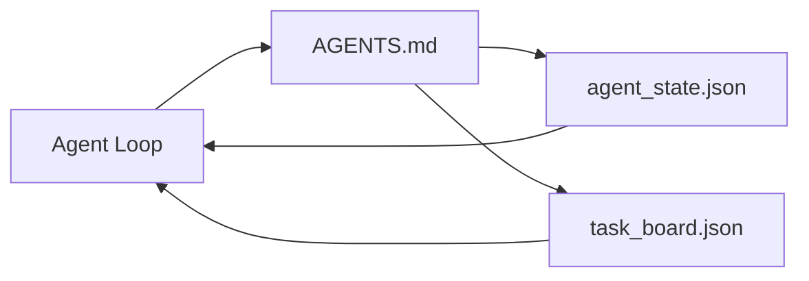

# न्यूनतम एजेंट कार्य डेस्क

> सबसे छोटी उपयोगी वर्कबेंच तीन फ़ाइलें हैंः रूट निर्देश राउटर, एक स्टेट फ़ाइल और एक टास्कबोर्ड। बाकी सब कुछ ऊपर परत है। यदि एक रेपो इन तीनों को नहीं ले सकता है, तो कोई मॉडल इसे सहेज नहीं सकता है।

**Type:** Build
**Languages:** Python (stdlib)
**Prerequisites:** Phase 14 · 31 (Why Capable Models Still Fail)
**Time:** ~45 minutes

## सीखने के लक्ष्य

- उन तीन फ़ाइलों को परिभाषित करें जो न्यूनतम व्यवहार्य कार्यक्षेत्र का गठन करते हैं।
- समझाओ क्यों एक छोटी रूट राउटर एक लंबी मोनोलिथिक से बेहतर है `AGENTS.md`. .
- एक राज्य फ़ाइल बनाएं जो एजेंट हर मोड़ पर पढ़ सकता है और अंत में लिख सकता है।
- एक कार्य बोर्ड बनाएँ जो चैट इतिहास के बिना मल्टी-सैशन काम को जीवित रखता है।

## समस्या

अधिकांश टीमें 3000 लाइन लिखकर कार्य डेस्क तक पहुंचती हैं `AGENTS.md`मॉडल इसे लोड करता है, उन भागों को अनदेखा करता है जो इसे संक्षेप में नहीं बता सकते हैं, और फिर भी उसी सतहों पर विफल रहता है जिस पर यह हमेशा विफल रहा है।

आपको इसके विपरीत की आवश्यकता है। एक छोटी सी रूट फ़ाइल जो एजेंट को केवल प्रासंगिक होने पर ही गहरी फ़ाइलों में रूट करती है। टिकाऊ राज्य एजेंट कार्य करने से पहले पढ़ता है और उसके बाद लिखता है। एक टास्क बोर्ड जो बताता है कि उड़ान में क्या है, क्या अवरुद्ध है, और आगे क्या है।

तीन फाइलें, प्रत्येक एक काम के साथ, प्रत्येक मशीन-पठनीय पर्याप्त बाद में एक वास्तविक प्रणाली में विकसित करने के लिए.

## अवधारणा



### एजेंट्स.एमडी एक राउटर है, एक मैनुअल नहीं

एक अच्छा `AGENTS.md`यह एजेंट को इंगित करता हैः

- राज्य फ़ाइल (जहां आप हैं) ।
- कार्य बोर्ड (क्या बचा है)
- गहन नियम (अधीन `docs/agent-rules.md`) ।
- सत्यापन कमांड (यह कैसे पता करें कि यह काम करता है) ।

जो कुछ भी लंबा होता है, वह गहरे डॉक्स में जाता है, जब आवश्यक हो तभी लोड होता है। लंबे मैनुअल को अनदेखा किया जाता है। छोटे राउटरों का पालन किया जाता है।

### agent_state.json रिकॉर्ड प्रणाली है

स्टेट ले जाता हैः सक्रिय कार्य आईडी, छुए गए फ़ाइलें, किए गए अनुमान, ब्लॉकर और अगली कार्रवाई। एजेंट इसे हर मोड़ पर पढ़ता है। अगले सत्र में चैट को फिर से खेलने के बजाय इसे पढ़ता है।

राज्य एक फ़ाइल में रहता है क्योंकि चैट इतिहास अविश्वसनीय है सत्र मर जाते हैं बातचीत काटा जाता है. फ़ाइल नहीं है.

### task_board.json कतार है

कार्य बोर्ड प्रत्येक कार्य को स्थिति के साथ संचालित करता है `todo | in_progress | done | blocked`यह उस कतार है जो एजेंट जब स्टेट खाली हो जाता है, और वह कतार जिसे आप पढ़ते हैं जब आप जानना चाहते हैं कि एजेंट सही रास्ते पर है या नहीं।

बोर्ड पर एक कार्य में एक आईडी, एक लक्ष्य, एक मालिक (`builder`,`reviewer`या `human`बोर्ड का आकार छोटा होता है: जब यह स्क्रीन से आगे बढ़ता है, तो आपको एक योजना समस्या होती है, बोर्ड समस्या नहीं।

### तीन फाइलें मंजिल हैं, छत नहीं

बाद के पाठों में दायरा अनुबंध, प्रतिक्रिया रनर, सत्यापन गेट, समीक्षक चेकलिस्ट और हस्तान्तरण पैकेट जोड़े जाते हैं। यहां तीन फाइलें जो वे सभी मानते हैं।

```figure
wb-three-files
```

## इसे बनाओ

`code/main.py`न्यूनतम कार्यक्षेत्र को एक खाली रेपो में लिखता है और एक एकल एजेंट को यह प्रदर्शित करता है किः

1. पढ़ता है `agent_state.json`. .
2. अगले कार्य को खींचता है `task_board.json`यदि राज्य खाली है।
3. दायरे के भीतर एक ही फ़ाइल को छूता है।
4. अद्यतन स्थिति वापस लिखता है।

इसे चलाओः

```
python3 code/main.py
```

स्क्रिप्ट बनाता है `workdir/`अपने आप के पास, तीन फ़ाइलों को नीचे रखता है, एक बारी चलाता है, और अंतर प्रिंट करता है. यह देखने के लिए फिर से चलाता है कि कैसे दूसरे बारी को लेने के लिए जहां पहले बंद कर दिया.

## इसका प्रयोग करें

उत्पादन एजेंट उत्पादों के अंदर, एक ही तीन फ़ाइलें अलग-अलग नामों के तहत दिखाई देती हैंः

- **Claude Code:** `AGENTS.md`या `CLAUDE.md`राउटर के लिए, `.claude/state.json`- राज्य के लिए शैली स्टोर, बोर्ड के लिए हुक.
- **Codex / Cursor:**राउटर के लिए कार्यक्षेत्र नियम, राज्य के लिए सत्र स्मृति, बोर्ड के लिए चैट साइडबार में कतार कार्यों.
- **Custom Python agent:**वही फाइलें जो आपने अभी लिखी हैं।

नाम बदलते हैं, आकार नहीं।

## जंगली में उत्पादन के पैटर्न

न्यूनतम कार्यक्षेत्र वास्तविक मोनोरेपो के संपर्क में रहता है जब इसके ऊपर तीन पैटर्न परतों पर रखे जाते हैं। वे स्वतंत्र हैं; अपने रेपो की वास्तव में जरूरत वाले चुनें।

**Nested `AGENTS.md` with nearest-wins precedence.**ओपनएआई जहाज 88 `AGENTS.md`कॉडक्स, कर्सर, क्लाउड कोड, और कॉपिलॉट सभी काम कर फ़ाइल से रेपो रूट की ओर चलते हैं और प्रत्येक को एक साथ जोड़ते हैं।`AGENTS.md`वे रास्ते में मिल जाते हैं। उप निर्देशिका फ़ाइलें रूट फ़ाइल का विस्तार।`AGENTS.override.md`विस्तार की बजाय प्रतिस्थापन करने के लिए; ओवरराइड तंत्र कोडेक्स-विशिष्ट है और क्रॉस-टूल काम के लिए इससे बचें। बढ़ते कोड का माप है जो महत्वपूर्ण हैः सबसे अच्छा `AGENTS.md`फ़ाइलें हैकू से ओपस में अपग्रेड के बराबर गुणवत्ता की छलांग देती हैं; सबसे खराब आउटपुट किसी फ़ाइल से भी बदतर होती हैं।

**Anti-patterns to refuse, even when they look like coverage.**परस्पर विरोधी निर्देशों से एजेंट को चुपचाप इंटरैक्टिव मोड से लालची मोड में छोड़ दिया जाता है (ICLR 2026 AMBIG-SWE: 48.8% → 28% रिज़ॉल्यूशन दर); उन्हें फ्लैट स्टैक करने के बजाय नंबर प्राथमिकताएं। बिना किसी प्रवर्तन आदेश के बिना अमान्य शैली नियम ("गुगल पायथन शैली गाइड का पालन करें") एजेंट को अनुपालन का आविष्कार करने दें; प्रत्येक शैली नियम को सटीक lint कमांड के साथ जोड़ा। आदेशों के बजाय शैली के साथ नेतृत्व सत्यापन पथ को दफन करता है; आदेश पहले, शैली अंतिम है। एजेंटों के बजाय मनुष्यों के लिए लिखना संदर्भ बजट को बर्बाद करता है; संक्षिप्तता एक विशेषता है।

**Cross-tool symlinks.**सिम्लिंक वाली एक ही रूट फ़ाइल (`ln -s AGENTS.md CLAUDE.md`,`ln -s AGENTS.md .github/copilot-instructions.md`,`ln -s AGENTS.md .cursorrules`) सभी कोडिंग एजेंटों को एक ही सत्य स्रोत पर रखता है।`nx ai-setup`एक ही कॉन्फ़िग से क्लाउड कोड, कर्सर, कॉपिलोट, मिथुन, कोडेक्स और ओपनकोड में इसे स्वचालित करता है।

## इसे भेजें

`outputs/skill-minimal-workbench.md`किसी भी नए रेपो के लिए तीन फ़ाइल कार्य डेस्क उत्पन्न करता हैः `AGENTS.md`परियोजना के लिए ट्यून राउटर, एक `agent_state.json`सही कुंजी के साथ, और एक `task_board.json`वर्तमान बैकलॉग के साथ बीज।

## व्यायाम

1. एक जोड़ें `last_run`समय से `agent_state.json`. यदि फ़ाइल 24 घंटे से अधिक पुरानी है तो ऑपरेटर द्वारा पुष्टि किए बिना चलाने से इनकार करें।
2. एक जोड़ें `priority`कार्य बोर्ड पर फ़ील्ड और हमेशा उच्चतम प्राथमिकता चुनने के लिए खींचने के लिए बदल `todo`. .
3. प्रवास करें `task_board.json`JSON पंक्तियों के लिए तो प्रत्येक कार्य एक पंक्ति है और संस्करण नियंत्रण में अंतर साफ हैं.
4. एक लिखें `lint_workbench.py`यदि यह विफल हो जाता है`AGENTS.md`80 से अधिक पंक्तियों या संदर्भों के साथ एक फ़ाइल है जो मौजूद नहीं है।
5. तीनों फाइलों में से कौन खोने से ज्यादा चोट लगती है, यह तय करें।

## प्रमुख शर्तें

| Term | What people say | What it actually means |
|------|----------------|------------------------|
| Router | `AGENTS.md` | Short root file that points the agent at deeper docs and files |
| State file | "The notes" | Machine-readable record of where the agent is, written every turn |
| Task board | "The backlog" | JSON queue of work with status, owner, acceptance |
| System of record | "Source of truth" | The file the workbench treats as authoritative when chat is gone |

## आगे पढ़ना

- [agents.md — the open spec](https://agents.md/) Cursor, Codex, Claude Code, Copilot, Gemini, OpenCode द्वारा अपनाया गया
- [Augment Code, A good AGENTS.md is a model upgrade. A bad one is worse than no docs at all](https://www.augmentcode.com/blog/how-to-write-good-agents-dot-md-files) मापी गई गुणवत्ता की छलांगें
- [Blake Crosley, AGENTS.md Patterns: What Actually Changes Agent Behavior](https://blakecrosley.com/blog/agents-md-patterns) क्या अनुभवजन्य रूप से काम करता है, क्या नहीं
- [Datadog Frontend, Steering AI Agents in Monorepos with AGENTS.md](https://dev.to/datadog-frontend-dev/steering-ai-agents-in-monorepos-with-agentsmd-13g0) व्यवहार में घोंसले हुए प्राधान्य
- [Nx Blog, Teach Your AI Agent How to Work in a Monorepo](https://nx.dev/blog/nx-ai-agent-skills) छह उपकरणों पर एकल स्रोत उत्पादन
- [The Prompt Shelf, AGENTS.md Best Practices: Structure, Scope, and Real Examples](https://thepromptshelf.dev/blog/agents-md-best-practices/) अनुभाग आदेश जो समीक्षा से बचता है
- [Anthropic, Claude Code subagents](https://code.claude.com/docs/en/sub-agents)
- चरण 14 · 31  विफलता मोड इस न्यूनतम अवशोषित
- चरण 14 · 34  स्थायी राज्य योजना इस पाठ पूर्वानुमान
