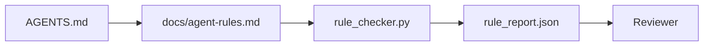

# एजेंट निर्देश निष्पादित प्रतिबंधों के रूप में

> प्रोजा के रूप में लिखे गए निर्देश इच्छाएं हैं। प्रतिबंधों के रूप में लिखे गए निर्देश परीक्षण हैं। कार्य डेस्क प्रत्येक नियम को कुछ ऐसा बनाता है जिसे एक एजेंट रनटाइम में जांच सकता है और एक समीक्षक तथ्य के बाद सत्यापित कर सकता है।

**Type:** Build
**Languages:** Python (stdlib)
**Prerequisites:** Phase 14 · 32 (Minimal Workbench)
**Time:** ~50 minutes

## सीखने के लक्ष्य

- संचालन नियमों से मार्ग प्रशोधन को अलग करें।
- मशीन-चेक करने योग्य प्रतिबंधों के रूप में स्टार्टअप नियम, प्रतिबंधित क्रियाएं, किया गया की परिभाषा, अनिश्चितता प्रबंधन और स्वीकृति सीमाएं व्यक्त करें।
- नियम परीक्षक को लागू करें जो नियम सेट के खिलाफ रन स्कोर करता है।
- नियम सेट को अंतर-अनुकूल बनाएं ताकि समीक्षा देख सके कि क्या बदला है।

## समस्या

एक विशिष्ट `AGENTS.md`यह एजेंट को "सावधान" और "तकीद से परीक्षण" और "अनिश्चितता के बारे में पूछें" कहता है। तीन दिन बाद, एजेंट बिना परीक्षण के एक बदलाव भेजता है, एक प्रतिबंधित निर्देशिका में लिखता है, और कभी नहीं पूछता है क्योंकि उसे कभी नहीं पता था कि लाइन कहां थी।

निर्देश जब परिचालन योग्य होते हैं तो शक्तिशाली होते हैं और जब आकांक्षी होते हैं तो कमजोर होते हैं। कामकाजी बेंच द्वारा व्याख्या किए जाने वाले नियमों को लिखना और समीक्षक द्वारा स्कोर किया जा सकता है।

## अवधारणा

नियम में शामिल हैं `docs/agent-rules.md`प्रत्येक नियम का एक नाम, एक श्रेणी, और एक चेक है।



### पांच श्रेणियाँ जो अधिकांश नियमों को कवर करती हैं

| Category | Question the rule answers | Example |
|----------|---------------------------|---------|
| Startup | What must be true before work begins? | "state file exists and is fresh" |
| Forbidden | What must never happen? | "do not edit `scripts/release.sh`" |
| Definition of done | What proves the task is complete? | "pytest exits 0 and acceptance line passes" |
| Uncertainty | What does the agent do when unsure? | "open a question note instead of guessing" |
| Approval | What requires human approval? | "any new dependency, any prod write" |

एक नियम जो इन पांच में से किसी एक के अनुरूप नहीं होता है, आमतौर पर दो नियम होना चाहता है।

### नियम मशीन-पठनीय हैं

प्रत्येक नियम में एक स्लग, एक श्रेणी, एक पंक्ति विवरण और एक `check`फ़ील्ड जो फ़ंक्शन का नाम `rule_checker.py`नियम जोड़ने का अर्थ है चेक जोड़ना; चेक वर्कबेंच के साथ बढ़ता है।

### नियम भिन्नता के अनुकूल हैं

नियम एक ही मार्कडाउन फ़ाइल में प्रति शीर्षक एक रहते हैं। नाम बदलना भिन्नता में दिखाई देता है। नए नियम अपनी श्रेणी के शीर्ष पर बैठते हैं। पुराने नियम हटा दिए जाते हैं, टिप्पणी नहीं की जाती है, क्योंकि कार्य डेस्क सच्चाई का स्रोत है, न कि चैट लॉग है कि टीम ने पिछले तिमाही में कैसा महसूस किया।

### नियम बनाम फ्रेमवर्क गार्डरेल

फ्रेमवर्क गार्डरेल्स (OpenAI एजेंट्स SDK गार्डरेल्स, लैंगग्राफ इंटरक्यूट) रनटाइम स्तर पर नियमों को लागू करते हैं। इस पाठ में निर्धारित नियम मानव-पठनीय, समीक्षा योग्य अनुबंध है जो उन गार्डरेल्स द्वारा लागू किए जाते हैं। आपको दोनों की आवश्यकता हैः रनटाइम एक बारी के दौरान उल्लंघन को पकड़ता है, नियम सेट साबित करता है कि रनटाइम सही काम कर रहा है।

### प्रगतिशील प्रकटीकरणः एक नक्शा, ज्ञानकोश नहीं

कारण`AGENTS.md`एक साल में, फ़ाइल दो हजार पंक्तियों है, और एजेंट पहली स्क्रीन पढ़ता है, ध्यान बजट से बाहर चला जाता है, और जो कहा गया था के एक अंश पर कार्य करता है। एक विशाल निर्देश फ़ाइल एक ही कारण से विफल रहता है चालीस पृष्ठों के ऑनबोर्डिंग दस्तावेज़ विफल रहता हैः पाठक इसे एक बार स्कीम करता है और कभी भी उस भाग पर वापस नहीं आता है जो मायने रखता है।

फिक्स एक छोटी फ़ाइल नहीं है। यह एक परत वाली है। रूट राउटर हर सत्र को पढ़ने के लिए पर्याप्त छोटा रहता है और केवल संकेतकों को रखता है। विषय फ़ाइलों में गहराई रहती है एजेंट केवल जब कार्य उन्हें छूता है तो लोड करता है। एजेंट को एक नक्शा दें, पूरे ज्ञानकोश नहीं, और इसे उस पृष्ठ पर चलने दें जिसकी उसे आवश्यकता है।

```
AGENTS.md                  # router, < 50 lines: what this repo is, where to look, the 5 hard rules
docs/
  agent-rules.md           # the full rule set (this lesson)
  architecture.md          # loaded when the task touches module boundaries
  testing.md               # loaded when the task writes or runs tests
  deploy.md                # loaded only for release work, gated behind an approval rule
feature_list.json          # the backlog (Phase 14 · 36)
```

| Tier | Lives in | Read when | Size budget |
|------|----------|-----------|-------------|
| Router | `AGENTS.md` | Every session, always | Under ~50 lines |
| Rules | `docs/agent-rules.md` | Every session, on startup | One screen per category |
| Topic docs | `docs/<topic>.md` | Only when the task touches that topic | As deep as needed |

दो परीक्षणों को लेयरिंग ईमानदार रखने के लिए. पहुंच परीक्षणः एक एजेंट को रूटर से अधिकतम दो हाप में किसी भी नियम तक पहुंचना चाहिए, इसलिए रूटर को प्रत्येक विषय डॉक्यूमेंट को पथ द्वारा लिंक करना चाहिए, इसे गद्य में वर्णित नहीं करना चाहिए। ताज़ापन परीक्षणः राउटर इतना छोटा है कि एक समीक्षक इसे हर पीआर पर फिर से पढ़ता है, जो एकमात्र चीज है जो इसे चुपचाप इसे बदलने वाले ज्ञानकोश में वापस बढ़ने से रोकती है। एक पॉइंटर जो अब हल नहीं होता है वह एक गायब नियम की तुलना में एक बदतर विफलता है, इसलिए राउटर में एक टूटा हुआ लिंक स्वयं स्टार्ट-चेक उल्लंघन है।

```figure
wb-rule-checkoff
```

## इसे बनाओ

`code/main.py`जहाजों

- `agent-rules.md`एक डेटा वर्ग में नियमों को लोड करने वाला पार्सर।
- `rule_checker.py`शैली परीक्षक कार्य, प्रति `check`संदर्भ।
- एक डेमो एजेंट दो नियमों का उल्लंघन करता है और एक चेक पास है कि उन्हें पकड़ता है चला जाता है.

इसे चलाओः

```
python3 code/main.py
```

आउटपुटः पार्स नियम सेट, रन ट्रैक, पास/फेल प्रति नियम, और `rule_report.json`स्क्रिप्ट के बगल में सहेजा गया।

## जंगली में उत्पादन के पैटर्न

तीन पैटर्न एक नियम सेट को एक सप्ताह में गिरावट से अलग करते हैं जो एक चौथाई तक रहता है।

**Severity tagging at write time.**हर नियम में है`severity``block`,`warn`या `info`. चेकर तीनों रिपोर्ट करता है; रनटाइम केवल पर मना करता है `block`. अधिकांश टीमों ने गंभीरता को जल्दी अतिरंजित किया और फिर समय सीमा के दबाव में चुपचाप इसे कमजोर कर दिया; लेखन समय पर टैगिंग करने से मापने को आगे बढ़ना पड़ता है। सत्यापन गेट (चरण 14 · 38), जो किसी भी ओवरराइड का संकेत देता है।`block`नियम में एक `overrides.jsonl`लेखा परीक्षा लॉग।

**Rule expiry as a forcing function.**हर नियम में एक नियम होता है`expires_at`समय सीमा (पूर्वनिर्धारित 90 दिन लेखक के बाद) जब एक अप्रचलित नियम में 60 लगातार दिनों के लिए शून्य उल्लंघन होता है तो चेकर एक चेतावनी जारी करता है; अगली तिमाही समीक्षा या तो इसे बनाए रखने का औचित्य देती है, या इसे कम करती है `info`क्लाउडफ्लेयर के उत्पादन एआई कोड समीक्षा डेटा (अप्रैल 2026, 131,246 समीक्षा 30 दिनों में 5,169 रिपो पर चलती है) ने दिखाया कि स्पष्ट रूप से समाप्त होने वाले नियम सेट प्रति रेपो के तहत 30 नियमों के तहत बने रहे; बिना सेट 80+ तक बढ़ गए हैं, अधिकांश कभी शूटिंग नहीं करते हैं।

**Markdown-as-source, JSON-as-cache.** `agent-rules.md`लेखक फ़ाइल है; `agent-rules.lock.json`यह एक कैश है जो चेकर हॉट पथ में पढ़ता है। लॉक को पूर्व-कमिट हुक द्वारा पुनर्निर्मित किया जाता है। मार्कडाउन अंतर की समीक्षा की जा सकती है; JSON पार्सिंग हर मोड़ से बाहर रहता है।`package.json`/`package-lock.json`और `Cargo.toml`/`Cargo.lock`. .

## इसका प्रयोग करें

उत्पादन मेंः

- क्लाउड कोड, कोडेक्स, कर्सर सत्र की शुरुआत में नियमों को पढ़ते हैं और उन्हें अस्वीकार करते समय उद्धृत करते हैं। चेकर उन्हें चुपचाप बहने को पकड़ने के लिए आईसी में फिर से चलाता है।
- OpenAI एजेंट्स SDK गार्डरेल इनपुट और आउटपुट गार्डरेल के समान चेक रिकॉर्ड करते हैं। मार्कडाउन डॉक्स सतह है; SDK रनटाइम सतह है।
- लैंगग्राफ आग को तब बाधित करता है जब उड़ान में एक नोड एक नियम का उल्लंघन करता है। बाधित हैंडल नियम को पढ़ता है, मानव से पूछता है, और फिर से शुरू करता है।

नियम सेट तीनों में पोर्टेबल है क्योंकि यह सिर्फ मार्कडाउन प्लस फ़ंक्शन नाम है।

## इसे भेजें

`outputs/skill-rule-set-builder.md`परियोजना के मालिक से साक्षात्कार करता है, उनके मौजूदा गद्य निर्देशों को पांच श्रेणियों में वर्गीकृत करता है, और एक संस्करण जारी करता है `agent-rules.md`और एक चेक स्टब.

## व्यायाम

1. यदि आपके उत्पाद को इसकी आवश्यकता है तो एक छठी श्रेणी जोड़ें।
2. जांच को बढ़ाकर एक नियम में गंभीरता (`block`,`warn`,`info`) और रिपोर्ट को तदनुसार संकलित किया गया है।
3. आईसी में चेकर को वायर करेंः यदि नवीनतम एजेंट रन पर ब्लॉक-सख्तता नियम विफल रहता है तो बिल्ड विफल हो जाता है।
4. प्रत्येक नियम के लिए एक "अंतराल" फ़ील्ड जोड़ें। 90 दिनों के बिना चेक विफल होने के बाद, नियम समीक्षा के लिए है।
5. एक असली खोजें`AGENTS.md`और इसे पांच श्रेणी के नियमों के रूप में फिर से लिखें. इसकी कितनी लाइनें परिचालन में थीं? कितनी आकांक्षा थी?

## प्रमुख शर्तें

| Term | What people say | What it actually means |
|------|----------------|------------------------|
| Operational rule | "A real instruction" | A rule the workbench can check at runtime |
| Aspirational rule | "Be careful" | A rule with no check; either delete or upgrade |
| Definition of done | "Acceptance" | An objective, file-backed proof the task is complete |
| Block severity | "Hard rule" | Violation halts the run; cannot be silenced without an operator |
| Rule expiry | "Stale rule sweep" | A rule with no fails in N days is up for retirement |

## आगे पढ़ना

- [OpenAI Agents SDK guardrails](https://openai.github.io/openai-agents-python/guardrails/)
- [LangGraph interrupts](https://langchain-ai.github.io/langgraph/how-tos/human_in_the_loop/breakpoints/)
- [Anthropic, Building Effective Agents](https://www.anthropic.com/research/building-effective-agents)
- [Rick Hightower, Agent RuleZ: A Deterministic Policy Engine](https://medium.com/@richardhightower/agent-rulez-a-deterministic-policy-engine-for-ai-coding-agents-9489e0561edf) उत्पादन में ब्लॉक/चेतावनी/सूचना गंभीरता
- [Cloudflare, Orchestrating AI Code Review at Scale](https://blog.cloudflare.com/ai-code-review/) 131k समीक्षा रन, नियम रचना पाठ
- [microservices.io, GenAI development platform — part 1: guardrails](https://microservices.io/post/architecture/2026/03/09/genai-development-platform-part-1-development-guardrails.html) नियमों और आईसी के बीच गहन रक्षा
- [Type-Checked Compliance: Deterministic Guardrails (arXiv 2604.01483)](https://arxiv.org/pdf/2604.01483) नियम-जैसे-चेक पर ऊपरी सीमा के रूप में 4 को लाना
- [logi-cmd/agent-guardrails](https://github.com/logi-cmd/agent-guardrails) विलय-द्वार कार्यान्वयनः दायरा, उत्परिवर्तन परीक्षण, उल्लंघन के बजट
- चरण 14 · 32  इस नियम सेट में न्यूनतम कार्य डेस्क में गिर जाता है
- चरण 14 · 38  नियम रिपोर्ट का उपभोग करने वाला सत्यापन गेट
- चरण 14 · 39  नियम अनुपालन का स्कोर करने वाला समीक्षक एजेंट
