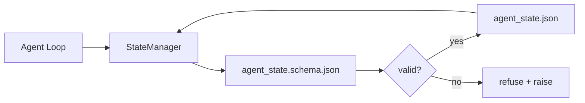

# रिपो मेमोरी और टिकाऊ स्थिति

> चैट इतिहास अस्थिर है। रेपो टिकाऊ है। वर्कबेंच स्टोर एजेंट संस्करण फ़ाइलों में स्टेटस है ताकि अगले सत्र, अगले एजेंट, और अगले समीक्षक सभी एक ही सत्य स्रोत से पढ़ते हैं।

**Type:** Build
**Languages:** Python (stdlib + `jsonschema` optional)
**Prerequisites:** Phase 14 · 32 (Minimal Workbench)
**Time:** ~60 minutes

## सीखने के लक्ष्य

- रेपो मेमोरी में क्या है और चैट इतिहास में क्या है, उसे परिभाषित करें।
- लेखक JSON स्कीम के लिए `agent_state.json`और `task_board.json`. .
- एक राज्य प्रबंधक का निर्माण जो लोड करता है, सत्यापित करता है, उत्परिवर्तन करता है, और परमाणु रूप से राज्य में रहता है।
- खराब लेखन को अस्वीकार करने के लिए योजना का उपयोग करें इससे पहले कि वे कार्य डेस्क को भ्रष्ट करें।

## समस्या

एजेंट एक सत्र समाप्त करता है। चैट बंद हो जाती है। अगला सत्र खुलता है और पूछता है कि कहां शुरू करना है। मॉडल कहता है "मुझे फ़ाइलों की जांच करने दें", पुराने नोट्स पढ़ता है, और पहले से ही पूरा हो चुका काम फिर से करता है। या इससे भी बदतर, यह एक तैयार फ़ाइल को फिर से लिखता है क्योंकि किसी ने उसे नहीं बताया कि फ़ाइल समाप्त हो गई है।

वर्कबेंच फिक्स रेपो मेमोरी हैः रेपो में JSON फ़ाइलों में राज्य रहता है, एक योजना के तहत लिखा जाता है, परमाणु रूप से बरकरार रहता है, कोड समीक्षा में अंतर-अनुकूल है। चैट एक पारगमन फ़ीड है; रेपो रिकॉर्डिंग प्रणाली है।

## अवधारणा



### रेपो मेमोरी में क्या है

| Belongs | Does not belong |
|---------|-----------------|
| Active task id | Raw chat transcripts |
| Touched files this session | Token-level reasoning traces |
| Assumptions the agent made | "The user seemed frustrated" |
| Open blockers | Sampled completions |
| Next action | Vendor-specific model ids |

परीक्षण टिकाऊपन है: क्या यह तीन महीने में एक आईसी पुनरावृत्ति में उपयोगी होगा? यदि हां, रेपो। यदि नहीं, टेलीमेट्री।

### योजना-पहली स्थिति

JSON Schema contract है. इसके बिना, हर एजेंट नए फ़ील्ड का आविष्कार करता है, हर समीक्षक एक नया आकार सीखता है, और प्रत्येक CI स्क्रिप्ट को पिछले संस्करणों के लिए विशेष मामले हैं। इसके साथ, एक खराब लेखन एक अस्वीकृत लेखन है।

योजना में शामिल हैंः

- आवश्यक कुंजी।
- अनुमति दी गई है`status`मूल्य।
- निषिद्ध मान (जैसे `null`सरणी के लिए) ।
- पैटर्न प्रतिबंध (कार्य आईडी मेल `T-\d{3,}`) ।
- प्रवासन के लिए संस्करण फ़ील्ड।

### परमाणु लिखता है

राज्य लिखता है आंशिक विफलताओं को जीवित रहने की जरूरत हैः एक टेम्पफ़ाइल में लिखें, fsync, लक्ष्य पर नाम बदलें। राज्य फ़ाइल सत्य का स्रोत है; आधा लिखा एक फ़ाइल नहीं से भी बदतर है।

### प्रवास

जब स्कीमा बदलता है, स्कीमा बूम के बगल में एक माइग्रेशन स्क्रिप्ट भेजें। राज्य फ़ाइल एक `schema_version`फ़ील्ड; प्रबंधक एक फ़ाइल को उस संस्करण से लोड करने से इनकार करता है जिसे वह माइग्रेट नहीं कर सकता है।

```figure
wb-state-persist
```

## इसे बनाओ

`code/main.py`कार्य करता हैः

- `agent_state.schema.json`और `task_board.schema.json`. .
- केवल stdlib-केवल सत्यापनकर्ता (JSON योजना का उपसमूहः आवश्यक, प्रकार, enum, पैटर्न, आइटम) ।
- `StateManager.load`,`StateManager.update`,`StateManager.commit`परमाणु समय और नाम परिवर्तन के साथ लिखता है।
- एक डेमो जो राज्य को उत्परिवर्तन करता है, बरकरार रहता है, पुनः लोड करता है, और वापस यात्रा साबित करता है।

इसे चलाओः

```
python3 code/main.py
```

स्क्रिप्ट लिखता है `workdir/agent_state.json`और `workdir/task_board.json`, उन्हें दो मोड़ पर उत्परिवर्तन करता है, और प्रत्येक कदम पर मान्य स्थिति प्रिंट करता है।

## जंगली में उत्पादन के पैटर्न

चार पैटर्न सबक के न्यूनतम को कुछ एक बहु-एजेंट monorepo जीवित रह सकता है में बदल देता है।

**Atomic temp-and-rename is not optional.**मार्च 2026 Hive परियोजना बग रिपोर्ट विफलता मोड को साफ ढंग से दस्तावेज करता हैः `state.json`द्वारा लिखा गया था `write_text()`और अपवादों को पकड़ा गया और चुप कर दिया गया. आंशिक लिखता है बाएं सत्रों भ्रष्ट राज्य के खिलाफ बिना संकेत के फिर से शुरू. फिक्स हमेशा हैः`tempfile.mkstemp`लक्ष्य के साथ एक ही निर्देशिका में लिखें, `fsync`,`os.replace`(पोसिक्स और विंडोज पर परमाणु नाम परिवर्तन) यह सबक है `atomic_write`ठीक यही करता है।

**Idempotency keys on every non-idempotent tool call.**यदि एक एजेंट किसी टूल को कॉल करने के बाद दुर्घटनाग्रस्त हो जाता है लेकिन परिणाम को चेकपॉइंट करने से पहले, रिकवरी टूल कॉल को फिर से प्रयास करती है। पढ़ने के लिए सुरक्षित; ईमेल, डीबी सम्मिलन, फ़ाइल अपलोड के लिए खतरनाक। पैटर्नः निष्पादन से पहले प्रत्येक टूल कॉल आईडी को लॉग इन करें।`pending_calls.jsonl`. पुनः प्रयास पर, आईडी की जांच करें; यदि मौजूद है, तो कॉल को छोड़ दें और कैश किए गए परिणाम का उपयोग करें। मानव और लैंगचेन दोनों ही इसे 2026 दिशा में बुलाते हैं; लैंगग्राफ का चेक पॉइंटर उसी कारण से लेखन के लिए इंतजार में रहता है।

**Separate large artifacts from state.**CSV, लंबे प्रतिलेखन, या उत्पन्न फ़ाइलों को स्टोर नहीं करते `agent_state.json`. कलाकृतियों को एक अलग फ़ाइल के रूप में सहेजें (या ऑब्जेक्ट स्टोरेज में अपलोड करें) और केवल पथ को राज्य में रखें। चेकपॉइंट छोटे और तेज़ रहते हैं; कलाकृतियां स्वतंत्र रूप से बढ़ती हैं।

**Event sourcing for audit, snapshots for resume.**घटना लॉग में संलग्न करें (`state.events.jsonl`) पर प्रत्येक उत्परिवर्तन; आवधिक रूप से स्नैपशॉट`state.json`. रिज्यूम स्नैपशॉट पढ़ता है, फिर स्नैपशॉट के समय टिकट के बाद किसी भी घटना को दोहराता है। यह अधिक डिस्क लागत है लेकिन आपको डब्ल्यूएएल के लिए उसी आकार का उपयोग करता है।

**Schema migrations or refuse to load.**`schema_version`पूर्णांक अनुबंध है. जब प्रबंधक एक फ़ाइल को अज्ञात संस्करण पर लोड करता है, तो यह पढ़ने से इनकार करता है. स्कीमा बूम के बगल में एक माइग्रेशन स्क्रिप्ट भेजें; `tools/migrate_state.py`हर स्टार्टअप पर निष्क्रिय रूप से चलाता है।

## इसका प्रयोग करें

उत्पादन मेंः

- **LangGraph checkpointers.**एक ही विचार, अलग भंडारण. चेक पॉइंटर SQLite, Postgres या एक कस्टम बैकेंड के लिए ग्राफ स्टेट में रहता है. इस पाठ में सिखाया गया स्कीमा यह है कि जब चेक पॉइंटर मर जाता है तो आप क्या प्राप्त करते हैं और आपको हाथ से स्टेट पढ़ना होगा।
- **Letta memory blocks.**संरचनात्मक योजनाओं के साथ निरंतर ब्लॉक (चरण 14 · 08) ।
- **OpenAI Agents SDK session store.**प्लग करने योग्य बैकेंड, स्कीम-जागरूक. इस पाठ में राज्य फ़ाइल स्थानीय फ़ाइल बैकेंड है.

## इसे भेजें

`outputs/skill-state-schema.md`परियोजना विशिष्ट JSON योजना जोड़ी (राज्य + बोर्ड), एक पायथन उत्पन्न करता है `StateManager`परमाणु लिखता है, और एक प्रवासन मंच है, ताकि अगले योजना bump काम के डेस्क नहीं तोड़ता है.

## व्यायाम

1. एक जोड़ें `last_human_touch`मानव संपादन के पांच सेकंड के भीतर किसी भी एजेंट को लिखने से मना करें।
2. समर्थन करने के लिए वैधकर्ता का विस्तार करें `oneOf`तो एक कार्य या तो एक निर्माण कार्य या विभिन्न आवश्यक क्षेत्रों के साथ एक समीक्षा कार्य हो सकता है।
3. एक जोड़ें `schema_version`फ़ील्ड और v1 से v2 में प्रवासन लिखें (पुनर्नाम `blockers``risks`) ।
4. स्थानीय फ़ाइल से SQLite में भंडारण बैकेंड स्थानांतरित करें। `StateManager`एपीआई समान है।
5. एक ही राज्य फ़ाइल के खिलाफ दो एजेंटों को चलाएं 50 एमएस लेखन दौड़ के साथ। क्या गलत हो जाता है और परमाणु नामकरण आपको कैसे बचाता है?

## प्रमुख शर्तें

| Term | What people say | What it actually means |
|------|----------------|------------------------|
| Repo memory | "Notes file" | State stored in tracked files in the repo, under schema |
| Schema-first | "Validate inputs" | Define the contract before the writer, refuse drift |
| Atomic write | "Just rename" | Write to temp, fsync, rename, so partial failures cannot corrupt |
| Migration | "Schema bump" | A script that turns vN state into v(N+1) state |
| System of record | "Source of truth" | The artifact the workbench treats as authoritative |

## आगे पढ़ना

- [JSON Schema specification](https://json-schema.org/specification.html)
- [LangGraph checkpointers](https://langchain-ai.github.io/langgraph/concepts/persistence/)
- [Letta memory blocks](https://docs.letta.com/concepts/memory)
- [Fast.io, AI Agent State Checkpointing: A Practical Guide](https://fast.io/resources/ai-agent-state-checkpointing/) इडम्पोटेन्स के साथ स्कीम-पहला चेकपोइंटिंग
- [Fast.io, AI Agent Workflow State Persistence: Best Practices 2026](https://fast.io/resources/ai-agent-workflow-state-persistence/) समवर्ती नियंत्रण, टीटीएल, घटना सोर्सिंग
- [Hive Issue #6263 — non-atomic state.json writes silently ignored](https://github.com/aden-hive/hive/issues/6263) वास्तविक परियोजना में विफलता मोड
- [eunomia, Checkpoint/Restore Systems: Evolution, Techniques, Applications](https://eunomia.dev/blog/2025/05/11/checkpointrestore-systems-evolution-techniques-and-applications-in-ai-agents/) एजेंटों पर लागू ओएस इतिहास से सीआर आदिम
- [Indium, 7 State Persistence Strategies for Long-Running AI Agents in 2026](https://www.indium.tech/blog/7-state-persistence-strategies-ai-agents-2026/)
- [Microsoft Agent Framework, Compaction](https://learn.microsoft.com/en-us/agent-framework/agents/conversations/compaction) विक्रेता चेकपोस्ट प्रबंधक
- चरण 14 · 08  मेमोरी ब्लॉक और नींद समय की गणना
- चरण 14 · 32  तीन फ़ाइल न्यूनतम इस पाठ योजनाबद्ध
- चरण 14 · 40  उसी योजना से पठनित हस्तान्तरण पैकेट
