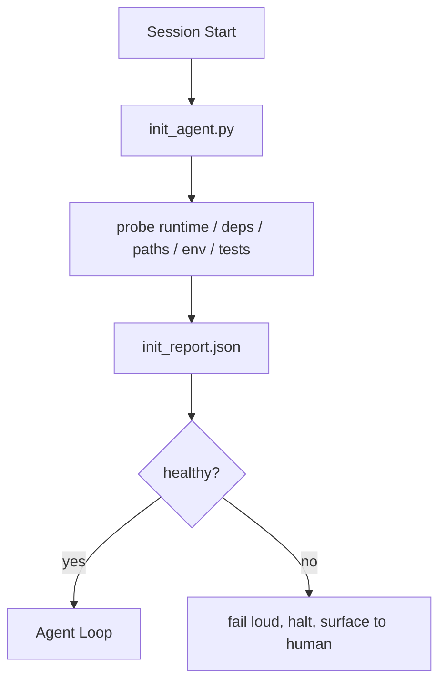

# एजेंटों के लिए आरंभिकरण स्क्रिप्ट

> हर सत्र जो ठंडा शुरू होता है कर का भुगतान करता है एजेंट एक ही फ़ाइलें पढ़ता है, फिर से एक ही जांच की कोशिश करता है, और फिर से एक ही मार्गों की खोज करता है एक init स्क्रिप्ट कर एक बार भुगतान करता है और जवाबों को राज्य में लिखता है।

**Type:** Build
**Languages:** Python (stdlib)
**Prerequisites:** Phase 14 · 32 (Minimal Workbench), Phase 14 · 34 (Repo Memory)
**Time:** ~45 minutes

## सीखने के लक्ष्य

- एक एजेंट को प्रति सत्र कभी भी दोबारा नहीं करना चाहिए।
- निर्धारात्मक init स्क्रिप्ट का निर्माण करें जो रनटाइम, निर्भरता और रेपो स्वास्थ्य का पता लगाता है।
- जांच परिणाम को बरकरार रखें ताकि एजेंट इसे फिर से जांच करने के बजाय पढ़ें।
- जब प्रारंभ विफल हो तो जोर से, जल्दी और एक ही स्थान पर देखने के लिए विफल।

## समस्या

एक सत्र खोलें. एजेंट पायथन संस्करण का अनुमान लगाता है. परीक्षण कमांड का अनुमान लगाता है. प्रवेश बिंदु खोजने के लिए रेपो रूट को पांच बार सूचीबद्ध करता है। एक पैकेज आयात करने की कोशिश करता है जो स्थापित नहीं है। उपयोगकर्ता से पूछता है कि कॉन्फ़िग फ़ाइल कहां रहती है। जब तक यह वास्तविक संपादन करता है, तब तक दस हजार टोकन सेटअप कार्य के लिए गए हैं जो एक ही स्क्रिप्ट होना चाहिए था।

फिक्स एक आरंभिकरण स्क्रिप्ट है जो एजेंट कुछ और करने से पहले चलाता है और एक लिखता है`init_report.json`एजेंट स्टार्टअप पर पढ़ता है।

## अवधारणा



### क्या init स्क्रिप्ट जांच करता है

| Probe | Why it matters |
|-------|----------------|
| Runtime versions | Wrong Python or Node version means silent wrong-version bugs |
| Dependency availability | A missing package later costs ten times the cost of catching it now |
| Test command | The agent must know how to verify; if the command is missing the workbench is broken |
| Repo paths | Hard-coded paths drift; resolve them once and pin |
| Environment variables | Missing `OPENAI_API_KEY` is a failure surface, not a runtime mystery |
| State + board freshness | Stale state from a crashed session is a footgun |
| Last-known-good commit | Anchor for the handoff diff at the end of the session |

### जोर से विफल, तेजी से विफल, एक ही स्थान पर विफल

एक जांच विफलता का मतलब है मानव को रोकना और सतह पर आना। कोई "एजेंट इसे पता लगाएगा।" प्रारंभिक का पूरा बिंदु है जब कार्य डेस्क टूट जाता है शुरू करने से इनकार करना है।

### अशक्त

इसे लगातार दो बार चलाएं. दूसरा रन एक नए समय के टिकट को छोड़कर एक नो-ऑप होना चाहिए. Idempotency आप आईसी, हुक या एक पूर्व-कार्य स्लैश कमांड में स्क्रिप्ट तार करने की अनुमति देता है.

### आरंभिक बनाम स्टार्टअप नियम

नियम (चरण 14 · 33) बताता है कि कार्य करने के लिए क्या सच होना चाहिए। इनित वह स्क्रिप्ट है जो यह स्थापित करती है कि उन नियमों की जांच की जा सकती है। इनित के बिना नियम "चेतावनी" बन जाते हैं। इनित के बिना नियम एक पॉलिश विफलता बन जाते हैं। इनित के बिना नियम एक स्पष्ट विफलता बन जाते हैं। इनित के बिना नियम एक स्पष्ट विफलता बन जाते हैं। इनित के साथ, इनित के साथ, इनित के साथ, इनित के साथ, इनित के साथ, इनित के साथ, इनित के साथ, इनित के साथ, इनित के साथ, इनित के साथ, इनित के साथ, इनित के साथ, इनित के साथ, इनित के साथ, इनित के साथ, इनित के साथ, इनित के साथ, इनित के साथ, इनित के साथ, इनित के साथ, इनित के साथ, इनित के साथ, इनित, इनित, इनित, इनित, इनित, इनित, इनित, इनित, इनित, इनित, इनित, इनित, इनित, इनित, इनित, इनित, इन, इनित, इन, इन, इन, इन, इन, इन, इन, में, इन, इन, इन, इन, में, इन, इन, इन, में, इन, इन, में, इन, में, इन, में, इन, में, इन, में, इन, में, में, इन, में, में, में, में, में, में, में, में, में, में, में, में, में, में, में, में, में, में, में, में, में, में, में, में, में, में, में, में, में, में, में, में, में, में, में, में, में, में, में, में, में, में, में, में, में, में, में, में, में, में, में, में, में, में, में, में, में, में, में, में, में, में, में, में, में, में, में, में, में, में, में, में, में, एक, में, में, में, में, में, में, एक, में, में, में, में, में, एक, में, में, में, एक, में, में, में,

```figure
wb-init-probes
```

## इसे बनाओ

`code/main.py`कार्यकारी `init_agent.py`:

- पांच जांचेंः पायथन संस्करण, सूचीबद्ध निर्भरताएँ `importlib.util.find_spec`, परीक्षण आदेश हल करने की क्षमता, आवश्यक पर्यावरण, राज्य फ़ाइल ताजापन.
- प्रत्येक जांच वापस आता है `(name, status, detail)`. .
- स्क्रिप्ट लिखता है `init_report.json`पूर्ण जांच सेट के साथ और किसी भी ब्लॉक-सख्तता जांच विफलता के मामले में शून्य से बाहर निकलता है।

इसे चलाओः

```
python3 code/main.py
```

स्क्रिप्ट जांच की तालिका प्रिंट करता है, लिखता है `init_report.json`, और सफल पथ पर शून्य से बाहर निकलता है या असफल जांच की सूची के साथ शून्य नहीं है।

## जंगली में उत्पादन के पैटर्न

तीन पैटर्न एक उपयोगी init स्क्रिप्ट को एक समारोह से अलग करते हैं।

**Last-known-good commit anchoring.**वर्तमान प्रतिबद्धता को एक के खिलाफ जांचें `LKG`अंतिम सफल विलय पर लिखी गई फ़ाइल। यदि अंतर एक बजट से अधिक है (पूर्वनिर्धारित 50 फ़ाइलें), शुरू करने से इनकार करें और नए बेसलाइन को प्रमाणित करने के लिए एक मानव की आवश्यकता है। यह वही है जो क्लाउडफ्लेयर की एआई कोड रिव्यू समीक्षा एजेंटों को परिधि करने के लिए उपयोग करती हैः प्रत्येक समीक्षा सत्र एक ही अंतिम ज्ञात-अच्छा के खिलाफ एंकर करता है और कभी भी सत्रों के बीच मिश्रण बहाव नहीं करता है।

**Lock files with TTL.**एक लिखें `prereqs.lock`पहले सफल जांच पास के बाद। बाद के रन N घंटे (24 घंटे डिफ़ॉल्ट रूप से) के लिए लॉक पर भरोसा करते हैं और महंगे जांच को छोड़ देते हैं। init स्क्रिप्ट पहले लॉक पढ़ता है; यदि यह ताजा है और निर्भरता मैनिफेस्ट हैश मेल खाता है, तो यह शॉर्ट-सर्किट करता है। यह उसी पैटर्न है जो डॉकर लेयर कैश के लिए उपयोग करता हैः idempotent जांच + सामग्री हैश = skip।

**No network, no LLM, no surprises in the hot path.**इनिट जांच निर्धारक पाइपलाइन है। एक जांच जो विफलता को वर्गीकृत करने के लिए एलएलएम को बुलाती है या लाइसेंस की जांच के लिए बाहरी सेवा को हिट करती है, वह एक जांच नहीं है; यह एक कार्यप्रवाह है। यदि एक जांच सूखे रन में तीन सेकंड से अधिक समय लेती है, तो इसे वर्कबेंच की गंध के रूप में मानें और इसे या तो init से बाहर ले जाएं या इसका परिणाम कैश करें।

## इसका प्रयोग करें

उत्पादन मेंः

- **Claude Code hooks.** `pre-task`हुक init स्क्रिप्ट कॉल करता है और एजेंट को लॉन्च करने से इनकार करता है अगर यह विफल रहता है।
- **GitHub Actions.**ए `setup-agent`नौकरी init स्क्रिप्ट चलाता है; एजेंट नौकरी इस पर निर्भर करता है।
- **Docker entrypoint.**एजेंट कंटेनर एजेंट रनटाइम निष्पादित करने से पहले init स्क्रिप्ट चलाता है; विफलता पर लॉग सतह।

init स्क्रिप्ट पोर्टेबल है क्योंकि यह किसी विशिष्ट फ्रेमवर्क को कॉल नहीं करता है। बैश, मेक या एक कार्य फ़ाइल इसे सभी को लपेट सकती है।

## इसे भेजें

`outputs/skill-init-script.md`परियोजना का साक्षात्कार करता है, इसके सेटअप कार्य को जांच में वर्गीकृत करता है, और परियोजना-विशिष्ट एक प्रक्षेपण करता है `init_agent.py`और एक आईसी कार्यप्रवाह जो किसी भी एजेंट कदम से पहले इसे चलाता है।

## व्यायाम

1. एक जांच जो वर्तमान प्रतिबद्धता को अंतिम ज्ञात-अच्छे प्रतिबद्धता के खिलाफ भिन्न करता है और यदि 50 से अधिक फ़ाइलें बदलती हैं तो शुरू करने से इनकार करता है।
2. एक लिखने के लिए स्क्रिप्ट तार `prereqs.lock`फाइल और शुरू करने से इनकार अगर ताला सात दिनों से अधिक पुराना है।
3. एक जोड़ें `--fix`ध्वज जो स्वचालित रूप से गायब डेवलपर निर्भरता स्थापित करता है लेकिन बिना अनुमोदन के कभी भी रनटाइम निर्भरता को संशोधित नहीं करता है।
4. हार्ड-कोड फ़ंक्शन से जांच को यम्ल रजिस्ट्री में स्थानांतरित करें।
5. एक जांच जो तीन सेकंड से अधिक समय तक चलती है, वह एक कार्य डेस्क की गंध है।

## प्रमुख शर्तें

| Term | What people say | What it actually means |
|------|----------------|------------------------|
| Probe | "A check" | A deterministic function returning `(name, status, detail)` |
| Init report | "Setup output" | JSON written next to state with the probe results |
| Idempotent | "Safe to re-run" | Two runs in a row produce identical reports modulo timestamp |
| Fail loud | "Don't swallow" | Halt and surface to the human; no silent fallback |
| Setup tax | "Bootstrap cost" | The tokens the agent spends per session rediscovering the obvious |

## आगे पढ़ना

- [Anthropic, Effective harnesses for long-running agents](https://www.anthropic.com/engineering/effective-harnesses-for-long-running-agents)
- [GitHub Actions, composite actions for setup](https://docs.github.com/en/actions/sharing-automations/creating-actions/creating-a-composite-action)
- [microservices.io, GenAI dev platform: guardrails](https://microservices.io/post/architecture/2026/03/09/genai-development-platform-part-1-development-guardrails.html) पूर्व-प्रतिबंध + आरआई जांच
- [Augment Code, How to Build Your AGENTS.md (2026)](https://www.augmentcode.com/guides/how-to-build-agents-md) प्रारंभिक अपेक्षाएं
- [Codex Blog, Codex CLI Context Compaction](https://codex.danielvaughan.com/2026/03/31/codex-cli-context-compaction-architecture/) सत्र संपीड़न-जागरूक init के रूप में शुरू
- चरण 14 · 33  इस स्क्रिप्ट सेट नियम सक्षम बनाता है
- चरण 14 · 34  राज्य फ़ाइल इस स्क्रिप्ट बीज
- चरण 14 · 38  सत्यापन गेट init स्क्रिप्ट फ़ीड
- चरण 14 · 40  यह हस्तांतरण जो init रिपोर्ट के अंतिम ज्ञात-अच्छे को खपत करता है
