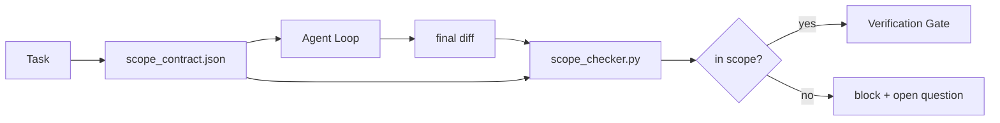

# अनुबंधों की सीमाएं और कार्य सीमाएं

> मॉडल नहीं जानता कि काम कहां समाप्त होता है। एक दायरा अनुबंध एक प्रति कार्य फ़ाइल है जो बताती है कि काम कहां शुरू होता है, यह कहां समाप्त होता है, और यदि यह बहता है तो कैसे वापस रोल करता है। अनुबंध एक इच्छा से "अस्तित्व में रहें" को एक चेक में बदल देता है।

**Type:** Build
**Languages:** Python (stdlib)
**Prerequisites:** Phase 14 · 32 (Minimal Workbench), Phase 14 · 33 (Rules as Constraints)
**Time:** ~50 minutes

## सीखने के लक्ष्य

- एक दायरा अनुबंध लिखें जिसे एजेंट कार्य आरंभ पर और सत्यापितकर्ता कार्य समाप्त होने पर पढ़ता है।
- अनुमति प्राप्त फ़ाइलें, प्रतिबंधित फ़ाइलें, स्वीकृति मानदंड, रिलबैक योजना और अनुमोदन सीमाएं निर्दिष्ट करें।
- अनुबंध के विसंगति की तुलना करने और उल्लंघन को चिह्नित करने के लिए एक दायरा जांचकर्ता लागू करें।
- दृश्यता को सहज, स्वचालित और समीक्षा योग्य बनाएं।

## समस्या

एजेंटों को क्रैप करना है। कार्य "लॉगिन बग को ठीक करना है।" अंतर लॉगिन मार्ग, ईमेल सहायक, डेटाबेस ड्राइवर, README और रिलीज स्क्रिप्ट को छूता है। प्रत्येक स्पर्श के पास एक यथार्थवादी कारण था। साथ में वे उस परिवर्तन से अलग हैं जिसे समीक्षा की गई थी।

स्कोप क्रैप एजेंट के काम में सबसे कम निगरानी वाले विफलता मोड है क्योंकि एजेंट हर कदम को अच्छे विश्वास से बताता है। फिक्स एक सख्त प्रॉम्प्ट नहीं है। फिक्स डिस्क पर एक अनुबंध है जो कहता है कि क्या वादा किया गया था और एक चेक है जो परिणाम की तुलना करता है वादा।

## अवधारणा



### एक दायरा अनुबंध में क्या जाता है

| Field | Purpose |
|-------|---------|
| `task_id` | Links to the task on the board |
| `goal` | One sentence the reviewer can verify |
| `allowed_files` | Globs the agent may write |
| `forbidden_files` | Globs the agent must not touch even by accident |
| `acceptance_criteria` | Test commands or assertion lines that prove done |
| `rollback_plan` | One paragraph the operator can execute if a halt is required |
| `approvals_required` | Actions outside scope that need explicit human sign-off |

बिना अनुबंध के`forbidden_files`नकारात्मक स्थान अनुबंध का आधा है।

### ग्लोब, कच्चे मार्ग नहीं

वास्तविक रिपो फ़ाइलों को स्थानांतरित करें।`app/**/*.py`,`tests/test_signup*.py`) इसलिए सत्रों के बीच एक रिफैक्टर अनुबंध को अमान्य नहीं करता है।

### रोलबैक दायरे का हिस्सा है

अनुबंध को वापस लेने का तरीका लिखना अनुबंध के लेखक को यह सोचने के लिए मजबूर करता है कि क्या गलत हो सकता है। एक अनुबंध जिसे आप वापस नहीं ले सकते, वह एक अनुबंध है जिसे मंजूरी नहीं दी जानी चाहिए।

### दायरा जांच एक अंतर जांच है

एजेंट एक अंतर लिखता है। चेकर अंतर, अनुमत गोल, प्रतिबंधित गोल, और किसी भी स्वीकृति कमांड की सूची पढ़ता है जो चलाया गया। प्रत्येक उल्लंघन एक टैग है जो सत्यापन गेट से इनकार कर सकता है।

### दो दायरा की ऊंचाईः विशेषता सूची और कार्य अनुबंध

स्कोप कॉन्ट्रैक्ट एक कार्य को सीमित करता है। यह परियोजना को बाध्य नहीं करता है। एक एजेंट लॉगिन फिक्स के लिए एक अनुबंध के अंदर पूरी तरह से रह सकता है और फिर भी, अगले मोड़ पर, यह तय करता है कि परियोजना को सेटिंग्स पृष्ठ, डार्क मोड टॉगल और राउटर का पुनर्लेखन की आवश्यकता है। अनुबंध से कभी नहीं पूछा गया था कि परियोजना के लिए किस काम का दायरा था, केवल कौन सी फ़ाइलें कार्य के दायरे में थीं।

उस दूसरी ऊंचाई को अपनी आदिमता की आवश्यकता होती हैः`feature_list.json`एजेंट सत्र की शुरुआत में पढ़ता है। यह एक मशीन-पठनीय, आदेश फ़ाइल के रूप में परियोजना बैकलॉग है। एजेंट एक सुविधा का चयन करता है जिसका `status`है `todo`, लिखता है अपने `id`"एक बार में एक सुविधा" एक संकेत में एक पंक्ति होने से रोकता है एजेंट अतीत को तर्कसंगत बना सकता है और एक मूल्य बन जाता है यह डिस्क से पढ़ता है और एक चेक गेट लागू करता है।

```json
{
  "project": "knowledge-base",
  "active": "import-pdf",
  "features": [
    { "id": "import-pdf",   "status": "in_progress", "goal": "import a PDF into the library",        "done_when": "pytest tests/test_import.py && a sample PDF appears in the library view" },
    { "id": "full-text-search", "status": "todo",     "goal": "search document text and rank hits",   "done_when": "query returns ranked results with snippets" },
    { "id": "cite-answers", "status": "todo",         "goal": "answers carry source citations",        "done_when": "every answer renders at least one clickable citation" }
  ]
}
```

| Field | Purpose |
|-------|---------|
| `active` | The single feature the current session may touch; empty means pick one and set it |
| `features[].id` | Stable slug the scope contract's `task_id` points at |
| `features[].status` | `todo`, `in_progress`, `done`, `blocked`; only one `in_progress` at a time |
| `features[].goal` | One sentence the reviewer can verify |
| `features[].done_when` | The acceptance line that flips `in_progress` to `done` |

दो नियम सूची सजावटी के बजाय भार सहन करते हैं। पहला, अपरिवर्तनीय "अधिकतम एक पर `in_progress`" स्वयं एक स्टार्टअप चेक (चरण 14 · 33) हैः यदि सूची दो दिखाता है, तो सत्र तब तक शुरू करने से इनकार करता है जब तक कि कोई व्यक्ति इसे हल नहीं करता है। दूसरा, सुविधा सूची एक फ़ाइल है, न कि एक चैट संदेश, क्योंकि चैट संदर्भ से बाहर स्क्रॉल करता है और फ़ाइल सत्रों और एजेंटों के बीच बनी रहती है। हस्तान्तरण (चरण 14 · 40) समाप्त सुविधा की स्थिति को वापस लिखता है।`done`तो अगले सत्र में एक सटीक बोर्ड के लिए खोला जाता है बजाय फिर से क्या बचा है के लिए व्युत्पन्न.

अनुबंध और सूची में न्यूनतम विशेषाधिकार से मिलकर, नीचे वर्णित एक ही विलयः कार्य अनुबंध `allowed_files`सक्रिय तत्व जो भी छूता है उसके अंदर बैठना चाहिए, कभी भी उसके बाहर नहीं।

```figure
wb-scope-bounce
```

## इसे बनाओ

`code/main.py`कार्य करता हैः

- `scope_contract.json`स्कीमा (JSON स्कीमा का उपसमूह, ग्लोब सरणी) ।
- एक अंतर पार्सर जो स्पर्श फ़ाइलों की एक सूची और रन कमांड की एक सूची में बदल जाता है `RunSummary`. .
- ए `scope_check`जो लौटाता है `(violations, in_scope, off_scope)`अनुबंध के खिलाफ।
- दो डेमो रन: एक जो दायरे में रहता है, एक जो घबराता है. चेकर सटीक फ़ाइल और कारण के साथ घबराता है.

इसे चलाओः

```
python3 code/main.py
```

आउटपुटः अनुबंध, दो रन, प्रति रन के फैसले, और एक बचा `scope_report.json`. .

## जंगली में उत्पादन के पैटर्न

एक चिकित्सक जो "स्पेक्समैक्सिंग" (एजेंट को कॉल करने से पहले YAML में स्कोप कॉन्ट्रैक्ट्स) चला रहा है, वह रिपोर्ट करता है कि एजेंट को बदलने के बिना तीन सप्ताह में खरगोश छेद दर 52% से 21% तक गिर गई। अनुबंध ने काम किया, मॉडल नहीं। तीन पैटर्न लाभ को चिपका देते हैं।

**Violation budgets, not binary failures.** `agent-guardrails`(क्लाउड कोड, कर्सर, विंडसर्फ, कोडेक्स द्वारा MCP के माध्यम से उपयोग किए जाने वाले ओएसएस विलय गेट)`violationBudget`प्रति कार्य: बजट के भीतर छोटे दायरे की स्लाइस चेतावनी के रूप में दिखाई देती हैं; केवल जब बजट की सीमा पार की जाती है तो विलय गेट अस्वीकार करता है।`violationSeverity: "error" | "warning"`बजट एक गेट के बीच अंतर है जो जहाज और एक गेट है जो टीम द्वारा अक्षम हो जाता है जो इसे नफरत है।

**Severity asymmetry by path family.**आउटस्कोप लिखता है `docs/**`आमतौर पर `warn`; आउट-स्कोप लिखता है `scripts/**`,`migrations/**`,`config/prod/**`हमेशा हैं`block`. यह असममितता कार्यकाल में नहीं, अनुबंध में जीनी चाहिए, क्योंकि यह परियोजना-विशिष्ट है और प्रति कार्य में परिवर्तन होता है।

**Time and network budgets next to file budgets.**ए `time_budget_minutes`क्षेत्र दीवार घड़ी को सीमाओं; रनटाइम इसे बिना फिर से अनुमोदन के आगे बढ़ने से इनकार करता है।`network_egress`होस्टनाम पर allowlist एजेंट को चुपचाप एक बाहरी एपीआई को हिट करने से रोकता है जो कार्य का हिस्सा नहीं था। ये दायरा आयाम भी हैं; फ़ाइल ग्लोब आवश्यक हैं, पर्याप्त नहीं हैं।

**Multi-contract merge semantics (least privilege).**जब दो दायरा अनुबंध लागू होते हैं (उदाहरण के लिए, एक परियोजना-व्यापी अनुबंध और एक कार्य-विशिष्ट अनुबंध), विलय हैः **intersect** `allowed_files`(दोनों अनुबंधों को मार्ग की अनुमति देनी चाहिए),**union** `forbidden_files`(या तो प्रतिबंधित कर सकते हैं), `time_budget_minutes`सबसे अधिक प्रतिबंधात्मक (मिनट), `approvals_required`जमा होता है।`network_egress`है `None`किसी भी प्रवर्तन के लिए नहीं, `[]`और (सबको) झुठलाए`[...]`एक अनुमतिकर्ता के रूप में; विलय के अधीन, `None`अनुबंध योजना में यह बताएं ताकि विलय यांत्रिक और समीक्षा योग्य हो।

## इसका प्रयोग करें

उत्पादन के पैटर्नः

- **Claude Code slash commands.**ए `/scope`आदेश अनुबंध लिखता है और सत्र संदर्भ के रूप में इसे pin करता है।
- **GitHub PRs.**पीआर निकाय में एक JSON फ़ाइल के रूप में या एक चेक-इन कलाकृतियों के रूप में अनुबंध को धक्का दें. CI विलय अंतर के खिलाफ दायरा परीक्षक चलाता है।
- **LangGraph interrupts.**दायरा उल्लंघन एक विराम को ट्रिगर करता है; प्रबन्धक मानव से पूछता है कि क्या अनुबंध को बढ़ने की आवश्यकता है या एजेंट को पीछे हटने की आवश्यकता है।

अनुबंध कार्य के साथ चलता है। कार्य समाप्त होने पर अनुबंध को संग्रहण में रखा जाता है।`outputs/scope/closed/`. .

## इसे भेजें

`outputs/skill-scope-contract.md`कार्य विवरण के लिए एक दायरा अनुबंध और एक वैश्विक जागरूक परीक्षक उत्पन्न करता है जो प्रत्येक एजेंट अंतर पर आईसी में चलता है।

## व्यायाम

1. एक जोड़ें `network_egress`बाहरी मेजबानों को अनुमति दी गई फ़ील्ड सूची। अन्य मेजबानों को छूने वाले रन को अस्वीकार करें।
2. चेकर को नरम करने के लिए बढ़ाएँ `docs/**`और कठिन पर `scripts/**`असममितता को सही ठहराना।
3. अनुबंध को व्युत्पन्न करें `allowed_files`एक से `goal`एक स्थैतिक नियम सेट का उपयोग कर क्षेत्र (एलएलएम नहीं) । पहले किनारे मामले पर क्या गलत होता है?
4. एक जोड़ें `time_budget_minutes`और दीवार घड़ी से अधिक होने के बाद जारी रखने से इनकार करते हैं।
5. एक ही अंतर के खिलाफ दो अनुबंध चलाएं. दोनों लागू होने पर सही विलय अर्थशास्त्र क्या है?

## प्रमुख शर्तें

| Term | What people say | What it actually means |
|------|----------------|------------------------|
| Scope contract | "The task brief" | Per-task JSON listing allowed/forbidden files, acceptance, rollback |
| Scope creep | "It also touched..." | Files outside the contract changed in the same task |
| Rollback plan | "We can revert" | The one-paragraph operator runbook for halting |
| Approval boundary | "Needs sign-off" | An action listed in the contract as requiring explicit human approval |
| Diff check | "Path audit" | Comparing touched files against the contract globs |

## आगे पढ़ना

- [LangGraph human-in-the-loop interrupts](https://langchain-ai.github.io/langgraph/concepts/human_in_the_loop/)
- [OpenAI Agents SDK tool approval policies](https://platform.openai.com/docs/guides/agents-sdk)
- [logi-cmd/agent-guardrails — merge gates and scope validation](https://github.com/logi-cmd/agent-guardrails) उल्लंघन के बजट, गंभीरता स्तर
- [Dev|Journal, Preventing AI Agent Configuration Drift with Agent Contract Testing](https://earezki.com/ai-news/2026-05-05-i-built-a-tiny-ci-tool-to-keep-ai-agent-configs-from-drifting-in-my-repo/) `--strict`बाहरी डिपॉज़ के बिना मोड
- [Agentic Coding Is Not a Trap (production logs)](https://dev.to/jtorchia/agentic-coding-is-not-a-trap-i-answered-the-viral-hn-post-with-my-own-production-logs-33d9) स्पेक्समैक्सिंग रसीदें: 52% → 21%
- [OpenCode permission globs](https://opencode.ai/docs/agents/) प्रति अनुमतियों के लिए बारीक अनाज की सीमा
- [Knostic, AI Coding Agent Security: Threat Models and Protection Strategies](https://www.knostic.ai/blog/ai-coding-agent-security) न्यूनतम विशेषाधिकार के अंतर्गत दायरा
- [Augment Code, AI Spec Template](https://www.augmentcode.com/guides/ai-spec-template) तीन स्तरीय सीमा प्रणाली (जरूरी/पूछना/कभी नहीं)
- चरण 14 · 27  शीघ्र इंजेक्शन रक्षा जो कि स्कोप लॉक से जोड़ी जाती है
- चरण 14 · 33  इस अनुबंध में निर्धारित नियम प्रति कार्य को विशेष रूप से
- चरण 14 · 38  सत्यापन गेट चेकर रिपोर्ट में
