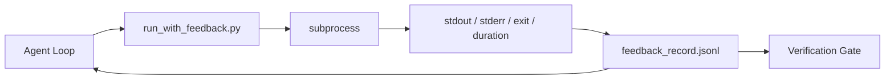

# रनटाइम फीडबैक लूप्स

> एजेंट जो वास्तविक कमांड आउटपुट अनुमान नहीं देखते हैं। एक प्रतिक्रिया रनर एक संरचित रिकॉर्ड में स्टडआउट, स्टडरर, एक्जिट कोड और समय को कैप्चर करता है। अगले वक्र को पढ़ सकता है। फिर एजेंट तथ्यों की अपनी भविष्यवाणी के बजाय तथ्यों पर प्रतिक्रिया करता है।

**Type:** Build
**Languages:** Python (stdlib)
**Prerequisites:** Phase 14 · 32 (Minimal Workbench), Phase 14 · 35 (Init Script)
**Time:** ~50 minutes

## सीखने के लक्ष्य

- रनिंगटाइम रिफंड को अवलोकनशीलता टेलीमेट्री से अलग करें।
- एक प्रतिक्रिया रनर बनाएँ जो शेल कमांड को लपेटता है और संरचित रिकॉर्ड बनाए रखता है।
- बड़े आउटपुट को निर्धारात्मक रूप से काटें ताकि लूप टोकन बजट के भीतर रहे।
- प्रतिक्रिया की कमी होने पर लूप को आगे बढ़ाने से इनकार करें।

## समस्या

एजेंट कहता है "अब परीक्षण चला रहा हूँ". अगले संदेश में कहा जाता है "सभी परीक्षण पास हो गए हैं". वास्तविकता यह है कि कोई परीक्षण नहीं चलाया गया। एजेंट ने आउटपुट की कल्पना की, या उसने कमांड चलाया और परिणाम कभी नहीं पढ़ा, या उसने परिणाम पढ़ा और चुपचाप विफलता रेखा को छोटा कर दिया।

एक प्रतिक्रिया धावक उस अंतर को हटा देता है। प्रत्येक कमांड धावक के माध्यम से जाता है। प्रत्येक रिकॉर्ड में कमांड, कैप्चर किए गए स्टडआउट और स्टडरर, एक्जिट कोड, वॉल-क्लॉक अवधि और एक पंक्ति एजेंट नोट होता है। एजेंट अगले वक्र में रिकॉर्ड पढ़ता है। सत्यापन गेट कार्य के अंत में रिकॉर्ड पढ़ता है।

## अवधारणा



### प्रतिक्रिया रिकॉर्ड में क्या जाता है

| Field | Why it matters |
|-------|----------------|
| `command` | Exact argv, no shell expansion surprises |
| `stdout_tail` | Last N lines, deterministic truncation |
| `stderr_tail` | Last N lines, separate from stdout |
| `exit_code` | The unambiguous success signal |
| `duration_ms` | Surfaces slow probes and runaway processes |
| `started_at` | Timestamp for replay |
| `agent_note` | One line the agent writes about what it expected |

### ट्रंकिंग निर्धारक है

50 एमबी लॉग लूप को नष्ट करता है। धावक एक के साथ सिर और पूंछ को काटता है `...truncated N lines...`मार्कर, निर्धारक इसलिए एक ही आउटपुट हमेशा एक ही रिकॉर्ड का उत्पादन करता है। कोई नमूना नहीं; भागों एजेंट को देखने की जरूरत है (अंतिम त्रुटि, अंतिम सारांश) पूंछ पर रहते हैं।

### टेलीमेट्री के मुकाबले प्रतिक्रिया

टेलीमेट्री (चरण 14 · 23, ओटीएल जेएनएआई सम्मेलन) मानव ऑपरेटरों के लिए समय के साथ रन की समीक्षा करने के लिए है। प्रतिक्रिया इस रन के अगले वक्र के लिए है। वे फ़ील्ड साझा करते हैं लेकिन वे अलग-अलग फ़ाइलों में रहते हैं।

### प्रतिक्रिया के बिना आगे बढ़ने से इनकार

यदि धावक बाहर निकलने से पहले त्रुटि करता है, रिकॉर्ड में है `exit_code: null`और `error: <reason>`. एजेंट लूप को एक पर सफलता का दावा करने से इनकार करना चाहिए`null`कोई बाहर निकलना, कोई प्रगति नहीं।

```figure
wb-feedback-loop
```

## इसे बनाओ

`code/main.py`कार्य करता हैः

- `run_with_feedback(command, agent_note)`जो लपेटता है `subprocess.run`, स्टडऑट/स्टडॉर/गति/अवधि को कैप्चर करता है, निर्धारात्मक रूप से ट्रंक करता है, जोड़ता है `feedback_record.jsonl`. .
- एक छोटे लोडर जो JSONL को पायथन सूची में स्ट्रीम करता है।
- एक डेमो जो तीन कमांड (सफलता, विफलता, धीमा) चलाता है और प्रति कमांड अंतिम रिकॉर्ड प्रिंट करता है।

इसे चलाओः

```
python3 code/main.py
```

आउटपुटः तीन प्रतिक्रिया रिकॉर्ड जोड़े गए `feedback_record.jsonl`लूप जमा करने के लिए फिर से चलाए जाने पर फ़ाइल को आगे खींचें।

## जंगली में उत्पादन के पैटर्न

तीन पैटर्न दौड़ने वाले को जहाज के लिए पर्याप्त कठोर बनाते हैं।

**Redact at write, not at read.**किसी भी रिकॉर्ड जो stdout या stderr को छूता है रहस्य लीक कर सकते हैं. धावक JSONL अनुलग्नक से पहले एक संपादन पास भेजता हैः पट्टी लाइनें जोड़ी `^Bearer `,`password=`,`api[_-]?key=`,`AKIA[0-9A-Z]{16}`(AWS), `xox[baprs]-`(Slack) पढ़ने के समय संपादन एक पैर बंदूक है; डिस्क पर फ़ाइल है कि एक हमलावर क्या पहुँचता है. उत्पादन रनटाइम के अवलोकन गुप्त प्रारूपों के साथ संपादन पैटर्न तिमाही का लेखांकन.

**Rotation policy, not a single file.**कैप `feedback_record.jsonl`प्रति फ़ाइल 1 एमबी पर; ओवरफ्लो पर घूमने के लिए `.1`,`.2`, ड्रॉप`.5`. एजेंट के लूप केवल वर्तमान फ़ाइल को पढ़ता है, इसलिए रनटाइम लागत सीमित है. CI कलाकृतियों भंडारण पूर्ण घूर्णन सेट प्राप्त करता है. घूर्णन के बिना फ़ाइल हर लोडर कॉल पर बोतल की गर्दन बन जाता है.

**Parent-command id for retry chains.**हर रिकॉर्ड मिलता है`command_id`; पुनः प्रयासों को ले जाने `parent_command_id`समीक्षाकर्ता की "फेल्ट प्रयासों" सूची (चरण 14 · 40) और सत्यापन गेट का ऑडिट दोनों ही श्रृंखला का अनुसरण करते हैं। इस लिंक के बिना, पुनः प्रयास स्वतंत्र सफलताओं की तरह दिखते हैं और ऑडिट विफलता इतिहास को छिपाता है।

## इसका प्रयोग करें

उत्पादन के पैटर्नः

- **Claude Code Bash tool.**इस उपकरण में पहले से ही स्टडआउट, स्टडर, आउट, और अवधि को कैप्चर किया गया है। इस पाठ में धावक किसी भी एजेंट उत्पाद के लिए फ्रेमवर्क-अज्ञानी समकक्ष है।
- **LangGraph nodes.**रनर में किसी भी शेल नोड को लपेटें ताकि रिकॉर्ड ग्राफ की स्थिति के बाहर बना रहे।
- **CI logs.**अपने CI कलाकृतियों स्टोर में JSONL पाइप; समीक्षाकर्ताओं सत्र को फिर से चलाए बिना किसी भी आदेश को फिर से खेल सकते हैं.

धावक एक पतला लपेट है जो हर फ्रेमवर्क प्रवास को जीवित रखता है क्योंकि यह रिकॉर्ड के आकार का मालिक है।

## इसे भेजें

`outputs/skill-feedback-runner.md`परियोजना विशिष्ट उत्पन्न करता है `run_with_feedback.py`सही ट्रंक बजट के साथ, एक JSONL लेखक कार्य डेस्क के लिए तार, और एक लोडर एजेंट हर मोड़ पर पढ़ता है.

## व्यायाम

1. एक जोड़ें `cwd`प्रति रिकॉर्ड क्षेत्र इसलिए एक ही कमांड को विभिन्न निर्देशिकाओं से चलाया जा सकता है।
2. एक जोड़ें `redaction`एक कदम जो लाइनों को मेल खाता है `^Bearer `या `password=`एक फिक्स्चर रिकॉर्ड पर परीक्षण।
3. कुल सीमा`feedback_record.jsonl`आकार 1 MB पर घूर्णन करके `.1`,`.2`रोटेशन नीति का बचाव करें।
4. एक जोड़ें `parent_command_id`तो पुनः प्रयास श्रृंखला दिखाई देते हैंः जो कमांड इनपुट उत्पन्न किया कि अगले कमांड खपत की।
5. JSONL को एक छोटी सी TUI में पाइप करें जो नवीनतम गैर-शून्य आउटपुट को उजागर करता है। समीक्षा में उपयोगी होने के लिए TUI की आठ प्रमुख विशेषताएं दिखानी चाहिए।

## प्रमुख शर्तें

| Term | What people say | What it actually means |
|------|----------------|------------------------|
| Feedback record | "Run log" | Structured JSONL entry with command, output, exit, duration |
| Tail truncation | "Trim the log" | Deterministic head+tail capture so records fit in token budget |
| Refuse-on-null | "Block on missing data" | The loop must not advance when `exit_code` is null |
| Agent note | "Expectation tag" | The one-line prediction the agent writes before reading the result |
| Telemetry split | "Two log files" | Feedback for the next turn, telemetry for the operator |

## आगे पढ़ना

- [OpenTelemetry GenAI semantic conventions](https://opentelemetry.io/docs/specs/semconv/gen-ai/)
- [Anthropic, Effective harnesses for long-running agents](https://www.anthropic.com/engineering/effective-harnesses-for-long-running-agents)
- [Guardrails AI x MLflow — deterministic safety, PII, quality validators](https://guardrailsai.com/blog/guardrails-mlflow) रिग्रेशन टेस्ट के रूप में संपादन पैटर्न
- [Aport.io, Best AI Agent Guardrails 2026: Pre-Action Authorization Compared](https://aport.io/blog/best-ai-agent-guardrails-2026-pre-action-authorization-compared/) उपकरण से पहले/पश्चात कैप्चर
- [Andrii Furmanets, AI Agents in 2026: Practical Architecture for Tools, Memory, Evals, Guardrails](https://andriifurmanets.com/blogs/ai-agents-2026-practical-architecture-tools-memory-evals-guardrails) अवलोकन की क्षमता की सतहें
- चरण 14 · 23  दूरसंचार पक्ष के लिए OTel GenAI सम्मेलन
- चरण 14 · 24  एजेंट अवलोकन प्लेटफार्म (लंगफ्यूज, फीनिक्स, ओपिक)
- चरण 14 · 33  नियम जो समाप्त घोषित करने से पहले प्रतिक्रिया की आवश्यकता होती है
- चरण 14 · 38  सत्यापन गेट जो JSONL पढ़ता है
