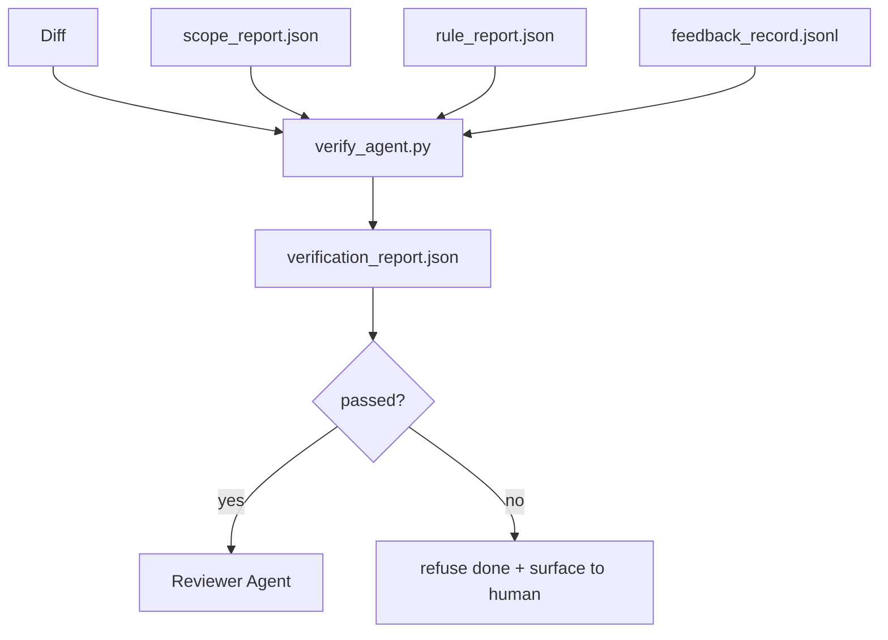

# सत्यापन द्वार

> एजेंट को अपने स्वयं के काम को पूरा होने के रूप में चिह्नित नहीं करना पड़ता है। एक सत्यापन गेट दायरा अनुबंध, प्रतिक्रिया लॉग, नियम रिपोर्ट और अंतर को पढ़ता है, और एक ही प्रश्न का उत्तर देता हैः क्या यह कार्य वास्तव में पूरा हो गया है? यदि गेट कहता है कि नहीं, तो कार्य पूरा नहीं हुआ है, चाहे चैट क्या कहती है।

**Type:** Build
**Languages:** Python (stdlib)
**Prerequisites:** Phase 14 · 33 (Rules), Phase 14 · 36 (Scope), Phase 14 · 37 (Feedback)
**Time:** ~55 minutes

## सीखने के लक्ष्य

- कार्यक्षेत्र कलाकृतियों पर एक निर्धारक फ़ंक्शन के रूप में सत्यापन गेट को परिभाषित करें।
- नियम रिपोर्ट, दायरा रिपोर्ट, प्रतिक्रिया रिकॉर्ड और अंतर को एक एकल निर्णय में जोड़ें।
- एक `verification_report.json`समीक्षा एजेंट और सूचनाकार दोनों पढ़ सकते हैं।
- बिना अपवाद के किसी भी ब्लॉक-सख्तता विफलता पर कार्य को आगे बढ़ाने से इनकार करें।

## समस्या

एजेंट सफलता को बहुत आसानी से घोषित करते हैं। तीन असफलता रूपों का वर्चस्व हैः

- "अच्छी लगती है". मॉडल ने अपना अंतर पढ़ा और तय किया कि यह सही है।
- "परीक्षण पास हो गया". उन्होंने आत्मविश्वास के साथ कहा. परीक्षण के वास्तव में चल रहे कोई रिकॉर्ड नहीं है.
- "स्वीकार की गई।" स्वीकृति मानदंडों को "कुछ भी किया गया जैसा दिखता है" के लिए काफी ढीला व्याख्या की गई।

वर्कबेंच फिक्स एक एकल सत्यापन गेट है जो एजेंट द्वारा पहले से ही निर्मित कलाकृतियों को पढ़ता है और कॉल करता है। गेट निर्धारक है। गेट संस्करण नियंत्रण में है। गेट को आईसी में वायर्ड किया गया है। एजेंट इसे रिश्वत नहीं दे सकता है।

## अवधारणा



### गेट क्या जांचता है

| Check | Source artifact | Severity |
|-------|-----------------|----------|
| All acceptance commands ran | `feedback_record.jsonl` | block |
| All acceptance commands exited zero | `feedback_record.jsonl` | block |
| Scope check has no forbidden writes | `scope_report.json` | block |
| Scope check has no off-scope writes | `scope_report.json` | block or warn |
| All block-severity rules pass | `rule_report.json` | block |
| No `null` exit codes in feedback | `feedback_record.jsonl` | block |
| Touched files match `scope.allowed_files` | both | warn |

ए `warn`निष्कर्ष निर्णय को नोट करता है; एक `block`खोज रोकता है `passed: true`. .

### निर्धारक, न कि संभावनावादी

गेट को हर बार एक ही आर्टिफैक्ट सेट के लिए एक ही फैसला देना चाहिए। कोई एलएलएम न्यायाधीश नहीं। एलएलएम न्यायाधीश समीक्षाकर्ता पक्ष (चरण 14 · 39) में शामिल हैं जहां लक्ष्य गुणवत्तापूर्ण मूल्यांकन है, स्थिति नहीं।

### एक रिपोर्ट, एक पथ

गेट एक उत्सर्जन करता है `verification_report.json`प्रति कार्य समापन, के तहत लिखा गया `outputs/verification/<task_id>.json`कई द्वारों के साथ अलग-अलग मार्ग सत्य के स्रोत के लिए फोर्क।

### बिना अपवाद के मना कर देना

ब्लॉक-गंभीरता के निष्कर्षों को एजेंट द्वारा अमान्य नहीं किया जा सकता है।`override_reason`और एक `overridden_by`उपयोगकर्ता आईडी. ओवरराइड एक हस्ताक्षरित परिवर्तन है, एजेंट के निर्णय नहीं है.

```figure
wb-gate-sequence
```

## इसे बनाओ

`code/main.py`कार्य करता हैः

- प्रत्येक इनपुट कलाकृतियों के लिए एक लोडर, सभी स्थानीय रूप से स्टब किया गया है ताकि पाठ आत्म-निहित हो।
- ए `verify(task_id, artifacts) -> VerdictReport`शुद्ध कार्य।
- एक प्रिंटर जो प्रति चेक परिणाम और अंतिम पास/फेल दिखाता है।
- तीन कार्य परिदृश्यों के साथ एक डेमोः साफ पास, दायरा क्रिक, अनुपलब्ध स्वीकृति।

इसे चलाओः

```
python3 code/main.py
```

आउटपुटः तीन फैसले की रिपोर्टें, प्रत्येक स्क्रिप्ट के बगल में सहेजी गई।

## जंगली में उत्पादन के पैटर्न

चार पैटर्न "एक और लंड काम" से "निर्णायक किनारे" तक द्वार को ऊपर उठाते हैं।

**Defense-in-depth, not single gate.**प्री-कमिट हुक → आईसी स्टेटस चेक → प्री-टूल ऑथ्ज़ हुक → प्री-मेर्ज गेट। प्रत्येक परत निर्धारक है इसलिए एक परत में विफलता अगले द्वारा पकड़ी जाती है। माइक्रोसर्विसेज.आईओ की मार्च 2026 प्लेबुक स्पष्ट हैः प्री-कमिट हुक को पार नहीं किया जा सकता है क्योंकि, मॉडल-साइड कौशल के विपरीत, यह निर्देशों के बाद एजेंट पर निर्भर नहीं करता है। सत्यापन गेट आईसी / प्री-मेर्ज परत पर बैठता है।

**Defense by deterministic check, model-judge only for nuance.**मानव विज्ञान के 2026 हाइब्रिड मानक जोड़ेः सत्यापित पुरस्कार (इकाई परीक्षण, स्कीम जांच, निकास कोड) जवाब "क्या कोड समस्या को हल करता है?"  एलएलएम rubrics जवाब "क्या कोड पठनीय, सुरक्षित, शैली पर है?" गेट पहले वर्ग चलाता है; समीक्षक (चरण 14 · 39) दूसरा चलाता है। उन्हें मिलाकर संकेत को ढह जाता है।

**Signed override log, not Slack threads.**प्रत्येक ओवरराइड एक पंक्ति में उत्सर्जित करता है `outputs/verification/overrides.jsonl`के साथः समय टिकट, कोड खोज, कारण, हस्ताक्षर उपयोगकर्ता, वर्तमान HEAD प्रतिबद्धता। रनटाइम किसी भी ओवरराइड से इनकार करता है जिसमें हस्ताक्षर की कमी है; ऑडिट ट्रैक गिट-ट्रैक है। यह ओवरराइड नीति और ओवरराइड थिएटर के बीच की रेखा है।

**Coverage floor as a first-class check.**ए `coverage_report.json`एक `coverage_floor`(डिफ़ॉल्ट 80%) जांच। यदि मापा गया कवरेज तल से नीचे या पिछले विलय की तल से नीचे 1 प्रतिशत से अधिक गिर जाता है तो गेट विफल हो जाता है। इस जांच के बिना, एजेंट चुपचाप विफल परीक्षणों को हटा देते हैं और सत्यापन रिपोर्ट हरे रंग में रहती हैं।

**`--strict` mode promotes warns to blocks.**रिहाई शाखाओं, जहाज-ब্লকिंग पीआर, या घटना के बाद का triage के लिए, `--strict`हर चेतावनी एक कठिन विफलता बनाता है। ध्वज शाखा द्वारा ऑप्ट-इन है; वैश्विक डिफ़ॉल्ट नहीं है, क्योंकि सख्त-सब कुछ दिन-प्रतिदिन प्रवाह को जंग देता है।

## इसका प्रयोग करें

उत्पादन के पैटर्नः

- **CI step.**ए `verify_agent`नौकरी एजेंट के अंतिम कलाकृतियों के खिलाफ गेट चलाता है. विलय संरक्षण बिना इनकार करता है`passed: true`. .
- **Pre-handoff hook.**एजेंट रनटाइम गेट को कॉल करता है, इससे पहले कि वह प्रमोशन डॉक उत्पन्न करता है. कोई हरी सजा नहीं, कोई प्रमोशन नहीं।
- **Manual triage.**ऑपरेटर रिपोर्ट को तब पढ़ते हैं जब एक एजेंट सफलता का दावा करता है और एक इंसान को इसका संदेह होता है।

गेट कार्य डेस्क प्रवाह में निर्णायक किनारा है. अन्य सभी सतहें इसके ऊपर हैं।

## इसे भेजें

`outputs/skill-verification-gate.md`एक विशिष्ट परियोजना में गेट को तारों से जोड़ता हैः कौन से स्वीकृति कमांड इसे खिलाते हैं, कौन से नियम ब्लॉक-गंभीरता हैं, कौन से ऑफ-स्कोप लिखते हैं, कैसे ओवरराइड ऑडिट लॉग संग्रहीत किया जाता है।

## व्यायाम

1. एक जोड़ें `coverage_floor`जांचः परीक्षण कमांड को कम से कम 80% के साथ एक कवरेज रिपोर्ट तैयार करनी चाहिए। यह तय करें कि मंजिल पर कौन सा कलाकृतियां हैं।
2. एक को समर्थन`--strict`एक ऐसी विधि जो हर `warn``block`. ऐसे मामलों का दस्तावेजीकरण करें जहां सख्त मोड सही डिफ़ॉल्ट है।
3. गेट को JSON के अतिरिक्त एक मार्कडाउन सारांश उत्पन्न करने के लिए कहें। सारांश में कौन से फ़ील्ड शामिल हैं, इसका बचाव करें।
4. एक जोड़ें `time_since_last_human_touch`जांचः किसी भी फ़ाइल को मानव कीट दबाए जाने के 60 सेकंड के भीतर संपादित किया गया है, जो आउट-स्कोप ध्वज से मुक्त है।
5. अपने उत्पाद से अलग एक वास्तविक एजेंट पर गेट चलाएं. कितने निष्कर्ष वास्तविक हैं और कितने शोर हैं? गेट को कहाँ बढ़ने की आवश्यकता है?

## प्रमुख शर्तें

| Term | What people say | What it actually means |
|------|----------------|------------------------|
| Verification gate | "The check that stops things" | Deterministic function over workbench artifacts producing a pass/fail verdict |
| Block severity | "Hard fail" | A finding that prevents `passed: true` and requires a signed override |
| Override log | "Why we let it through" | Signed entries with reason and user id, audited by review |
| Acceptance command | "The proof" | A shell command whose zero exit is what `done` means |
| One report path | "Source of truth" | `outputs/verification/<task_id>.json`, consumed by CI and humans alike |

## आगे पढ़ना

- [Anthropic, Harness design for long-running application development](https://www.anthropic.com/engineering/harness-design-long-running-apps)
- [OpenAI Agents SDK guardrails](https://openai.github.io/openai-agents-python/guardrails/)
- [microservices.io, GenAI dev platform: guardrails](https://microservices.io/post/architecture/2026/03/09/genai-development-platform-part-1-development-guardrails.html) पूर्व-प्रतिबंध और आईसी के बीच गहन रक्षा
- [ICMD, The 2026 Playbook for Agentic AI Ops](https://icmd.app/article/the-2026-playbook-for-agentic-ai-ops-guardrails-costs-and-reliability-at-scale-1776661990431) अनुमोदन गेट सीढ़ी (ड्राफ्ट → अनुमोदन → सीमाओं के नीचे ऑटो)
- [Type-Checked Compliance: Deterministic Guardrails (arXiv 2604.01483)](https://arxiv.org/pdf/2604.01483) निर्धारक गेटिंग की ऊपरी सीमा के रूप में लीन 4
- [logi-cmd/agent-guardrails — merge gate spec](https://github.com/logi-cmd/agent-guardrails) दायरा + उत्परिवर्तन परीक्षण के द्वार
- [Guardrails AI x MLflow](https://guardrailsai.com/blog/guardrails-mlflow) आईसी स्कोरर के रूप में निर्धारक सत्यापितकर्ता
- [Akira, Real-Time Guardrails for Agentic Systems](https://www.akira.ai/blog/real-time-guardrails-agentic-systems) उपकरण से पहले/पश्चात के द्वार
- चरण 14 · 27  शीघ्र इंजेक्शन रक्षा (गेट का विरोधी जोड़ा)
- चरण 14 · 36  इस गेट द्वारा लागू किए जाने वाले दायरे के अनुबंध
- चरण 14 · 37  प्रतिक्रिया लॉग इस गेट स्कोर
- चरण 14 · 39  समीक्षा एजेंट गेट हाथों से हाथों को
