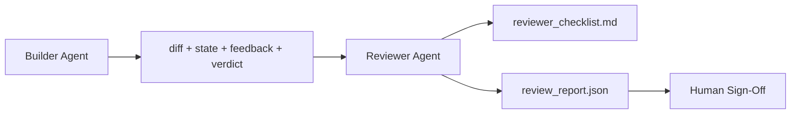

# समीक्षक एजेंटः मार्कर से अलग बिल्डर

> एक रिव्यूर एक अलग सिस्टम प्रॉम्प्ट, एक अलग लक्ष्य और बिल्डर द्वारा उत्पादित सभी चीजों तक केवल पढ़ने के लिए पहुंच के साथ एक दूसरा लूप है। बिल्डर और रिव्यूर के बीच अंतर वह जगह है जहां सबसे अधिक विश्वसनीयता रहती है।

**Type:** Build
**Languages:** Python (stdlib)
**Prerequisites:** Phase 14 · 38 (Verification Gate)
**Time:** ~55 minutes

## सीखने के लक्ष्य

- बताएँ कि एक ही एजेंट अपने काम की विश्वसनीयता से समीक्षा क्यों नहीं कर सकता।
- एक समीक्षा एजेंट लूप बनाएं जो बिल्डर कलाकृतियों का उपभोग करता है और एक संरचित समीक्षा रिपोर्ट जारी करता है।
- एक समीक्षात्मक अनुच्छेद का लेखक जो विशिष्ट आयामों को दर्जा देता है, न कि वाइब्स।
- समीक्षाकर्ता को कार्य डेस्क में तार करें ताकि मानव समीक्षा चरण वास्तविक कलाकृतियों से शुरू हो।

## समस्या

आप एजेंट से बग ठीक करने के लिए कहते हैं। यह चार फ़ाइलों को संपादित करता है, परीक्षण चलाता है, और रिपोर्ट किया जाता है। सत्यापन गेट (चरण 14 · 38) स्वीकार्यता चलाया और दायरा बरकरार है की पुष्टि करता है। गेट कहता है `passed: true`दो दिन बाद आप पता चलता है कि फिक्स बग के गलत आधे हल किया है।

स्वीकार करना आवश्यक है, पर्याप्त नहीं है. समीक्षक उन सवालों को पूछता है जो स्वीकार नहीं कर सकतेः क्या इसने सही समस्या को हल किया? क्या इसने इसे चिह्नित किए बिना दायरा बढ़ाया? क्या इसने उन परिकल्पनाओं को दस्तावेज किया जो सवाल उठाने चाहिए थे? क्या इसने कार्यक्षेत्र को एक ऐसी स्थिति में छोड़ दिया है जिसे अगले सत्र उठा सकता है?

## अवधारणा



### समीक्षक का अनुच्छेद

पांच आयाम, प्रत्येक 0 से 2 के लिए स्कोर किया।

| Dimension | Question |
|-----------|----------|
| Problem fit | Did the change solve the task as stated, not a nearby task? |
| Scope discipline | Were edits confined to the contract or was the contract grown deliberately? |
| Assumptions | Are all hidden assumptions written down somewhere reviewable? |
| Verification quality | Does the acceptance command actually prove the goal, or did it prove a weaker version? |
| Handoff readiness | Could the next session pick up cleanly from the current state? |

कुल 10 में से एक 7 से नीचे की दौड़ एक नरम विफलता है; 5 से नीचे की दौड़ एक कठिन विफलता है।

### समीक्षक एक अलग भूमिका है, एक अलग मॉडल नहीं

आप निर्माता के समान मॉडल के साथ रिव्यूर चला सकते हैं। अनुशासन भूमिका पृथक्करण हैः अलग सिस्टम प्रॉम्प्ट, अलग इनपुट, अंतर तक कोई लेखन पहुंच नहीं है। मुद्रा में परिवर्तन संकेत में परिवर्तन है।

### समीक्षक अंतर को संपादित नहीं कर सकता

यदि रिपोर्ट कहती है "इसका ठीक करें", तो अगले बिल्डर की बारी ठीक करता है; समीक्षक समीक्षा करने के लिए वापस जाता है। भूमिकाओं को मिलाकर अंतर को हराता है।

### समीक्षाकर्ता अनुच्छेद बनाम सत्यापन गेट

गेट (चरण 14 · 38) निर्धारक तथ्यों की जांच करता हैः क्या स्वीकृति चली गई, क्या नियम पारित हुए, क्या दायरा लागू हुआ। समीक्षक गुणात्मक निर्णय लेता हैः क्या यह सही काम था, क्या यह प्रलेखित है, क्या हस्तान्तरण उपयोग योग्य है। दोनों आवश्यक हैं।

```figure
wb-builder-marker
```

## इसे बनाओ

`code/main.py`कार्य करता हैः

- ए `ReviewerInputs`डेटा क्लास जो कि समीक्षाकर्ता द्वारा पढ़े जाने वाले कलाकृतियों को बंडल करता है।
- एक वर्ग स्कोरर प्रति आयाम एक समारोह के साथ। प्रत्येक समारोह के लिए निर्धारक और स्टब-ग्रेड है; वास्तविक कार्यान्वयन LLM कहलाते हैं।
- ए `review_report.json`पांच अंक, कुल और एक फैसला के साथ लेखक (`pass`,`soft_fail`,`hard_fail`) ।
- दो डेमो मामलेः एक साफ परिवर्तन और एक "सही परीक्षण, गलत समस्या" परिवर्तन।

इसे चलाओः

```
python3 code/main.py
```

आउटपुटः डिस्क पर लिखे गए दो समीक्षा रिपोर्ट और आयामी स्कोर की एक कंसोल तालिका।

## जंगली में उत्पादन के पैटर्न

रसीदेंः क्लाउडफ्लेयर की अप्रैल 2026 एआई कोड रिव्यू सिस्टम ने 30 दिनों में 5,169 रिपो में 48,095 विलय अनुरोधों पर 131,246 समीक्षा रन चलाए। 3 मिनट 39 सेकंड में पूर्ण औसत समीक्षा। सात विशेषज्ञ समीक्षक (सुरक्षा, प्रदर्शन, कोड गुणवत्ता, डॉक्स, रिलीज प्रबंधन, अनुपालन, इंजीनियरिंग कोडेक्स) एक समीक्षा समन्वयक के तहत समानांतर में चलाए गए जिन्होंने निष्कर्षों को दोहराया और गंभीरता का न्याय किया। शीर्ष स्तरीय मॉडल विशेष रूप से समन्वयक के लिए आरक्षित; विशेषज्ञ सस्ते स्तरों पर चले।

चार पैटर्न इस पैमाने पर काम करते हैं।

**Specialist pool, not one big reviewer.**एक समीक्षक 5 आयामी रूब्रिक के साथ एकल रिपो के लिए काम करता है। एक बार कोडबेस में सुरक्षा-महत्वपूर्ण, प्रदर्शन-महत्वपूर्ण और डॉक्स सतहें होने के बाद, छोटे संकेतों के साथ विशेषज्ञों में विभाजित करें। समन्वयक डिडप्लिकेशन करता है; विशेषज्ञ कभी भी पूर्ण रूब्रिक नहीं चलाते। मॉडल-स्तर का अलगाव बाहर आता हैः सस्ते विशेषज्ञ, महंगे समन्वयक।

**Bias mitigation as design requirement, not optimization.**एलएलएम न्यायाधीशों ने चार विश्वसनीय पूर्वाग्रह दिखाए (एडनन मसूद, अप्रैल 2026): स्थिति पूर्वाग्रह (जीपीटी-4 ~ 40% (ए,बी) बनाम (बी,ए) आदेश पर असंगत), शब्दहीनता पूर्वाग्रह (~15% स्कोर मुद्रास्फीति लंबे आउटपुट की ओर), स्व-प्राधान (न्यायाधीशों ने एक ही मॉडल परिवार से आउटपुट को पसंद किया), प्राधिकरण (न्यायाधीशों को ज्ञात लेखकों के लिए ओवर-रेट संदर्भ) । कम करनाः दोनों क्रमों का मूल्यांकन करें और केवल लगातार जीतें गिनें; स्पष्ट रूप से संक्षिप्तता को पुरस्कृत करने वाले 1-4 पैमाने का उपयोग करें; मॉडल परिवारों के बीच न्यायाधीशों को घुमाएं; स्कोर करने से पहले लेखक के नामों को हटा दें।

**Calibration set, not vibes.**एक 10-20 कार्य ऐतिहासिक सेट के साथ ज्ञात सही फैसले. प्रत्येक त्वरित परिवर्तन पर समीक्षक को इसके ऊपर चलाएं। यदि ऐतिहासिक रिकॉर्ड के साथ सहमति 80% से नीचे गिर जाती है, तो समीक्षक जहाजों से पहले रूब्रिक को संशोधन की आवश्यकता होती है। यह वह है जो प्रत्येक टीम अंततः फिर से खोजती है; बेहतर है कि इसके साथ शुरू करें।

**Hybrid norm with the gate.**सत्यापन गेट (चरण 14 · 38) निर्धारक जांच (क्या स्वीकृति चलाया गया, क्या परीक्षण पारित हुए, क्या दायरा था). समीक्षक अर्थिक जांच (क्या यह सही काम था, क्या परिकल्पनाएं प्रलेखित हैं, क्या हस्तांतरण उपयोग में है) को संभालता है। मानव विज्ञान के 2026 मार्गदर्शन इस विभाजन पर स्पष्ट हैः समीक्षक से यह नहीं पूछें कि क्या गेट पहले से ही साबित करता है।

## इसका प्रयोग करें

उत्पादन के पैटर्नः

- **Claude Code subagents.**एक समीक्षक उप-सदस्य एक कार्य को बंद करने के बाद चला जाता है। यह एक टिप्पणी पोस्ट करता है जो एक विषय के स्कोर के साथ PR पर है।
- **OpenAI Agents SDK handoffs.**बिल्डर कार्य पूरा करने पर रिव्यूअर को सौंपता है। रिव्यूअर निष्कर्षों की सूची या एक मानव तक दे सकता है।
- **Two-model pairing.**बिल्डर एक तेज़ और सस्ता मॉडल पर चलता है। समीक्षक एक मजबूत मॉडल पर चलता है जिसमें छोटा संदर्भ होता है, जो निर्णय पर केंद्रित होता है।

समीक्षाकर्ता दूसरी जोड़ी आंखें होती हैं जब मनुष्य स्वयं प्रत्येक समीक्षा नहीं कर सकते।

## इसे भेजें

`outputs/skill-reviewer-agent.md`एक परियोजना विशिष्ट समीक्षाकर्ता rubric उत्पन्न करता है, एक समीक्षाकर्ता एजेंट स्टब बिल्डर के कलाकृतियों के लिए तार, और सत्यापन गेट के साथ एकीकरण ताकि मानव समीक्षा एक रिक्त पृष्ठ के बजाय एक लिखित रिपोर्ट से शुरू होता है।

## व्यायाम

1. अपने उत्पाद डोमेन के लिए एक विशेष छठा आयाम जोड़ें। यह क्यों नहीं अवशोषित किया गया है, इसका बचाव करें।
2. दो अलग-अलग सिस्टम संकेतों (तर्से, वर्बोस) के साथ समीक्षाकर्ता को चलाएं। कौन सा रिपोर्ट एक इंसान के पढ़ने की अधिक संभावना है?
3. एक जोड़ें `confidence`प्रति आयाम क्षेत्र रिपोर्ट भेजने से इनकार करते हैं जब सबसे कम आयाम में विश्वास 0.6 से कम है।
4. एक कैलिब्रेशन सेट बनाएंः 10 ऐतिहासिक कार्य क्लोज-आउट ज्ञात सही फैसले के साथ। समीक्षाकर्ता को उन पर चलाएं। यह ऐतिहासिक रिकॉर्ड के साथ कहां असहमत है?
5. एक "अधिक सबूत मांगें" प्रस्ताव जोड़ेंः समीक्षक स्कोर करने से पहले बिल्डर से एक विशिष्ट परीक्षण रन के लिए पूछ सकता है। यह लूप नहीं होने के लिए सही बैक-ऑफ क्या है?

## प्रमुख शर्तें

| Term | What people say | What it actually means |
|------|----------------|------------------------|
| Reviewer rubric | "Checklist" | Five-dimension 0-2 scoring with a written question per dimension |
| Soft fail | "Needs revisions" | Total below 7; builder gets findings to address |
| Hard fail | "Reject" | Total below 5 or any dimension at 0; halt and surface to human |
| Role separation | "Different prompt" | Same model can be both roles; the discipline is inputs and posture |
| Confidence floor | "Don't ship low-signal reports" | Refuse to emit a verdict when the rubric is uncertain |

## आगे पढ़ना

- [OpenAI Agents SDK handoffs](https://openai.github.io/openai-agents-python/handoffs/)
- [Anthropic Claude Code subagents](https://code.claude.com/docs/en/sub-agents)
- [Cloudflare, Orchestrating AI Code Review at Scale](https://blog.cloudflare.com/ai-code-review/) 7 विशेषज्ञ + समन्वयक वास्तुकला, 131k रन / 30 दिन
- [Agent-as-a-Judge: Evaluating Agents with Agents (OpenReview / ICLR)](https://openreview.net/forum?id=DeVm3YUnpj) DevAI बेंचमार्क, 366 पदानुक्रमिक समाधान आवश्यकताएं
- [Adnan Masood, Rubric-Based Evaluations and LLM-as-a-Judge: Methodologies, Biases, Empirical Validation](https://medium.com/@adnanmasood/rubric-based-evals-llm-as-a-judge-methodologies-and-empirical-validation-in-domain-context-71936b989e80) 4 पक्षपात और मिटाव
- [MLflow, LLM-as-a-Judge Evaluation](https://mlflow.org/llm-as-a-judge) अलग बिल्डर/मूल्यांकनकर्ता के लिए उत्पादन उपकरण
- [LangChain, How to Calibrate LLM-as-a-Judge with Human Corrections](https://www.langchain.com/articles/llm-as-a-judge) कैलिब्रेशन सेट वर्कफ़्लो
- [Evidently AI, LLM-as-a-judge: a complete guide](https://www.evidentlyai.com/llm-guide/llm-as-a-judge)
- [Arize, LLM as a Judge — Primer and Pre-Built Evaluators](https://arize.com/llm-as-a-judge/)
- चरण 14 · 05  आत्म-संशोधन और आलोचना (एकल-एजेंट आत्म-समीक्षा आधार)
- चरण 14 · 30  Eval-driven agent development (कैलिब्रेशन सेट जनरेटर)
- चरण 14 · 38  सत्यापन गेट समीक्षक पढ़ता है
- चरण 14 · 40  रिव्यू रिपोर्ट द्वारा प्रदान किए जाने वाले प्रमोशन पैकेट
