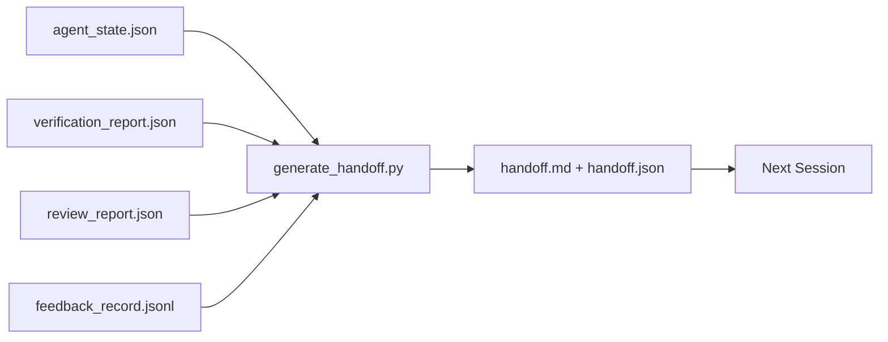

# बहु-सत्र हस्तान्तरण

> यह कार्य समाप्त होने वाला है, कार्य नहीं है, यह कार्य है, यह कार्य है, यह कार्य है, जो "एजेंट ने एक घंटे तक काम किया" को "अगले सत्र में पहले मिनट में उत्पादक है" में बदल देता है। इसे उद्देश्य से बनाएं, न कि एक पछतावा के रूप में।

**Type:** Build
**Languages:** Python (stdlib)
**Prerequisites:** Phase 14 · 34 (Repo Memory), Phase 14 · 38 (Verification), Phase 14 · 39 (Reviewer)
**Time:** ~50 minutes

## सीखने के लक्ष्य

- प्रत्येक हस्तांतरण पैकेट की आवश्यकता वाले सात क्षेत्रों की पहचान करें।
- हाथ से लिखे गद्य के बिना कार्य डेस्क कलाकृतियों से एक हस्तलिखित उत्पन्न करें।
- एक हस्तान्तरण आकार के सारांश में बड़े प्रतिक्रिया लॉग को ट्रिम करें।
- अगले सत्र की पहली कार्रवाई निर्धारक बनाओ।

## समस्या

सत्र समाप्त होता है. एजेंट कहता है "बेहद, हमने प्रगति की है।" अगला सत्र खुलता है। अगला एजेंट पूछता है "हमने कहां छोड़ा?" पहला एजेंट का जवाब गायब हो जाता है। अगला एजेंट फिर से खोजता है, वही कमांड फिर से चलाता है, फिर से मानव से वही प्रश्न पूछता है, और पिछले सत्र के अंतिम तीस सेकंड को पुनर्प्राप्त करने के लिए तीस मिनट जलाता है।

एक खराब हस्तान्तरण की लागत प्रत्येक सत्र के लिए भुगतान किया जाता है कार्य के जीवन के लिए। फिक्स सत्र के अंत में स्वचालित रूप से उत्पन्न एक पैकेट हैः क्या बदल गया, क्यों, क्या कोशिश की गई, क्या विफल रहा, क्या बचा है, अगली बार क्या करना है।

## अवधारणा



### सात खेतों हर हाथ ले जाता है

| Field | Question it answers |
|-------|---------------------|
| `summary` | One paragraph of what was done |
| `changed_files` | The diff at a glance |
| `commands_run` | What was actually executed |
| `failed_attempts` | What was tried and why it did not work |
| `open_risks` | What could bite next session, with severity |
| `next_action` | The first concrete step next session takes |
| `verdict_pointer` | Path to the verification + review reports |

`next_action`क्षेत्र वह है जो लोड ले जाता है. एक हाथ के साथ सब कुछ के अलावा`next_action`यह एक स्थिति रिपोर्ट है, एक हस्तान्तरण नहीं है।

### हस्तान्तरण उत्पन्न होते हैं, लिखित नहीं

हाथ से लिखा हुआ हाथ से दिया गया हाथ एक कठिन दिन पर छोड़ दिया जाता है। जनरेटर कार्य डेस्क कलाकृतियों को पढ़ता है और पैकेट जारी करता है। एजेंट का काम कार्य कार्य डेस्क को एक ऐसी स्थिति में छोड़ना है जो जनरेटर सारांशित कर सकता है, सारांश लिखने के लिए नहीं।

### दो रूपः मानव-पठनीय और मशीन-पठनीय

`handoff.md`यह वही है जो मनुष्य पढ़ता है।`handoff.json`यह एक ही स्रोत के कलाकृतियों से आते हैं. यदि वे भिन्न होते हैं, तो JSON जीतता है.

### प्रतिक्रिया लॉग का काटना

पूर्ण `feedback_record.jsonl`यह एक बार में एक बार में एक बार में एक बार में एक बार में एक बार में एक बार में एक बार में एक बार में एक बार में एक बार में एक बार में एक बार में एक बार में एक बार में एक बार में एक बार में एक बार में एक बार में एक बार में एक बार में एक बार में एक बार में एक बार में एक बार में एक बार में एक बार में एक बार में एक बार में एक बार में एक बार में एक बार में एक बार में एक बार में एक बार में एक बार में एक बार में एक बार में एक बार में एक बार में एक बार में एक बार में एक बार में एक बार में एक बार में एक बार में एक बार में एक बार में एक बार में एक बार में एक बार में एक बार में एक बार में एक बार में एक बार में एक बार में एक बार में एक बार में एक बार में एक बार में एक बार में एक बार में एक बार में एक बार में एक बार में एक बार में एक बार में एक बार में एक बार में एक बार में एक बार में एक बार में एक बार में एक बार में एक बार में एक बार में एक बार में एक बार में एक बार में एक बार में एक बार में एक बार में एक बार में एक बार में एक बार में एक बार में एक बार में एक बार में एक बार में एक बार में एक बार में एक बार में एक बार में एक बार में एक बार में एक बार में एक बार में एक बार में एक बार में एक बार में एक बार में एक बार में एक बार में एक बार में एक बार में एक बार में एक बार में एक बार में एक बार में एक बार में एक बार में एक बार में एक बार में एक बार में एक बार में एक बार में एक बार में एक बार में एक बार में एक बार में एक बार में एक बार में एक बार में एक बार में एक बार में एक बार में एक बार में एक बार में एक बार में एक बार में एक बार में एक बार में एक बार में एक बार में एक बार में एक बार में एक बार में एक बार में एक बार में एक बार में एक बार में एक बार में एक बार में एक बार में एक बार में एक बार में एक बार में एक बार में एक बार में एक बार में एक बार में एक बार में एक बार में एक बार में एक बार में एक बार में एक बार में एक बार में एक बार में एक बार में एक बार में एक बार में एक बार में एक बार में एक बार में एक बार में एक बार में एक बार में एक बार में एक बार

### एक स्वच्छ राज्य छोड़ दें

एक हाथ देने से काम का वर्णन होता है एक स्वच्छ स्थिति से काम फिर से शुरू हो जाता है वे एक ही बात नहीं हैं एक पूर्ण`handoff.md`यदि अगले सत्र में आधा लागू अंतर, एक अस्थायी फ़ाइल है कि एजेंट भूल गया, एक भटक गई शाखा, और परीक्षण है कि त्रुटि से पहले वे भी चलाने के लिए बेकार है। अगले एजेंट फिर निर्माण के बजाय पिछले एक के बाद सफाई करने के लिए अपने पहले दस मिनट खर्च, और लागत निर्माण के लिए प्रत्येक सत्र के जीवन के लिए काम करता है।

इसलिए सत्र तब समाप्त नहीं होता जब फीचर काम करता है. यह तब समाप्त होता है जब कार्य डेस्क एक ऐसी स्थिति में होता है जिसे जनरेटर सारांशित कर सकता है और अगला सत्र भरोसा कर सकता है. सफाई अपना चरण है, हाथ से पहले चलती है, और यह एक चेक है, न कि एक आदत, क्योंकि एक आदत वह चीज है जिसे एक कठिन दिन पर छोड़ दिया जाता है।

| Check | Clean means | Dirty blocks because |
|-------|-------------|----------------------|
| Working tree | Every change committed or explicitly stashed with a note | A half-applied diff looks like intentional work to the next agent |
| Temp artifacts | No `*.tmp`, scratch dirs, debug prints, or commented-out blocks left behind | Stray files pollute the diff and the next agent's mental model |
| Tests | Green, or red with the failure named in `open_risks` | A silent red test is a trap the next session steps in |
| Feature board | `feature_list.json` status reflects reality (Phase 14 · 36) | A stale board sends the next session to work that is already done |
| Branch | On the expected branch, no detached HEAD, no orphan branches | Wrong branch means the next session's first commit lands in the wrong place |

सफाई चरण एक उत्सर्जन करता है `clean_state.json`एक खाली सूची पैकेट लिखने से पहले प्रमोशन जनरेटर द्वारा निर्धारित पूर्व शर्त है। एक गंदे पेड़ पर निर्मित प्रमोशन प्रमोशन नहीं है, यह एक अग्रेषित गड़बड़ है। दो कलाकृतियों की जोड़ीः सफाई साबित करती है कि कार्य डेस्क को छोड़ना सुरक्षित है, प्रमोशन साबित करता है कि अगला सत्र जानता है कि कहां से शुरू करना है।

```figure
wb-handoff-packet
```

## इसे बनाओ

`code/main.py`कार्य करता हैः

- एक लोडर जो एक एकल में राज्य, फैसला, समीक्षा और प्रतिक्रिया को इकट्ठा करता है `WorkbenchSnapshot`. .
- ए `generate_handoff(snapshot) -> (markdown, payload)`कार्य।
- एक फ़िल्टर जो अंतिम K प्रतिक्रिया प्रविष्टियों और सभी गैर-शून्य निकास को चुनता है।
- एक डेमो रन जो लिखता है `handoff.md`और `handoff.json`स्क्रिप्ट के बगल में।

इसे चलाओः

```
python3 code/main.py
```

आउटपुटः एक मुद्रित हस्तान्तरण शरीर, प्लस डिस्क पर दोनों फ़ाइलें।

## जंगली में उत्पादन के पैटर्न

कोडेक्स CLI, क्लाउड कोड और ओपनकोड प्रत्येक एक अलग संपीड़न कहानी भेजता है; संरचित हस्तान्तरण पैकेट तीनों के ऊपर बैठता है।

**Compaction strategies vary; the packet schema does not.**कोडेक्स CLI का POST /v1/responses/compact एक सर्वर-साइड अस्पष्ट AES ब्लाब (OpenAI मॉडल के लिए तेजी से पथ) है; बैकअप एक स्थानीय "हैंडऑफ सारांश" जोड़ा गया है के रूप में `_summary`उपयोगकर्ता भूमिका संदेश। क्लाउड कोड संदर्भ के 95% पर पांच-चरण प्रगतिशील संपीड़न चलाता है। ओपनकोड टाइमस्टैम्प आधारित संदेश छिपाने के साथ-साथ एक 5-शीर्षक एलएलएम सारांश करता है। तीन अलग-अलग तंत्र, एक ही आवश्यकताः संपीड़न से बचने वाले को एक पोर्टेबल कलाकृतियों में क्रमबद्ध करें। पैकेट वह कलाकृतियों है।

**Fresh-session handoff is not compaction.**संवेदना एक सत्र को बढ़ा देती है; हाथ देना एक को साफ-सुथरा बंद कर देता है और अगले सत्र को शुरू करता है। हर्मेस मुद्दा #20372 फ्रेमिंग (अप्रैल 2026) सही हैः जब स्थान पर संपीड़न घटना शुरू होता है, तो एजेंट को एक कॉम्पैक्ट हैंडऑफ लिखना चाहिए, सत्र समाप्त करना चाहिए, और नए संदर्भ में फिर से शुरू करना चाहिए। पैकेट वह है जो उस संक्रमण को सस्ता बनाता है। गलती यह है कि गुणवत्ता गिरने तक संपीड़न जारी रखें; ठीक करने के लिए जल्दी, साफ-सुथरा वितरण के लिए बजट है।

**One active handoff per branch and topic.**मल्टी-एजेंट समन्वय खराब मॉडल आउटपुट की तुलना में पुराने हाथों पर अधिक टूट जाता है। हमेशा शामिल करें `branch`,`last_known_good_commit`, और एक `status``active | superseded | archived`. स्टैल्ड हैंडऑफ को अभिलेखागार में रखा जाता है; केवल सक्रिय सत्र अगले सत्र को चलाता है। यह है नोट-जैसे-हैंडऑफ और स्टेट-जैसे-हैंडऑफ के बीच अंतर।

**Wrap up before 50-75% context, not at the wall.**हाथ से लिखे गए पैटर्न प्लेबुक (CLAUDE.md + HANDOVER.md) में सबसे अच्छा परिणाम तब बताया जाता है जब सत्र 95% के बजाय 50-75% संदर्भ बजट पर समाप्त होता है। संपीड़न कलाकृतियों ने स्रोत स्थिति को प्रदूषित करने से पहले पैकेट जनरेटर साफ चलता है। संदर्भ बरकरार रहते हुए लिखने के लिए सस्ता; महंगा जब मॉडल पहले से ही अपना स्थान खो रहा है।

## इसका प्रयोग करें

उत्पादन के पैटर्नः

- **Session-end hook.**रिनटाइम जनरेटर को चालू करता है जब उपयोगकर्ता चैट बंद करता है। पैकेट में जाता है।`outputs/handoff/<session_id>/`. .
- **PR template.**जनरेटर का मार्कडाउन एक पीआर निकाय भी है. समीक्षक इसे पांच अन्य फाइलों को खोले बिना पढ़ते हैं।
- **Cross-agent handoff.**एक उत्पाद (क्लाउड कोड) के साथ निर्माण करें, दूसरे (कोडेक्स) के साथ जारी रखें। पैकेट भाषा है।

पैकेट छोटा, नियमित और सस्ता है, और प्रत्येक सत्र के साथ लागत बचत करता है।

## इसे भेजें

`outputs/skill-handoff-generator.md`एक परियोजना के कलाकृतियों के पथों के लिए ट्यून एक जनरेटर का उत्पादन करता है, सत्र के अंत में हुक जो इसे चलाता है, और एक `handoff.json`अगले एजेंट स्टार्टअप पर पढ़ता है।

## व्यायाम

1. एक जोड़ें `assumptions_to_validate`क्षेत्र जो हर परिकल्पना को सतह पर रखता है बिल्डर ने लॉग किया लेकिन समीक्षक ने 1 से ऊपर स्कोर नहीं किया।
2. असफल रन के लिए प्रतिक्रिया सारांश को अलग से काटें और पास करने वाले रन के लिए। असममित की रक्षा करें।
3. एक प्रश्न को पैकेट में या चैट संदेश में शामिल करने के लिए किस सीमा पर है?
4. जनरेटर को अक्षम बनाएंः इसे दो बार चलाकर एक ही पैकेट उत्पन्न होता है। इसे पकड़ने के लिए स्थिर होने की क्या जरूरत है?
5. अगले सत्र के लिए पूर्वनिर्धारित" अनुभाग जोड़ा गया है जिसमें अगले सत्र को कार्य करने से पहले सटीक रूप से कलाकृतियों को लोड करना चाहिए।

## प्रमुख शर्तें

| Term | What people say | What it actually means |
|------|----------------|------------------------|
| Handoff packet | "Session summary" | Generated artifact carrying the seven fields, both markdown and JSON |
| Next action | "What to do first" | The one concrete step that starts the next session |
| Feedback trim | "Log summary" | Last K records plus every non-zero exit |
| Status report | "What we did" | A document missing `next_action`; useful, but not a handoff |
| Verdict pointer | "Receipt" | Path to the verification + review reports for traceability |

## आगे पढ़ना

- [Anthropic, Effective harnesses for long-running agents](https://www.anthropic.com/engineering/effective-harnesses-for-long-running-agents)
- [OpenAI Agents SDK handoffs](https://openai.github.io/openai-agents-python/handoffs/)
- [Codex Blog, Codex CLI Context Compaction: Architecture, Configuration, Managing Long Sessions](https://codex.danielvaughan.com/2026/03/31/codex-cli-context-compaction-architecture/) POST /v1/responses/compact और स्थानीय fallback
- [Justin3go, Shedding Heavy Memories: Context Compaction in Codex, Claude Code, OpenCode](https://justin3go.com/en/posts/2026/04/09-context-compaction-in-codex-claude-code-and-opencode) तीन विक्रेता संपीड़न तुलना
- [JD Hodges, Claude Handoff Prompt: How to Keep Context Across Sessions (2026)](https://www.jdhodges.com/blog/ai-session-handoffs-keep-context-across-conversations/) क्लाउड.एमडी + हैंडओवर.एमडी, 50-75% संदर्भ बजट
- [Mervin Praison, Managing Handoffs in Multi-Agent Coding Sessions: Fresh Context Without Losing Continuity](https://mer.vin/2026/04/managing-handoffs-in-multi-agent-coding-sessions-fresh-context-without-losing-continuity/) वितरित-प्रणाली फ्रेमिंग
- [Hermes Issue #20372 — automatic fresh-session handoff when compression becomes risky](https://github.com/NousResearch/hermes-agent/issues/20372)
- [Hermes Issue #499 — Context Compaction Quality Overhaul](https://github.com/NousResearch/hermes-agent/issues/499) कॉडेक्स सीएलआई में हस्तान्तरण उन्मुख संकेत
- [Microsoft Agent Framework, Compaction](https://learn.microsoft.com/en-us/agent-framework/agents/conversations/compaction)
- [OpenCode, Context Management and Compaction](https://deepwiki.com/sst/opencode/2.4-context-management-and-compaction)
- [LangChain, Context Engineering for Agents](https://www.langchain.com/blog/context-engineering-for-agents)
- चरण 14 · 34  राज्य फ़ाइल जनरेटर पढ़ता है
- चरण 14 · 38  सत्यापन निर्णय पैकेट अंक
- चरण 14 · 39  समीक्षा रिपोर्ट पैकेज में बंडल
