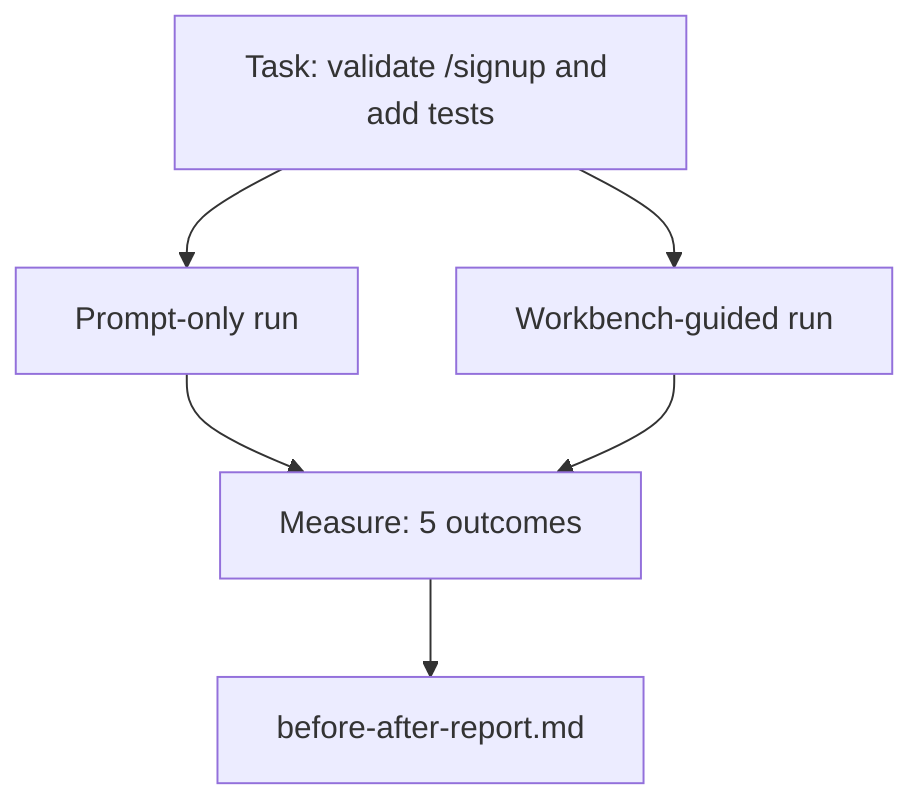

# वास्तविक रेपो पर काम की डेस्क

> सतहों के ग्यारह पाठों का कोई मूल्य नहीं है यदि वे एक वास्तविक कोडबेस के संपर्क में नहीं रहते हैं। यह पाठ एक छोटे से नमूना ऐप पर दो बार एक ही कार्य करता हैः केवल शीघ्र-बिरोध बनाम कार्य डेस्क-निर्देशित। संख्या तर्क करती है।

**Type:** Build
**Languages:** Python (stdlib)
**Prerequisites:** Phases 14 · 32 to 14 · 40
**Time:** ~60 minutes

## सीखने के लक्ष्य

- एक छोटे से अनुप्रयोग पर सात कार्य डेस्क सतहों को एक साथ लाएं।
- एक ही कार्य को दो बार (केवल त्वरित और कार्यक्षेत्र-निर्देशित) करें और पांच परिणामों का माप करें।
- पहले/पश्चात रिपोर्ट पढ़ें और तय करें कि किन सतहों ने सबसे अधिक लीवरेज दिया।
- "लेकिन मेरा मॉडल पर्याप्त अच्छा है" के खिलाफ कार्यक्षेत्र की रक्षा करें।

## समस्या

एक खिलौना कार्य पर एक डेमो किसी को भी आश्वस्त नहीं करता है। कार्य डेस्क के लिए मामला तब बनाया जाता है जब एक वास्तविक महसूस करने वाले रिपो पर एक वास्तविक महसूस करने वाले कार्य कम विफलताओं, कम रिवर्स के साथ उत्पादन में आता है, और एक पैकेट अगले सत्र का उपयोग कर सकता है।

इस पाठ को वास्तविक भावनाओं को भेजता है और दोनों पाइपलाइनों के माध्यम से एक ही कार्य चलाता है। परिणाम एक पूर्व / बाद की रिपोर्ट है जिसे आप एक संदेह को सौंप सकते हैं।

## अवधारणा



### नमूना ऐप

एक न्यूनतम FastAPI शैली हैंडल में `sample_app/`:

- `app.py`के साथ`/signup`(अभी तक कोई सत्यापन नहीं) ।
- `test_app.py`एक खुश पथ परीक्षण के साथ।
- `README.md`और `scripts/release.sh`प्रतिबंधित क्षेत्र के लिए चारा के रूप में।

### कार्य

> इनपुट सत्यापन जोड़ें `/signup`: 8 वर्ण से कम पासवर्ड अस्वीकार करें, टाइप त्रुटि के लिफाफे के साथ 422 लौटाएं। एक परीक्षण जो नए व्यवहार को साबित करता है जोड़ें।

### दो पाइपलाइनों

केवल शीघ्रः

1. README पढ़ें।
2. पढ़िए `app.py`. .
3. फ़ाइलों को संपादित करें।
4. दावा किया गया है।

कार्यक्षेत्र द्वारा निर्देशितः

1. प्रारंभ स्क्रिप्ट चलाएं (पाठ 35).
2. अनुबंध के दायरे को पढ़ें (पाठ 36).
3. पढ़ना (पाठ 34) ।
4. केवल फ़ाइलों को संपादित करने की अनुमति है।
5. प्रतिक्रिया रनर के माध्यम से स्वीकृति कमांड चलाएं (पाठ 37).
6. सत्यापन गेट चलाएं (पाठ 38).
7. रन रिव्यूर (पाठ 39).
8. हस्तान्तरण उत्पन्न करें (पाठ 40).

### मापा गया पांच परिणाम

| Outcome | Why it matters |
|---------|----------------|
| `tests_actually_run` | Most "tests passed" claims are unverifiable |
| `acceptance_met` | The test that proves the goal must be the test that ran |
| `files_outside_scope` | Scope creep is the dominant silent failure |
| `handoff_quality` | The next session pays for or benefits from this |
| `reviewer_total` | Qualitative judgment on top of the gate |

```figure
wb-ab-runs
```

## इसे बनाओ

`code/main.py`दोनों पाइपलाइनों को एक ही नमूना ऐप फिक्स्चर के खिलाफ ऑर्केस्ट्रेट करता है। दोनों पाइपलाइनों को स्क्रिप्ट किया गया है (लूप में कोई एलएलएम नहीं है) ताकि माप को पुनः प्रस्तुत किया जा सके। स्क्रिप्ट तुलना को लिखता है`before-after-report.md`और `comparison.json`. .

इसे चलाओः

```
python3 code/main.py
```

आउटपुटः पाइपलाइन प्रति परिणामों की एक कंसोल तालिका, स्क्रिप्ट के बगल में सहेजी गई मार्कडाउन रिपोर्ट, और जो भी इसे चार्ट करना चाहता है उसके लिए JSON।

## जंगली में उत्पादन के पैटर्न

सन्देह करने वाले का सवाल है कि "कार्य मंच वास्तव में कितना मदद करता है? 2026 के आंकड़े स्पष्टीकरण से बहुत अधिक बताते हैं।

**Terminal Bench Top-30 to Top-5 on the same model.**लैंगचेन का *एजेंट हर्नस का शरीर रचना* (अप्रैल 2026): एक कोडिंग एजेंट केवल हर्नस को बदलकर टर्मिनल बेंच 2.0 पर पांचवें स्थान पर पहुंच गया। एक ही मॉडल। विभिन्न सतहें। पच्चीस-रैंक डेल्टा।

**Vercel 80% to 100% by deleting tools.**वर्सेल ने बताया कि 80% अपने एजेंट के उपकरणों को हटाने से सफलता दर 80% से 100% तक बढ़ गई। छोटे उपकरण सतह, तेज दायरा, विफलता के कम तरीके। नकारात्मक स्थान जीतता है।

**Harvey 2x accuracy via harness alone.**कानूनी एजेंटों ने हर्नर अनुकूलन के माध्यम से अपनी सटीकता को दोगुना से अधिक बढ़ाया, कोई मॉडल परिवर्तन नहीं।

**88% of enterprise AI agent projects fail to reach production.**preprints.org *Harness Engineering for Language Agents* पेपर (मार्च 2026) में विफलताओं का पता चलने के समय तक चलता है, तर्क नहींः पुरानी स्थिति, नाजुक पुनः प्रयास, ओवरग्राउन्ड संदर्भ, मध्यवर्ती त्रुटियों से खराब रिकवरी।

**Long-context collapse.**वेबएजेंट बेसलाइन 40-50% सफलता लंबे संदर्भ की स्थितियों में 10% से नीचे गिर जाती है, ज्यादातर अंतहीन लूप और लक्ष्य हानि से।

**False negatives still exist.**एकल-चरण तथ्यात्मक कार्य, एक-लाइन लिंट, प्रारूपक रन, जो कुछ भी मॉडल ने शब्दशः याद किया है  ये केवल शीघ्र-चलने से तेज़ चलें। बेंचमार्क को उन्हें ईमानदारी से सूचीबद्ध करना चाहिए ताकि कार्यक्षेत्र को ओवरकिल के रूप में ढांचा नहीं दिया जाए।

यह निष्कर्ष यह नहीं है कि "हार्नेस हमेशा के लिए जीतता है।" मॉडल समय के साथ ही हार्नेस ट्रिक्स को अवशोषित करते हैं। निष्कर्ष यह है कि आज, इंजीनियरिंग लोड सात सतहों में बैठता है, और संख्याएं इसे साबित करती हैं।

## इसका प्रयोग करें

यह सबक आपके द्वारा उद्धृत मामले की फाइल है जबः

- किसी ने पूछा कि हर पीआर में एक क्यों होता है`agent-rules.md`और एक दायरा अनुबंध।
- एक टीम सत्यापन गेट को छोड़ना चाहती है "केवल इस स्प्रिंट के लिए।"
- एक नया एजेंट उत्पाद लॉन्च होता है और आपको यह देखने के लिए एक पोर्टेबल बेंचमार्क की आवश्यकता होती है कि क्या यह वास्तव में समय बचाता है।

संख्याएं व्याख्या से आगे जाती हैं।

## इसे भेजें

`outputs/skill-workbench-benchmark.md`एक पोर्टेबल मूल्यांकन हर्नस है जो किसी एजेंट उत्पाद को दोनों पाइपलाइनों के माध्यम से एक परियोजना के स्वयं के नमूना ऐप के खिलाफ चलाता है और पांच परिणामों की रिपोर्ट करता है।

## व्यायाम

1. एक छठा परिणाम जोड़ेंः समय से पहले के लिए अर्थपूर्ण संपादन। आप इसे कैसे साफ ढंग से मापते हैं?
2. अपने कोडबेस में एक वास्तविक दूसरे दिन के कार्य पर तुलना करें। कार्यक्षेत्र संख्याएं कहां से गायब हो जाती हैं?
3. "झूठ नकारात्मक" पास जोड़ेंः कार्य जहां केवल शीघ्र-केवल तेजी से होगा और कार्यक्षेत्र ओवरहेड वास्तविक लागत है। वैसे भी कार्यक्षेत्र बनाए रखने का बचाव करें।
4. एक वास्तविक LLM कॉल के साथ स्क्रिप्ट "एजेंट" की जगह. कौन सा परिणाम अधिक शोरदायक हो जाता है?
5. एक गैर इंजीनियर को लक्षित एक पृष्ठ का सारांश लेखक।

## प्रमुख शर्तें

| Term | What people say | What it actually means |
|------|----------------|------------------------|
| Sample app | "Toy repo" | Small but realistic enough to exercise all seven surfaces |
| Pipeline | "Workflow" | Ordered sequence of surface reads/writes the agent follows |
| Before/after report | "The receipts" | The artifact you hand to a skeptic |
| False negative | "Workbench overkill" | Tasks where prompt-only is faster; useful to enumerate honestly |
| Workbench benchmark | "Reliability score" | Portable harness that runs the comparison on your codebase |

## आगे पढ़ना

- [LangChain, The Anatomy of an Agent Harness](https://blog.langchain.com/the-anatomy-of-an-agent-harness/) टर्मिनल बेंच शीर्ष-30 से शीर्ष-5 तक की रसीद
- [MongoDB, The Agent Harness: Why the LLM Is the Smallest Part of Your Agent System](https://www.mongodb.com/company/blog/technical/agent-harness-why-llm-is-smallest-part-of-your-agent-system) वर्सेल + हार्वे संख्याएँ
- [preprints.org, Harness Engineering for Language Agents](https://www.preprints.org/manuscript/202603.1756) 88% उद्यम विफलता दर, रनटाइम मूल कारण
- [HN: Improving 15 LLMs at Coding in One Afternoon. Only the Harness Changed](https://news.ycombinator.com/item?id=46988596) 15 मॉडल में दोहराया गया
- [Cloudflare, Orchestrating AI Code Review at Scale](https://blog.cloudflare.com/ai-code-review/) 131k समीक्षा रन / उत्पादन में 30 दिन
- [Anthropic, Building Effective Agents](https://www.anthropic.com/research/building-effective-agents)
- चरण 14 · 32 से 14 · 40  सतहें इस पाठ में अंत से अंत तक अभ्यास किया गया है
- चरण 14 · 19  एसईई-बेंच, GAIA, एजेंटबेंच के रूप में मैक्रो बेंचमार्क इस पाठ को पूरक करता है
- चरण 14 · 30  मूल्यांकन-चालित एजेंट विकास एक ही हर्नस प्लग में
