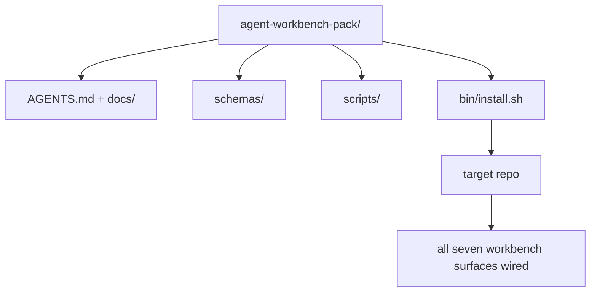

# कैपस्टोनः एक पुनः प्रयोज्य एजेंट वर्कबेंच पैक भेजें

> मिनी ट्रैक एक पैक के साथ समाप्त होता है आप किसी भी रेपो में छोड़ देते हैं सतहों के 11 पाठ एक निर्देशिका में संपीड़ित आप कर सकते हैं`cp -r`और अगले सुबह एक एजेंट को विश्वसनीय रूप से काम करने के लिए।

**Type:** Build
**Languages:** Python (stdlib)
**Prerequisites:** Phases 14 · 31 to 14 · 41
**Time:** ~75 minutes

## सीखने के लक्ष्य

- सात कार्य डेस्क सतहों को एक ड्रॉप-इन निर्देशिका में पैक करें।
- योजनाओं, स्क्रिप्ट, और टेम्पलेट्स को पिन करें ताकि एक नया रेपो एक ज्ञात-अच्छी तरह से बेसलाइन प्राप्त करता है।
- एक एकल इंस्टॉलर स्क्रिप्ट जो पैक को अक्षम्य रूप से नीचे रखता है जोड़ें।
- यह तय करें कि समूह में क्या रहता है और बाहर क्या रहता है, प्रत्येक के लिए कटौती का बचाव करते हुए।

## समस्या

एक कार्य डेस्क जो एक Google डॉक, एक चैट इतिहास और तीन अर्ध-याद किए गए स्क्रिप्ट में रहता है एक कार्य डेस्क है जो हर तिमाही में पुनर्निर्माण किया जाता है। उपचार एक संस्करण पैक हैः एक रेपो या निर्देशिका सतहों, योजनाओं, स्क्रिप्टों और एक आदेश इंस्टॉलर के साथ।

आप इस सबक को समाप्त करेंगे `outputs/agent-workbench-pack/`डिस्क पर भेज दिया और एक `bin/install.sh`जो इसे किसी भी लक्ष्य रेपो में छोड़ देता है।

## अवधारणा



### पैक लेआउट

```
outputs/agent-workbench-pack/
├── AGENTS.md
├── docs/
│   ├── agent-rules.md
│   ├── reliability-policy.md
│   ├── handoff-protocol.md
│   └── reviewer-rubric.md
├── schemas/
│   ├── agent_state.schema.json
│   ├── task_board.schema.json
│   └── scope_contract.schema.json
├── scripts/
│   ├── init_agent.py
│   ├── run_with_feedback.py
│   ├── verify_agent.py
│   └── generate_handoff.py
├── bin/
│   └── install.sh
└── README.md
```

### जो अंदर रहता है, जो बाहर रहता है

मेंः

- सतह योजनाएं, वे अनुबंध हैं।
- ऊपर चार पटकथाएँ हैं. वे रनटाइम हैं.
- चार डॉक्स, वे नियम और रूटीन हैं।

बाहरः

- परियोजना विशिष्ट कार्य लक्ष्य रेपो बोर्ड पर हैं, पैक में नहीं।
- विक्रेता SDK कॉल. पैक फ्रेमवर्क-अज्ञानी है.
- समूह टीम के मौजूदा समूह के बगल में रहता है, अंदर नहीं।

### इंस्टॉलर

एक छोटा सा `bin/install.sh`(या `bin/install.py`):

1. बिना `--force`. .
2. लक्ष्य रेपो में पैक को कॉपी करता है।
3. यदि कोई `.github/workflows/`अस्तित्व में है।
4. अगले चरणों को प्रिंट करता हैः बोर्ड भरें, स्वीकार आदेश सेट करें, init स्क्रिप्ट चलाएं।

### संस्करण

पैक में एक `VERSION`फ़ाइल. स्कीम bumps और स्क्रिप्ट परिवर्तनों कि माइग्रेशन की आवश्यकता bumps प्रमुख. केवल डॉक परिवर्तनों bumps पैच. लक्ष्य रेपो के `agent_state.json`रिकॉर्ड जो पैक संस्करण यह शुरू किया गया था के खिलाफ.

```figure
wb-pack-install
```

## इसे बनाओ

`code/main.py`पैक को इकट्ठा करता है `outputs/agent-workbench-pack/`इस मिनी ट्रैक में पिछले पाठों की योजनाओं और स्क्रिप्ट के साथ, और डॉक्स जो आपने पहले ही लिखा है।

इसे चलाओः

```
python3 code/main.py
```

स्क्रिप्ट सतहों को कॉपी और पिन करता है, README लिखता है, पैक ट्री प्रिंट करता है, और शून्य से बाहर निकलता है। फिर से चलाना अक्षम है।

## जंगली में उत्पादन के पैटर्न

एक पैक केवल तभी मूल्यवान होता है जब वह कांटे, अद्यतन और अप्रिय अपस्ट्रीम से बचता है। चार पैटर्न ऐसा काम करते हैं।

**`VERSION` is the contract, not the marketing.**बड़े bumps एक राज्य माइग्रेशन की आवश्यकता होती है. छोटे bumps एक चेकर फिर से चलाने की आवश्यकता होती है. पैच bumps केवल डॉक हैं. इंस्टॉलर लिखता है`.workbench-version`प्रत्येक स्थापना पर लक्ष्य रेपो में; `lint_pack.py`यदि लक्ष्य की ताला पैक के साथ असहमत है तो शिप करने से इनकार करता है `VERSION`. . . इस तरह से कैसे`npm`,`Cargo`और `pyproject.toml`10 साल के चूरन से बचें; एजेंटों के बारे में कुछ भी नियमों को नहीं बदलता है।

**Single source for cross-tool distribution.**Nx जहाज एक `nx ai-setup`जो नीचे निहित है `AGENTS.md`,`CLAUDE.md`,`.cursor/rules/`,`.github/copilot-instructions.md`पैक को वही करना चाहिए; इंस्टॉलर सिम्बल लिंक (`ln -s AGENTS.md CLAUDE.md`) इसलिए एक ही सत्य स्रोत प्रत्येक कोडिंग एजेंट को फैन्स करता है। एक उपकरण को दूसरे पर समर्थन देने के लिए पैक को फोर्क करना एक विफलता मोड है।

**`uninstall.sh` that refuses on non-trivial state.**पैक को अनइंस्टॉल करने से उपयोगकर्ता का डेटा नहीं हटाया जा सकता `agent_state.json`,`task_board.json`या `outputs/`. अनइंस्टॉलर योजनाओं, स्क्रिप्ट, डॉक्स को हटा देता है, और `AGENTS.md`(के साथ `--keep-agents-md`राज्य के फ़ाइलों में कोई भी गैर-प्रतिबंधित परिवर्तन है तो आगे बढ़ने से इनकार करता है। राज्य का मालिक उपयोगकर्ता है; पैक इसका मालिक नहीं है।

**Skill-as-publishable. SkillKit-style distribution.**एक कौशल के रूप में पैक जहाजों SkillKit: `skillkit install agent-workbench-pack`एक स्रोत से 32 एआई एजेंटों पर यह सेट करता है। पैक रेपो सत्य का स्रोत है; स्किलकिट वितरण चैनल है। विक्रेता लॉक-इन टूट जाता है; सात सतहें एक जैसी रहती हैं।

## इसका प्रयोग करें

तीन स्थानों पैक जहाजोंः

- **As a directory you drop into a repo.** `cp -r outputs/agent-workbench-pack /path/to/repo`. .
- **As a public template repo.**फोर्क-एंड-कस्टमाइज़, के साथ `VERSION`बहाव को नियंत्रित करना।
- **As a SkillKit skill.**अपने एजेंट उत्पाद में तारों ताकि एक ही आदेश इसे नीचे सेट.

पैक नुस्खा है, प्रत्येक स्थापना एक सेक्शन है।

## इसे भेजें

`outputs/skill-workbench-pack.md`परियोजना-ट्यून पैक उत्पन्न करता हैः टीम के इतिहास के लिए नियम तेज, रेपो के लिए अनुकूलित दायरा ग्लोब, एक डोमेन-विशिष्ट प्रविष्टि के साथ विस्तारित rubric आयाम।

## व्यायाम

1. तय करें कि कौन सा वैकल्पिक पांचवां दस्तावेज कैनोनिकल पैक में पदोन्नति के लायक है। कटौती का बचाव करें।
2. एक के साथ Python के रूप में स्थापना को फिर से लिखें `--dry-run`बैश के साथ एर्गोनोमिक तुलना करें।
3. एक जोड़ें `bin/uninstall.sh`जो सुरक्षित रूप से पैक को हटा देता है और यदि राज्य फ़ाइलों में गैर-नाशिक इतिहास है तो इनकार करता है।
4. एक जोड़ें `lint_pack.py`जो जब पैक से बहता है विफल होता है`VERSION`. इसे अपने पैक के रिपो के लिए आईसी में वायर करें.
5. इस पैक में एक हाथ से रोल किए गए कार्य डेस्क से प्रवास रनबुक के लेखक। कार्य क्रम क्या है जो डाउनटाइम को न्यूनतम करता है?

## प्रमुख शर्तें

| Term | What people say | What it actually means |
|------|----------------|------------------------|
| Workbench pack | "The starter kit" | A versioned directory carrying all seven surfaces |
| Installer | "Setup script" | `bin/install.sh` that lays the pack down idempotently |
| Pack version | "VERSION" | Major bumps for schema/script changes, patch for doc-only |
| Drop-in pack | "cp -r and go" | Pack works without per-repo customization on day one |
| Forkable template | "GitHub template" | Public repo that GitHub's "Use this template" can clone from |

## आगे पढ़ना

- चरण 14 · 31 से 14 · 41  प्रत्येक सतह इस पैक बंडल
- [SkillKit](https://github.com/rohitg00/skillkit) 32 एआई एजेंटों में इस कौशल को स्थापित करें
- [Nx Blog, Teach Your AI Agent How to Work in a Monorepo](https://nx.dev/blog/nx-ai-agent-skills) छह उपकरणों पर एकल स्रोत जनरेटर
- [agents.md — the open spec](https://agents.md/) आपके पैक के राउटर को क्या लागू करना चाहिए
- [HKUDS/OpenHarness](https://github.com/HKUDS/OpenHarness) पैक समकक्ष के संदर्भ कार्यान्वयन
- [andrewgarst/agentic_harness](https://github.com/andrewgarst/agentic_harness) eval सूट के साथ Redis समर्थित संदर्भ
- [Augment Code, A good AGENTS.md is a model upgrade](https://www.augmentcode.com/blog/how-to-write-good-agents-dot-md-files) पैक डॉक्स गुणवत्ता पट्टी
- [Anthropic, Effective harnesses for long-running agents](https://www.anthropic.com/engineering/effective-harnesses-for-long-running-agents)
- [Anthropic, Harness design for long-running application development](https://www.anthropic.com/engineering/harness-design-long-running-apps)
- चरण 14 · 30  मूल्यांकन-चालित एजेंट विकास जो पैक के सत्यापन गेट का उपभोग करता है
- चरण 14 · 41  इससे पहले/बचे के बेंचमार्क में सुधार
