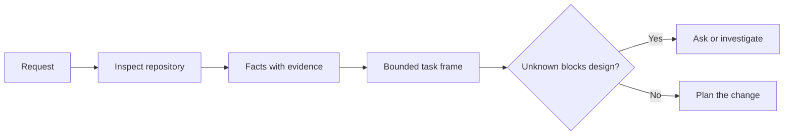

# एजेंट कोड लिखने से पहले कार्य को फ्रेम करें

> एक कोडिंग एजेंट एक स्पष्ट कार्य को जल्दी से लागू कर सकता है. यह एक अस्पष्ट कार्य को जल्दी से भी लागू कर सकता है। गति समान है। लागत नहीं है।

**Type:** Learn + Build
**Languages:** Python (stdlib)
**Prerequisites:** Phase 14 lessons 31 and 36
**Time:** ~60 minutes

## सीखने के लक्ष्य

- संपादन से पहले किसी अनुरोध को सीमित कार्य फ्रेम में परिवर्तित करें।
- अनुमानों और खुले प्रश्नों से भंडार संबंधी तथ्यों को अलग करना।
- अनुमत मार्ग, निषिद्ध मार्ग और स्वीकृति के प्रमाण को परिभाषित करें।
- कार्य शुरू करने के लिए जब जासूस पर्याप्त है तय करें।

## महंगी विफलता

 दोहरी ईमेल सुरक्षा जोड़ें विशिष्ट लगता है। यह नहीं है। क्या अद्वितीयता एपीआई, डोमेन सेवा या डेटाबेस में शामिल है? क्या तुलना केस-संवेदनशील है? कौन सा त्रुटि आकार पहले से ही सार्वजनिक है? क्या माइग्रेशन की अनुमति है? कौन सा परीक्षण व्यवहार साबित करता है?

एक सक्षम एजेंट उन अंतराल को व्यवहार्य विकल्पों से भर देगा। यह खतरनाक मामला है क्योंकि कार्यान्वयन स्वच्छ, परीक्षण किया जा सकता है, और अभी भी सिस्टम के साथ असंगत है।

इसलिए कोडिंग एजेंट के काम की पहली इकाई संपादन नहीं है, यह एक कार्य फ्रेम है जिसे भंडार साक्ष्य द्वारा समर्थित है।

## कार्य फ्रेम

एक उपयोगी फ्रेम में छह फ़ील्ड होते हैंः

| Field | Question |
|---|---|
| Goal | What observable behavior must change? |
| Repository facts | What did you verify in code, tests, config, or history? |
| Allowed paths | Where may the change land? |
| Forbidden paths | What must remain untouched? |
| Acceptance evidence | Which commands or observations prove the goal? |
| Unknowns | Which decisions still need evidence or human judgment? |

तथ्य रसीदों की आवश्यकता है। एपीआई डुप्लिकेट के लिए 409 का उपयोग करता है जब तक आप मौजूदा परीक्षण या हैंडलर को इंगित नहीं कर सकते तब तक यह एक तथ्य नहीं है। एक फ़ाइल पथ और पंक्ति पर्याप्त है। एक कमांड परिणाम बेहतर है जब व्यवहार मायने रखता है।



## पहचानने में बाधाएं होती हैं

पूरे रिपॉजिटरी को न पढ़ें. उन सतहों की खोज करें जो परिवर्तन को सीमित करती हैंः

1. वर्तमान व्यवहार और उसके कॉल करने वाला।
2. निकटतम मौजूदा परीक्षण.
3. सार्वजनिक अनुबंध या क्रमबद्ध रूप।
4. परियोजना निर्देश जो पथ को नियंत्रित करते हैं।
5. निर्माण और सत्यापन आदेश।
6. स्थानीय पैटर्न को प्रकट करने वाले समान पूर्ण परिवर्तन।

जब कोई निर्णय किसी सबूत के आधार पर लिया जाता है, तो उसे रोकना चाहिए, या उसे स्पष्ट रूप से सौंपा जाता है या उसे अज्ञात के रूप में सूचीबद्ध किया जाता है।

## अज्ञात असफलता नहीं हैं

एक अज्ञात एक नियंत्रित अंतर है। एक परिकल्पना उस अंतर का अनियंत्रित उत्तर है।

प्रत्येक अज्ञात को वर्गीकृत करेंः

- **Discoverable:**भंडार या चल रही प्रणाली इसका जवाब दे सकती है।
- **Decidable:**कार्य अनुबंध एजेंट को चुनने का अधिकार देता है।
- **Human:**विकल्प उत्पाद व्यवहार, लागत, जोखिम या सार्वजनिक संगतता को बदलता है।
- **Deferred:**विकल्प इस स्लाइस के बाहर है और गैर-लक्ष्य में शामिल है।

एजेंट को खोज योग्य और विशेषाधिकारित अज्ञात के माध्यम से जारी रखना चाहिए।

## कार्यान्वयन से पहले स्वीकृति

पैच से पहले सबूत लिखें। सबूत हो सकता हैः

- एक केंद्रित इकाई या एकीकरण परीक्षण कमांड;
- एक नामित दृश्य पोर्ट और अपेक्षित स्थिति के साथ ब्राउज़र यात्रा;
- एक वायर अनुरोध और सटीक प्रतिक्रिया अनुबंध;
- एक सीमा के साथ प्रदर्शन माप;
- एक दायरा जांच जो पुष्टि करती है कि कोई संबंधित फ़ाइल नहीं बदल गई है।

परीक्षा पास करना कोई प्रमाण योजना नहीं है। प्रामाणिक परीक्षण और उसके समर्थन में दावा का नाम बताइए।

## इसे बनाओ

प्रयोगशाला एक बनाती है`TaskFrame`, अपनी सीमाओं और सबूतों को मान्य करता है, और लिखता है `outputs/task-frame.md`. .

इस पाठ निर्देशिका से चलाएंः

```bash
python3 code/main.py
python3 -m unittest discover code/tests -v
```

उदाहरण को चार तरीकों से तोड़ेंः लक्ष्य को हटाएं, तथ्य प्राप्ति को हटाएं, एक अनुमति और प्रतिबंधित पथ को ओवरलैप करें, और स्वीकृति कमांड को हटाएं। सत्यापितकर्ता को प्रत्येक फ्रेम को अलग-अलग कारण से अस्वीकार करना चाहिए।

## इसे एक वास्तविक भंडार में उपयोग करें

एक एजेंट को संपादित करने के लिए पूछने से पहलेः

1. लक्ष्य को व्यवहार के रूप में लिखें, फ़ाइल परिवर्तन नहीं।
2. दो या तीन तथ्यों को सटीक सबूत के साथ रिकॉर्ड करें।
3. सबसे छोटी अनुमत पथ सेट का नाम दें।
4. नकारात्मक स्थान का नाम स्पष्ट रूप से दें।
5. कार्य को समाप्त करने के लिए कमांड या अवलोकन लिखें।
6. उन निर्णयों की सूची बनाएं जिन्हें आपने अभी तक नहीं लिया है।

फ्रेम को एक स्क्रीन पर फिट होना चाहिए। यदि यह नहीं हो सकता है, तो कार्य में कई स्वतंत्र रूप से सत्यापित परिवर्तन हो सकते हैं।

## व्यायाम

1. अपने भंडार में से एक से एक असली बग को फ़्रेम करें बिना समाधान का प्रस्ताव दिया।
2. फ्रेम में एक दावा ढूंढें जो वास्तव में एक धारणा है। सबूत के साथ इसे बदलें।
3. एक अज्ञात मानव जोड़े जिसका जवाब सार्वजनिक अनुबंध को बदल देगा।
4. सबसे छोटी सुरक्षित सेट में एक व्यापक अनुमति पथ विभाजित करें।
5. स्वीकृति प्रमाण में एक दायरा रसीद जोड़ें।

## आगे पढ़ना

- [Nuseibeh and Easterbrook, Requirements Engineering: A Roadmap](https://www.cs.toronto.edu/~sme/papers/2000/ICSE2000.pdf), वास्तविक दुनिया के लक्ष्यों और बदलते प्रतिबंधों के लिए कार्यान्वयन को लंगर बनाने के लिए।
- [Yang et al., SWE-agent: Agent-Computer Interfaces Enable Automated Software Engineering](https://arxiv.org/abs/2405.15793), के लिए सबूत है कि एक कोडिंग एजेंट के आसपास इंटरफ़ेस इसकी प्रभावशीलता को बदलता है।

## जो आप रखते हैं

रखो`outputs/task-frame.md`. यह अगले पाठ का इनपुट है, जहां फ्रेम एक सबूत-समर्थित निष्पादन योजना बन जाता है.
