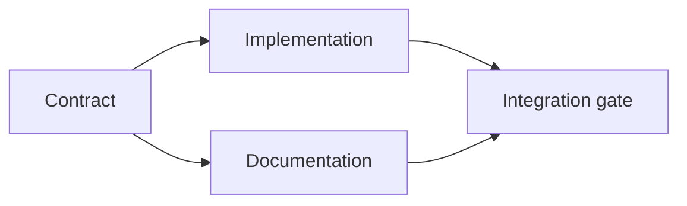

# सबूतों के आधार पर एक निष्पादन योजना बनाएं

> एक योजना एक सुंदर टू-डू सूची नहीं है यह एक निर्भरता ग्राफ है जिसमें प्रत्येक परिवर्तन का एक कारण है और प्रत्येक टर्मिनल नोड का प्रमाण है।

**Type:** Learn + Build
**Languages:** Python (stdlib)
**Prerequisites:** Phase 14 lesson 43
**Time:** ~65 minutes

## सीखने के लक्ष्य

- एक कार्य फ्रेम को सबूत और प्रमाण के साथ कार्य आइटम में परिवर्तित करें।
- प्रोसा अनुक्रम के बजाय निर्भरता के रूप में मॉडल क्रम।
- संपादन से पहले गायब तथ्यों, अज्ञात निर्भरताओं और चक्रों का पता लगाएं।
- अलग कदम जो एक साथ चल सकते हैं और कदम जो इंतजार करना होगा।

## एजेंट की योजनाएँ क्यों विफल रहती हैं

कमजोर योजनाओं भविष्य में अनुरोध दोहराएंः

1. एपीआई अद्यतन.
2. परीक्षण जोड़ें।
3. दस्तावेज अद्यतन करें।

उस सूची में कुछ भी नहीं कहता है कि क्या पाया गया था, क्यों उन फ़ाइलों सही हैं, कौन सा अनुबंध पहले बदलता है, या एक साथ क्या हो सकता है। एक एजेंट हर कदम का पालन कर सकता है और फिर भी पुनः काम कर सकता है।

एक मजबूत योजना प्रत्येक कार्य बिंदु के लिए पांच प्रतिबद्धताओं को शामिल करती हैः

| Commitment | Purpose |
|---|---|
| Identifier | Stable reference for dependencies and handoff |
| Change | The smallest behavior or contract change |
| Evidence | Repository facts that justify the change |
| Dependencies | Work that must be true first |
| Proof | The exact check that closes the item |

## अनुबंध को लागू करने से पहले योजना बनाएं

जब कई सतहें एक ही व्यवहार पर निर्भर करती हैं, तो पहले व्यवहार को परिभाषित करें। परीक्षण, कार्यान्वयन, प्रलेखन और एकीकरण फिर चार संस्करणों का आविष्कार करने के बजाय एक अनुबंध साझा कर सकते हैं।



ग्राफ सुरक्षित समवर्तीता का खुलासा करता है। अनुबंध तय होने के बाद कार्यान्वयन और प्रलेखन एक साथ आगे बढ़ सकते हैं। एकीकरण दोनों का इंतजार करता है।

## सबूत योजना बदलते हैं

भंडारण साक्ष्य सजावट नहीं है। यह काम को बदलने में सक्षम होना चाहिएः

- एक मौजूदा सहायक एक नियोजित नए अमूर्त को हटा देता है।
- एक संगतता परीक्षण एक प्रवास कदम को मजबूर करता है।
- एक तैनाती प्रतिबंध एक स्कीम परिवर्तन को दूसरे कार्य में ले जाता है।
- सार्वजनिक प्रतिक्रिया प्रकार कार्यान्वयन और प्रलेखन के क्रम को बदलता है।

यदि सबूत योजना को नहीं बदल सकते हैं, तो यह शायद उस निर्णय के लिए सबूत नहीं है।

## विराम के लिए डिज़ाइन

एक पुनः शुरू करने योग्य योजना में कार्य वस्तुएं इतनी छोटी होती हैं कि एक और सत्र निर्धारित कर सकता हैः

- कौन सा आइटम पूरा है;
- किस सबूत से निकला;
- किस कलाकृतियों में बदलाव हुआ है;
- कौन सी निर्भरता अब अनब्लॉक की गई है;
- अगले सुरक्षित आइटम क्या है।

केवल चैट के अंदर के चेकबॉक्स में ही स्टेट को कोड न करें। प्लान को काम के बगल में स्टोर करें।

## योजना की वैधता

योजना को निष्पादन से पहले अस्वीकार करें जबः

- पहचानकर्ता दोहराया जाता है;
- किसी कार्य वस्तु में कोई प्रमाण नहीं है;
- किसी कार्य वस्तु के पास कोई प्रमाण नहीं है;
- किसी निर्भरता का नाम अज्ञात वस्तु का नाम है;
- ग्राफ में एक चक्र होता है;
- पहले अपरिवर्तनीय कार्य प्रासंगिक अनिश्चितता को हल करने से पहले होता है।

पहले पांच चेक यांत्रिक हैं, अंतिम में न्याय की आवश्यकता होती है और उन्हें स्पष्ट रूप से बुलाया जाना चाहिए।

## इसे बनाओ

`code/main.py`मॉडल कार्य आइटम, उनकी रसीदों को मान्य करता है, एक टॉपलॉजिकल क्रम के साथ निष्पादन तरंगों की गणना करता है, और लिखता है `outputs/evidence-plan.json`. .

दौड़ें:

```bash
python3 code/main.py
python3 -m unittest discover code/tests -v
```

उदाहरण में तीन लहरें उत्पन्न होती हैं। अनुबंध परिभाषा पहले चलती है। कार्यान्वयन और प्रलेखन एक साथ चलते हैं। एकीकरण गेट आखिरी चलता है।

## इसे एक कोडिंग एजेंट के साथ उपयोग करें

एजेंट से फ़ाइलों को बदलने से पहले योजना तैयार करने के लिए कहें। तीन चीजों के लिए योजना की समीक्षा करेंः

1. प्रत्येक पथ और व्यवहार का दावा एक भंडार रसीद है।
2. प्रत्येक वस्तु में एक स्पष्ट पूर्णता प्रमाण है।
3. ग्राफ महंगे या अपरिवर्तनीय काम को तब तक देरी करता है जब तक कि उस पर निर्भर अनिश्चितता का समाधान नहीं हो जाता।

योजना को मंजूरी दें, सावधानी बरतने का कोई अस्पष्ट वादा नहीं।

## व्यायाम

1. एक प्रवासन वस्तु जोड़ा जाए जिसमें स्पष्ट मानव अनुमोदन की आवश्यकता हो।
2. एक चक्र बनाएं और इसके पीछे छिपे हुए उत्पाद असहमति की व्याख्या करें।
3. एक आइटम को विभाजित करें जिसमें दो सबूत आदेश हैं।
4. एक कार्य आइटम जो मौजूदा शाखाओं में से किसी को छूने के बिना दूसरी लहर में चलाया जा सकता है जोड़ें।
5. JSON को सत्य के स्रोत के रूप में रखते हुए योजना को मार्कडाउन के रूप में प्रस्तुत करें।

## आगे पढ़ना

- [Nuseibeh and Easterbrook, Requirements Engineering: A Roadmap](https://www.cs.toronto.edu/~sme/papers/2000/ICSE2000.pdf), लक्ष्य, विनिर्देश, सहमति और विकास के बीच पुनरावर्ती संबंध के लिए।
- [Barry Boehm, A Spiral Model of Software Development and Enhancement](https://dl.acm.org/doi/10.1145/12944.12948), एक निश्चित रैखिक अनुक्रम के बजाय जोखिम समाधान के आसपास विकास को क्रमबद्ध करने के लिए।

## जो आप रखते हैं

रखो`outputs/evidence-plan.json`यह अगले पाठ में प्रतिनिधि अनुबंध बन जाता है।
