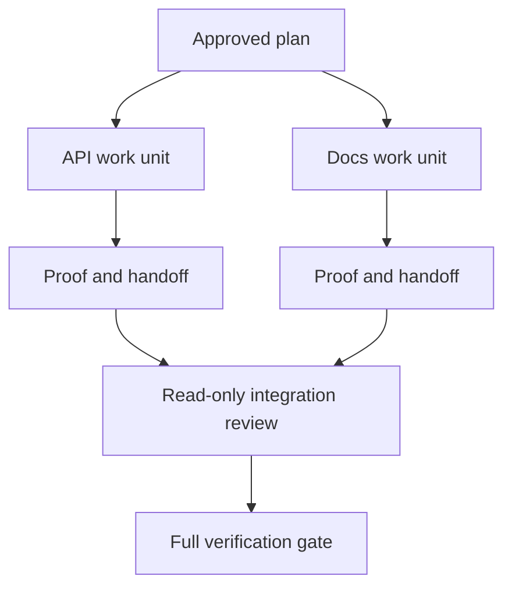

# डेलिगेट एजेंट आइसोलेशन और मर्जर कॉन्ट्रैक्ट्स के साथ काम करता है

> समानांतर एजेंट केवल तभी दीवार समय बचाते हैं जब काम स्वतंत्र होता है। अन्यथा वे एक स्पष्ट कार्य को तेजी से विफलता दर के साथ समन्वय समस्या में बदल देते हैं।

**Type:** Learn + Build
**Languages:** Python (stdlib)
**Prerequisites:** Phase 14 lessons 39 and 44
**Time:** ~70 minutes

## सीखने के लक्ष्य

- यह तय करें कि क्या वास्तविक स्वतंत्रता से प्रतिनिधिमंडल को उचित ठहराया जाता है।
- प्रत्येक कार्यकर्ता को विशेष फ़ाइल स्वामित्व और स्पष्ट प्रमाण दें।
- निर्भरता से गणना निष्पादन तरंगों।
- एजेंट काम को सुरक्षित रूप से जोड़ने के लिए एक विलय अनुबंध डिजाइन करें।

## समानांतरता परीक्षण

अधिक एजेंट उपलब्ध होने के कारण प्रतिनिधि न करें। यदि इनमें से कम से कम एक सच हैः

- दो जांच अलग-अलग अज्ञात प्रश्नों का स्वतंत्र रूप से उत्तर दे सकती है;
- दो कार्यान्वयन अलग-अलग फाइल और अनुबंधों का मालिक हैं;
- एक समीक्षक बिना किसी परिवर्तन के एक पूर्ण कलाकृतियों की जांच कर सकता है;
- स्थानीय कार्य जारी रहते हुए एक धीमी बाहरी जांच चल सकती है।

एजेंटों को एक ही फ़ाइलों, एक ही हल नहीं हुआ निर्णय, या एक ही परिवर्तनशील वातावरण की आवश्यकता होने पर कार्य क्रमबद्ध रखें।

## एक कार्य इकाई एक अनुबंध है

प्रत्येक आवंटित इकाई को निम्नलिखित आवश्यकताएं होती हैंः

| Field | Meaning |
|---|---|
| Goal | One observable result |
| Owner | One accountable worker |
| Paths | Exclusive write ownership |
| Dependencies | Completed units required before starting |
| Proof | Exact evidence returned to the integrator |
| Handoff | Files changed, decisions made, remaining risk |

बैकएंड को संभालें यह एक कार्य इकाई नहीं है. डूपलेट चेक इन करें `app/accounts.py`और ध्यान केंद्रित खाता परीक्षण के साथ यह साबित है।

## अलगाव के तीन स्तर हैं

1. **Filesystem isolation:**अलग-अलग कार्यवृक्ष या रेत बॉक्स आकस्मिक साझा संपादन को रोकते हैं।
2. **Ownership isolation:**अनुबंध दो श्रमिकों को एक ही पथ को जानबूझकर संपादित करने से रोकते हैं।
3. **State isolation:**अलग लॉग और आउटपुट एक कार्यकर्ता को दूसरे कर्मचारी के सबूतों को ओवरराइट करने से रोकते हैं।

फ़ाइल सिस्टम अलगाव स्वामित्व को हल नहीं करता है। दो स्वच्छ कार्यवृक्ष अभी भी परस्पर विरोधी डिजाइन उत्पन्न कर सकते हैं। विलय अनुबंध को काम शुरू होने से पहले साझा इंटरफ़ेस को हल करना चाहिए।



## एकीकरणकर्ता काम को पुनर्निर्माण नहीं करता

इंटीग्रेटर को:

1. प्रत्येक हस्तान्तरण के लिए निर्धारित दायरा के अनुरूप होने की पुष्टि करें;
2. केवल श्रमिक के सारांश को नहीं, बल्कि प्रमाण का उत्पादन पढ़ें;
3. निर्भरता क्रम में परिवर्तनों को जोड़ना;
4. पूर्ण क्रॉस-इकाई गेट चलाएं;
5. छिपे हुए दायरे के विस्तार को अस्वीकार करना;
6. संघर्ष को नए निर्णय के रूप में रिकॉर्ड करें, मौन संपादन नहीं।

यदि एकीकरण के लिए एक कार्यकर्ता के अधिकांश परिणामों को फिर से लिखना आवश्यक है, तो मूल विघटन गलत था।

## मानव और एजेंट की भूमिका

प्रतिनिधिमंडल मानव न्याय को नहीं हटाता है। मानव अभी भी सार्वजनिक व्यवहार, जोखिम, प्राधिकरण या अपरिवर्तनीय लागत को बदलने वाले विकल्पों का मालिक है। एजेंट सीमित जांच, कार्यान्वयन, सत्यापन और समीक्षा का मालिक हो सकते हैं।

यह एक कैलिब्रेटेड स्वायत्तता हैः प्रणाली जब सबूत और रिलैक मजबूत होते हैं तो स्वतंत्रता प्रदान करती है, और जब परिणाम उच्च होते हैं तो एक चेक पॉइंट की आवश्यकता होती है।

## इसे बनाओ

प्रयोगशाला पथ ओवरलैप की जांच करता है, निर्भरता की पुष्टि करता है, सुरक्षित निष्पादन तरंगों की गणना करता है, और लिखता है `outputs/delegation-plan.json`. .

दौड़ें:

```bash
python3 code/main.py
python3 -m unittest discover code/tests -v
```

डॉक्स इकाई को मालिक के लिए बदलें `app/`. योजना को अवरुद्ध होना चाहिए क्योंकि उस माता-पिता पथ एपीआई इकाई ओवरलैप करता है.

## व्यायाम

1. वास्तविक परिवर्तन को दो स्वतंत्र कार्य इकाइयों और एक एकीकृत करने वाले में विघटित करें।
2. प्रस्तावित समानांतर विभाजन को ढूंढें जो केवल स्वतंत्र दिखता है। साझा निर्णय बताएं।
3. एक केवल-पढ़ने वाला शोधकर्ता जोड़ा जाए जिसका आउटपुट एक तथ्यात्मक तालिका है।
4. एक विलय गेट जो सभी इकाई अनुबंधों के साथ अंतिम बदल फ़ाइल सेट की जांच करता है जोड़ें.
5. ऐसे कर्मचारी के लिए रद्द करने का नियम निर्धारित करें, जिसकी निर्भरता अमान्य हो जाती है।

## आगे पढ़ना

- [Reid Smith, The Contract Net Protocol](https://doi.org/10.1109/TC.1980.1675516), वितरण कार्य आवंटन और परिणाम रिपोर्टिंग के लिए एक प्रारंभिक औपचारिक उपचार के लिए।
- [Eric Horvitz, Principles of Mixed-Initiative User Interfaces](https://dl.acm.org/doi/10.1145/302979.303030), यह तय करने के लिए कि स्वचालितता को कब कार्य करना चाहिए और जब इसे नियंत्रण को किसी व्यक्ति को वापस देना चाहिए।

## जो आप रखते हैं

रखो`outputs/delegation-plan.json`यह रिकॉर्ड करता है कि विभाजन सुरक्षित क्यों है, प्रत्येक पथ का मालिक कौन है, और एकीकृत होने के लिए क्या सबूत प्राप्त करना चाहिए।
